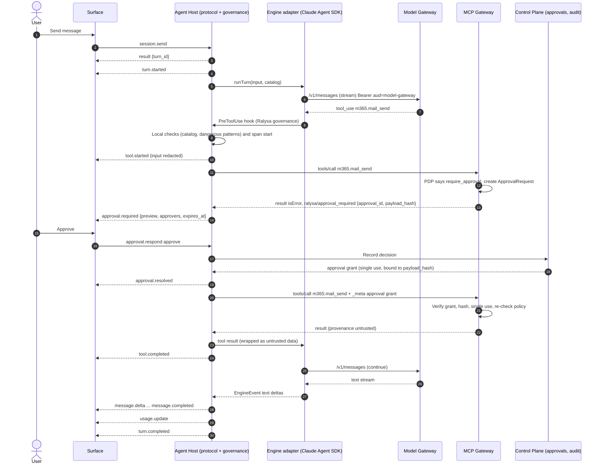
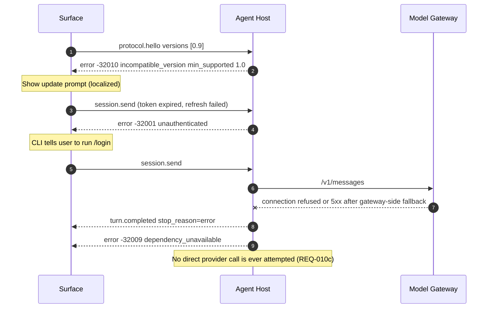
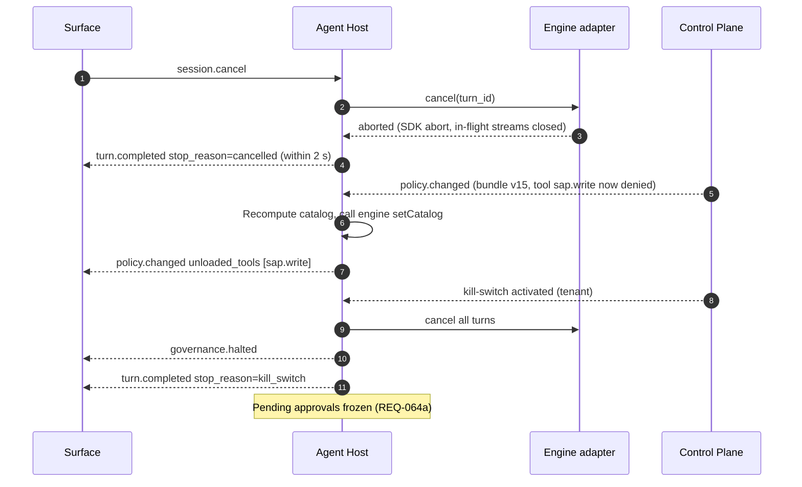
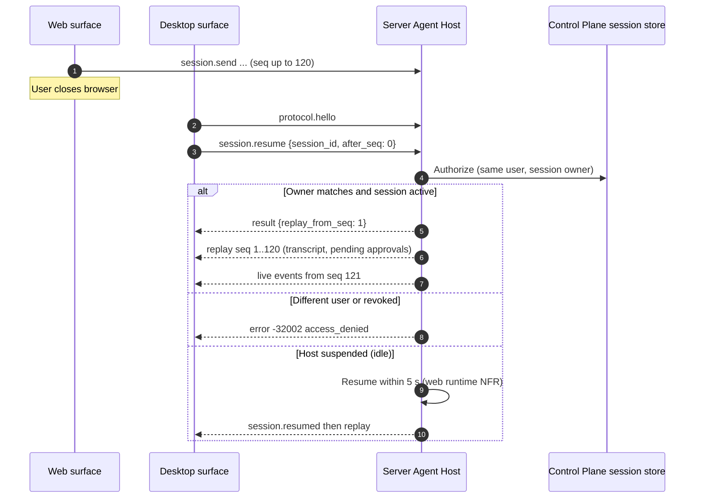

# Agent Protocol and Agent Host boundary

> Phase 3 · Owner: architect · Status: **Proposed for G3** · Last updated: 2026-09-25
> Spec: §4 D2/D8, §5.1, §6.2, §6.12, §14 (SDK dependency risk) · PRD: REQ-008 to REQ-015, REQ-021, REQ-022, REQ-056, REQ-059, REQ-062, REQ-064, REQ-071, REQ-072 · Market: MA-109, summary top risk 3
> Phase 0 briefs: F-003 (Agent Host + protocol core) and F-005 (CLI), cross-checked in the G3 consistency review ([consistency-review.md](consistency-review.md)). Phase 0 subset: `protocol.hello`, `session.create`, `session.send`, `session.cancel`, `message.delta`, `tool.started`, `tool.completed`, `turn.completed`, `error` (F-003 AC-9); the rest arrives with F-017.

## 1. Purpose

The Agent Protocol is the only contract between the three surfaces (CLI, Desktop, Web) and the Agent Host. It must:

1. Let one UI codebase and one CLI drive a local host (CLI/Desktop) or a server host (Web) the same way (spec §4 D8).
2. Keep the agent engine replaceable. Today the engine is the Claude Agent SDK (spec §4 D2); the protocol must not carry any engine-vendor type (REQ-015a, spec §14).
3. Carry governance signals (approvals, denials, usage, kill-switch, policy changes) as first-class messages, so every surface shows them the same way.

**Transport** is decided in [ADR-0004](adr/0004-agent-protocol-transport-and-schema.md): JSON-RPC 2.0 over WebSocket for the remote host, stdio of a child process (default) or an OS-ACL-protected local IPC channel for the local host, and no listening TCP port on user devices. The message model below is expressed as JSON-RPC 2.0 requests, responses and notifications ([JSON-RPC 2.0](https://www.jsonrpc.org/specification), accessed 2026-09-25) and is the same on every transport.

## 2. Component responsibilities

| Component | Package / service | Responsibilities |
|---|---|---|
| **Protocol schema** | `packages/protocol` | The published **JSON Schema 2020-12 is the normative wire contract**, authored in zod and generated from it; TypeScript types and runtime validators come from the same zod source; CI fails if the committed JSON Schema and zod drift (one rule, stated in ADR-0004 decision 5 and ADR-0012 decision 1). Version constants, error codes, capability flags. Client and server stubs. No engine or model-vendor types. |
| **Protocol client** | `packages/protocol` (used by `apps/cli`, `apps/desktop`, `apps/web`) | Connect, negotiate version, send requests, dispatch notifications, reconnect and resume by sequence number. |
| **Protocol server** | `services/agent-host/src/protocol` | Validate every inbound message against the schema, authenticate the connection, map requests to the Session Manager, stream notifications with sequence numbers. |
| **Session Manager** | `services/agent-host/src/session` | Session lifecycle, turn queue (one active turn per session), cancellation, event log for resume, persistence of transcript metadata to the Control Plane. |
| **Governance layer** | `services/agent-host/src/governance` | Engine-independent. Builds the per-identity catalog (tools, skills, models) from the Control Plane effective-permissions call; runs Ralysa hooks (pre-tool, post-tool, pre-model, session start/end); turns gateway `approval_required` results into `approval.required`; emits audit and OpenTelemetry spans; enforces kill-switch and policy-change notifications. |
| **Engine port** | `services/agent-host/src/engine/port.ts` | Ralysa-owned interface the Session Manager calls: `startSession`, `runTurn(input) → AsyncIterable<EngineEvent>`, `cancel`, `compact`, `setCatalog`, `resolvePermission`. `EngineEvent` is a Ralysa type. |
| **Claude Agent SDK adapter** | `services/agent-host/src/engine/claude/` | The **only** code that imports `@anthropic-ai/claude-agent-sdk`. Maps EnginePort calls to SDK `query()` options, registers Ralysa hooks as SDK `PreToolUse`/`PostToolUse`/`SessionStart`/`SessionEnd`/`PreCompact` callbacks, maps SDK messages to `EngineEvent`. |
| **Mock engine** | `services/agent-host/src/engine/mock/` | Scripted engine used by the conformance suite and by REQ-015(b). |
| **Model Gateway / MCP Gateway clients** | `services/agent-host/src/gateways` | The host reaches models only through the Model Gateway and remote tools only through the MCP Gateway (spec §6.2.1). |

## 3. Message catalogue

### 3.1 Envelope conventions

- **Every JSON-RPC message** (request, response, notification, error) carries a `_meta` object, following the MCP `_meta` convention: in `params` for requests and notifications, in `result` for responses, in `error.data` for errors.

  ```json
  "_meta": {
    "protocol": "1.0",
    "trace": { "traceparent": "00-4bf92f3577b34da6a3ce929d0e0e4736-00f067aa0ba902b7-01", "tracestate": "…" }
  }
  ```

  `protocol` is the version negotiated in `protocol.hello` (F-003 AC-8: every message declares its version). `trace` is the W3C trace context ([W3C Trace Context](https://www.w3.org/TR/trace-context/)); it is what joins surface, host, gateway and provider spans and the audit `trace_id` (observability-audit.md §8, ADR-0024). `tracestate` is optional. `_meta` is never used to carry identity; identity comes only from the connection's token binding.
- Requests carry `params.session_id` where relevant and `params.client_request_id` (idempotency key for `session.send`, `approval.respond`).
- Every notification also carries `session_id`, `turn_id` (when inside a turn), `seq` (monotonic per session, starting at 1) and `ts`.
- Payloads that include tool inputs/outputs are **redacted per policy before they leave the host** (REQ-011d). Redaction obligations come from the gateway decision.
- Text is UTF-8; direction is not encoded in the protocol (the UI decides RTL/LTR per REQ-107).
- Unknown fields are ignored; unknown notification types are ignored by clients and logged.

### 3.2 Connection and version

| Method | Direction | Params | Result / notes |
|---|---|---|---|
| `protocol.hello` | client → host (first message) | `client: {name, version, surface}`, `protocol: {versions: ["1.3", "1.2"]}`, `capabilities: [...]`, `connect_ticket?` (remote hosts only: single-use, ≤ 60 s, minted by the BFF for the cookie session; never in a URL; ADR-0004 decision 3) | `{protocol_version, host: {engine_family: "opaque-string", version}, capabilities, limits}`. On no overlap: error `-32010 incompatible_version` with `data.min_supported` (REQ-012c). `engine_family` is informational text only, never branched on by clients. |
| `auth.update` | client → host (local mode only) | `token_provider_ready` or rotated handle | Local host pulls tokens from `packages/auth` over IPC; this only signals rotation. Server mode never uses it (the host gets delegated tokens by token exchange, see identity-and-policy.md §4). |

### 3.3 Requests (client → host)

| Method | Spec | Params (main) | Result |
|---|---|---|---|
| `session.create` | §6.2.2 | `workspace_id`, `profile_hint?`, `model_preference?`, `layout?`, `locale` | `{session_id, catalog: {models[], skills[], tools_index[]}, limits, data_tier}` (catalog = effective permissions, REQ-022) |
| `session.resume` | §6.2.2 | `session_id`, `after_seq` | `{session_state, replay_from_seq}` then replayed notifications. Handoff Desktop ↔ Web only for remote hosts (REQ-009a). |
| `session.send` | §6.2.2 | `session_id`, `client_request_id`, `content[]` (text, attachment refs uploaded out-of-band) | `{turn_id}`; the turn streams as notifications |
| `session.cancel` | §6.2.2 | `session_id`, `turn_id?` | `{cancelled: true}` ≤ 2 s (REQ-011c) |
| `session.compact` | §6.2.2 | `session_id` | `{accepted}`; followed by `session.compacted` |
| `session.close` | *new* | `session_id` | Ends the session; triggers session-end hooks |
| `approval.respond` | §6.2.2 | `approval_id`, `decision: approve\|reject\|edit`, `edited_payload?`, `client_request_id` | `{status}`. Forwarded to the Control Plane approvals service; the host never self-approves (ADR-0013). |
| `skill.invoke` | §6.2.2 | `session_id`, `skill_id`, `arguments` | `{turn_id}` |
| `catalog.get` | *new* | `session_id` | Current catalog (after policy changes) |

### 3.4 Notifications (host → client)

| Event | Spec | Payload (main) |
|---|---|---|
| `turn.started` / `turn.completed` | *new* | `turn_id`, `stop_reason` (end, cancelled, error, budget, kill_switch), `usage_summary` |
| `message.delta` | §6.2.2 | `turn_id`, `message_id`, `delta: {type: text, text}`; `labels: ["ai_generated"]` (REQ-065) |
| `message.completed` | *new* | `message_id`, `model: {id, provider_label, inference_region}` (which model answered, REQ-031a) |
| `tool.started` | §6.2.2 | `tool_call_id`, `tool: {id, display_name, connector_id}`, `input_redacted`, `operation_class` |
| `tool.progress` | *new* | `tool_call_id`, `progress`, `message?` |
| `tool.completed` | §6.2.2 | `tool_call_id`, `outcome` (ok, error, denied), `output_redacted` or `artifact_ref`, `provenance: {trust: untrusted, source}`, `flags: [injection_suspected]` |
| `approval.required` | §6.2.2 | `approval_id`, `tool_call_id`, `action_class`, `preview` (exact payload or diff), `payload_hash`, `approvers[]`, `expires_at`, `influenced_by_untrusted: bool` |
| `approval.resolved` | *new* | `approval_id`, `decision`, `decided_by`, `decided_on_surface` |
| `access.denied` | §6.2.2 | `resource`, `operation`, `reason_code`, `request_url` (one-time-code deep link, REQ-069) |
| `usage.update` | §6.2.2 | `tokens_in/out`, `cache_read/write`, `credits_used`, `budget_remaining`, `cap_state` (ok, soft, hard) |
| `session.compacted` | §6.2.2 | `before_tokens`, `after_tokens`, `preserved: {pending_approvals, task_list}` (REQ-056b) |
| `artifact.created` | §6.2.2 | `artifact_id`, `kind`, `name`, `size`, `storage_ref`, `labels` |
| `policy.changed` | *new* (REQ-021c) | `unloaded_tools[]`, `added_tools[]`, `policy_version` |
| `session.suspended` / `session.resumed` | *new* (REQ-013d) | `reason` |
| `governance.halted` | *new* (REQ-064, ADR-0025) | `scope` (tenant, department, pack, agent), `scope_id`, `epoch` (governance epoch), `reason_category`, `message_key` (i18n, en/ar), `since`. Sent when a kill-switch covers the session; the host cancels running turns (`turn.completed stop_reason=kill_switch`) and pending approvals are frozen. Also sent with `reason_category=governance_stale` when the host cannot confirm governance state (rule G-1/G-6, identity-and-policy.md §5.6) |
| `governance.resumed` | *new* | `scope`, `scope_id`, `epoch`. New turns are accepted again; frozen approvals resume their own expiry |
| `error` | — | JSON-RPC style `code`, `message_key`, `data` |

"*new*" items are additions proposed here to satisfy PRD acceptance criteria; they are additive (minor version).

### 3.5 Error codes

JSON-RPC reserves −32768…−32000 for protocol errors; Ralysa uses −32001…−32099 (server-defined range):

| Code | Name | When |
|---|---|---|
| −32001 | `unauthenticated` | Missing/expired token, revoked session |
| −32002 | `access_denied` | Policy or entitlement deny (paired with `access.denied`) |
| −32003 | `budget_exceeded` | Hard cap reached (REQ-079c) |
| −32004 | `rate_limited` | `data.retry_after_s` (REQ-031c) |
| −32005 | `service_halted` | Kill-switch active, or governance state stale (paired with `governance.halted`) |
| −32006 | `session_not_found` | Unknown or expired session |
| −32007 | `turn_in_progress` | `session.send` while a turn is running (clients queue) |
| −32008 | `approval_expired` | Responding after `expires_at` |
| −32009 | `dependency_unavailable` | Model Gateway, MCP Gateway or Control Plane unreachable |
| −32010 | `incompatible_version` | No common major version (`data.min_supported`) |
| −32011 | `invalid_payload` | Schema validation failure |
| −32012 | `audit_unavailable` | The audit intent could not be committed, so the model or tool call was not made (ADR-0022; F-003 AC-13, F-004 AC-6, F-005 AC-11 "audit unavailable") |

## 4. Versioning

- **Scheme:** the schema package uses semver `MAJOR.MINOR.PATCH`, independent of app versions; the wire protocol version is `MAJOR.MINOR` and appears in `_meta.protocol` on every message (ADR-0004 decision 4). Published in `packages/protocol` and as a JSON Schema bundle.
- **Minor:** additive only (new optional fields, new notifications, new methods behind capability flags). Old clients ignore what they do not know.
- **Major:** removal or semantic change. Hosts support the current and previous major for at least 6 months *(proposed)* so Desktop/CLI users who have not updated keep working against a new server host.
- **Negotiation:** `protocol.hello` picks the highest common version. No overlap → `incompatible_version` with the minimum supported version (REQ-012c).
- **Capabilities:** optional features (e.g. `artifacts.inline_preview`, `approval.edit`) are flags so a surface can hide what the host does not support.
- **Conformance suite:** one suite in `packages/protocol/conformance` covers every method and event (REQ-012a). CLI, Desktop and Web clients and every host implementation (Claude adapter, mock) must pass it (REQ-012b, REQ-015b).
- **Vendor-neutrality check:** a CI rule fails if any schema or generated type references an engine or model-vendor name or imports from an engine package (REQ-015a).

## 5. Main path and failure paths

### 5.1 Turn with a tool call and an approval



The engine sees an approval wait as a slow tool call. The approval grant is issued by the Control Plane and verified by the MCP Gateway, so a modified local host cannot approve its own actions (ADR-0013).

### 5.2 Version mismatch, auth failure and dependency failure



### 5.3 Cancel, policy change and kill-switch during a turn



### 5.4 Resume and handoff (remote host)



## 6. Keeping the Claude Agent SDK inside `services/agent-host`

### 6.1 Rules

1. Only `services/agent-host/src/engine/claude/**` may import `@anthropic-ai/claude-agent-sdk`. Enforced by an ESLint `no-restricted-imports` rule and a dependency-cruiser (or equivalent) check in CI; `packages/*` and `apps/*` fail the build if they depend on it.
2. `EngineEvent`, `EngineToolCall`, `EngineUsage` and all catalog types are Ralysa types in `engine/port.ts`. The adapter translates both directions.
3. Governance never depends on SDK behaviour for correctness. SDK hooks are used as **interception points** that call the Ralysa governance layer; authoritative decisions are made by Ralysa code and by the gateways. If the engine is swapped, the same governance layer is wired into the new engine's interception points.
4. Tools are defined by Ralysa (MCP tool definitions from the MCP Gateway catalog plus Ralysa built-ins). The adapter registers them with the SDK (external MCP connection to the MCP Gateway, or in-process SDK MCP server for Ralysa built-ins such as the memory tool) ([Agent SDK custom tools](https://code.claude.com/docs/en/agent-sdk/custom-tools), accessed 2026-09-25).
5. The model endpoint is always the Model Gateway. The adapter sets the SDK's gateway base URL and a short-lived Ralysa token ([LLM gateway connect](https://code.claude.com/docs/en/llm-gateway-connect), accessed 2026-09-25). The Model Gateway exposes the Anthropic Messages format for this engine (model-gateway.md §3).
6. Session transcripts are stored in Ralysa's format (Control Plane session store), not in the SDK's internal format, so a different engine can resume a Ralysa session from its transcript (best effort; exact replay is not promised across engines).

### 6.2 SDK configuration that governance relies on

| Setting | Value | Why |
|---|---|---|
| Setting sources | Empty (no user or project settings files) | The SDK loads shell-command hooks and permission rules from settings files when setting sources are enabled, which is the default ([Agent SDK hooks](https://code.claude.com/docs/en/agent-sdk/hooks), accessed 2026-09-25). Org hooks must not be disabled or supplemented by user config (REQ-059c). |
| Built-in tools | Allow-list per catalog (`tools` option); denied built-ins removed by bare name so the model never sees them | Hidden, not blocked (REQ-022). Bare-name deny rules remove the tool from context ([Agent SDK permissions](https://code.claude.com/docs/en/agent-sdk/permissions), accessed 2026-09-25). |
| `PreToolUse` hook | Ralysa governance callback on every tool (no matcher) | Hooks run before every other permission step, and a hook deny applies even in `bypassPermissions` mode (same source). Hook errors are treated as deny (fail closed, REQ-059d). |
| `PostToolUse` hook | Ralysa governance callback | Secret/PII scan, untrusted-content wrapping via `updatedToolOutput`, audit (same source). |
| Permission mode | `default` or `dontAsk`; never `bypassPermissions` | `bypassPermissions` auto-approves everything not blocked earlier (same source). |
| `canUseTool` | Bridges to local approval UX only for local built-in tools | Remote tools are approval-gated at the MCP Gateway; the callback is not relied on for them. |
| Tool search / deferred loading | On | Deferred tool loading (REQ-055). |
| Non-essential traffic, telemetry, auto-update | Disabled; the only network destinations are the Model Gateway, MCP Gateway and Control Plane | F-003 AC-1 (no provider connections) and security SR-24 / TM-33. The exact settings for the pinned SDK version are verified at `/design F-003` and asserted by the network-capture test. |
| Tool subprocess environment | Scrubbed: no Ralysa token or other credentials inherited by terminal commands | Security SR-23 / TM-31, P0-7 |

These settings are asserted by adapter unit tests so an SDK upgrade that changes defaults fails CI.

### 6.3 Engine swap test

REQ-015(b): the mock engine behind the same EnginePort passes the protocol conformance suite, and CLI, Desktop and Web run a scripted session against it unchanged. A second real engine (e.g. an open-source agent loop targeting OpenAI-compatible local models) is **not** in Phase 1 scope, but the port is sized for it (see ADR-0012 and model-gateway.md §9 on non-Claude models).

## 7. Local mode vs server mode

| Aspect | Local mode (CLI, Desktop) | Server mode (Web) |
|---|---|---|
| Process | CLI: in-process or child process of the CLI. Desktop: child process of the Electron main process. | Per user/workspace container in the tenant region (Phase 1: isolated host without shell, DV-16; Phase 2: Workspace Runtime sandbox, REQ-014) |
| Transport to surface | stdio of the child process (default for CLI and Desktop), or a Unix domain socket / named pipe restricted by OS ACLs plus a per-launch secret. No TCP listener (ADR-0004; F-003 AC-7) | WebSocket through the Session Router: BFF cookie + `Origin` check on upgrade, single-use connect ticket in `protocol.hello` (ADR-0004 decision 3) |
| Identity | Access tokens from `packages/auth` token provider (user's own session) | Delegated tokens by RFC 8693 token exchange: `sub` = user, `act` = host instance |
| Trust | User-controlled machine. Advisory for enterprise resources; gateways re-decide every model and remote-tool call. Authoritative only for local file and terminal side effects. | Ralysa-controlled. Authoritative for everything inside the sandbox. |
| Local tools | File read/edit, terminal (policy-controlled; Code workspace), local stdio MCP servers (must be registered, hash-pinned; decisions from PDP decision API) | Phase 1: none (no shell, no code exec). Phase 2: sandbox tools under egress allow-list. |
| Audit | Tool/model audit written by gateways; local-tool intent posted to the Control Plane's client-attested ingestion path before the tool runs (`attestation=client`, actor forced to the token subject; fail closed if unreachable) (observability-audit.md §3.3) | Server host writes through the service path (`attestation=server`), plus runtime audit |
| Session resume | Same device only | Any surface of the same user (handoff) |
| Offline | Not supported for model or tool calls | n/a |

## 8. Audit events emitted by the Agent Host

Envelope and two-phase naming as in [observability-audit.md §3](observability-audit.md) (canonical). Model-call and remote-tool-call audit records of record are written by the gateways; the host writes session, local-tool and approval-UX events and links everything with `trace_id`. The local host writes through the client-attested path (`attestation=client`); the server host through the service path. The F-003 brief's `tool.call`, `session.create` and `session.cancel` events map to the rows below (brief change BC-06).

| Event | Fields |
|---|---|
| `session.created` | session_id, workspace_id, surface, host_mode (local/server), protocol_version, client_version, engine_family, catalog_hash, policy_version, data_tier |
| `session.cancelled` (turn cancel) | session_id, turn_id, latency_ms |
| `session.resumed` | session_id, surface, after_seq, handoff_from_surface |
| `session.closed` | session_id, reason, turns, duration_ms |
| `session.compacted` | session_id, before_tokens, after_tokens, trigger (auto/manual) |
| `turn.completed` | session_id, turn_id, stop_reason, model_calls, tool_calls, tokens_in/out |
| `tool.call.requested` (`resource.type=local_tool`; the intent ack) | tool_call_id, tool (file_read, file_list, file_write, terminal, local_mcp:<id>), input_hash, decision, reasons[], cwd_hash |
| `tool.call.completed` (`resource.type=local_tool`; outcome success / error / cancelled) | tool_call_id, duration_ms, exit_code, output_size, secrets_redacted_count, pii_masked_counts{type:n} |
| `tool.call.denied` (`resource.type=local_tool`) | tool_call_id, tool, reason (not_enabled, outside_working_folder, policy) (F-003 AC-6) |
| `hook.failed` | hook (pre_tool/post_tool/pre_model/session), tool_call_id, error_class; outcome=denied (fail closed) |
| `approval.presented` | approval_id, surface, action_class, payload_hash |
| `protocol.version_rejected` | client_version, offered_versions[], min_supported |
| `catalog.changed` | session_id, policy_version, added[], removed[] |

## 9. NFR targets owned

| NFR | Target | Source |
|---|---|---|
| `session.cancel` stops the turn | ≤ 2 s | REQ-011c, REQ-001b |
| Approval card after pause | ≤ 2 s after `approval.required` | REQ-062a |
| Policy change visible to running sessions | ≤ 60 s (tools unloaded) | REQ-021c |
| Kill-switch halts new calls on all surfaces | ≤ 30 s | REQ-064a |
| Host-side overhead per event (validate, redact, sequence) | p95 ≤ 10 ms *(proposed)* | §12 latency |
| Server host resume | p95 < 5 s | §12 web runtime, REQ-013d |
| Trace coverage | 100 % of model and tool calls carry `trace_id` | REQ-072a |
| Conformance | 100 % of methods/events covered; all surfaces and hosts pass | REQ-012a/b |

## 10. ADR candidates

| ADR | Decision | Status |
|---|---|---|
| **ADR-0012** | Engine port + adapter boundary for the Agent Host; JSON Schema as protocol source of truth; governance outside the engine | Written, Proposed |
| ADR-0013 | Approvals enforced at gateways with payload-bound grants (host is UX only) | Written, Proposed |
| ADR-0004 | Protocol transport (JSON-RPC 2.0 over WebSocket / stdio / OS-ACL IPC), handshake, versioning, JSON Schema contract authored in zod | Referenced (stream A), Proposed |
| Future | Cross-engine transcript format and resume guarantees | Candidate |
| Future | Local host hardening (code signing, integrity attestation of the local host to gateways) | Candidate |

## 11. Open questions

| # | Question | Proposed default | Owner |
|---|---|---|---|
| PQ-1 | Should the local host process be separate from the CLI process (child) or in-process? Separate improves crash isolation and makes the Desktop and CLI hosts identical. This also answers F-005's "how the CLI launches or pairs with the local host". | Child process for both, talking over its stdio; only the parent holds the pipes, which satisfies F-003 AC-7 | Architect + developer (confirm at `/design F-003`) |
| PQ-2 | Support window for the previous protocol major version (6 months proposed)? | 6 months | Product owner |
| PQ-3 | Anthropic commercial terms for embedding the Agent SDK in a resold product (OQ-4) remain open; the port limits blast radius but does not remove the dependency. | Answer before Phase 0 build | Founder |
| PQ-4 | Do we promise session resume across engine versions (SDK upgrades) or only within one host version? | Within the same major host version; after upgrade, resume from Ralysa transcript summary | Architect |
| PQ-5 | Attachments: upload out-of-band to object storage with a ref in `session.send` (proposed) vs inline base64. | Out-of-band, size limit per REQ-004b | Solution designer |
| PQ-6 | ~~Phase 0 brief F-003 not reviewed in this pass.~~ **Closed** in the G3 consistency review: method names match; Phase 0 subset in the header; `_meta.protocol` covers AC-8; `audit_unavailable` added for F-005 AC-11. | — | Closed |

## References

All accessed 2026-09-25.

- JSON-RPC 2.0 specification: https://www.jsonrpc.org/specification
- JSON Schema 2020-12: https://json-schema.org/draft/2020-12
- Claude Agent SDK, hooks: https://code.claude.com/docs/en/agent-sdk/hooks
- Claude Agent SDK, permissions: https://code.claude.com/docs/en/agent-sdk/permissions
- Claude Agent SDK, custom tools: https://code.claude.com/docs/en/agent-sdk/custom-tools
- Claude Code, connect to an LLM gateway: https://code.claude.com/docs/en/llm-gateway-connect
- W3C Trace Context: https://www.w3.org/TR/trace-context/
