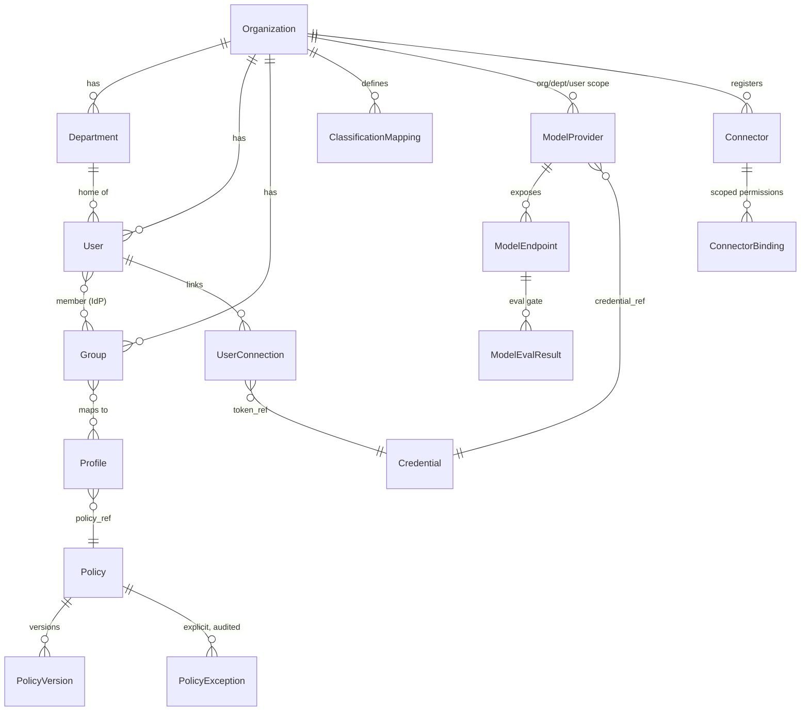
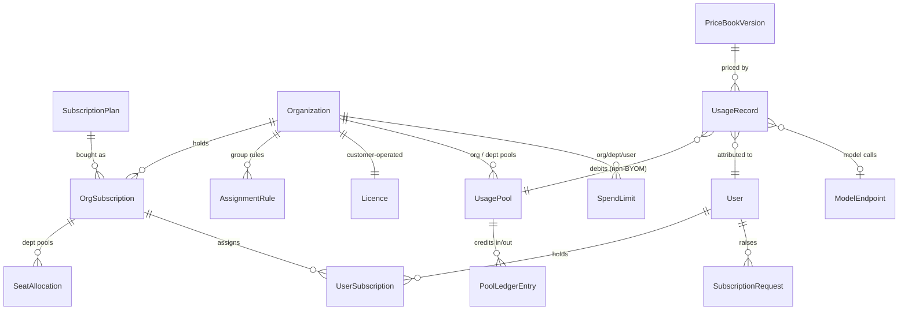
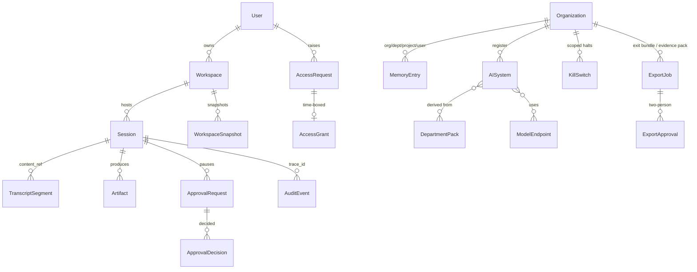
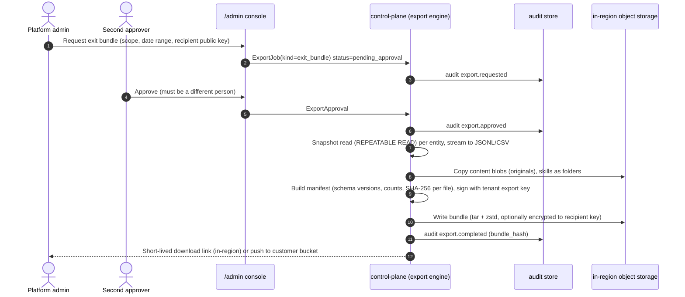

# Logical Data Model

> Phase 3 architecture · Owner: architect (stream C) · Status: **Proposed, for G3 review** · Last updated: 2026-09-25
> Sources: spec §6.9, §6.14, §6.15, §7.7, §8, §11; PRD REQ-023, REQ-028, REQ-030, REQ-032, REQ-049, REQ-050, REQ-064, REQ-070, REQ-071, REQ-076 to REQ-081, REQ-094, REQ-096, REQ-100; DV-3, DV-4, DV-5, DV-10, DV-12, DV-13.
> Physical schema, the tenancy isolation mechanism and the ORM/language are decided by stream A: TypeScript ([ADR-0001](adr/0001-services-language-typescript.md)) and one organization per deployment with `org_id` + PostgreSQL row-level security from Phase 0 ([ADR-0003](adr/0003-tenancy-and-isolation.md)); the Phase 4 SaaS mechanism gets its own ADR. This model holds for any of those choices.

## 1. Principles

1. **Every tenant-owned row carries `org_id`.** This is the tenancy key, whatever isolation mechanism the tenancy ADR picks. It makes isolation tests, exports and purges the same across SaaS, dedicated, on-prem and air-gapped. In single-tenant deployments `org_id` is a constant.
2. **Metadata in Postgres, content by reference.** Prompts, transcripts, artifacts, skill bodies, memory text over a size threshold, and export bundles live in object storage as `content_ref` plus `content_hash` (SHA-256). This lets content be retained, redacted or crypto-shredded separately from the metadata and the audit chain (see `observability-audit.md` §3).
3. **Secrets are never stored.** Only vault references (`credential_ref`, `token_ref`) are stored (spec §11 Credential; REQ-095).
4. **Region is a property of the organization, fixed at provisioning** (REQ-105b). Every store for that org lives in that region (REQ-096).
5. **Identifiers are UUIDv7** (time-ordered, which helps index locality and export ordering). Human-readable keys (`plan_id`, `profile.name`) are unique per `org_id`.
6. **Bilingual fields** hold user-visible names and descriptions as `{en, ar}` (REQ-048e, REQ-083d).
7. **The audit store is separate** from the operational database: a separate database or schema, insert-only grants and its own retention (see `observability-audit.md`).

## 2. Stores

| Store | Holds | System of record? | Region rule |
|---|---|---|---|
| Postgres, control plane (`cp`) | All entities in §4 except AuditEvent | Yes | Tenant region |
| Postgres, audit (`audit`) | AuditEvent, AuditSeal, AuditCheckpoint index | Yes | Tenant region |
| Object storage | Content blobs (transcripts, artifacts, skill and plugin packages, memory blobs, uploaded files), workspace snapshots, export bundles, WORM audit checkpoints | Yes, for content | Tenant region. The WORM bucket has object lock. |
| Redis | Entitlement cache, rate and budget counters, kill-switch flags, session routing | **No.** Rebuilt from Postgres. | Tenant region |
| Vault / KMS | Provider keys, user OAuth tokens, signing keys, CMKs | Yes, for secrets | Tenant region (per-cloud KMS, or Vault on-prem) |
| Trace store (OTel backend, optional Langfuse) | Spans, metrics | **No.** Telemetry, short retention. | Tenant region |
| Vector index (optional) | Embeddings and ACLs | No (derived) | Not in v1; pgvector-first in Phase 3 ([ADR-0007](adr/0007-indexed-search-v1.md)) |

## 3. Entity-relationship views

### 3.1 Identity, policy and classification



### 3.2 Subscriptions, usage and money



### 3.3 Work, governance and evidence



## 4. Entity catalogue

**PII class** (personal data under PDPPL, KSA PDPL and UAE PDPL):

- **N**: none.
- **W**: workforce identifiers (name, email, IdP subject, group membership).
- **C**: free content that may contain any personal data, including customer PII, depending on the data tier of the session or department.
- **S**: secret references only.

**Tier-bound** means the row or blob inherits the sensitivity tier (T1–T3) of the session or department that produced it, which drives masking, storage mode and retention.

Retention values marked *(p)* are proposals for G3. All are tenant-configurable within legal limits.

### 4.1 Spec §11 entities (fields added in **bold**)

| Entity | Key fields (spec §11 + additions) | Tenancy key | PII | Tier-bound | Default retention | Exit bundle |
|---|---|---|---|---|---|---|
| Organization | id, name, residency, settings, **region (immutable), deployment_model, regulated_segment flag, cmk_ref** | id | N | n/a | Life of contract | Yes |
| Department | id, org_id, name{en,ar}, sensitivity_tier, **national_classification_ceiling** | org_id | N | defines tier | Life of org | Yes |
| User | id, org_id, idp_subject, email, department_id, locale, **display_name, manager_ref (IdP attr, OQ-18), status, seat_weight** | org_id | W | no | Deprovisioned + 90 days, then pseudonymised *(p)*. Audit keeps the pseudonymous id. | Yes |
| Group | id, **org_id**, idp_group_id, name | org_id | W (membership) | no | Mirrors IdP | Yes |
| Profile | id, **org_id**, name, match_rules, policy_ref, default_layout, **runtime_profile** | org_id | N | no | Versions kept for the audit retention period | Yes |
| Policy / **PolicyVersion** | id, org_id, version, document (profile YAML plus the compiled Cedar policy set and settings document, [ADR-0002](adr/0002-policy-engine-cedar.md)), status, **author, created_at, diff_ref, jurisdiction** | org_id | W (author) | no | Every version for the audit retention period (REQ-020b) | Yes, native format |
| ModelProvider | id, org_id, scope (org/dept/user), type, endpoint, credential_ref, regions | org_id | S | no | Life of config | Yes, without secrets |
| **ModelEndpoint** | id, provider_id, model_id, model_version, **endpoint_region, inference_region (processing geography, SR-04) with evidence_ref and verified_at, deployment_type, locality (local / in_country / in_region / global, ADR-0015), max_tier, max_classification, jurisdictions[], routing_class, byom_scope, status** | org_id | N | no | Life of config | Yes |
| Credential | id, vault_path, owner_scope | org_id | S | no | Deleted with owner. Vault handles rotation. | **No.** Names only. |
| Connector | id, **org_id**, type, mcp_endpoint, version, status, **service_account_flag (REQ-035c), approved_by** | org_id | N | no | Life of config | Yes |
| ConnectorBinding | id, connector_id, scope, permissions | org_id | N | no | Life of config | Yes |
| UserConnection | id, user_id, connector_id, token_ref, status | org_id | W, S | no | Deleted within 60 s of revoke (REQ-066b) | Yes, without tokens |
| Skill / SkillVersion | id, scope, name{en,ar}, description{en,ar}, content_ref, version, status, **author, reviewer** | org_id | W (author) | no | All versions for life of org | Yes, as SKILL.md folders |
| Plugin / PluginVersion | id, name, components, signature, version, approval_status | org_id | N | no | Life of org | Yes, as signed packages |
| DepartmentPack | id, department, plugin_ids, policy_template, layout, **tier_floor** | org_id | N | defines floor | Life of org | Yes |
| MemoryEntry | id, scope, owner, content (or content_ref), updated_at, **created_by, privacy_filter_result** | org_id | C (filtered, REQ-050) | yes | Until deleted. Gone from agent reads within 60 s (REQ-049b); purged from backups when the backups expire. | Yes |
| Workspace | id, user_id, type, runtime_ref, storage_ref, **status, region** | org_id | W | yes | Suspended + 90 days (REQ-014e) | Yes, metadata; files on request |
| Session | id, user_id, workspace_id, model, started_at, status, **surface, tier, classification, trace_root_id, ended_at** | org_id | W | yes | Metadata: same as audit | Yes |
| ApprovalRequest | id, session_id, action, payload_ref, approver, status, **payload_hash, action_class, expires_at** | org_id | C (payload) | yes | Same as audit (approval logs are evidence) | Yes |
| AccessRequest | id, user_id, resource, justification, approver, status, expires_at | org_id | W | no | Same as audit | Yes |
| AuditEvent | **Canonical envelope in [observability-audit.md §3.1](observability-audit.md)** (spec §11 id, ts, actor, action, resource, outcome, trace_id, plus org_id, attestation, source, tier, classification, endpoint_id, endpoint_region, inference_region, payload_hash, content_ref (optional), policy_version, reason_code, details). seq, shard and prev_hash live in AuditSeal | org_id | W; C only through content_ref | yes | 1–7 years, configurable (REQ-071e). Content follows the tier mode (§5). | Yes, with chain proofs |
| UsageRecord | id, user_id, dept_id, model, tokens_in/out, cache_hits, cost, **org_id, session_id, connector_id, kind (model / tool / sandbox_seconds), cache_read, cache_write, endpoint_region, inference_region, endpoint_id, credits, byom flag, pool_id, price_book_version, trace_id** | org_id | W | no | Detail 25 months, monthly aggregates 7 years *(p)* | Yes |
| Budget → **SpendLimit** | see §4.2. Spec "Budget" becomes SpendLimit. | org_id | N | no | Life of config | Yes |
| PromptVersion | id, profile/department, content_ref, eval_score, status | org_id | N | no | All versions | Yes |
| SubscriptionPlan | id, name, category, includes, requires, billing, usage_allowance, sensitivity_defaults, **seat_weight (Lite/Core/Power, DV-5), platform_fee_tier** | vendor catalog; org copy | N | no | Life of catalog | Yes (org copy) |
| OrgSubscription | id, org_id, plan_id, seats_purchased, term_start, term_end, auto_renew, trial | org_id | N | no | Contract + 7 years | Yes |
| SeatAllocation | id, org_subscription_id, department_id, seats | org_id | N | no | Contract + 7 years | Yes |
| UserSubscription | id, user_id, org_subscription_id, assigned_by, method, start, end, status | org_id | W | no | Contract + 7 years | Yes |
| AssignmentRule | id, org_id, idp_group_id, plan_ids, active | org_id | N | no | Life of config | Yes |
| SubscriptionRequest | id, user_id, plan_id, justification, approver, status | org_id | W | no | Same as audit | Yes |

### 4.2 PRD additions (new entities)

| Entity | Key fields | Source | Tenancy key | PII | Retention | Exit bundle |
|---|---|---|---|---|---|---|
| **ClassificationMapping** | id, org_id, jurisdiction (QA-NCSA, SA-NDMO, AE-…), national_level (C0–C4 / Public–Top Secret), tier (T1–T3), allowed_deployment_models[], allowed_residency_classes[], version, author | DV-13, REQ-094 | org_id | W (author) | All versions | Yes |
| **PolicyException** | id, org_id, scope, rule_ref (for example "T3 non-local"), justification, approver, starts_at, ends_at | REQ-028a | org_id | W | Same as audit | Yes |
| **ModelEvalResult** | id, endpoint_id, department_id, suite_version, score, threshold, passed, report_ref, run_at | REQ-030 | org_id | N | All results (evidence) | Yes |
| **UsagePool** | id, org_id, department_id (null = org pool), period (month), credit_unit (default $0.01), allowance_credits, balance_credits, rollover=false | DV-4, REQ-079 | org_id | N | Contract + 7 years | Yes |
| **PoolLedgerEntry** | id, pool_id, ts, kind (grant / debit / reversal / period_reset / overage), credits, usage_record_id, actor | REQ-079a/d | org_id | N | Contract + 7 years | Yes |
| **SpendLimit** | id, org_id, scope (org / dept / user), scope_id, period, limit_credits, alert_pct (default 80), soft_pct, hard_pct (100), per_request_max_tokens | DV-4, REQ-079b/c/f, spec §6.4.4 | org_id | N | Life of config | Yes |
| **PriceBookVersion** | id, provider, model_id, unit prices (input, output, cache read, cache write), currency, effective_from | REQ-032b | vendor + org override | N | All versions | Yes |
| **AccessGrant** | id, access_request_id, subject, resource, operation, starts_at, ends_at, granted_by, revoked_at | REQ-023 | org_id | W | Same as audit | Yes |
| **AISystem** (register entry) | id, org_id, name{en,ar}, kind (agent / pack / skill / scheduled agent), purpose{en,ar}, owner_user_id, department_id, data_tiers[], classifications[], model_endpoints[] (with inference_region), connectors[], approval_rules_summary, human_oversight{en,ar}, risk_rating, regulator_flags[] (for example QCB high-risk), status, last_reviewed_at, derived_from (pack or profile ids) | DV-3, REQ-070 | org_id | W (owner) | All versions | Yes |
| **KillSwitch** | id, org_id, scope (tenant / department / pack / agent), scope_id, state (active / inactive), reason, activated_by, confirmed_by, activated_at, deactivated_at, drill flag | DV-3, REQ-064 | org_id | W | Same as audit | Yes |
| **ExportJob** | id, org_id, kind (exit_bundle / evidence_pack / ai_register / audit_export), range_from, range_to, requested_by, status, manifest_ref, bundle_ref, bundle_hash, recipient_key_fingerprint, expires_at | DV-10, REQ-070, REQ-100 | org_id | W | Job record: same as audit. Bundle blob: 7 days after completion *(p)*. | Listed only |
| **ExportApproval** | id, export_job_id, approver_id, decision, ts | REQ-100c | org_id | W | Same as audit | Yes |
| **Licence** | id, org_id, licence_id, plans, seats, term, deployment_id, signature, imported_at, grace_until | REQ-081 | org_id | N | All versions | Yes |
| **TranscriptSegment** | id, session_id, seq, role, storage_mode (full / redacted / metadata), content_ref, content_hash, masked_entity_counts | REQ-013d, REQ-071d | org_id | C | Per tier (§5) | Yes, where stored |
| **Artifact** | id, session_id, kind, content_ref, hash, ai_generated_label (REQ-065), created_at | REQ-006, REQ-065 | org_id | C | 1 year after session *(p)* | Yes, original files |
| **WorkspaceSnapshot** | id, workspace_id, volume_snapshot_ref, created_at, expires_at | REQ-014e | org_id | C | 90 days | On request (can be large) |
| **ApprovalDecision** | id, approval_request_id, approver_id, decision, edited_payload_hash, ts | REQ-062f | org_id | W | Same as audit | Yes |

## 5. Content storage modes and retention by tier

This follows the PRD OQ-16 recommendation (product owner to confirm). The mode applies to TranscriptSegment, prompt capture in AuditEvent `content_ref`, and trace-content capture.

| Tier | Prompt and transcript mode | Content retention *(p)* | Audit metadata retention | Trace content |
|---|---|---|---|---|
| T1 | Full | 1 year | 1 year minimum, configurable to 7 | Allowed (opt-in) |
| T2 | Redacted: PII-masked text only | 1 year | 3 years *(p)* | Off |
| T3 | Metadata plus masked prompt | 3 years | 3 years minimum, configurable to 7 | Off, never |

**Phase 0 exception:** the audit stores **metadata only** (no prompt or response content, only hashes and counts) for every tier, as proposed in the F-003/F-004 briefs. Content modes arrive with REQ-071 in Phase 1.

**Deletion and erasure:**

- Personal memory and user content can be deleted by the user (REQ-049), or on request by a data-protection officer.
- Deleting content removes the blob and its per-object key (crypto-shred where CMK is enabled). The audit **metadata** and `content_hash` stay, so chain verification still works.
- Backups hold deleted content until the backups expire (PITR window 14 days, daily backups 35 days *(p)*; see `deployment.md` §6). The privacy notice must say so.

## 6. Exit bundle (DV-10, REQ-100) and evidence pack (REQ-070)

Both use the **same export engine** (ADR-0026). It runs in the tenant region as a job of `services/control-plane`.



**Exit bundle layout** (open formats, REQ-100b):

```
ralysa-export-<org>-<yyyymmdd>/
  manifest.json            schema versions, entity counts, file hashes, signature
  schemas/                 JSON Schema for every entity file
  data/<entity>.jsonl      one file per entity in §4 (secrets excluded)
  data/usage/*.csv         UsageRecord and PoolLedgerEntry, monthly CSV
  audit/events-*.jsonl     AuditEvent (metadata) + seals
  audit/checkpoints/       signed checkpoints and verification public keys
  audit/VERIFY.md          how to verify the chain offline
  policies/                every PolicyVersion in its native format
  skills/<scope>/<name>/   SKILL.md folders (spec §6.8.1)
  plugins/                 signed plugin packages
  content/                 transcripts, memory, artifacts (original files) per retention mode
```

**Excluded:** secrets and tokens (only vault reference names), other tenants' data, vendor catalog internals, and telemetry spans.

**Evidence pack contents** (REQ-070): policy versions, access matrix (effective permissions per profile), approval logs, audit samples with chain-verification proofs, the **data-location schedule** (configured and observed `inference_region` per tier, taken from UsageRecords), kill-switch activations and drills, model eval results, and the AI system register. Output is PDF with en/ar headings plus CSV/JSON. It is generated from the same snapshot reads, with pre-aggregated usage for the ≤ 10 min target on a 90-day range.

## 7. NFR targets owned

| NFR | Target | Mechanism |
|---|---|---|
| Residency of stored data (REQ-096c) | 0 tenant content outside region | Organization.region is immutable. The deploy preflight checks the region of every store. |
| Exit bundle (REQ-100a) | ≤ 24 h for a pilot-size tenant | Streaming export, parallel per entity |
| Evidence pack (REQ-070a) | ≤ 10 min for 90 days | Pre-aggregated usage and audit rollups |
| Memory deletion (REQ-049b) | ≤ 60 s from agent reads | Delete plus cache invalidation event |
| Connection revoke (REQ-066b) | Token deleted from vault ≤ 60 s | Synchronous vault delete on revoke |
| Recoverability (spec §12) | RPO ≤ 15 min, RTO ≤ 4 h for `cp` and `audit` | See `deployment.md` §6 |

## 8. ADR candidates

| ADR | Title | Status |
|---|---|---|
| [ADR-0026](adr/0026-export-engine-and-exit-bundle-format.md) | One export engine for the exit bundle and evidence pack; JSONL + CSV + original files, signed manifest | Proposed |
| [ADR-0003](adr/0003-tenancy-and-isolation.md) | Tenancy isolation mechanism (one organization per deployment, `org_id` + RLS) | Proposed (stream A) |
| [ADR-0019](adr/0019-budget-enforcement-reservation-ledger.md) | UsageRecord / PoolLedgerEntry ledger and reservations | Proposed |
| [ADR-0021](adr/0021-tamper-evident-audit-store.md) | AuditEvent / AuditSeal / checkpoints | Proposed |
| (none) | UUIDv7 identifiers | Recorded here. Easy to reverse, so no ADR. |

## 9. Open questions

| # | Question | Affects | Recommendation |
|---|---|---|---|
| OQ-DM-1 | Confirm the tier retention and storage modes in §5 (PRD OQ-16). | REQ-071d | Accept as defaults; tenant-configurable. |
| OQ-DM-2 | UsageRecord detail retention: 25 months detail plus 7 years aggregates, or 7 years detail for tax and chargeback? | Storage cost | Ask the pilot's finance team. Default to 25 months detail. |
| OQ-DM-3 | Pseudonymising deprovisioned users in the audit: acceptable to regulators, or must the audit keep names for the full retention period? | PDPPL erasure vs audit | Keep the IdP subject and a pseudonymous id. Resolve names through a separately retained identity map. Confirm with counsel (market OQ). |
| OQ-DM-4 | Where do national classification labels come from? Manual per connector, or read from source labels such as Purview? | ClassificationMapping, REQ-094d | Manual per ConnectorBinding in Phase 1. Label-driven with DLP in Phase 4 (REQ-097). |
| OQ-DM-5 | Does the exit bundle need workspace files (Phase 2 PVCs), which can be large? | REQ-100 | Metadata by default; files as an opt-in second job. |
| OQ-DM-6 | Is a separate audit database (not only a separate schema) required for the SaaS tenancy model? | Tenancy ADR | Decide in the Phase 4 SaaS ADR (successor to ADR-0003), jointly with ADR-0021. Not needed while ADR-0003 holds (one organization per deployment). |
