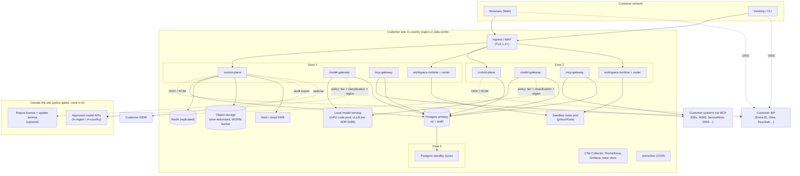
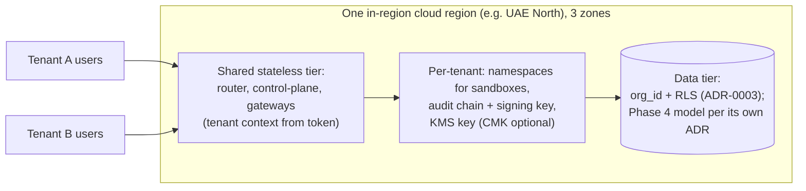
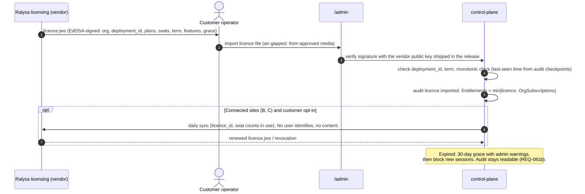

# Deployment Models, Packaging, HA/DR and Target Clouds

> Phase 3 architecture · Owner: architect (stream C) · Status: **Proposed, for G3 review** · Last updated: 2026-09-25
> Sources: spec §8, §9, §10.3, §10.4 (`deploy/`), §12; PRD REQ-081, REQ-094, REQ-096, REQ-101 to REQ-105, REQ-110, DV-1, DV-13, DV-15, A-2, A-4; market `summary.md` R-4, R-6, R-9 and `regulation.md` (deployment-acceptance matrix, MA-301 to MA-303, MA-307); roadmap F-023, F-042, F-043.
> Depends on stream A: tenancy model ([ADR-0003](adr/0003-tenancy-and-isolation.md); the Phase 4 SaaS model gets its own ADR), local-model runtime (vLLM, [ADR-0006](adr/0006-local-model-runtime.md)), Phase 0 model provider ([ADR-0005](adr/0005-phase0-model-provider-and-region.md)) and control-plane language ([ADR-0001](adr/0001-services-language-typescript.md)). This document defines where components run, not which engine runs them.

## 1. Forces

- **Regulated Gulf buyers accept Dedicated in-country, On-prem and Local models. None of them accepts foreign multi-tenant SaaS** (`regulation.md` acceptance matrix; MA-301).
- **Customer-operated first.** Ralysa should not become the "outsourced party" under QCB, SAMA or CBUAE rules (MA-307, R-4). The customer's operations team must be able to install from packaged artifacts in ≤ 1 working day (REQ-101a).
- **Inference location is the binding constraint** (MA-302). The design must work with no in-country frontier model at all, using only a local model.
- **Small team, Phase 1 timeline.** One chart and one set of images must serve every model; the differences are values files and Terraform modules.
- **Several target regions are single-region countries:** Qatar Central has no Azure pair, and Google Doha and Dammam are the only Google regions in their countries (§7). DR cannot assume a second in-country region from the same provider.

## 2. The four deployment models

| Model | Operator | Tenancy | Phase | Target buyers | What may leave the site |
|---|---|---|---|---|---|
| **A. In-region multi-tenant SaaS** | Ralysa (or a hosting partner) | Many tenants (mechanism decided in the Phase 4 successor to ADR-0003) | 4, *Could* (REQ-105, DV-15) | Non-regulated private enterprises only | Model API calls per tenant policy |
| **B. Dedicated in-country** | Customer (default), or partner-managed | Single tenant | **1** (REQ-101, DV-1) | Banks, telcos, CII | Model API calls to policy-approved endpoints; optional licence sync; optional update channel |
| **C. On-prem Kubernetes** | Customer | Single tenant | **1** (REQ-102, DV-1) | Banks, government, telco T3 | Same as B. Local models by default. |
| **D. Air-gapped** | Customer | Single tenant | 4, Y1 target (REQ-103) | Government C4 / Top Secret | **Nothing** |

Provisioning a tenant flagged "regulated Gulf" in model A outside its country is refused by the provisioning service (REQ-105c).

### 2.1 Common logical topology (B, C and D)

### 2.2 Model A: in-region multi-tenant SaaS

Per-tenant items regardless of the tenancy ADR: `org_id` on every row, a separate audit hash chain and signing key per tenant, a per-tenant KMS key for content blobs, a sandbox namespace per tenant, and a region that is fixed at provisioning.

## 3. Component placement by model

| Component | A. SaaS | B. Dedicated | C. On-prem | D. Air-gapped |
|---|---|---|---|---|
| control-plane, gateways, runtime, extraction | Shared, HA | HA, 2–3 zones | HA option (REQ-104) | HA option |
| Postgres | Managed, zone-redundant | Managed in-region where available, else operator | Operator (for example CloudNativePG[^cnpg]) or customer DBA | Operator |
| Object storage + WORM | Cloud (S3 / Blob / GCS) with lock | Cloud with lock | S3-compatible with object lock (for example MinIO[^minio-lock]) | Same as C |
| Secrets | Cloud KMS / secret manager | Customer's cloud KMS or Vault | Vault or customer HSM | Vault |
| Local model serving | Optional | Optional (GPU from customer or partner, A-4) | **Bundled** (REQ-102b) | **Only option** |
| External model APIs | Per tenant policy | Per policy, in-country or in-region first | Per policy | **None** |
| Telemetry | Ralysa-operated, in-region | Bundled OSS stack | Bundled | Bundled |
| Licence | Vendor-managed | Signed file + optional sync | Signed file + optional sync | Signed file only |
| Updates | Continuous (vendor) | Customer-applied release | Customer-applied release | Signed offline bundle |

## 4. Packaging (ADR-0027)

| Artifact | Location in repo | Contents |
|---|---|---|
| Container images | built from `services/*`, `apps/web` | Distroless or minimal base; **signed with cosign**; SBOM (SPDX or CycloneDX) attached as an OCI attestation (REQ-098) |
| Helm umbrella chart `ralysa` | `deploy/helm/ralysa` | Subcharts per service; published as an OCI artifact (Helm OCI support is GA from v3.8[^helm-oci]); values profiles `values-saas.yaml`, `values-dedicated-{azure,gcp,aws}.yaml`, `values-onprem.yaml`, `values-airgap.yaml` |
| Terraform modules | `deploy/terraform/{azure,gcp,aws}` | Network, private cluster with a sandbox node pool, managed Postgres (where available in-region), Redis, object storage with a WORM bucket, KMS keys, private endpoints, egress restrictions. Region is an input validated against an allow-list. |
| On-prem prerequisites check | `deploy/preflight` | Kubernetes version (N-2 supported), CSI with snapshots, NetworkPolicy-capable CNI, RuntimeClass for gVisor or Kata, S3-compatible storage with object lock, Vault or KMS reachability, GPU nodes (if local models). Also checks that the region of every store matches `Organization.region`. |
| Air-gapped bundle | `deploy/airgap` | One archive: images, charts, SBOMs, signatures, a **serialized trust root for offline verification**,[^cosign-verify] migration scripts and release notes. Model weights ship as a separate signed bundle because of their size. Zarf is evaluated as the bundling tool[^zarf]; the fallback is an in-house tarball plus a registry-push script. |

**Install target (REQ-101a): ≤ 1 working day** from an empty subscription (B) or a prepared cluster (C): `terraform apply` (B only), then `helm install` with a profile, then the first-run wizard (IdP, region, licence, first platform admin).

## 5. Upgrades

- **Versioning:** semantic versions. Supported path is **N → N+1 minor**, with no data loss (REQ-102c). Skipping versions requires chained upgrades, which the bundle tooling runs in order.
- **Schema changes use expand → migrate → contract** across two releases, so the application can roll back one version without a database restore.
- **The audit schema is append-only.** Migrations never rewrite sealed rows. New fields are nullable, and the canonical form records `schema_version`, so old hashes stay valid.
- **Pre-upgrade gate:** the preflight check passes, a fresh base backup plus a recorded PITR point exists, and `audit verify` passes for the last 24 h.
- **Rollout:** rolling updates of stateless services across zones, with gateway pods drained so in-flight streams finish. Sandboxes pick up the new Agent Host image on their next claim; running sandboxes are not restarted.
- **Model A (SaaS):** canary per region. **B/C:** the customer applies the release with `helm upgrade` under the customer's change process (CAB). **D:** the signed bundle is carried across the air gap on approved media, verified offline (signatures plus SBOM policy), pushed to the local registry, then upgraded as in C. Zero internet egress (REQ-103a/b).

## 6. HA and DR (ADR-0029)

**Targets:** spec §12 and REQ-110 set control-plane data RPO ≤ 15 min and RTO ≤ 4 h. REQ-104 requires that losing one node or zone causes no data loss and ≤ 5 min of disruption. SaaS availability is 99.9 % for the control plane and gateways.

| Failure | Design | RPO | RTO |
|---|---|---|---|
| Pod or node | ≥ 2 replicas per stateless service, spread across zones with PodDisruptionBudgets | 0 | seconds |
| Zone | 3-zone spread; Postgres HA with a **synchronous** standby in another zone; zone-redundant object storage; Redis replica | 0 (committed data) | ≤ 5 min (automatic failover) |
| Logical corruption or bad migration | PITR from continuous WAL archiving. CloudNativePG, for example, closes and archives WAL at least every 5 min by default (`archive_timeout`),[^cnpg] and managed services offer PITR. | ≤ 5 min | ≤ 2 h (restore + replay; pilot DB < 500 GB, estimate) |
| **Region or site loss** | Backups (base + WAL + object storage + WORM checkpoints) are **copied continuously to a second in-country location** (§7 matrix). Rebuild uses Terraform + Helm + restore from the runbook. | ≤ 15 min | ≤ 4 h |

**Residency rule for DR:** backups and DR copies stay in the same country as the primary. DR never crosses a border by default; a customer can choose otherwise only through an explicit, audited policy exception. Where the provider has no second in-country region, the DR location is another provider's in-country region or the customer's own data centre.

**Scope notes:**

- Redis and trace stores are rebuildable and excluded from RPO.
- **Workspace volumes (Web sandboxes) are not control-plane data.** They are protected by snapshots (default daily, so RPO 24 h for workspace files, proposed; see OQ-DP-4).
- Local model weights are re-deployable artifacts.

**Drill:** a DR restore drill before pilot go-live, then every 6 months (proposed), with results recorded as evidence (REQ-110b).

## 7. Target-cloud matrix

Capability claims are from vendor documentation accessed 2026-09-25 unless marked **verify**. Model-inference facts come from `regulation.md` (MA-302, accessed 2026-09-24).

| Target | Country | Zones / DR pair | Kubernetes + sandbox runtime | WORM for audit checkpoints | Keys / secrets | In-country frontier inference (MA-302) | In-country DR location | Notes |
|---|---|---|---|---|---|---|---|---|
| **Azure Qatar Central** | Qatar | 3 AZs, **no paired region**[^az-regions] | AKS; Pod Sandboxing (Kata, `kata-vm-isolation`) needs Azure Linux and Gen2 VM sizes with nested virtualization[^aks-kata]. **Verify** size availability in Qatar Central. | Immutable blob storage[^az-immut] | Key Vault (CMK) | **None found** in Foundry region tables | Google Doha, or customer DC | NIA-relevant; pilot candidate |
| **Azure UAE North** | UAE | 3 AZs; pair UAE Central is **access-restricted**[^az-regions] | AKS + Pod Sandboxing (as above) | Immutable blob storage | Key Vault | Regional Provisioned OpenAI models in UAE North (MA-302) | UAE Central (after an access request), AWS me-central-1, or customer DC | Only Gulf region with documented in-country frontier API (OpenAI family) |
| **Google Cloud Doha** `me-central1` | Qatar | 3 zones[^gcp-regions] | GKE; **GKE Sandbox (gVisor)**, `runtimeClassName: gvisor`[^gke-sandbox] | Bucket Lock / Object Retention Lock[^gcs-lock] | Cloud KMS, Secret Manager | Per-model in-region ML processing **unverified** (market OQ-3) | Azure Qatar Central, or customer DC | |
| **Google Cloud Dammam** `me-central2` | KSA | 3 zones[^gcp-regions] | GKE + GKE Sandbox | Bucket Lock | Cloud KMS | **Unverified** | Another CST-registered provider in KSA, or customer DC | **KSA customers can buy it only through CNTXT; non-KSA customers need invoiced billing**[^dammam]. CST Class C per Google. |
| **AWS me-central-1** | UAE | 3 AZs[^aws-regions] | EKS; gVisor self-installed (systrap, no nested virtualization needed[^gvisor-platforms]), or Kata on C8i/M8i/R8i with nested virtualization (all commercial regions per AWS[^aws-nested]; **verify** instance availability in me-central-1) | S3 Object Lock, compliance mode[^s3-lock] | AWS KMS, Secrets Manager | Claude on Bedrock ME uses **global** cross-region inference, so it is **not** in-country (MA-302) | Azure UAE North, or customer DC | |
| **Sovereign partner cloud** (Core42 UAE, Ooredoo/Syntys QA, CNTXT Sovereign Controls / stc / HUMAIN KSA; R-6) | per partner | per partner | Treated as **customer on-prem**: conformant Kubernetes + gVisor or Kata | S3-compatible with object lock (**verify**) | Partner KMS/HSM or Vault | Partner-hosted open or sovereign models (for example Jais, ALLaM) | Partner's second site | Certifications inherited from the partner (market OQ-10) |
| **Customer on-prem Kubernetes** | any | Customer's zones or racks | Conformant Kubernetes (N-2) + gVisor (default) or Kata | MinIO or other S3-compatible with object lock[^minio-lock] | Vault or HSM | Local models only (bundled) | Customer second DC | Also the base for air-gapped (D) |

## 8. Per-country data-classification mapping (DV-13, REQ-094)

These are **proposed default** mappings, stored as `ClassificationMapping` data (versioned, audited, editable by the platform admin; see `data-model.md`). They are not legal advice. Counsel must confirm each row before a regulated pilot (`regulation.md` disclaimer). Routing enforcement is owned by `model-gateway.md` (REQ-028).

| National level | Ralysa tier | Allowed deployment models | Allowed inference (default) | Basis |
|---|---|---|---|---|
| **Qatar NCSA C0** (public) | T1 | A (non-regulated only), B, C, D | In-region or in-country API; foreign API only for non-regulated tenants by policy | NCSA classification policy (MA-303) |
| Qatar C1 | T1 | B, C, D (A for non-regulated) | In-country or in-region API; foreign API only with masking and an explicit policy exception | Assumption |
| Qatar C2 | T2 | B, C, D | In-country API or local. Foreign API off until masking is cleared by counsel (PRD OQ-2). | QCB Art. 21.4 for banks (MA-301) |
| Qatar C3 | T3 | B (**certified CSP, verify**), C, D | **Local only** | C3 cloud rules unconfirmed (`regulation.md`) |
| **Qatar C4** (top secret) | T3 + air-gap flag | **D only** (REQ-094d, REQ-103d) | Local only | C4 exempt from cloud (MA-303) |
| **KSA NDMO Public** | T1 | A, B, C, D | In-Kingdom or in-region API | NDMO (MA-303) |
| KSA Restricted | T2 | B (in-Kingdom, CST-registered provider), C, D | In-Kingdom API or local | NDMO + SAMA §3.4.3 for banks |
| KSA Secret | T3 | C, D (B only on a Class C provider, **verify**) | Local only | NDMO, CST classes |
| KSA Top Secret | T3 + air-gap flag | D only | Local only | Assumption, aligned with Qatar C4 |
| **UAE** | Customer labels mapped to T1–T3 | B, C, D (A for non-regulated) | T3 local only; CBUAE bank customer data in-country only | No national private-sector classification identified (**open**); CBUAE Outsourcing, Health Data Law |

Sector overrides apply on top of the mapping: bank tenants default T2 to in-country or local models (PRD OQ-2), and health data in the UAE goes to local models only.

## 9. Licence handling (ADR-0028)

- A tampered or wrong-deployment licence is rejected (REQ-081a). Seat assignment above the licensed count is blocked (REQ-081c).
- Clock-rollback defence: the control plane refuses a system time earlier than the newest signed audit checkpoint.
- Air-gapped renewal is a new file on approved media. No challenge-response is needed.

## 10. What crosses the site boundary

| Flow | A | B | C | D |
|---|---|---|---|---|
| Model API calls | Policy | Policy (T3 local by default) | Policy (local by default) | **None** |
| Licence sync | n/a | Optional, metadata only | Optional | **None** |
| Update channel | n/a | Optional pull of signed releases | Optional | **None** (media) |
| Vendor telemetry | Vendor-operated in-region | **None** by default | None | None |
| Support access | Vendor ops (in-region) | Customer-granted, time-boxed, audited | Same | On-site only |

## 11. NFR targets owned

| NFR | Target | How verified |
|---|---|---|
| Availability (spec §12, REQ-104) | 99.9 % control plane + gateways (SaaS); HA option B/C/D | Monthly availability report from synthetic probes |
| Zone loss (REQ-104a) | No data loss, ≤ 5 min disruption | Zone-failure game day |
| Recoverability (spec §12, REQ-110b) | RPO ≤ 15 min, RTO ≤ 4 h (cp + audit) | DR drill before pilot, then every 6 months |
| Install (REQ-101a) | ≤ 1 working day by customer ops from docs | Timed install by a non-Ralysa engineer on each target |
| Upgrade (REQ-102c) | N → N+1 with no data loss | Upgrade test in CI with production-like data |
| Air-gapped (REQ-103a) | 0 bytes of internet egress during install and upgrade | Egress capture on an isolated test site |
| Residency (REQ-096, REQ-101b) | All components and data in the selected region; DR copies in-country | Preflight region check + egress audit |

## 12. Non-negotiables check

| Check | Result |
|---|---|
| Identity at every gateway | The same chart in every model. Gateways validate tokens from the customer IdP; there is no bypass profile. |
| 100 % audited | The audit DB and WORM bucket are mandatory in every values profile. Install fails if WORM is missing. |
| Approvals, untrusted content | Unaffected by the deployment model. |
| Residency, local models, air-gapped | Region pinned; DR in-country; local model bundled in C and D; D has zero egress. |
| Surface parity | CLI and Desktop connect to any model's endpoints with the same `packages/auth` (OIDC discovery per site). |

## 13. ADR candidates

| ADR | Title | Status |
|---|---|---|
| [ADR-0027](adr/0027-deployment-packaging.md) | One Helm umbrella chart (OCI) + per-cloud Terraform + signed air-gapped bundle | Proposed |
| [ADR-0028](adr/0028-offline-licensing.md) | Signed licence file (JWS/EdDSA) with optional online sync | Proposed |
| [ADR-0029](adr/0029-ha-dr-in-country.md) | Zone-level HA with synchronous Postgres standby; DR to a second **in-country** location, never cross-border by default | Proposed |
| [ADR-0003](adr/0003-tenancy-and-isolation.md), [ADR-0005](adr/0005-phase0-model-provider-and-region.md), [ADR-0006](adr/0006-local-model-runtime.md) | Tenancy (one organization per deployment through Phase 3); Phase 0 model provider; local-model runtime (vLLM) for C/D | Proposed (stream A) |

## 14. Open questions

| # | Question | Affects | Recommendation |
|---|---|---|---|
| OQ-DP-1 | Which cloud does the pilot telco use (Azure Qatar Central, Google Doha, on-prem)? This decides the first Terraform module. | F-023 | Build Azure and on-prem first unless the pilot says otherwise. |
| OQ-DP-2 | Is managed Postgres (Azure Database for PostgreSQL flexible server, Cloud SQL, RDS) available with zone redundancy and PITR in each target region? | Terraform, ADR-0029 | **Verify** per region; fall back to CloudNativePG on the cluster. |
| OQ-DP-3 | For Qatar, is a cross-provider DR (Azure Qatar Central ↔ Google Doha) acceptable to QCB and NCSA, or must DR be the customer's own DC? | ADR-0029 | Ask the pilot's risk team; the design supports both. |
| OQ-DP-4 | Is RPO 24 h for Web workspace files (sandbox volumes) acceptable? | REQ-014 | Yes for Phase 2. Hourly snapshots as an option for Code-heavy tenants. |
| OQ-DP-5 | Classification mapping rows marked Assumption or verify in §8 need counsel review (Qatar C1/C3, KSA Secret/Top Secret, UAE). | REQ-094 | Counsel review before the first regulated pilot. |
| OQ-DP-6 | Zarf vs an in-house air-gap bundle? | ADR-0027 | Spike in Phase 3, before the F-042 design. |
| OQ-DP-7 | Is a partner-managed variant of model B (operated by Ooredoo, Core42 and similar) in scope for Phase 1? It changes the outsourcing analysis (MA-307). | Commercial, support access | Customer-operated only in Phase 1. |
| OQ-DP-8 | GPU sizing for the bundled local model at 1,000 concurrent users (depends on ADR-0006 and the OQ-6 model shortlist; same as overview AQ-6). | C, D cost | Size after the REQ-030 evals pick the model. |

## References

All accessed 2026-09-25.

[^az-regions]: Microsoft Learn, *List of Azure regions* (Qatar Central: 3 AZs, paired region N/A; UAE North: 3 AZs, paired with UAE Central, which is access-restricted): https://learn.microsoft.com/en-us/azure/reliability/regions-list
[^aks-kata]: Microsoft Learn, *Pod sandboxing with AKS*: https://learn.microsoft.com/en-us/azure/aks/use-pod-sandboxing
[^az-immut]: Microsoft Learn, *Immutable storage for blob data*: https://learn.microsoft.com/en-us/azure/storage/blobs/immutable-storage-overview
[^gcp-regions]: Google Cloud, *Regions and zones* (me-central1 Doha, me-central2 Dammam, 3 zones each): https://docs.cloud.google.com/compute/docs/regions-zones
[^gke-sandbox]: Google Cloud, *GKE Sandbox*: https://docs.cloud.google.com/kubernetes-engine/docs/concepts/sandbox-pods
[^gcs-lock]: Google Cloud, *Bucket Lock*: https://docs.cloud.google.com/storage/docs/bucket-lock
[^dammam]: Google Cloud, *Dammam region access*: https://docs.cloud.google.com/docs/dammam-region-access
[^aws-regions]: AWS, *AWS Regions* / *Now Open, AWS Region in the UAE* (me-central-1, 3 AZs): https://docs.aws.amazon.com/global-infrastructure/latest/regions/aws-regions.html and https://aws.amazon.com/blogs/aws/now-open-aws-region-in-the-united-arab-emirates-uae/
[^aws-nested]: AWS What's New, 2026-02-16, nested virtualization on C8i/M8i/R8i: https://aws.amazon.com/about-aws/whats-new/2026/02/amazon-ec2-nested-virtualization-on-virtual
[^gvisor-platforms]: gVisor, *Platform Guide*: https://gvisor.dev/docs/architecture_guide/platforms/
[^s3-lock]: AWS, *Locking objects with Object Lock*: https://docs.aws.amazon.com/AmazonS3/latest/userguide/object-lock.html
[^minio-lock]: MinIO, *Object Locking and Immutability*: https://docs.min.io/aistor/administration/object-locking-and-immutability/
[^cnpg]: CloudNativePG, *WAL archiving* (default `archive_timeout` 5 min) and *Recovery* (PITR): https://cloudnative-pg.io/docs/1.28/wal_archiving/ and https://cloudnative-pg.io/documentation/1.24/recovery/
[^helm-oci]: Helm, *Use OCI-based registries*: https://helm.sh/docs/topics/registries/
[^cosign-verify]: Sigstore, *Verifying Signatures* and *Kubernetes Policy Controller* (serialized TUF root for air-gap): https://docs.sigstore.dev/cosign/verifying/verify/ and https://docs.sigstore.dev/policy-controller/overview/
[^zarf]: Zarf, *The Airgap Native Package Manager for Kubernetes*: https://docs.zarf.dev/ref/init-package/ and https://github.com/zarf-dev/zarf

Market evidence for inference location and regulator rules: `docs/market/regulation.md` (sources accessed 2026-09-24).
