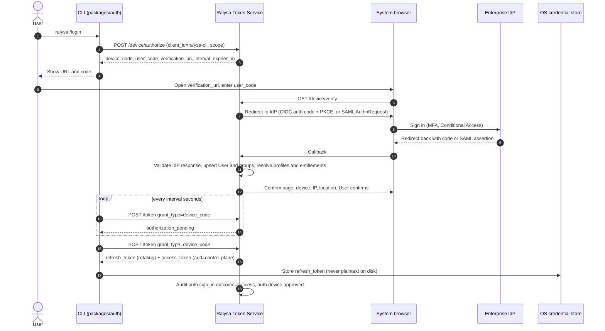
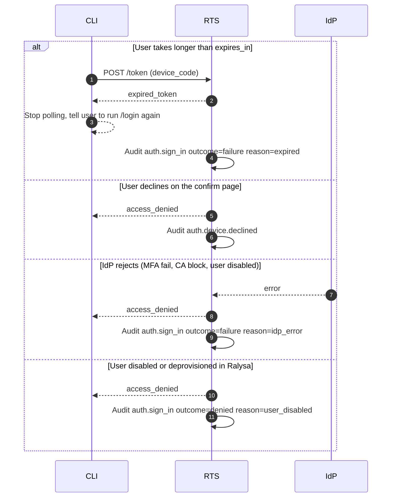
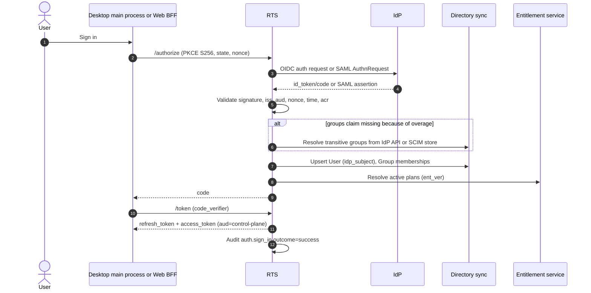
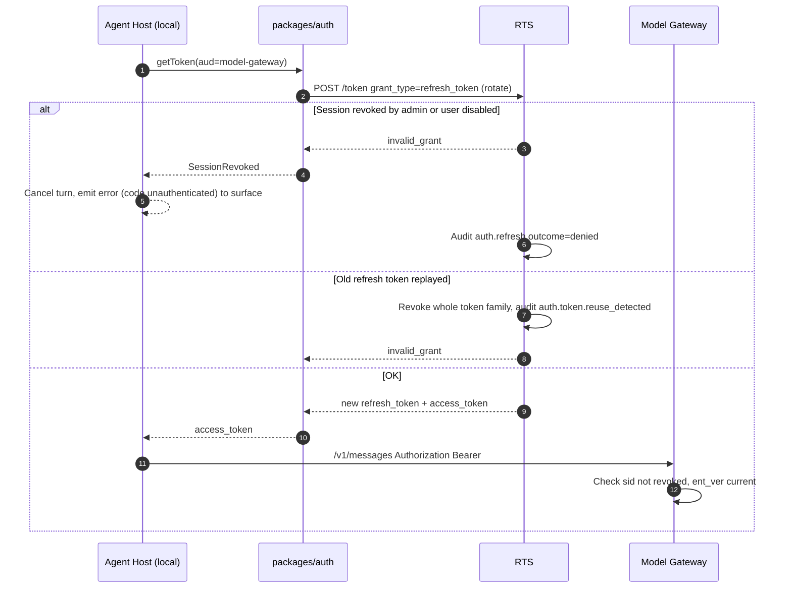
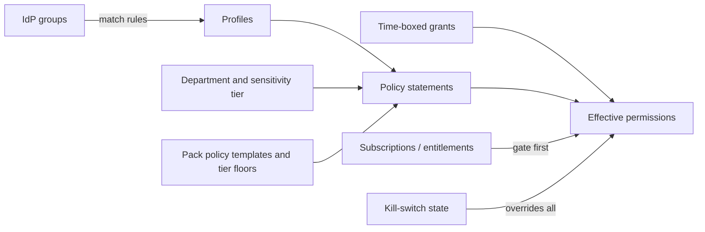
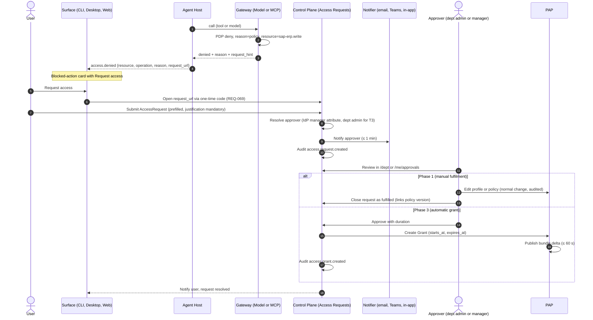

# Identity and policy

> Phase 3 · Owner: architect · Status: **Proposed for G3** · Last updated: 2026-09-25
> Spec: §4 D3/D13, §6.4, §6.13, §6.15.5, §7.7, §8, §11, §12 · PRD: REQ-016 to REQ-023, REQ-027, REQ-034, REQ-064, REQ-066, REQ-069, REQ-078, REQ-094, REQ-110 · DV-13, DV-19 · Market: MA-301 to MA-303, summary R-5(e)
> Phase 0 briefs: F-002 (SSO + control-plane skeleton) and F-005 (CLI sign-in), cross-checked in the G3 consistency review ([consistency-review.md](consistency-review.md)). Audit event names in §9 follow the F-002 brief. CLI sign-in follows the reconciled [ADR-0010](adr/0010-ralysa-token-service-brokers-idp.md) (IdP-native device flow in Phase 0).

## 1. Scope and principles

This document covers how a person becomes an authenticated Ralysa principal on each surface, how tokens move between components, how IdP groups turn into effective permissions, where those permissions are enforced, and how blocked users ask for more access.

Principles (non-negotiable, from spec §4 D3 and §8):

1. **Identity comes from the enterprise IdP only.** No local passwords, no Ralysa-managed MFA.
2. **Every gateway decides for itself.** The Control Plane, Agent Host (server mode), Model Gateway, MCP/Data Gateway and Workspace Runtime each validate the caller's token and evaluate policy. A UI that hides a button is a convenience, never a control.
3. **Effective access = subscribed AND permitted** (spec §6.15.1). Entitlement is checked before policy at every enforcement point.
4. **Default deny, fail closed.** If the token, the policy bundle, the entitlement cache or the audit sink is unavailable, the enforcement point refuses the request.
5. **Surface parity.** CLI, Desktop and Web use the same `packages/auth` library and the same token model, so a user gets the same answer everywhere (REQ-008).
6. **Engine and vendor neutral.** The decision model (ADR-0011) is written so it holds for OPA or Cedar. Stream A proposes Cedar ([ADR-0002](adr/0002-policy-engine-cedar.md), which maps `deny`, `mandatory_deny` and grants onto Cedar explicitly), TypeScript for the control plane ([ADR-0001](adr/0001-services-language-typescript.md)) and one organization per deployment ([ADR-0003](adr/0003-tenancy-and-isolation.md)). Callers do not change if G3 picks a different engine.

## 2. Components and responsibilities

| Component | Location | Responsibilities in this domain |
|---|---|---|
| **Ralysa Token Service (RTS)** | `services/control-plane` (auth module) | OIDC relying party and SAML service provider toward the customer IdP. OAuth authorization server toward Ralysa clients: authorization code + PKCE endpoint (RFC 7636, RFC 8252), token endpoint with refresh-token rotation and token exchange (RFC 8693, also used to exchange an IdP-native device-flow result for Ralysa tokens), and a fallback RTS-hosted device authorization endpoint (RFC 8628) for IdPs without a native device flow. Mints short-lived, audience-bound Ralysa access tokens. Publishes JWKS. Holds session and revocation state. See ADR-0010. |
| **Directory sync** | `services/control-plane` | Keeps User and Group records current from sign-in claims, SCIM 2.0 (REQ-018, RFC 7643/7644) and, on group overage, the IdP's group API. Stores the IdP `manager` attribute used for approval routing (OQ-18). |
| **Policy Administration Point (PAP)** | `services/control-plane` + `/admin`, `/dept` consoles | Stores profiles, policies, group→profile mappings, tier/classification mappings, grants. Validates and versions policy (REQ-020). Builds and signs the **policy bundle** (policy + reference data) and pushes it to every PDP. |
| **Entitlement service** | `services/control-plane` | Resolves active plans per user (spec §6.15.5). Publishes an entitlement version (`ent_ver`) per user and per tenant. |
| **Policy Decision Point (PDP)** | Embedded library/sidecar in each gateway, Agent Host (server mode) and Control Plane API | Evaluates `decide(principal, action, resource, context)` against the local signed bundle. Returns decision + obligations + reason codes + policy version. Engine Cedar per ADR-0002; decision model and placement per ADR-0011. |
| **Policy Enforcement Points (PEP)** | Control Plane API, Agent Host, Model Gateway, MCP/Data Gateway, Workspace Runtime egress proxy | Validate token, check revocation/kill-switch, call the PDP, apply obligations, emit audit. |
| **`packages/auth`** | Shared by `apps/cli`, `apps/desktop`, `apps/web` (BFF), `services/agent-host` | Login flows per surface, secure token storage, silent refresh, token-provider interface for the Agent Host. Never stores provider keys. |
| **Access Request service** | `services/control-plane` | Creates AccessRequest records from blocked-action cards, routes to approvers, (Phase 3) turns approvals into time-boxed Grants. |

## 3. Authentication flows per surface

All three flows end in the same place: the surface holds (or, for Web, the BFF holds) a **Ralysa refresh token** and obtains short-lived **Ralysa access tokens** per audience. IdP tokens never reach a gateway or any Ralysa service other than RTS (ADR-0010). The one case where an IdP token touches a client is the IdP-native CLI device flow (§3.1), where the CLI holds it in memory only for the single exchange at RTS. This lets one flow design work for OIDC and SAML IdPs, on-prem IdPs in air-gapped sites (Keycloak, AD FS), and customers who block IdP device-code flow.

### 3.1 CLI sign-in (reconciled with security SR-08, F-002 and F-005)

ADR-0010 compares three CLI flows and recommends this order:

| Flow | When | How | Phishing and Conditional Access |
|---|---|---|---|
| **A. IdP-native device authorization + RTS token exchange** (Phase 0 default for `/login`) | IdP has a native device flow (Entra ID in Phase 0) and the tenant has not blocked it | `packages/auth` runs RFC 8628 against the IdP's device endpoint ([Entra device authorization grant](https://learn.microsoft.com/en-us/entra/identity-platform/v2-oauth2-device-code)). The CLI shows the IdP's code and URL (F-005 AC-1). It then exchanges the IdP token once at RTS (RFC 8693) for Ralysa tokens and discards it. | The tenant's own Conditional Access policies for the device-code flow apply (SR-08, TM-01). No Ralysa-hosted page is needed, which matches F-002's "no Ralysa-hosted web page in Phase 0". |
| **B. Loopback + PKCE through RTS** (`ralysa /login --browser`; the default when the tenant disables device code) | A local browser is available | Same as Desktop (§3.2): system browser to RTS `/authorize` with PKCE `S256`, loopback redirect to `127.0.0.1:<ephemeral>` held by the CLI. This is also the F-002 AC-1 browser-redirect grant. | No device code exists, so the device-code phishing class does not apply. The loopback "you can return to your terminal" page uses i18n keys (F-002 Arabic/RTL note). |
| **C. RTS-hosted device authorization** (fallback, Phase 1+) | Headless use with an IdP that has no device flow (SAML, some on-prem IdPs) | RTS implements RFC 8628 itself and federates the browser leg to the IdP (diagram below). | IdP Conditional Access sees an ordinary browser sign-in, not device code, so the RTS page carries the SR-08 hardening: `user_code` lifetime ≤ 10 min, single use; the page shows the requesting device name, OS, IP and approximate location and asks "Yes, I started this sign-in in a terminal"; alert when the polling IP differs from the approving IP; codes rate-limited per IP; `verification_uri_complete` off by default. |

A per-tenant setting disables device code entirely (A and C), leaving B. RTS records the exchange or polling IP and device label on `auth.sign_in` for every flow.

Why not only the IdP flow: Microsoft recommends blocking device code flow wherever possible because it is used in phishing, and lets admins block it with Conditional Access ([Entra authentication flows](https://learn.microsoft.com/en-us/entra/identity/conditional-access/concept-authentication-flows), accessed 2026-09-25), and SAML IdPs have no device flow at all. Flows B and C cover those tenants.

The diagram below shows flow C (RTS-hosted device authorization).



Failure paths:



### 3.2 Desktop: system browser + PKCE with loopback redirect

Desktop follows OAuth for native apps (RFC 8252): the Electron main process opens the system browser (not an embedded webview) to the RTS authorize endpoint with PKCE `S256`, receives the code on a loopback redirect (`http://127.0.0.1:<ephemeral>/callback`), and exchanges it. RTS federates to the IdP exactly as in 3.1. The refresh token is encrypted with the OS keystore via Electron `safeStorage` ([Electron safeStorage](https://www.electronjs.org/docs/latest/api/safe-storage), accessed 2026-09-25) and held only by the main process. The renderer (shared Web UI) never sees refresh tokens; the local Agent Host receives access tokens through the token-provider interface (section 4.3).

### 3.3 Web: OIDC through a backend-for-frontend

The Web IDE and Console use the backend-for-frontend (BFF) pattern recommended for browser apps in [RFC 10017, OAuth 2.0 for Browser-Based Applications](https://www.rfc-editor.org/info/rfc10017/) (accessed 2026-09-25). The BFF is part of the Control Plane edge. The browser holds only a `__Host-` prefixed, `Secure`, `HttpOnly`, `SameSite=Lax` session cookie. The BFF holds the refresh token server-side and attaches access tokens when it proxies API calls or opens the WebSocket to the server-side Agent Host. The WebSocket upgrade is authenticated by the cookie plus an `Origin` check plus a per-connection CSRF token.

Deep links from CLI/Desktop into the Console (REQ-069) use a one-time login code: single use, ≤ 60 s lifetime, exchanged at the BFF; no access token ever appears in a URL.

### 3.4 Sign-in sequence shared by Desktop and Web (IdP leg)



Group overage: Entra ID drops the `groups` claim when a user is in more than 200 groups (JWT) or 150 (SAML) and signals overage instead; apps must then read membership from Microsoft Graph ([Entra group claims and app roles](https://learn.microsoft.com/en-us/security/zero-trust/develop/configure-tokens-group-claims-app-roles), accessed 2026-09-25). RTS therefore never relies on the claim alone: it uses the claim when present, else SCIM-synced membership, else the IdP API. If none of these resolves membership, sign-in fails closed. Recommended tenant setup: "groups assigned to the application" filtering, so the claim only carries the groups that map to Ralysa profiles.

Identity mapping rules (security SR-06, P0-1; apply from Phase 0 to the F-002 access and admin groups): groups are matched by **immutable IdP object ID** (`Group.idp_group_id`), never by display name, which is shown for display only; the issuer and IdP tenant (`iss`, and `tid` for Entra) are pinned to the configured values; a user who maps to no access group or profile is denied.

## 4. Token handling

### 4.1 Token types

| Token | Issuer | Audience | Lifetime | Held by | Notes |
|---|---|---|---|---|---|
| IdP id_token / SAML assertion | IdP | RTS | IdP default | RTS only, discarded after validation | Never forwarded. |
| IdP refresh token (only where RTS needs OBO to Graph etc.) | IdP | RTS | IdP default | Vault (per user), via credential broker | Used by the MCP/Data Gateway credential broker, not by clients. See mcp-gateway.md. |
| **Ralysa refresh token** | RTS | RTS | 12 h idle / 7 d absolute *(proposed, tenant-configurable)* | CLI: OS credential store. Desktop: `safeStorage`. Web: BFF server-side | Rotated on every use; reuse of an old one revokes the whole session family (OAuth 2.0 Security BCP, [RFC 9700](https://www.rfc-editor.org/rfc/rfc9700), accessed 2026-09-25). |
| **Ralysa access token** | RTS | One of `control-plane`, `agent-host`, `model-gateway`, `mcp-gateway`, `workspace-runtime` | 15 min default, 5–60 min (REQ-017b) | In memory only | JWT per [RFC 9068](https://www.rfc-editor.org/rfc/rfc9068) (accessed 2026-09-25). One audience per token; gateways reject tokens for other audiences. |
| Delegated access token (server-mode Agent Host) | RTS via token exchange (RFC 8693) | `model-gateway` or `mcp-gateway` | ≤ 15 min | Server Agent Host memory | `sub` = user, `act` = agent-host instance. Both are audited. |
| Approval grant | Control Plane approvals service | `mcp-gateway` (or `agent-host` for local tools) | ≤ 10 min, single use | Agent Host, attached to the retried call | Bound to user, tool, operation and payload hash. See mcp-gateway.md §6 and ADR-0013. |
| Downstream connector tokens | Source-system AS (via OBO, token exchange, ID-JAG, vault) | Source system | Source default | MCP/Data Gateway credential broker only | Ralysa access tokens are never passed through (MCP forbids token passthrough). See mcp-gateway.md. |

### 4.2 Access-token claims

Kept small so they fit headers and stay cacheable:

```json
{
  "iss": "https://<tenant-host>/auth", "aud": "model-gateway",
  "sub": "usr_01J…", "tid": "org_01J…", "sid": "ses_01J…",
  "idp_sub": "<IdP subject>", "surface": "cli|desktop|web|automation",
  "amr": ["mfa"], "auth_time": 1759000000,
  "pol_ver": "2026-09-25.14", "ent_ver": 42,
  "tier_ceiling": "T2", "region": "qa-doha-1",
  "act": { "sub": "agent-host/ah-7f3…" },
  "iat": 1759000000, "exp": 1759000900, "jti": "…"
}
```

Groups, profiles and plan lists are **not** in the token. The PDP resolves them from the bundle and entitlement cache using `sub`, which keeps tokens small, avoids stale permissions for up to 15 minutes and lets REQ-078(a) (unassignment effective ≤ 60 s) hold. `ent_ver` and `pol_ver` let a PEP detect that its cache is behind and refresh before deciding.

### 4.3 Token handling rules

- **No provider keys anywhere on clients** (REQ-001c, REQ-010b, REQ-095). The Agent Host authenticates to the Model Gateway only with a Ralysa access token.
- **Local Agent Host** (CLI/Desktop) gets tokens from a `TokenProvider` interface in `packages/auth` over local IPC, never from files. For the Claude Agent SDK engine, the adapter supplies the gateway token through the SDK's supported gateway credential mechanism (`ANTHROPIC_BASE_URL` plus `ANTHROPIC_AUTH_TOKEN` or an `apiKeyHelper` that returns a fresh token) ([Connect Claude Code to an LLM gateway](https://code.claude.com/docs/en/llm-gateway-connect), accessed 2026-09-25). This wiring lives only inside `services/agent-host` (see agent-protocol.md §6).
- **Control plane unreachable**: clients keep using a valid access token until it expires; after that the local host stops executing and says why (REQ-003e). No offline grace for model or tool calls.
- **Revocation** (REQ-017d, ≤ 60 s): RTS publishes revoked `sid`s and a per-user `revoked_before` timestamp to every PEP through the same push channel as policy bundles (ADR-0011). PEPs check it on every request. Access tokens are short so the list stays small.
- **IdP disable / group removal**: SCIM or the next refresh (≤ 15 min, REQ-017c) updates membership; RTS bumps the user's version so PEPs refetch.
- **Service-to-service calls** (for example gateways writing audit, F-002 AC-11) use mTLS or workload identity, not user tokens (SR-07). Downstream access to enterprise systems uses OBO or token exchange only, never passthrough (ADR-0016).
- **Sender-constrained tokens (option)**: DPoP ([RFC 9449](https://www.rfc-editor.org/rfc/rfc9449), accessed 2026-09-25) for CLI/Desktop refresh tokens is an open question (section 12); not required for Phase 1.

### 4.4 Token refresh and revocation failure path



## 5. From SSO groups to effective permissions

### 5.1 Model



- **Profile** = named bundle with `match` rules on groups (and optionally department, IdP attributes). A user may match several profiles (spec §6.4.2).
- **Policy statements** carry an **effect** of `allow`, `deny` or `mandatory_deny`, plus optional `require_approval` and obligations (mask PII, row limit, approver, redaction, routing constraints).
  - `deny` is a normal deny: it beats any profile allow ("deny overrides allow", REQ-019a) and can be lifted only by an approved, time-boxed grant.
  - `mandatory_deny` is a guardrail: nothing lifts it, not a grant and not another profile. Only platform admins author these, and several are **built-in and not editable**: "never automated" action classes (REQ-061), C4 outside air-gapped (REQ-094d), T3 → non-local model without an audited exception (REQ-028a), personal keys on T3 (REQ-026c), pack tier floors (REQ-083b).
- **Department tier** (T1–T3) and the tier → national classification mapping (Qatar C0–C4, later NDMO; REQ-094, DV-13) are reference data in the bundle.

### 5.2 Evaluation order (every PEP, every request)

| Step | Check | Result if it fails |
|---|---|---|
| 1 | Token valid for this audience; `sid` not revoked; user active | 401, `auth.*` audit |
| 2 | Kill-switch for tenant, department, pack or agent (REQ-064) | Deny `kill_switch` |
| 3 | Entitlement: the module/connector/model tier is in an active plan (spec §6.15.5) | Deny `not_entitled` (tool also hidden from the agent) |
| 4 | `mandatory_deny` statements | Deny `mandatory_policy` |
| 5 | `deny` statements from any matching profile | Deny `policy`, unless an active grant covers exactly this action and resource |
| 6 | Active grant (not expired at evaluation time) | Allow via grant |
| 7 | `allow` from any matching profile | Allow |
| 8 | Nothing matched | Deny `default_deny` |
| 9 | On allow: merge obligations (strictest wins: lowest row limit, masking on if any says on, strictest approver chain) | Obligations returned with decision |

The PDP returns `{decision, obligations, reasons[], contributing_profiles[], policy_version, grant_id?}`. The contributing profiles and reasons feed the effective-permission viewer (REQ-019c, REQ-067c) and the `access.denied` event.

### 5.3 Decision input (engine-neutral)

```yaml
principal: { user_id, tenant_id, department_id, department_tier, groups[], profiles[], plans[], grants[], manager_id, surface }
action:    { domain: model|tool|connector|skill|plugin|workspace|admin, name, operation: read|draft|write|send|delete|execute|admin }
resource:  { type, id, connector_id?, attributes: { tier, labels[], region, locality, classification } }
context:   { session_id, session_tier_hwm, time, deployment_model, client_version, approval_grant? }
```

The same schema is used by OPA (as `input`) or Cedar (principal/action/resource/context), so the stream A engine decision does not change callers.

### 5.4 Effective-permission computation for the UI and the agent

The Control Plane exposes `GET /v1/me/effective-permissions` (and `/v1/admin/users/{id}/effective-permissions`). It enumerates candidate resources from the entitled plans, runs the PDP for each, and returns the list with reasons. The Agent Host uses the same call at `session.create` to build the tool, skill and model catalog (REQ-022: tools the user may not use are **never loaded**). The result is a **view**; enforcement still happens per request at gateways.

**Phase 0 (before the policy engine, F-006).** F-003 needs server-side on/off settings for the local file-write and terminal tools and server-side redaction rules (F-003 AC-4, AC-5, AC-11). Until F-006 they live in a per-organization **settings document** in the control-plane database (deployment config in Phase 0, audited on change), served by this same endpoint as part of the catalog. The local host reads nothing from local config files for these decisions. F-006 replaces the document with PDP decisions and the ADR-0002 settings document without changing the endpoint or the host.

Parity (REQ-008a): CLI `/models`, `/skills`, `/connections`, Desktop and Web menus and the `/me` console all read this one endpoint.

### 5.5 Propagation (≤ 60 s, REQ-021b, REQ-078a, REQ-110)

1. Admin saves policy → PAP validates (engine-specific validator; invalid policy rejected with a specific error, REQ-020c), versions, audits `policy.version.published`.
2. PAP builds a signed bundle (policy + reference data + grants + revocations) and pushes a notification; PDPs pull the delta (long-poll or stream, per ADR-0011).
3. Each PDP activates the new version atomically and reports `policy.bundle.activated` with its version.
4. The Control Plane sends `policy.changed` to running sessions; the Agent Host recomputes the catalog and unloads newly denied tools (REQ-021c).
5. If a PDP falls behind, it follows rule G-2 in §5.6.

### 5.6 Governance-state freshness and fail-closed rules (canonical)

This table is the **only** statement of these rules. ADR-0011 (policy staleness), ADR-0025 (kill-switch), ADR-0019 (budget), ADR-0022 (audit), model-gateway.md §10, mcp-gateway.md §4 and observability-audit.md §9 reference it. It applies to every PEP: Control Plane API, server Agent Host, Model Gateway, MCP Gateway and the Workspace Runtime egress proxy. The local Agent Host is covered by G-6.

| Rule | Signal | Normal | Fail-closed behaviour | Source |
|---|---|---|---|---|
| **G-1 Governance heartbeat** | Kill-switch state and governance epoch, revocation feed (`sid`, `revoked_before`) and the latest published policy version. Pushed over Redis pub/sub; every PEP also polls every 5 s | Confirmed within 60 s | Not confirmed for **> 60 s** → refuse **every** model and tool call, all tiers, reason `governance_stale`; report unhealthy. Kill-switch active in scope → refuse and abort in-flight streams | ADR-0025; kill-switch ≤ 30 s (REQ-064a); revocation ≤ 60 s (REQ-017d) |
| **G-2 Policy bundle lag** | Active signed bundle version vs the latest version announced by G-1. Bundles also carry the kill-switch state, grants and revocations as a second copy (ADR-0011) | Activated ≤ 60 s after publication (REQ-021b, REQ-078a) | Behind for **> 60 s** → deny T2/T3 and every write or side-effecting operation; T1 reads continue on the last good bundle; emit `policy.bundle.stale`. Behind for **> 5 min** *(proposed)* → deny everything. A bundle that fails signature or validation is never activated | ADR-0011 (tightened from "5 min → deny T2/T3 and writes" so REQ-021b holds) |
| **G-3 PDP error** | Engine error, missing entity, schema mismatch | — | Deny (default deny) | ADR-0011, SR-10 |
| **G-4 Session tier high-water mark** | HWM store (Redis) unavailable | — | Treat the session as T3 (only local endpoints) for tenants that have T2/T3 departments | ADR-0015, model-gateway.md §4.1 stage 3 |
| **G-5 Audit intent** | `*.requested` commit fails or exceeds 250 ms | — | Do not execute; return `audit_unavailable` | ADR-0022 |
| **G-6 Local Agent Host** | Intent ack from the control plane (carries the G-1 state); access-token validity | Ack before each local tool call | No ack, kill-switch in the ack, or control plane unreachable → no local tool runs. After the access token expires with the control plane unreachable, the host stops all model and tool calls (REQ-003e). No offline grace | ADR-0022, observability-audit.md §3.3 |
| **G-7 PII masking** | Detector error or timeout | — | Deny non-local calls; local endpoints unaffected | model-gateway.md §6 |
| **G-8 Budget counters** | Redis lost or rebuilding | — | Allow only scopes below 80 % of their limit at the last snapshot, with a conservative per-request cap *(proposed)* | ADR-0019 decision 5 |

Because G-1 fires at 60 s, a PEP that loses the control plane stops everything before G-2's 5-minute step is reached. G-2 matters only when the heartbeat works but a bundle cannot be fetched or activated. A per-tier relaxation of G-1 for T1 is the revisit path in ADR-0025, not a current option.

## 6. Where policy is enforced

| Enforcement point | What it decides | Authoritative? |
|---|---|---|
| **Control Plane API** | Console and admin actions, memory, skills, approvals, access requests, subscriptions | Yes |
| **Agent Host, server mode** (Web) | Which tools, skills, models are loaded; pre-tool checks on built-in tools inside the sandbox | Yes (runs in Ralysa-controlled infrastructure) |
| **Agent Host, local mode** (CLI/Desktop) | Which tools are loaded; pre-tool checks on **local** built-in tools (file edit, terminal, local stdio MCP) | Advisory for enterprise resources. It runs on a user-controlled machine and could be modified, so **no enterprise resource trusts it**: every model call and every remote tool call is re-decided at a gateway. For purely local side effects (the user's own files and terminal), the local host is the only possible enforcement point; it asks the PDP decision API and audits to the Control Plane, and fails closed if either is unreachable. |
| **Model Gateway** | Model allowed, model-tier entitlement, residency/tier routing, personal keys, budget, per-request token cap | Yes (model-gateway.md) |
| **MCP/Data Gateway** | Connector entitlement, operation-level policy, per-group allowlists, approvals, masking, result limits | Yes (mcp-gateway.md) |
| **Workspace Runtime egress proxy** | Outbound hosts from sandboxes | Yes (workspace-runtime.md, ADR-0020) |
| **UI** (all surfaces) | Hides menus and tools | **Never** a control |

REQ-021(a) test: a modified client calling a denied model or tool directly on a gateway gets a deny and an `outcome=denied` audit event. This must be in the gateway conformance suites.

## 7. Time-boxed grants

A **Grant** is a narrow allow: `{grant_id, user_id, action, resource (exact id or bounded pattern), obligations, starts_at, expires_at, approved_by, access_request_id}`.

- A grant can lift a `deny` but never a `mandatory_deny`, never an entitlement gap (a grant cannot give a module the user is not subscribed to, spec §6.15.1), and never widens the tier ceiling of the user's department.
- Maximum duration per resource tier: T1 90 days, T2 30 days, T3 7 days *(proposed, tenant-configurable)*.
- Expiry is checked by the PDP **at evaluation time** against `expires_at`, so a grant stops working at its end time even if the cleanup job is late. A job removes expired grants from the bundle within 1 min (REQ-023d) and emits `access.grant.expired`.
- Grants on T3 resources need department-admin approval and cannot be self-approved (REQ-023e).

## 8. Access-request flow (DV-19)

Phase 1 delivers request creation, routing and notification with **manual fulfilment**. Phase 3 adds automatic time-boxed grants (REQ-023).



Failure paths:

| Case | Behaviour | Audit |
|---|---|---|
| Approver is the requester (self-approval) | Refused; routed to the next approver in chain | `access.request.self_approval_blocked` |
| No approver resolvable (no manager, no dept admin) | Routed to platform admin queue | `access.request.routed` with `fallback=true` |
| Request targets a `mandatory_deny` or unentitled resource | Form explains why; request becomes a **subscription request** (unentitled) or is refused (mandatory) | `access.request.rejected` reason `mandatory_policy` or `not_entitled` |
| Request not acted on in 7 days *(proposed)* | Auto-expired; user notified | `access.request.expired` |
| Grant expiry job late | PDP still denies at `expires_at` | `access.grant.expired` |

## 9. Audit events emitted

All events use the **canonical envelope in [observability-audit.md §3.1](observability-audit.md)** (`action` is the event name below, `outcome` and `reason_code` are envelope fields, `org_id` is the tenancy key, chain fields are assigned by the sealer). The fields below go in `details`. Event names follow the F-002 brief (`auth.sign_in`, `auth.refresh`, `auth.sign_out`, `auth.token_rejected`, `audit.query`, `secret.rotated`).

| Event | Emitted by | Specific fields |
|---|---|---|
| `auth.sign_in` (outcome `success` / `failure` / `denied`) | RTS | idp_id, protocol (oidc/saml), flow (idp_device / loopback_pkce / rts_device / bff), amr, acr, reason category (expired, idp_error, user_disabled, not_in_access_group, declined), client_ip, user_agent, device_label, client type (F-002 AC-4) |
| `auth.device.approved` / `auth.device.declined` | RTS (flow C only) | user_code_hash, device_label, client_ip, geo, polling_ip_mismatch |
| `auth.token.issued` | RTS | audience, grant_type (refresh, token_exchange, idp_device_exchange), sid, jti, act.sub |
| `auth.refresh` (outcome `denied`) | RTS | sid, reason (revoked, expired, user_disabled) |
| `auth.token.reuse_detected` | RTS | sid, family_id, revoked_count |
| `auth.token_rejected` | Every service validating a token | audience, reason (expired, bad_signature, wrong_audience, unknown_issuer) (F-002 AC-7) |
| `auth.session.revoked` | RTS | sid or user_id, revoked_by, scope (session/user/tenant) |
| `auth.sign_out` | RTS | sid, surface |
| `audit.query` (outcome `success` / `denied`) | Control Plane | filters, result_count (F-002 AC-12) |
| `secret.rotated` | Control Plane, gateways | credential_ref_hash, kind (idp_client_secret, signing_key, provider_credential) |
| `directory.user.provisioned` / `.updated` / `.deprovisioned` | Directory sync | source (sign-in, scim, idp_api), changed_attributes, seats_released |
| `directory.group_membership.changed` | Directory sync | group_id, added[], removed[] |
| `policy.version.published` | PAP | policy_id, version, author, diff_ref, validation_result |
| `policy.version.rolled_back` | PAP | from_version, to_version, author |
| `policy.bundle.activated` | Each PDP | pdp_id, component, bundle_version, activation_latency_ms |
| `policy.bundle.stale` | Each PDP | pdp_id, last_version, staleness_s |
| `policy.mapping.changed` | PAP | kind (group_profile, tier_classification), before, after |
| `policy.decision` (denies always; allows per audit level) | Every PEP | action, resource, decision, reasons[], contributing_profiles[], grant_id, obligations |
| `access.request.created` / `.routed` / `.approved` / `.rejected` / `.expired` / `.fulfilled` | Access Request service | request_id, resource, operation, justification_hash, approver_id, duration |
| `access.request.self_approval_blocked` | Access Request service | request_id, approver_id |
| `access.grant.created` / `.revoked` / `.expired` | PAP | grant_id, resource, action, starts_at, expires_at, approved_by |
| `killswitch.activated` / `.deactivated` | Control Plane | scope (tenant/dept/pack/agent), scope_id, actor, confirmation_id |

## 10. NFR targets owned

| NFR | Target | Source |
|---|---|---|
| CLI authenticated after IdP sign-in | ≤ 5 s | REQ-001a |
| Access-token lifetime | 15 min default, 5–60 min | REQ-017b |
| Group removal → permission removed | ≤ 15 min (≤ 5 min with SCIM) | REQ-017c, REQ-018b |
| Session revocation effective | ≤ 60 s | REQ-017d |
| Policy change → new requests | ≤ 60 s | REQ-021b, REQ-110 |
| Entitlement change → next request | ≤ 60 s | REQ-078a |
| Grant active after approval / removed after expiry | ≤ 60 s / ≤ 1 min (exact at PDP) | REQ-023c/d |
| Access request → approver notified | ≤ 1 min | REQ-023b, REQ-066d |
| PDP decision latency (share of gateway budget) | p95 ≤ 5 ms in-process *(proposed)* | §12 gateway overhead p95 < 100 ms |
| Deep-link one-time code | single use, ≤ 60 s | REQ-069a |
| Auth and policy availability | 99.9 % SaaS; HA option on-prem | §12, REQ-104 |

## 11. Deployment variants

| Deployment | IdP | Notes |
|---|---|---|
| Dedicated in-country cloud | Customer cloud IdP (Entra, Okta, Ping, Google) | RTS in the tenant region. |
| On-prem | Customer IdP reachable on-prem or via the internet | SCIM push from IdP may need an inbound route; fall back to sign-in sync + scheduled pull. |
| Air-gapped | On-prem IdP only (AD FS, Keycloak, on-prem Ping) | No external JWKS or metadata fetch; IdP metadata uploaded by admin. SAML path must work end to end. |
| Multi-tenant SaaS (Phase 4, in-region only, DV-15) | Per-tenant IdP | Tenant resolved from host name before IdP redirect; tenancy model per ADR-0003 (Phase 4 SaaS gets its own ADR). |

## 12. ADR candidates

| ADR | Decision | Status |
|---|---|---|
| **ADR-0010** | Ralysa Token Service brokers IdP sign-in and mints audience-bound Ralysa tokens (vs. passing IdP tokens to gateways); CLI flow order IdP-native device → loopback PKCE → RTS-hosted device | Written, Proposed |
| **ADR-0011** | Policy decision model (`allow`/`deny`/`mandatory_deny` + obligations) and PDP placement (embedded per PEP with signed bundles vs. central PDP service) | Written, Proposed |
| ADR-0013 | Approval enforcement at the gateway with payload-bound grants | Written, Proposed (see mcp-gateway.md) |
| ADR-0001, ADR-0002, ADR-0003 | Control-plane language (TypeScript), policy engine (Cedar, with the ADR-0011 mapping), tenancy (one organization per deployment) | Referenced (stream A), Proposed |
| Future | Sender-constrained tokens (DPoP) for CLI/Desktop | Candidate |
| Future | Continuous access evaluation (IdP risk events, e.g. CAEP/Shared Signals) | Candidate |

## 13. Open questions

| # | Question | Proposed default | Owner |
|---|---|---|---|
| IQ-1 | Refresh-token lifetimes (idle/absolute) acceptable to the pilot's security team? | 12 h idle, 7 d absolute; T3 departments 8 h absolute | Security reviewer + pilot CISO |
| IQ-2 | Do we adopt DPoP for CLI/Desktop refresh tokens in Phase 1, or Phase 4 hardening? | Phase 4, unless pilot asks | Architect |
| IQ-3 | Does the Phase 0 Entra test tenant (and later the pilot tenant) allow the device-code flow under Conditional Access? (merged with security OQ-S4) | ADR-0010 order: IdP-native device (default), `ralysa /login --browser` loopback PKCE, RTS-hosted device only for IdPs without a device flow; per-tenant switch to disable device code | Architect + pilot IT |
| IQ-4 | Manager resolution (OQ-18): IdP `manager` attribute with admin override. Confirm Entra exposes it through SCIM for the pilot. | IdP attribute + override | Product owner + architect |
| IQ-5 | Grant maximum durations per tier (T1 90 d, T2 30 d, T3 7 d) | As proposed | Product owner |
| IQ-6 | Should `policy.decision` allow events be logged for every call (volume) or only denies + sampled allows for T1? | Full for T2/T3, denies + sampled allows for T1; model and tool calls are audited separately in any case | Architect + CISO advisor |
| IQ-7 | ~~Phase 0 brief F-002 not reviewed in this pass.~~ **Closed** in the G3 consistency review. Brief changes BC-01 to BC-05 and BC-13 in `consistency-review.md`. | — | Closed |

## References

All accessed 2026-09-25.

- RFC 8628 OAuth 2.0 Device Authorization Grant: https://www.rfc-editor.org/rfc/rfc8628
- RFC 7636 PKCE: https://www.rfc-editor.org/rfc/rfc7636
- RFC 8252 OAuth 2.0 for Native Apps: https://www.rfc-editor.org/rfc/rfc8252
- RFC 8693 OAuth 2.0 Token Exchange: https://www.rfc-editor.org/rfc/rfc8693
- RFC 9068 JWT Profile for OAuth 2.0 Access Tokens: https://www.rfc-editor.org/rfc/rfc9068
- RFC 9700 OAuth 2.0 Security Best Current Practice: https://www.rfc-editor.org/rfc/rfc9700
- RFC 9449 DPoP: https://www.rfc-editor.org/rfc/rfc9449
- RFC 10017 OAuth 2.0 for Browser-Based Applications: https://www.rfc-editor.org/info/rfc10017/
- RFC 7643 / 7644 SCIM 2.0: https://www.rfc-editor.org/rfc/rfc7643, https://www.rfc-editor.org/rfc/rfc7644
- OpenID Connect Core 1.0: https://openid.net/specs/openid-connect-core-1_0.html
- Microsoft Entra, device authorization grant: https://learn.microsoft.com/en-us/entra/identity-platform/v2-oauth2-device-code
- Microsoft Entra, Conditional Access authentication flows (device code blocking): https://learn.microsoft.com/en-us/entra/identity/conditional-access/concept-authentication-flows
- Microsoft, group claims, overage and app roles: https://learn.microsoft.com/en-us/security/zero-trust/develop/configure-tokens-group-claims-app-roles
- Electron safeStorage: https://www.electronjs.org/docs/latest/api/safe-storage
- Claude Code, connect to an LLM gateway (base URL and credential variables): https://code.claude.com/docs/en/llm-gateway-connect
