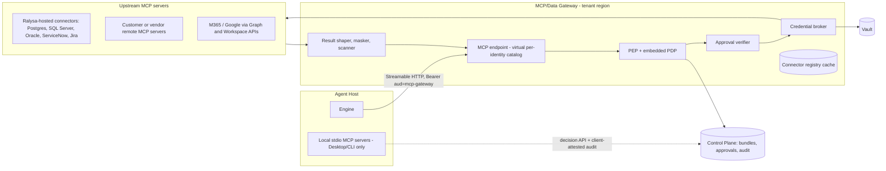
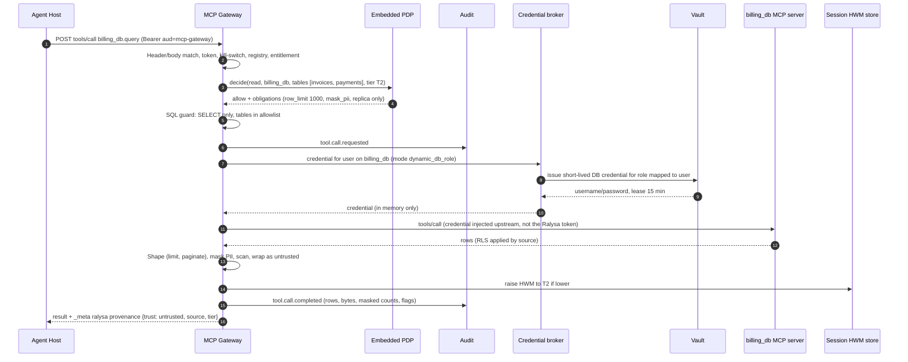
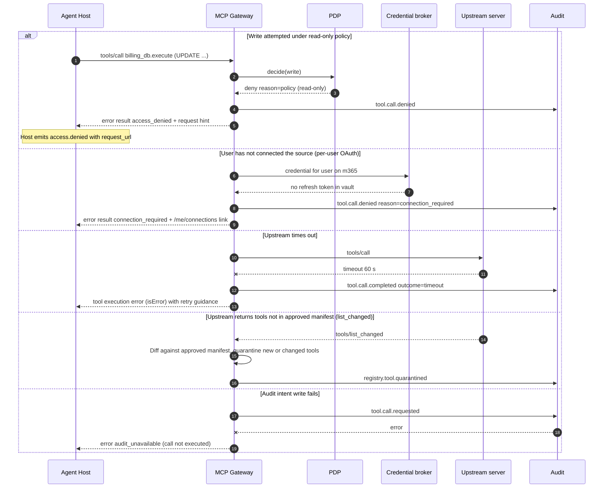
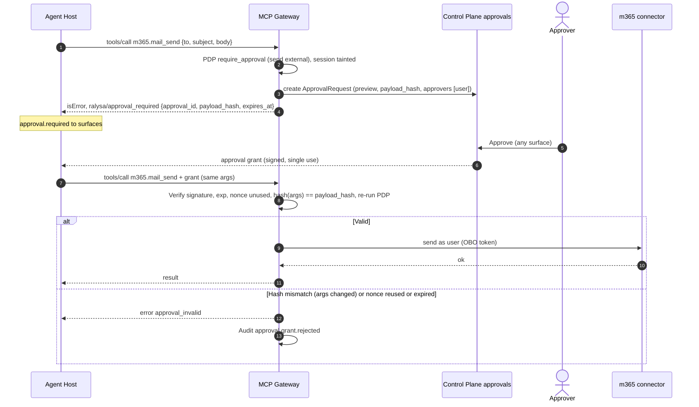

# MCP / Data Gateway

> Phase 3 · Owner: architect · Status: **Proposed for G3** · Last updated: 2026-09-25
> Spec: §4 D5, §5.2, §6.6, §6.7.3, §6.10, §6.12, §7 special controls, §8 (prompt injection, supply chain, DLP), §11, §12 · PRD: REQ-033 to REQ-037, REQ-039, REQ-040, REQ-059 to REQ-064, REQ-071, REQ-078, REQ-094, REQ-097, REQ-098 · Market: summary R-5(e), MA-103

## 1. Purpose

Every tool call that touches an enterprise system goes through the MCP/Data Gateway. It turns an SSO identity into an **identity-scoped tool catalog**, checks each call at operation level, obtains the right downstream credential **as the user**, shapes and masks results, pauses side effects for approval, treats everything it returns as untrusted data, and audits all of it (spec §6.6.1, summary R-5(e)).

Protocol baseline: the current MCP revision is **2026-07-28** ([MCP versioning](https://modelcontextprotocol.io/specification/versioning), accessed 2026-09-25). It made Streamable HTTP stateless (no protocol-level sessions, per-request version and routing headers) ([Streamable HTTP, 2026-07-28](https://modelcontextprotocol.io/specification/2026-07-28/basic/transports/streamable-http), accessed 2026-09-25). The gateway speaks 2026-07-28 to the Agent Host and supports both 2026-07-28 and the handshake-based 2025-11-25 revision toward upstream servers, because much of the connector ecosystem will lag.

## 2. Topology

The gateway is an **aggregating MCP proxy** (ADR-0017):

- The Agent Host connects to **one** MCP endpoint per tenant. `tools/list` returns only the tools this user may use (entitled AND permitted), namespaced `connector.tool` (e.g. `billing_db.query`, `m365.mail_send`). Tools the user may not use are never listed, so they are never loaded into the model's context (REQ-022, spec §6.4.2).
- Upstream MCP servers are **never** reachable from clients directly; network policy allows only the gateway to reach them.
- **Local stdio servers** (Desktop/CLI) cannot be proxied; the host runs them only if they are registered and hash-pinned, asks the **Control Plane decision API** (ADR-0011 item 6) for each call, and posts audit through the client-attested ingestion path ([observability-audit.md §3.3](observability-audit.md)) before the call runs (spec §6.6.1 "still policy-checked by hooks"; REQ-033c). They are advisory-trust (agent-protocol.md §7) and denied for T2/T3 profiles unless the device is managed (security SR-24, open question OQ-S3).

## 3. Component responsibilities

| Component | Responsibilities |
|---|---|
| **MCP endpoint** | Streamable HTTP server (2026-07-28). Validates `MCP-Protocol-Version`, `Mcp-Method`, `Mcp-Name` headers against the body and rejects mismatches, as the spec requires of servers that process the body; enforces `Origin` validation. Serves `server/discover`, `tools/list`, `tools/call`, `resources/*` (Phase 2), `subscriptions/listen` for `tools/list_changed` after policy changes. |
| **PEP + embedded PDP** | Kill-switch, connector entitlement (before policy, spec §6.15.5), operation-level policy with per-group allowlists (REQ-034), obligations (row limit, allowed tables, masking, approver chain). PDP placement and decision model per ADR-0011, engine Cedar per ADR-0002; freshness and fail-closed rules per [identity-and-policy.md §5.6](identity-and-policy.md#56-governance-state-freshness-and-fail-closed-rules-canonical). |
| **Connector registry** | Approved servers, versions, digests, tool manifests with **operation classes**, auth mode, tier, residency (section 7). Registry lives in the Control Plane; gateways hold a signed cache. |
| **Approval verifier** | Creates ApprovalRequests for `require_approval` decisions; verifies approval grants on retry (payload hash, single use, expiry) (ADR-0013). |
| **Credential broker** | Obtains a downstream credential for this user and this upstream: OAuth on-behalf-of, RFC 8693 token exchange, MCP enterprise-managed authorization (ID-JAG), per-user OAuth refresh tokens from the vault, per-user DB roles via dynamic secrets, or a flagged service account (ADR-0016). Never forwards the Ralysa token. |
| **Upstream client** | MCP client toward upstream servers (2026-07-28 and 2025-11-25), timeouts, retries for idempotent reads only, circuit breakers, SSRF-safe egress (no private-range redirects, egress proxy). |
| **Result shaper** | Row limits, pagination, truncation, large results → artifact in object storage (REQ-036). Validates `structuredContent` against `outputSchema` when present. |
| **Data protection** | PII masking (shared detector with Model Gateway), sensitivity-label enforcement (Purview/Google DLP, Phase 4), secret scanning. |
| **Untrusted-content handler** | Wraps every result with provenance and trust metadata; runs the injection scanner; raises the session tier high-water mark (model-gateway.md §4.2). |
| **Audit writer** | Two-phase audit for every call exactly as [observability-audit.md §3.2](observability-audit.md) and ADR-0022 define it (`tool.call.requested` before the upstream call, `tool.call.completed` after, or one `tool.call.denied`); fail closed (REQ-071c). |

## 4. Per-call pipeline

| # | Stage | Detail | On failure |
|---|---|---|---|
| 1 | Transport checks | Headers match body; protocol version supported; `Origin` valid | 400 / `HeaderMismatch` |
| 2 | Authn | Ralysa token `aud=mcp-gateway`; `sid` not revoked (identity-and-policy.md §4) | 401 |
| 3 | Kill-switch | Tenant/dept/pack/agent | Deny `service_halted` |
| 4 | Resolve tool | Registry: connector approved, version pinned, tool in approved manifest | Deny `unregistered` (REQ-033a) |
| 5 | Entitlement | Connector's plan active for user | Deny `not_entitled` (tool should not have been listed; audited as anomaly) |
| 6 | Policy | PDP on `{connector, tool, operation_class, resource attrs (tables, sites, cabinets), tier}` → allow / deny / require_approval + obligations | Deny `policy` + `access.denied` hint |
| 7 | Input validation | JSON Schema; SQL guard for DB tools (read-only parse, allowed tables, no DDL/DML unless write granted, REQ-037); size limits | Tool error `invalid_input` |
| 8 | Approval | If `require_approval` (policy or protected class or tainted session rule, section 6): verify grant, else create ApprovalRequest and return `approval_required` | Return `approval_required` |
| 9 | Audit intent | Durable `tool.call.requested` (ADR-0022) | Do not call upstream; caller gets `audit_unavailable` |
| 10 | Credential | Broker obtains downstream credential as the user | Deny `credential_unavailable`; if user consent missing, return `connection_required` with `/me/connections` link |
| 11 | Upstream call | Timeout (default 60 s for DB, REQ-037c), cost limits | Error result; no retry for side-effecting ops |
| 12 | Result shaping | Row limit (default 1,000), pagination, > 1 MB → artifact | — |
| 13 | Data protection | Label check; PII masking per `mask_pii`; secret scan | Redact; block labelled content to non-approved destinations |
| 14 | Untrusted wrap | Provenance envelope; injection scan; raise session HWM | Flag, never silently drop |
| 15 | Audit completion | `tool.call.completed` with row count, size, masking counts, flags | Alert; reconcile |

### 4.1 Main path (read query, as the user)

### 4.2 Failure paths

## 5. Treating tool results as untrusted

Prompt injection through email, documents, web pages and DB fields is a High risk (spec §14) and OWASP's top LLM risk ([OWASP LLM01:2025 Prompt Injection](https://genai.owasp.org/llmrisk/llm01-prompt-injection/), accessed 2026-09-25). MCP also says clients must treat tool annotations as untrusted unless they come from trusted servers, and should validate tool results before passing them to the model ([MCP tools, 2025-11-25](https://modelcontextprotocol.io/specification/2025-11-25/server/tools), accessed 2026-09-25). Controls (ADR-0018):

1. **Provenance envelope.** Every result carries `_meta["ralysa/provenance"] = {trust: "untrusted", connector, tool, source_uri?, tier, labels[], extracted_by?}`. The Agent Host places tool output into the model context inside explicit data delimiters with an instruction that it is data, not instructions (spotlighting). The host never concatenates tool output into the system prompt.
2. **Injection scanner** on results (and on extracted document text, REQ-042e): pattern and classifier detection in Arabic and English; hits set `flags: ["injection_suspected"]`, are shown on the tool card, and are audited (REQ-063b/c). Scanner results never *allow* anything; they only add friction.
3. **Taint rule (session-level).** Once a session has consumed untrusted content, every tool call in an **external side-effect** class (send, publish, share externally, write to business system, delete/move, deploy, config change) requires approval, whatever the policy's auto setting, and the approval card says which untrusted sources were in context (`influenced_by_untrusted`). Protected classes are already approval-gated by default (§6.12.2); the taint rule removes any admin loosening for tainted sessions.
4. **No tool-to-tool credential flow.** A tool result can never supply credentials, URLs for credentialed calls or approver identities; those come only from the registry and policy.
5. **Egress controls.** `web_fetch` and any URL-taking tool are subject to domain allowlists per policy; URLs that first appeared in untrusted content need approval to fetch in T2/T3 sessions. Surfaces do not auto-load remote images or links in model output (prevents markdown-image exfiltration; CSP on Web).
6. **Operation classes come from the registry**, set by admin review, not from server-supplied annotations like `readOnlyHint` or `destructiveHint`.
7. **Red-team gate:** the ≥ 100-sample Arabic/English red-team set (REQ-063a) runs in CI against the gateway + host; target 0 unapproved side effects.

## 6. Approval hooks for side-effecting tools

Approval is **enforced at the gateway**, not in the host (ADR-0013). The host is the approval UX.

- **When**: policy returns `require_approval` (connector config, e.g. `sap-erp.write: require_approval, approver: manager`), or the operation is a protected class (§6.12.2 defaults; admins can tighten but not loosen, REQ-060), or the taint rule applies. "Never automated" classes (payments, hiring decisions, fraud/customer blocking) have **no executing tool at all** (REQ-061b).
- **Binding**: the gateway computes `payload_hash = SHA-256(JCS(canonical {connector, tool, arguments, target resource}))` using JSON Canonicalization Scheme ([RFC 8785](https://www.rfc-editor.org/rfc/rfc8785), accessed 2026-09-25) and stores the ApprovalRequest in the Control Plane with the preview.
- **Grant**: when the named approver(s) approve on any surface, the Control Plane issues a signed, single-use approval grant `{approval_id, user_id, tool, payload_hash, approver_ids, exp ≤ 10 min, nonce}`.
- **Execution**: the host retries the call with the grant in `_meta["ralysa/approvalGrant"]`. The gateway recomputes the hash from the actual arguments; any difference is rejected (REQ-062b). An edited payload produces a new hash, a fresh policy check and, if still required, a new approval (REQ-062c). The nonce is burned in Redis on first use.
- **Routing**: approver resolved from policy (`user`, `manager` via IdP attribute, CAB group, department admin). Self-approval refused where another approver is required (REQ-062e). Expiry 24 h by default, then cancelled (REQ-062d).
- **Kill-switch** freezes pending approvals (REQ-064a).

## 7. Connector registration model

### 7.1 Registry entry (extends spec §11 Connector / ConnectorBinding)

| Field | Purpose |
|---|---|
| `connector_id`, `name`, `publisher`, `plan_ids[]` | Identity; which subscription unlocks it (entitlement check) |
| `transport` | `streamable_http` (remote), `hosted` (Ralysa-run container), `stdio_local` (Desktop/CLI) |
| `endpoint` / `image_digest` / `command_hash` | Pinned location; signed image digest or local command hash (supply chain, REQ-098) |
| `mcp_versions[]` | Supported protocol revisions |
| `version`, `status` | `submitted → in_review → approved → published → deprecated → revoked` |
| `auth_mode` | `obo`, `token_exchange`, `id_jag`, `per_user_oauth`, `dynamic_db_role`, `service_account` (flagged, needs platform-admin approval, REQ-035c) |
| `tool_manifest[]` | Approved tools: name, input/output schema hash, **operation_class** (`read`, `draft`, `write`, `send`, `share_external`, `delete`, `deploy`, `admin`), default approval, result limits |
| `data_tier`, `labels_supported`, `residency_region` | Tier floor of data the connector returns; where it runs |
| `egress_allowlist[]` | Hosts the connector may reach (hosted connectors) |
| `rate_limits`, `timeouts`, `cost_limits` | Per user and per tenant |
| `bindings[]` (ConnectorBinding) | Per department/profile: allowed operations, resources (tables, SharePoint sites, cabinets), replica flag, production-OLTP flag (REQ-037b) |

### 7.2 Lifecycle

1. Platform admin (or a plugin install, REQ-052) submits a connector version.
2. Automated checks: signature/digest, SBOM and CVE scan (REQ-098), manifest extraction by calling `tools/list` in a sandbox, schema lint, tool-name collision check.
3. Security review assigns operation classes and tier; service-account mode needs explicit approval.
4. Approve → publish to the signed registry cache; gateways pick it up ≤ 60 s.
5. Upstream changes to tools (`tools/list_changed`, schema or description changes) are diffed; changed tools are **quarantined** (hidden) until re-approved. This blocks "tool poisoning / rug-pull" description changes.
6. Deprecate (not offered to new sessions) → revoke (removed everywhere, running sessions get `policy.changed`).

Every step emits `registry.*` audit events (REQ-033d).

## 8. Credential brokering via vault

The gateway is the only component that holds downstream credentials, and it holds them only in memory for the call (ADR-0016). MCP forbids token passthrough: a server must not accept tokens not issued for it and must not forward the token it received downstream ([MCP security best practices, token passthrough](https://modelcontextprotocol.io/specification/2025-11-25/basic/security_best_practices), [MCP authorization 2026-07-28](https://modelcontextprotocol.io/specification/2026-07-28/basic/authorization), accessed 2026-09-25). The Ralysa token (`aud=mcp-gateway`) therefore stops at the gateway.

| Auth mode | How the user identity reaches the source | Credential storage | Examples |
|---|---|---|---|
| `obo` | OAuth on-behalf-of: gateway exchanges a user assertion for a downstream token scoped to the source ([Entra OBO flow](https://learn.microsoft.com/en-us/entra/identity-platform/v2-oauth2-on-behalf-of-flow), accessed 2026-09-25). The assertion is an IdP token for the Ralysa middle tier held by RTS, not the Ralysa token. | IdP refresh token for the middle tier in vault (per user) | Microsoft Graph (M365, SharePoint), Entra-protected APIs |
| `token_exchange` | RFC 8693 exchange at the customer AS with `subject_token` = user, `actor` = gateway | None persistent | Internal APIs behind an AS that supports token exchange |
| `id_jag` | MCP enterprise-managed authorization: identity assertion JWT authorization grant from the enterprise IdP, exchanged at the MCP server's AS ([MCP enterprise-managed authorization](https://modelcontextprotocol.io/extensions/auth/enterprise-managed-authorization), accessed 2026-09-25) | None persistent | Third-party MCP servers that support the extension |
| `per_user_oauth` | User connects the source once at `/me/connections` (authorization code + PKCE); gateway uses the refresh token | Refresh token in vault (`UserConnection.token_ref`); revoke deletes ≤ 60 s (REQ-066b) | Google Workspace, Box, Dropbox, Jira Cloud, ServiceNow OAuth |
| `dynamic_db_role` | Gateway requests a short-lived DB credential for the DB role mapped to the user (or uses a pooled login with `SET ROLE`/session context so row-level security applies) | Vault database secrets engine issues credentials with leases ([Vault database secrets engine](https://developer.hashicorp.com/vault/docs/secrets/databases), accessed 2026-09-25) | Postgres, SQL Server, Oracle, Snowflake |
| `service_account` | Source cannot represent the user; gateway uses one account and **asserts the end user in the call metadata and in Ralysa audit** | Vault | Legacy DMS, some BSS/OSS; flagged and approved (REQ-035c) |

Cloud secret managers (Azure Key Vault, GCP Secret Manager, AWS Secrets Manager) are supported behind the same broker interface (spec §8). In air-gapped installs, the vault is on-prem and only on-prem sources are registered.

## 9. Audit events emitted

Envelope and two-phase naming as in [observability-audit.md §3](observability-audit.md) (canonical); `tier` is an envelope field, and `connector_id` is required in `details` on every tool event.

| Event | Fields |
|---|---|
| `tool.call.requested` | tool_call_id, request_id, session_id, turn_id, agent_id, connector_id, connector_version, tool, operation_class, input_hash, input_redacted_ref (per retention mode), auth_mode, approval_id?, policy_version, obligations |
| `tool.call.completed` | tool_call_id, outcome (ok, error, timeout, cancelled), rows_returned, rows_total_estimate, result_bytes, artifact_ref?, truncated, pii_masked_counts{type:n}, labels_seen[], flags[] (injection_suspected, secret_redacted), latency_ms, upstream_status |
| `tool.call.denied` | tool_call_id, connector_id, tool, operation_class, reason (unregistered, not_entitled, policy, mandatory_policy, connection_required, credential_unavailable, invalid_input, label_blocked), policy_version |
| `approval.requested` | approval_id, tool_call_id, action_class, payload_hash, approvers[], expires_at, influenced_by_untrusted, sources[] |
| `approval.decided` | approval_id, decision (approved, rejected, edited, expired, frozen), decided_by, surface, new_payload_hash? |
| `approval.grant.issued` | approval_id, grant_id, payload_hash, exp |
| `approval.grant.redeemed` / `.rejected` | grant_id, tool_call_id, reason (hash_mismatch, expired, reused, policy_changed) |
| `untrusted.injection_flagged` | tool_call_id, detector, score, language, snippet_hash |
| `session.tier_raised` | session_id, from_tier, to_tier, cause (connector_id, label) |
| `credential.brokered` | connector_id, auth_mode, lease_ttl_s, subject (user), actor (gateway) (no secret values) |
| `credential.failed` | connector_id, auth_mode, error_class |
| `connection.created` / `.revoked` | user_id, connector_id, scopes, token_ref_hash |
| `registry.connector.submitted` / `.approved` / `.published` / `.deprecated` / `.revoked` | connector_id, version, digest, actor, review_notes_ref |
| `registry.tool.quarantined` / `.approved` | connector_id, tool, change (added, schema_changed, description_changed), before_hash, after_hash |
| `egress.blocked` | connector_id or tool, destination_host, reason |
| `data.production_binding.used` | connector_id, binding_id, actor (REQ-037b) |

## 10. NFR targets owned

| NFR | Target | Source |
|---|---|---|
| Gateway overhead (excluding upstream time) | p95 < 100 ms; internal budget: transport+authn 3 ms, PDP 5 ms, credential (cached) 5 ms, masking ≤ 50 ms per 1 MB, audit intent 10 ms *(proposed)* | §12 |
| Tool-call audit coverage | 100 %, fail closed | §12, REQ-071 |
| Default result limits | 1,000 rows; > 1 MB → artifact | REQ-036 |
| Default DB query timeout | 60 s | REQ-037c |
| Policy / registry change effective | ≤ 60 s | REQ-021b, REQ-033 |
| Entitlement change effective | ≤ 60 s | REQ-078a |
| Connection revoke deletes token | ≤ 60 s | REQ-066b |
| Unapproved side effects on red-team set | 0 | REQ-063a |
| PII masking quality | REQ-029 golden-set targets | REQ-036c |
| Availability / scale | 99.9 % SaaS; 1,000 → 5,000 concurrent users | §12, REQ-110 |

## 11. ADR candidates

| ADR | Decision | Status |
|---|---|---|
| **ADR-0013** | Approvals enforced at the gateway with payload-hash-bound, single-use grants | Written, Proposed |
| **ADR-0016** | Gateway as sole credential broker (OBO / token exchange / ID-JAG / vault dynamic secrets), no token passthrough | Written, Proposed |
| **ADR-0017** | Aggregating MCP proxy with identity-scoped virtual catalog (vs. per-server sidecars or client-side filtering) | Written, Proposed |
| **ADR-0018** | Untrusted-content handling: provenance envelope, spotlighting, session taint rule, registry-assigned operation classes | Written, Proposed |
| Future | Hosted connector runtime isolation (one container per connector per tenant vs. shared pool) | Candidate (with workspace-runtime / deployment) |
| ADR-0007 | Indexed search connectors and ACL sync: not in v1; pgvector-first spike in Phase 3 | Referenced (stream A) |

## 12. Open questions

| # | Question | Proposed default | Owner |
|---|---|---|---|
| GQ-1 | For DB sources without per-user accounts, do pilots accept `SET ROLE` / session-context RLS through a pooled login, or require per-user dynamic credentials? | Offer both; default dynamic per-role credentials | Architect + pilot DBA |
| GQ-2 | Taint rule strictness: should *draft* creation (auto by default) also need approval in tainted T3 sessions? | No for T1/T2; yes for T3 | Product owner + security reviewer |
| GQ-3 | Pilot ServiceNow/Jira: do they support per-user OAuth for the pilot tenant, or will they need service accounts (flagged)? (A-7) | Per-user OAuth | Pilot discovery |
| GQ-4 | How long do we support MCP 2025-11-25 upstream servers after 2026-07-28 adoption? | ≥ 12 months, reviewed quarterly | Architect |
| GQ-5 | Injection-scanner model: in-house classifier vs. a vendor guard model; must run locally for T3 and air-gapped. | Local classifier + rules; evaluate on REQ-063 set | Security reviewer |
| GQ-6 | Approval grant lifetime after approval (10 min proposed) vs. long-running workflows (scheduled agents, Phase 2+)? | 10 min interactive; scheduled agents need pre-approved runbooks | Product owner |

## References

All accessed 2026-09-25.

- MCP versioning (current revision 2026-07-28): https://modelcontextprotocol.io/specification/versioning
- MCP Streamable HTTP, 2026-07-28: https://modelcontextprotocol.io/specification/2026-07-28/basic/transports/streamable-http
- MCP authorization, 2026-07-28: https://modelcontextprotocol.io/specification/2026-07-28/basic/authorization
- MCP security best practices (token passthrough, confused deputy, SSRF, local servers): https://modelcontextprotocol.io/specification/2025-11-25/basic/security_best_practices
- MCP tools (annotations untrusted, human in the loop): https://modelcontextprotocol.io/specification/2025-11-25/server/tools
- MCP enterprise-managed authorization extension (ID-JAG): https://modelcontextprotocol.io/extensions/auth/enterprise-managed-authorization
- Microsoft Entra on-behalf-of flow: https://learn.microsoft.com/en-us/entra/identity-platform/v2-oauth2-on-behalf-of-flow
- RFC 8693 OAuth 2.0 Token Exchange: https://www.rfc-editor.org/rfc/rfc8693
- RFC 8785 JSON Canonicalization Scheme: https://www.rfc-editor.org/rfc/rfc8785
- HashiCorp Vault database secrets engine: https://developer.hashicorp.com/vault/docs/secrets/databases
- OWASP Top 10 for LLM Applications 2025, LLM01 Prompt Injection: https://genai.owasp.org/llmrisk/llm01-prompt-injection/
