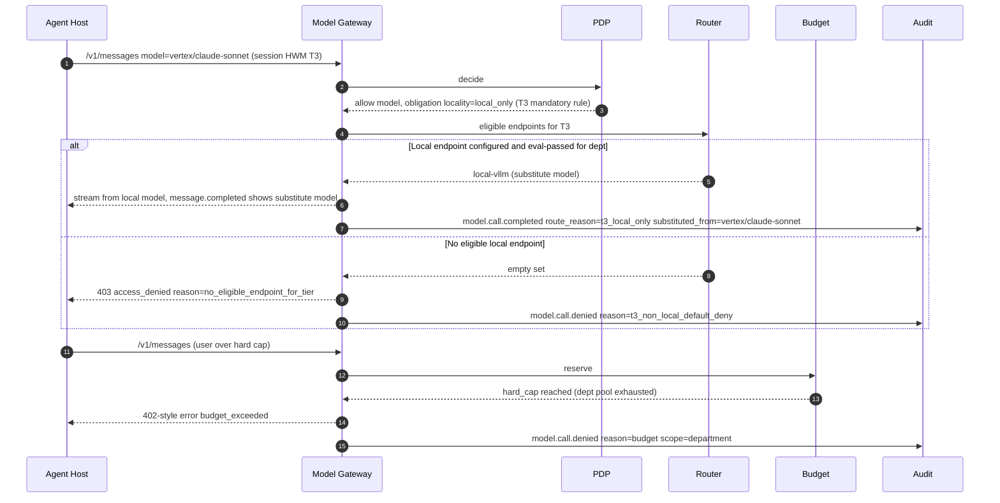

# Model Gateway

> Phase 3 · Owner: architect · Status: **Proposed for G3** · Last updated: 2026-09-25
> Spec: §4 D4, §6.5, §6.11.1, §6.12.1 (pre-model), §6.15.5, §7.7, §8, §9, §12 · PRD: REQ-024 to REQ-032, REQ-054, REQ-057, REQ-064, REQ-071, REQ-079, REQ-094 · DV-2, DV-4, DV-12, DV-13, DV-18 · Market: MA-302, MA-303, summary R-5(a)(b)(c)(d)(g)
> Phase 0 brief: F-004 (Model Gateway v0), cross-checked in the G3 consistency review ([consistency-review.md](consistency-review.md)). v0 = one provider (Claude on Vertex AI, regional endpoint, [ADR-0005](adr/0005-phase0-model-provider-and-region.md)), one approved model, vault credential, two-phase audit and UsageRecord per call, deployment-level `max_tier = T1`.

## 1. Purpose and constraints

The Model Gateway is the only path from any Ralysa component to any model. It decides **whether** a call may happen, **where** it may run, **what** leaves the tenant, and **who pays**, and it records all of that.

Binding constraints:

- **Inference location is the binding residency constraint** (MA-302). Frontier in-country inference is scarce in the Gulf; Claude on Bedrock in the Middle East uses global cross-region inference, and Azure regional OpenAI deployments exist only in UAE North ([regulation.md](../market/regulation.md) evidence table). T3 data therefore needs local models from Phase 1 (DV-2).
- **Default-deny non-local for T3** (REQ-028a). **C4 only in air-gapped** deployments (REQ-094d, DV-13).
- **Inference region in every audit and usage record** (DV-12, REQ-032c).
- **Pooled usage metering with spend limits** in Phase 1 (DV-4, REQ-079).
- **Keys never reach clients** (spec §6.5.3, REQ-095).
- **Gateway overhead p95 < 100 ms** (spec §12).
- **Engine reality (risk ER-1, stated once in [overview.md §4.1](overview.md#41-non-negotiables-where-each-is-enforced)):** the Agent Host uses the Claude Agent SDK, which speaks the Anthropic Messages API to a gateway. Anthropic states it does not support routing Claude Code to non-Claude models through any gateway ([Claude Code, other LLM gateways](https://code.claude.com/docs/en/llm-gateway), accessed 2026-09-25). Routing T3 turns to a local open-weight model through the same engine is therefore **technically possible but vendor-unsupported**. Mitigation: the REQ-030 eval gate, translation conformance tests, and a second-engine go/no-go before the RA pack (section 9, ADR-0014).
- **Single inference choke point (SR-03):** every model, embedding, OCR-model and classifier call from any Ralysa component goes through this gateway with the session's tier. A CI rule bans provider SDK imports outside `services/model-gateway`, and NetworkPolicy blocks provider egress from every other workload.

Stream A decisions this design uses: TypeScript policy layer ([ADR-0001](adr/0001-services-language-typescript.md)), Cedar as the PDP engine ([ADR-0002](adr/0002-policy-engine-cedar.md)), the Phase 0 provider ([ADR-0005](adr/0005-phase0-model-provider-and-region.md)) and vLLM as the bundled local runtime ([ADR-0006](adr/0006-local-model-runtime.md); Ollama for developer machines only). LiteLLM is only a replaceable provider-adapter stage, as the spec suggests (§6.5.4, §10.3), under the deployment constraints in [ADR-0014](adr/0014-model-gateway-policy-front-and-provider-adapter.md).

## 2. Component responsibilities

| Component | Responsibilities |
|---|---|
| **Ingress / API layer** | Northbound APIs (section 3). TLS 1.2+, request size limits, request id, trace context, streaming (SSE). |
| **Authn** | Validate Ralysa access token (`aud=model-gateway`), revocation list, `ent_ver`/`pol_ver` freshness (identity-and-policy.md §4). |
| **Context resolver** | Resolve principal (department, tier, profiles, plans), session tier high-water mark (section 4.2), classification mapping, deployment model. |
| **PEP + embedded PDP** | Kill-switch, entitlement (model tier, e.g. Advanced Models), model allowed, personal-key rule, per-request token cap. PDP placement and decision model per ADR-0011; engine Cedar per ADR-0002. Freshness and fail-closed rules per [identity-and-policy.md §5.6](identity-and-policy.md#56-governance-state-freshness-and-fail-closed-rules-canonical). |
| **Budget service** | Pre-authorization reservation against user/department/org limits and pools; settlement after the call (ADR-0019). |
| **Router** | Compute the eligible endpoint set from the **endpoint registry** and policy, pick one, and compute the fallback chain (ADR-0015). |
| **Privacy filter** | PII detection and masking (Arabic + English) before any non-local call; reversible placeholder map; unmasking of the response where policy allows (REQ-029). Label checks (Phase 4, REQ-097). |
| **Credential broker** | Fetch provider credentials from the vault (or cloud workload identity); short in-memory cache; never logged; never returned. |
| **Provider adapter** | Translate the internal request to the provider API and back, including tool-calling translation and prompt-caching passthrough. Implemented with LiteLLM Proxy (or its SDK) in Phase 1; replaceable (ADR-0014). |
| **Metering** | Build UsageRecord (tokens, cache reads/writes, cost, credits, model, endpoint, inference region, BYOM flag) and settle reservations. |
| **Audit writer** | Two-phase audit exactly as [observability-audit.md §3.2](observability-audit.md) and ADR-0022 define it: `model.call.requested` committed before the provider call (fail closed, REQ-071c), `model.call.completed` after, or a single `model.call.denied`. |
| **Endpoint registry** (Control Plane data) | ModelProvider and ModelEndpoint records with locality, regions, eligible tiers/classifications, eval status per department, credential_ref, price book. |
| **Health monitor** | Circuit breakers per endpoint; health feed to `/admin` system health (REQ-067d) and alerts (REQ-074c). |

## 3. Northbound APIs

| API | Consumers | Notes |
|---|---|---|
| **Anthropic Messages-compatible** `POST /v1/messages` (streaming), `POST /v1/messages/count_tokens`, `GET /v1/models` | Agent Host (Claude Agent SDK engine) | Forward `anthropic-version` and `anthropic-beta` unchanged; use `x-claude-code-session-id` / agent-id headers only for correlation ([Claude Code gateway compatibility guide](https://code.claude.com/docs/en/llm-gateway-protocol), accessed 2026-09-25). `/v1/models` returns only models this user may use (REQ-002b). |
| **OpenAI Chat Completions-compatible** `POST /v1/chat/completions` | Internal services (evals REQ-030, extraction, title generation), a future second engine | Same pipeline, same policy. |
| **Internal** `POST /internal/v1/route-preview` | `/admin` explainability, evidence pack | Returns the routing decision without calling a model. |

Identity is always from the Ralysa token. Headers or body fields that claim a user, department or tier are ignored except the **client tier hint**, which can only raise the effective tier, never lower it.

## 4. Request pipeline

### 4.1 Stages

| # | Stage | Decision / action | On failure |
|---|---|---|---|
| 1 | Authn | Token valid for `model-gateway`, `sid` not revoked | 401, audit `model.call.denied reason=unauthenticated` |
| 2 | Kill-switch | Tenant/department/pack/agent halted? | Deny `service_halted` |
| 3 | Context | Principal, dept tier, session tier HWM, classification | Fail closed if HWM store unavailable for T2/T3 tenants (treat as T3) |
| 4 | Policy + entitlement | Model allowed; model tier entitled; personal key allowed; `per_request_max_tokens` | Deny `access_denied` + `access.denied` to surface |
| 5 | Budget reservation | Estimate cost, reserve against user → dept → org limits and pool | Deny `budget_exceeded` (hard cap) or continue with soft-cap warning |
| 6 | Route | Eligible endpoints = allowed ∩ tier/classification/region eligible ∩ eval-passed for dept ∩ healthy; choose primary and fallback chain | Deny `no_eligible_endpoint` (never widen, REQ-028e) |
| 7 | Privacy filter | If chosen endpoint is non-local: mask PII in prompt, tool results and attachments; label check | Deny if masking engine fails (fail closed) |
| 8 | Audit intent | Durable write of `model.call.requested` (ADR-0022) | Do not call provider (REQ-071c); caller gets `audit_unavailable` |
| 9 | Credential | Vault / workload identity | Try next endpoint in chain (same or stricter residency) |
| 10 | Provider call | Adapter call, streaming | Fallback per matrix (section 8) |
| 11 | Response filter | Unmask where allowed; output scan; AI label marker | Redact on scan hit |
| 12 | Meter + settle | UsageRecord, settle reservation | Queue for retry; never double-charge (idempotent by request id) |
| 13 | Audit completion | `model.call.completed` | Alert; reconciliation job pairs orphan intents |

### 4.2 Session tier high-water mark (HWM)

The gateway cannot trust the client to say how sensitive a conversation is. The **session tier HWM** is kept server-side (Redis, keyed by `tenant:session_id`) and only ever rises within a session:

- Initial value = department tier (and pack tier floor, REQ-083).
- The MCP/Data Gateway raises it when a tool result carries a higher tier or a restricted label (mcp-gateway.md §5).
- The Control Plane raises it when a T2/T3 memory entry or attachment is loaded.
- Effective tier for a call = max(HWM, dept tier, client hint).

A T1 Technology session that reads a T3 record becomes T3 for the rest of the session, so its next model call can only go to a local endpoint. The surface is told (`usage.update` carries `data_tier`) so users understand why the model changed.

### 4.3 Main path

```mermaid
sequenceDiagram
    autonumber
    participant AH as Agent Host
    participant GW as Model Gateway (policy front)
    participant PDP as Embedded PDP
    participant B as Budget service
    participant R as Router + registry
    participant PF as Privacy filter
    participant AU as Audit store
    participant V as Vault
    participant LL as Provider adapter (LiteLLM)
    participant P as Provider endpoint

    AH->>GW: POST /v1/messages Bearer aud=model-gateway
    GW->>GW: Validate token, revocation, kill-switch
    GW->>GW: Resolve context (dept tier T2, session HWM T2, classification C2)
    GW->>PDP: decide(model vertex/claude-sonnet, context)
    PDP-->>GW: allow + obligations (mask_pii, region in-country or in-region)
    GW->>B: reserve(estimate) user, dept, org pool
    B-->>GW: reservation_id, cap_state ok
    GW->>R: eligible endpoints for model, T2, C2, dept eval status
    R-->>GW: primary incountry-endpoint-1 (in_country, non-local; illustrative), fallback [local-vllm-arabic]
    GW->>PF: mask(request) because primary is non-local
    PF-->>GW: masked request + placeholder map (in memory)
    GW->>AU: model.call.requested (endpoint, region, tier, classification, masking counts)
    AU-->>GW: ack (durable)
    GW->>V: get credential (cached, short TTL)
    GW->>LL: call (masked, streaming)
    LL->>P: provider API
    P-->>LL: stream
    LL-->>GW: stream
    GW->>PF: unmask where policy allows
    GW-->>AH: SSE stream (Anthropic format)
    GW->>B: settle(actual tokens, cost)
    GW->>AU: model.call.completed (tokens, cost, endpoint_region, inference_region, latency)
```

The endpoint in this example is illustrative. Google lists no Middle East region for Claude on Vertex AI today, so Phase 0 uses a regional endpoint outside the Gulf with synthetic T1 data only ([ADR-0005](adr/0005-phase0-model-provider-and-region.md)).

### 4.4 Failure paths: T3 default-deny and budget



Substitution to a local model is allowed only if the tenant has enabled "substitute on tier" for that department; otherwise the call is denied and the user is told to switch model. An **explicit, audited T3 exception** (REQ-028a) is a time-boxed policy object created by a platform admin with a second approver; it names department, endpoint, purpose and expiry, and every call under it records `exception_id`.

## 5. Routing by tier × classification × region (DV-2)

Each **ModelEndpoint** in the registry carries eligibility labels (extends spec §11 ModelProvider):

| Field | Example | Meaning |
|---|---|---|
| `locality` | `local` \| `in_country` \| `in_region` \| `global` | Where inference physically runs. `local` = customer-operated (on-prem, dedicated cluster). `global` covers cross-region inference such as Bedrock global inference profiles. |
| `inference_regions[]` | `["qa-doha"]`, `["me-central1"]`, `["global"]` | Declared by admin from provider docs; verified per MA-302 / OQ-5. |
| `max_tier` | `T1` \| `T2` \| `T3` | Highest tier allowed (T3 only for `local`, unless exception). |
| `max_classification` | `C2` | Per jurisdiction mapping (REQ-094). |
| `jurisdictions[]` | `["QA"]` | Where the tenant's rules consider it in-country. |
| `eval_status{dept}` | `passed@suite v3, 2026-09-20` | REQ-030 gate; new model version resets to `pending`. |
| `routing_class` | `small` \| `large` | Size-based routing (REQ-057). |
| `byom_scope` | `org` \| `dept:<id>` \| `user:<id>` | Key level (spec §6.5.1). |

Routing function (data, not code; changes apply ≤ 60 s, REQ-028c):

```
eligible = { e in endpoints |
    e.model in policy.allowed_models(user)
    and tier_rank(effective_tier) <= tier_rank(e.max_tier)
    and class_rank(effective_classification) <= class_rank(e.max_classification)
    and e.locality satisfies policy.residency(effective_tier, tenant.jurisdiction)
    and e.eval_status[dept] == passed
    and e.healthy
    and (e.byom_scope visible to user) }
primary  = prefer(eligible, requested_model, routing_class, locality: local > in_country > in_region > global)
fallback = [ f in eligible \ {primary} | residency_rank(f) <= residency_rank(primary) ]   # never widen (REQ-028e)
```

Default residency table *(proposed, tenant-configurable as policy data)*:

| Tier | Allowed localities | PII masking | Personal keys |
|---|---|---|---|
| T1 | local, in_country, in_region; `global` only if tenant allows | Before any non-local call | Allowed if policy allows |
| T2 | local, in_country; `in_region` only for tenants where counsel confirms (OQ-2) | Mandatory before non-local | Denied by default |
| T3 | local only (exception object required for anything else) | n/a (local); masking still applies to logs | Always denied (mandatory) |
| C4 | local, and only in air-gapped deployments | n/a | Denied |

### 5.1 Inference region in audit (DV-12)

Field names follow the canonical envelope ([observability-audit.md §3.1](observability-audit.md)) and security SR-04:

- `endpoint_region`: the region of the endpoint the gateway called (from its own configuration, never from the client).
- `inference_region`: the **processing geography**, where inference actually runs. It comes from the endpoint registry, which stores it per deployment type with vendor evidence and a verification date (SR-04). For a Vertex AI regional endpoint it equals the pinned region; for Bedrock global cross-region inference or a Vertex global endpoint it is `global`, even when `endpoint_region` is in the Gulf.
- `inference_region_source` (`registry_declared` or `provider_reported`) and, where the provider response exposes the serving location (for example the Anthropic API's `usage.inference_geo`), `inference_region_observed`. A mismatch with the declared value raises `model.region.mismatch` and an alert.

All three are recorded on every `model.call.requested`, `model.call.completed`, `model.call.denied` (the endpoint that would have been used) and UsageRecord. Global, cross-region and data-zone deployment types are ineligible for T2/T3 unless an audited exception exists (ADR-0015 validation), and fallback never widens geography. Registry evidence is re-verified quarterly (SR-04). The evidence pack (REQ-070c) builds its data-location schedule from these fields.

## 6. PII masking (DV-2, REQ-029)

- Runs before any non-local call, over system prompt dynamic parts, user messages, tool results and extracted attachment text.
- Entities (Arabic + English): person names, Qatar QID and other national IDs, passport numbers, phone numbers (including +974), email, IBAN, card numbers (Luhn), addresses, MSISDN/IMSI for telecom (REQ-045d).
- Replacement with typed, consistent placeholders per request (`<PERSON_3>`), so the model can still reason about relations. The placeholder map lives only in gateway memory for the call (and Redis for streamed continuation within a turn, encrypted, TTL = turn), never in logs.
- Unmasking in the response only where policy allows; otherwise placeholders reach the user.
- Engine: a pluggable detector. Microsoft Presidio supports additional languages through configurable NLP engines (spaCy, Stanza, transformers) and language-specific recognizers, but Arabic is not provided out of the box and needs Arabic models plus custom recognizers ([Presidio multi-language docs](https://github.com/microsoft/presidio/blob/main/docs/analyzer/languages.md), accessed 2026-09-25). LiteLLM can run such a filter as a `pre_call` guardrail, which is the mode that can modify requests ([LiteLLM custom guardrails](https://docs.litellm.ai/docs/proxy/guardrails/custom_guardrail), accessed 2026-09-25). Whether masking runs in the Ralysa policy front or as a LiteLLM guardrail follows ADR-0014. Acceptance: REQ-029 golden set (recall ≥ 95 %, precision ≥ 90 % per language).
- Masking failures (detector down, timeout) **fail closed** for non-local calls.
- Binary media (images, PDFs sent natively to multimodal models) cannot be text-masked. For T2+ sessions to non-local endpoints they are blocked or converted (OCR → mask → text) before the call (SR-05). Masking runs on the final provider-bound payload, including `tool_result` blocks, never in the host.
- Audit stores counts per entity type only (REQ-029c).

## 7. Metering, pooled allowance and budgets (DV-4)

### 7.1 Model

| Concept | Rule |
|---|---|
| Credit | $0.01 (tenant-configurable unit), priced from a versioned **price book** per endpoint (input, output, cache read, cache write) |
| Pools | Org pool (sum of seat allowances by weight Lite/Core/Power, REQ-076c); optional department pools carved from it; no rollover (REQ-079d) |
| Spend limits | Org, department and user limits, each with alert → soft cap → hard cap (REQ-079) |
| BYOM | Calls with an org/dept/personal BYO key are metered (tokens, provider cost estimate) but draw **no** credits (REQ-079e) |
| Per-request cap | `per_request_max_tokens` from policy; enforced by clamping `max_tokens` and rejecting oversized input |
| Local models | Metered in tokens and GPU-seconds; credit price per tenant (may be 0; A-4 says GPU cost sits outside seat pricing) |

### 7.2 Enforcement (ADR-0019)

1. **Reserve** before the call: estimate = input tokens (local count or `count_tokens`) × input price + requested `max_tokens` × output price. Atomic check-and-hold in Redis against user, department and org counters and the pool.
2. **Settle** after the call with actual usage (including cache reads/writes from the provider response); release the difference. Cancelled streams settle what was consumed.
3. **Ledger**: every settlement appends a UsageRecord to Postgres (append-only) with `reservation_id` and `request_id` as idempotency keys. Nightly reconciliation against provider-reported usage (REQ-032b, within 1 %).
4. **Caps**: soft cap sets `cap_state=soft` in `usage.update` (warning in en/ar); hard cap denies new reservations with `budget`. In-flight calls are allowed to finish.
5. **Redis loss**: counters are rebuilt from the ledger; while rebuilding, the gateway allows calls only for tenants/departments below 80 % of their limit at the last snapshot *(proposed)* and denies the rest (bounded overspend, documented).

LiteLLM's own virtual keys and budgets are **not** the source of truth, because pooled org credits with department sub-pools, BYOM exclusion and a credit unit are Ralysa rules and must reconcile with the subscription ledger.

### 7.3 UsageRecord (extends spec §11)

`id, request_id, reservation_id, org_id, user_id, dept_id, session_id, turn_id, agent_id, model, endpoint_id, provider, locality, endpoint_region, inference_region, inference_region_source, price_book_version, tier, classification, tokens_in, tokens_out, cache_read_tokens, cache_write_tokens, credits, cost_estimate, currency, byom (bool), key_scope, connector_ids[] (tools used in the turn), fallback_used (bool), ts`.

## 8. BYO keys

| Level | Added by | Scope | Constraints |
|---|---|---|---|
| Organization | Platform admin | Everyone, filtered by policy | Stored in vault; DB holds `credential_ref` only (REQ-025b) |
| Department | Department admin | Department members | Only models the platform admin's ceiling allows (REQ-068c) |
| Personal | User, if policy allows | Owner only | Never for T3 (mandatory, REQ-026c); shown masked (last 4); no API returns it (REQ-026d) |

- Keys are written through a write-only API into the vault (HashiCorp Vault or the cloud secret manager, spec §8). Cloud providers use workload identity where possible (Vertex workload identity federation, Bedrock IAM role, Entra managed identity; spec §6.5.2), so there is no static secret.
- Key selection: the user chooses a model; the router considers endpoints whose `byom_scope` is visible to that user. A personal-key endpoint is still subject to tier/region eligibility.
- Rotation: new version in vault; the credential cache TTL (≤ 5 min *(proposed)*) picks it up without downtime (REQ-095b).
- Air-gapped: only local endpoints and internal tokens; no external key types can be registered.

## 9. Non-Claude and local models

The Agent Host (Claude Agent SDK) calls `/v1/messages`. For endpoints that are not Claude (local vLLM/Ollama, Arabic open or sovereign models, OpenAI, Azure OpenAI), the provider adapter translates Anthropic Messages format to the endpoint's API. LiteLLM documents an Anthropic-format `/v1/messages` endpoint that routes to all its providers with streaming and tool use ([LiteLLM /v1/messages](https://docs.litellm.ai/docs/anthropic_unified), accessed 2026-09-25). vLLM itself serves both an OpenAI-compatible `/v1/chat/completions` API with tool calling and an Anthropic Messages API (`/v1/messages`, `/v1/messages/count_tokens`) ([vLLM online serving](https://docs.vllm.ai/en/latest/serving/online_serving/), accessed 2026-09-25), so for a vLLM local runtime the adapter can pass Anthropic format through with less translation. Tool-use quality still depends on the model and its chat template, which is why the eval gate below is mandatory.

Because Anthropic does not support this configuration for its agent harness (section 1), Ralysa treats it as risk **ER-1** with the single mitigation plan stated in [overview.md §4.1](overview.md#41-non-negotiables-where-each-is-enforced) and repeated verbatim in ADR-0006, ADR-0012, ADR-0014 and ADR-0015:

1. **Eval gate** (REQ-030): a non-Claude model is enabled for a department only after the department's tool-use golden set passes through the real engine + translation path.
2. **Translation conformance tests**: tool calling, streaming, stop reasons, cache-control fields ignored safely, thinking blocks dropped, long-context behaviour.
3. **Second-engine option, decided before the RA pack**: the Agent Protocol and EnginePort (ADR-0012) allow a second engine adapter that speaks OpenAI-compatible APIs natively for local-model sessions. A spike runs in Phase 2, and a go/no-go is taken **before the RA pack (REQ-086) enables any T3 department**, based on the eval results. No client release is needed either way.

Open question MQ-1 tracks the go/no-go.

## 10. Failure and fallback matrix

Fallback candidates always come from the pre-computed chain (same or stricter residency, still allowed, eval-passed). Fallback never selects a less restricted region or tier (REQ-028e) and never a model outside the user's allowed list (REQ-031b).

| Failure | Detection | Action | User sees | Audit |
|---|---|---|---|---|
| Provider 5xx / timeout | HTTP status, `request_timeout` | Retry once on same endpoint (idempotent, before first byte), then next in chain ≤ 10 s total (REQ-031a) | `message.completed` names the model that answered | `model.fallback.used` |
| Provider 429 / quota | 429, `retry-after` | Next in chain; if none, return `rate_limited` with retry-after | Retry-after message (REQ-031c) | `model.rate_limited` |
| Stream breaks after first byte | Stream error | No transparent retry (would duplicate output); end turn with error; settle consumed tokens | Error with "retry" action | `model.call.completed outcome=error partial=true` |
| Context window exceeded | Provider error or pre-check | Next in chain with larger window only if same residency; else ask host to compact | Compaction notice | `model.fallback.used reason=context_window` |
| Content-policy refusal by provider | Provider error | No automatic fallback to a different vendor (policy choice) | Refusal shown | `model.call.completed outcome=refused` |
| Credential fetch fails (vault down) | Vault error | Next endpoint whose credential is cached or uses workload identity; else deny | "Model temporarily unavailable" | `model.credential.unavailable` |
| No eligible endpoint (tier/region) | Router empty set | Deny, never widen | `access.denied` reason tier/residency | `model.call.denied` |
| Circuit open on endpoint | Breaker | Skip endpoint in chain | — | `model.endpoint.circuit_opened` |
| Masking engine fails | Detector error/timeout | Deny non-local; local endpoints unaffected | "Protected content check failed" | `model.call.denied reason=masking_unavailable` |
| Audit store unavailable | Intent write fails | Deny (fail closed, REQ-071c) | "Audit unavailable" (`audit_unavailable`, F-005 AC-11) | Denial event to local durable spool + alert |
| Budget service unavailable | Redis error | Ledger-snapshot rule (ADR-0019 decision 5) | Warning or deny | `model.budget.degraded` |
| Governance heartbeat or policy bundle stale | Heartbeat age; bundle version behind the announced version | Rules G-1 and G-2 of the canonical table in [identity-and-policy.md §5.6](identity-and-policy.md#56-governance-state-freshness-and-fail-closed-rules-canonical) | "Policy refresh pending" or "Service temporarily unavailable" | `policy.bundle.stale`, `model.call.denied reason=governance_stale` |
| Local model runtime down (T3) | Health check | No non-local fallback; deny | Clear message; admin alerted | `model.call.denied reason=no_eligible_endpoint_for_tier` |
| Kill-switch | Control-plane push | Deny all; abort streams | `governance.halted` | `model.call.denied reason=kill_switch` |

## 11. Deployment variants

| Deployment | Endpoints | Notes |
|---|---|---|
| Dedicated in-country cloud | Local runtime in cluster + in-country/in-region cloud endpoints per tenant policy | Registry lists verified regions (OQ-5) |
| On-prem | Bundled local runtime (REQ-102) + optional outbound to approved cloud endpoints | Outbound proxy allow-list per endpoint |
| Air-gapped | Local only; no outbound; price book local; LiteLLM with no external callbacks or telemetry | C4 allowed only here |
| Multi-tenant SaaS (Phase 4, in-region) | Shared gateway pool, per-tenant registry and budgets | Tenancy per ADR-0003 (Phase 4 model gets its own ADR) |

## 12. Audit events emitted

Envelope and two-phase naming as in [observability-audit.md §3](observability-audit.md) (canonical). `tier`, `classification`, `endpoint_id`, `endpoint_region`, `inference_region` and `inference_region_source` are envelope fields and are required on every model event (DV-12, SR-04). The fields below go in `details`.

| Event | Fields |
|---|---|
| `model.call.requested` | request_id, session_id, turn_id, agent_id, model_requested, model_selected, endpoint_id, provider, locality, inference_region, tier, classification, route_reason, exception_id?, masking {applied, counts_by_entity}, reservation_id, key_scope, prompt_ref (per tier retention mode, OQ-16) |
| `model.call.completed` | request_id, outcome (ok, error, refused, cancelled), tokens_in/out, cache_read/write, credits, cost_estimate, latency_ms, ttft_ms, inference_region, inference_region_observed?, fallback_used, partial |
| `model.call.denied` | request_id, model_requested, reason (unauthenticated, kill_switch, not_entitled, policy, budget, t3_non_local_default_deny, no_eligible_endpoint_for_tier, masking_unavailable), would_be_region, policy_version |
| `model.fallback.used` | request_id, from_endpoint, to_endpoint, reason, from_region, to_region |
| `model.rate_limited` | request_id, scope (user, dept, provider), retry_after_s |
| `model.region.mismatch` | endpoint_id, declared_region, observed_region |
| `model.endpoint.circuit_opened` / `.closed` | endpoint_id, error_rate, window |
| `model.credential.unavailable` | endpoint_id, credential_ref_hash, error_class |
| `model.budget.threshold_crossed` | scope, scope_id, threshold (alert, soft, hard), used, limit |
| `model.budget.degraded` | mode, snapshot_age_s |
| `model.exception.used` | exception_id, dept_id, endpoint_id, expires_at |
| `model.registry.changed` | endpoint_id, change (added, updated, disabled), before, after, actor |
| `model.key.added` / `.rotated` / `.removed` | provider_id, scope, credential_ref_hash, actor (key never logged) |
| `model.eval.recorded` | endpoint_id, dept_id, suite_version, score, threshold, result |

## 13. NFR targets owned

| NFR | Target | Source |
|---|---|---|
| Gateway overhead (excluding provider time) | p95 < 100 ms; internal split as in [overview.md §5](overview.md#5-nfr-budget) N2 (authn 2 ms, entitlement + policy 5 ms, budget 5 ms, routing + cached credential 5 ms, audit intent 10 ms, masking ≤ 60 ms for ≤ 8k incremental tokens, headroom 13 ms) *(proposed split)* | §12, REQ-027d |
| Model call audit coverage | 100 %, fail closed | §12, REQ-071 |
| Inference region populated | 100 % of audit and usage records | DV-12, REQ-032c |
| Fallback time | ≤ 10 s | REQ-031a |
| Routing / policy change effective | ≤ 60 s | REQ-028c |
| Usage visible to user | ≤ 15 min | REQ-032d |
| Reconciliation with provider | within 1 % monthly | REQ-032b |
| Availability | 99.9 % SaaS; HA on-prem | §12 |
| Scale | 1,000 concurrent users Phase 1, 5,000 Phase 4 | REQ-110 |

## 14. ADR candidates

| ADR | Decision | Status |
|---|---|---|
| **ADR-0014** | Model Gateway structure: Ralysa policy front + replaceable provider adapter (LiteLLM); Anthropic-compatible northbound API; handling of non-Claude models | Written, Proposed |
| **ADR-0015** | Residency routing as data: endpoint eligibility labels, session tier high-water mark, never-widen fallback | Written, Proposed |
| **ADR-0019** | Budget enforcement and metering by reservation + append-only ledger (vs. post-hoc decrement or LiteLLM budgets); absorbs the withdrawn ADR-0023 | Written, Proposed |
| ADR-0001, ADR-0005, ADR-0006 | Implementation language (TypeScript), Phase 0 provider (Vertex regional), local runtime (vLLM) | Referenced (stream A) |
| Future | PII detection engine selection for Arabic (Presidio + Arabic models vs. alternatives) after golden-set bake-off | Candidate |
| Future | Prompt retention modes per tier (full / redacted / metadata-only), OQ-16 | Candidate (with observability) |

## 15. Open questions

| # | Question | Proposed default | Owner |
|---|---|---|---|
| MQ-1 | Is vendor-unsupported translation (Claude Agent SDK → non-Claude local model) acceptable for T3 packs, or do we plan a second engine for T3 from Phase 2? | Accept for Phase 1 behind eval gate (pilot is T1/T2, A-5); decide second engine before RA pack (Phase 2) based on eval results | Architect + product owner |
| MQ-2 | Which endpoints have verified in-country inference for Qatar (Vertex Doha, Azure Qatar Central)? (OQ-5) | Assume none; T2 → local for bank tenants until verified | Product owner |
| MQ-3 | Does masked text sent to a foreign model satisfy QCB Art. 21.4 (OQ-2)? Determines T2 default locality. | T2 = local or in-country only for bank tenants | Legal |
| MQ-4 | Substitute-on-tier (silently switch to a local model when HWM rises) vs deny-and-ask? | Tenant option, default **deny-and-ask** for transparency | Product owner |
| MQ-5 | Credit price for local-model usage (0 or GPU-cost based)? | 0 credits, metered in tokens and GPU-seconds for chargeback | Founder |
| MQ-6 | Can we observe the actual serving region from Bedrock global inference or Vertex responses? If not, `global` endpoints stay T1-only. | T1-only | Architect |
| MQ-7 | ~~Phase 0 brief F-004 not reviewed in this pass.~~ **Closed** in the G3 consistency review: v0 scope matches (one provider, vault, usage record, audit). Brief changes BC-04, BC-07, BC-08, BC-09 in `consistency-review.md`. | — | Closed |

## References

All accessed 2026-09-25.

- Claude Code, other LLM gateways (non-Claude routing not supported): https://code.claude.com/docs/en/llm-gateway
- Claude Code, gateway compatibility guide (endpoints, headers): https://code.claude.com/docs/en/llm-gateway-protocol
- Claude Code, connect to an LLM gateway: https://code.claude.com/docs/en/llm-gateway-connect
- LiteLLM, Anthropic-format `/v1/messages`: https://docs.litellm.ai/docs/anthropic_unified
- LiteLLM, custom guardrails (pre_call, during_call, post_call): https://docs.litellm.ai/docs/proxy/guardrails/custom_guardrail
- LiteLLM, fallbacks, retries, cooldowns: https://docs.litellm.ai/docs/proxy/reliability
- vLLM, online serving (OpenAI-compatible and Anthropic Messages APIs): https://docs.vllm.ai/en/latest/serving/online_serving/
- Microsoft Presidio, multi-language support: https://github.com/microsoft/presidio/blob/main/docs/analyzer/languages.md
- Microsoft Learn, Azure Foundry model region availability (via regulation.md MA-302): https://learn.microsoft.com/en-us/azure/foundry/foundry-models/concepts/models-sold-directly-by-azure-region-availability
- AWS, Bedrock global cross-region inference for Claude in the Middle East (via regulation.md MA-302): https://aws.amazon.com/blogs/machine-learning/introducing-amazon-bedrock-global-cross-region-inference-for-anthropics-claude-models-in-the-middle-east-regions
- Google Cloud, Vertex AI data residency (via regulation.md): https://docs.cloud.google.com/vertex-ai/generative-ai/docs/learn/data-residency
