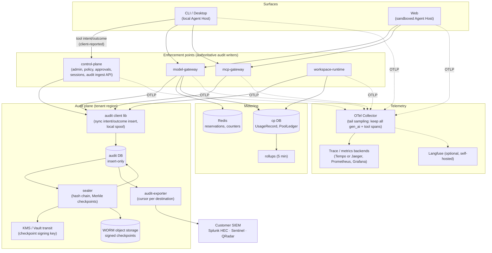
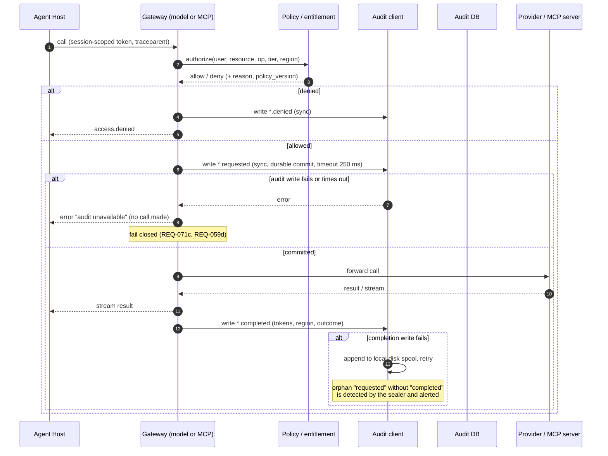
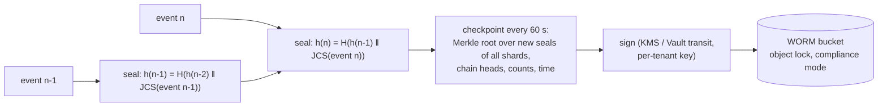
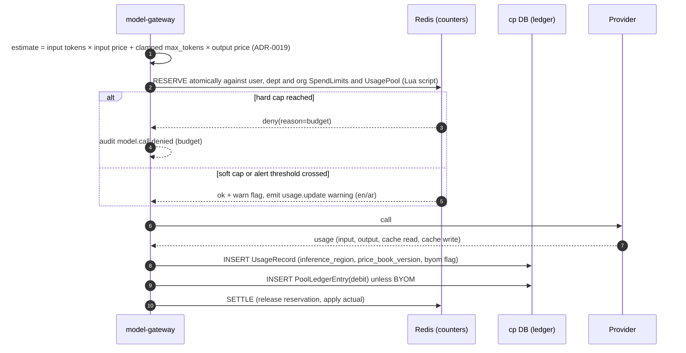
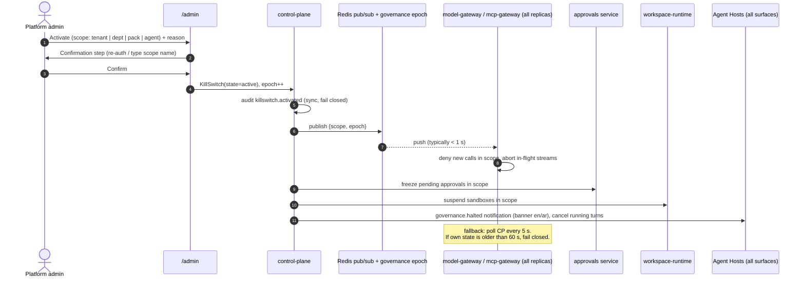

# Observability, Audit, Cost and Regulator Evidence

> Phase 3 architecture · Owner: architect (stream C) · Status: **Proposed, for G3 review** · Last updated: 2026-09-25
> Sources: spec §6.12, §6.14, §6.15.7, §8 (Audit), §12 (Observability); PRD REQ-024, REQ-029, REQ-032, REQ-059, REQ-064, REQ-070 to REQ-075, REQ-079, REQ-099, DV-3, DV-4, DV-12; market summary R-5(c)(f)(g), R-9; roadmap F-004, F-011, F-012, F-014, F-044.
> Depends on stream A for control-plane language ([ADR-0001](adr/0001-services-language-typescript.md)), policy engine ([ADR-0002](adr/0002-policy-engine-cedar.md)) and tenancy ([ADR-0003](adr/0003-tenancy-and-isolation.md)). Related docs: `model-gateway.md`, `mcp-gateway.md`, `identity-and-policy.md`, `agent-protocol.md`, `security.md`, `data-model.md`.
> Phase 0 note: the audit **fail-closed** and **metadata-only** behaviour below was checked against the F-002, F-003 and F-004 briefs in the G3 consistency review ([consistency-review.md](consistency-review.md)). Where the briefs differ (one event per call, service-only ingestion), the proposed brief changes are listed there.
> **This document owns the canonical audit event envelope (§3) and the two-phase audit rule (§4).** Every other architecture document and ADR references them instead of defining its own.

## 1. What this covers

| Capability | REQ | Phase |
|---|---|---|
| Immutable, tamper-evident audit log for 100 % of model and tool calls; fails closed | REQ-024, REQ-071 | 0: metadata-only, insert-only writer role and sealer hash chain from the first event (SR-29, security P0-4; brief change BC-05). 1: signed WORM checkpoints, content modes, verification (F-011) |
| End-to-end tracing and session explainability | REQ-072 | 1 |
| Usage metering, pooled allowance, spend limits, dashboards, chargeback | REQ-032, REQ-073, REQ-079 | 1 |
| Alerts | REQ-074 | 2 |
| SIEM export | REQ-075 | 4 |
| AI system register and regulator evidence pack | REQ-070, REQ-099 | 1 |
| Kill-switch | REQ-064 | 1 |

## 2. Architecture

**Who writes audit:** only server-side components (the gateways, control plane and workspace runtime) are **authoritative** audit writers. They write through the service ingestion path (§3.3), authenticated by service identity (F-002 AC-11). The local Agent Host (CLI/Desktop) reports local tool calls (file edit, local terminal, local stdio MCP) and host session events through the separate **client-attested ingestion path** (§3.3). Those events are stored with `source=agent-host-local, attestation=client`, because the client machine is not trusted. Model calls and remote tool calls from every surface are always audited by the gateways, so the 100 % NFR for those does not depend on the client.

## 3. Audit event model (canonical)

### 3.1 Envelope

This is the **single audit event envelope** for every AuditEvent from every component. It replaces the envelope that `identity-and-policy.md` §9 previously assumed; `data-model.md` §4 (AuditEvent row), `model-gateway.md` §12, `mcp-gateway.md` §9, `agent-protocol.md` §8 and `workspace-runtime.md` reference it. Event-specific fields go in `details`.

| Group | Field | Notes |
|---|---|---|
| Identity of the record | `event_id` | UUIDv7, assigned by the writer; idempotency key |
| | `schema_version` | Envelope version; recorded in the canonical form so old hashes stay valid after upgrades (deployment.md §5) |
| | `ts` | Server clock at ingestion. Client-supplied times go in `details.client_ts` |
| Who | `org_id` | Tenancy key (stream B's `tenant_id` is the same value). Taken from the validated token, never from a client field |
| | `actor.type` | `user` \| `service` \| `system` (jobs, retention, sealer) |
| | `actor.user_id`, `actor.idp_subject` | For user actors. Taken from the token subject |
| | `actor.service` | For service and system actors (component name) |
| | `act` | Delegation: the acting component when a service acts for a user (for example `agent-host/ah-7f3…` from the RFC 8693 `act` claim). Replaces stream C's `on_behalf_of` |
| | `source` | Emitting component: `model-gateway`, `mcp-gateway`, `control-plane`, `workspace-runtime`, `agent-host-server`, `agent-host-local` |
| | `attestation` | `server` (written by a Ralysa-controlled component) or `client` (local host via the client-attested path). Replaces stream C's `attested=true/false` |
| | `surface` | `cli` \| `desktop` \| `web` \| `automation` \| `console` |
| What | `action` | Event type, `<domain>.<object>[.<phase>]`, for example `model.call.requested`, `tool.call.completed`, `auth.sign_in`, `policy.version.published`. Replaces stream B's `event_type` |
| | `resource.type`, `resource.id`, `operation` | For example `model_endpoint`/`vertex-europe-west1-sonnet`, `local_tool`/`file_write`, operation class |
| | `outcome` | `success` \| `denied` \| `error` \| `cancelled` \| `approved` \| `rejected` \| `expired` |
| | `reason_code` | Machine-readable reason for denials and errors (`unauthenticated`, `kill_switch`, `not_entitled`, `policy`, `mandatory_policy`, `budget`, `no_eligible_endpoint_for_tier`, `audit_unavailable`, …). Replaces `decision_reason` |
| Correlation | `session_id`, `turn_id`, `request_id` or `tool_call_id` | Pair a `*.requested` with its `*.completed` |
| | `trace_id`, `span_id` | W3C trace context; required on every model and tool event (REQ-072a) |
| | `client_seq` | Monotonic per session, only on `attestation=client` events; gaps are detected at session end (SR-29) |
| Decision | `policy_version`, `entitlement_version` | Bundle and entitlement versions used by the PDP (ADR-0011) |
| | `grant_id`, `approval_id`, `exception_id` | When a grant, approval or residency exception applied |
| Residency (DV-12, SR-04) | `tier`, `classification` | Effective tier (session high-water mark) and national classification |
| | `endpoint_id`, `endpoint_region` | The endpoint called and the region of that endpoint |
| | `inference_region` | **Processing geography**: where inference actually runs, from the endpoint registry (vendor evidence and date) or provider-reported. This is SR-04's `processing_geography`; the DV-12 field name is kept. Required on every model event |
| | `inference_region_source` | `registry_declared` \| `provider_reported`. `inference_region_observed` is added in `details` where a provider reports it (for example the Anthropic API `usage.inference_geo`); a mismatch raises `model.region.mismatch` |
| | `locality` | `local` \| `in_country` \| `in_region` \| `global` (ADR-0015) |
| Size | `tokens_in`, `tokens_out`, `cache_read_tokens`, `cache_write_tokens`, `rows`, `bytes`, `masked_entity_counts` | Counts per entity type only, never values (REQ-029c) |
| Integrity | `payload_hash` | SHA-256 of the RFC 8785-canonical request payload |
| | `content_ref`, `content_hash` | Only when the tier mode stores content (§3.4) |
| Event-specific | `details` | Object; field lists per event live in the owning doc (identity-and-policy §9, model-gateway §12, mcp-gateway §9, agent-protocol §8) |

**Chain fields are not part of the writer's envelope.** `shard`, `seq` and the hash chain (`prev_hash`, `hash`) are assigned by the sealer in the `audit_seal` table (§5). Stream B's envelope listed `prev_hash`; it now lives in AuditSeal only.

### 3.2 Two-phase audit for model and tool calls (ADR-0022)

| Case | Events | Rule |
|---|---|---|
| Call allowed and executed | `model.call.requested` then `model.call.completed` (or `tool.call.requested` then `tool.call.completed`), paired by `request_id` / `tool_call_id` | `*.requested` is committed synchronously **before** the provider or tool runs; no commit, no call. `*.completed` carries `outcome` `success` / `error` / `cancelled`, tokens and region |
| Call refused before execution | One `model.call.denied` or `tool.call.denied` | No intent is written, because nothing will run |
| Local tool on CLI/Desktop | `tool.call.requested` (intent ack from the control plane) then `tool.call.completed`, with `resource.type=local_tool`, `attestation=client` | The tool runs only after the ack (§4 rule 4) |

The names `model.call.started` / `tool.call.started` / `model.request.denied` used in earlier drafts, and the single `model.call` / `tool.call` events in the Phase 0 briefs, map to the rows above. **Reconciliation rule** (replaces "exactly one audit event per call" in the briefs, see brief changes BC-06 and BC-07): every call has exactly one terminal event (`*.completed` or `*.denied`), and every `*.completed` has exactly one matching `*.requested`.

### 3.3 Ingestion paths (resolves security TM-45(b), SR-29)

| Path | Caller authentication | Accepted events | Server-side rules |
|---|---|---|---|
| `POST /v1/audit/events` (service) | Service identity (mTLS or workload identity). A caller without it is refused (F-002 AC-11) | Any event type | `attestation=server`. Writers may set `actor` only as the validated user of the request they are serving |
| `POST /v1/audit/client-events` (client-attested) | The signed-in user's Ralysa access token (`aud=control-plane`) held by the local Agent Host (F-003 AC-2) | Allow-list only: `tool.call.requested` / `.completed` / `.denied` with `resource.type=local_tool`, host `session.*` events, `hook.failed`, `approval.presented` | The server **overwrites** `actor` and `org_id` from the token subject (forged actors are impossible), sets `source=agent-host-local` and `attestation=client`, assigns `ts`, requires a monotonic `client_seq` per session and flags gaps at session end, rate-limits per user. While a kill-switch covers the user's scope it refuses intents and returns the halt, so honest hosts stop local tools (TM-48). Every response to a `*.requested` intent is the **intent ack** and carries the current governance state (§9) |

Client-attested events never count toward the 100 % model and remote-tool audit NFR, which the gateways meet on their own. They are shown in the console and evidence pack with an "unattested (client)" marker.

### 3.4 Content handling

- **Phase 0:** metadata only for all tiers. No prompt or response text, only hashes and counts.
- **Phase 1+:** per-tier mode (full / redacted / metadata-only, REQ-071d; defaults in `data-model.md` §5). Content is written to encrypted object storage, and only `content_hash` enters the chain. Content can then expire or be erased without breaking tamper evidence.

Canonical serialisation uses the JSON Canonicalization Scheme (RFC 8785),[^rfc8785] so hashes are stable across languages.

## 4. Audit write path and fail-closed semantics (ADR-0022)

Rules:

1. **Write-ahead intent.** A model or tool call runs only after its `*.requested` event is durably committed. This is what "100 % audited" means in a testable way (REQ-071c).
2. **Completion is best-effort-durable.** After the provider has been called, the result is not withheld from the user because the completion write failed. Instead the completion goes to a local disk spool (on the gateway pod's volume) with retry, and the sealer flags any intent that has no completion after 5 min.
3. **Hot-path budget:** the intent insert is ≤ 10 ms p95 within the 100 ms gateway overhead (spec §12). It is one INSERT on a region-local primary; hashing is not on the hot path (§5).
4. **The local Agent Host** asks the control-plane client-attested ingest path (§3.3) for an intent ack before running a local tool. No ack means the tool does not run (REQ-059d; REQ-003e covers the control plane being unreachable). The ack response also carries the kill-switch state (§9).
5. **Denials** are a single synchronous `*.denied` event (§3.2). If even that write fails, the denial still stands; the event goes to the local spool.
6. **Phase 0:** metadata only (no prompt, response, file content, command output or argument values), insert-only writer role, sealer hash chain from the first event. The fail-closed intent rule applies from Phase 0 (F-003 AC-13, F-004 AC-6).
7. **Consequence:** audit-store availability is part of gateway availability. The audit DB is deployed with the same HA as the control plane (99.9 %, `deployment.md` §6). The durable write-ahead queue that security TM-46 / SR-29 suggest for audit availability is not adopted now; it is ADR-0022's revisit path.

## 5. Tamper evidence (ADR-0021)

- **Insert-only store.** The audit writer role has INSERT only. There are no UPDATE or DELETE grants, and a trigger rejects UPDATE and DELETE and records the attempt as its own audit event (REQ-071a).
- **Sealer.** Per `(org_id, shard)`, the sealer assigns `seq` in commit order and computes a SHA-256 hash chain in an `audit_seal` table, within ≤ 5 s of commit. Shards (one per gateway replica group) avoid one global serial bottleneck. At the Phase 4 scale estimate of about 1,000 events/s per deployment, each shard chain stays small.
- **Checkpoints.** Every 60 s the sealer builds a Merkle tree over new seals (following the Certificate Transparency construction, RFC 9162[^rfc9162]). It signs the root, the per-shard chain heads and the counts with a per-tenant key held in KMS or Vault transit, and writes the checkpoint to a WORM bucket:
  - S3 Object Lock in compliance mode[^s3-lock]
  - Azure immutable blob storage with a time-based retention policy[^az-immut]
  - GCS Bucket Lock or Object Retention Lock[^gcs-lock]
  - MinIO object locking on-prem and air-gapped[^minio-lock]
- **Verification.** `ralysa audit verify` (in the admin CLI and the console) recomputes chains, checks the Merkle roots against the signed WORM checkpoints, and reports the first divergent `seq` (REQ-071b). A nightly job verifies the last 24 h and alerts on failure.
- **Residual window.** A database superuser could alter a row in the ≤ 5 s between commit and seal, or alter both a row and its seal before the next checkpoint (≤ 60 s). After a checkpoint is written, any change is detectable. For regulated tenants the checkpoint interval can be lowered to 10 s. The export to the customer SIEM (§6) gives a second, independent copy.
- **Retention purge.** Partitions older than the retention period are dropped by a retention job under dual control. Before dropping, the job writes a `retention.purged` event that records the last checkpoint covering the range, so verification restarts from a signed anchor.

## 6. SIEM export (REQ-075)

- `audit-exporter` reads sealed events **from the audit DB by cursor**, one cursor per destination. The durable buffer during a SIEM outage is therefore the audit store itself, which comfortably exceeds the 24 h requirement (REQ-075c). No separate queue is needed.
- Delivery is at-least-once. `event_id` and `(shard, seq)` let the SIEM deduplicate.

| Destination | Protocol | Format | Reference |
|---|---|---|---|
| Splunk | HTTPS, HTTP Event Collector (token auth) | JSON event | [^splunk-hec] |
| Microsoft Sentinel | Azure Monitor Logs Ingestion API through a data collection rule, Entra app or managed identity. The legacy HTTP Data Collector API is unsupported after 2026-09-14 and must not be used. | JSON to a custom table | [^sentinel] |
| IBM QRadar | Syslog over TLS | LEEF 2.0 | [^leef] |
| Generic | Syslog over TLS (RFC 5424 / RFC 5425) | JSON or CEF body | [^rfc5424] |

- **Latency target:** ≤ 60 s from commit to delivery (REQ-075a). The exporter polls every 5 s after sealing.
- **Reconciliation:** a daily job compares the delivered count with the sealed count per destination (REQ-075b) and audits the result.
- **Residency:** the destination must be approved by policy. The exporter refuses destinations outside the tenant's allowed regions, and T3 content is never exported, only metadata.

## 7. Usage metering, pooled allowance and spend limits ([ADR-0019](adr/0019-budget-enforcement-reservation-ledger.md))

The decision is recorded once, in ADR-0019 (ADR-0023 was a duplicate and is withdrawn). The estimate formula and the Redis-loss rule in ADR-0019 are authoritative where this summary differs.

- **Source of truth** is the ledger in Postgres. Redis holds only reservations and running counters. If Redis is lost, counters are rebuilt from the ledger for the current period. Until the rebuild finishes, the gateway uses a conservative per-request cap, so the pool is never over-spent silently.
- **Pricing** comes from a versioned PriceBook (provider list price, with a tenant override for negotiated rates). The credit unit is $0.01 (REQ-079).
- **BYOM** calls are metered, priced for reporting, and do not debit the pool (REQ-079e).
- **Period reset** writes a `period_reset` ledger entry. There is no rollover (REQ-079d).
- **Sandbox hours:** `workspace-runtime` writes `UsageRecord(kind=sandbox_seconds)` every 5 min per running sandbox.
- **Dashboards** (REQ-073) read 5-min rollups (materialised views or a rollup table), which keeps lag ≤ 15 min (REQ-032d). Chargeback export is monthly CSV per department.
- **Reconciliation** (REQ-032b): a monthly job compares totals with provider invoices or usage APIs per provider account and flags a variance over 1 %.
- **Accuracy caveat:** in streaming responses some providers report usage only at stream end. If a stream is cut, usage is estimated from tokens counted at the gateway and flagged `estimated=true`.

## 8. Tracing and metrics (ADR-0024)

- **One instrumentation API: OpenTelemetry**, in every component (surfaces, Agent Host, gateways, control plane, runtime). W3C `traceparent` is propagated over HTTP, MCP (Streamable HTTP headers) and the Agent Protocol. On the Agent Protocol it travels in `_meta.trace` on every JSON-RPC message, defined in `agent-protocol.md` §3.1.
- **GenAI semantic conventions** (`gen_ai.*`: provider, request model, input and output tokens, finish reasons) on model spans. Content attributes (`gen_ai.input.messages` and similar) are **off by default** and never enabled for T2/T3.[^otel-genai]
- **Collector per cluster** with tail sampling. Spans with `gen_ai.*` or `ralysa.tool.*` attributes, errors, denials and approvals are **always kept (100 %)**. Other spans are sampled (default 10 %).
- **Client spans** (CLI/Desktop) go to the control plane's authenticated OTLP endpoint. They are marked untrusted and are optional per policy.
- **Backends:** Prometheus and Grafana for metrics and dashboards, and a trace store (Grafana Tempo or Jaeger) bundled for on-prem and air-gapped. **Langfuse (self-hosted)** is optional for LLM-specific views and evals. It ingests OTLP and requires ClickHouse,[^langfuse] which adds an operational dependency, so it is off in the air-gapped default bundle.
- **Traces are not the audit record.** Audit is the system of record. Every audit event carries `trace_id` so an admin can pivot from audit to trace. Trace retention is short (14 days by default).
- **Explainability view** (REQ-072): built from **audit events** (ordered by `trace_id` and `seq`), not from traces, so it is complete and tamper-evident. It shows the plan, tool calls, sources, model and inference region, masking counts and approvals. It can be exported into the evidence pack.

Operational SLO metrics owned here: gateway overhead histogram, audit intent latency, sealer lag, checkpoint age, exporter lag per destination, reservation denials, kill-switch propagation time.

## 9. Kill-switch (DV-3, REQ-064; ADR-0025)

- **Enforcement point:** the **gateways** enforce the kill-switch. A host that ignores the notification still cannot reach a model or a remote tool. Local tools on Desktop/CLI stop because the intent-ack call (§4 rule 4) returns the halt.
- **Target ≤ 30 s** (REQ-064a). Push takes seconds in practice. The 5 s poll bounds the worst case at about 5 s plus request drain.
- **Stale state:** if a gateway cannot confirm its kill-switch state for 60 s, it fails closed and denies. This deliberately couples gateway availability to the control plane (see ADR-0025 consequences). This is rule G-1 of the single canonical fail-closed table in [identity-and-policy.md §5.6](identity-and-policy.md#56-governance-state-freshness-and-fail-closed-rules-canonical), which also covers policy-bundle staleness (ADR-0011).
- **Notification:** hosts relay the halt to surfaces as the Agent Protocol notification `governance.halted` (agent-protocol.md §3.4).
- **Scopes** map to the policy subject hierarchy: tenant ⊃ department ⊃ pack ⊃ agent (AISystem). Activation requires the platform-admin role plus a confirmation step (REQ-064c). A second approver is recommended for deactivation of a tenant-wide halt (OQ-OA-5).
- **Drills:** a `drill=true` activation on a test scope measures propagation (activation to last gateway deny) and records the result for the evidence pack (REQ-064d).

## 10. AI system register and regulator evidence pack (DV-3, REQ-070)

- **Register (AISystem).** Most fields are derived automatically and updated on change: each Department Pack, published agent and scheduled agent becomes an entry, with models (and their inference regions), connectors, data tiers and classifications, and approval rules taken from policy. Admins curate the fields that cannot be derived: purpose, owner, human-oversight description, risk rating and regulator flags such as QCB high-risk.
- **Evidence pack.** Generated by the export engine (ADR-0026) for a date range. Contents are listed in `data-model.md` §6. The **data-location schedule** is built from **observed** `inference_region` in UsageRecords per tier, next to the configured routing. This is evidence, not a statement of intent, and it covers the QCB outsourcing-annex need (REQ-099c, market R-9).
- **Chain proofs:** audit samples in the pack include inclusion proofs against signed checkpoints, so an auditor can verify them offline.
- **Control mappings** (Qatar NIA, NCA ECC/CCC, UAE IA, ISO 27001/42001) are maintained as data that links control IDs to evidence queries (REQ-099a). The mapping content is owned by the CISO advisor; the product provides the mechanism.

## 11. NFR targets owned

| NFR | Target | Where measured |
|---|---|---|
| Audit coverage (spec §12, REQ-071) | 100 % of model and remote tool calls have a committed intent before execution | Gateway conformance test: fault-inject the audit DB and assert no provider call |
| Trace coverage (REQ-072a) | 100 % of model and tool calls carry `trace_id`; 100 % of those spans retained | Tail-sampling policy test; audit ↔ trace join |
| Audit hot-path latency | Intent insert ≤ 10 ms p95 (within the 100 ms gateway overhead) | Gateway histogram |
| Tamper detection (REQ-071b) | Any altered or deleted sealed record detected by `verify` | Chaos test on every release |
| Seal lag / checkpoint age | ≤ 5 s / ≤ 60 s | Metrics + alert |
| SIEM delivery (REQ-075) | ≤ 60 s; ≥ 24 h outage buffer; delivered = sealed count over 24 h | Exporter metrics, daily reconciliation |
| Usage freshness (REQ-032d, REQ-073a) | ≤ 15 min | Rollup lag |
| Usage accuracy (REQ-032b) | Within 1 % of provider-reported | Monthly reconciliation |
| Budget alerts (REQ-074a) | ≤ 5 min | Alert pipeline |
| Kill-switch (REQ-064a) | ≤ 30 s all surfaces | Drill measurement |
| Evidence pack (REQ-070a) | ≤ 10 min for 90 days at pilot scale | Export job timing |

## 12. Non-negotiables check

| Check | Result |
|---|---|
| Identity at every gateway | Audit `actor` comes from the validated token at the gateway, never from a client field. |
| 100 % traced and audited | Write-ahead intent with fail-closed behaviour; tail sampling keeps all model and tool spans. |
| Side effects approval-gated; untrusted content | Approval decisions are audited with a payload hash (REQ-062f). Injection flags are audited (REQ-063c). Audit content capture follows tier masking. |
| Residency, local models, air-gapped | All audit, telemetry and metering stores are in-region. WORM works on MinIO. No SaaS telemetry dependency; Langfuse is optional. SIEM destinations are checked against region policy. |
| Surface parity | The same audit events and `usage.update` whatever the surface. Local tool events are marked unattested. |

## 13. ADR candidates

| ADR | Title | Status |
|---|---|---|
| [ADR-0021](adr/0021-tamper-evident-audit-store.md) | Tamper-evident audit: insert-only Postgres + sharded hash chain + signed Merkle checkpoints on WORM storage | Proposed |
| [ADR-0022](adr/0022-audit-write-path-fail-closed.md) | Write-ahead audit intent, fail-closed before any model or tool call | Proposed |
| [ADR-0019](adr/0019-budget-enforcement-reservation-ledger.md) | Usage budgets and metering by pre-call reservation with an append-only ledger (absorbs the withdrawn ADR-0023) | Proposed |
| [ADR-0023](adr/0023-usage-metering-reserve-settle.md) | Duplicate of ADR-0019 | Withdrawn: merged into ADR-0019 |
| [ADR-0024](adr/0024-telemetry-opentelemetry-stack.md) | OpenTelemetry-only instrumentation; bundled OSS backends; Langfuse optional; audit ≠ trace | Proposed |
| [ADR-0025](adr/0025-kill-switch-enforcement.md) | Kill-switch enforced at gateways via push + poll, fail closed on stale state | Proposed |
| [ADR-0026](adr/0026-export-engine-and-exit-bundle-format.md) | One export engine for exit bundle and evidence pack | Proposed |

## 14. Open questions

| # | Question | Affects | Recommendation |
|---|---|---|---|
| OQ-OA-1 | Is a 60 s checkpoint interval (tamper window for a DB superuser) acceptable to bank regulators, or is per-event signing required? | ADR-0021 | 60 s default, 10 s for regulated tenants. Per-event signing costs too much hot-path latency. |
| OQ-OA-2 | Should completion-write failure after a provider call also block the *next* call for that session until the spool drains? | ADR-0022 | Yes for T3 sessions; no for T1/T2. |
| OQ-OA-3 | Default tail-sampling rate for non-AI spans (10 % proposed) and trace retention (14 days). | Cost | Confirm with ops at pilot. |
| OQ-OA-4 | Langfuse in the Phase 1 dedicated bundle, or Grafana-only until evals need it (REQ-058, Phase 3)? | Ops footprint | Grafana-only in Phase 1; add Langfuse with F-032. |
| OQ-OA-5 | Does deactivating a tenant-wide kill-switch need a second approver? | REQ-064 | Yes (two-person rule), to protect against a compromised admin account. |
| OQ-OA-6 | Should local (CLI/Desktop) tool audit also be device-attested (for example signed by an OS-protected key)? | Trust of client audit | Defer to Phase 4 hardening. Mark as unattested until then. |
| OQ-OA-7 | Which SIEM does the pilot telco use? It decides which exporter to build first if REQ-075 is pulled forward. | F-044 | Ask at pilot discovery. |
| OQ-OA-8 | ~~The Phase 0 briefs (F-003, F-004) could not be read in this stream.~~ **Closed in the G3 consistency review:** the briefs specify fail-closed and metadata-only audit as in §3–§4. The differences (one event per call, service-only ingestion) are brief changes BC-03, BC-06 and BC-07 in `consistency-review.md`. | F-003, F-004 | Closed |

## References

All accessed 2026-09-25.

[^rfc8785]: RFC 8785, *JSON Canonicalization Scheme (JCS)*: https://www.rfc-editor.org/rfc/rfc8785
[^rfc9162]: RFC 9162, *Certificate Transparency Version 2.0* (Merkle tree, inclusion and consistency proofs): https://www.rfc-editor.org/rfc/rfc9162
[^s3-lock]: AWS, *Locking objects with Object Lock* (compliance mode): https://docs.aws.amazon.com/AmazonS3/latest/userguide/object-lock.html
[^az-immut]: Microsoft Learn, *Overview of immutable storage for blob data*: https://learn.microsoft.com/en-us/azure/storage/blobs/immutable-storage-overview
[^gcs-lock]: Google Cloud, *Bucket Lock*: https://docs.cloud.google.com/storage/docs/bucket-lock and *Object Retention Lock*: https://docs.cloud.google.com/storage/docs/object-lock
[^minio-lock]: MinIO, *Object Locking and Immutability*: https://docs.min.io/aistor/administration/object-locking-and-immutability/
[^splunk-hec]: Splunk, *Set up and use HTTP Event Collector*: https://docs.splunk.com/Documentation/SplunkCloud/latest/Data/UsetheHTTPEventCollector
[^sentinel]: Microsoft Learn, *Custom data ingestion and transformation in Microsoft Sentinel*: https://learn.microsoft.com/en-us/azure/sentinel/data-transformation and *Migrate from the HTTP Data Collector API to the Logs Ingestion API*: https://learn.microsoft.com/en-us/azure/azure-monitor/logs/custom-logs-migrate
[^leef]: IBM, *QRadar Log Event Extended Format (LEEF) Version 2*: https://www.ibm.com/docs/en/SS42VS_DSM/pdf/b_Leef_format_guide.pdf
[^rfc5424]: RFC 5424, *The Syslog Protocol*: https://www.rfc-editor.org/rfc/rfc5424 ; RFC 5425, *TLS Transport Mapping for Syslog*: https://www.rfc-editor.org/rfc/rfc5425
[^otel-genai]: OpenTelemetry, *Gen AI semantic conventions / attribute registry*: https://opentelemetry.io/docs/specs/semconv/registry/attributes/gen-ai/
[^langfuse]: Langfuse, *Self-host Langfuse* and *ClickHouse (self-hosted)*: https://langfuse.com/self-hosting and https://langfuse.com/self-hosting/deployment/infrastructure/clickhouse

Also: OpenTelemetry Collector, *Resiliency* (persistent sending queue): https://opentelemetry.io/docs/collector/resiliency/
