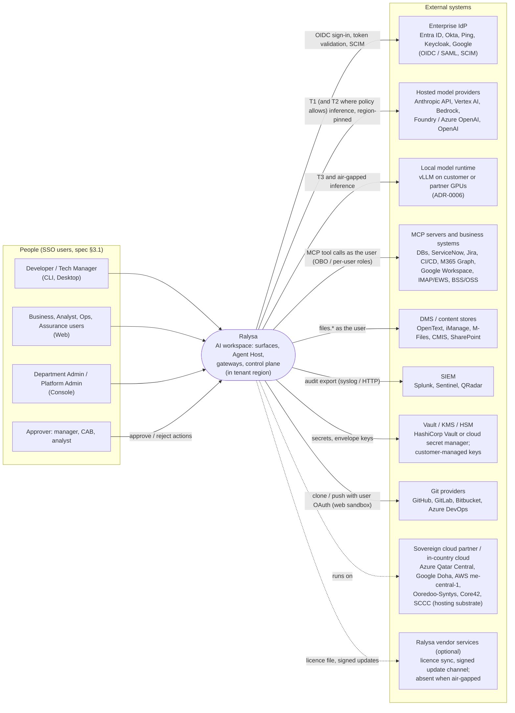
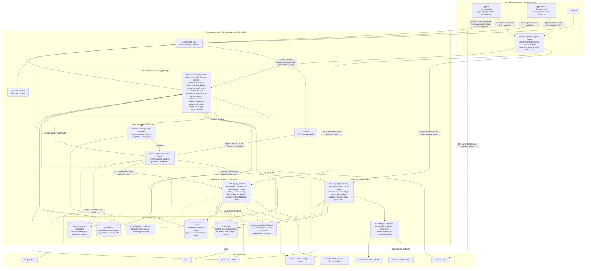
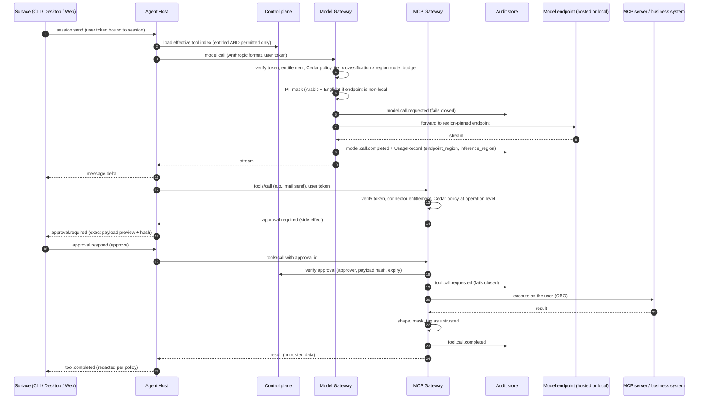

# Ralysa architecture overview (C4 levels 1 and 2)

> Phase 3 · Owner: architect (stream A) · Sources: `requirements/Ralysa_Spec.md` §4–§12, §14, §15; `docs/product/prd.md` (G2 approved 2026-09-25, deviations DV-1 to DV-19); `docs/product/roadmap.md`; `docs/market/summary.md` (G1 approved; R-4, R-5, MA-302) · Last updated: 2026-09-25
> Status: **Draft for G3 review.** Every ADR linked here is **Proposed** (ADR-0023 is Withdrawn, merged into ADR-0019). Only a human moves an ADR to Accepted (gate G3). Cross-stream contradictions were resolved in the G3 consistency review ([consistency-review.md](consistency-review.md)), which also holds the SR traceability, the brief changes proposed for G4 and the consolidated open questions.

## 1. What drives this architecture

Five constraints shape almost every decision below.

1. **Where inference runs is the binding constraint, not where Ralysa runs.** No hosted provider we checked offers in-country Claude inference in Qatar. Vertex lists no Middle East region for Claude, Bedrock serves Gulf customers through global cross-region inference, and the Anthropic API offers only `us` and `global` inference geos (MA-302; [ADR-0005](adr/0005-phase0-model-provider-and-region.md)). T3 data therefore runs on **local models** from Phase 1 (DV-2), and every model call records its inference region (DV-12).
2. **Customer-operated deployment ships first.** Dedicated in-country cloud and on-prem move to Phase 1 (DV-1). Air-gapped follows by Y1. Multi-tenant SaaS is in-region only and Phase 4 (DV-15). The platform must run with **no runtime dependency on Ralysa-hosted services** (REQ-101c). See [ADR-0003](adr/0003-tenancy-and-isolation.md).
3. **Identity is enforced server-side at every gateway** (spec D3, REQ-021). A client, including our own Desktop and CLI, is never trusted to make an authorization decision.
4. **The agent engine must stay replaceable** (spec §14, MA-109, REQ-015). The Claude Agent SDK stays inside `services/agent-host`. Surfaces see only the Agent Protocol in `packages/protocol` ([ADR-0004](adr/0004-agent-protocol-transport-and-schema.md)), and the host reaches the SDK only through a Ralysa engine port ([ADR-0012](adr/0012-agent-host-engine-port-boundary.md)).
5. **Small team, overloaded Phase 1** (OQ-3: 65 REQs in Phase 1). We prefer one language ([ADR-0001](adr/0001-services-language-typescript.md)), few stateful systems, and deferring what the pilot does not need ([ADR-0007](adr/0007-indexed-search-v1.md)).

## 2. C4 level 1: system context

Trust boundaries:

- **User devices** (CLI, Desktop, browser) are outside the enforcement boundary. They hold only short-lived user tokens and never provider keys (REQ-010, REQ-095).
- **Tenant region** (the deployment) holds all tenant content: prompts, memory, audit, files and indexes (REQ-096).
- **Hosted providers** receive only PII-masked content (REQ-029), only for tiers that policy allows (REQ-028). T3 is denied by default.
- **Content from MCP servers, DMS, email and the web is untrusted data** (REQ-063). It never becomes instructions and never approves an action.

## 3. C4 level 2: containers

### 3.1 Enforcement path of one agent turn

This shows where the non-negotiables are enforced for one model call and one side-effecting tool call. The local and server Agent Host follow the same path.

## 4. Container responsibilities

| Container | Repo path | Language (ADR-0001) | Responsibilities | Owns data | Runs where | First phase |
|---|---|---|---|---|---|---|
| CLI | `apps/cli` | TypeScript (Ink) | Terminal UI, `/login` (IdP-native device code by default, `--browser` loopback PKCE; ADR-0010), slash commands, non-interactive mode; starts the local Agent Host as a child process over stdio | None persistent; token in OS keychain | User device | 0 |
| Desktop | `apps/desktop` | TypeScript (Electron) | Web UI in Electron; starts the local Agent Host; system-browser PKCE sign-in; local files and terminal via the host | None persistent; token in OS keychain | User device | 1 |
| Web IDE | `apps/web` (`/ide`) | TypeScript (React/Vite) | Workspace UI; connects to the server-mode Agent Host over WebSocket | None | Browser; static assets from the tenant region | 1 |
| Console | `apps/web` (`/me`, `/dept`, `/admin`) | TypeScript (React/Vite) | Profile, subscriptions, admin, policy editor, audit viewer, evidence pack, kill-switch UI | None (calls control plane) | Browser | 1 |
| Shared packages | `packages/protocol`, `packages/auth`, `packages/ui`, `packages/workbench`, `packages/views`, `packages/sdk` | TypeScript | Protocol schema (published JSON Schema contract, authored in zod; ADR-0004), OIDC helpers for every surface, design system with RTL, IDE shell, workspaces, plugin/skill SDK | n/a | Bundled into surfaces and services | 0 |
| Agent Host | `services/agent-host` | TypeScript | Agent loop on Claude Agent SDK **behind an engine adapter** (the only place SDK types appear); Agent Protocol server; hooks (pre/post tool, pre-model, session); deferred tool loading; compaction; local-tool audit; approvals pause/resume | Session transcript cache (authoritative copy in control plane) | Local mode: user device. Server mode: one sandbox per user or workspace | 0 |
| Control plane | `services/control-plane` | TypeScript | Identity broker and token service; profiles; policy authoring, validation and signed snapshots (Cedar); subscriptions, entitlements and licence; skills library; memory; approvals and access requests; usage, budgets and allowance; kill-switch; audit query, export and evidence pack; AI system register | PostgreSQL (all §11 entities), object storage (exports) | Tenant region | 0 |
| Model Gateway | `services/model-gateway` | TypeScript policy layer + LiteLLM (Python, internal) | Authoritative model-call enforcement: token, entitlement (model tier), policy, residency routing, PII masking, budgets and rate limits, fallback within the same or stricter residency, metering, audit with inference region; vault credentials | UsageRecord and AuditEvent writes; no keys at rest outside the vault | Tenant region | 0 (v0) |
| MCP / Data Gateway | `services/mcp-gateway` | TypeScript | MCP registry; per-call entitlement then policy at operation level; identity pass-through; result shaping; PII masking and labels; untrusted-content tagging; approval verification before side effects; audit | Registry (in control-plane DB), AuditEvent writes | Tenant region | 1 |
| Workspace Runtime | `services/workspace-runtime` | TypeScript (K8s controller) | Per-user or per-workspace sandboxes (gVisor/Kata), resource limits, persistent volumes, snapshots, egress allow-list, suspend/resume, warm pools | Workspace volumes, snapshots | Tenant region | 1 (Chat host, no shell, DV-16); 2 (full sandbox) |
| Extraction | `services/extraction` | Python (ADR-0001 exception) | PDF/Office/email extraction, Arabic OCR, chunking, size limits; output tagged untrusted | Transient only | Tenant region | 2 |
| Local model runtime | `deploy/helm` chart (third-party vLLM) | n/a | OpenAI-compatible serving of open and Arabic models and embeddings; reachable only from the Model Gateway | Model weights | Customer or partner GPUs in region | 1 (DV-1, DV-2) |
| Platform data | `deploy/*` | n/a | PostgreSQL, Redis, S3-compatible object storage, append-only audit store, OTel, Prometheus, Grafana, Langfuse (self-hosted) | All tenant content, in region | Tenant region | 0 |

### 4.1 Non-negotiables: where each is enforced

| Non-negotiable | Authoritative enforcement point | Defence in depth | Topic doc |
|---|---|---|---|
| Identity from SSO, enforced at every gateway | Model Gateway, MCP Gateway and control-plane APIs verify the user token on **every** call. Agent Host sessions are bound to that token. | Tools the user may not use are never loaded (REQ-022); UI hides unentitled modules | [identity-and-policy.md](identity-and-policy.md) |
| 100 % of model and tool calls traced and audited | Gateways commit `*.requested` before forwarding; if the audit write fails, the call doesn't run (REQ-071c, ADR-0022). One canonical envelope (observability-audit.md §3) | Local host audits local tools through the client-attested path (actor forced to the token subject, `attestation=client`); `_meta.trace` on every protocol message spans surface to provider | [observability-audit.md](observability-audit.md) |
| Side effects go through approval | MCP Gateway checks for a recorded approval (approver, payload hash, expiry) before any operation classed as side-effecting | Agent Host pre-tool hook pauses and emits `approval.required` | [mcp-gateway.md](mcp-gateway.md), [security.md](security.md) |
| Email and document content is untrusted | MCP Gateway and extraction tag results untrusted; the Agent Host keeps them out of instruction positions | Injection scanning in post-tool hooks; approvals are needed whatever the origin | [security.md](security.md) |
| No T3 data leaves the region; works local and air-gapped | Model Gateway routing (T3 is denied for non-local endpoints by default; fallback never loosens residency; `endpoint_region` and `inference_region` recorded separately, SR-04); all stores in region | Guardrail `forbid` policies that tenant admins cannot edit (ADR-0002, `mandatory_deny` in ADR-0011) | [model-gateway.md](model-gateway.md), [deployment.md](deployment.md) |
| Governance state is fresh or the platform stops | Every PEP applies the canonical fail-closed table ([identity-and-policy.md §5.6](identity-and-policy.md#56-governance-state-freshness-and-fail-closed-rules-canonical)): heartbeat unconfirmed > 60 s → refuse everything | Hosts relay `governance.halted` | [identity-and-policy.md](identity-and-policy.md) |
| Multi-surface parity | All surfaces use `packages/protocol` and `packages/auth`; one conformance suite (REQ-012) | Mock host for engine independence (REQ-015) | [agent-protocol.md](agent-protocol.md) |

**Known residual risk (for the security reviewer):** on Desktop and CLI, *purely local* actions such as editing a file on the user's own disk or running a local terminal command happen on a device we don't control. Model calls and remote tool calls are always enforced at the gateways. Local tool calls are enforced by the local host's hooks against a signed policy snapshot and audited through the control plane before they run. A tampered client could skip that for local-only actions. Mitigations to assess: signed and notarized builds, managed-device policy, and `terminal: deny` for T3 profiles. See [security.md](security.md).

**Known engine risk ER-1 (unsupported configuration; canonical statement).** Anthropic documents that it does not support routing its harness to non-Claude models through any gateway ([Claude Code docs, "Other LLM gateways"](https://code.claude.com/docs/en/llm-gateway), accessed 2026-09-25). T3 and air-gapped sessions on local models will therefore run the Agent SDK loop against a non-Claude model in a vendor-unsupported configuration. **Mitigation plan (the only one; repeated in ADR-0006, ADR-0012, ADR-0014, ADR-0015 and model-gateway.md §9):**

1. **Eval gate** (REQ-030): a non-Claude model is enabled for a department only after the department's tool-use golden set passes through the real engine + translation path.
2. **Translation conformance tests** in CI: tool calling, streaming, stop reasons, cache-control fields, thinking blocks, long context.
3. **Second-engine option, decided before the RA pack:** a Phase 2 spike of a second EnginePort adapter that speaks OpenAI-compatible APIs natively, with a go/no-go **before the RA pack (REQ-086) enables any T3 department**, based on the eval results. ADR-0004 and ADR-0012 make this possible without a client release.

Owner: architect + product owner (open question MQ-1). The Phase 1 pilot is T1/T2 only (A-5), so ER-1 does not block Phase 0 or the pilot.

## 5. NFR budget

Spec §12 applies in full. Product NFRs come from the PRD (REQ-110 and the "Non-functional requirements" table). The owner is accountable for meeting the budget; contributors must stay within their share.

| # | NFR | Target | Source | Owner component | Contributors and budget split (proposed) | How verified |
|---|---|---|---|---|---|---|
| N1 | Availability | 99.9 % control plane and gateways (SaaS); HA option on-prem | §12, REQ-104 | `deploy/helm` HA topology | control-plane, model-gateway, mcp-gateway each ≥ 99.95 %. Gateways verify tokens and evaluate policy from local caches, but by design (ADR-0025, rule G-1) a control-plane or Redis outage longer than 60 s stops all model and tool calls, and the audit DB is on the call path (ADR-0022). Control plane, Redis and audit DB therefore need the same HA as the gateways. | Monthly uptime report; zone-loss drill (REQ-104a) |
| N2 | Gateway overhead | p95 < 100 ms, excluding upstream time | §12, REQ-027d, REQ-110 | model-gateway; mcp-gateway (each owns its own budget; mcp-gateway split in mcp-gateway.md §10) | Model Gateway (single split, also used by model-gateway.md §13, ADR-0002 and observability-audit.md §4): token verify with cached JWKS 2 ms · entitlement + Cedar evaluation 5 ms · budget/rate check in Redis 5 ms · routing + cached vault credential 5 ms · synchronous audit intent (`*.requested`) 10 ms · PII masking ≤ 60 ms on ≤ 8k incremental tokens · headroom 13 ms. The LiteLLM hop in the cluster is counted inside routing. *(proposed split)* | `gateway.overhead` span in load test at 1,000 users (Phase 1); F-004 AC-11 stub test in Phase 0 |
| N3 | Time to first token | Dominated by model latency | §12 | agent-host | No blocking work before the model call other than N2; streaming passes through gateways without buffering | Trace comparison, gateway versus provider TTFT |
| N4 | Scale | 1,000 concurrent users per deployment (Phase 1) → 5,000 (Phase 4) | §12, REQ-110 | `deploy` capacity model | Stateless gateways and control plane scale horizontally; workspace-runtime scales server-mode hosts; local-model GPU capacity is customer-provided (A-4) and is the usual bottleneck | Load test per phase target |
| N5 | Web runtime start | Cold start p95 < 15 s; resume p95 < 5 s | §12, REQ-014a | workspace-runtime | Warm sandbox pools, pre-pulled images, volume snapshot restore; Phase 1 Chat host has no shell (DV-16) | Synthetic start/resume probes |
| N6 | Security | §8; annual pentest; pentest before pilot with 0 open critical/high | §12, REQ-099b | security (cross-cutting) | Every container; threat model in [security.md](security.md) | Pentest report; SBOM and CVE gate (REQ-098) |
| N7 | Accessibility | WCAG 2.1 AA in English and Arabic | §12, REQ-109 | `packages/ui` + `packages/workbench` | apps/web, apps/desktop; a11y lint in CI (F-001) | Automated scan + NVDA/VoiceOver audit |
| N8 | Localization | English + Arabic RTL at launch; bidi; Arabic documents | §12, REQ-106 to REQ-108 | `packages/ui` (i18n keys, logical CSS) | agent-host (reply language), extraction (Arabic OCR), model-gateway (Arabic PII masking) | RTL visual regression; bidi golden set |
| N9 | Extensibility | New providers, connectors, skills, packs, plans by registration | §12 | control-plane registries | model-gateway provider config; mcp-gateway registry; catalog as data (REQ-076) | Add a provider/connector/plan in a test without a code release |
| N10 | Recoverability | RPO ≤ 15 min, RTO ≤ 4 h for control-plane data | §12, REQ-110b | control-plane data stores | PostgreSQL PITR with continuous WAL archiving (target RPO ≤ 5 min); object storage versioning; audit WORM archive; runbooks in `deploy` | DR drill before pilot go-live |
| N11 | Observability and audit | 100 % of model and tool calls traced and audited; audit fails closed; `endpoint_region` and `inference_region` in every record | §12, REQ-071, REQ-072, DV-12, SR-04 | model-gateway and mcp-gateway (authoritative writers; ADR-0022) | agent-host (local tools via the client-attested path, `_meta.trace` propagation); control-plane (audit store, sealer, query, export; ADR-0021); envelope owned by observability-audit.md §3 | Reconcile provider usage vs UsageRecord (±1 %); audit-write fault injection; one terminal event per call |
| N12 | Governance latency | Policy and entitlement changes applied ≤ 60 s; kill-switch ≤ 30 s; session revoke ≤ 60 s | PRD NFR table, REQ-021b, REQ-064a, REQ-078a, REQ-017d | control-plane (publish) | Every PEP: governance heartbeat by Redis pub/sub plus 5 s poll; signed bundle deltas pulled on change (ADR-0011, ADR-0025); fail-closed rules G-1/G-2 in identity-and-policy.md §5.6 | Propagation timing tests; kill-switch drill (REQ-064d) |
| N13 | Residency | 0 tenant content outside region; T3 never sent to a non-local endpoint by default | PRD NFR table, REQ-028, REQ-096 | model-gateway (routing) + `deploy` (all stores in region) | mcp-gateway egress; observability stack self-hosted in region (no vendor telemetry) | Egress capture; configuration audit; T3 test tenant |
| N14 | Interaction latency | Approval card ≤ 2 s after pause; cancel ≤ 2 s; usage indicator ≤ 5 s | REQ-062a, REQ-011c, REQ-007d | agent-host + `packages/protocol` | Surfaces render within 200 ms of event receipt | Protocol conformance timings |
| N15 | Data freshness | Usage visible ≤ 15 min; memory across surfaces ≤ 10 s | REQ-032d, REQ-073a, REQ-049a | control-plane | model-gateway emits UsageRecord at call end (ADR-0019); 5-min rollups (observability-audit.md §7) | Timed tests |
| N16 | SIEM delivery | ≤ 60 s; ≥ 24 h buffering during an outage | REQ-075 | control-plane audit exporter | Audit store | 24 h soak count match |
| N17 | Deployability | Reference dedicated deployment in ≤ 1 working day by customer ops | REQ-101a | `deploy/terraform` + `deploy/helm` | All services ship images and charts; no vendor runtime dependency | Timed reference install |

## 6. Deployment variants (summary)

Details are in [deployment.md](deployment.md). The tenancy decision is in [ADR-0003](adr/0003-tenancy-and-isolation.md). The same images and Helm charts serve every variant; only configuration and the allowed-endpoint list change.

| Variant | Phase | Operated by | Infrastructure | Model endpoints | Local model runtime | Licence and updates | Egress | Highest classification |
|---|---|---|---|---|---|---|---|---|
| **Dedicated in-country cloud** (DV-1, R-4) | 1 | Customer, or a sovereign hosting partner for the customer | Customer subscription in Azure Qatar Central / UAE North, Google Doha / Dammam, AWS me-central-1, or one sovereign partner cloud (Terraform + Helm) | Hosted endpoints only as tier policy allows (T1, and T2 where counsel allows, OQ-2); local for T3 | vLLM bundled; GPUs from customer or partner (A-4) | Signed licence file; optional licence sync; signed update bundles | Allow-list: IdP, approved model endpoints, registered MCP servers, optional vendor channel | Up to C3 per the customer's mapping (REQ-094) |
| **On-prem** (DV-1) | 1 | Customer | Kubernetes in the customer data centre | Local by default; hosted endpoints only if the customer allows egress | vLLM bundled (required) | Signed licence file; optional update channel (REQ-102a) | None required | Up to C3 |
| **Air-gapped** (DV-1, REQ-103) | 4 (target Y1) | Customer | On-prem, no internet | Local only | vLLM bundled with offline model weights | Offline licence; signed offline update bundles | Zero | C4 allowed only here (REQ-094d) |
| **In-region multi-tenant SaaS** (DV-15, REQ-105) | 4 (Could) | Ralysa | Ralysa-operated in-region cloud | Per tenant policy | Optional shared pool | Online | Vendor-managed | Non-regulated buyers only; never foreign-hosted for regulated Gulf segments |

Phases 0–3 run **one organization per deployment** (ADR-0003). The schema carries `org_id` and row-level security from day one, so Phase 4 SaaS is additive rather than a rewrite.

## 7. Document index

### Topic documents

All streams' documents, linked here as the single entry point. The reading order is in [README.md](README.md).

| Topic | Scope | Owns (single source of truth for) |
|---|---|---|
| [identity-and-policy.md](identity-and-policy.md) | OIDC/SAML, CLI sign-in flows, PKCE, token lifetimes, SCIM, profiles, decision model, entitlements, propagation, access requests | Token model; **canonical fail-closed table (§5.6)** |
| [agent-protocol.md](agent-protocol.md) | Agent Protocol methods and events, `_meta` (protocol version, trace), versioning, auth handshake, resume, conformance suite, engine adapter boundary | Protocol message catalogue and error codes |
| [model-gateway.md](model-gateway.md) | Routing by tier × classification × region, masking, budgets, fallback, metering, LiteLLM integration | Model-call pipeline; region fields (with SR-04) |
| [mcp-gateway.md](mcp-gateway.md) | MCP registry, operation-level policy, identity pass-through, result shaping, approval verification, untrusted-content tagging | Tool-call pipeline; approval grants |
| [workspace-runtime.md](workspace-runtime.md) | Sandboxes, isolation (gVisor/Kata), lifecycle, egress, storage, warm pools | Web host isolation |
| [data-model.md](data-model.md) | §11 entities plus PRD additions (tier, classification, inference region, org_id), RLS, retention | Entity catalogue, retention by tier |
| [observability-audit.md](observability-audit.md) | Tracing, immutable audit, tamper evidence, metering summary, kill-switch, evidence pack, SIEM export | **Canonical audit envelope and two-phase audit rule (§3)** |
| [deployment.md](deployment.md) | SaaS, dedicated in-country, on-prem, air-gapped; HA, DR, upgrades, licensing | Deployment variants, target-cloud matrix |
| [security.md](security.md) | Threat model (TM-nn), security requirements (SR-nn), control mapping, residual risks | Threats and SRs |
| [consistency-review.md](consistency-review.md) | G3 consistency pass: issues and resolutions, SR traceability, brief changes proposed at G4, consolidated open questions | Open-questions list |

### ADR index

All are **Proposed** except ADR-0023 (Withdrawn); G3 approval is a human decision. Details and streams are in [adr/README.md](adr/README.md).

| ADR | Decision (one line) |
|---|---|
| [0001](adr/0001-services-language-typescript.md) | TypeScript for all Ralysa-owned services; Python only for LiteLLM (unmodified) and document/ML libraries behind HTTP contracts |
| [0002](adr/0002-policy-engine-cedar.md) | Cedar embedded in-process, implementing ADR-0011's `deny` / `mandatory_deny` / grant model via `forbid … unless`; typed obligations resolver |
| [0003](adr/0003-tenancy-and-isolation.md) | One organization per deployment through Phase 3; multi-tenant-ready schema (org_id + RLS); SaaS model decided in Phase 4 |
| [0004](adr/0004-agent-protocol-transport-and-schema.md) | JSON-RPC 2.0 over WebSocket (remote) and stdio/OS-ACL IPC (local); published JSON Schema contract authored in zod; `_meta` on every message; engine-neutral types |
| [0005](adr/0005-phase0-model-provider-and-region.md) | Phase 0: Claude on Vertex AI through a regional endpoint only (europe-west1 candidate); synthetic/T1 data only, enforced by `max_tier = T1` |
| [0006](adr/0006-local-model-runtime.md) | vLLM as the bundled local runtime behind the Model Gateway; Ollama for developer machines only |
| [0007](adr/0007-indexed-search-v1.md) | No indexed search in v1 (Phases 1–2); design for it; pgvector-first spike in Phase 3 |
| [0010](adr/0010-ralysa-token-service-brokers-idp.md) | Ralysa Token Service brokers the IdP and mints audience-bound tokens; CLI: IdP-native device flow → loopback PKCE → RTS-hosted device as hardened fallback |
| [0011](adr/0011-policy-decision-model-and-pdp-placement.md) | `allow` / `deny` / `mandatory_deny` / `require_approval`; embedded PDP per PEP with signed bundles |
| [0012](adr/0012-agent-host-engine-port-boundary.md) | Engine port + adapter; only `engine/claude/**` imports the SDK; governance outside the engine |
| [0013](adr/0013-approvals-enforced-at-gateway.md) | Approvals enforced at the gateway with payload-hash-bound, single-use grants |
| [0014](adr/0014-model-gateway-policy-front-and-provider-adapter.md) | Model Gateway = Ralysa policy front + LiteLLM provider adapter under TM-37 constraints; Anthropic-compatible northbound API |
| [0015](adr/0015-residency-routing-as-data.md) | Residency routing as data: endpoint labels, session tier high-water mark, never-widen fallback |
| [0016](adr/0016-mcp-gateway-credential-broker.md) | MCP Gateway is the sole credential broker; no token passthrough |
| [0017](adr/0017-mcp-aggregating-proxy-identity-scoped-catalog.md) | Aggregating MCP proxy with an identity-scoped virtual catalog |
| [0018](adr/0018-untrusted-content-provenance-and-taint.md) | Provenance envelope, spotlighting, session taint rule for untrusted content |
| [0019](adr/0019-budget-enforcement-reservation-ledger.md) | Budgets and metering by pre-call reservation + append-only ledger (absorbs ADR-0023) |
| [0020](adr/0020-web-sandbox-isolation-and-orchestration.md) | gVisor/Kata via RuntimeClass; kubernetes-sigs agent-sandbox with warm pools |
| [0021](adr/0021-tamper-evident-audit-store.md) | Insert-only Postgres + hash chain from Phase 0 + signed Merkle checkpoints on WORM |
| [0022](adr/0022-audit-write-path-fail-closed.md) | Write-ahead audit intent, fail closed; client-attested path for local tools |
| [0023](adr/0023-usage-metering-reserve-settle.md) | **Withdrawn:** merged into ADR-0019 |
| [0024](adr/0024-telemetry-opentelemetry-stack.md) | OpenTelemetry only; bundled OSS backends; Langfuse optional; audit ≠ trace |
| [0025](adr/0025-kill-switch-enforcement.md) | Kill-switch at every PEP by push + 5 s poll; fail closed after 60 s (rule G-1) |
| [0026](adr/0026-export-engine-and-exit-bundle-format.md) | One export engine for exit bundle, evidence pack and AI register |
| [0027](adr/0027-deployment-packaging.md) | One Helm umbrella chart (OCI) + per-cloud Terraform + signed air-gapped bundle |
| [0028](adr/0028-offline-licensing.md) | Signed licence file (JWS/EdDSA) with optional metadata-only sync |
| [0029](adr/0029-ha-dr-in-country.md) | Zone HA with synchronous standby; DR to a second in-country location |

## 8. Open questions

The consolidated, de-duplicated list across all documents, with owners and the Phase-0-blocking flag, is in [consistency-review.md §5](consistency-review.md). The rows below are this document's originals, kept for traceability.

| # | Question | Affects | Proposed handling | Owner |
|---|---|---|---|---|
| AQ-1 | ~~The Phase 0 feature briefs could not be read in this session.~~ **Closed:** F-001 to F-005 were cross-checked in the G3 consistency review. ADR-0004 and ADR-0005 agree with the briefs; brief changes are listed there. | ADR-0004, ADR-0005 | Closed | Architect |
| AQ-2 | Anthropic commercial terms for embedding the Agent SDK in a resold, customer-operated product (OQ-4), and Anthropic's stance on running the SDK against non-Claude local models | ADR-0004, ADR-0006, REQ-015 | Founder to obtain in writing before Phase 1 build | Founder |
| AQ-3 | Can masked T2 text go to a foreign-hosted model for bank tenants (OQ-2, Q-L1)? | Routing defaults, ADR-0005 | Default T2 to local or in-country until counsel answers | Founder + legal |
| AQ-4 | PII masking within the N2 budget for large prompts in Arabic: which detector (rules + NER), where it runs, and incremental masking per turn | N2, REQ-029 | Spike in F-008 design; the model-gateway topic doc proposes the approach | Architect + solution-designer |
| AQ-5 | Residual risk of local-only actions on tampered Desktop/CLI clients | Security, REQ-003 | Security reviewer to rate; consider managed-device requirement for T2/T3 | Security reviewer |
| AQ-6 | Customer GPU sizing for the pilot's local models (A-4) and which Arabic model (OQ-6) | N4, ADR-0006 | Sizing guide in deployment.md once OQ-6 is answered | Architect + product owner |

## Approval (G3)

> Filled by a human only. Agents must leave this blank.

| Approver | Role | Decision (Approved / Changes requested) | Date | Notes |
|---|---|---|---|---|
| | | | | |
