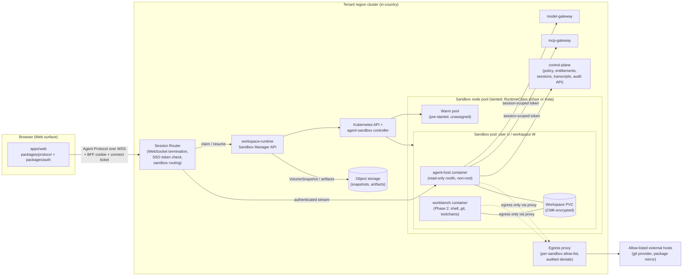
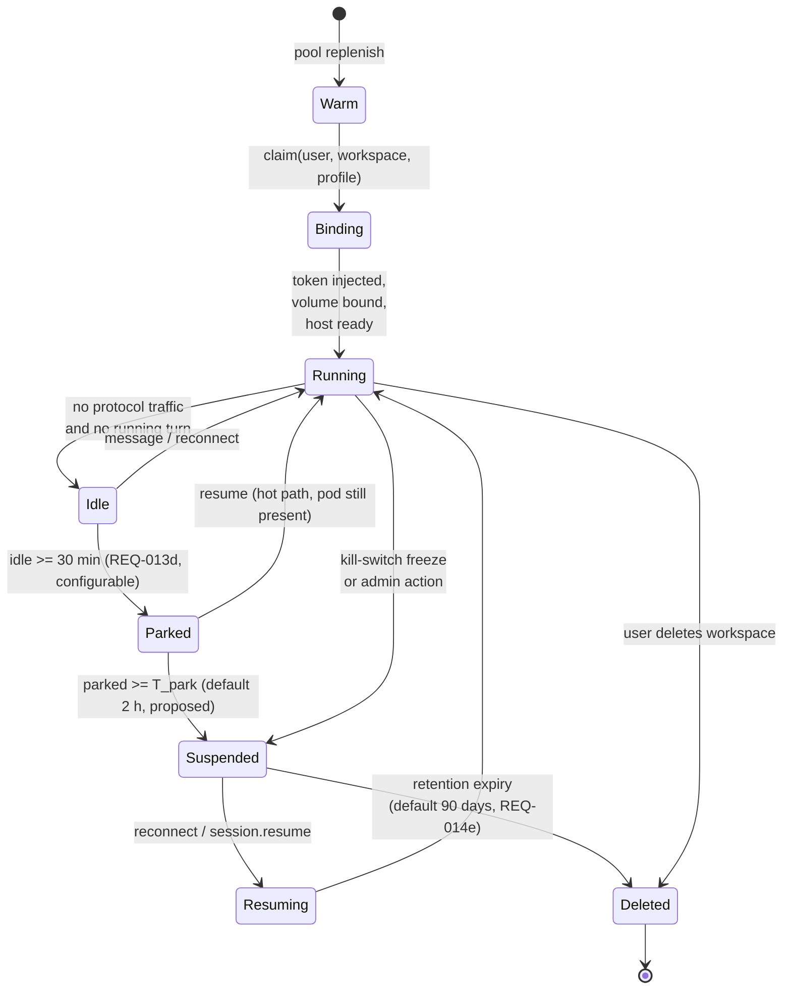

# Workspace Runtime (Web mode)

> Phase 3 architecture · Owner: architect (stream C) · Status: **Proposed, for G3 review** · Last updated: 2026-09-25
> Sources: spec §3.2, §4 D8, §6.2.1, §6.3, §8 (Isolation), §9, §10.3, §12 (Web runtime); PRD REQ-004, REQ-005, REQ-009, REQ-013, REQ-014, REQ-064, REQ-079, REQ-096, DV-1, DV-16; roadmap F-016 (Phase 1), F-024 (Phase 2).
> Depends on stream A decisions: control-plane language ([ADR-0001](adr/0001-services-language-typescript.md)), policy engine ([ADR-0002](adr/0002-policy-engine-cedar.md)), tenancy model ([ADR-0003](adr/0003-tenancy-and-isolation.md)), Agent Protocol transport ([ADR-0004](adr/0004-agent-protocol-transport-and-schema.md)) and local-model runtime ([ADR-0006](adr/0006-local-model-runtime.md)). This document does not decide any of them.

## 1. Purpose and scope

The Workspace Runtime hosts the **Agent Host for Web users** on the server, one isolated sandbox per user workspace. CLI and Desktop run the Agent Host locally and do not use this service (spec §6.2.1).

The runtime ships in two steps, on one substrate:

| Step | Phase | What runs in the sandbox | Tools | Source |
|---|---|---|---|---|
| **Chat host** | 1 (F-016) | Agent Host only | No shell, no code execution, no git (DV-16, REQ-013b) | REQ-004, REQ-013 |
| **Full workspace** | 2 (F-024) | Agent Host + a workbench container with shell, git, language toolchains | Terminal, file edit, git, code execution, all policy-gated | REQ-005, REQ-014 |

Building both steps on the same sandbox, lifecycle and network model means Phase 2 adds a container and a tool set. It does not add a second platform.

**Design stance:** everything inside a sandbox is treated as untrusted. That includes the Agent Host process once it has read email or document content (prompt injection, spec §8). Any control that must hold is enforced **outside** the sandbox: at the gateways, the session router, the egress proxy and the Kubernetes network layer. In-sandbox hooks add defence in depth. They are not the enforcement point.

## 2. Topology

Traffic rules, enforced by NetworkPolicy (default deny in the sandbox namespace):

- **Ingress** to a sandbox pod comes only from the Session Router.
- **Egress** from a sandbox pod goes only to the model gateway, the MCP gateway, the control-plane API, cluster DNS and the egress proxy.
- Sandbox-to-sandbox traffic is never allowed (spec §6.3, REQ-014d).

## 3. Components and responsibilities

| Component | Lives in | Responsibilities | Does **not** do |
|---|---|---|---|
| **Session Router** | `services/workspace-runtime` (router module) | Terminates the browser's Agent Protocol WebSocket. On connect it checks the BFF session cookie and `Origin`, then redeems the single-use connect ticket from `protocol.hello` for the user identity (ADR-0004 decision 3; the browser holds no access token under the BFF pattern, identity-and-policy.md §3.3). It re-checks revocation (rule G-1) for the life of the connection. Maps `(org_id, user_id, workspace_id)` to a sandbox. Proxies protocol frames. Emits `session.connected/disconnected` audit events. Enforces one active writer connection per session. | Interpret protocol payloads or make policy decisions beyond "is this user allowed to reach this workspace". |
| **Sandbox Manager API** | `services/workspace-runtime` | Claim, resume, suspend, snapshot, restore and delete. Selects a resource profile from policy (`workspace.runtime` dimension, spec §6.4.3). Mints the **session-scoped token** for the sandbox through the control plane. Emits lifecycle audit events and `sandbox_seconds` usage records. Applies retention. | Hold provider keys or user OAuth refresh tokens. |
| **agent-sandbox controller** (upstream, kubernetes-sigs) | Cluster add-on | Reconciles `Sandbox`, `SandboxTemplate`, `SandboxClaim` and `SandboxWarmPool` custom resources. Handles pause/resume, persistent storage and stable identity. See ADR-0020. | Tenant logic. |
| **Warm pool** | Sandbox node pool | Pre-started generic sandboxes (image pulled, runtime booted, Agent Host idle and unbound) so that a claim is an assignment, not a pod start. | Hold any user data before it is bound. |
| **agent-host container** | Sandbox pod | Runs `services/agent-host` in server mode. It is the same code as the local host, and Claude Agent SDK types stay inside it (spec §14). Calls the gateways with the session-scoped token. Reads and writes the transcript and memory through the control plane. | Store provider keys (REQ-010). Reach the internet directly. |
| **workbench container** (Phase 2) | Sandbox pod | Shell, git and toolchains. The Agent Host drives it through a local exec channel, and the browser terminal (xterm.js) attaches through the router. Runs as a separate non-root UID from the Agent Host and cannot write the Agent Host's filesystem. | Hold credentials at rest. |
| **Egress proxy** | Namespace-scoped deployment | Enforces the per-sandbox FQDN allow-list compiled from policy (git host, package mirror). Every denial writes an `egress.denied` audit event (REQ-014c). | TLS interception by default (see open question OQ-WR-4). |
| **Credential helper** | Inside the workbench (Phase 2) | A git credential helper that fetches a **short-lived** OAuth access token for the user's linked git provider from the control plane on each operation. The token is never written to disk. | Persist refresh tokens. The vault keeps those. |

## 4. Isolation model

| Layer | Control | Why |
|---|---|---|
| Kernel | RuntimeClass `ralysa-sandbox`, mapped per platform to **gVisor** (`runsc`) or **Kata** VM isolation (ADR-0020). Plain `runc` is not allowed for sandbox pods; an admission policy rejects them. | User code and prompt-injected tool calls must not reach the host kernel. |
| Node | Dedicated, tainted sandbox node pool. No control-plane or gateway pods on it. Node service account has no cloud IAM permissions. | Limits the blast radius of a runtime escape. |
| Pod | Non-root, `readOnlyRootFilesystem` for agent-host, dropped capabilities, seccomp `RuntimeDefault`, no service-account token automount, no hostPath. Kata docs warn that hostPath undermines isolation.[^aks-kata] | Hardening inside the sandbox. |
| Network | Default-deny NetworkPolicy. Egress only to the gateways, the control plane and the egress proxy. No pod-to-pod traffic. | Spec §6.3 network row; REQ-014c/d. |
| Identity | The sandbox gets a **session-scoped, audience-bound, short-lived token** that represents the user. It is exchanged from the SSO token by the control plane, and its lifetime is capped at the SSO access-token lifetime (REQ-017b, default 15 min, refreshed through the router). The gateways re-validate it on every call (spec §4 D3). | If code in the sandbox steals the token, it can only do what the user could do anyway, through gateways that enforce policy, approvals and audit. |
| Data | One PVC per workspace, in the tenant region, encrypted with the tenant's key where CMK is enabled (REQ-096). | Residency and at-rest encryption. |
| Tenancy | Sandboxes of different tenants never share a namespace. Whether they share nodes depends on the tenancy model (ADR-0003; the Phase 4 SaaS model gets its own ADR). In dedicated, on-prem and air-gapped deployments there is only one tenant. | Keeps the multi-tenant SaaS choice open. |

Placing the Agent Host and the workbench in one pod (one gVisor sandbox or one Kata VM) is a deliberate trade-off. Commands the agent runs need the workspace files and a low-latency exec channel. Separate UIDs, the read-only Agent Host filesystem and gateway-side enforcement give the separation that matters. If the security review (`security.md`) judges this too weak for T3 workspaces, the fallback is two sandboxes per workspace (host and workbench) that share the volume over a local file protocol. That fallback roughly doubles the per-user footprint.

## 5. Lifecycle

| State | Pod | Volume | Transcript | What the user sees |
|---|---|---|---|---|
| Warm | Running, unbound | Empty pre-provisioned volume (optional, see §6) | none | none |
| Running / Idle | Running, bound | Attached | Control plane (server-side, REQ-013d) | Live session |
| Parked | Paused through the agent-sandbox pause, or kept at requested resources | Attached | Control plane | "Resuming…" for under 1 s |
| Suspended | Deleted. A pod snapshot may be kept where the platform supports it.[^gke-agent-sandbox] | Detached, retained; snapshot per policy | Control plane | "Resuming…" |
| Deleted | none | Deleted; snapshots kept until their own retention ends | Kept per the tier retention in `data-model.md` | none |

Rules:

- The **transcript, pending approvals and memory are never stored only in the sandbox.** They live in the control plane. A lost sandbox therefore loses at most uncommitted workspace files. Desktop↔Web handoff (REQ-009) works because the state is server-side.
- Suspending never cancels a pending approval. Approvals keep their own 24 h expiry (REQ-062d).
- Every transition writes an audit event with `trace_id`: `sandbox.claimed`, `sandbox.suspended`, `sandbox.resumed`, `sandbox.snapshot.created`, `sandbox.restored` and `sandbox.deleted`.
- Kill-switch (REQ-064): the gateways stop calls within 30 s (see `observability-audit.md` §9). In addition, the runtime moves the affected sandboxes to *Suspended* so that no workbench process keeps running.

## 6. Latency budgets (NFR: cold start < 15 s, resume < 5 s, p95)

**Definitions** (need product confirmation, OQ-WR-1):

- **Cold start** is measured from `session.create` received at the router to the first `session.ready` frame, when the user can type and the agent can answer.
- **Resume** is measured from reconnect or `session.resume` to `session.ready` with the transcript restored. Workspace files may finish mounting in the background. Any file tool call waits until the mount is done, and the time until the mount is done must stay under 15 s.

### Cold start, new workspace (target p95 ≤ 5 s on a warm-pool hit, ≤ 15 s on a miss)

| Step | Budget p95 | How |
|---|---|---|
| TLS, WebSocket upgrade, token validation | 0.2 s | Validate JWT locally with cached JWKS; revocation list is cached |
| Policy, entitlement and profile resolution | 0.3 s | Control-plane call; entitlement cache TTL ≤ 60 s (REQ-078) |
| Claim from warm pool | 1.0 s | agent-sandbox `SandboxWarmPool`. Upstream and GKE docs describe assignment as "typically <1s".[^gke-agent-sandbox][^k8s-agent-sandbox] |
| Bind identity, load skills index and memory into the host | 1.5 s | Session-scoped token minted; stable prompt prefix fetched (cacheable) |
| Volume | 0 s | New workspaces take the empty volume that was pre-provisioned with the warm sandbox |
| First protocol handshake | 0.3 s | |
| **Total (warm hit)** | **≈ 3.3 s** | Headroom for the 15 s NFR |
| Warm-pool miss: schedule a new sandbox on an existing node with the image already on it | +5–8 s | Images are pre-pulled on sandbox nodes; the image is kept small |
| Warm-pool miss **and** no node capacity | minutes | **Must not happen.** Node headroom and warm-pool size are sized from the peak-hour claim rate (OQ-WR-2). An alert fires when the pool drops below 20 %. |

### Resume

| Path | Budget p95 | Notes |
|---|---|---|
| From Parked (pod present) | ≤ 1 s | Only a reconnect and token rebind |
| From Suspended, Chat workspace (Phase 1) | ≤ 3 s | Claim a warm sandbox and rebind. Chat workspaces have no user volume in Phase 1, so nothing needs to be attached. |
| From Suspended, Code workspace (Phase 2) | ≤ 5 s to interactive, ≤ 15 s to volume mounted | Attaching cloud block storage takes seconds and varies by provider. The design defers file tools until the mount completes. Platform pod snapshots are an option once they are GA in the target region.[^gke-agent-sandbox] Measure on each target cloud before G6 (OQ-WR-3). |

## 7. Mounts, secrets and files

| Item | Mechanism | Rule |
|---|---|---|
| Workspace files | PVC per workspace (RWO), CSI storage class with snapshot support. Snapshots are VolumeSnapshots.[^k8s-snap] | Stays in the tenant region; snapshot retention default 90 days (REQ-014e) |
| Session identity | Session-scoped token delivered at bind time into a tmpfs file; rotated by the router | Never a Kubernetes Secret on disk; never a provider key |
| Git credentials | Credential helper fetches a short-lived access token from the control plane, which gets it from the vault | Refresh tokens stay in the vault (REQ-095) |
| Provider and connector keys | **None in the sandbox.** The gateways hold them (spec §6.2.1). | Secret scan of the sandbox image and volume must find 0 |
| Uploads | Browser → router → Agent Host → workspace volume. Size limit per policy (REQ-004b, 25 MB default). Tagged **untrusted** (REQ-063). Optional malware scan hook. | Audited as `file.uploaded` with hash and size, not content |
| Downloads and exports | Through the router. T2/T3 exports are approval-gated (REQ-006d) | Audited |
| Package installs (Phase 2) | Only through the egress proxy to an allow-listed, in-region mirror (for example a customer Artifactory or Nexus). No direct internet. | Air-gapped installs point at the local mirror |

## 8. Egress policy

Two layers:

1. **Kubernetes NetworkPolicy** (L3/L4) pins sandbox egress to the gateway, control-plane and egress-proxy services.[^k8s-netpol]
2. **Egress proxy** (L7, FQDN) applies the per-sandbox allow-list that the control plane compiles from policy (`tools.web_fetch`, git provider, package mirror) and entitlements. Every connection attempt is logged, and every denial is audited.

Where the CNI supports FQDN policy (for example Cilium `toFQDNs`[^cilium-fqdn]), that can replace or back up layer 2 for simple allow-lists. The proxy stays the audit point because REQ-014c needs a per-user audit record for each denied attempt. Agent `web_fetch` goes through the MCP gateway and its policy, not through the egress proxy.

## 9. Resource profiles and metering

| Profile (proposed) | Requests / limits | Use |
|---|---|---|
| `chat-s` | 0.25 / 1 vCPU, 512 MiB / 1 GiB | Phase 1 Chat host |
| `code-m` | 1 / 2 vCPU, 2 / 4 GiB, 20 GiB volume | Default Code workspace |
| `code-l` | 2 / 4 vCPU, 4 / 8 GiB, 50 GiB volume | Power seats |

- Command timeouts per profile. Processes over a limit are throttled or OOM-killed, and the user is told (REQ-014b).
- On Kata, pod VM memory is fixed from the pod memory limit, and fractional CPU limits round up to whole vCPUs.[^aks-kata-considerations] Profiles for Kata therefore use whole-vCPU limits.
- The runtime emits `UsageRecord(kind=sandbox_seconds)` for plans with a sandbox-hours allowance (spec §6.15.3). These draw from the usage pool described in `observability-audit.md` §7.

Rough sizing at the Phase 1 target of 1,000 concurrent Web users (A-3): 1,000 × `chat-s` requests is about 250 vCPU and 500 GiB requested, plus a 10–20 % warm pool. At the Phase 4 target of 5,000 users on a Code-heavy mix, the node pool must autoscale by zone. These are **estimates** to be replaced by load-test data.

## 10. Deployment-model differences

| Model | Runtime notes |
|---|---|
| In-region multi-tenant SaaS | One namespace per tenant for sandboxes. Node-pool sharing follows the tenancy model (ADR-0003 and its Phase 4 successor). Warm pools may be shared across tenants, because warm sandboxes hold no data until bound. |
| Dedicated in-country | Managed Kubernetes sandbox node pool: GKE Sandbox (gVisor)[^gke-sandbox], AKS Pod Sandboxing (Kata)[^aks-kata], or on EKS self-installed gVisor, or Kata on instances with nested virtualization.[^aws-nested] |
| On-prem | Customer Kubernetes with gVisor installed through containerd `runsc`. gVisor's default *systrap* platform needs no nested virtualization.[^gvisor-platforms] Kata is an option where the hardware supports it. |
| Air-gapped | As on-prem. Images come from the local registry, and the egress proxy allows only local mirrors. |

## 11. NFR targets owned

| NFR | Target | Measured by |
|---|---|---|
| Web cold start (spec §12, REQ-014a) | p95 < 15 s (design target ≤ 5 s on warm hit) | Router timing `session.create → session.ready`, synthetic probe every 5 min per region |
| Web resume (spec §12, REQ-014a) | p95 < 5 s to interactive | Router timing `resume → session.ready` |
| Isolation (REQ-013a, REQ-014d) | 0 cross-sandbox reads or connections | Automated isolation suite on every release |
| Egress (REQ-014c) | 100 % of denied egress audited | Proxy denial count = audit count |
| Idle suspend (REQ-013d) | 30 min default | Config test |
| Snapshot retention (REQ-014e) | 90 days default | Retention job audit |
| Residency (REQ-096) | 0 sandbox volumes or snapshots outside the tenant region | Storage-class and bucket region check in the deploy preflight |

## 12. Non-negotiables check

| Check | How this design meets it |
|---|---|
| Identity from SSO, enforced at every gateway | The router validates the SSO-backed BFF session and single-use connect ticket. The sandbox gets a user-bound token that the gateways re-validate on every call. The sandbox is never trusted to assert identity. |
| 100 % of model and tool calls traced and audited | Model and remote tool calls go through the gateways, which audit them. Workbench tool calls are audited by the server Agent Host through the control-plane **service** ingestion path (`attestation=server`, canonical envelope in `observability-audit.md` §3), with the same fail-closed intent rule (ADR-0022). |
| Approval hooks for side effects; untrusted content | Side-effecting tools go through the gateways' approval flow. Uploads and fetched content are tagged untrusted. Egress is allow-listed. |
| Residency, local models, air-gapped | Runs only in the tenant cluster. gVisor works on-prem without nested virtualization. No runtime dependency outside the site. |
| Surface parity | The same `services/agent-host` and `packages/protocol` as CLI and Desktop. The router speaks the same Agent Protocol. |

## 13. ADR candidates

| ADR | Title | Status |
|---|---|---|
| [ADR-0020](adr/0020-web-sandbox-isolation-and-orchestration.md) | Web sandbox isolation (gVisor/Kata via RuntimeClass) and orchestration (kubernetes-sigs agent-sandbox with warm pools) | Proposed |
| (none) | Egress proxy product choice (Envoy vs Squid vs CNI FQDN only) | Left to F-024 solution design. Architectural constraint: denials must be audited per user. |

## 14. Open questions

| # | Question | Affects | Recommendation |
|---|---|---|---|
| OQ-WR-1 | Confirm the definitions of "cold start" and "resume" in §6, especially that resume means "interactive, files may still be mounting". | REQ-014a | Accept these definitions. Record them in the F-024 design. |
| OQ-WR-2 | Peak claim rate at the pilot (for example 08:00 Doha logon wave) to size the warm pool and node headroom. | Cost, cold start | Instrument F-016 in Phase 1. Start with a warm pool of 10 % of licensed Web seats. |
| OQ-WR-3 | Block-volume attach latency on AKS Qatar Central, GKE Doha and EKS me-central-1, and whether GKE Pod snapshots are available in me-central1. | Resume < 5 s for Code | Benchmark in Phase 1 on the pilot's chosen cloud before designing F-024. |
| OQ-WR-4 | Should the egress proxy do TLS interception to inspect content (DLP), or only check SNI/FQDN? | Security, privacy | SNI/FQDN only by default. Interception only as a customer option, because it needs a sandbox-trusted CA. |
| OQ-WR-5 | Is one pod (host and workbench in the same sandbox) acceptable for T3 workspaces, or must they be two sandboxes? | Isolation, cost | Hand to security-reviewer for `security.md`. |
| OQ-WR-6 | Does the pilot's cloud allow Kata or gVisor node pools in-region (AKS Pod Sandboxing VM sizes in Qatar Central; C8i/M8i/R8i availability in me-central-1)? | ADR-0020 | Verify with the vendors before F-023/F-024 design. |
| OQ-WR-7 | ~~Phase 0 briefs F-003/F-004 could not be read in this stream.~~ **Closed** in the G3 consistency review: no Phase 0 brief touches the Web runtime (F-016 and F-024 are Phase 1–2). | Consistency | Closed |

## References

All accessed 2026-09-25.

[^gke-sandbox]: Google Cloud, *GKE Sandbox*: https://docs.cloud.google.com/kubernetes-engine/docs/concepts/sandbox-pods
[^gke-agent-sandbox]: Google Cloud, *About GKE Agent Sandbox* (warm pools "typically <1s", Pod snapshots, gVisor/Kata, some features in Preview): https://docs.cloud.google.com/kubernetes-engine/docs/concepts/machine-learning/agent-sandbox
[^k8s-agent-sandbox]: kubernetes-sigs/agent-sandbox (Sandbox, SandboxTemplate, SandboxClaim, SandboxWarmPool; pause/resume; persistent storage; API v1beta1): https://github.com/kubernetes-sigs/agent-sandbox and https://agent-sandbox.sigs.k8s.io/docs/
[^aks-kata]: Microsoft Learn, *Pod sandboxing with AKS* (Kata, `kata-vm-isolation`, Azure Linux only, Gen2 VM sizes with nested virtualization, hostPath caveat): https://learn.microsoft.com/en-us/azure/aks/use-pod-sandboxing
[^aks-kata-considerations]: Microsoft Learn, *Considerations for Pod sandboxing on AKS*: https://learn.microsoft.com/en-us/azure/aks/considerations-pod-sandboxing
[^aws-nested]: AWS What's New, 2026-02-16, *Amazon EC2 supports nested virtualization on virtual Amazon EC2 instances* ("all commercial regions on C8i, M8i, and R8i"): https://aws.amazon.com/about-aws/whats-new/2026/02/amazon-ec2-nested-virtualization-on-virtual
[^gvisor-platforms]: gVisor, *Platform Guide* / *Changing Platforms* (systrap default; better than KVM inside VMs): https://gvisor.dev/docs/architecture_guide/platforms/ and https://gvisor.dev/docs/user_guide/platforms/
[^k8s-snap]: Kubernetes, *Volume Snapshots*: https://kubernetes.io/docs/concepts/storage/volume-snapshots/
[^k8s-netpol]: Kubernetes, *Network Policies*: https://kubernetes.io/docs/concepts/services-networking/network-policies/
[^cilium-fqdn]: Cilium, *Locking Down External Access with DNS-Based Policies*: https://docs.cilium.io/en/stable/security/dns/

Also: Kubernetes, *Runtime Class*: https://kubernetes.io/docs/concepts/containers/runtime-class/
