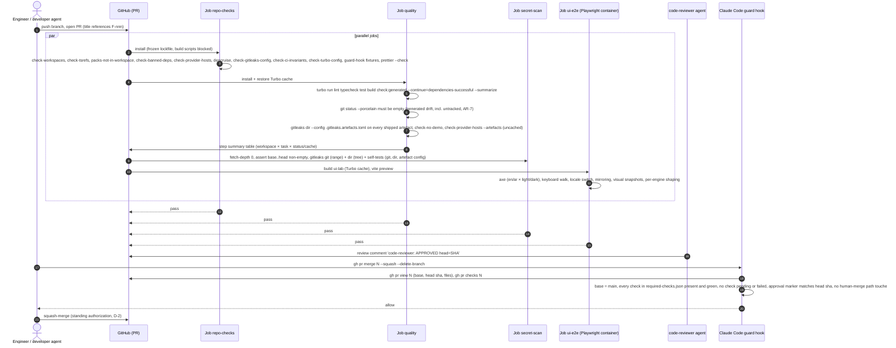
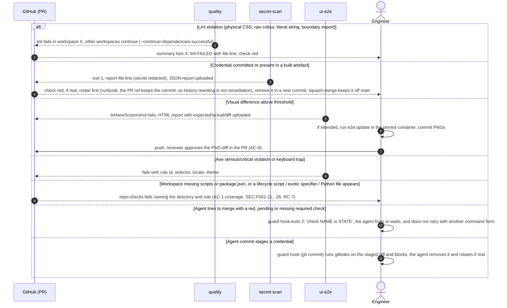
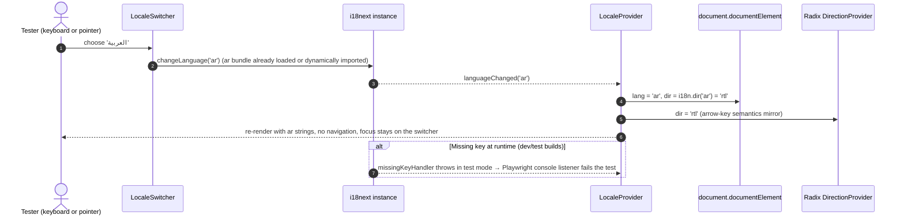

# F-001: Engineering and design-system foundations (tokens, RTL-ready layout, a11y lint): Solution Design

> Phase 4 · Owner: solution-designer · Brief: ./brief.md · ADRs: [ADR-0001](../../architecture/adr/0001-services-language-typescript.md), [ADR-0004](../../architecture/adr/0004-agent-protocol-transport-and-schema.md), [ADR-0012](../../architecture/adr/0012-agent-host-engine-port-boundary.md), [ADR-0024](../../architecture/adr/0024-telemetry-opentelemetry-stack.md), [ADR-0027](../../architecture/adr/0027-deployment-packaging.md) · Security: [security.md](../../architecture/security.md) SR-03, SR-21, SR-28, §5.8 RF-1 to RF-7, §8.1 P0-9 · Consistency review: BC-11, CQ-07
> Status: **Draft for G4, revised after the architect and security reviews.** Date: 2026-09-25. Branch `design/F-001`. Security review: [security.md](./security.md) (SEC-F001-01 to 27).

**Product-owner decisions (2026-09-25).** These are decisions, not open questions. The rationale and consequences are in the linked sections.

| # | Decision | Effect on this design |
|---|---|---|
| D-1 | **BC-11 is deferred.** "Don't worry about CI, leave it." | Tasks T20 to T25 move to §11 "Deferred scope (BC-11)". Their content is kept and marked deferred. They are not in the active task list (§10). |
| D-2 | **No GitHub plan upgrade, and no org 2FA or rulesets for now.** The repo stays private on GitHub Free. | Merges are gated by the merging agent checking `gh pr checks` before `gh pr merge --squash`, under the CLAUDE.md standing authorization. The check is enforced agent-side by the Claude Code guard hook (§6.3). Nothing server-side blocks a red merge (accepted risk, below). |
| D-3 | **Accepted risk** for SEC-F001-01, -02, -03, -04 (enforcement part), -13, -14, -15, -16, -17, -18, -22 and -25, and for the RF-1, RF-2, RF-4 (except the secret scan) and RF-5 gaps. | Listed with severity, owner, date and revisit trigger in "Accepted risks". |
| D-4 | **Agents hold push credentials** (answers OQ-SEC-F001-3). Agents may push feature branches, open and squash-merge PRs, and create release tags. They must not force-push, push to `main`, delete remote refs (other than `gh pr merge --delete-branch`), delete the repo or change repo settings. | `.claude/settings.json` and the guard hook are designed to this rule set (§6.3, T15). |

**Left for the G4 reviewer:** approve or request changes to the design as a whole. The only items still open are external blockers (OQ-D5, OQ-D8, OQ-D13; see "Open questions").

---

## 1. Summary & scope

F-001 creates the working engineering baseline that every other feature builds on:
- **Monorepo toolchain.** Node.js LTS, pnpm, Turborepo, TypeScript project references, ESLint flat config, Prettier, Stylelint, Vitest and Playwright.
- **Guard-rails that fail CI.** Logical-only layout, no hard-coded UI strings, no raw colours, accessibility, secrets, and import boundaries (ADR-0012, SR-03).
- **The `packages/ui` design-system foundation.** DTCG tokens with light and dark themes, a contrast gate, an Arabic-capable bundled typeface, i18next with `en` and `ar`, a runtime locale switch, and a small set of RTL-correct, keyboard-accessible components.
- **An internal demo app (`apps/ui-lab`)** that is never shipped. It carries the automated a11y, keyboard, mirroring, shaping and visual-regression tests.

**REQs.** REQ-106 and REQ-109, foundation slices only (both are closed in F-021). It also supports REQ-095(a) (CI secret scan) and SR-03, SR-21 and SR-28 (build-time controls). BC-11 (RF-1 to RF-5 hardening) is **deferred** (D-1, §11). The gaps that remain are accepted risks.

**Not in F-001.** The Agent Protocol schema and its zod → JSON Schema generator belong to **F-003**: F-003 AC-8 validates the schema, and ADR-0004 decision 5 places the schema in `packages/protocol`. F-001 provides only the generic "generated artefact drift" CI step that F-003 plugs its generator into (§3.5). Also out of scope: the Desktop (Electron) shell (OQ-F001-2), and SBOM and cosign signing, which are deferred to ADR-0027 in Phase 1 (§11.9).

| AC | Satisfied by (design section) | Tested by (§8.4) |
|---|---|---|
| AC-1 CI runs install, lint, test and build for every workspace; the run log lists each | §2.1 workspace layout + placeholder guard + scaffold templates; §3.1 workspace contract; §8.2 `repo-checks` (coverage check) and `quality` (Turbo `--continue`, per-workspace summary); §6.4 uncached checks and `globalDependencies` so a cache replay can't skip a gate | TC-F-001-01, TC-F-001-02, TC-F-001-45, TC-F-001-46 |
| AC-2 Secret scan fails on synthetic credential; `main` head and client artefacts have 0 findings | §6.2 gitleaks design: PR range with `fetch-depth: 0` and a non-empty-range assertion, tree, separate artefact config, custom provider-key rules, git/dir/artefact self-tests with explicit `--config`; local pre-commit and agent commit hooks (§6.2.4) | TC-F-001-03, TC-F-001-04, TC-F-001-05, TC-F-001-37, TC-F-001-38, TC-F-001-39, TC-F-001-40 |
| AC-3 Named tokens (7 categories × light/dark); 0 raw colours outside token files | §3.2 token schema; §7.1 token pipeline; §7.3.4 raw-colour lint | TC-F-001-06, TC-F-001-07 |
| AC-4 Physical direction properties, values and utility classes are errors; 0 on `main` | §7.3 logical-layout lint (Stylelint, Tailwind classes, inline styles) | TC-F-001-08, TC-F-001-09 |
| AC-5 Unkeyed user-visible string literal is an error; 0 on `main` | §7.4.4 `i18next/no-literal-string` + typed keys | TC-F-001-10, TC-F-001-09 |
| AC-6 Runtime `en`↔`ar` switch sets `dir` and `lang` without reload; 0 missing keys | §7.4.2 locale runtime; §7.4.5 missing-key checks | TC-F-001-11, TC-F-001-12 |
| AC-7 Regions and directional icons mirror; non-directional icons don't; code/paths stay LTR | §7.3.5 mirroring rules; §3.4 icon registry; §7.3.6 LTR islands | TC-F-001-13 |
| AC-8 20-string Arabic sample shapes correctly in 4 browsers; redistributable font licence | §7.2 typeface (Noto, OFL-1.1, no RFN); §7.6 sample set | TC-F-001-14, TC-F-001-15, TC-F-001-16, TC-F-001-17 |
| AC-9 Visual regression in 4 configurations with an agreed threshold; approval in the PR | §8.2 `ui-e2e`; §8.3 threshold; §5.4 snapshot approval flow | TC-F-001-18, TC-F-001-19 |
| AC-10 Axe scan of the demo and every component example in `en` and `ar`: 0 serious/critical | §7.8 a11y lint + §8.2 axe harness | TC-F-001-20, TC-F-001-21 |
| AC-11 Token-pair contrast gate (4.5 / 3 / 3) | §3.2 contrast-pair schema; §7.1.4 contrast check | TC-F-001-22, TC-F-001-23 |
| AC-12 Keyboard-only: reachable, visual order (RTL in `ar`), visible focus, no traps | §7.7 keyboard design; §8.2 keyboard walker | TC-F-001-24, TC-F-001-25 |
| AC-13 Demo screen and its data absent from production builds and unreachable | §7.6 `apps/ui-lab` isolation; §6.1 boundary rule; §3.1 `shipped` flag | TC-F-001-26, TC-F-001-27, TC-F-001-28 |

Controls that come from the architect and security reviews rather than from a brief AC (boundary rules, agent guard, supply-chain pins) are mapped to design sections, tasks and tests in §6.7.

---

## 2. Components touched

The repo today holds only README placeholders in `apps/`, `packages/`, `services/` and `packs/`, plus `package.json` (pnpm 9.12.0, turbo ^2.1.0), `pnpm-workspace.yaml` (which includes `packs/*`), `turbo.json`, `ci.yml` and `release.yml` (tag-pinned actions, no `permissions` in CI), `.claude/settings.json`, `.gitignore` and `.editorconfig`. Everything below is new unless marked *changed*.

| Path | New / changed | Responsibility |
|---|---|---|
| `package.json` | changed | `packageManager: "pnpm@11.27.N+sha512.<hash>"` (exact version with hash, SEC-F001-20), `engines.node: ">=24.12 <25"`, root scripts (`lint`, `typecheck`, `test`, `build`, `repo:check`, `e2e`, `format`, `tools:install`, `hooks:install`). **No root lifecycle scripts** (`preinstall`, `install`, `postinstall`, `prepare`; SEC-F001-11). Turbo stays the orchestrator. |
| `.nvmrc` | new | `24` (Node.js 24 LTS). |
| `pnpm-workspace.yaml` | changed | Workspaces `apps/*`, `packages/*`, `services/*`, `tooling/*`. **`packs/*` removed (RF-7).** Supply-chain settings and `allowBuilds` defaults (§6.4). |
| `turbo.json` | changed | Tasks `build`, `typecheck`, `lint`, `test`, `test:integration` (convention only, §2.1), `check:generated`, `e2e`; outputs; `dependsOn: ["^build"]` where types are needed; `globalDependencies` for root configs; `remoteCache.enabled: false` (§6.4, SEC-F001-12, -23). |
| `tsconfig.json` | new | Solution file that references every TS workspace (kept in sync by `check-tsrefs`). |
| `prettier.config.js`, `.prettierignore` | new | Formatting (Prettier core only). |
| `.dependency-cruiser.cjs` | new | Import-boundary rules (§6.1). The rule lists are imported from `tooling/eslint-config/boundaries.js`, so ESLint and dependency-cruiser share one source. Scans source, tests, scripts, configs and `packs/**` (RC-3). |
| `.gitleaks.toml`, `.gitleaks.artefacts.toml` | new | Secret-scan configs: repository/git scans and shipped-artefact scans, kept separate so no allow-list can silence the artefact scan (§6.2, SEC-F001-05). |
| `.githooks/pre-commit` | new | Repo-managed git hook: gitleaks on staged changes (§6.2.4, SEC-F001-07). Enabled with `pnpm hooks:install`. |
| `.github/workflows/ci.yml` | changed | Jobs `repo-checks`, `quality`, `secret-scan`, `ui-e2e`, `pr-traceability` (kept) (§8.2). `cancel-in-progress` only for PRs (SEC-F001-21). Action pinning and `permissions` are **not** changed (D-1). |
| `.github/required-checks.json` | new | The check names the merge guard requires to be green before an agent squash-merges (§6.3.3). Grows as jobs land. |
| `.github/workflows/release.yml` | unchanged | Its hardening (T25) is deferred (D-1, §11.8). |
| `.github/workflows/scheduled.yml`, `codeql.yml`, `renovate.json`, `osv-scanner.toml` | **deferred** (D-1) | §11. |
| `.github/CODEOWNERS` | new | Names the human owner of the protected paths (§6.6). **Not enforced on GitHub Free for a private repo** (accepted risk, D-3). The code-reviewer agent and the merge guard read it. |
| `.claude/settings.json` | changed | Allow and deny lists matching the standing authorization (D-4), PreToolUse guard hook, sandbox (§6.3). **Human merge.** |
| `.claude/hooks/guard-bash.mjs`, `.claude/hooks/test/**` | new | Dependency-free PreToolUse guard for `git` and `gh` commands, the merge gate and the commit-time secret scan, with a fixture test list (§6.3). **Human merge.** |
| `tooling/tsconfig` (`@ralysa/tsconfig`) | new | Base configs: `base.json`, `lib-isomorphic.json` (no DOM, no Node types; RC-6), `lib-node.json`, `lib-dom.json`, `react-lib.json`, `vite-app.json`, `node-service.json`, `node-cli.json` (RC-6). |
| `tooling/eslint-config` (`@ralysa/eslint-config`) | new | Flat-config presets (`base`, `isomorphic`, `react-ui`, `tests`), boundary lists, local plugin `@ralysa/eslint-plugin` (rules `no-physical-inline-style`, `no-raw-color`). **The boundary rules live in `base`** and `tests` must not relax them (RC-3). |
| `tooling/stylelint-config` (`@ralysa/stylelint-config`) | new | Logical-layout and raw-colour rules for CSS (§7.3.2). |
| `tooling/vitest-config` (`@ralysa/vitest-config`) | new | Shared Vitest presets (node, jsdom). |
| `tooling/repo-scripts` (`@ralysa/repo-scripts`) | new | CI checks: `check-workspaces` (including lifecycle scripts, dependency specifiers and the Python ban), `check-tsrefs`, `check-banned-deps`, `check-provider-hosts`, `check-no-demo`, `check-i18n`, `check-contrast`, `check-gitleaks-config`, `check-ci-invariants`, `check-turbo-config`, `secret-scan` wrapper and self-tests, `placeholder-guard`, `scaffold` (new package from template), `ci-duration`; `bin/install-tool.sh` with `bin/tool-hashes.txt`. Deferred with BC-11: `check-workflows`, `osv-gate`. |
| `docs/engineering/repo-conventions.md` | new | Scaffold kinds, the `test` vs `test:integration` convention, lifecycle-script and dependency-specifier rules, hook setup, the secret-rotation runbook (RC-6, SEC-F001-07). |
| `packages/ui` (`@ralysa/ui`) | new (replaces placeholder) | Tokens and generator, themes, fonts, i18n runtime and `ui` catalogs, icon registry, Phase 0 components (§7.5). |
| `apps/web` (`@ralysa/web`) | new (replaces placeholder) | Minimal Vite + React shell. It has providers, `lang`/`dir` wiring, tokens CSS and one i18n'd app-name heading, and **no end-user screens**. It is the production-build target for AC-2 and AC-13. `shipped: true`. |
| `apps/ui-lab` (`@ralysa/ui-lab`) | **new folder** | Internal demo screen, component gallery, synthetic samples and Playwright tests. `shipped: false`, never packaged (§7.6). |
| `apps/desktop`, `apps/cli`, `packages/{workbench,views,protocol,auth,sdk}`, `services/{agent-host,control-plane,model-gateway,mcp-gateway,workspace-runtime}` | changed (README → placeholder package) | `package.json` with `ralysa.kind: "placeholder"` and scripts that run `placeholder-guard` (§2.1). Owner features (F-002 to F-005, F-015 and later) convert them with `pnpm scaffold`. |
| `services/extraction` | changed (placeholder package) | Same guard. Python tooling arrives with it in Phase 2 (ADR-0001 exception). Until the F-004 design settles Python lint, test and the SR-03 ban, `check-workspaces` rejects Python files anywhere in the repo (§2.1, OQ-D11, RC-7). |
| `packs/*` | unchanged | No longer workspace packages (RF-7). |
| `docs/engineering/frontend-foundations.md` | new | Developer guide: tokens, RTL rules, i18n key conventions, icon registry, adding dependencies, snapshot updates. |

### 2.1 Workspace layout and the placeholder guard

AC-1 requires every folder under `apps/`, `packages/` and `services/` to run install, lint, test and build. Adding fake source code to 14 empty folders would be misleading. Instead, each empty folder becomes a **placeholder package**: its `lint`, `typecheck`, `test` and `build` scripts run `placeholder-guard`, which:

- **passes** when the folder contains only `README.md` and `package.json`
- **fails** with "convert this package with `pnpm scaffold <path> --kind <library|service|app>`" as soon as any other file appears

So each placeholder shows up in the Turbo run log as a real, green workspace (AC-1). No package can quietly gain code without real lint and test wiring. The owner feature swaps in a real package from the templates.

`check-workspaces` (in `repo-checks`) fails if:
- any directory under `apps/`, `packages/`, `services/` or `tooling/` has no `package.json`, or is missing from `pnpm ls -r --depth -1 --json`
- any workspace is missing one of the four required scripts (Turbo silently skips packages that lack a script, which is why this check is needed)
- any `package.json` fails the §3.1 schema
- any workspace or the root `package.json` defines a lifecycle script (`preinstall`, `install`, `postinstall`, `prepare`, `prepack`, `postpack`, `prepublish`, `prepublishOnly`, `publish`, `postpublish`) that isn't in `tooling/repo-scripts/lifecycle-allowlist.json`. Each allow-list entry names the package, the script, the exact command, an owner and a reason. The file starts empty (SEC-F001-11). pnpm's `strictDepBuilds` covers only dependencies, so this check is what stops an edited workspace `package.json` from running code on the allowed `pnpm install`.
- `enablePrePostScripts` is set to `true`, or `dangerouslyAllowAllBuilds` appears anywhere, or an `allowBuilds` entry is `true` without a matching reviewed entry in `tooling/repo-scripts/allow-builds.json` (SEC-F001-19)
- any dependency specifier uses `npm:` (alias), `file:`, `link:`, `portal:`, `git+…`, `github:` or a tarball URL, unless allow-listed in `boundaries.js` with a reason. A `file:`, `link:` or `portal:` specifier that resolves under `packs/` is rejected with **no** allow-list (SEC-F001-09 (a), SEC-F001-26)
- any `*.py`, `pyproject.toml`, `requirements*.txt`, `Pipfile`, `setup.cfg` or `uv.lock` exists outside `docs/` and `requirements/`. This is the RC-7 deadline in code: the F-004 design lands the Python toolchain and the Python SR-03 ban, and only then narrows this rule for its path.

**Scaffold templates (RC-6).** `pnpm scaffold <path> --kind <kind>` creates a real package from `tooling/repo-scripts/templates/<kind>/`. Every template passes `check-workspaces`, lint, typecheck, test and build on creation (TC-F-001-46).

| Kind | tsconfig base | ESLint preset | For |
|---|---|---|---|
| `library` (DOM) | `lib-dom.json` / `react-lib.json` | `base` + `react-ui` | `packages/ui`, `workbench`, `views` |
| `library-isomorphic` | `lib-isomorphic.json` (`lib: ["ES2023"]`, `types: []`) | `base` + `isomorphic` (bans `node:*` and Node built-in module imports; DOM globals are type errors because `lib` has no DOM) | `packages/protocol`, `packages/auth`, `packages/sdk`: must load in browsers and Node (multi-surface parity) |
| `service` | `node-service.json` | `base` | F-002, F-004 services |
| `app` | `vite-app.json` | `base` + `react-ui` | `apps/web`, `apps/ui-lab` |
| `cli` | `node-cli.json` (Node 24, `jsx: react-jsx` for Ink) | `base` (UI lint layer off: a terminal isn't in the AC-4/AC-5 scope) | `apps/cli` (F-005). Has a `bin` entry, `ralysa.kind: "cli"`, `shipped: true` and artefact `["dist"]`; the F-005 design chooses its bundler. |

**Test convention (RC-6, AR-8 b).**
- `test` is **hermetic**: no network, no database, no containers. It runs in `quality` for every workspace.
- Tests that need Postgres, Redis or another service go in an optional `test:integration` script. `turbo.json` defines the task (`cache: false`, `dependsOn: ["^build"]`). F-001 adds **no** CI job for it, because no workspace has one yet. The first feature that adds a `test:integration` script (F-002 is expected) adds the `integration` CI job with service containers, so `quality` stays inside the §8.3 budget.
- Written down in `docs/engineering/repo-conventions.md`.

### 2.2 Toolchain versions (pin at implementation; confirm then)

Policy: use the **latest patch of a release line that has been generally available for at least 30 days**. With Renovate deferred (D-1, §11.2), upgrades are proposed by hand in a PR; major upgrades are recorded in the PR description with the reason. Versions below were read from the npm registry and vendor docs on 2026-09-25. Each must be **re-confirmed at implementation**. `pnpm minimumReleaseAge` (§6.4) will also hold back anything younger than 3 days.

| Tool | Recommended | Why this line (evidence) |
|---|---|---|
| Node.js | **24.x LTS "Krypton"** (24.21.0 current) | Active LTS; maintenance from 2026-10-20; EOL 2028-04-30. Node 26 becomes LTS on 2026-10-28, so revisit then (OQ-D9). ADR-0001 requires Node.js LTS. [R1] |
| pnpm | **11.27.x** | `allowBuilds` (since 10.26), `strictDepBuilds` default `true`, `minimumReleaseAge` default 1440 since v11, `blockExoticSubdeps` [R2][R3]. The pnpm 12 line is under 1 month old (12.0.0 on 2026-08-26). pnpm 10 has had no release since 2026-07-10 [R4]. |
| Turborepo | **2.11.x** | `--continue=dependencies-successful`, `--summarize` [R5]. Telemetry opt-out via `TURBO_TELEMETRY_DISABLED=1` [R6]. |
| TypeScript | **6.0.x** (6.0.3) | `typescript-eslint` 8.70.1 declares `typescript >=4.8.4 <6.1.0`. TypeScript 7.0.2 (native) is `latest` but is not yet supported by typescript-eslint [R4]. Revisit TS 7 when it is (OQ-D9). |
| ESLint | **10.x** | **ESLint v9 reached end-of-life on 2026-08-06** [R7]. |
| typescript-eslint | 8.70.x | Peer range includes ESLint ^10 [R4]. |
| React lint | `@eslint-react/eslint-plugin` 5.20.x, `eslint-plugin-react-hooks` 7.1.x | Both accept ESLint 10. `eslint-plugin-react` 7.37.5 declares ESLint ≤ ^9.7 [R4]. |
| a11y lint | `eslint-plugin-jsx-a11y` 6.10.2 through `@eslint/compat` `fixupPluginRules` (2.1.x) | jsx-a11y declares ESLint ≤ ^9. T02 includes a spike. Fallback is the young fork `eslint-plugin-jsx-a11y-x` 0.2.0 (peer ESLint ^10) [R4]. The runtime axe gate (AC-10) is the authoritative a11y check. |
| i18n lint | `eslint-plugin-i18next` 6.1.x | `no-literal-string` rule, flat config [R8]. |
| Tailwind lint | `eslint-plugin-better-tailwindcss` 4.7.x | `enforce-logical-properties` (with `ignore`), `no-restricted-classes`, `no-unknown-classes`; ESLint ^10 and Tailwind ^4.1.17 [R9]. |
| Stylelint | 17.x + `stylelint-plugin-logical-css` 2.1.x | Rules `logical-css/require-logical-properties` and `require-logical-keywords` with `ignore` options [R10]. |
| dependency-cruiser | 18.x | Node ^22 or ^24 [R4]. |
| Prettier | 3.9.x | [R4] |
| Vitest | **4.1.x** | Vitest 5.0.0 is 3 weeks old (2026-09-03). 4.1.11 accepts Vite ^8 [R4]. |
| Vite / React | Vite 8.3.x, `@vitejs/plugin-react` 6.1.x, React 19.x | Spec §10.1 [R4]. |
| Tailwind CSS | 4.3.x with `@tailwindcss/vite` | Spec §10.1. v4 theme reset `--color-*: initial` removes the default palette [R11]. Logical utilities (`ms-*`, `ps-*`, `text-start`) exist, and `space-x-*` is already logical [R12]. |
| Radix / shadcn | `radix-ui` 1.6.x; shadcn/ui patterns copied into `packages/ui` | Spec §10.1. `DirectionProvider` for RTL keyboard behaviour [R4]. |
| i18next | i18next 26.x, react-i18next 17.x, `i18next-cli` 1.74.x (MIT) | Spec §10.1. `i18next-cli extract --ci --dry-run`, `status`, `types` [R13]. Its Locize/cloud commands are **not** used. |
| Icons | `lucide-react` 1.x (ISC) | Used only through the icon registry (§3.4). |
| Fonts | `@fontsource-variable/noto-sans-arabic`, `@fontsource-variable/noto-sans`, `@fontsource-variable/noto-sans-mono` 5.x | §7.2 [R14]. |
| Playwright | `@playwright/test` 1.63.x; image `mcr.microsoft.com/playwright:v1.63.0-noble` pinned by digest | `toHaveScreenshot` `maxDiffPixelRatio` and `threshold` (default 0.2) [R15]; Docker guidance `--ipc=host`, `--init` [R16]. |
| axe | `@axe-core/playwright` 4.13.x | [R4] |
| zod | 4.6.x | Used for config contracts here; F-003 uses `z.toJSONSchema()` (ADR-0004). |
| gitleaks | CLI **8.30.x** (MIT), checksum-verified | `git` and `dir` scans, `--redact`, `--ignore-gitleaks-allow`, SARIF/JSON [R17]. **Not** `gitleaks-action`, which needs a paid licence key for organisations [R18]. |

---

## 3. Contracts

F-001 adds **no Agent Protocol messages, REST endpoints or MCP tools**. The contracts below are internal build-time contracts. They live in `tooling/repo-scripts/src/contracts/` and `packages/ui/src/contracts/`, are validated with zod, and are versioned with the repo. Changing one is a normal PR that updates the checks and the fixtures together.

### 3.1 Workspace contract (AC-1, AC-2, AC-13)

```ts
// tooling/repo-scripts/src/contracts/workspace.ts
import { z } from 'zod';

export const REQUIRED_SCRIPTS = ['lint', 'typecheck', 'test', 'build'] as const;

export const RalysaPackageMeta = z.object({
  kind: z.enum(['app', 'cli', 'library', 'service', 'tooling', 'placeholder']),
  runtime: z.enum(['browser', 'node', 'isomorphic']).optional(), // required when kind = 'library' (RC-6); 'isomorphic' selects the isomorphic lint preset
  shipped: z.boolean(),           // true = reaches customers/users; drives artefact secret scan (AC-2) and demo exclusion (AC-13)
  ui: z.boolean(),                // true = UI lint layer applies (AC-4, AC-5, AC-10); cross-checked against the ESLint globs
  artefacts: z.array(z.string()).default(['dist']), // paths scanned after build when shipped = true
}).strict();

export const WorkspacePackageJson = z.object({
  name: z.string().regex(/^@ralysa\/[a-z0-9-]+$/),
  private: z.literal(true),       // nothing is published in Phase 0; flipping this for packages/protocol or sdk (REQ-053) is a reviewed change
  type: z.literal('module'),
  scripts: z.object(Object.fromEntries(REQUIRED_SCRIPTS.map((s) => [s, z.string().min(1)]))).passthrough(),
  ralysa: RalysaPackageMeta,
}).passthrough();
```

- Internal dependencies must use the `workspace:*` protocol, so an `@ralysa/*` name can never resolve from the public registry. `check-workspaces` enforces this, and it closes the dependency-confusion risk. The founder should still register the `@ralysa` npm scope (OQ-D13, open: needs an npm account action).
- `check-workspaces` also enforces the lifecycle-script, dependency-specifier and Python rules in §2.1, and the zod refinement that a `library` declares its `runtime`.
- `shipped` values in Phase 0: `apps/web` true, `apps/cli` true once F-005 converts it, `apps/desktop` true in Phase 1, `apps/ui-lab` **false**, `tooling/*` false, and services true (their images ship later).

### 3.2 Design-token source and contrast pairs (AC-3, AC-11)

The token source follows the **DTCG Format 2025.10** (first stable version) [R19]. It lives in `packages/ui/tokens/*.tokens.json`. The generator validates a subset:

```ts
// packages/ui/src/contracts/tokens.ts (subset of DTCG 2025.10; exact $value shapes confirmed against the spec in T06)
const TokenPath = z.string().regex(/^[a-z][a-zA-Z0-9]*(\.[a-zA-Z0-9]+)+$/);
const Alias = z.string().regex(/^\{[a-z][a-zA-Z0-9]*(\.[a-zA-Z0-9]+)+\}$/);
const Unit = z.number().min(0).max(1);
const Srgb = z.object({
  colorSpace: z.literal('srgb'),
  components: z.tuple([Unit, Unit, Unit]),
  alpha: Unit.optional(),
  hex: z.string().regex(/^#[0-9a-f]{6}$/),
});
export const Categories = ['color', 'typography', 'spacing', 'sizing', 'radius', 'elevation', 'motion'] as const; // AC-3
export const Themes = ['light', 'dark'] as const;

export const ContrastPair = z.object({
  fg: TokenPath,                              // e.g. "color.fg.muted"
  bg: TokenPath,                              // e.g. "color.bg.subtle"
  kind: z.enum(['text', 'largeText', 'nonText', 'focus']),
  themes: z.array(z.enum(Themes)).default(['light', 'dark']),
  usage: z.string().min(1),                   // where the pair is used; reviewers check it
});
export const MIN_RATIO = { text: 4.5, largeText: 3, nonText: 3, focus: 3 } as const; // WCAG 2.1 SC 1.4.3, 1.4.11
```

Rules:
- Semantic tokens must have **identical key sets** in `light` and `dark`.
- A colour token that appears in a contrast pair must be **opaque**. Translucent colours can't be checked statically, so the checker fails if `alpha < 1`.
- Disabled-control colours are listed as exempt (WCAG 1.4.3 exception), with a reason.

### 3.3 i18n catalog contract (AC-5, AC-6)

```ts
// packages/ui/src/contracts/i18n.ts
export const LOCALES = ['en', 'ar'] as const;               // en = source language
export const NAMESPACES = ['ui', 'web', 'lab'] as const;    // ui = design system, web = apps/web shell, lab = apps/ui-lab
export const KEY_RE = /^[a-z][a-zA-Z0-9]*(\.[a-z][a-zA-Z0-9]*){1,4}$/; // 2–5 semantic segments, lowerCamel
export const PLURAL_CATEGORIES = {                           // Intl.PluralRules / CLDR
  en: ['one', 'other'],
  ar: ['zero', 'one', 'two', 'few', 'many', 'other'],
} as const;
// Catalog file: <package>/locales/<locale>/<namespace>.json (nested objects; keySeparator ".", nsSeparator ":")
// Usage: t('ui:textField.error.required'); plural keys: "<key>_<category>"
```

Key conventions: `<namespace>:<area>.<component>.<element>[.<state>]`, for example `ui:textField.error.required`, `ui:iconButton.close.label`, `lab:showcase.nav.home`. Keys are semantic, never derived from English text. Interpolation uses `{{name}}`, and every interpolated value is bidi-isolated (§7.3.6).

### 3.4 Icon registry (AC-7)

```ts
// packages/ui/src/icons/registry.ts — the only module allowed to import lucide-react (ESLint no-restricted-imports)
import type { LucideIcon } from 'lucide-react';
export interface IconDef {
  component: LucideIcon;
  directional: boolean;  // true = drawn for LTR and mirrored in RTL (back/forward, chevrons, send, undo/redo, list-indent)
}
export const ICONS = {
  back:    { component: ArrowLeft,    directional: true },
  forward: { component: ArrowRight,   directional: true },
  chevronStart: { component: ChevronLeft, directional: true },
  chevronEnd:   { component: ChevronRight, directional: true },
  send:    { component: Send,         directional: true },
  search:  { component: Search,       directional: false },
  check:   { component: Check,        directional: false },
  close:   { component: X,            directional: false },
  // ...
} as const satisfies Record<string, IconDef>;
export type IconName = keyof typeof ICONS;
```

`<Icon name>` renders `data-icon-directional` and applies `rtl:-scale-x-100` only when `directional` is true. Icon-only buttons must pass `labelKey` (a type-checked i18n key).

### 3.5 Generated-artefact drift convention (hook for ADR-0004 decision 5)

- Any workspace that commits generated files defines `"check:generated"`, which regenerates them in place.
- The `quality` job runs `turbo run check:generated`, then fails if `git status --porcelain` prints anything. That catches modified **and new, untracked** generated files, which `git diff --exit-code` misses. `check:generated` is `cache: false` in `turbo.json`, so a cache replay can never stand in for regenerating *[AR-7]*.
- In F-001 this covers the generated token-name types (`packages/ui/src/tokens/generated.ts`) and the i18n key types.
- **F-003** adds `packages/protocol`'s `z.toJSONSchema()` emitter to the same task. That meets ADR-0004 decision 5 ("CI regenerates the schema and fails on any difference") with no extra CI work.

**Versioning notes.** These contracts are repo-internal and have no external consumers, so there's no semver. The token names and i18n keys become a de facto API for Phase 1 screens. After F-015 starts, renaming a token or key requires a codemod in the same PR (`docs/engineering/frontend-foundations.md`).

---

## 4. Data

**N/A.** There are no Postgres schema changes, stored entities or runtime data.

| Table.column | Type | PII class | Retention | Index |
|---|---|---|---|---|
| (none) | – | – | – | – |

**Non-database artefacts:**
- CI logs and artefacts (Playwright reports, axe JSON, gitleaks reports; OSV reports only if the deferred T23 is revived) hold **synthetic data only**. gitleaks reports are redacted.
- Artefact `retention-days: 14` for reports and 30 for run summaries. GitHub's log retention is the evidence store for AC-1, AC-2 and AC-9 to AC-11, and the test report links the runs.
- Visual snapshots (PNG) are committed under `apps/ui-lab/e2e/__screenshots__/`. They contain synthetic text only (brief governance).

---

## 5. Flows

### 5.1 Pull request pipeline: main path



On GitHub Free nothing server-side enforces this. The guard hook is the only automated gate on a merge, and only for merges made through Claude Code (accepted risk SEC-F001-01, D-3).

### 5.2 Key failure paths



### 5.3 Runtime locale switch (demo screen, AC-6)



### 5.4 Snapshot approval (AC-9)

The developer runs `pnpm --filter @ralysa/ui-lab e2e:update`, which runs Playwright in the same pinned container image as CI. They commit the changed PNGs, and the reviewer approves the image diff in the PR. CI never auto-commits snapshots, because that would need `contents: write` on PR runs (RF-2).

---

## 6. Governance

F-001 is build tooling. It has **no runtime policy checks, approval hooks or audit events**. What it does do is enforce several architecture and security controls at build time. The governance pieces are:

- **Policy checks (where enforced):** N/A at runtime. The build-time controls are in the table in §6.1, and all are enforced in CI.
- **Approval hooks:**
  - N/A for product actions.
  - Process approvals: the code-reviewer agent's review of every PR (G5 under the standing authorization), visual-snapshot approval in the PR (AC-9), and the new-dependency checklist (§6.3.5).
  - **Human merge required** for PRs that touch `.claude/**`, `CLAUDE.md` or `.github/CODEOWNERS`: these change the agents' own permissions or instructions, so an agent must not merge them (§6.3.3). The guard hook enforces this for agent merges.
  - The release-approval hardening (T25) is deferred (D-1, §11.8). Release tags are cut by agents under D-4, with the guard's tag checks (§6.3.3 G-5).
- **Audit events (name → fields):** **None.** F-001 makes no model or tool calls, so ADR-0022's two-phase audit doesn't apply. The CI run log and uploaded reports are the evidence (brief Governance).
- **Residency / model routing:**
  - N/A for tenant data. No customer data or production credential may ever be given to CI, which processes only source code and synthetic data.
  - CI runs on GitHub-hosted runners.
  - Outbound calls from CI: npm registry; Fontsource packages from npm (no font CDN at runtime); GitHub release downloads for gitleaks (hash-pinned). The deps.dev and OSV calls arrive only with the deferred T23.
  - **No Turborepo Remote Cache.** Vercel would receive build artefacts, and GitHub's cache is enough at this size. `turbo.json` sets `remoteCache.enabled: false`, and the guard hook rejects `--api`, `--token`, `--team` and `TURBO_*` remote-cache variables (SEC-F001-12).
  - **Telemetry is off.** `TURBO_TELEMETRY_DISABLED=1` and `DO_NOT_TRACK=1` in CI and in the dev setup docs [R6], in the spirit of SR-21.

### 6.1 Build-time boundary controls

| Control | Source | Enforcement (all three layers unless stated) | Task |
|---|---|---|---|
| `@anthropic-ai/claude-agent-sdk` (and its platform packages `@anthropic-ai/claude-agent-sdk-*`) importable only from `services/agent-host/src/engine/claude/**` | ADR-0012 decision 2; ADR-0004 decision 6 (clarified 2026-09-25); agent-protocol.md §6.1 rule 1 | (1) ESLint `no-restricted-imports` for editor feedback; (2) dependency-cruiser rule, which also catches `require()` and dynamic `import()`; (3) `check-banned-deps` *[AR-6]*: in the full dependency graph (prod, dev and optional) of every workspace and of the root `package.json`, **every path to the package must pass through `@ralysa/agent-host`**. `apps/web` and `packages/*` must not depend on `@ralysa/agent-host` at all. `apps/cli` and `apps/desktop` may depend on it only to launch the local host (F-003/F-005 decide how it is packaged). | T04 |
| Model-provider SDKs and in-process inference runtimes banned outside `services/model-gateway/**` | **SR-03**; model-gateway.md §1 | Same three layers. For `check-banned-deps`, the full graph (prod, dev and optional) of every workspace and the root `package.json` *[AR-5]*. Initial list (confirmed on npm 2026-09-25), with **scope-level bans where a vendor publishes a scope** *[AR-5]*: `@anthropic-ai/*` (all Anthropic packages; the Agent SDK packages follow the row above), `openai`, `@azure/openai`, `@azure-rest/ai-inference`, `@google/genai`, `@google/generative-ai`, `@google-cloud/vertexai`, `@google-cloud/aiplatform`, `@aws-sdk/client-bedrock*` (all Bedrock clients), `@aws-sdk/client-sagemaker-runtime`, `@mistralai/*`, `cohere-ai`, `groq-sdk`, `@huggingface/*` (including `@huggingface/transformers`), `ollama`, `@openrouter/*` *[SEC-F001-09 e]*, `@anthropic-ai/claude-code` (named explicitly although the scope ban covers it) *[SEC-F001-09 e]*, **`ai` and `@ai-sdk/*` (including `@ai-sdk/gateway` and `@ai-sdk/react`) with no exception**. There is no `@ai-sdk/react` exemption: it depends on `ai`, which depends on the hosted-gateway client `@ai-sdk/gateway`, and any future UI-hook exemption needs an ADR judged on its full transitive closure *[AR-5, SEC-F001-08]*. Also `langchain`, `@langchain/*`, `llamaindex`; in-process inference runtimes *[AR-5]*: `@xenova/transformers`, `onnxruntime-*`, `node-llama-cpp`, `@tensorflow/tfjs*`, `tesseract.js`. Names are matched on the **resolved** package name, so an `npm:` alias can't hide one (`check-banned-deps` reads the real name from the lockfile, and `check-workspaces` rejects aliases; SEC-F001-09 a). The dev closure is checked as well as prod, because Vite and esbuild bundle devDependencies into shipped output (SEC-F001-09 c). **Sole standing exception** *[AR-6]*: `@anthropic-ai/sdk` is a declared peer dependency of the Agent SDK. It may appear in the graph only on paths through `@ralysa/agent-host` → `@anthropic-ai/claude-agent-sdk`, and inside agent-host it is importable only from `engine/claude/**`. Any further exception is a reviewed entry in `boundaries.js` with a reason. F-004 may narrow the allowed path inside the gateway. | T04 |
| Vendor APM, crash-reporting, product-analytics and session-replay SDKs banned everywhere | ADR-0024 (OpenTelemetry is the only instrumentation API); SR-21 (no unscrubbed third-party crash reporting); N13, REQ-101c (no vendor telemetry) *[AR-9, adopted]* | Same. `dd-trace`, `@datadog/*`, `newrelic`, `@sentry/*`, `elastic-apm-node`, `applicationinsights`, `@dynatrace/*`; `posthog-js`, `posthog-node`, `@amplitude/*`, `mixpanel-browser`, `@segment/*`, `@vercel/analytics`, `@vercel/speed-insights`, `logrocket`, `@fullstory/*`. An exception needs an ADR. | T04 |
| No non-literal module loading, so static rules can't be bypassed | SEC-F001-09 (b) | ESLint `no-restricted-syntax` in the `base` preset: `import()` with a non-literal argument, `require()` with a non-literal argument, `module.createRequire`, `eval`, `new Function`, `process.getBuiltinModule`. Vite's `import.meta.glob` with a literal pattern is allowed. Per-path exceptions live in `boundaries.js` with a reason; the list starts empty. | T04 |
| Lint-disable comments can't switch the boundary rules off | SEC-F001-09 (f) | `@eslint-community/eslint-comments`: `no-unlimited-disable` (bans a bare `/* eslint-disable */`), `no-restricted-disable` for the boundary, `no-restricted-syntax` and `no-restricted-imports` rule IDs, `no-use` allowing only `eslint-disable-next-line` (no inline `/* eslint rule: off */` config), and `require-description`. dependency-cruiser and `check-banned-deps` don't read ESLint comments, so they stay in force regardless. | T04 |
| No provider API hostnames outside `services/model-gateway/**` | SEC-F001-09 (d) | `check-provider-hosts` greps tracked source (excluding `services/model-gateway/**`, `docs/**`, `requirements/**`, `*.md` and the host list itself) and, in `quality`, every shipped artefact, for the hostnames in `boundaries.js` `PROVIDER_HOSTS`: `api.anthropic.com`, `api.openai.com`, `*.openai.azure.com`, `*.services.ai.azure.com`, `generativelanguage.googleapis.com`, `*aiplatform.googleapis.com`, `bedrock-runtime.*.amazonaws.com`, `api.mistral.ai`, `api.groq.com`, `api.cohere.com`, `api.cohere.ai`, `openrouter.ai`, `api-inference.huggingface.co`, `router.huggingface.co`, `ai-gateway.vercel.sh`, `api.together.xyz`. Confirm the list in T16. | T16 |
| Nothing imports `apps/ui-lab` or `@ralysa/ui-lab` | AC-13 | dependency-cruiser + `check-banned-deps` | T04 |
| Nothing imports from `packs/**`; `pnpm-workspace.yaml` must not list `packs/*`; no `file:`/`link:`/`portal:` specifier resolves under `packs/` | **RF-7**; TM-41; SEC-F001-26 | `repo-checks` assertion + dependency-cruiser + `check-workspaces` specifier rule | T01, T02, T04 |
| Layering: `packages/*` don't import `apps/*` or `services/*`; apps don't import other apps; **`apps/*` don't import `services/*` modules, and `services/*` don't import other `services/*`**, so shared code goes in `packages/*` and services talk only over their contracts *[AR-9]*; `tooling/*` packages appear only in `devDependencies` *[AR-3]* | Overview §4 container boundaries | dependency-cruiser; `check-workspaces` for the devDependency rule | T04 |
| No credentials in repo or shipped artefacts | REQ-095(a) support; Phase 0 exit criterion | gitleaks in CI (§6.2), plus local and agent commit hooks (§6.2.4) | T05, T17 |
| Dependency lifecycle scripts blocked unless allow-listed | **RF-3** | pnpm 11 defaults plus explicit settings and `allowBuilds` defaults (§6.4) | T01 (install negative test deferred with T22) |
| Workspace and root lifecycle scripts blocked unless allow-listed | SEC-F001-11 (RF-6) | `check-workspaces` (§2.1) | T02 |

Lists live in `tooling/eslint-config/boundaries.js`, and ESLint, dependency-cruiser, `check-banned-deps` and `check-provider-hosts` all import them.

**Where the rules run (RC-3, AR-5 e).**
- The boundary rules (`no-restricted-imports`, the `no-restricted-syntax` loading ban and the eslint-comments rules) are in the **`base`** preset, not `react-ui`. `base` applies to every JS/TS file (`**/*.{js,cjs,mjs,jsx,ts,cts,mts,tsx}`) in `apps`, `packages`, `services` and `tooling`, including tests, scripts and `*.config.*` files.
- The `tests` preset may relax other rules (for example `i18next/no-literal-string`), but **must not** touch the boundary rules. A unit test loads the composed config for a `*.test.ts` path and asserts every boundary rule is still `error` (TC-F-001-29).
- dependency-cruiser scans the same file set, **plus** any JS/TS under `packs/**`. Packs left the workspace (RF-7), so ESLint no longer reaches them. The `.dependency-cruiser.cjs` `options.includeOnly` and `exclude` are set so tests, scripts, configs and `packs/**` are in scope, and `doNotFollow` is limited to `node_modules`.

**SR-03's authoritative control is network egress, not the build.** The Kubernetes NetworkPolicy egress block (F-004 and `deploy/`) is what stops a workload outside the Model Gateway reaching a provider. Every rule in this section is defence in depth: it catches mistakes early and cheaply, but a determined author can get past static analysis (SEC-F001-09).

**Python (RC-7, decided).** Python code (LiteLLM configuration in F-004, `services/extraction` in Phase 2) isn't covered by these JS/TS rules. The Python lint, test and SR-03 import ban are settled **in the F-004 design, before any Python source merges** into `services/model-gateway` or `services/extraction`. Until then, `check-workspaces` fails on any Python file in the repo (§2.1), so the deadline is enforced rather than remembered.

### 6.2 Secret scanning (AC-2)

#### 6.2.1 Tool and install

- **Tool.** gitleaks CLI 8.30.x (MIT) [R17]. `gitleaks-action` isn't used because it requires a licence for organisation repos [R18].
- **Install.** `tooling/repo-scripts/bin/install-tool.sh gitleaks` downloads the release tarball for `linux_x64`, `darwin_arm64` or `darwin_x64` and verifies it against the SHA-256 for that platform in **`tooling/repo-scripts/bin/tool-hashes.txt`**, which is committed. The hash is never read from the downloaded `checksums.txt` (SEC-F001-20). The binary goes to `.tools/gitleaks/<version>/` (git-ignored). `pnpm tools:install` runs it for developers.
- **Re-verification.** Every wrapper call (`secret-scan …`, the pre-commit hook, the guard hook) re-hashes the binary before running it, so a restored CI cache or a tampered local copy fails closed (SEC-F001-20).

#### 6.2.2 Configs (SEC-F001-05, SEC-F001-24)

Two configs, both passed explicitly with `--config` on **every** invocation (SEC-F001-06):

| File | Used by | Allow-lists |
|---|---|---|
| `.gitleaks.toml` | PR-range, tree and full-history scans; pre-commit and agent commit hooks | **None at start.** The tree scan runs in the `secret-scan` job on a clean checkout with no install and no build, so `node_modules/`, `.turbo/` and `dist/` don't exist there and need no allow-list. Any future path entry must be anchored at the repo root (`^apps/…`). No content allow-list entries. |
| `.gitleaks.artefacts.toml` | Shipped-artefact scans in `quality` | **None, ever.** |

- Both use `[extend] useDefault = true` and carry the same custom rules. The artefact config doesn't `[extend]` the repo config, so it can never inherit an allow-list.
- `check-gitleaks-config` (in `repo-checks`) fails if: the artefact config has any `[allowlist]` or `[[allowlists]]`; the two custom rule sets differ; a path allow-list entry in `.gitleaks.toml` isn't anchored with `^`; or either config drops `useDefault`.
- **Custom rules** (T05; regexes and formats fixed with positive and negative fixtures in TC-F-001-39). Each has keyword context and an entropy floor, so a bare 32-hex string elsewhere doesn't fire:

| Rule id | Target | Sketch |
|---|---|---|
| `azure-openai-key` | Azure OpenAI and Azure AI Services keys: the 32-hex format, and the newer long format if T05 confirms it | 32 hex (or the confirmed long format) within 40 characters of `azure`, `aoai`, `openai.azure.com`, `cognitiveservices`, `api-key` or `AZURE_OPENAI` |
| `litellm-key` | LiteLLM master and virtual keys (F-004) | `sk-[A-Za-z0-9_-]{20,}` near `litellm`, `LITELLM_MASTER_KEY`, `master_key` or `virtual_key` |
| `mistral-api-key` | Mistral | 32 alphanumerics near `mistral` or `MISTRAL_API_KEY` |
| `groq-api-key` | Groq | `gsk_[A-Za-z0-9]{52}` (prefix-based; no keyword needed) |
| `ralysa-selftest-canary` | Self-test only | `RALYSA_SELFTEST_CANARY_[A-Z0-9]{24}`. It exists only in our configs, so a hit proves the repo config was loaded rather than gitleaks' built-in default. |

Ralysa's own token formats get rules when F-002 defines them.

- **Flags.** Every run uses `--config <file> --redact --ignore-gitleaks-allow --exit-code 1 --report-format json --report-path <file>`. `--ignore-gitleaks-allow` means inline `gitleaks:allow` comments are ignored, so the configs are the only allow-list.

#### 6.2.3 CI scans (SEC-F001-06)

| Scan | When | Command sketch | Evidence |
|---|---|---|---|
| New commits | every PR | `actions/checkout` with **`fetch-depth: 0`**. Assert `git rev-list --count "$BASE..$HEAD"` > 0, with `BASE`/`HEAD` from the PR event's base and head SHAs. Then `gitleaks git --log-opts="$BASE..$HEAD" --config .gitleaks.toml …` | file, line, commit and rule in the log (secret redacted); JSON artefact |
| Working tree at head | every PR and push to `main` | `gitleaks dir . --config .gitleaks.toml …` | AC-2 "`main` head = 0 findings" |
| Full history | push to `main` (cheap at current size) | `gitleaks git --config .gitleaks.toml …` | |
| Shipped artefacts | `quality` job after build, **uncached** | for every workspace with `ralysa.shipped = true`, each path in `ralysa.artefacts`: `gitleaks dir <path> --config .gitleaks.artefacts.toml …`. **A missing artefact path fails**, so "0 findings" can't come from scanning nothing. For the CLI (F-005): `pnpm --filter @ralysa/cli pack`, extract, then scan. The desktop package once it exists (Phase 1). | AC-2 "every built client artefact = 0" |

**Exit codes.** The wrapper treats 0 as pass, 1 as findings (fail), and **any other code as a scanner error (fail)**. An empty PR range fails with "scan range is empty; is the base commit fetched?".

#### 6.2.4 Local and agent commit hooks (SEC-F001-07)

CI only detects a secret after it has been pushed, and on Free a red scan doesn't block the merge. Two local hooks catch it before the commit exists:

1. **Git pre-commit hook for everyone.**
   - `.githooks/pre-commit` (POSIX sh, committed) runs `tooling/repo-scripts/bin/gitleaks-staged.sh`. That script verifies the binary (§6.2.1), then runs `gitleaks git --pre-commit --staged --config .gitleaks.toml --redact --exit-code 1`.
   - It is enabled with `pnpm hooks:install`, which runs `git config core.hooksPath .githooks`. This is an explicit one-time command, **not** a `prepare` or `postinstall` script, which the SEC-F001-11 rule bans. `docs/engineering/repo-conventions.md` and the README's setup section tell developers to run it.
   - No third-party hook manager (husky, lefthook) is used: both need a lifecycle script or a native binary with an install step.
   - If gitleaks isn't installed, the hook fails with "run `pnpm tools:install`". A human can still bypass it with `git commit --no-verify`. CI remains the backstop.
2. **Claude Code `PreToolUse` hook for agents.**
   - The guard hook (§6.3.3) recognises any `git commit` and, before it runs, scans **both** the staged diff and the unstaged tracked diff (`gitleaks git --pre-commit` with and without `--staged`), so `git commit -a` and pathspec commits are covered.
   - A finding, a missing or tampered binary, or a scanner error blocks the commit (exit 2) with the redacted rule and file:line.
   - This works whether or not `core.hooksPath` is set. Agents can't skip it: `--no-verify` and `-n` on `git commit` are denied.
   - The guard also scans the outgoing range before an allowed `git push` (`gitleaks git --log-opts="origin/main..HEAD"`), which covers commits made outside Claude Code.

GitHub Secret Protection (server-side push protection) isn't bought (OQ-D3, decided). Rewriting history is not remediation: the credential is rotated (§6.2.6).

#### 6.2.5 Scanner self-tests (SEC-F001-06)

`secret-scan-selftest` runs in the `secret-scan` job on every CI run. Every synthetic value is **assembled from fragments at runtime**, so no matching literal exists in the repo. None was ever issued. Each case runs the **same wrapper and flags as the real scan**, with the config path passed explicitly:

| Case | Mode and config | Planted in | Expects |
|---|---|---|---|
| dir | `dir`, `.gitleaks.toml` | `$RUNNER_TEMP/selftest-dir/` | exit 1, and each expected rule at the expected file:line: an AWS-style key id, a GitHub-PAT-style token, an Anthropic-style key, a PEM `PRIVATE KEY` block of random base64, one per custom rule, and the canary |
| git | `git`, `.gitleaks.toml` | a temporary git repo in `$RUNNER_TEMP` with two commits: a clean one, then one with the synthetic set; scanned with `--log-opts=<first>..<second>` | exit 1, the same rules, and the commit SHA; plus a non-empty-range assertion |
| artefact | `dir`, `.gitleaks.artefacts.toml` | `$RUNNER_TEMP/selftest/apps/web/dist/assets/index-abc123.js` (a `dist/` path on purpose) | exit 1 with the canary and at least one provider key. This proves no allow-list silences `dist/`. |
| canary | both configs | as above | the `ralysa-selftest-canary` rule fires, proving the repo configs, not the built-in default, were loaded |

The one-off "throw-away branch" check in AC-2 stays a manual test (TC-F-001-04).

#### 6.2.6 Rotation runbook

`docs/engineering/repo-conventions.md` gets a short runbook. If a real credential reaches any commit that has been pushed:
1. Revoke and rotate it at the issuer first.
2. Then remove it in a new commit. Squash-merging keeps it off `main`, but GitHub keeps the PR ref (`refs/pull/N/head`), so history rewriting is **not** remediation.
3. Record the incident in the PR.

Agents can't force-push (§6.3), so any history rewrite is a human decision.

### 6.3 Claude Code settings and the guard hook (RF-6, D-4, SEC-F001-10, -11, -12)

**What changed.** The standing authorization in `CLAUDE.md` (2026-09-25) and D-4 let agents push feature branches, open PRs, squash-merge them once CI passes and the code-reviewer agent approves, and cut release tags. The security review's "deny all `git push`, `gh api`, `gh pr merge`" recommendation (SEC-F001-10) assumed the opposite (OQ-SEC-F001-3), so it is **reworked, not adopted**. The design lets through exactly what D-4 allows, and blocks what it forbids, in two layers:

1. **Settings rules** (`.claude/settings.json` allow and deny). These are cheap, but they are pattern matches on the command string, so they miss rewritten forms (for example `git -C . push`).
2. **The guard hook** (`.claude/hooks/guard-bash.mjs`, a `PreToolUse` hook on `Bash`). It **parses** the command and decides from the parsed form. This layer is authoritative within Claude Code.

A hook can only **narrow** permissions: exit 0 hands the command back to the normal permission flow, and exit 2 blocks it and returns the reason to the agent.

**Limits (stated plainly).** Both layers only see commands that Claude Code runs directly. A script run by an allowed command (`pnpm test` runs `package.json` scripts the agent can edit) can call `git push --force` unseen. So can any client outside Claude Code. On GitHub Free no server-side rule catches it. These controls prevent **mistakes and prompt-injected shortcuts**. They are not a boundary against a deliberately hostile agent. That residual is accepted risk SEC-F001-01 (D-3).

#### 6.3.1 Allow list (runs without a prompt)

```jsonc
"allow": [
  "Bash(pnpm install)", "Bash(pnpm lint)", "Bash(pnpm typecheck)", "Bash(pnpm test)", "Bash(pnpm build)",
  "Bash(pnpm repo:check)", "Bash(pnpm format)", "Bash(pnpm tools:install)", "Bash(pnpm hooks:install)",
  // SEC-F001-12: exact Turbo tasks replace "pnpm turbo run *" (no --api/--token/--team/--graph can ride along)
  "Bash(pnpm turbo run lint)", "Bash(pnpm turbo run typecheck)", "Bash(pnpm turbo run test)",
  "Bash(pnpm turbo run build)", "Bash(pnpm turbo run check:generated)",
  "Bash(pnpm turbo run lint typecheck test build)",
  "Bash(git status)", "Bash(git diff *)", "Bash(git log *)",          // flag risks handled by deny + guard
  "Bash(git add *)", "Bash(git commit *)",                             // guard scans for secrets first
  "Bash(git push -u origin feat/*)", "Bash(git push origin feat/*)",
  "Bash(git push -u origin fix/*)", "Bash(git push origin fix/*)",
  "Bash(git push -u origin hotfix/*)", "Bash(git push origin hotfix/*)",
  "Bash(git push -u origin design/*)", "Bash(git push origin design/*)",
  "Bash(git push origin refs/tags/v*)",                                // release tags (D-4); guard checks them
  "Bash(gh pr create *)", "Bash(gh pr checks *)", "Bash(gh pr view *)", "Bash(gh pr diff *)",
  "Bash(gh pr list *)", "Bash(gh pr merge * --squash *)",             // guard enforces the merge gate
  "Bash(gh issue list *)", "Bash(gh run list *)", "Bash(gh run view *)"
]
```

`pnpm install` stays allowed only because T01 lands first: pnpm 11 blocks dependency build scripts (§6.4), and `check-workspaces` blocks workspace lifecycle scripts (§2.1). Until T01 merges, **no agent adds a dependency** (SEC-F001-27).

#### 6.3.2 Deny list (layer 1)

Deny wins over allow. Pattern syntax, wildcard and operator handling are checked against the Claude Code settings documentation in T15.

```jsonc
"deny": [
  // force and history rewrite
  "Bash(git push --force*)", "Bash(git push -f*)", "Bash(git push * --force*)", "Bash(git push * -f*)",
  "Bash(git push *--force-with-lease*)", "Bash(git push *--force-if-includes*)", "Bash(git push * +*)",
  "Bash(git push *--mirror*)", "Bash(git push *--all*)", "Bash(git push *--prune*)", "Bash(git push *--no-verify*)",
  // main
  "Bash(git push * main)", "Bash(git push * main *)", "Bash(git push *:main*)", "Bash(git push *refs/heads/main*)",
  // deletion of remote refs, and bulk tag pushes
  "Bash(git push *--delete*)", "Bash(git push * -d *)", "Bash(git push * :*)",
  "Bash(git push *--tags*)", "Bash(git push *--follow-tags*)",
  // indirection that hides the subcommand
  "Bash(git -C * push*)", "Bash(git -c *)", "Bash(git --git-dir*)", "Bash(git --work-tree*)",
  "Bash(git send-pack*)", "Bash(git config *alias.*)", "Bash(git config *hooksPath*)",
  "Bash(git config *remote.*)", "Bash(git config *url.*)", "Bash(git config *credential*)",
  "Bash(git remote add*)", "Bash(git remote set-url*)",
  "Bash(git commit *--no-verify*)", "Bash(git commit * -n *)",
  // SEC-F001-12: file writes and external commands from diff/log
  "Bash(git diff *--output*)", "Bash(git log *--output*)", "Bash(git diff *--ext-diff*)",
  "Bash(git log *--ext-diff*)", "Bash(git diff *--textconv*)", "Bash(git log *--textconv*)",
  // merges that skip the gate
  "Bash(gh pr merge *--admin*)", "Bash(gh pr merge *--auto*)", "Bash(gh pr merge *--merge*)", "Bash(gh pr merge *--rebase*)",
  // repo settings, deletion and writes through the API
  "Bash(gh repo delete*)", "Bash(gh repo edit*)", "Bash(gh repo rename*)", "Bash(gh repo archive*)", "Bash(gh repo sync*)",
  "Bash(gh api *-X*)", "Bash(gh api *--method*)", "Bash(gh api * -f *)", "Bash(gh api * -F *)",
  "Bash(gh api *--field*)", "Bash(gh api *--raw-field*)", "Bash(gh api *--input*)", "Bash(gh api graphql*)",
  "Bash(gh secret *)", "Bash(gh variable *)", "Bash(gh workflow run*)", "Bash(gh workflow enable*)",
  "Bash(gh workflow disable*)", "Bash(gh release delete*)", "Bash(gh release edit*)",
  "Bash(gh auth token*)", "Bash(gh auth login*)", "Bash(gh auth refresh*)", "Bash(gh extension *)", "Bash(gh alias *)",
  // publishing and supply chain
  "Bash(pnpm publish*)", "Bash(npm publish*)", "Bash(pnpm approve-builds*)", "Bash(pnpm *--dangerously-allow-all-builds*)",
  "Bash(pnpm turbo *--api*)", "Bash(pnpm turbo *--token*)", "Bash(pnpm turbo *--team*)", "Bash(pnpm turbo *--graph*)"
]
```

#### 6.3.3 Guard hook rules (layer 2)

`.claude/hooks/guard-bash.mjs` is plain Node 24 ESM with **no dependencies**, so it works before T01 and can't be changed by a dependency update. It is registered in `.claude/settings.json` under `hooks.PreToolUse` with matcher `Bash` and a 60-second timeout. It reads the hook JSON from stdin.

**Parsing (fail closed).**
- It tokenises with shell quoting rules and splits on `;`, `&&`, `||`, `|`, `&` and newlines. Each segment is judged, and the command is blocked if any segment is blocked.
- It strips leading `VAR=value` assignments and the wrappers `command`, `env`, `nice`, `nohup` and `time`. `sudo` is blocked.
- It **blocks** any command containing `git`, `gh` or `pnpm` together with:
  - command substitution (`$(…)`, backticks), `eval`, or `sh -c` / `bash -c` / `zsh -c`
  - `xargs`, process substitution, or a variable in command position
  - an assignment to `GIT_*`, `GH_*`, `GITHUB_TOKEN`, `TURBO_API`, `TURBO_TOKEN`, `TURBO_TEAM` or `TURBO_REMOTE_*`
  - `hub`
- Executables are matched by basename, so `/usr/bin/git` is `git`.
- git global options: `-C <dir>` is honoured (it sets the directory the hook inspects). `-c`, `--git-dir`, `--work-tree`, `--exec-path`, `--namespace` and `--config-env` are blocked.
- An unknown git subcommand that resolves to an alias (`git config --get alias.<name>`) is blocked.

**git rules.**

| Id | Rule |
|---|---|
| G-1 | `git push`: blocked if any force or rewrite form is present: `--force`, `--force-with-lease[=…]`, `--force-if-includes`, `--mirror`, `--all`, `--prune`, a short-flag cluster containing `f` or `d` (for example `-uf`), or a refspec starting with `+`. |
| G-2 | `git push`: blocked if the push would update `main`: a destination of `main`, `refs/heads/main`, `HEAD:main` or `<x>:main`. **Implicit refspecs** (bare `git push`, `git push origin`, `git push origin HEAD`) are resolved: blocked when the current branch is `main`, when HEAD is detached, when the branch's upstream or `pushRemote` resolves to `main`, or when resolution fails. |
| G-3 | `git push`: blocked for deletion: `--delete`, `-d`, or a refspec starting with `:`. The only remote-branch deletion agents may cause is `gh pr merge --delete-branch`. |
| G-4 | `git push`: only to remote `origin` (no URLs or other remotes). `--no-verify`, `--tags` and `--follow-tags` are blocked. |
| G-5 | Tag pushes: exactly one refspec `refs/tags/v<MAJOR>.<MINOR>.<PATCH>[-rc.<N>]`. The hook checks that: the local tag is annotated (`git cat-file -t` = `tag`); its commit is an ancestor of freshly fetched `origin/main`; `docs/releases/<version>.md` exists at that commit; and `git ls-remote --tags origin <tag>` is empty (no overwrite). Bare tag names (`git push origin v1.2.3`) are rejected with "use `refs/tags/…`", so a branch can never be mistaken for a tag. `git tag -f` is blocked. |
| G-6 | Before an allowed branch or tag push: gitleaks scans `origin/main..<ref>` (§6.2.4). |
| G-7 | `git commit`: `--no-verify` and `-n` are blocked. The staged and unstaged scans run (§6.2.4). |
| G-8 | `git diff`, `git log` and `git show`: `--output[=…]`, `--ext-diff` and `--textconv` are blocked, as are `GIT_EXTERNAL_DIFF` and `GIT_PAGER` assignments (SEC-F001-12). |
| G-9 | `git config` writes to `alias.*`, `core.hooksPath` (other than `.githooks`), `core.sshCommand`, `core.pager`, `diff.external`, `diff.*.command`, `diff.*.textconv`, `remote.*`, `url.*`, `credential.*`, `push.*`, `branch.*.remote`, `branch.*.pushRemote`, `include.*` or `includeIf.*` are blocked. So are `git remote add`, `git remote set-url`, `git remote rename`, `git send-pack`, `git http-push` and `git credential`. |

**gh rules.**

| Id | Rule |
|---|---|
| H-1 | `-R`/`--repo` must name this repository (from `git remote get-url origin`). |
| H-2 | **Merge gate (D-2).** `gh pr merge` is allowed only as `gh pr merge <number> --squash [--delete-branch] --match-head-commit <sha> [--subject …] [--body …]`. The hook then runs `gh pr view <n> --json state,isDraft,baseRefName,headRefName,headRefOid,files,comments` and `gh pr checks <n> --json name,state,bucket`, and blocks unless **all** of these hold: the PR is open and not a draft; the base is `main` and the head is not `main`; `--match-head-commit` equals `headRefOid` (this closes the gap between check and merge); every name in `.github/required-checks.json` is present with `bucket = pass`; no check is `fail`, `pending` or `cancel` (`skipping` is allowed); at least one check exists; a comment containing `code-reviewer: APPROVED head=<headRefOid>` exists (plus `protected-paths-reviewed` if any file matches a CODEOWNERS path); and **no file matches a human-merge path**: `.claude/**`, `CLAUDE.md` or `.github/CODEOWNERS`. The approval marker is a consistency check, not a security control: anyone who can comment can write it. |
| H-3 | `gh api`: allowed only as a read. Blocked if `-X`/`--method` is anything but `GET`; if `-f`, `-F`, `--field`, `--raw-field` or `--input` is present (these switch the method to POST); or if the endpoint is `graphql`. This covers `gh api -X DELETE`, repo settings, rulesets, merges through `…/pulls/N/merge`, ref creation and `…/pending_deployments`. |
| H-4 | Blocked subcommands: `repo delete\|edit\|rename\|archive\|unarchive\|sync\|deploy-key`, `secret *`, `variable *`, `workflow run\|enable\|disable`, `run cancel\|delete`, `cache delete`, `release delete\|delete-asset\|edit`, `auth` (all except `status`), `extension *`, `alias *`, `ssh-key *`, `gpg-key *`. |

**pnpm, npm and Turbo rules.**

| Id | Rule |
|---|---|
| P-1 | `publish`, `approve-builds`, `--dangerously-allow-all-builds`, `config set` and `login` are blocked for pnpm and npm, as is `npm token`. |
| P-2 | `turbo` (direct or through `pnpm turbo` or `pnpm exec turbo`): `--api`, `--token`, `--team`, `--graph`, `--remote-only`, `--remote-cache-read-only` and any `--cache=` value containing `remote` are blocked (SEC-F001-12). |

**`.github/required-checks.json`** starts as `["build", "pr-traceability"]` (the jobs in today's `ci.yml`). T03 replaces `build` with `repo-checks` and `quality`, T05 adds `secret-scan`, and T13 adds `ui-e2e`. Each change is in the same PR as the job, so the gate never names a job that doesn't exist yet.

#### 6.3.4 Fixture list for the matcher (TC-F-001-41)

`.claude/hooks/test/guard-bash.fixtures.json` holds `{ command, cwdState, stubs, expect: "allow" | "block", rule }` cases. It is run with `node --test .claude/hooks/test/` (no dependencies) in `repo-checks`. The `gh`/`git` state for merge and tag cases comes from stub executables on `PATH` that return canned JSON. The minimum set:

| # | Command | Setup | Expect | Rule |
|---|---|---|---|---|
| 1 | `git push -u origin feat/F-001-t01` | on `feat/F-001-t01` | allow | – |
| 2 | `git push` | on `feat/x`, upstream `origin/feat/x` | allow | G-2 |
| 3 | `git push` | on `main` | block | G-2 |
| 4 | `git push origin HEAD` | on `main` | block | G-2 |
| 5 | `git push` | on `feat/x`, upstream `origin/main` | block | G-2 |
| 6 | `git push` | detached HEAD | block | G-2 |
| 7 | `git push origin main` | – | block | G-2 |
| 8 | `git push origin HEAD:main` | – | block | G-2 |
| 9 | `git push origin feat/x:refs/heads/main` | – | block | G-2 |
| 10 | `git push origin +feat/x` | – | block | G-1 |
| 11 | `git push --force origin feat/x` | – | block | G-1 |
| 12 | `git push origin feat/x -f` | – | block | G-1 |
| 13 | `git push -uf origin feat/x` | – | block | G-1 |
| 14 | `git push --force-with-lease origin feat/x` | – | block | G-1 |
| 15 | `git push --force-with-lease=feat/x:abc origin feat/x` | – | block | G-1 |
| 16 | `git push --mirror` | – | block | G-1 |
| 17 | `git push origin --delete feat/x` | – | block | G-3 |
| 18 | `git push origin :feat/x` | – | block | G-3 |
| 19 | `git push origin :refs/tags/v1.0.0` | – | block | G-3 |
| 20 | `git push origin refs/tags/v1.2.0` | annotated tag on `origin/main`, release record present, not on remote | allow | G-5 |
| 21 | `git push origin v1.2.0` | same | block | G-5 |
| 22 | `git push origin refs/tags/v1.2.0` | tag already on remote | block | G-5 |
| 23 | `git push origin refs/tags/v1.2.0` | lightweight tag | block | G-5 |
| 24 | `git push origin refs/tags/v1.2.0` | tag commit not on `origin/main` | block | G-5 |
| 25 | `git push --tags` | – | block | G-4 |
| 26 | `git push --follow-tags origin feat/x` | – | block | G-4 |
| 27 | `git push https://example.com/r.git feat/x` | – | block | G-4 |
| 28 | `git -C /repo push origin main` | – | block | G-2 |
| 29 | `git -c alias.p=push p origin main` | – | block | parse |
| 30 | `git p origin main` | `alias.p=push` configured | block | parse |
| 31 | `cd /repo && git push origin main` | – | block | G-2 |
| 32 | `echo ok; git push -f origin feat/x` | – | block | G-1 |
| 33 | `bash -c "git push origin main"` | – | block | parse |
| 34 | `$(echo git) push origin main` | – | block | parse |
| 35 | `GIT_SSH_COMMAND=x git push origin feat/x` | – | block | parse |
| 36 | `git commit -m "F-001: x"` | staged synthetic key | block | G-7 |
| 37 | `git commit -am "F-001: x"` | unstaged synthetic key in a tracked file | block | G-7 |
| 38 | `git commit --no-verify -m x` | clean | block | G-7 |
| 39 | `git commit -m "F-001: x"` | clean | allow | – |
| 40 | `git diff --output=.git/hooks/pre-commit` | – | block | G-8 |
| 41 | `git log -p --ext-diff` | – | block | G-8 |
| 42 | `git diff main...HEAD` | – | allow | – |
| 43 | `git config alias.p push` | – | block | G-9 |
| 44 | `git config core.hooksPath .githooks` | – | allow | G-9 |
| 45 | `gh pr merge 12 --squash --delete-branch --match-head-commit <sha>` | all required checks pass, marker present, no human-merge paths | allow | H-2 |
| 46 | same | `ui-e2e` pending | block | H-2 |
| 47 | same | a required check missing | block | H-2 |
| 48 | same | head SHA moved | block | H-2 |
| 49 | same | PR touches `.claude/settings.json` | block | H-2 |
| 50 | same | no approval marker for this head | block | H-2 |
| 51 | `gh pr merge 12 --squash --admin` | – | block | H-2 |
| 52 | `gh pr merge 12 --merge` | – | block | H-2 |
| 53 | `gh pr merge --squash` | no PR number | block | H-2 |
| 54 | `gh api repos/o/r/pulls/12` | – | allow | H-3 |
| 55 | `gh api -X DELETE repos/o/r/git/refs/heads/x` | – | block | H-3 |
| 56 | `gh api repos/o/r -f default_branch=x` | – | block | H-3 |
| 57 | `gh api graphql -f query=…` | – | block | H-3 |
| 58 | `gh repo delete o/r --yes` | – | block | H-4 |
| 59 | `gh workflow run release.yml` | – | block | H-4 |
| 60 | `gh auth token` | – | block | H-4 |
| 61 | `gh pr create --title "F-001-T01: …" --body …` | – | allow | – |
| 62 | `pnpm turbo run build --api=https://x --token=y` | – | block | P-2 |
| 63 | `TURBO_TOKEN=y pnpm turbo run build` | – | block | parse |
| 64 | `pnpm publish` | – | block | P-1 |

The settings-level matcher (layer 1) can't be run in CI. T15's definition of done includes running fixtures 1 to 35 and 40 to 64 through a Claude Code session and recording, for each, which layer stopped it, in the PR.

#### 6.3.5 Sandbox, dependency review, and who merges T15

- **Sandbox (OQ-SEC-F001-4, decided).** T15 turns on Claude Code sandboxing for Bash in the project settings. File writes are limited to the repo and temp directories. Network access is limited to `registry.npmjs.org`, `github.com`, `api.github.com`, `codeload.github.com` and `objects.githubusercontent.com`. Setting names are confirmed against the Claude Code docs in T15. The sandbox doesn't stop pushes to GitHub, which the guard handles. It limits exfiltration and arbitrary downloads by scripts the agent runs. Where the platform doesn't support it, the developer notes that in the PR.
- **Dependency checklist.** T18 proposes a code-reviewer checklist item: every new dependency gets its maintainer, advisories, licence and install scripts reviewed (RF-6). Editing `.claude/agents/code-reviewer.md` is a human-merge path.
- **Human merge.** T15 and T17 change the agents' own permissions and hooks (`.claude/**`). **A human reviews and merges them.** The standing authorization covers agent merges in general, but an agent must not merge a widening or narrowing of its own permissions (decided; the guard also enforces it through H-2 once T15 is in).
- **Local overrides.** T15 confirms, and records, that a developer's `.claude/settings.local.json` can't remove project deny rules or project hooks.

### 6.4 pnpm and Turbo supply-chain settings (RF-3, SEC-F001-12, -19, -20, -23)

```yaml
# pnpm-workspace.yaml
packages: ["apps/*", "packages/*", "services/*", "tooling/*"]   # packs/* removed (RF-7)
strictDepBuilds: true          # install fails on any unreviewed dependency build script
allowBuilds:                   # default is false. A `true` entry needs a matching entry in
                               # tooling/repo-scripts/allow-builds.json (reason, reviewer, date); check-workspaces enforces it
  "@swc/core": false           # added in T08 with i18next-cli; platform binaries come via optionalDependencies (SEC-F001-19)
minimumReleaseAge: 4320        # 3 days (pnpm 11 default is 1440). Applies to i18next-cli and every tool
blockExoticSubdeps: true       # transitive deps only from the registry
# trustPolicy: no-downgrade    # enable if available in the pinned pnpm 11 line (confirm in T01)
```

- Settings are from the pnpm docs [R2][R3]. `--frozen-lockfile` stays in CI. Further `allowBuilds` entries come from the real `pnpm install` output in T01 and T08. They default to `false` and none is added speculatively.
- **`packageManager`** is the exact version with its hash: `"pnpm@11.27.N+sha512.<hash>"` (SEC-F001-20). CI gets pnpm through Corepack (`corepack enable`), which verifies the hash. If T01 keeps `pnpm/action-setup`, it must first confirm that the action honours the hash; otherwise it switches to Corepack.
- **i18next-cli (SEC-F001-19).** T08 confirms that `extract`, `types` and `status` make no network calls, by running them with the network disabled. The result goes in the PR.
- **Pinned binaries and images (SEC-F001-20).**
  - Tool hashes live in `tool-hashes.txt` and are re-verified on every use (§6.2.1).
  - The Playwright image digest is one constant, used by both the `ui-e2e` job and `apps/ui-lab/scripts/e2e-update.sh`. `check-ci-invariants` fails if they differ.
  - OSV-Scanner pins and provenance go with the deferred T23.

```jsonc
// turbo.json (additions)
"globalDependencies": [
  ".dependency-cruiser.cjs", "tsconfig.json", "prettier.config.js", ".prettierignore", ".nvmrc",
  "pnpm-workspace.yaml", "tooling/**/*", "!tooling/**/node_modules/**"   // negation support confirmed in T01
],
"remoteCache": { "enabled": false }
```

- A change to any root or shared lint, type or boundary config therefore invalidates every cached task, so a replay can't stand in for a gate (SEC-F001-23).
- `check:generated` and `test:integration` are `cache: false`.
- `repo:check`, `check-no-demo`, `check-provider-hosts --artefacts` and all secret scans run as plain CI steps or root scripts **outside Turbo**, so they are never replayed.
- `check-turbo-config` (in `repo-checks`) asserts:
  - `remoteCache.enabled === false`
  - the `globalDependencies` entries above are present
  - every Turbo task named `check*` or `scan*` has `cache: false`
- `check-ci-invariants` (in `repo-checks`, SEC-F001-06, -20, -21) asserts:
  - `packageManager` matches `^pnpm@\d+\.\d+\.\d+\+sha512\.`
  - the `secret-scan` checkout has `fetch-depth: 0`
  - every gitleaks invocation in `ci.yml` and the scripts passes `--config`
  - `concurrency.cancel-in-progress` is `${{ github.event_name == 'pull_request' }}`
  - the two Playwright digests are equal

### 6.5 Repository hosting constraint (finding and decision D-2)

**Finding (unchanged).** `gh api` on 2026-09-25 shows the org `AI-RAM-POC` is on **GitHub Free**, the repo is **private**, and org-wide 2FA is **not required**. Branch-protection and ruleset endpoints return 403 ("Upgrade to GitHub Pro or make this repository public"). The GitHub docs confirm:
- Rulesets on private repos need Pro, Team or Enterprise [R20].
- **Environment required reviewers and wait timers are available only for public repos on the Free, Pro and Team plans** [R21].
- Code scanning (CodeQL) on private org repos needs Team or Enterprise **plus GitHub Code Security** [R22].
- Code owners have no effect on private repos on Free.

**Decision D-2 (product owner, 2026-09-25).** No plan upgrade, and no org 2FA or rulesets for now.

What this means:
- AC-1's "the PR check fails" is met. A red check **does not block the merge** on the server.
- Merges are made by agents under the standing authorization, **after** the guard hook's merge gate (§6.3.3 H-2) has confirmed `gh pr checks` is green for the exact head commit and the code-reviewer agent's approval marker is present. The gate is agent-side only.
- "Never push to `main` directly" rests on the guard hook, `.claude/settings.json` and human discipline.
- Any write-access identity, including an agent script or a stolen token, can still push to `main`, merge a red PR or push a `v*` tag that runs `release.yml` with `contents: write`. These are accepted risks SEC-F001-01, -02 and -03 (D-3), and are revisited before PG-1 or on a plan upgrade.

### 6.6 CODEOWNERS (SEC-F001-04; T18)

The file is added now so that it takes effect on any plan upgrade without further design work. On Free it is **not enforced**, and it doesn't even request reviews (accepted risk SEC-F001-04, D-3). Until then, two things read it: the code-reviewer agent, which must state "protected-paths-reviewed" in its approval marker when a PR touches a listed path, and the merge guard (H-2). The owner is the repo admin. `@umaadduri` is a **placeholder handle**: T18 confirms it with `gh api users/umaadduri` before merging, and a team replaces it if one is created.

```
# .github/CODEOWNERS
# NOT ENFORCED: private repo on GitHub Free (accepted risk SEC-F001-04, product owner, 2026-09-25).
# Read by the code-reviewer agent and the Claude Code merge guard. Owner: repo admin (confirm handle).
/.github/                    @umaadduri
/.claude/                    @umaadduri
/.githooks/                  @umaadduri
/CLAUDE.md                   @umaadduri
/tooling/                    @umaadduri
/.gitleaks.toml              @umaadduri
/.gitleaks.artefacts.toml    @umaadduri
/osv-scanner.toml            @umaadduri
/.dependency-cruiser.cjs     @umaadduri
/pnpm-workspace.yaml         @umaadduri
/pnpm-lock.yaml              @umaadduri
/package.json                @umaadduri
/turbo.json                  @umaadduri
/.nvmrc                      @umaadduri
```

`/.github/` covers `CODEOWNERS` itself and `required-checks.json`. `pnpm-lock.yaml` is listed on purpose: every dependency change is a protected-path change.

### 6.7 Review disposition (security and architect findings not tied to an AC)

| ID | Disposition | Design | Task | Test |
|---|---|---|---|---|
| RC-3 (AR-5 e) | Applied | §6.1 "Where the rules run" | T02, T04 | TC-F-001-29 |
| RC-6 (AR-8 a, b) | Applied | §2.1 scaffold templates and test convention; §3.1 `kind`/`runtime` | T02, T03 | TC-F-001-46 |
| RC-7 (AR-5 f) | Applied: decided, and enforced by the Python-file ban | §6.1 "Python"; §2.1 | T02 | TC-F-001-43 |
| AR-8 d | Applied: T04 is M | §10 | T04 | – |
| AR-9 (analytics SDKs) | Adopted | §6.1 | T04 | TC-F-001-29 |
| SEC-F001-01, -02, -03 | **Accepted risk** (D-2, D-3). Compensating control: the agent-side merge and tag gates | §6.3.3 H-2, G-5; §6.5 | T15 | TC-F-001-41 |
| SEC-F001-04 | CODEOWNERS content **added**; enforcement is an **accepted risk** | §6.6 | T18 | TC-F-001-41 (#49) |
| SEC-F001-05 | Fixed: separate artefact config, no allow-lists | §6.2.2 | T05 | TC-F-001-38 |
| SEC-F001-06 | Fixed: `fetch-depth: 0`, non-empty range, exit-code handling, git/dir/artefact self-tests with explicit `--config`, canary | §6.2.3, §6.2.5 | T05 | TC-F-001-37 |
| SEC-F001-07 | Fixed: pre-commit hook (repo-managed) and guard commit hook; rotation runbook. Push protection not bought (OQ-D3). | §6.2.4, §6.2.6 | T17 (T15 hook host) | TC-F-001-40 |
| SEC-F001-08 | Fixed: no `@ai-sdk/react` exemption | §6.1 | T04 | TC-F-001-29 |
| SEC-F001-09 | Fixed: aliases, dev closure, dynamic loading, disables, hostnames, list; egress stated as authoritative | §6.1, §2.1 | T02, T04, T16 | TC-F-001-29, TC-F-001-42 |
| SEC-F001-10 | **Reworked for D-4**: allow what D-4 allows; deny and guard-block the forbidden forms | §6.3 | T15 | TC-F-001-41 |
| SEC-F001-11 | Fixed: lifecycle-script ban; sandbox | §2.1, §6.3.5 | T02, T15 | TC-F-001-43 |
| SEC-F001-12 | Fixed: exact Turbo tasks, remote cache off, `--output`/`--ext-diff`/`--textconv` blocked | §6.3, §6.4 | T01, T15 | TC-F-001-41, TC-F-001-45 |
| SEC-F001-13, -14 | **Accepted risk** (T20 deferred, D-1) | "Accepted risks"; §11 | – | – |
| SEC-F001-15, -16, -17, -18 | **Accepted risk** (T23, T21, T20 deferred). The recommendations are carried into §11 for when BC-11 is revived | §11 | – | – |
| SEC-F001-19 | Fixed: `allowBuilds` defaults to `false`; `@swc/core: false`; offline check | §6.4 | T01, T08 | TC-F-001-43 |
| SEC-F001-20 | Fixed: exact `packageManager` with hash; hashes in repo; re-verify on every use; one image digest. OSV part deferred | §6.2.1, §6.4 | T01, T05, T14 | TC-F-001-44 |
| SEC-F001-21 | Fixed: cancel in-progress runs only for PRs | §8.2 | T01 | TC-F-001-44 |
| SEC-F001-22 | **Accepted risk** (SBOM and SAST deviation from P0-9) | "Accepted risks" | – | – |
| SEC-F001-23 | Fixed: `globalDependencies`; checks never cached | §6.4 | T01 | TC-F-001-45 |
| SEC-F001-24 | Fixed: custom rules for Azure OpenAI, LiteLLM, Mistral and Groq keys | §6.2.2 | T05 | TC-F-001-39 |
| SEC-F001-25 | **Accepted risk** (T25 deferred) | §11 | – | – |
| SEC-F001-26 | Fixed: `file:`/`link:`/`portal:` under `packs/` rejected | §2.1 | T02 | TC-F-001-42 |
| SEC-F001-27 | Fixed by sequencing: T01 lands before any agent adds a dependency | §6.3.1, §9 | T01 | – |

---

## 7. UI

**Scope.** F-001 ships the design-system foundation and one internal demo app. There are no end-user screens (brief).

### 7.1 Design tokens (AC-3, AC-11; OQ-F001-1)

**7.1.1 Pipeline.**
- **Source.** `packages/ui/tokens/core.tokens.json` holds primitives: palette, spacing scale, radii, durations, easings, font stacks and type scale. `semantic.light.tokens.json` and `semantic.dark.tokens.json` hold aliases into the primitives. `contrast-pairs.json` lists the checked pairs.
- **Generator.** `packages/ui/scripts/build-tokens.ts` is in-house, about 200 lines, and validated with the §3.2 schemas. It emits:
  - `dist/css/tokens.css`: CSS custom properties with a `--ralysa-` prefix. Light values go on `:root, [data-theme="light"]` and dark values on `[data-theme="dark"]`, plus `@media (prefers-color-scheme: dark) { :root:not([data-theme]) {…} }`. `:lang(ar)` overrides apply for line height and letter spacing (§7.2).
  - `dist/css/theme.css`: the Tailwind v4 `@theme inline` block. It resets the default namespaces (`--color-*: initial;` and likewise for other namespaces) and maps Tailwind names to the CSS variables, for example `--color-canvas: var(--ralysa-color-bg-canvas)`. So `bg-red-500` and other default-palette classes **don't exist**, and `better-tailwindcss/no-unknown-classes` flags them [R11].
  - `src/tokens/generated.ts`: typed token names, committed and drift-checked (§3.5).
- **Why not Style Dictionary 5.** The token set is small, there is one output platform (CSS/Tailwind), and the parsed model is reused directly by the contrast check. Avoiding the dependency also reduces supply-chain surface. Revisit if design tooling (Figma or Tokens Studio exports) or multi-platform outputs appear, for example with customer brand tokens (REQ-007(e)). Style Dictionary v4 and later support DTCG [R23].
- **Customer branding later.** Components use **semantic** tokens only, so REQ-007(e) brand overrides replace a handful of semantic accent variables at runtime without a client release (brief Extensibility).

**7.1.2 Categories (AC-3).**

| Category | Tokens (examples) |
|---|---|
| color | `color.bg.{canvas,surface,surfaceRaised,subtle}`, `color.fg.{default,muted,onAccent,disabled}`, `color.accent.{default,hover}`, `color.border.{decor,control}`, `color.focus.ring`, `color.link`, `color.status.{danger,success,warning}` |
| typography | `font.family.{sans,mono}`, `font.size.{xs,sm,md,lg,xl,2xl,3xl}` (rem), `font.weight.{regular,medium,semibold,bold}`, `font.lineHeight.{tight,body,relaxed}`, `font.letterSpacing.{normal,wide}` |
| spacing | `space.{0,0_5,1,1_5,2,3,4,5,6,8,10,12,16}` (4 px base, in rem) |
| sizing | `size.control.{sm,md,lg}` (min 24 CSS px target; md = 40 px), `size.icon.{sm,md,lg}`, `size.container.{sm,md,lg,xl}`, `size.focusRing.{width,offset}` (2 px / 2 px) |
| radius | `radius.{none,sm,md,lg,full}` |
| elevation | `elevation.shadow.{sm,md,lg}` (per theme), `elevation.layer.{base,dropdown,sticky,overlay,modal,toast}` (z-index) |
| motion | `motion.duration.{instant,fast,base,slow}`, `motion.easing.{standard,enter,exit}`. All durations resolve to `0ms` under `prefers-reduced-motion: reduce`. |

**7.1.3 Placeholder values *(proposed, OQ-F001-1)*.** Neutral, brand-free values that pass AC-11. Ratios were computed with the WCAG 2.1 relative-luminance formula on 2026-09-25 and will be re-verified by TC-F-001-23.

| Semantic token | Light | Dark | Checked pairs → ratio (light / dark) |
|---|---|---|---|
| `color.bg.canvas` | `#FFFFFF` | `#101316` | |
| `color.bg.surface` | `#FFFFFF` | `#171B20` | |
| `color.bg.subtle` | `#F3F4F6` | `#1F242A` | |
| `color.fg.default` | `#1A1D21` | `#E7EAEE` | on canvas 16.91 / 15.44; on subtle 15.37 / 12.95 (text ≥ 4.5) |
| `color.fg.muted` | `#545C66` | `#A4ADB8` | on canvas 6.77 / 8.21; on subtle 6.16 / 6.88 (text) |
| `color.accent.default` | `#2B55C9` | `#8AAEFF` | vs surface 6.47 / 7.89 (non-text ≥ 3) |
| `color.accent.hover` | `#2247AD` | `#A3C0FF` | |
| `color.fg.onAccent` | `#FFFFFF` | `#0B1426` | on accent 6.47 / 8.39; on accent-hover 8.16 / 10.10 (text) |
| `color.link` | `#2B55C9` | `#9DBBFF` | on canvas 6.47 / 9.75 (text) |
| `color.border.control` | `#737B86` | `#7F8894` | vs surface 4.28 / 4.82; vs subtle 3.89 / 4.35 (non-text ≥ 3, WCAG 1.4.11) |
| `color.border.decor` | `#D4D8DE` | `#2E343C` | decorative only; never the sole boundary of a control |
| `color.focus.ring` | `#2B55C9` | `#8AAEFF` | vs canvas 6.47 / 8.50; vs subtle 5.88 / 7.13 (focus ≥ 3) |
| `color.status.danger` | `#B3261E` | `#FF8F87` | on surface 6.54 / 7.85; on subtle 5.94 / 7.09 (text) |
| `color.status.success` | `#1B7A36` | `#72D18E` | on surface 5.41 / 9.25 (text) |
| `color.status.warning` | `#8A5300` | `#F0BE55` | on surface 6.33 / 10.05 (text) |
| `color.fg.disabled` | `#6B7380` | `#8A939E` | exempt (WCAG 1.4.3 inactive components), listed with its reason |

Brand values replace these later **through tokens only**, after trademark clearance (spec §1.5 and §15 Q1, PRD OQ-15). Swapping in brand values reruns the contrast gate.

**7.1.4 Contrast gate.**
- `check-contrast` (in `@ralysa/repo-scripts`, run as part of `packages/ui` `test`) resolves aliases per theme and computes WCAG 2.1 ratios with its own ~20-line implementation (no dependency). It fails on any pair below `MIN_RATIO` or any translucent colour in a pair.
- Its unit tests use known reference values, for example `#777777` on `#FFFFFF` = 4.48:1.
- **Backstop.** Axe's `color-contrast` rule runs on the rendered demo and gallery in both themes (AC-10). It catches component colour combinations that aren't declared in `contrast-pairs.json`.

### 7.2 Typography and Arabic typeface (AC-8; OQ-F001-3)

**Proposal:** **Noto Sans Arabic** (variable, weights 100–900) for Arabic, **Noto Sans** (variable) for Latin, and **Noto Sans Mono** for code. All are licensed under the **SIL Open Font License 1.1 with no Reserved Font Name**.

- **Licence source.** The upstream `OFL.txt` in `notofonts/arabic` and in `google/fonts` (`ofl/notosansarabic`, `ofl/notosans`, `ofl/notosansmono`) reads "Copyright 2022 The Noto Project Authors … licensed under the SIL Open Font License, Version 1.1", with no RFN clause [R24]. Fontsource lists `OFL-1.1` for all three [R14].
- **Why no RFN matters.** The OFL permits bundling and redistribution with software, including on-prem and air-gapped builds, provided the copyright and licence travel with the fonts [R25]. The OFL FAQ counts webfont subsetting as modification and says it "would not normally allow the use of RFNs" [R25]. Noto has no RFN, so we can subset, convert or self-host freely.
- **Considered and not chosen.** IBM Plex Sans Arabic (OFL-1.1, Arabic + Latin in one family) carries the Reserved Font Name "Plex" [R24], so any subsetting of our own would force a rename. Cairo, Tajawal, Readex Pro and Almarai (all OFL-1.1) have fewer weights or no variable axis [R14].
- **Coverage.** The cmaps of the Fontsource Noto Sans Arabic `arabic` and `latin` subsets were inspected on 2026-09-25 with fontTools. They cover Arabic letters U+0621–064A, harakat U+064B–0652, Arabic-Indic digits U+0660–0669, Extended Arabic-Indic digits U+06F0–06F9, Arabic punctuation, tatweel, lam-alef presentation forms, and Latin A–Z/a–z with digits. Bidi controls (LRM/RLM/ALM, LRI/RLI/FSI/PDI) are Default_Ignorable code points and aren't rendered as glyphs. TC-F-001-14 therefore excludes default-ignorables.
- **Delivery.**
  - Fonts are self-hosted woff2 from `@fontsource-variable/*` packages, imported by `packages/ui/src/styles/fonts.css`, with `font-display: swap`. There is **no font CDN**: this suits air-gapped installs and the later strict CSP (SR-14).
  - The build copies each `OFL.txt` into `dist/licenses/fonts/` and adds them to `THIRD_PARTY_NOTICES` (TC-F-001-17).
- **Stacks.** `font.family.sans` = `"Noto Sans Variable", "Noto Sans Arabic Variable", system-ui, "Segoe UI", Tahoma, sans-serif`. Latin glyphs always come from Noto Sans, and Arabic falls through to Noto Sans Arabic, giving consistent mixed runs. `:lang(ar)` sets `font.lineHeight.body` to 1.7 (Latin 1.5) and forces `letter-spacing: 0`, because tracking breaks cursive joining.

### 7.3 RTL: logical layout, mirroring and bidi (AC-4, AC-7)

**7.3.1 Scope of the rules.** `apps/web`, `apps/desktop`, `apps/ui-lab`, `packages/ui`, `packages/workbench` and `packages/views`. These are the brief's list plus `apps/ui-lab`, selected by ESLint and Stylelint globs and cross-checked against `ralysa.ui: true`. The rules are `error` from the start: there is no UI code yet, so no warn phase is needed.

**7.3.2 CSS (Stylelint).**
- `logical-css/require-logical-properties` flags inline-axis physical properties: `margin/padding-left|right`, `left`, `right`, `border-left|right*`, `border-*-left|right-radius` and `scroll-margin/padding-left|right`. Block-axis and sizing properties (`top`, `bottom`, `width`, `height`, `margin-top` and so on) are listed in `ignore`. They don't depend on text direction in horizontal writing modes, and AC-4 targets left/right only [R10].
- `logical-css/require-logical-keywords` flags `text-align: left|right`, `float: left|right` and `clear: left|right` [R10].
- `declaration-property-value-disallowed-list` (built-in) catches the rest:
  - 4-value shorthands on `margin`, `padding`, `inset` and `border-{width,style,color}` whose 2nd and 4th values differ (regex with a back-reference)
  - multi-value `border-radius` unless all values are equal
  - `background-position(-x)` with `left|right`
  - directional `translate`/`translateX` values unless expressed via the documented `var(--ralysa-dir-sign)` pattern
- The exact regexes are fixed in T07 with fixtures.

**7.3.3 Tailwind classes (ESLint, `better-tailwindcss`).**
- `enforce-logical-properties` flags `ml/mr/pl/pr-*`, `left/right-*`, `border-l/r*`, `rounded-l/r/tl/tr/bl/br*`, `text-left/right`, `float-left/right`, `clear-left/right` and `scroll-ml/mr/pl/pr-*`, and auto-fixes them to `ms/me/ps/pe`, `inset-s/e`, `border-s/e`, `rounded-s/e/ss/se/es/ee`, `text-start/end`, `float-start/end` and so on. Its `ignore` excludes the block-axis and size mappings the rule also offers (`mt/mb/pt/pb`, `top/bottom`, `h/w`, `size`) [R9].
- `no-restricted-classes` catches directional utilities the mapping doesn't cover: `-?translate-x-*`, `bg-left*/bg-right*`, `origin-*left/right`, `bg-linear-to-{l,r,tl,tr,bl,br}` and legacy `bg-gradient-to-*`. Each comes with a message giving the logical alternative or the `rtl:` variant pattern.
- Class strings are checked in `className`, `class` and the `cn`, `clsx`, `cva` and `tv` callees.

**7.3.4 Raw colours (AC-3).**
- **Stylelint:** `color-no-hex`, `color-named: "never"`, and `function-disallowed-list` for `rgb|rgba|hsl|hsla|hwb|lab|lch|oklab|oklch|color`. `color-mix()` with `var()` operands is allowed.
- **ESLint `ralysa/no-raw-color`:** flags string or template literals that are a colour (hex, or one of those functions) in `.ts`/`.tsx`.
- **`better-tailwindcss/no-restricted-classes`:** flags arbitrary colour values such as `bg-[#…]`, `text-[rgb(…)]`, `border-[oklch(…)]`.
- **Token definition files are exempt:** `packages/ui/tokens/**` and the generated `dist/css/tokens.css`.

**7.3.5 Inline styles and mirroring.**
- `ralysa/no-physical-inline-style` flags `style={{ … }}` keys: `marginLeft/Right`, `paddingLeft/Right`, `left`, `right`, `borderLeft*`, `borderRight*`, `border(Top|Bottom)(Left|Right)Radius`, `scroll(Margin|Padding)(Left|Right)`, and `textAlign`, `float` or `clear` with `left|right`.
- **Escape hatch.** `eslint-disable-next-line … -- <reason>` / `stylelint-disable-next-line … -- <reason>`, with `eslint-comments/require-description` and Stylelint `reportDescriptionlessDisables` turned on. Every exception is visible in review.
- **Mirroring rules** (the component guidelines in `docs/engineering/frontend-foundations.md`):
  - Layout regions use flex/grid in DOM reading order, so `dir="rtl"` places inline-start regions on the right automatically.
  - Directional icons mirror via the registry (§3.4). Non-directional icons never mirror.
  - Progress and slider fill directions follow `dir`.
  - Media (images, video, charts) are **not** mirrored.

**7.3.6 LTR islands and bidi isolation (AC-7, AC-8).**
- `<Code>` / `<CodeBlock>` render `<code dir="ltr">` / `<pre dir="ltr">`, and `<Ltr>` renders `<bdi dir="ltr">`. Use them for file paths, identifiers, URLs, command lines and version strings.
- Dynamic values interpolated into translated strings are wrapped in `<bdi>` by the `<T>` helper (react-i18next `Trans`). In plain-text contexts (`title`, `aria-label`) they're wrapped in FSI…PDI (U+2068…U+2069).
- Inline foreign-language spans carry `lang` (WCAG 3.1.2).
- Locale-aware digits and date formatting are out of scope (REQ-107, F-021). The samples render both digit systems as authored.

### 7.4 i18n (AC-5, AC-6)

**7.4.1 Library.**
- i18next 26 and react-i18next 17 (spec §10.1).
- Resources are **bundled**: statically imported JSON. There is no HTTP backend and no Locize or cloud.
- The `ar` bundle is dynamically imported the first time it's used.
- `interpolation.escapeValue: false`, because React escapes.
- `returnNull: false`.

**7.4.2 Runtime switch.**
- `LocaleProvider` (in `packages/ui`) subscribes to `languageChanged`. On each change it sets `document.documentElement.lang` and `.dir = i18n.dir(lng)`, and feeds Radix `DirectionProvider` so arrow-key behaviour in RadioGroup, Tabs and Select follows the direction [R4]. There is no reload (§5.3).
- Initial locale, in order: the `?lang=` query parameter (ui-lab and tests), then `localStorage` (development convenience only), then the best match from `navigator.languages`, then `en`.
- Profile-driven locale is F-021.

**7.4.3 Catalogs.**
- `packages/ui/locales/{en,ar}/ui.json`, `apps/web/locales/{en,ar}/web.json`, `apps/ui-lab/locales/{en,ar}/lab.json`. Key grammar and plurals are in §3.3.
- Arabic strings for the demo and components (roughly 100 to 150 strings) must be reviewed by a native Arabic speaker before Phase 0 exit (OQ-D8). Machine translation, if used, is marked for review in the PR.

**7.4.4 Hard-coded string lint (AC-5).**
- `i18next/no-literal-string` is an error in the §7.3.1 scope. It is configured to report JSX text and string literals in user-visible attributes: `aria-label`, `aria-description`, `title`, `alt`, `placeholder` and `label`. It ignores `className`, `data-*`, `id`, `href`, `type` and test IDs. The exact option names are confirmed against the plugin docs in T08 [R8].
- **Exempt:** test files (`*.test.tsx`, `e2e/**`). Demo **sample content** isn't exempt: it lives in `apps/ui-lab/src/samples/*.json` as data, not TSX literals.
- **Typed keys.** `i18next-cli types` generates key types, so `t('ui:nonexistent.key')` is a **type error** [R13].

**7.4.5 Missing-key checks (AC-6).**
1. `i18next-cli extract --ci --dry-run` per UI package fails if code uses a key that's missing from the `en` catalog [R13].
2. `check-i18n` checks:
   - identical key sets for `en` and `ar` in each namespace
   - no empty values
   - key grammar
   - Arabic plural completeness (a key with `en` `_one/_other` must have all six `ar` categories)
   - a *warning* when an `ar` value equals its `en` value and contains Latin letters (likely untranslated)
3. At runtime in test builds, the `missingKeyHandler` throws and Playwright fails on any console error.

### 7.5 Phase 0 component set (`packages/ui`)

These are built on Radix primitives with shadcn/ui patterns copied in (spec §10.1). Copied code must pass every F-001 lint (logical classes, tokens, i18n).

| Group | Components | Notes |
|---|---|---|
| Layout | `AppShell` (header, `nav`, `main`, `aside` landmarks), `SkipLink`, `VisuallyHidden` | Landmarks named with i18n keys |
| Text | `Text`, `Heading`, `Code`, `CodeBlock`, `Ltr`, `T` (Trans wrapper) | §7.3.6 |
| Actions | `Button` (primary, secondary, ghost, danger; sm, md, lg), `IconButton` (required `labelKey`), `Link` | Focus ring tokens |
| Icons | `Icon` (registry) | §3.4 |
| Forms | `TextField` (label, description, error with `aria-describedby`, `aria-invalid`), `Checkbox`, `RadioGroup`, `Select`, `Tabs` | Radix; direction-aware arrow keys |
| States | `EmptyState`, `LoadingState` (`aria-busy`, polite live region, reduced-motion aware), `ErrorState` (`role="alert"`, no raw error text), `PermissionDenied` ("Request access" placeholder, spec §6.1.3) | These are the patterns Phase 1 screens reuse for the empty, loading, error and denied states |
| Preferences | `LocaleSwitcher`, `ThemeSwitcher`, `LocaleProvider`, `ThemeProvider` | `data-theme` on `<html>` |

Each component ships a `*.examples.tsx` file that the ui-lab gallery registers. Every example is scanned by axe in `en` and `ar` (AC-10).

### 7.6 Demo screen: `apps/ui-lab` (AC-6 to AC-13)

- **Why a separate app.** A separate app keeps demo code and synthetic data out of every shipped build **by construction**. The only alternative is a dev-only route inside `apps/web`, which a build flag could leak. `apps/ui-lab` is `private`, has `ralysa.shipped: false`, has no Dockerfile, and is never referenced by `deploy/`. This adds a folder to the spec §10.4 layout (OQ-D6).
- **Views** (query-parameter router, no router dependency):
  - `/?view=showcase`: header with LocaleSwitcher and ThemeSwitcher; `nav` (inline-start), `main`, `aside` (inline-end); a form (TextField, Select, RadioGroup, Checkbox, submit and cancel); a directional icon strip (back, forward, chevrons, send) and a non-directional strip (search, check, close); the **20-string Arabic sample panel**; a code block with file paths and identifiers; and the four state patterns.
  - `/?view=components&c=<name>`: one component's examples.
  - `/?view=tokens`: swatches with their computed contrast ratios.
  - `lang=en|ar` and `theme=light|dark` parameters for tests.
- **20-string sample** (`src/samples/arabic-samples.json`, synthetic; no real names, IDs or customer text):
  - 8 pure Arabic: including harakat, lam-alef ligatures, tatweel and a long paragraph
  - 6 mixed Arabic/English: product names, a URL, a code identifier, an email-like placeholder, parentheses and quotes, a Latin phrase at the start and at the end
  - 3 Arabic with Western digits: a date-like string, a percentage, a version number
  - 3 Arabic with Arabic-Indic digits, one of them with Extended Arabic-Indic digits

  Each entry has `id`, `category` and `text`.
- **Sentinel.** All demo data and the ui-lab root carry `__RALYSA_DEMO_ONLY__` (for example `data-demo-sentinel` and a field in every sample JSON).
- **AC-13 guards:**
  1. dependency-cruiser and `check-banned-deps`: nothing may import ui-lab
  2. `check-no-demo` scans every shipped workspace's build output for the sentinel and for sample-string fingerprints, and expects 0 matches
  3. Playwright against `vite preview` of the `apps/web` production build: `/ui-lab`, `/demo`, `/__demo`, `/?view=showcase` and `/?view=components` show no sentinel and no demo content

### 7.7 Keyboard and WCAG 2.1 AA notes (AC-10 to AC-12)

- **Focus.** `:focus-visible` shows a 2 px ring in `color.focus.ring` with a 2 px offset in the canvas colour. Ring contrast is ≥ 3:1 against adjacent colours (§7.1.3). Focus is never removed without a replacement, and `outline: none` without a ring is a lint error in CSS via `declaration-property-value-disallowed-list` in `:focus` contexts.
- **Order.** DOM order equals logical reading order. There is no positive `tabindex` (jsx-a11y `tabindex-no-positive`). In `ar`, flex/grid rows reverse visually, so Tab moves right-to-left (AC-12).
- **Traps.** Only modal patterns contain focus, and they close on `Escape` and return focus to the trigger (WCAG 2.1.2). Select popovers behave the same way.
- **Operation.** Enter and Space activate buttons. Space toggles checkboxes. Arrow keys move within RadioGroup and Tabs, following the direction through `DirectionProvider`.
- **Other criteria checked on the demo:**
  - 1.3.1 labels and landmarks
  - 1.4.4 text resize: rem units
  - 1.4.10 reflow: the demo is checked at a 320 CSS px width
  - 1.4.12 text spacing: no fixed-height text containers; Arabic line height 1.7
  - 2.4.1 skip link
  - 2.5.3 label in name
  - 3.1.1 and 3.1.2 `lang` on the page and on parts
  - 4.1.2 name, role and value
- **States.** Every data view in later screens uses the §7.5 state components. In the demo, the empty, loading, error and permission-denied states are shown statically so they can be scanned and screenshotted.
- **Reduced motion.** Motion tokens drop to 0 ms under `prefers-reduced-motion`.

### 7.8 Accessibility lint

`eslint-plugin-jsx-a11y` runs at `strict` in the UI scope, through `@eslint/compat` (§2.2). It's a fast, early signal. The **authoritative** gates are runtime: axe (AC-10) and the keyboard walker (AC-12).

---

## 8. Test strategy

### 8.1 Levels

| Level | What | Tooling |
|---|---|---|
| Unit | Repo scripts (workspace coverage, tsrefs, banned-deps closure, no-demo scan, i18n parity, contrast maths, secret-scan self-test harness); token generator; custom ESLint rules (RuleTester); Stylelint and Tailwind lint **fixtures** (positive and negative); component behaviour (jsdom + Testing Library); font cmap coverage | Vitest 4.1 |
| Integration | `turbo` pipeline over the real workspace graph; `i18next-cli extract --ci`; dependency-cruiser over the repo; gitleaks against generated fixtures; `vite build` of `apps/web` + `check-no-demo` | CI jobs `repo-checks`, `quality`, `secret-scan` |
| E2E | Demo and gallery: axe, keyboard walk, locale switch, mirroring geometry, visual regression, per-engine shaping; `apps/web` production preview (AC-13) | Playwright 1.63 in the pinned container |
| Manual | Cross-browser shaping matrix (current and previous majors of Chrome, Edge, Firefox and Safari on macOS and Windows); keyboard-only run in `en` and `ar`; throw-away-branch secret test; one-off "CI catches failure in one workspace" canary; native-speaker review of the shaping baselines and Arabic strings | Recorded in `test-report.md` |
| Eval | **N/A.** No model behaviour. | – |

### 8.2 CI pipeline stages (`ci.yml`)

Triggers: `pull_request` and `push` to `main`; `concurrency` per ref with **`cancel-in-progress: ${{ github.event_name == 'pull_request' }}`**, so a second merge never cancels the first `main` run and its full-history scan (SEC-F001-21). Action tag pins, `permissions` and `persist-credentials` are left as they are (D-1; accepted risk RF-1, RF-2). Environment: `CI=1`, `TURBO_TELEMETRY_DISABLED=1`, `DO_NOT_TRACK=1`. Every job has `timeout-minutes: 20`.

| Job | Needs | Steps | Est. (warm / cold) |
|---|---|---|---|
| `repo-checks` | – | checkout; setup Node 24 and pnpm 11 (store cache keyed on `pnpm-lock.yaml`); `pnpm install --frozen-lockfile`; `pnpm repo:check` (workspaces incl. lifecycle scripts, specifiers and Python ban; tsrefs; packs; banned-deps closure; `check-provider-hosts`; depcruise; `check-gitleaks-config`; `check-ci-invariants`; `check-turbo-config`; `prettier --check`); `node --test .claude/hooks/test/` (guard fixtures) | 1.5 / 3 min |
| `quality` | – | install; restore `.turbo/cache` (`actions/cache`, key `turbo-quality-${{ runner.os }}-${{ github.sha }}`, prefix restore); `turbo run lint typecheck test build check:generated --continue=dependencies-successful --summarize`; `git status --porcelain` must be empty (AR-7); render `.turbo/runs/*.json` to `$GITHUB_STEP_SUMMARY` (a workspace × task table with status and cache hit/miss, **AC-1 "run log lists each workspace"**); then, outside Turbo and uncached: `secret-scan artefacts` (`.gitleaks.artefacts.toml`; a missing artefact path fails); `check-no-demo`; `check-provider-hosts --artefacts` | 3 / 8 min |
| `secret-scan` | – | checkout with `fetch-depth: 0`; **no install, no build**; install gitleaks (hash from `tool-hashes.txt`, re-verified after any cache restore); PR range scan with the non-empty-range assertion; tree scan; full history on `main`; self-tests (dir, git, artefact, canary) (§6.2) | 1 / 1.5 min |
| `ui-e2e` | – (builds ui-lab itself via Turbo cache, so it runs **in parallel** with `quality`) | container `mcr.microsoft.com/playwright:v1.63.0-noble@sha256:…` (the same digest constant as `e2e-update.sh`, checked by `check-ci-invariants`) with `--ipc=host --init` [R16]; confirm the image's Node satisfies `engines.node`, or set up Node 24 in the container (AR-4 b); install; `turbo run build --filter=@ralysa/ui-lab... --filter=@ralysa/web`; Playwright projects `chromium` (axe, keyboard, locale, mirroring, visual, shaping, AC-13 web preview), `firefox` (keyboard, shaping), `webkit` (shaping); upload the HTML report and axe JSON on failure | 5 / 9 min |
| `pr-traceability` | – | existing | < 0.5 min |

Critical path = the slowest parallel job ≈ 5 min warm and 9 min cold, plus queueing.

**Caching:**
- pnpm store via `actions/setup-node` `cache: pnpm`.
- The Turbo local cache via `actions/cache`. GitHub scopes caches so PR runs can read `main`'s caches, but `main` can't read PR caches, which limits cache poisoning.
- Playwright browsers are in the container image, so there's no download.
- gitleaks is cached by version, and the binary is re-hashed against `tool-hashes.txt` before every use (SEC-F001-20).
- Root and shared configs are in Turbo `globalDependencies`, the remote cache is off, and gate steps run outside Turbo (§6.4, SEC-F001-23).
- **No `--affected` filtering.** AC-1 requires every workspace on every PR. Unchanged workspaces are cache replays, and the summary still lists them.

**Playwright configuration:**
- `toHaveScreenshot({ animations: 'disabled', caret: 'hide' })`, `expect.toHaveScreenshot.maxDiffPixelRatio = 0.001`, `threshold = 0.2` [R15].
- Viewports 1280×800 and 360×740.
- Wait on `document.fonts.ready` before snapshots.
- Snapshot path `e2e/__screenshots__/{projectName}/{arg}{ext}`.
- Visual baselines (AC-9) run on `chromium` only, to keep them stable. Per-engine shaping snapshots (AC-8) have their own baselines per engine.
- Keyboard tests exclude WebKit, because WebKit's Tab-to-links behaviour differs from Safari's user setting; Safari keyboard is covered by the manual test.
- **Axe:** `new AxeBuilder({ page }).withTags(['wcag2a','wcag2aa','wcag21a','wcag21aa'])`. The test fails when any violation has `impact ∈ {serious, critical}`, and all violations are attached as JSON [R4].

### 8.3 Targets *(proposed; confirm at G4 per the G2 condition, OQ-F001-4)*

| Target | Proposed value | Measured by |
|---|---|---|
| Full PR CI run (wall clock, all required jobs) | **≤ 15 min at p95** (and ≤ 10 min p50) over the trailing 30 PR runs | `tooling/repo-scripts ci-duration` (GitHub REST API; `actions: read`), run weekly by the tech lead or a scheduled workflow. On a breach: shard Playwright, or apply `--affected` to e2e only. |
| Visual regression threshold | `maxDiffPixelRatio: 0.001` (0.1 % of pixels) with per-pixel `threshold: 0.2` (Playwright default) | TC-F-001-18 and 19 |
| RTL defects tracing to foundations (brief) | ≤ 3 across Phase 1 | Defect tag `rtl-foundation` (F-021) |

### 8.4 AC → test mapping

| TC | AC | Level | What it proves | Location |
|---|---|---|---|---|
| TC-F-001-01 | AC-1 | Unit + CI | `check-workspaces` fails on a fixture folder without `package.json` or with a missing script, and passes on the real repo | `tooling/repo-scripts/test/check-workspaces.test.ts`; `repo-checks` |
| TC-F-001-02 | AC-1 | Manual canary (once) + CI | A throw-away PR with one failing test in one workspace turns the check red, while the summary lists **every** workspace with its result | `test-report.md` link to the run |
| TC-F-001-03 | AC-2 | CI self-test (dir case) | Synthetic AWS-, GitHub-, Anthropic-style, PEM and custom-rule credentials are detected with file:line by `dir` mode with `--config .gitleaks.toml` | `tooling/repo-scripts/test/secret-scan-selftest.test.ts`; `secret-scan` |
| TC-F-001-04 | AC-2 | Manual (once) | A commit with a synthetic key on a throw-away branch fails the PR's `secret-scan` job, which reports file and line | `test-report.md` |
| TC-F-001-05 | AC-2 | CI | Tree scan of the `main` head and scans of all shipped artefacts (the `apps/web` bundle now; CLI and desktop once they exist) = 0 findings | `secret-scan`, `quality` |
| TC-F-001-06 | AC-3 | Unit | Token schema: 7 categories present; light and dark semantic key sets identical; aliases resolve | `packages/ui/test/tokens.test.ts` |
| TC-F-001-07 | AC-3 | Unit (lint fixtures) | Hex, rgb, hsl and oklch in component CSS or TS, arbitrary Tailwind colours and default-palette classes → error; the same values in token files → allowed | `tooling/eslint-config/test/`, `tooling/stylelint-config/test/` |
| TC-F-001-08 | AC-4 | Unit (lint fixtures) | Every physical form in §7.3.2 to §7.3.5 (CSS, Tailwind, inline style) → error, and each logical equivalent → pass | same |
| TC-F-001-09 | AC-4, AC-5 | CI | `turbo run lint` on `main` reports 0 errors (a lint error fails the job, so the count is 0 by construction) | `quality` |
| TC-F-001-10 | AC-5 | Unit (lint fixtures) | JSX text and user-visible attribute literals → error; `t()` keys and non-visible attributes → pass | `tooling/eslint-config/test/i18n.test.ts` |
| TC-F-001-11 | AC-6 | E2E | Switching locale changes `html[lang]` and `html[dir]` and the visible strings, while a `window` marker survives and the navigation entry count stays the same (no reload) | `apps/ui-lab/e2e/locale.spec.ts` |
| TC-F-001-12 | AC-6 | Integration | `i18next-cli extract --ci --dry-run` and `check-i18n` report 0 missing `en`/`ar` keys for the `ui` and `lab` namespaces; no runtime missing-key errors in any E2E run | `quality`, `ui-e2e` |
| TC-F-001-13 | AC-7 | E2E | In `ar`: `nav` box x > `main` box x (the reverse in `en`); directional icons have computed transform `matrix(-1, 0, 0, 1, 0, 0)`; non-directional icons have `none`; `code`, `pre` and `[data-ltr]` have computed `direction: ltr` | `apps/ui-lab/e2e/mirroring.spec.ts` |
| TC-F-001-14 | AC-8 | Unit | Every non-default-ignorable code point in the 20 samples is in the bundled fonts' cmaps (0 missing glyphs) | `packages/ui/test/font-coverage.test.ts` |
| TC-F-001-15 | AC-8 | E2E (chromium, firefox, webkit) | Per-engine snapshots of each sample match baselines approved by a native speaker; `document.fonts.check()` is true for the Arabic face | `apps/ui-lab/e2e/shaping.spec.ts` |
| TC-F-001-16 | AC-8 | Manual | Matrix: current and previous major of Chrome, Edge, Firefox and Safari. Connected letterforms, correct mixed-run order, 0 tofu. | `test-report.md` checklist |
| TC-F-001-17 | AC-8 | Unit/CI | The build output contains `OFL.txt` for each bundled font, and the font packages' licence is in the allow-list (`OFL-1.1`) | `packages/ui/test/font-licence.test.ts` |
| TC-F-001-18 | AC-9 | E2E | Showcase snapshots in the 4 configurations (en/LTR and ar/RTL × light and dark) at both viewports are within the threshold | `apps/ui-lab/e2e/visual.spec.ts` |
| TC-F-001-19 | AC-9 | Manual canary (once) | Changing one spacing token produces a diff above the threshold and fails the build; committing the updated snapshots makes it pass after review | `test-report.md` |
| TC-F-001-20 | AC-10 | E2E | Axe on the showcase plus every component example, in `en` and `ar`, each in light and dark: 0 serious or critical | `apps/ui-lab/e2e/a11y.spec.ts` |
| TC-F-001-21 | AC-10 | E2E harness self-test | A fixture page with a known violation (image without alt, button without a name) makes the harness fail | `apps/ui-lab/e2e/a11y-selftest.spec.ts` |
| TC-F-001-22 | AC-11 | Unit | The WCAG ratio function matches reference values; the `MIN_RATIO` thresholds are applied per `kind`; translucent colours are rejected | `tooling/repo-scripts/test/contrast.test.ts` |
| TC-F-001-23 | AC-11 | CI | Every pair in `contrast-pairs.json` passes in both themes; a failing fixture pair fails the build | `packages/ui` `test` |
| TC-F-001-24 | AC-12 | E2E (chromium, firefox) | Keyboard walker: every visible focusable element is reached; order follows visual reading order per region (right-to-left in `ar`); each focus state shows a ring with ≥ 3:1 contrast; Tab past the end leaves the page and Shift+Tab reverses (no trap); Escape closes popovers and restores focus; Enter and Space activate | `apps/ui-lab/e2e/keyboard.spec.ts` |
| TC-F-001-25 | AC-12 | Manual | Keyboard-only run through the showcase in `en` and `ar` (including Safari) | `test-report.md` |
| TC-F-001-26 | AC-13 | Unit/CI | dependency-cruiser fails on a fixture import of `apps/ui-lab` from `apps/web` | `.dependency-cruiser.cjs` fixtures |
| TC-F-001-27 | AC-13 | CI | `check-no-demo` finds 0 sentinel and sample fingerprints in all shipped build outputs, and finds them in the ui-lab build (positive control) | `quality` |
| TC-F-001-28 | AC-13 | E2E | The `apps/web` production preview serves no demo content at `/ui-lab`, `/demo`, `/__demo`, `?view=showcase` or `?view=components` | `apps/ui-lab/e2e/no-demo-in-web.spec.ts` |
| TC-F-001-29 | (ADR-0012, SR-03, ADR-0024, AR-9; RC-3; SEC-F001-08) | Unit (fixtures) | Importing, requiring or dynamically importing the Agent SDK outside `engine/claude/**`, a provider SDK (including `ai`, `@ai-sdk/react`, `@ai-sdk/gateway`, `@openrouter/*`) outside `services/model-gateway`, or any APM or analytics SDK → error; the allowed paths pass; the banned-deps closure check catches a transitive provider SDK in a **dev** closure. **RC-3:** the same fixtures fire in a `*.test.ts`, a `scripts/*.ts` and a `*.config.ts` file; the composed config for a test file still has every boundary rule at `error`; dependency-cruiser flags a banned import in a JS file under `packs/**` | `tooling/eslint-config/test/boundaries.test.ts`, depcruise fixtures |
| TC-F-001-30 | (RF-7) | CI | `pnpm-workspace.yaml` has no `packs/*`. (The dependency-install negative test moved to deferred TC-F-001-32 with T22.) | `repo-checks` |

**Review-driven test cases (core).**

| TC | Source | Level | What it proves | Location |
|---|---|---|---|---|
| TC-F-001-37 | AC-2; SEC-F001-06 | Unit + CI | `git` self-test in a temp repo detects the synthetic set with the commit SHA; the range helper fails on an empty `BASE..HEAD`; the wrapper fails on gitleaks exit codes other than 0 and 1; the canary proves the repo config loaded | `tooling/repo-scripts/test/secret-scan-selftest.test.ts`; `secret-scan` |
| TC-F-001-38 | AC-2; SEC-F001-05 | Unit + CI | A synthetic key under `…/apps/web/dist/assets/*.js` is found with `.gitleaks.artefacts.toml` using the exact CI command; `check-gitleaks-config` fails on a fixture artefact config with an allow-list, an unanchored path allow-list, or diverging custom rules; a missing artefact path fails the artefact scan | same; `tooling/repo-scripts/test/check-gitleaks-config.test.ts` |
| TC-F-001-39 | AC-2; SEC-F001-24 | Unit | Each custom rule (Azure OpenAI, LiteLLM, Mistral, Groq) fires on a runtime-assembled positive fixture and not on look-alike negatives (a bare 32-hex hash, a UUID, `sk-` without context) | `tooling/repo-scripts/test/gitleaks-rules.test.ts` |
| TC-F-001-40 | AC-2; SEC-F001-07 | Unit + manual (once) | `.githooks/pre-commit` blocks a commit that stages a synthetic key, in a temp repo with `core.hooksPath` set; it fails closed when the binary is missing or its hash differs; the guard blocks `git commit` and `git commit -a` with a synthetic key (fixtures 36 to 39). Manual: one real agent session is blocked and recorded | `tooling/repo-scripts/test/pre-commit-hook.test.ts`, `.claude/hooks/test/`; `test-report.md` |
| TC-F-001-41 | D-4; SEC-F001-10, -12; SEC-F001-01 compensating | Unit (fixtures) + manual (once) | Every case in the §6.3.4 fixture list gives the expected allow or block, with the rule id; manual run of the settings layer recorded in the T15 PR | `.claude/hooks/test/guard-bash.test.mjs`; `repo-checks` |
| TC-F-001-42 | SEC-F001-09, -26 | Unit (fixtures) | An `npm:` alias to a banned package fails `check-banned-deps` and `check-workspaces`; a non-literal `import(x)`, `createRequire`, `eval` and `new Function` are errors; `/* eslint-disable */` and `/* eslint no-restricted-imports: off */` are errors; a provider hostname in source outside the gateway and in a built bundle fails `check-provider-hosts`, and the same string inside `services/model-gateway/**` passes; a `file:`/`link:`/`portal:` specifier into `packs/` fails | `tooling/eslint-config/test/`, `tooling/repo-scripts/test/{check-banned-deps,check-workspaces,check-provider-hosts}.test.ts` |
| TC-F-001-43 | SEC-F001-11, -19; RC-7 | Unit (fixtures) | `check-workspaces` fails on a `postinstall`, `prepare` or `preinstall` in a workspace or root fixture unless allow-listed; fails on `enablePrePostScripts: true`, `dangerouslyAllowAllBuilds`, or an `allowBuilds: true` without an `allow-builds.json` entry; fails on a `*.py` or `pyproject.toml` fixture | `tooling/repo-scripts/test/check-workspaces.test.ts` |
| TC-F-001-44 | SEC-F001-20, -21, -06 | Unit + CI | `check-ci-invariants` fails on: `packageManager` without `+sha512`; a missing `fetch-depth: 0`; a gitleaks call without `--config`; an unconditional `cancel-in-progress: true`; different Playwright digests. `install-tool.sh --verify` fails on a tampered cached binary | `tooling/repo-scripts/test/{check-ci-invariants,install-tool}.test.ts` |
| TC-F-001-45 | SEC-F001-12, -23 | Unit | `check-turbo-config` fails when `remoteCache.enabled` isn't `false`, a required `globalDependencies` entry is missing, or a `check*` task is cacheable; changing `.dependency-cruiser.cjs` changes every lint task hash (`turbo run lint --dry=json`) | `tooling/repo-scripts/test/check-turbo-config.test.ts` |
| TC-F-001-46 | RC-6; AC-1 | Integration | `pnpm scaffold` for each kind (`library`, `library-isomorphic`, `service`, `app`, `cli`) in a temp copy of the repo produces a package that passes `check-workspaces`, lint, typecheck, test and build; an isomorphic fixture importing `node:fs` or using `document` fails lint or typecheck | `tooling/repo-scripts/test/scaffold.test.ts` |

The BC-11 test cases TC-F-001-31 to 36 are **deferred** with their tasks (§11.11).

### 8.5 NFR checks

| NFR | Target | Method |
|---|---|---|
| Accessibility (foundation) | 0 serious or critical; keyboard complete | TC-F-001-20, 24, 25 |
| RTL / Arabic (foundation) | Correct mirroring, shaping and isolation | TC-F-001-11 to 16 |
| Engineering throughput | ≤ 15 min p95 *(proposed)* | §8.3 |
| Gateway overhead p95 | N/A (no runtime service) | – |

---

## 9. Rollout

- **Feature flag.** N/A. These are build-time tooling and an unshipped demo app.
- **Migration order.** There's no data migration. **Landing order** keeps `main` green, because every PR runs the full pipeline and each new rule lands **before** the code it governs, while the violation count is still 0:
  1. **T15** agent guard and settings (**human merge**), then **T01** toolchain. T15 has no dependencies and should be in before the first agent-performed merge. **T01 must land before any agent adds a dependency** (SEC-F001-27). With T01, the pnpm 9 → 11 lockfile regenerates, `packs/*` leaves the workspace, Node goes to 24 in CI, `cancel-in-progress` becomes PR-only, and the Turbo remote cache is switched off. The existing `pnpm lint/test/build` remain valid no-ops.
  2. **T02** shared configs and `check-workspaces`, then **T03** placeholder packages, scaffold templates and the new CI jobs. AC-1 is live from here.
  3. **T04** boundary rules, **T05** secret scan, **T16** provider-host check and **T17** local secret hooks (**human merge**, it touches `.claude/**`). **Platform-ready milestone:** F-002 to F-005 development can start once T03, T04, T05 and T15 are merged. T16 and T17 should follow within days.
  4. UI track: **T06** tokens → **T07** logical lint and **T08** i18n → **T09** fonts, icons and text → **T10/T11** components → **T12** ui-lab → **T13** Playwright harness → **T14** visual and shaping. It runs in parallel with the sibling features.
  5. **T18** CODEOWNERS, docs and `ci-duration`, at the end of the UI track.
  6. **BC-11 (T20 to T25) is deferred** (D-1, §11). It isn't scheduled.
- **Merging.** Under the standing authorization and D-2, the developer agent squash-merges each task PR once the code-reviewer agent has approved and the guard's merge gate passes (§6.3.3). T15, T17, and any other PR that touches `.claude/**`, `CLAUDE.md` or `.github/CODEOWNERS`, are merged by a human.
- **Backwards compatibility:**
  - Developers must switch to Node 24 and pnpm 11 via the `packageManager` field. Node 24 still bundles Corepack; Node 26 won't, so document a standalone pnpm install.
  - The pnpm 11 lockfile isn't readable by pnpm 9.
  - The spec §10.4 folders keep their paths. The additions are `tooling/` and `apps/ui-lab/` (OQ-D6, accepted as AR-3).
  - Developers run `pnpm tools:install` and `pnpm hooks:install` once (T17). Commits made without the hook are still scanned in CI.
- **Rollback.** Each task is one revertable PR. Reverting T01 restores pnpm 9 and the old lockfile. A lint rule that proves too noisy can be reverted by itself. Snapshots revert with their PR. No GitHub settings are changed (D-2; T25 deferred). Reverting T15 or T17 restores the previous agent permissions; that revert is itself a human-merge PR.
- **Branch hygiene.** Branches are `feat/F-001-<slug>`, one per task, and each PR title references `F-001-Tnn` (the existing `pr-traceability` job).

---

## 10. Task breakdown

Size key: **S** is about 1 dev-day, **M** 2–3 days, **L** 4–5 days. The active total is about 42 dev-days (14 M, 1 L, 3 S), about 2 person-months. That is at the brief's RICE effort of E = 2 person-months (roadmap RICE unit); the review-driven additions used up the margin that deferring BC-11 freed. Each task is one PR, merges on its own, and leaves `main` green. "Human merge" marks PRs that an agent must not merge (§6.3.5).

### 10.1 Active tasks

| Task | Description | Files | Definition of done | Size | Depends on |
|---|---|---|---|---|---|
| F-001-T01 | Toolchain baseline. **Lands before any agent adds a dependency** (SEC-F001-27). Node 24 LTS; `packageManager` pnpm 11.27.N with `+sha512` hash, obtained through Corepack; Turbo 2.11.x; workspace globs (drop `packs/*`, add `tooling/*`); pnpm supply-chain settings with `allowBuilds` defaults (§6.4); Turbo tasks, `globalDependencies`, `remoteCache.enabled: false`, `test:integration` task; Prettier; CI switched to Node 24; `cancel-in-progress` for PRs only; telemetry env. | `package.json`, `.nvmrc`, `pnpm-workspace.yaml`, `pnpm-lock.yaml`, `turbo.json`, `prettier.config.js`, `.prettierignore`, `.gitignore` (`.tools/`), `.github/workflows/ci.yml` | `pnpm install --frozen-lockfile` passes in CI with 0 dependency build scripts run (every `allowBuilds` entry is `false` or reviewed); `pnpm lint/test/build` succeed; `packs/*` not in `pnpm ls -r`; `trustPolicy`, the Corepack hash check and `globalDependencies` negation support recorded in the PR | M | – (T15 preferably first) |
| F-001-T02 | Shared tooling packages. `@ralysa/tsconfig` bases including `lib-isomorphic.json` and `node-cli.json` (strict, `verbatimModuleSyntax`, `noUncheckedIndexedAccess`, ESM, `composite`, no TS 6.0-deprecated options per AR-4 c). `@ralysa/eslint-config` presets `base` (**holds the boundary-rule slots and eslint-comments rules; RC-3**), `isomorphic`, `react-ui` and `tests` (must not relax `base` boundary rules), with typescript-eslint strict-type-checked, `@eslint-react`, react-hooks and jsx-a11y via `@eslint/compat`. `@ralysa/vitest-config`. `@ralysa/repo-scripts` skeleton with `check-workspaces` (schema, scripts, lifecycle-script ban, `allowBuilds` rules, specifier rules incl. `packs/`, Python ban) and `check-tsrefs`. Root `tsconfig.json`. | `tooling/{tsconfig,eslint-config,vitest-config,repo-scripts}/**`, `tooling/repo-scripts/{lifecycle-allowlist,allow-builds}.json`, `tsconfig.json` | Configs lint and type-check themselves; TC-F-001-43 and the lifecycle/specifier parts of TC-F-001-42 pass; **spike result** recorded in the PR: jsx-a11y rules fire under ESLint 10 via compat (else switch to the fallback and note it) | M | T01 |
| F-001-T03 | Placeholder packages for every empty folder (§2.1); `placeholder-guard`; `scaffold` with templates `library`, `library-isomorphic`, `service`, `app` and `cli` (RC-6); `docs/engineering/repo-conventions.md` (scaffold kinds, `test` vs `test:integration`); `apps/web` minimal Vite + React shell (one i18n'd heading added in T08; until then a non-text root); CI jobs `repo-checks` and `quality` with `--continue=dependencies-successful --summarize` and the step-summary table; Turbo local cache; `check-turbo-config`; `required-checks.json` updated (`repo-checks`, `quality` replace `build`) | `apps/*/package.json`, `packages/*/package.json`, `services/*/package.json`, `apps/web/**`, `tooling/repo-scripts/src/{placeholder-guard,scaffold,summary,check-turbo-config}.ts`, `tooling/repo-scripts/templates/**`, `docs/engineering/repo-conventions.md`, `.github/workflows/ci.yml`, `.github/required-checks.json` | TC-F-001-01, TC-F-001-45 and TC-F-001-46 green; TC-F-001-02 canary run linked in the PR; the step summary lists all workspaces | M | T02 |
| F-001-T04 | Boundary rules (§6.1). Shared lists in `boundaries.js` (SDK, extended SR-03 list with no `@ai-sdk/react` exemption, APM and analytics SDKs); ESLint `no-restricted-imports`, the `no-restricted-syntax` dynamic-loading ban and eslint-comments rules **in the `base` preset**; dependency-cruiser config scanning source, tests, scripts, configs and `packs/**`, with fixtures; `check-banned-deps` path-aware full-graph closure (prod, dev, optional, root) with **alias resolution**; ui-lab and packs isolation; layering rules | `tooling/eslint-config/{boundaries.js,base.js}`, `.dependency-cruiser.cjs`, `tooling/repo-scripts/src/check-banned-deps.ts`, fixtures | TC-F-001-29, TC-F-001-26, TC-F-001-30 and the alias/dynamic-import/disable parts of TC-F-001-42 pass; the rules run in `repo-checks` | **M** (AR-8 d) | T03 |
| F-001-T05 | CI secret scan (§6.2.1 to §6.2.3, §6.2.5). `install-tool.sh` with `tool-hashes.txt` (linux_x64, darwin_arm64, darwin_x64) and re-verification; `.gitleaks.toml` and `.gitleaks.artefacts.toml` with the custom rules and canary; `check-gitleaks-config`; `check-ci-invariants`; `secret-scan` job (`fetch-depth: 0`, range assertion, tree, full history on `main`, self-tests); artefact scan step in `quality`; `required-checks.json` adds `secret-scan` | `tooling/repo-scripts/bin/{install-tool.sh,tool-hashes.txt}`, `tooling/repo-scripts/src/{secret-scan*,check-gitleaks-config,check-ci-invariants}.ts`, `.gitleaks.toml`, `.gitleaks.artefacts.toml`, `.github/workflows/ci.yml`, `.github/required-checks.json` | TC-F-001-03, 05, 37, 38, 39 and 44 green in CI; TC-F-001-04 done once and linked; reports redact secrets | M | T03 |
| F-001-T06 | Design tokens: DTCG source (§7.1.3 placeholder values), generator (CSS vars, Tailwind `@theme` with namespace resets, typed names), themes and ThemeProvider plumbing, `contrast-pairs.json`, `check-contrast`; raw-colour lint rules (Stylelint and `ralysa/no-raw-color`) | `packages/ui/tokens/**`, `packages/ui/scripts/build-tokens.ts`, `packages/ui/src/tokens/**`, `tooling/repo-scripts/src/check-contrast.ts`, `tooling/stylelint-config/**`, `tooling/eslint-config/rules/no-raw-color.js` | TC-F-001-06, 07, 22 and 23 pass; generated files drift-checked | M | T03 |
| F-001-T07 | Logical-layout lint (§7.3.2 to §7.3.5): Stylelint logical plugin and shorthand regexes; `better-tailwindcss` logical, restricted and unknown rules wired to the ui Tailwind entry point; `ralysa/no-physical-inline-style`; description-required disables | `tooling/stylelint-config/**`, `tooling/eslint-config/{react-ui.js,rules/no-physical-inline-style.js}`, fixtures | TC-F-001-08 passes with a positive and a negative fixture for every listed form | M | T06 |
| F-001-T08 | i18n: i18next setup, `LocaleProvider` (lang, dir, Radix direction), catalogs `ui`/`web` en and ar, `no-literal-string` config, `i18next-cli` config (extract `--ci`, `types`), `check-i18n`, test-mode missing-key handler; the `apps/web` heading uses a key; `allowBuilds: { "@swc/core": false }`; offline check of i18next-cli recorded (SEC-F001-19) | `packages/ui/src/i18n/**`, `packages/ui/locales/**`, `apps/web/locales/**`, `i18next.config.ts` per UI package, `tooling/repo-scripts/src/check-i18n.ts`, `tooling/eslint-config/react-ui.js`, `pnpm-workspace.yaml` | TC-F-001-10 and 12 pass; typed keys make a bad key a type error; the no-network run of `extract`, `types` and `status` recorded in the PR | M | T06 |
| F-001-T09 | Fonts and typography (§7.2): Noto variable packages, `fonts.css`, font tokens with `:lang(ar)` overrides, licence copy and `THIRD_PARTY_NOTICES`; icon registry (§3.4); text primitives (`Text`, `Heading`, `Code`, `CodeBlock`, `Ltr`, `T`) | `packages/ui/src/{styles/fonts.css,icons/**,components/text/**}`, `packages/ui/tokens/core.tokens.json` | TC-F-001-14 and 17 pass; the lucide import is restricted to the registry | M | T06, T08 |
| F-001-T10 | Components I: `AppShell`, `SkipLink`, `VisuallyHidden`, `Button`, `IconButton`, `Link`, the state components; `*.examples.tsx` for each; unit tests | `packages/ui/src/components/{layout,actions,states}/**`, `packages/ui/locales/**` | Unit tests pass; lint clean under every F-001 rule; examples registered | M | T07, T09 |
| F-001-T11 | Components II (Radix): `TextField`, `Checkbox`, `RadioGroup`, `Select`, `Tabs`, `LocaleSwitcher`, `ThemeSwitcher`; `DirectionProvider` wiring; examples; unit tests | `packages/ui/src/components/{forms,preferences}/**` | Unit tests pass, including direction-aware arrow keys under jsdom where feasible | M | T10 |
| F-001-T12 | `apps/ui-lab`: showcase, components and tokens views, `lab` catalogs, 20-string samples, sentinel; `check-no-demo` in `quality` (outside Turbo); `ralysa.shipped: false` | `apps/ui-lab/**`, `tooling/repo-scripts/src/check-no-demo.ts`, `.github/workflows/ci.yml` | TC-F-001-27 green (with the positive control); the Arabic strings are marked for native review in the PR (reviewer per OQ-D8) | M | T11 |
| F-001-T13 | Playwright harness and `ui-e2e` job: pinned container (digest constant), Node version check (AR-4 b), `vite preview` servers for ui-lab and web, axe helper, keyboard walker, locale and mirroring specs, the AC-13 web-preview spec, harness self-tests, report upload; `required-checks.json` adds `ui-e2e` | `apps/ui-lab/playwright.config.ts`, `apps/ui-lab/e2e/{a11y,a11y-selftest,keyboard,locale,mirroring,no-demo-in-web}.spec.ts`, `apps/ui-lab/e2e/helpers/**`, `.github/workflows/ci.yml`, `.github/required-checks.json` | TC-F-001-11, 13, 20, 21, 24 and 28 green in CI; TC-F-001-25 manual run recorded | L | T12 |
| F-001-T14 | Visual regression and shaping: 4-configuration snapshots at 2 viewports; per-engine shaping snapshots; `e2e:update` container wrapper using the **same digest constant** as CI; baselines reviewed by a native speaker; manual browser-matrix checklist | `apps/ui-lab/e2e/{visual,shaping}.spec.ts`, `apps/ui-lab/e2e/__screenshots__/**`, `apps/ui-lab/scripts/e2e-update.sh` | TC-F-001-15 and 18 green; TC-F-001-16 and 19 recorded in `test-report.md`; `check-ci-invariants` digest check passes | M | T13 |
| F-001-T15 | Claude Code guard (§6.3; **human merge**). `.claude/settings.json` allow and deny lists matching D-4; sandbox settings; `.claude/hooks/guard-bash.mjs` (parser, G-1 to G-9 except the gitleaks calls, H-1 to H-4, P-1, P-2) with the fixture list and `node --test` runner; `.github/required-checks.json` (initial `["build","pr-traceability"]`); a `repo-checks`-independent CI step in today's `build` job that runs the fixtures | `.claude/settings.json`, `.claude/hooks/guard-bash.mjs`, `.claude/hooks/test/**`, `.github/required-checks.json`, `.github/workflows/ci.yml` | TC-F-001-41 green (fixtures 1 to 35 and 40 to 64); the settings-layer manual run recorded in the PR; local-override behaviour recorded; merged by a human | M | – |
| F-001-T16 | Provider-hostname check (§6.1, SEC-F001-09 d): `PROVIDER_HOSTS` in `boundaries.js` (list confirmed); `check-provider-hosts` over tracked source and, in `quality`, shipped artefacts | `tooling/eslint-config/boundaries.js`, `tooling/repo-scripts/src/check-provider-hosts.ts`, `.github/workflows/ci.yml` | The hostname parts of TC-F-001-42 pass; 0 findings on `main` | S | T04, T05 |
| F-001-T17 | Local secret guard (§6.2.4; **human merge**, touches `.claude/**`): `.githooks/pre-commit`, `gitleaks-staged.sh`, root scripts `tools:install` and `hooks:install`; guard-hook gitleaks calls for `git commit` (G-7) and before pushes (G-6); rotation runbook in `repo-conventions.md` | `.githooks/pre-commit`, `tooling/repo-scripts/bin/gitleaks-staged.sh`, `package.json`, `.claude/hooks/guard-bash.mjs`, `.claude/hooks/test/**`, `docs/engineering/repo-conventions.md` | TC-F-001-40 green, including fixtures 36 to 39; one blocked agent commit recorded; merged by a human | S | T05, T15 |
| F-001-T18 | CODEOWNERS and docs: `.github/CODEOWNERS` per §6.6 (handle confirmed); `docs/engineering/frontend-foundations.md`; `ci-duration` script; proposed code-reviewer checklist items (new-dependency review; `protected-paths-reviewed` marker). The checklist edit to `.claude/agents/code-reviewer.md` is a separate human-merge PR. | `.github/CODEOWNERS`, `docs/engineering/frontend-foundations.md`, `tooling/repo-scripts/src/ci-duration.ts`, `.claude/agents/code-reviewer.md` (proposal PR) | The docs cover tokens, RTL, i18n keys, icons, dependencies and snapshots; `ci-duration` prints p50 and p95 for the last 30 PR runs; CODEOWNERS paths match §6.6 | S | T14 |

No active task depends on a deferred one. F-001-T19 is unused. T20 to T25 are in §11.

---

## 11. Deferred scope (BC-11)

### 11.1 Decision

**Deferred by the product owner (D-1, 2026-09-25): "don't worry about CI, leave it".** The consistency review (BC-11, CQ-07), security.md §8.1 P0-9 and the security review (SEC-F001 §5, which recommended accepting BC-11 and moving T20 and T22 into core) all recommended pulling the RF-1 to RF-5 hardening into Phase 0. That recommendation is **not** adopted. The content below is kept so the work can be revived without redesign. The resulting gaps are listed under "Accepted risks", with the revisit trigger "before the first customer-operated artefact ships (PG-1) or on plan upgrade". SBOM, cosign signing and SLSA provenance were already deferred to ADR-0027 (§11.9). No brief ACs are added, and the brief is not edited.

**When BC-11 is revived, apply these security-review changes first:** SEC-F001-13 (repo SHA-pinning policy, allowed-actions list, `persist-credentials: false`, T20 into core); SEC-F001-15 (gate on the closure of `ralysa.shipped` workspaces, `MAL-*` findings unignorable, fail closed on scanner or API errors); SEC-F001-16 (CODEOWNERS review for `patchedDependencies` on MPL or LGPL packages; NOTICES for every attribution licence); SEC-F001-17 (self-hosted Renovate only after Team, App key in an environment limited to `main`, pinned actions and image, no automerge, no bypass); SEC-F001-18 (zizmor pinned, `--offline`, on every `.github/**` PR, failing on medium or higher); SEC-F001-20 (OSV binary hash pinned in the repo, SLSA provenance verified); SEC-F001-02, -03 and -25 (T25 needs Team or higher; on Free, the tag ruleset and `environment: release` don't exist, so `verify` is a consistency check only).

### 11.1a Deferred tasks (kept for reference; not in the active list)

| Task | Description | Files | Definition of done | Size | Status |
|---|---|---|---|---|---|
| **F-001-T20** (BC-11, deferred) | SHA-pin every action (`@<40-hex> # vX.Y.Z`) and container image (`@sha256:`); top-level `permissions: contents: read` (or `{}`) and per-job grants; `persist-credentials: false` on checkout; `check-workflows` script (pins, permissions, no `pull_request_target`, no `write-all`); `zizmor` workflow lint [R26] (RF-1, RF-2) | `.github/workflows/*.yml`, `tooling/repo-scripts/src/check-workflows.ts` | TC-F-001-31 green; zizmor 0 high findings | S | **Deferred (D-1)** |
| **F-001-T21** (BC-11, deferred) | Renovate: `renovate.json` (`config:recommended`, `helpers:pinGitHubActionDigestsToSemver` [R27], `minimumReleaseAge: "3 days"`, majors need dashboard approval, no automerge, lockfile maintenance weekly); self-hosted `renovatebot/github-action` workflow with a dedicated GitHub App (`contents` and `pull-requests` write, this repo only) **or** the hosted app per OQ-D4 | `renovate.json`, `.github/workflows/renovate.yml` | The first Renovate PR updating an action digest is opened and reviewed by a human | S | **Deferred (D-1)** |
| **F-001-T22** (BC-11, deferred) | Explicit lifecycle-script control: document the review for each `allowBuilds` entry; CI negative test (fixture with an unlisted `postinstall` fails install); assert install output has no ignored builds (RF-3, with RF-6) | `pnpm-workspace.yaml`, `tooling/repo-scripts/test/install-scripts.test.ts`, `docs/engineering/frontend-foundations.md` | TC-F-001-30 (install half) and TC-F-001-32 green | S | **Deferred (D-1)** |
| **F-001-T23** (BC-11, deferred) | SCA and licence policy: OSV-Scanner CLI 2.6.x (checksum-verified) over `pnpm-lock.yaml` [R28][R29]; `osv-gate` (high/critical fail rule, §11.6); `osv-scanner.toml` ignore entries with a reason and an expiry of 30 days or less; `--licenses` allow-list [R30]; `sca` job on PRs; `scheduled.yml` nightly on `main` (SCA + full-history gitleaks; opens an issue on findings with a job-scoped `issues: write`) (RF-4) | `tooling/repo-scripts/{bin/install-osv.sh,src/osv-gate.ts}`, `osv-scanner.toml`, `.github/workflows/{ci,scheduled}.yml` | TC-F-001-33 and 34 green; the current tree passes, or findings are triaged in the PR | M | **Deferred (D-1)** |
| **F-001-T24** (BC-11, deferred) | CodeQL for `javascript-typescript` and `actions`, `security-extended`, on PRs and weekly. **Blocked** until GitHub Code Security is licensed (OQ-D3). If it's declined, record the gap and rely on typescript-eslint strict and zizmor. | `.github/workflows/codeql.yml` | TC-F-001-35 green on a licensed repo, or a decision recorded | S | **Deferred (D-1)** |
| **F-001-T25** (BC-11, deferred) | Release hardening (RF-5): `release.yml` with `permissions: {}` top-level, a `verify` job (tag commit reachable from `origin/main`, annotated tag, `docs/releases/<ver>.md` with a filled G7 row), the full CI reused via `workflow_call`, and a `publish` job (`environment: release`, `contents: write`); plus the **GitHub settings runbook** for a human admin (org 2FA, `main` ruleset, `v*` tag ruleset, release environment) | `.github/workflows/{release,ci}.yml`, `tooling/repo-scripts/src/release-gate.ts`, `docs/engineering/github-settings.md` | TC-F-001-36 green; the settings are applied by a human admin per the chosen plan option (§11.8) and verified with `gh api` | M | **Deferred (D-1)** |

### 11.2 SHA pinning and Renovate (RF-1)

- Every `uses:` becomes `owner/repo@<full SHA> # vX.Y.Z`, and container images are pinned by digest. Initial resolution on 2026-09-25 (**re-resolve at implementation**):

  | Action | Tag | Commit SHA |
  |---|---|---|
  | `actions/checkout` | v7.0.1 | `3d3c42e5aac5ba805825da76410c181273ba90b1` |
  | `actions/setup-node` | v7.0.0 | `820762786026740c76f36085b0efc47a31fe5020` |
  | `pnpm/action-setup` | v6.1.0 | `ea17c68df8912ef543352723c149a84f56e3d413` |
  | `actions/cache` | v6.1.0 | `55cc8345863c7cc4c66a329aec7e433d2d1c52a9` |
  | `actions/upload-artifact` | v7.0.1 | `043fb46d1a93c77aae656e7c1c64a875d1fc6a0a` |
  | `github/codeql-action` | v4.38.x | resolve at T24 |

  These are from the GitHub API (release → tag → commit) [R31]. The current workflows use v4 tags, so moving to these majors is part of T20. Check the release notes for breaking input changes. *(Deferred with T20; re-resolve every SHA when revived.)*
- **Renovate instead of Dependabot.** Dependabot supports pnpm v7 to v10 only [R32], so it can't update a pnpm 11 lockfile. Renovate keeps both action digests and npm dependencies current, and applies the same 3-day release-age delay as pnpm. Hosting was OQ-D4, now n/a while Renovate is deferred.

### 11.3 Least-privilege token (RF-2)

- Top level: `permissions: contents: read` in `ci.yml` and `permissions: {}` in `release.yml`.
- Per job: `pr-traceability` `{}`; `codeql` `security-events: write, actions: read, contents: read`; `publish` `contents: write`; the nightly issue step `issues: write`.
- `pull_request_target` is banned by `check-workflows`.

### 11.4 Lifecycle scripts (RF-3; RF-6 coupling)

pnpm 11 already blocks unreviewed builds (`strictDepBuilds` defaults to `true`) and adds release-age and exotic-source controls [R2][R3]. So core T01 closes most of RF-3 with BC-11 deferred, and the core `check-workspaces` rule covers workspace-own lifecycle scripts (SEC-F001-11). T22 would make the dependency control **regression-tested** (TC-F-001-32); that test is deferred. RF-6 depends on this (§6.3).

### 11.5 Secret scanning beyond AC-2

- A nightly full-history scan on `main` (in `scheduled.yml`).
- GitHub **Secret Protection** push protection: **not bought** (OQ-D3, decided). The local and agent commit hooks (§6.2.4, core) cover part of the gap.

### 11.6 SCA and licence policy (RF-4)

- **Scanner.** OSV-Scanner v2.6.x CLI (Apache-2.0) scanning `pnpm-lock.yaml` [R28][R29].
- **Why not the reusable OSV workflows.** They upload SARIF to code scanning, which needs GitHub Code Security on private repos.
- **Gate *(proposed)*:**
  - A PR fails on any **critical or high** vulnerability (CVSS ≥ 7.0) in the production dependency closure, or a **critical** one in dev dependencies. Medium and low are reported only.
  - Findings with no severity are routed to triage and fail until an entry exists.
  - Ignore entries need `reason` and `ignoreUntil` ≤ 30 days, and CODEOWNERS names their human owner (§6.6), which only takes effect on a plan upgrade (SEC-F001-04).
  - This is consistent with REQ-098(b) ("open critical CVEs block a release") and stricter for PRs.
- **Licence allow-list *(proposed; legal to confirm, OQ-D5 open)*.** Via `--licenses` (SPDX; data from deps.dev) [R30].
  - **Allowed:** `MIT`, `ISC`, `BSD-2-Clause`, `BSD-3-Clause`, `Apache-2.0`, `0BSD`, `BlueOak-1.0.0`, `CC0-1.0`, `Unlicense`, `Python-2.0`, `OFL-1.1` (fonts), `CC-BY-4.0` (data packages such as browser-support tables), `MPL-2.0` (unmodified use only).
  - **Review required:** `LGPL-*`, `EPL-2.0`.
  - **Denied:** `GPL-*`, `AGPL-*`, `SSPL-1.0`, `BUSL-1.1`, Commons-Clause, `CC-BY-NC-*`, and unknown licences.
  - Overrides go in `osv-scanner.toml` with a reason.
  - **`@anthropic-ai/claude-agent-sdk` declares "SEE LICENSE IN README.md"** (npm, 2026-09-25) [R4]. The gate will flag it when F-003 adds it. **Its override must not be granted until CQ-01 (Anthropic commercial terms) is answered.**
- **Data leaving CI.** Package names and versions go to deps.dev and the OSV API. No source code is sent.

### 11.7 SAST (RF-4)

CodeQL (`javascript-typescript`, `actions`) needs Team or Enterprise plus GitHub Code Security for private org repos [R22]. Code Security is **not bought** (OQ-D3) and zizmor (T20) is deferred, so SAST coverage in Phase 0 is typescript-eslint `strict-type-checked` only. This is an accepted risk (SEC-F001-22, RF-4), recorded rather than filled with an unlicensed tool.

### 11.8 Release workflow, protected tags and approval (RF-5)

*Deferred (D-1, D-2). Nothing in this subsection is built in F-001.* The same `release.yml` changes would apply under every plan:
- least-privilege permissions
- a `verify` job: the tag commit is an ancestor of `origin/main`, the tag is annotated, and the release record exists with a filled G7 row
- the full CI reused on the tag commit
- the `publish` job alone holds `contents: write`

The G7-row check is a **consistency check, not a security control**, because anyone with write access can edit markdown. The human approval has to come from a GitHub setting:

| Option | Plan | Human approval mechanism | Protects `main` | Recommendation |
|---|---|---|---|---|
| A | **GitHub Team** | A **tag ruleset** restricts creating, updating and deleting `v*` tags to a `release-approvers` team (humans only). Pushing the tag is the approval act. Environment required reviewers are *not* available for private repos on Team [R21]. | `main` ruleset: PR required, 1 approval, required checks (`repo-checks`, `quality`, `secret-scan`, `ui-e2e`, `pr-traceability`, and `sca` if accepted), no force push, no deletion | **Recommended minimum** |
| B | **GitHub Enterprise Cloud** | Option A **plus** `environment: release` with required reviewers and "prevent self-review" | Same as A | Recommended if budget allows. It gives an explicit approval click with an audit trail. |
| C | Stay on Free | None technically. Process only, plus the `verify` job. | None | **Chosen for now (D-2).** RF-5 stays open (accepted risk). The agent-side tag checks (§6.3.3 G-5) are the only automated check. |

If the repository ever becomes public, rulesets and environment reviewers become available on Free [R20][R21]. That's noted for completeness, not recommended.

### 11.9 Deferred: SBOM, cosign signing, SLSA provenance

These are deferred to **ADR-0027** and Phase 1, together with PG-1, when customer-operated artefacts first ship. The reasons:
- Phase 0 produces no customer-deliverable artefact: no images, charts or installers, and the CLI is internal to the Phase 0 demo.
- ADR-0027 and deployment.md own the signing identity, key custody (KMS or keyless) and the air-gapped trust root. Choosing them in a CI task now would pre-empt that design.
- The OSV lockfile scan (§11.6) gives a dependency inventory in the meantime.

I found no reason to pull them forward.

### 11.10 Consequences of the deferral

- **What remains in core:**
  - pnpm 11 build-script blocking (most of RF-3), from T01, plus the workspace lifecycle-script ban (T02)
  - the gitleaks secret scan (AC-2), hardened per SEC-F001-05, -06, -07 and -24
  - the boundary rules (SR-03, ADR-0012) and the provider-host check
  - the agent-side merge and tag gates (§6.3)
- **What stays open, as accepted risk (D-3):** RF-1 (mutable action tags), RF-2 (token scope set by a repo setting, not code; `release.yml` has workflow-wide `contents: write`), RF-4 apart from the secret scan (no SCA, licence or SAST gate), and RF-5 (any `v*` tag push creates a release with `contents: write`). P0-9 is not met.
- These carry into Phase 1 under PG-1. F-002 to F-005 build on a pipeline that isn't hardened against a compromised action or dependency.

### 11.11 BC-11 test cases (deferred)

| TC | RF | What it proves |
|---|---|---|
| TC-F-001-31 | RF-1, RF-2 | `check-workflows` fails on a fixture with a tag-pinned action, a missing top-level `permissions`, `write-all` or `pull_request_target`, and passes on the real workflows |
| TC-F-001-32 | RF-3 | An install with a fixture package that has an unlisted build script fails; after an `allowBuilds` entry it passes |
| TC-F-001-33 | RF-4 | `osv-gate` fails on a fixture lockfile with a known high-severity advisory, and passes after a valid, unexpired ignore entry |
| TC-F-001-34 | RF-4 | The licence gate fails on a fixture dependency with `GPL-3.0-only` or an unknown licence |
| TC-F-001-35 | RF-4 | CodeQL runs on a PR and uploads results (licensed repo only) |
| TC-F-001-36 | RF-5 | `release-gate` unit tests: a tag not on `main` fails, a lightweight tag fails, a missing or blank G7 row fails, and the valid case passes; the publish job has the only write grant |

---

## Accepted risks

Accepted by the **product owner** (Ram Mohan Rao Adduri, founder) on **2026-09-25** under decisions D-1, D-2 and D-3. Every entry has the same **revisit trigger: "before the first customer-operated artefact ships (PG-1) or on plan upgrade"**, whichever comes first. T18 proposes a release-manager checklist item: at every `/release`, check this list, and stop and ask the product owner if the release would ship a customer-operated artefact while any entry is open. That is a human-merge edit under `.claude/**`. Severities are the security review's; "Phase 1" is the severity once customer-operated artefacts exist.

| ID | Risk | Severity (now → Phase 1) | Compensating control in core | Owner | Accepted | Revisit trigger |
|---|---|---|---|---|---|---|
| SEC-F001-01 | The CI gates don't block anything on GitHub Free: there are no rulesets, branch protection or required checks, and org 2FA is off. Two accounts are admins, and agents push with a human's credentials. Any write-access identity, stolen token or script can push to `main`, merge a red PR or push a `v*` tag. | High → Critical | Agent-side merge gate and push rules (§6.3.3 G-1 to G-5, H-2); secret hooks (§6.2.4). These only cover commands that Claude Code runs directly. | Product owner | 2026-09-25 | PG-1 or plan upgrade |
| SEC-F001-02 | The release workflow runs from the tagged commit, so a tag on any branch can run a `release.yml` that asks for any permissions. The deferred T25 `verify` job would only check itself. | High → Critical | Agent-side tag checks (G-5). Today `release.yml` only publishes notes: no binaries, images or credentials. | Product owner | 2026-09-25 | PG-1 or plan upgrade |
| SEC-F001-03 | There's no two-person release approval. This is a **deviation from SR-28** ("release environment that needs human approval"). | Medium → High | None beyond G-5. | Product owner | 2026-09-25 | PG-1 or plan upgrade |
| SEC-F001-04 (enforcement) | The gate configs (`.gitleaks*.toml`, `boundaries.js`, `.dependency-cruiser.cjs`, `allowBuilds`, `required-checks.json`, CODEOWNERS) can be loosened in the PR they gate. CODEOWNERS is added (§6.6) but isn't enforced on Free. | Medium | The code-reviewer agent's `protected-paths-reviewed` marker; human merge for `.claude/**`, `CLAUDE.md` and `CODEOWNERS` (H-2). | Product owner | 2026-09-25 | PG-1 or plan upgrade |
| SEC-F001-13 / RF-1 | Actions are pinned to mutable tags, and core adds more (`actions/cache`, `actions/upload-artifact`). The repo SHA-pinning policy is off, `allowed_actions` is `all`, and checkout keeps `persist-credentials: true`. | Medium → High | Only GitHub-owned and `pnpm/action-setup` actions are used; the Playwright image is pinned by digest. | Product owner | 2026-09-25 | PG-1 or plan upgrade |
| SEC-F001-14 / RF-2 | Token scope depends on a mutable repo setting (`default_workflow_permissions: read`), not code, and `release.yml` grants `contents: write` workflow-wide. | Low → Medium | The repo default is `read` today. | Product owner | 2026-09-25 | PG-1 or plan upgrade |
| SEC-F001-15 / RF-4 (SCA) | No SCA gate (T23 deferred): known-vulnerable or malicious (`MAL-*`) dependencies aren't flagged, including devDependencies that end up in bundles. | Medium → High | pnpm `minimumReleaseAge` 3 days, `strictDepBuilds`, `blockExoticSubdeps`, frozen lockfile, the new-dependency review checklist. | Product owner | 2026-09-25 | PG-1 or plan upgrade |
| SEC-F001-16 / RF-4 (licence) | No licence gate: licence conditions (MPL unmodified use, attribution) and denied licences aren't checked automatically. | Low → Medium | The dependency checklist includes the licence; font licences are tested (TC-F-001-17). | Product owner | 2026-09-25 | PG-1 or plan upgrade |
| SEC-F001-17 | Renovate is deferred, so dependency and action updates are manual and may go stale. (The finding's App-permission risk doesn't arise while nothing is installed.) | Medium | Manual upgrade PRs under the §2.2 version policy. | Product owner | 2026-09-25 | PG-1 or plan upgrade |
| SEC-F001-18 | zizmor isn't run, so workflow security issues (injection, over-broad permissions) aren't detected. | Low | Untrusted PR fields reach the shell only through `env` (existing). | Product owner | 2026-09-25 | PG-1 or plan upgrade |
| SEC-F001-22 / RF-4 (SAST, SBOM) | No SAST beyond typescript-eslint `strict-type-checked` (CodeQL not licensed, OQ-D3), and no SBOM. This is a **deviation from P0-9**. | Low → Medium | SBOM, signing and provenance are owned by ADR-0027 for Phase 1. | Product owner | 2026-09-25 | PG-1 or plan upgrade |
| SEC-F001-25 | `environment: release` doesn't exist for private repos on Free, so the deferred T25 couldn't be built as designed. | Low | None needed while T25 is deferred. | Product owner | 2026-09-25 | PG-1 or plan upgrade |
| RF-5 | Any `v*` tag push creates a GitHub release with `contents: write`. There is no protected tag and no approval step. (Covers SEC-F001-02, -03, -25.) | High → Critical | G-5 (agent-side only). | Product owner | 2026-09-25 | PG-1 or plan upgrade |

Not accepted, and fixed in core instead: SEC-F001-05 to -12, -19 to -21, -23, -24, -26 and -27 (§6.7). RF-3 is mostly closed by T01 and T02; only its regression test (T22) is deferred. RF-6 is partly closed by T01, T02 and T15, and its residual (scripts run by allowed commands) is part of SEC-F001-01. RF-7 is closed.

These entries deviate from security.md P0-9 and SR-28. They aren't ADR departures. At its next revision, the architect or security reviewer should record them against P0-9, and update the RF-2 wording (SEC-F001-14). This design doesn't edit the architecture docs.

## Risks & open questions

### ADR departures

**None.** The design follows ADR-0001 (TypeScript, Node.js LTS), ADR-0004 decisions 5 and 6 (the drift check hook is in §3.5, and the generator stays in F-003), ADR-0012 decision 2, ADR-0024 (OTel-only, enforced as an APM- and analytics-SDK ban) and ADR-0027 (SBOM and signing deferred to it). The BC-11 deferral departs from security.md P0-9 and SR-28, not from an ADR. It is recorded under "Accepted risks".

**Inconsistency for the architect, not a departure.**
- ADR-0004 decision 6 restricts the SDK import to `services/agent-host/src/engine/**`.
- ADR-0012 decision 2 and agent-protocol.md §6.1 use the narrower `services/agent-host/src/engine/claude/**`.
- This design enforces the **narrower** glob, which satisfies both. The mock engine (REQ-015) doesn't need the SDK.
- I'd ask the architect to align ADR-0004's wording (OQ-D10).
- **Resolved (architect review, AR-2):** ADR-0004 decision 6 now reads `engine/claude/**`, with a dated clarification note. The ADR stays Accepted.

### Risks

| # | Risk | Mitigation |
|---|---|---|
| RK-1 | The toolchain majors are young (ESLint 10, TypeScript 6/7 split); plugins lag (jsx-a11y) | Version policy (§2.2); compat spike in T02; runtime axe gate is authoritative; upgrades proposed by hand while Renovate is deferred |
| RK-2 | Visual and shaping snapshots are flaky across machines | Pinned Playwright container by digest; bundled fonts; animations off; `document.fonts.ready`; a threshold rather than zero; updates only through the container wrapper |
| RK-3 | Lint false positives slow development | Every rule has fixtures; exceptions need a written reason; the docs give the logical alternative for each banned form |
| RK-4 | On GitHub Free, red checks don't block merges and tags aren't protected | Accepted (D-2, D-3). Agent-side merge gate and tag checks (§6.3.3); revisit at PG-1 or on a plan upgrade |
| RK-8 | The guard hook blocks legitimate commands (over-matching) or misses a new command form (under-matching) | Fixture list with rule ids (§6.3.4); every false block is fixed by adding a fixture in the same PR; the settings deny list is a second layer; a blocked agent reports the rule id rather than trying another command form (documented in `repo-conventions.md`) |
| RK-9 | Human-merge PRs (T15, T17, anything under `.claude/**`) wait on the product owner | Both are small. Only T17 depends on T15, and nothing depends on T17. T15 is scheduled first so its review runs in parallel with T01 to T03 |
| RK-5 | The keyboard walker's "visual order" heuristic misjudges complex layouts | Order is compared per landmark region; manual keyboard run TC-F-001-25 |
| RK-6 | Arabic demo strings are of poor quality | Native-speaker review before Phase 0 exit (OQ-D8) |
| RK-7 | Automated browsers differ from branded or previous-version browsers and real Safari (AC-8) | Manual matrix TC-F-001-16; OQ-D7 on automating it |

### Open questions and decisions

Status key: **Decided (product owner)** = D-1 to D-4 on 2026-09-25. **Decided (standing authorization)** = the solution designer took the recommended option under the CLAUDE.md standing authorization (2026-09-25); the G4 reviewer can overturn any of them. **Open (external)** = needs an action or decision outside the agents' reach.

| # | Question | Decision / recommendation | Status | Owner |
|---|---|---|---|---|
| OQ-F001-1 | Brand palette, logo, typography (PRD OQ-15) | The neutral placeholder tokens in §7.1.3. All checked pairs pass AC-11 in both themes. Brand values replace them through tokens only, after trademark clearance. | Decided (standing authorization): placeholder tokens | Founder |
| OQ-F001-2 | Scaffold the Desktop shell in Phase 0? | **No.** `apps/desktop` becomes a placeholder package only (§2.1), and AC-2 covers its artefact automatically once `shipped: true` and a build exist. | Decided (standing authorization): no | Product owner |
| OQ-F001-3 | Arabic typeface | Noto Sans Arabic plus Noto Sans and Noto Sans Mono, OFL-1.1 with **no Reserved Font Name** [R24][R25]. Self-hosted woff2 with the licence shipped. Fallback: IBM Plex Sans Arabic (RFN "Plex", unmodified files only). | Decided (standing authorization): Noto | Solution designer + founder |
| OQ-F001-4 | CI duration and visual threshold (G2 condition on *(proposed)* targets) | ≤ 15 min p95 (≤ 10 min p50) for full PR CI; `maxDiffPixelRatio 0.001`, `threshold 0.2` (§8.3). | Decided (standing authorization): as proposed | Tech lead |
| OQ-D1 | Accept BC-11 (T20 to T25)? | **Deferred** (§11). | Decided (product owner, D-1) | Product owner |
| OQ-D2 | GitHub plan, rulesets and org 2FA | **No upgrade, no rulesets, no org 2FA for now.** Merges gated by the agent checking `gh pr checks` (§6.3.3 H-2). | Decided (product owner, D-2) | Product owner |
| OQ-D3 | Buy GitHub Code Security and Secret Protection? | **No purchase.** SAST and push-protection gaps are accepted (SEC-F001-22, SEC-F001-07 partly covered by the local hooks). | Decided (product owner) | Product owner |
| OQ-D4 | Renovate hosting | **n/a**: Renovate is deferred with T21. If revived, self-hosted only after Team (SEC-F001-17). | Decided: n/a | Tech lead + security reviewer |
| OQ-D5 | Licence allow-list and severity gate (§11.6), including CC-BY-4.0 and MPL-2.0; the Agent SDK's "SEE LICENSE IN README.md" | The gate itself is deferred with T23. The **Agent SDK licence** still has to be cleared before F-003 adds the SDK, whether or not the gate exists. That depends on **CQ-01 (Anthropic commercial terms)** and counsel. | **Open (external)**: CQ-01 and legal | Product owner + counsel |
| OQ-D6 | New top-level folders `tooling/` and `apps/ui-lab/` | Accepted with conditions (AR-3): tooling packages only in `devDependencies`; ui-lab `shipped: false`, no Dockerfile, never in `deploy/`, never imported. | Decided (architect, AR-3) | Tech lead |
| OQ-D7 | Automate AC-8's previous-major, branded-browser and real-Safari coverage with a cloud browser grid? | Manual in Phase 0 (TC-F-001-16); revisit in F-021. | Decided (standing authorization): manual | Tech lead |
| OQ-D8 | Who reviews and owns Arabic copy (demo now, all UI from F-021)? | Process decided: T12 and T14 may merge with strings and shaping baselines marked `needs-native-review`, and native review is a Phase 0 exit criterion. **Naming the person** is outside the agents' reach. | **Open (external)**: a named native-speaker reviewer | Product owner |
| OQ-D9 | Node 26 LTS and TypeScript 7 | Stay on Node 24 and TS 6.0 now. Propose each by hand once it has been GA for 30 days and the plugins support it. Move to Node 26 before the first customer-operated image (AR-4 a). | Decided (standing authorization) | Tech lead |
| OQ-D10 | Align ADR-0004 decision 6's glob with ADR-0012 | ADR-0004 now reads `engine/claude/**`. | Resolved (architect, AR-2) | Architect |
| OQ-D11 | Python lint, test and the SR-03 ban for Python code | Settled in the **F-004 design before any Python source merges** into `services/model-gateway` or `services/extraction` (RC-7). Until then `check-workspaces` rejects Python files (§2.1). | Decided (RC-7), enforced in T02 | Architect + solution designer (F-004) |
| OQ-D12 | Placeholder-guard approach instead of stub TS code? | Yes (§2.1). F-002 to F-005 convert their packages with `pnpm scaffold`. | Decided (standing authorization): yes | Tech lead |
| OQ-D13 | Register the `@ralysa` npm scope to prevent squatting before REQ-053 | Yes. It needs an npm account action by the founder; `workspace:*` already prevents dependency confusion inside the repo. | **Open (external)**: npm account action | Founder |
| OQ-SEC-F001-1 | Upgrade to Team before T03, and Enterprise (or two-person signing) before Phase 1? | No upgrade now (D-2). The two-person release step is part of the PG-1 revisit. | Decided (product owner, D-2) | Product owner |
| OQ-SEC-F001-2 | Empty bypass lists; drop one admin to `maintain`? | Bypass lists are n/a without rulesets. No change to roles now: that's a repo-settings change, which agents must not make (D-4), and it's covered by SEC-F001-01's revisit. | Decided (standing authorization): no change now | Product owner |
| OQ-SEC-F001-3 | Do agents hold credentials that can push `main` or `v*`? | **Yes** (D-4). Pushes to `main` and forbidden forms are blocked agent-side (§6.3); tag pushes are allowed with checks (G-5). | Decided (product owner, D-4) | Product owner |
| OQ-SEC-F001-4 | Mandatory Claude Code sandbox for development agents? | Yes, from T15 (§6.3.5). | Decided (standing authorization): yes | Tech lead + security reviewer |
| OQ-SEC-F001-5 | OSV-Scanner dev-dependency classification | n/a while T23 is deferred; if revived, gate on the shipped-workspace closure (SEC-F001-15). | Decided: n/a | Developer (T23) |
| OQ-SEC-F001-6 | Who signs the RF-1/2/4/5 risk acceptance, with what expiry? | The product owner, 2026-09-25, with the trigger "before the first customer-operated artefact ships (PG-1) or on plan upgrade" ("Accepted risks"). | Decided (product owner, D-3) | Product owner |

### References

All accessed 2026-09-25.

- [R1] Node.js release schedule: https://github.com/nodejs/Release (schedule.json) and https://nodejs.org/dist/index.json
- [R2] pnpm build settings (`allowBuilds`, `strictDepBuilds`, `dangerouslyAllowAllBuilds`): https://pnpm.io/settings/build
- [R3] pnpm dependency-resolution settings (`minimumReleaseAge`, `blockExoticSubdeps`, `trustPolicy`) and supply-chain guide: https://pnpm.io/settings/dependency-resolution, https://pnpm.io/supply-chain-security
- [R4] npm registry package metadata (versions, dist-tags, publish times, `peerDependencies`, `engines`, `license`), for example https://www.npmjs.com/package/typescript-eslint, https://www.npmjs.com/package/eslint-plugin-jsx-a11y, https://www.npmjs.com/package/@anthropic-ai/claude-agent-sdk. Queried with `npm view`.
- [R5] Turborepo `run` reference (`--continue`, `--summarize`, `--affected`): https://turborepo.com/docs/reference/run
- [R6] Turborepo telemetry opt-out: https://turborepo.com/docs/telemetry
- [R7] ESLint version support (v9 EOL 2026-08-06): https://eslint.org/version-support/
- [R8] eslint-plugin-i18next README (`no-literal-string`, flat config): https://www.npmjs.com/package/eslint-plugin-i18next
- [R9] eslint-plugin-better-tailwindcss `enforce-logical-properties`: https://github.com/schoero/eslint-plugin-better-tailwindcss/blob/main/docs/rules/enforce-logical-properties.md
- [R10] stylelint-plugin-logical-css README: https://github.com/yuschick/stylelint-plugin-logical-css
- [R11] Tailwind CSS theme variables (namespace reset with `initial`): https://tailwindcss.com/docs/theme
- [R12] Tailwind CSS margin (logical `ms-*`) and space (`space-x-*` uses `margin-inline-*`): https://tailwindcss.com/docs/margin, https://tailwindcss.com/docs/space
- [R13] i18next-cli README (`extract --ci --dry-run`, `status`, `types`, `lint`): https://github.com/i18next/i18next-cli
- [R14] Fontsource API font metadata (licence, subsets, weights): https://api.fontsource.org/v1/fonts/noto-sans-arabic (and `noto-sans`, `noto-sans-mono`, `ibm-plex-sans-arabic`, `cairo`, `tajawal`, `readex-pro`, `almarai`)
- [R15] Playwright `toHaveScreenshot` options (`maxDiffPixelRatio`, `threshold` default 0.2): https://playwright.dev/docs/api/class-pageassertions
- [R16] Playwright Docker (image tags, `--ipc=host`, `--init`): https://playwright.dev/docs/docker; tag list https://mcr.microsoft.com/v2/playwright/tags/list
- [R17] gitleaks README (commands, flags, config, exit codes) and releases (v8.30.1, 2026-03-21): https://github.com/gitleaks/gitleaks
- [R18] gitleaks-action README (`GITLEAKS_LICENSE` required for organisations): https://github.com/gitleaks/gitleaks-action
- [R19] Design Tokens Community Group, Format 2025.10 (first stable version): https://www.designtokens.org/tr/2025.10/format/
- [R20] GitHub rulesets availability: https://docs.github.com/en/repositories/configuring-branches-and-merges-in-your-repository/managing-rulesets/about-rulesets
- [R21] GitHub deployments and environments (required reviewers only on public repos for Free, Pro and Team): https://docs.github.com/en/actions/reference/workflows-and-actions/deployments-and-environments
- [R22] GitHub code scanning availability: https://docs.github.com/en/code-security/code-scanning/introduction-to-code-scanning/about-code-scanning
- [R23] Style Dictionary DTCG support: https://styledictionary.com/info/dtcg/
- [R24] Font licences: https://github.com/notofonts/arabic/blob/main/OFL.txt, https://github.com/google/fonts/blob/main/ofl/notosansarabic/OFL.txt, https://github.com/google/fonts/blob/main/ofl/notosans/OFL.txt, https://github.com/google/fonts/blob/main/ofl/notosansmono/OFL.txt, https://github.com/IBM/plex/blob/master/LICENSE.txt (RFN "Plex")
- [R25] SIL OFL FAQ (redistribution, embedding, 2.6 subsetting is modification, RFN): https://openfontlicense.org/ofl-faq/
- [R26] zizmor (GitHub Actions static analysis, MIT; v1.30.1 2026-09-09): https://github.com/zizmorcore/zizmor
- [R27] Renovate helper presets (`pinGitHubActionDigestsToSemver`): https://docs.renovatebot.com/presets-helpers/
- [R28] OSV-Scanner supported lockfiles (`pnpm-lock.yaml`) and GitHub Action notes: https://google.github.io/osv-scanner/supported-languages-and-lockfiles/, https://google.github.io/osv-scanner/github-action/
- [R29] OSV-Scanner releases (v2.6.0, 2026-09-14): https://github.com/google/osv-scanner/releases
- [R30] OSV-Scanner licence scanning (`--licenses`, SPDX, deps.dev): https://google.github.io/osv-scanner/usage/license-scanning/
- [R31] GitHub REST API, releases and commits for the actions listed in §11.2 (queried with `gh api`)
- [R32] Dependabot supported ecosystems (pnpm v7 to v10): https://docs.github.com/en/code-security/dependabot/ecosystems-supported-by-dependabot/supported-ecosystems-and-repositories

## Architect review notes

> Reviewer: architect agent · Date: 2026-09-25 · Scope: architectural fit (ADLC phase 4 review). This is not a G4 decision. The approval block below stays with a human.

**Verdict: Fits with changes.**

The design conforms to the accepted ADRs and puts the right build-time controls in place early. One defect would **block F-003 and F-005** as written: the Agent SDK closure rule in AR-6. The SR-03 ban also has coverage gaps (AR-5). Both fixes are small and have been applied to §6.1 (marked *[AR-n]*). The remaining required changes are small and belong to T02 to T04.

### Findings

| # | Finding | Tied to | Severity |
|---|---|---|---|
| AR-1 | **ADR conformance: yes.** ADR-0001: TypeScript tooling on Node.js LTS; Python stays deferred to its ADR-0001 exceptions (OQ-D11). ADR-0004 d5 and ADR-0012 d1: the drift hook is here and the generator is in F-003 (AR-7). ADR-0004 d6 and ADR-0012 d2: the SDK is confined to `engine/claude/**` (AR-2). ADR-0024: OpenTelemetry only, enforced as an APM-SDK ban, and Turbo telemetry is off. ADR-0027: SBOM and signing are deferred to its Phase 1 scope, which is correct because Phase 0 ships no customer-operated artefact. ADR-0022 and ADR-0003 don't apply (no runtime calls, no data). **Non-negotiables:** identity, audit and approvals don't apply at runtime. Residency and air-gap hold: fonts are self-hosted, there's no font CDN, no Turbo Remote Cache, and CI sends only package metadata out (deps.dev and OSV). Multi-surface parity is protected by the layering rules, and AR-9 strengthens them. | ADR-0001, 0004, 0012, 0022, 0024, 0027; overview §4.1 | Info |
| AR-2 | **OQ-D10: the narrower glob `services/agent-host/src/engine/claude/**` is correct.** ADR-0012 owns the engine boundary, and agent-protocol.md §6.1 rule 1 already uses this glob. The broader `engine/**` would have let `engine/port.ts` (the Ralysa `EnginePort` and `EngineEvent` types) and `engine/mock/**` import SDK types. That would defeat the engine-neutrality that ADR-0012 option B and REQ-015 exist for. **ADR-0004 decision 6 has been reworded** to `engine/claude/**` with a note "Clarified 2026-09-25 (F-001 design review): …". It stays Accepted, and the decision itself hasn't changed. | ADR-0004 d6, ADR-0012 d2, agent-protocol.md §6.1 | Resolved |
| AR-3 | **OQ-D6: accept both `tooling/` and `apps/ui-lab/`.** Spec §10.4 lists the product folders and names the tooling (pnpm, Turbo, ESLint and so on) without placing it. Neither addition changes a container, a service boundary or a deployable. **`tooling/`:** putting config packages in `packages/*` would blur the layering rule (packages are bundled into surfaces and services) and the `shipped` semantics. *Condition:* `@ralysa/*` tooling packages may appear only in `devDependencies` and are never imported by shipped source (enforced in `check-workspaces`; applied to the §6.1 layering row). **`apps/ui-lab/`:** it is a runnable app, so `apps/` is the right place. Keeping it separate is the only way to exclude demo code *by construction* (AC-13). *Conditions (already in the design):* `shipped: false`, no Dockerfile, never referenced from `deploy/`, and nothing imports it. **Follow-up for the architect after G4:** add a short "repository-only folders (not containers)" note to overview §4. No spec change is needed. | Spec §10.4; overview §4; AC-13 | Accepted with conditions |
| AR-4 | **Toolchain pins agree with ADR-0001.** ADR-0001 fixes only "Node.js LTS". Node 24 is LTS (maintenance from 2026-10-20), and `engines.node ">=24.12 <25"` and `.nvmrc 24` match it. ADR-0001 pins none of pnpm 11, TypeScript 6.0.x or ESLint 10; the design justifies each and records the TS 7 and Node 26 moves as OQ-D9. Non-blocking notes: (a) **move to Node 26 LTS before the first customer-operated image ships (Phase 1, ADR-0027)**. Shipped images should start on the line with the longest support window (Node 24 EOL is 2028-04-30). (b) The `ui-e2e` job runs inside the Playwright image, which has its own Node. T13 must check that it satisfies `engines.node`, or set Node 24 up inside the container. (c) Keep the tsconfig bases free of options deprecated in TS 6.0 (no `ignoreDeprecations`), so the TS 7 move in OQ-D9 stays cheap. | ADR-0001; ADR-0027 | Conforms |
| AR-5 | **The SR-03 ban as first written did not cover every workspace.** (a) `check-banned-deps` used `pnpm list --prod`. A Vite SPA commonly keeps bundled libraries in `devDependencies`, and scripts and eval harnesses (TM-19 names "eval runs") use dev dependencies. The root `package.json` isn't a workspace at all. *Applied:* full graph (prod, dev and optional) of every workspace and the root. (b) The `@ai-sdk/react` exception pulls in `ai` 7.x and, through it, `@ai-sdk/gateway`, a hosted-gateway provider client (npm registry, 2026-09-25). So the exception would fail the closure check, and it would give surfaces a second chat transport beside the Agent Protocol (ADR-0004). `ai` itself wasn't listed. *Applied:* `ai` and `@ai-sdk/*` are banned with no exception. (c) Package-by-package lists go stale. *Applied:* scope-level bans (`@anthropic-ai/*`, `@mistralai/*`, `@huggingface/*`, `@ai-sdk/*`, `@langchain/*`). (d) SR-03 also covers **classifier, embedding and OCR inference**, which in Node runs in-process with no provider SDK. *Applied:* `@xenova/transformers`, `onnxruntime-node`, `onnxruntime-web`, `node-llama-cpp`, `@tensorflow/tfjs*` and `tesseract.js` are banned outside the model gateway. (e) **Still to do in T02/T04:** the ESLint boundary rules must be in the `base` preset, not `react-ui`, so they apply to every TS/JS file in `apps`, `packages`, `services` and `tooling`, including tests, scripts and `*.config.*`. The `tests` preset must not relax them. dependency-cruiser must scan the same files plus any JS/TS under `packs/**`, because packs have left the workspace and ESLint no longer reaches them. (f) OQ-D11 (Python) is an acceptable gap for now. It must close in the F-004 design **before any Python source is merged** into `services/model-gateway` or `services/extraction`. Remember that the CI rule is only half of SR-03: the NetworkPolicy egress block belongs to F-004 and `deploy/`. | SR-03, TM-19; ADR-0004 | **Required** (a–d applied; e, f open) |
| AR-6 | **The Agent SDK closure rule, as first written, would have failed F-003 and F-005.** (a) `@anthropic-ai/claude-agent-sdk` declares `@anthropic-ai/sdk` as a **peer dependency** (npm registry, 2026-09-25), so `@anthropic-ai/sdk` will be in `@ralysa/agent-host`'s graph. That trips the SR-03 ban, which allowed it only under `services/model-gateway/**`. This exception is consistent with SR-03 because the engine's model traffic goes to the Model Gateway's Anthropic-compatible API (ADR-0012 d3, model-gateway.md §3), and the NetworkPolicy blocks direct egress. (b) Per overview §4, `apps/cli` and `apps/desktop` **launch the local host**. If the CLI package depends on `@ralysa/agent-host` to ship it, the SDK appears in the CLI's graph, and the rule "closure of `@ralysa/agent-host` only" would fail. ADR-0012 is about *imports* (type leakage), not packaging. *Applied:* the rule is now path-aware ("every path to the SDK passes through `@ralysa/agent-host`"); `apps/web` and `packages/*` must not depend on agent-host; `@anthropic-ai/sdk` is the sole peer exception and is importable only from `engine/claude/**`. *Recommendation to F-003:* give agent-host a package `exports` map that exposes only its launch entry point, so a surface can't import its modules. | ADR-0012 d2, d3; ADR-0004 d6; SR-03; F-005 AC-7 | **Required** (applied) |
| AR-7 | **Yes, the zod → JSON Schema generator belongs to F-003**, and F-001 supplies only the generic drift step. ADR-0004 d5 puts the schema in `packages/protocol`, F-003 AC-8 validates it, and F-001 has no protocol messages. Two defects in the generic step, both applied in §3.5, §5.1 and §8.2: (a) `git diff --exit-code` ignores **untracked** files, so a new generated schema file would slip through. It is now `git status --porcelain`. (b) `check:generated` must be `cache: false`, so a Turbo cache hit can never stand in for regenerating. Scope split for ADR-0012 d1 ("CI rejects vendor names and engine imports in the schema"): **engine imports** into `packages/protocol` are covered here by T04; the **vendor-name scan of the generated JSON Schema** belongs to F-003. *Recommended:* pin `zod` (and `typescript`, `react`) through a pnpm `catalog:` so protocol, tooling and every surface resolve one zod copy. The Agent SDK's peer range is `zod ^4.0.0`. | ADR-0004 d5, ADR-0012 d1; F-003 AC-8 | **Required** (applied) |
| AR-8 | **Readiness of F-002 to F-005 after T03, T04 and T05.** With AR-6 applied, there is no hard blocker left. Items to settle so the sibling features don't stall: (a) **Scaffold templates (T03)** must cover what the siblings need: `node-service` (F-002, F-004), a **Node CLI app** (F-005, Ink; not the Vite `app` template), and a **universal library** base (no DOM and no Node `lib`/`types`) for `packages/protocol` and `packages/auth`. Multi-surface parity needs both to load in the browser and in Node. (b) **Test convention:** `test` is hermetic (no network or DB), and service tests that need Postgres or Redis (F-002 and later) go in a separate `test:integration` Turbo task and CI job with service containers. That keeps `quality` inside the ≤ 15 min budget. (c) **Licence gate vs the Agent SDK:** if BC-11 T23 lands before F-003 adds the SDK, the `engine/claude` adapter is blocked until CQ-01 is answered. F-003 can still start: the port and mock engine (ADR-0012 d4) need no SDK. Sequence F-003 accordingly. (d) T04 grows from S to M with the path-aware closure. | ADR-0012 d4; F-002 to F-005 briefs; overview §4.1 parity | Required (a, b); info (c, d) |
| AR-9 | **Layering gaps.** The rules didn't stop `apps/*` importing `services/*` modules (server code, including agent-host, bundled into a surface) or one service importing another. The second would let, for example, the control plane call model-gateway routing code in-process and skip the gateway's identity and policy checks ("enforced at every gateway"). *Applied to the §6.1 layering row.* Also recommended: add product-analytics and session-replay SDKs (for example `posthog-js`, `posthog-node`, `@amplitude/*`, `mixpanel-browser`, `@segment/*`, `@vercel/analytics`, `@vercel/speed-insights`, `logrocket`, `@fullstory/*`) to the everywhere-banned list next to the APM SDKs. They are third-party telemetry, which conflicts with N13 (no vendor telemetry), SR-21 and REQ-101c. | Overview §4, §4.1, N13; SR-21; ADR-0024 | Required (layering, applied); recommended (analytics) |

### Required changes

| # | Change | Where | Status |
|---|---|---|---|
| RC-1 | Path-aware Agent SDK closure rule; `@anthropic-ai/sdk` peer exception; no agent-host dependency from `apps/web` or `packages/*` (AR-6) | §6.1 row 1 and row 2 | **Applied** by architect |
| RC-2 | Full-graph (prod, dev, optional) banned-deps check over every workspace and the root; `ai`/`@ai-sdk/*` with no exception; scope-level bans; in-process inference runtimes (AR-5 a–d) | §6.1 row 2 | **Applied** by architect |
| RC-3 | Boundary rules in the ESLint `base` preset, not relaxed in `tests`; dependency-cruiser scans tests, scripts, configs and `packs/**` (AR-5 e). Update the §6.1 note under the table and TC-F-001-29's fixtures. | §6.1, T02, T04, TC-F-001-29 | **Applied** by solution designer (rev. 2026-09-25): §6.1 "Where the rules run"; T02, T04; TC-F-001-29 |
| RC-4 | Drift check uses `git status --porcelain`; `check:generated` is `cache: false` (AR-7) | §3.5, §5.1, §8.2 | **Applied** by architect |
| RC-5 | Layering: no `apps/*` → `services/*` imports, no service → service imports; tooling packages as `devDependencies` only (AR-9, AR-3) | §6.1 layering row | **Applied** by architect |
| RC-6 | Scaffold templates for a Node CLI app and a universal library; `test` vs `test:integration` convention documented in `frontend-foundations.md` or a sibling engineering doc (AR-8 a, b) | §2 (`tooling/tsconfig` list), T02, T03 | **Applied** by solution designer (rev. 2026-09-25): §2, §2.1, §3.1; T02, T03; TC-F-001-46 |
| RC-7 | Record the Python SR-03 deadline: OQ-D11 closes in the F-004 design before any Python source merges (AR-5 f) | OQ-D11 row | **Applied** by solution designer (rev. 2026-09-25): OQ-D11, §6.1, plus the Python-file ban in `check-workspaces` (§2.1) |

Recommended, non-blocking: Node 26 before the first customer-operated image (AR-4 a); check the Playwright container's Node (AR-4 b); no TS 6.0 deprecated options (AR-4 c); pnpm catalog for `zod`, `typescript` and `react` (AR-7); ban analytics and session-replay SDKs (AR-9); re-size T04 to M (AR-8 d).

### Edits made to the design body by this review

1. §3.5, second bullet: drift check command and `cache: false` (AR-7).
2. §5.1 sequence diagram, drift step label (AR-7).
3. §6.1 row 1 (Agent SDK) and row 2 (SR-03 list and closure) (AR-5, AR-6).
4. §6.1 layering row (AR-3, AR-9).
5. §8.2 `quality` job steps, drift command (AR-7).
6. "Risks & open questions → Inconsistency for the architect": added the "Resolved (AR-2)" line.
7. OQ-D6 and OQ-D10 rows: an architect disposition appended to each recommendation (AR-3, AR-2).

Outside this file: `docs/architecture/adr/0004-agent-protocol-transport-and-schema.md` decision 6 was clarified (AR-2). Its status stays Accepted.

## Revision log

| Date | Author | Change |
|---|---|---|
| 2026-09-25 | solution-designer | First draft for G4. |
| 2026-09-25 | architect (review) | AR-1 to AR-9; RC-1, RC-2, RC-4 and RC-5 applied in the body; ADR-0004 decision 6 clarified. |
| 2026-09-25 | solution-designer (revision) | Recorded product-owner decisions D-1 to D-4. Applied RC-3, RC-6 and RC-7. Fixed SEC-F001-05 to -12, -19 to -21, -23, -24, -26 and -27 in the body. Added CODEOWNERS content (-04). Reworked the `.claude/settings.json` design and the guard hook for D-4, with a matcher fixture list. Moved T20 to T25 to §11 "Deferred scope (BC-11)". Added T16 to T18. Resized T04 to M and split T15. Added TC-F-001-37 to 46. Added "Accepted risks" and §6.7 (review disposition). Closed or decided every open question except the external blockers OQ-D5, OQ-D8 and OQ-D13. The brief, security.md and the architecture docs are unchanged. |

## Approval (G4)

> Filled by a human only. Agents must leave this blank.

| Approver | Role | Decision (Approved / Changes requested) | Date | Notes |
|---|---|---|---|---|
| Ram Mohan Rao Adduri | Founder / Product owner | Approved | 2026-09-25 | Standing authorization, recorded by Claude. Architect review: fits with changes (RC-1..7 applied). Security review: core findings applied; CI/plan findings accepted as risk (D-1..D-3). |
