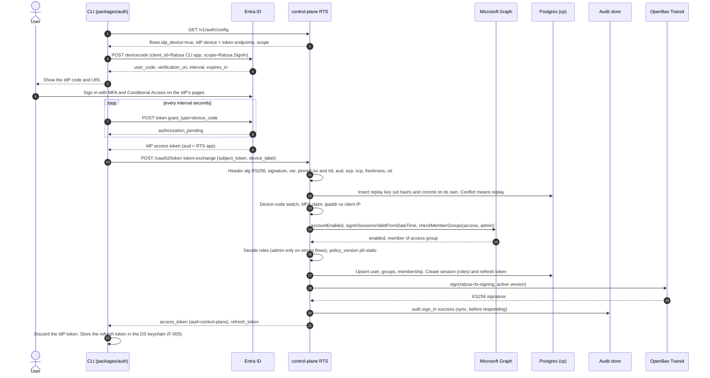
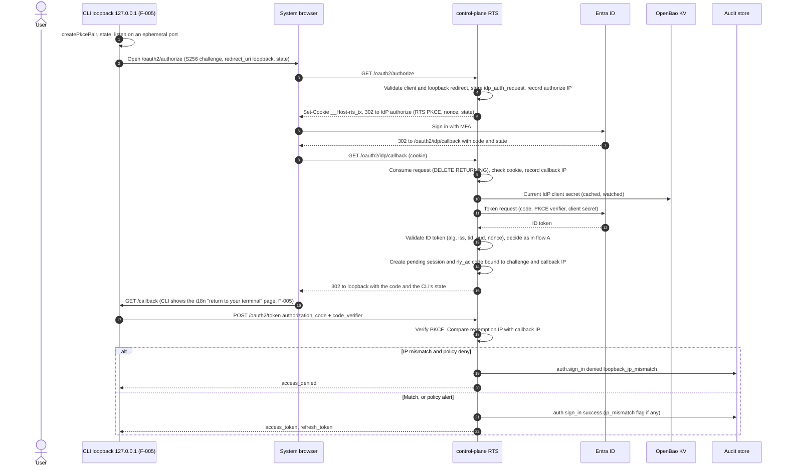
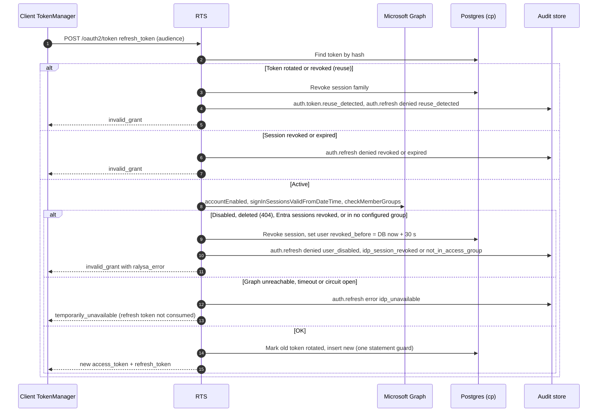
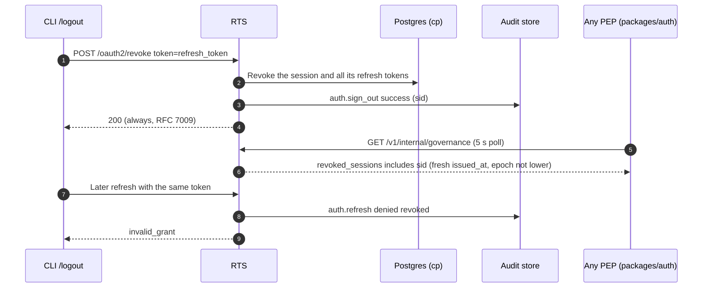
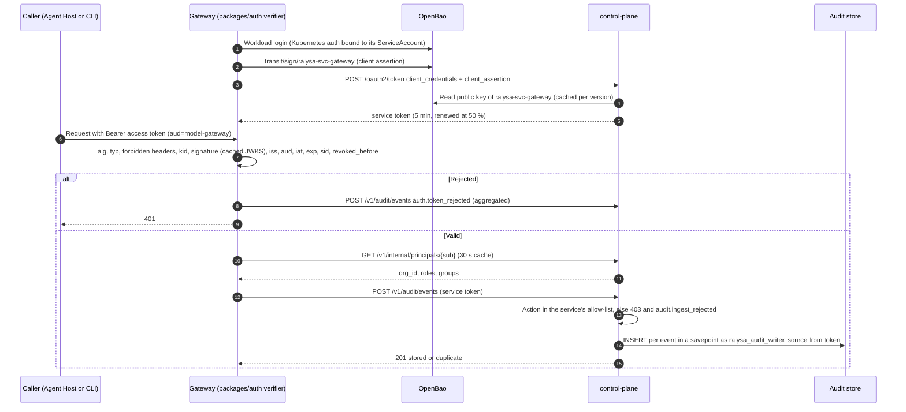
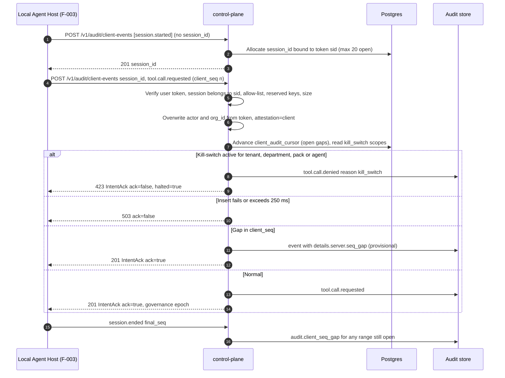
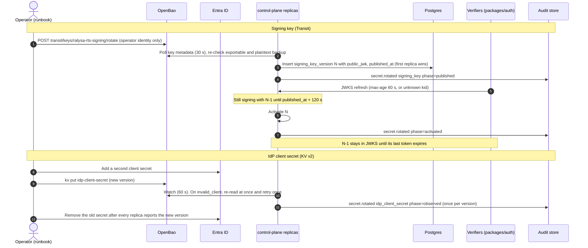

# F-002: SSO sign-in (OIDC) and control-plane skeleton: Solution Design

> Phase 4 · Owner: solution-designer · Brief: ./brief.md · ADRs: [ADR-0001](../../architecture/adr/0001-services-language-typescript.md), [ADR-0003](../../architecture/adr/0003-tenancy-and-isolation.md), [ADR-0010](../../architecture/adr/0010-ralysa-token-service-brokers-idp.md), [ADR-0011](../../architecture/adr/0011-policy-decision-model-and-pdp-placement.md), [ADR-0021](../../architecture/adr/0021-tamper-evident-audit-store.md), [ADR-0022](../../architecture/adr/0022-audit-write-path-fail-closed.md), [ADR-0025](../../architecture/adr/0025-kill-switch-enforcement.md) (ADR-0002 Cedar is not used in Phase 0; see §6.1) · Architecture: [identity-and-policy.md](../../architecture/identity-and-policy.md) §3, §4, §5.6, §9 · [observability-audit.md](../../architecture/observability-audit.md) §3, §4, §5 · [data-model.md](../../architecture/data-model.md) §4 · [security.md](../../architecture/security.md) TM-01/02/03/38/40/45/49, SR-06/07/08/26/29, P0-1 to P0-4 · Consistency review: BC-01 to BC-05, BC-13, CQ-02, CQ-04, CQ-06
> Status: **Draft for G4, revised after the architect review ("Architect review notes", RC-1 to RC-12) and the security review ([security.md](./security.md), SEC-F002-01 to -33).** Date: 2026-09-25. Branch `design/F-002`.
> REQs: REQ-016 (a)–(d), REQ-095 (a)(b) for control-plane components; supports REQ-001(a) (F-005), REQ-017(b)(c) defaults, REQ-071 (Phase 0 slice) and DV-12.

**How to read this.** §1 maps every acceptance criterion (as amended by the accepted brief changes) to a design element and a test. §3 holds the contracts, §4 the schema, §5 the flows, §6 governance and the threat-mapped control table, §8 the tests and the CI job, §10 the task list. Decisions are logged, and G3 escalations listed, in "Risks & open questions". Markers `[AR-n]` point to the architect review; `[SEC-F002-nn]` to the security review.

**Brief changes accepted at G4 under the standing authorization (CLAUDE.md, 2026-09-25).** BC-01, BC-02, BC-03, BC-04, BC-05 and BC-13 (consistency-review.md §4). The brief itself is not edited here; the product-manager updates it (OQ-D6). This design is built to the amended criteria in §1.1.

## Revision log

| Date | Rev | Change |
|---|---|---|
| 2026-09-25 | 1 | First draft (`fa27aaf`). |
| 2026-09-25 | 2 | **Architect review applied**: "Architect review notes" section (Part A) inserted; body edits [AR-1] to [AR-18] (RC-1 to RC-12); ADR-0021 and ADR-0025 clarified (wording only). AD-1 to AD-4 accepted with conditions. G3 escalations listed (ADR-0004 decision 4, proposed ADR-0030, ADR-0031). **Security review applied** ([security.md](./security.md), copied verbatim): all ten §5 required changes (SEC-F002-01 to -08, -11 to -15) plus Q1, Q2 and Q8 decided under the standing authorization: Transit-signed chain-head checkpoints and `audit-verify` brought into F-002 (new task T16); flow-B callback/redemption IP mismatch denied by default; switching device code off revokes flow-A sessions. Dedicated `ralysa_audit_owner` role and a break-glass audit-migration path; per-entry-point OpenBao policies and configs; per-service audit action allow-list; consume-first IdP-token replay key; GUID-only groups with Graph always authoritative; runtime custody monitoring; single `env` source with production guards; enforced mock-IdP exclusion; server-issued client-audit sessions. Low and Info findings (SEC-F002-09, -10, -16 to -33) added to task Definitions of Done. OQ-D1, -D2, -D3, -D4, -D5, -D7, -D8 decided. AC→design→test table and task list updated. |

---

## 1. Summary & scope

F-002 delivers the smallest control plane that makes identity real in Phase 0:

- **Ralysa Token Service (RTS)** inside `services/control-plane`: OIDC relying party toward Microsoft Entra ID, OAuth authorization server toward Ralysa clients (ADR-0010). CLI flow A (IdP-native device flow, then an RFC 8693 exchange at RTS) and flow B (`/login --browser`, loopback + PKCE through RTS, bound to the browser and to the redeeming host). Rotating refresh tokens with reuse detection, 15-minute single-audience ES256 access tokens, JWKS, revocation feed.
- **Identity mapping** by immutable Entra object ID, with issuer and tenant pinning; group membership for the configured groups always confirmed through Microsoft Graph (SR-06).
- **Users, groups and sessions** in Postgres with `org_id` and `FORCE ROW LEVEL SECURITY` from the first migration (ADR-0003).
- **Phase 0 audit store**: canonical envelope, service ingestion path with a per-service action allow-list, client-attested ingestion path with server-issued sessions, an insert-only writer role, a sealer hash chain from the first event, and **Transit-signed chain-head checkpoints every 60 s** with an `audit-verify` command (ADR-0021, ADR-0022, SR-29; WORM upload stays in F-011).
- **Secrets custody** in OpenBao: the IdP client secret in KV v2, token-signing and checkpoint keys as non-exportable Transit keys used through the sign API and monitored at runtime (SR-26, BC-13); one OpenBao policy per entry point.
- **`packages/auth`**: the token verifier every Ralysa service uses, plus the isomorphic client flows the CLI (F-005) wraps.
- **A local dev and test stack** (Postgres, OpenBao dev server, an Entra-shaped mock IdP that is mechanically kept out of shipped code) and the first `integration` CI job.

Not in F-002: SAML and other IdPs, Desktop and Web sign-in, RTS-hosted device flow (flow C), admin session revocation UI and configurable token lifetime (F-006, REQ-017); profiles and Cedar policy (F-006); kill-switch API (F-012; F-002 only reads its state); WORM upload of checkpoints, retention and purge (F-011); SIEM export (F-044); the CLI itself (F-005).

### 1.1 Acceptance criteria as amended at G4

Unchanged ACs keep their brief wording. The changed wording is in **bold**. AC-16 and AC-17 are new IDs introduced here for BC-03 and BC-05 (to be copied into the brief, OQ-D6).

| ID | Amended criterion (only the changes) | Source |
|---|---|---|
| AC-1 | … the group claims from the token. **Access and admin groups are configured and matched by immutable IdP object ID; issuer and tenant are pinned.** | BC-02 |
| AC-2 | **The client starts a device-authorization sign-in with the IdP and receives the IdP's user code, verification URL and polling interval. After MFA, the client exchanges the IdP result at the control plane (RFC 8693) for Ralysa tokens. Expired or reused codes are refused, and an IdP result can be exchanged only once. A tenant setting disables device code; the CLI then uses `/login --browser` (the AC-1 grant).** | BC-01 |
| AC-5 | … records `outcome=denied`. **If group overage can't be resolved, sign-in is refused and audited.** (Recorded as `outcome=error`, `reason_code=group_overage_unresolved`, because the cause is a dependency fault, per the outcome semantics in [AR-3].) | BC-02 |
| AC-9 | … never secret values. **Token-signing keys are non-exportable and used through a signing API; services verify through JWKS.** | BC-13 |
| AC-10 | Unchanged; rotation of the signing key means a new Transit key version (BC-13). | BC-13 |
| AC-11 | … optional **`endpoint_region`,** `inference_region`, `model`, … | BC-04 |
| AC-13 | … **`endpoint_region` and** `inference_region` are on AuditEvent and UsageRecord (DV-12, **SR-04**). | BC-04 |
| **AC-16** (new) | A second, client-attested endpoint accepts a user access token, only for local-host event types. It overwrites the actor and `org_id` from the token subject, marks events `attestation=client`, requires a monotonic `client_seq` per session and flags gaps, and refuses intents while a kill-switch applies. AC-11 stays as written for services. | BC-03 |
| **AC-17** (new) | The audit writer role has INSERT only; UPDATE and DELETE are rejected and audited. Each event is sealed into a hash chain within 5 s. Signed WORM checkpoints, verify and retention stay in F-011. (This design additionally brings Transit-signed chain-head checkpoints and a verify command forward, D-28; WORM upload and retention stay in F-011.) | BC-05, CQ-04 |

Proposed numbers confirmed at G4 (G2 condition), logged as D-12, D-16, D-17: access-token lifetime **15 min** (AC-6); new credentials in use **≤ 5 min** after rotation (AC-10; this design achieves ≤ 150 s); token validation **≤ 10 ms p95** added to a gateway request (NFR; design target ≤ 2 ms p95 with a warm cache).

### 1.2 AC → design → test

| AC | Satisfied by (design section) | Tested by |
|---|---|---|
| AC-1 | Flow B (§5.2): `GET /oauth2/authorize`, `GET /oauth2/idp/callback`, browser-binding cookie and IP binding, `completeSignIn()` (§3.3, §5.1), `app_user`, `idp_group`, `group_membership` (§4.4); SR-06 mapping (§6.3) | TC-F-002-01, -24, -30 |
| AC-2 | Flow A (§5.1): `/v1/auth/config`, `packages/auth` `startIdpDeviceSignIn()`, token-exchange grant with the consume-first replay key (§3.2.5), tenant switch and session revocation when it is turned off (§3.8) | TC-F-002-02, -03, -04 |
| AC-3 | No password or shared-secret user credential anywhere in the API (§3.1 rules, §3.3 grants refused); OpenAPI generated and scanned (§3.10); `check-no-password` over client code (T14) | TC-F-002-05, -06 |
| AC-4 | `auth.sign_in` on every path, exactly once per attempt (flow B writes it at code redemption), incl. client-reported IdP failures (`POST /v1/auth/sign-in-failures`), fail-closed on success (§5.8), envelope (§3.5) | TC-F-002-07 |
| AC-5 | Access decision in `identity-mapping.ts` (§6.1, §6.3); OAuth `access_denied` + `ralysa_error.i18n_key` (§3.9); no session, no user record | TC-F-002-08 |
| AC-6 | IdP refuses disabled users; Graph `accountEnabled`, `signInSessionsValidFromDateTime` and deleted-user checks at sign-in and every refresh (§5.3, §6.3); `revoked_before` in the governance feed (§3.2.6); 15-min access tokens | TC-F-002-09 |
| AC-7 | `packages/auth` `createAccessTokenVerifier()` + `PrincipalResolver` (§3.6), `auth.token_rejected` with aggregation (§6.4) | TC-F-002-10, -11, -12 |
| AC-8 | `POST /oauth2/revoke` revokes the session family; later refresh refused and audited (§5.4) | TC-F-002-13 |
| AC-9 | OpenBao KV + Transit (§6.5) with runtime custody monitor and deny paths, per-entry-point policies and configs (§3.8, §6.5), production guards (§3.8), `credential.vault_path` only (§4.4), log scrubbing (§6.6), scans of DB, logs, config and image (T14) | TC-F-002-14, -33, -34, -36 |
| AC-10 | Publish-then-activate key rotation (§3.2.4, §5.7), KV watcher + `invalid_client` retry for the IdP secret (§5.7) | TC-F-002-15 (CI, compressed), TC-F-002-16 (10-min soak) |
| AC-11 | `POST /v1/audit/events` (service path, §3.4.4) with the per-service action allow-list, service identity via vault-signed client assertion (§3.2.7), insert-only store (§4.5), no update/delete route | TC-F-002-17, -26, -37 |
| AC-12 | `GET /v1/audit/events` with the session-bound `platform_admin` role (strong flows only); `audit.query` written before results (§3.4.6, §6.1) | TC-F-002-18, -31 |
| AC-13 | cp migrations 0001–0004 and audit migration 0001 (§4.3, §4.4) | TC-F-002-19 |
| AC-14 | Request logging off, custom serializers, pino redaction + scrubber, user ids only (§6.6) | TC-F-002-20 |
| AC-15 | UTF-8 database check, no normalisation, Arabic mock users and groups (§4.2, §8.3) | TC-F-002-21 |
| AC-16 | `POST /v1/audit/client-events` (§3.4.5, §5.6): server-issued `session_id`, `client_seq` gaps and `final_seq` reconciliation, reserved `details` namespace, kill-switch scopes; `client_audit_cursor` (§4.4) | TC-F-002-22 |
| AC-17 | Roles and column grants incl. `ralysa_audit_owner` (§4.1), `audit.reject_modify()` triggers on events, seals and checkpoints (§4.5), sealer (§4.6), Transit-signed checkpoints and `audit-verify` (§4.7) | TC-F-002-23, -29 |

---

## 2. Components touched

| Path | New / changed | Responsibility |
|---|---|---|
| `services/control-plane` | changed: placeholder → `pnpm scaffold services/control-plane --kind service` | RTS, directory, audit ingest and query, sealer and checkpoints, audit verify, migrations, governance feed. Fastify 5 (D-10). Five entry points, each with its own config and OpenBao role (§3.8). |
| `packages/protocol` | changed: placeholder → `pnpm scaffold packages/protocol --kind library-isomorphic` (whichever of F-002/F-003 lands first scaffolds it) | Subpath exports `./common`, `./audit`, `./auth`, `./control-plane` (F-002) and `./agent` (F-003) [AR-18]. Zod contracts: audit envelope and event catalogue, token claims, control-plane REST types, error and i18n keys, JCS hashing, `traceparent`. The single JSON Schema generator (F-003 registers its schemas in it); generated schema committed (`check:generated`). |
| `packages/auth` | changed: placeholder → `--kind library-isomorphic` | Token verifier, principal resolver, revocation feed, JWKS cache, service-token source; isomorphic client flows (IdP device flow, exchange, loopback-PKCE helpers, refresh single-flight, revoke). No Node built-ins; the loopback listener and OS keychain store live in `apps/cli` (F-005). |
| `packages/secrets` | **new** (`--kind library-isomorphic`) | `SecretStore` and `KeyCustody` ports, OpenBao KV v2 and Transit adapters over `fetch`, OpenBao auth (Kubernetes, AppRole, dev token), in-memory test doubles. Used by control-plane now and model-gateway (F-004) next. |
| `tooling/dev-stack` | **new** (hand-made from the service template, `ralysa.kind: "tooling"`, `shipped: false`) | Entra-shaped mock IdP (on `oidc-provider`), Graph stub, dev `.env` generator, database and OpenBao bootstrap, integration-test harness helpers. Never shipped; exclusion enforced by dependency-cruiser, `check-banned-deps` (production closure) and the image scan [SEC-F002-13, AR-12]. |
| `deploy/docker/dev/compose.yaml` | new | Postgres, OpenBao dev server, mock IdP (profile `idp`). Used by developers and by the CI `integration` job. |
| `deploy/docker/control-plane.Dockerfile`, `.dockerignore` | new | Phase 0 image for the AC-9 image scan and local runs (multi-stage, `pnpm deploy --prod`, non-root). Packaging proper is ADR-0027 / F-023. |
| `.github/workflows/ci.yml` | changed | New `integration` job (§8.5). |
| `.github/workflows/soak.yml` | new | `workflow_dispatch` only: the 10-minute AC-10 soak (TC-F-002-16). |
| `.github/required-checks.json` | changed | Adds `integration`. |
| `tooling/repo-scripts/src/check-ci-invariants.ts` | changed | New rules: `ci/pre-install-gate-first` (every job that runs `pnpm`, `corepack`, `npx`, `turbo`, or `actions/setup-node` with `cache: pnpm` runs the pre-install gate first) [SEC-F002-28]; `ci/integration-no-secrets` (the `integration` job references no `secrets.*`, has `permissions: contents: read` and `persist-credentials: false`) [SEC-F002-27]. |
| `tooling/repo-scripts/src/check-no-password.ts` | new | AC-3: no password prompts or password-type inputs in client source, no password-like fields in committed OpenAPI documents. |
| `tooling/repo-scripts/src/check-migrations-immutable.ts` | new | Fails if a migration recorded in `migrations.lock.json` on `main` changes [AR-10]. |
| `tooling/eslint-config/boundaries.js`, `.dependency-cruiser.cjs`, `tooling/repo-scripts/src/check-banned-deps.ts` | changed | Ban `@ralysa/dev-stack` and `oidc-provider` outside `test/**`; new production-closure mode so they can never be in a `shipped: true` workspace's production dependencies [SEC-F002-13, AR-12]. |
| `.gitleaks.toml`, `.gitleaks.artefacts.toml` | changed | Rules for Ralysa's own token formats (`rly_rt_`, `rly_ac_`), promised by F-001 design §6.2.2. |
| `pnpm-workspace.yaml` | changed | Catalog entries for the new shared runtime dependencies (§2.2). |
| `docs/engineering/repo-conventions.md` | changed | `integration` job, dev stack, ports. |
| `services/control-plane/README.md` | changed | Operator notes: config per entry point, Entra app-registration checklist (§6.7), rotation and break-glass runbooks. |
| `docs/architecture/adr/0021-tamper-evident-audit-store.md`, `0025-kill-switch-enforcement.md` | changed (wording only) | "Clarified 2026-09-25 (F-002 design review)" notes from the architect review Part C. No decision change. |

### 2.1 Module layout

```
services/control-plane/
  package.json            scripts: build, lint, typecheck, test, test:integration, test:soak,
                          check:generated (OpenAPI), start, start:sealer, migrate, migrate:audit, audit-verify
  vitest.config.ts        hermetic unit tests (the F-001 node preset)
  vitest.integration.config.ts   test/integration/**/*.int.ts, globalSetup = dev-stack harness
  openapi/control-plane.v1.json  generated, committed
  migrations.lock.json    SHA-256 of every released migration file [AR-10]
  src/
    main.ts               entry points: `serve` | `sealer` | `migrate` | `migrate --audit` |
                          `audit-verify` | `bootstrap-org`; each loads only its own config schema
                          and authenticates to OpenBao as its own role [SEC-F002-02]
    app.ts                buildApp(deps): Fastify instance without listen (tests inject deps)
    config/schema.ts      zod config schemas per entry point: vault paths and IDs only, never secret values
    config/guards.ts      production guard list [SEC-F002-12]
    config/load.ts        YAML file (RALYSA_CONFIG) + env overrides, validated at start
    http/
      zod-validation.ts   Fastify validator/serializer compilers backed by zod safeParse
      errors.ts           OAuth errors (RFC 6749 §5.2) and problem+json (RFC 9457) for /v1
      request-context.ts  traceparent, client IP (trustProxy CIDRs), org resolution (§4.1 rule)
      logging.ts          pino options, custom serializers, redaction paths, scrubber (§6.6)
      rate-limits.ts      per-IP and global limits on unauthenticated routes [SEC-F002-16]
      openapi.ts          builds the OpenAPI 3.1 document from the protocol zod schemas
    auth/                 Ralysa Token Service
      routes/discovery.ts     /.well-known/oauth-authorization-server, /.well-known/jwks.json, /v1/auth/config
      routes/authorize.ts     GET /oauth2/authorize (flow B leg 1; browser-binding cookie)
      routes/idp-callback.ts  GET /oauth2/idp/callback (flow B leg 2)
      routes/token.ts         POST /oauth2/token (grant dispatch)
      routes/revoke.ts        POST /oauth2/revoke (sign-out)
      routes/sign-in-failures.ts  POST /v1/auth/sign-in-failures
      grants/authorization-code.ts, grants/refresh-token.ts,
      grants/token-exchange.ts, grants/client-credentials.ts
      idp/entra-token-validator.ts   IdP access/ID token validation, pinned alg/ver/iss/tid/aud/azp
      idp/oidc-client.ts             openid-client wrapper for flow B
      idp/directory.ts               IdpDirectory port
      idp/graph-directory.ts         Microsoft Graph implementation (timeouts, circuit breaker)
      identity-mapping.ts   SR-06 + ADR-0011 shapes: principal/action/resource/context → decision [AR-4]
      sign-in.ts            completeSignIn(): upsert, decide, session, audit (fail closed)
      sessions.ts           session + refresh-token family, rotation, reuse detection, revoke
      tokens/mint.ts        JWT assembly, signing through KeyCustody
      tokens/signing-keys.ts  key watcher, publish-then-activate, custody monitor, JWKS from DB
      clients.ts            static client registry (ralysa-cli, service clients + audit action allow-lists)
      governance-feed.ts    GET /v1/internal/governance
      device-code-switch.ts revokes flow-A sessions when device code is turned off [SEC-F002-32, D-30]
    directory/
      routes/me.ts          GET /v1/me
      routes/principals.ts  GET /v1/internal/principals/:userId
    audit/
      writer.ts             AuditWriter: writer pool, fail-closed insert, disk spool for denials
      spool.ts
      rejections.ts         auth.token_rejected aggregation
      action-allowlist.ts   per-service allow-list and reserved namespaces [SEC-F002-03]
      routes/service-events.ts   POST /v1/audit/events
      routes/client-events.ts    POST /v1/audit/client-events
      routes/query.ts            GET /v1/audit/events
      sealer/sealer.ts      transaction-scoped advisory lock per (org, shard)
      sealer/chain.ts       rowToEnvelope(), event hash, chain hash, verifyChain()
      sealer/checkpoint.ts  60 s Transit-signed chain heads [SEC-F002-01, D-28]
      verify/audit-verify.ts  `audit-verify` command: chain + checkpoint signatures + cadence
    secrets/runtime.ts      IdP client-secret watcher, DB credential loading per entry point
    governance/kill-switch.ts  read-only port (F-012 writes)
    org/bootstrap.ts        the one Organization (ADR-0003)
    db/
      pools.ts              one pg Pool per DB role available to the entry point (§4.1)
      kysely.ts             Kysely instances, withOrg(orgId, fn)
      types.ts              Kysely Database interface
      migrate.ts            Kysely Migrator with static providers; two sets: cp and audit
      migrations/cp/index.ts      static imports (no dynamic import; SEC-F001-09 b)
      migrations/cp/0001_schemas_and_rls_helpers.ts
      migrations/cp/0002_cp_identity.ts
      migrations/cp/0003_cp_sessions_and_tokens.ts
      migrations/cp/0004_usage_credential_governance.ts
      migrations/audit/index.ts
      migrations/audit/0001_audit_store.ts   events, seals, checkpoints, triggers, grants
      sql/bootstrap-roles.sql  run once per cluster by the DBA (dev-stack runs it locally):
                               roles, UTF-8 check, DDL event trigger on the audit schema
  test/                   unit tests (*.test.ts), hermetic
  test/integration/       *.int.ts, against the dev stack
  test/soak/rotation.soak.ts

packages/protocol/src/
  index.ts
  common/   ids.ts (TraceId, SpanId, Sha256Hex, Region), errors.ts (audit_unavailable, …), trace.ts
  audit/    envelope.ts  actions.ts  client-allowlist.ts  reserved.ts  jcs.ts  version.ts
  auth/     claims.ts  oauth.ts  errors.ts  version.ts
  control-plane/  auth-config.ts  me.ts  principals.ts  governance.ts  audit-api.ts  sign-in-failures.ts
  schema/   generator.ts (the one zod → JSON Schema generator) and generated *.json

packages/auth/src/
  index.ts
  verify/access-token-verifier.ts  verify/jwks.ts  verify/revocation-feed.ts
  verify/principal-resolver.ts     verify/rejections.ts
  client/config.ts  client/idp-device.ts  client/exchange.ts  client/pkce.ts
  client/authorization-code.ts  client/token-manager.ts  client/revoke.ts  client/errors.ts
  service/service-token-source.ts  service/client-assertion.ts

packages/secrets/src/
  index.ts  ports.ts
  openbao/http.ts  openbao/auth.ts  openbao/kv2.ts  openbao/transit.ts
  memory/in-memory-secret-store.ts  memory/in-memory-key-custody.ts

tooling/dev-stack/src/
  cli.ts              `env` (dependency-free .env generator), `bootstrap`, `mock-idp`
  env.ts  bootstrap-db.ts  bootstrap-vault.ts
  mock-idp/server.ts  mock-idp/entra-claims.ts  mock-idp/graph.ts  mock-idp/test-control.ts
  mock-idp/fixtures.ts  (users and groups, incl. Arabic, disabled, deleted, overage, renamed-group)
  harness/            global setup, per-worker database and vault prefixes, log capture
```

### 2.2 New runtime dependencies

Versions are resolved when the task that adds them lands, must be at least 3 days old (`minimumReleaseAge`), and go into the `catalog:` when more than one workspace uses them. None may need a dependency build script (`strictDepBuilds`); a task that finds one stops and asks for review (`allow-builds.json`).

| Package | Used by | Why | Reference |
|---|---|---|---|
| `fastify`, `@fastify/formbody`, `@fastify/rate-limit`, `@fastify/cookie` | control-plane | HTTP server (D-10); `application/x-www-form-urlencoded` for the OAuth endpoints; rate limits; the flow-B browser-binding cookie | [Fastify docs](https://fastify.dev/docs/latest/), [Validation and Serialization](https://fastify.dev/docs/latest/Reference/Validation-and-Serialization/) |
| `kysely`, `pg` | control-plane | Query builder and migrator (D-8); node-postgres driver | [Kysely migrations](https://kysely.dev/docs/migrations), [node-postgres](https://node-postgres.com/) |
| `jose` | auth, control-plane | JWT/JWS verification, JWK import/export, remote JWKS with cache and cooldown | [jose](https://github.com/panva/jose), [`createRemoteJWKSet`](https://github.com/panva/jose/blob/main/docs/jwks/remote/functions/createRemoteJWKSet.md) |
| `openid-client` | control-plane | OIDC RP for flow B (discovery, code + PKCE, ID-token validation) | [openid-client](https://github.com/panva/openid-client) |
| `canonicalize` | protocol | RFC 8785 JSON canonicalisation for audit hashing | [RFC 8785](https://www.rfc-editor.org/rfc/rfc8785), [canonicalize](https://github.com/erdtman/canonicalize) |
| `uuid` | protocol, control-plane | UUIDv7 identifiers (data-model §1 principle 5) | [RFC 9562](https://www.rfc-editor.org/rfc/rfc9562) |
| `zod` | protocol, auth, control-plane | Already in the catalog (4.6.5) | [Zod JSON Schema](https://zod.dev/json-schema) |
| `oidc-provider` (devDependency of `tooling/dev-stack` only) | dev-stack | Mock IdP: device flow, PKCE, JWT access tokens, custom claims | [node-oidc-provider](https://github.com/panva/node-oidc-provider) |

All links accessed 2026-09-25.

---

## 3. Contracts

### 3.1 Endpoint catalogue

All routes are served by `services/control-plane` (`serve` entry point). Every `/v1` route is described by the generated OpenAPI 3.1 document (`openapi/control-plane.v1.json`). The OAuth endpoints are described by RFC 8414 metadata and by the same OpenAPI document.

| Method and path | Caller authentication | Purpose | ACs |
|---|---|---|---|
| `GET /.well-known/oauth-authorization-server` | none | RFC 8414 metadata: issuer, endpoints, `grant_types_supported`, `code_challenge_methods_supported: ["S256"]`, `token_endpoint_auth_methods_supported: ["none","private_key_jwt"]` | AC-3, AC-7 |
| `GET /.well-known/jwks.json` | none | Published verification keys from `signing_key_version` rows (`Cache-Control: public, max-age=60, must-revalidate`) [SEC-F002-33] | AC-7, AC-10 |
| `GET /v1/auth/config` | none | Which CLI flows are enabled, the IdP device and token endpoints, CLI client id and scope | AC-2 |
| `GET /oauth2/authorize` | none (browser) | Flow B leg 1; sets the browser-binding cookie; redirects to the IdP | AC-1 |
| `GET /oauth2/idp/callback` | `state` bound to a stored request + browser-binding cookie | Flow B leg 2; redirects to the CLI loopback | AC-1, AC-5 |
| `POST /oauth2/token` | public client id (`ralysa-cli`) or `private_key_jwt` (services) | Grants: `authorization_code`, `refresh_token`, token exchange, `client_credentials` | AC-1, AC-2, AC-6, AC-8, AC-10, AC-11 |
| `POST /oauth2/revoke` | public client id | RFC 7009 revocation = sign-out | AC-8 |
| `POST /v1/auth/sign-in-failures` | none; rate-limited per IP and per org; idempotent per `attempt_id` | Client-reported IdP-side failures in flow A | AC-4 |
| `GET /v1/me` | user access token, `aud=control-plane` | The signed-in user, session roles and groups | AC-1, AC-15 |
| `GET /v1/internal/principals/{user_id}` | service token | Groups, roles and status for a user (AC-7's "yields groups") | AC-7 |
| `GET /v1/internal/governance` | service token | Revocations, kill-switch state, epoch (G-1 heartbeat, poll) | AC-6, AC-8 |
| `POST /v1/audit/events` | service token | Service ingestion path (per-service action allow-list) | AC-11 |
| `POST /v1/audit/client-events` | user access token, `aud=control-plane` | Client-attested ingestion path | AC-16 |
| `GET /v1/audit/events` | user access token + session role `platform_admin` | Audit query | AC-12 |
| `GET /healthz`, `GET /readyz` | none | Liveness; readiness requires DB, OpenBao, an active signing key and no custody violation | ops |

Rules that hold for every route (AC-3):

- No route accepts a password, PIN, OTP or any other user-held shared secret. The token endpoint refuses `grant_type=password` and every grant not listed above with `unsupported_grant_type`.
- User clients are **public** clients: the token endpoint never accepts `client_secret` for them. Services authenticate with `private_key_jwt` only (RFC 7523 §2.2). There is no `client_secret_*` method at RTS.
- No PUT, PATCH or DELETE exists under `/v1/audit` (AC-11).
- Every `/v1` response carries `traceparent` back; every error body is `application/problem+json` with a stable `type` URI and, for user-facing errors, an `i18n_key` (§3.9).
- Every unauthenticated route (`/oauth2/*`, `/v1/auth/*`, `/.well-known/*`) has a per-IP **and a global** rate limit; throttled requests (`429`) are not sign-in attempts for AC-4 [SEC-F002-16].

### 3.2 Token model

#### 3.2.1 Token types and lifetimes

| Token | Format | Issuer → holder | Audience | Lifetime | Storage | Notes |
|---|---|---|---|---|---|---|
| Entra access token (flow A) | JWT (Entra v2, RS256) | Entra → CLI memory → RTS once | RTS app registration | Entra default | Never stored; replay key hash only | Burned on first presentation (§3.2.5). Gateways never accept it. |
| Entra ID token (flow B) | JWT | Entra → RTS | RTS app | Entra default | Discarded after validation | |
| Ralysa authorization code (flow B) | opaque `rly_ac_` + 43 base64url chars (32 random bytes) | RTS → CLI loopback | RTS | **60 s**, single use | SHA-256 hash; tombstone kept after use until expiry + 1 h [SEC-F002-20] | Bound to `client_id`, `redirect_uri`, `code_challenge`, callback IP |
| **Ralysa refresh token** | opaque `rly_rt_` + 43 base64url chars | RTS → CLI (OS keychain in F-005) | RTS | **12 h idle, 7 d absolute** (CQ-09 default, D-18) | SHA-256 hash only | Rotated on every use; reuse revokes the family (§3.2.3) |
| **Ralysa access token** | JWT, `typ: at+jwt`, ES256 | RTS → client memory | exactly one of `control-plane`, `agent-host`, `model-gateway`, `mcp-gateway`, `workspace-runtime` | **15 min** (D-12) | Not stored | RFC 9068 profile |
| Service access token | JWT, `typ: at+jwt`, ES256, `token_use: service` | RTS → service memory | `control-plane` | **5 min** | Not stored | Obtained with a vault-signed client assertion (§3.2.7) |
| Service client assertion | JWT, ES256 | Service (signed through its own Transit key) → RTS | RTS token endpoint URL | ≤ 60 s, single use (`jti`) | `jti` hash for 120 s | RFC 7523 |

The `rly_rt_` and `rly_ac_` prefixes exist so gitleaks can find them (T14) and so the log scrubber can recognise them (§6.6).

#### 3.2.2 Access-token claims (`packages/protocol/src/auth/claims.ts`)

Follows identity-and-policy §4.2. Groups are **not** in the token (§4.2 there); services resolve them through `PrincipalResolver` (§3.6). `pol_ver` and `ent_ver` are optional until F-006 and F-013.

```ts
import { z } from 'zod';

export const Audience = z.enum([
  'control-plane', 'agent-host', 'model-gateway', 'mcp-gateway', 'workspace-runtime',
]);
export const Surface = z.enum(['cli', 'desktop', 'web', 'automation']);

/** JOSE header every Ralysa access token must carry. The verifier additionally rejects
 *  any `jku`, `jwk`, `x5u`, `x5c` or `crit` member [SEC-F002-19]. The `kid` pattern is
 *  built from config `vault.signing_key`: `^<signing_key>\.v[1-9][0-9]*$`. */
export const AccessTokenHeader = z.looseObject({
  alg: z.literal('ES256'),
  typ: z.literal('at+jwt'),
  kid: z.string().max(80),
});

/** Loose: verifiers ignore unknown claims (forward compatibility), but never unknown header algs. */
export const UserAccessTokenClaims = z.looseObject({
  iss: z.url(),                      // exactly config.public_base_url
  aud: Audience,                     // a single string, never an array
  sub: z.uuid(),                     // Ralysa user id (UUIDv7)
  client_id: z.string(),             // RFC 9068
  tid: z.uuid(),                     // Ralysa org id (identity §4.2 name; = envelope org_id)
  sid: z.uuid(),                     // auth session (refresh-token family)
  idp_sub: z.string().max(128),      // Entra object id (oid)
  surface: Surface,
  amr: z.array(z.string()).optional(),
  auth_time: z.int(),
  region: z.string(),                // Organization.region
  token_use: z.literal('access'),
  pol_ver: z.string().optional(),    // F-006
  ent_ver: z.int().optional(),       // F-013
  act: z.looseObject({ sub: z.string() }).optional(), // RFC 8693 delegation (server host, later)
  iat: z.int(), nbf: z.int(), exp: z.int(), jti: z.uuid(),
});

export const ServiceAccessTokenClaims = z.looseObject({
  iss: z.url(), aud: z.literal('control-plane'),
  sub: z.string().regex(/^svc:[a-z][a-z0-9-]{1,40}$/), client_id: z.string(),
  tid: z.uuid(), token_use: z.literal('service'),
  iat: z.int(), nbf: z.int(), exp: z.int(), jti: z.uuid(),
});
```

The verifier rejects, with a reason code (`TokenRejectReason`): `malformed`, `wrong_alg` (anything but ES256, including `none` and `HS256`), `wrong_typ`, `forbidden_header` (`jku`/`jwk`/`x5u`/`x5c`/`crit`), `unknown_kid`, `bad_signature`, `unknown_issuer`, `wrong_audience` (includes array audiences), `expired`, `not_yet_valid` (30 s skew), `issued_in_future` (`iat > now + skew`) [SEC-F002-18], `wrong_token_use`, `session_revoked`, `user_revoked`, `governance_stale`.

#### 3.2.3 Sessions, rotation and reuse detection

- One **auth session** (`sid`) per sign-in. It is the refresh-token family. It carries the flow (`idp_device` or `loopback_pkce`) and the **session roles** decided at sign-in (§6.1).
- Each refresh returns a new refresh token and marks the presented one `rotated` (single SQL statement with `WHERE status = 'active'`, so two concurrent refreshes can't both succeed).
- Presenting a `rotated` or `revoked` token is **reuse**: RTS revokes the whole session (`auth_session.revoked_at`, reason `reuse_detected`), writes `auth.token.reuse_detected` and `auth.refresh outcome=denied reason_code=reuse_detected`, and answers `invalid_grant` (RFC 9700 §4.14.2). No grace window (D-27). Exactly **one process per device refreshes**: the CLI (or Desktop main process) owns refresh and hands access tokens to the local Agent Host through the `TokenProvider` over IPC (identity-and-policy §4.3). This is a contract on F-003 and F-005; a second refresher on the same device is a defect that surfaces as reuse [SEC-F002-17].
- Idle expiry: each refresh token expires 12 h after issue; absolute expiry 7 d after session creation (`auth_session.absolute_expires_at`).
- Every refresh re-checks the user at the IdP (Graph `accountEnabled`, `signInSessionsValidFromDateTime` and `checkMemberGroups` for the configured groups, §5.3, §6.3). A disabled or deleted user, a user whose Entra sessions were revoked after this session began, or a user in no configured group is refused and the session revoked (AC-6, REQ-017c ≤ 15 min).
- Refresh accepts an `audience` parameter (Ralysa extension; RFC 8693 names it for token exchange). Default `control-plane`. `model-gateway`, `agent-host`, `mcp-gateway` and `workspace-runtime` are minted only for sessions with the `user` role (§6.1).

#### 3.2.4 Signing keys and JWKS (BC-13, SR-26)

- The signing key is an OpenBao Transit key `ralysa-rts-signing`, type `ecdsa-p256`, created with `exportable=false` and `allow_plaintext_backup=false`. The private key never leaves OpenBao; RTS signs through `POST /v1/transit/sign/ralysa-rts-signing/sha2-256` with an explicit `key_version` and `marshaling_algorithm=jws` (raw `r‖s` as JWS ES256 requires) ([OpenBao Transit API](https://openbao.org/api-docs/secret/transit/); the same API as [Vault Transit](https://developer.hashicorp.com/vault/api-docs/secret/transit)). T04 verifies the returned encoding against `jose.compactVerify` before anything else is built on it.
- `kid` = `ralysa-rts-signing.v<version>`. Public keys come from `GET /v1/transit/keys/ralysa-rts-signing` (PEM per version), converted to JWK with `jose`, and stored in `signing_key_version.public_jwk`. **JWKS is served from those rows**, so every replica publishes a key as soon as its row exists; activation is computed from the database clock [SEC-F002-33].
- **Publish-then-activate.** The key watcher polls the key metadata every 30 s. When it sees a new version it inserts `signing_key_version(kid, public_jwk, published_at=now())` (first replica wins), which adds the key to JWKS at once, but keeps signing with the previous version until `published_at + activation_delay` (120 s). Verifiers cache JWKS for at most 60 s and refetch on an unknown `kid` (jose cooldown 5 s), so every verifier has the new key before the first token signed with it exists (worst case 30 + 60 + 5 = 95 s < 120 s). New key in use ≤ 30 s + 120 s = **150 s** (AC-10 target ≤ 5 min).
- A superseded version stays in JWKS until `activated_at(next) + max access TTL + 5 min`, so tokens signed with it validate until they expire (AC-10).
- **Custody monitor** [SEC-F002-11]. On every 30 s poll the watcher re-reads `exportable` and `allow_plaintext_backup` for `ralysa-rts-signing` (and the sealer does the same for `ralysa-audit-checkpoint`). If either is `true`, the process stops signing, `/readyz` goes unready, and it writes `secret.custody_violation` (outcome `error`) and raises an alert. `KeyCustody.describe()` rejects either flag at startup as well.
- Emergency pin: `tokens.signing_key_pin_version` in config forces a known-good version (rollback, §9).
- Transit sign is one network call per minted token. Minting is not on any gateway hot path; verification is local.

#### 3.2.5 Token exchange (flow A, RFC 8693)

Request (`application/x-www-form-urlencoded`):

```ts
export const TokenExchangeRequest = z.strictObject({
  grant_type: z.literal('urn:ietf:params:oauth:grant-type:token-exchange'),
  client_id: z.literal('ralysa-cli'),
  subject_token: z.string().min(1).max(8192),
  subject_token_type: z.literal('urn:ietf:params:oauth:token-type:access_token'),
  audience: Audience.optional(),               // default control-plane
  device_label: z.string().max(64).optional(), // untrusted: control, bidi and zero-width chars stripped
});
```

RTS validates the Entra access token in this order. Steps 1–3 are local and cheap. **Step 4 burns the token** in its own committed transaction before anything that can fail for another reason, so every exchange attempt, whatever its outcome, consumes the IdP token and the user restarts the device flow [SEC-F002-07].

| # | Check | Rule | Failure (`auth.sign_in`) |
|---|---|---|---|
| 1 | Header | `alg=RS256`, `typ=JWT`; any other header value is refused [SEC-F002-07, -19] | `failure`, `invalid_idp_token` |
| 2 | Signature | Entra JWKS from the pinned tenant's discovery document [AR-12] | `failure`, `invalid_idp_token` |
| 3 | Claims | `ver="2.0"`; `iss` exactly `https://login.microsoftonline.com/<tenant_id>/v2.0` (the RTS app registration uses `requestedAccessTokenVersion: 2`) and never RTS's own issuer; `tid` exactly the configured tenant; `aud` = the RTS app registration client id; `azp` in `idp.allowed_public_client_ids`; `scp` contains `Ralysa.SignIn`; `exp`/`nbf` with 60 s skew; `iat` no older than 10 min; `uti` present | `failure`: `untrusted_issuer` (iss/tid), `expired` (time), else `invalid_idp_token` |
| 4 | Replay (consume first) | `INSERT` of the `uti` hash into `idp_token_replay`, **committed on its own**; a conflict means the token was already presented | `failure`, `replay` |
| 5 | Tenant switch | `access.device_code_enabled = true`, else the grant is unavailable | `denied`, `device_code_disabled` |
| 6 | MFA evidence | When `idp.require_mfa_claim` (default `true` in production, §3.8): `amr` contains `mfa` or `acrs` is non-empty | `failure`, `mfa_claim_missing` |
| 7 | IdP state and groups | Graph (§6.3) | `denied`/`error` per §3.5 |

Freshness uses `iat ≤ 10 min` instead of ADR-0010's `auth_time`, which Entra v2 access tokens don't carry (documented interpretation AD-5). Claim semantics are from the Entra [access token claims reference](https://learn.microsoft.com/en-us/entra/identity-platform/access-token-claims-reference): `oid` is the immutable object id used as `idp_subject` (D-21; `sub` is pairwise per application and is not used), `tid` is the tenant. The RTS app registration also requests the `ipaddr` optional claim; RTS records `details.idp_ipaddr` next to the exchange `client_ip` and sets `details.ip_mismatch` when they differ. A mismatch raises an alert (metric `auth_device_ip_mismatch_total` and a log-based alert rule) but does not deny, because whether `ipaddr` reflects the approving browser in the device flow is still to verify (Q4, TC-F-002-28) [SEC-F002-05]. Then `completeSignIn()` (§5.1). Response (RFC 8693 §2.2.1): `access_token`, `issued_token_type: urn:ietf:params:oauth:token-type:access_token`, `token_type: Bearer`, `expires_in`, `refresh_token`.

When device code is disabled, the exchange grant is off **server-side**, because flow B never uses it; a modified CLI that runs Entra's device flow anyway gets `unauthorized_client` and a `denied` audit event. **Turning the switch off also revokes every live session with `flow=idp_device`** (`auth.session.revoked`, `cause=device_code_disabled`), detected at start and on config reload (D-30) [SEC-F002-32]. The authoritative block is the tenant's Conditional Access policy (CQ-02).

#### 3.2.6 Revocation (≤ 60 s) and the governance feed

- Sign-out, reuse detection, a disabled or deleted user, an Entra session revocation and the device-code switch write `auth_session.revoked_at` or `app_user.revoked_before`. `revoked_before` is taken from the database clock plus 30 s (the verifier skew), so replica clock drift can't let a token issued just before revocation survive [SEC-F002-18].
- `GET /v1/internal/governance?since=<cursor>` returns what every PEP needs (§3.4.3). `packages/auth` `RevocationFeed` polls it every 5 s.
- A poll counts as **confirmation** only if the response is authenticated, its `issued_at` is within 30 s of the PEP clock, and its `epoch` is not lower than the last one seen; a cached or replayed response can't keep a PEP "fresh" [SEC-F002-18].
- The verifier rejects a token whose `sid` is revoked or whose `iat` < the user's `revoked_before`.
- If the feed hasn't been confirmed for more than 60 s, the verifier rejects every token with `governance_stale` (identity-and-policy §5.6 G-1).
- The control plane's own user routes (`/v1/me`, audit query, client events) use the same verifier but read revocation state directly from the database, not through the feed [SEC-F002-18].
- Phase 0 is poll-only; the Redis pub/sub push arrives with F-012 (AD-2 accepted; ADR-0025 clarified 2026-09-25). Poll-only meets ≤ 60 s revocation and ≤ 30 s kill-switch (5 s poll). The control plane evaluates G-1 against its own database and serves the feed with no cache longer than 1 s. [AR-2]

#### 3.2.7 Service identity (AC-11, SR-07)

Each Ralysa service has its own Transit key `ralysa-svc-<name>` and an OpenBao policy that allows only `transit/sign/ralysa-svc-<name>`. The service proves its workload identity to OpenBao (Kubernetes auth with its projected ServiceAccount token in a cluster, AppRole in dev), signs an RFC 7523 client assertion through Transit, and exchanges it at `POST /oauth2/token` (`grant_type=client_credentials`, `client_assertion_type=urn:ietf:params:oauth:client-assertion-type:jwt-bearer`). RTS verifies the assertion with the public key read from `transit/keys/ralysa-svc-<name>` (only non-retired key versions), checks `iss`/`sub` = the registered client, `aud` = the token endpoint URL, `exp` ≤ 60 s ahead and a fresh `jti`, and mints a 5-minute service token (`sub=svc:<name>`). No static service secret exists in Kubernetes deployments. This is how F-002 reads "workload identity" in identity-and-policy §4.3; mTLS through a mesh can be added later as transport hardening without changing the audit API (AD-1 accepted). [AR-1] Availability: service-token renewal depends on OpenBao, so OpenBao is in the control-plane HA tier (a > 5 min OpenBao outage makes audit writes, and so every PEP, fail closed). `ServiceTokenSource` renews at 50 % of TTL with jitter and keeps the current token until `exp`. RTS caches service public keys per key version.

Workload binding [SEC-F002-22, OQ-D2 accepted with these conditions]:
- Each Kubernetes-auth role sets `bound_service_account_names`, `bound_service_account_namespaces` and `audience` for exactly one service account.
- AppRole is refused in production unless `vault.auth.allow_approle: true`, and then requires a response-wrapped `secret_id`, `secret_id_bound_cidrs`, `token_bound_cidrs`, `secret_id_num_uses` and a short TTL (Q6 decides where non-Kubernetes production deployments exist).
- A bootstrap test proves `ralysa-svc-A` gets `403` on `transit/sign/ralysa-svc-B` and on `transit/keys/*/config`.

### 3.3 OAuth contracts (flow B and refresh)

```ts
export const AuthorizeQuery = z.strictObject({
  response_type: z.literal('code'),
  client_id: z.literal('ralysa-cli'),
  // RFC 8252 §7.3: IP-literal loopback, any port, fixed path.
  redirect_uri: z.string().regex(/^http:\/\/(127\.0\.0\.1|\[::1\]):([1-9][0-9]{0,4})\/callback$/),
  code_challenge: z.string().regex(/^[A-Za-z0-9_-]{43}$/),
  code_challenge_method: z.literal('S256'),
  state: z.string().min(16).max(128),
});

export const AuthorizationCodeRequest = z.strictObject({
  grant_type: z.literal('authorization_code'),
  client_id: z.literal('ralysa-cli'),
  code: z.string().regex(/^rly_ac_[A-Za-z0-9_-]{43}$/),
  redirect_uri: z.string(),
  code_verifier: z.string().regex(/^[A-Za-z0-9._~-]{43,128}$/),
});

export const RefreshRequest = z.strictObject({
  grant_type: z.literal('refresh_token'),
  client_id: z.literal('ralysa-cli'),
  refresh_token: z.string().regex(/^rly_rt_[A-Za-z0-9_-]{43}$/),
  audience: Audience.optional(),
});

export const RevokeRequest = z.strictObject({
  client_id: z.literal('ralysa-cli'),
  token: z.string().max(128),
  token_type_hint: z.literal('refresh_token').optional(),
});

export const TokenResponse = z.strictObject({
  access_token: z.string(), token_type: z.literal('Bearer'), expires_in: z.int(),
  refresh_token: z.string().optional(),
  issued_token_type: z.string().optional(),         // token exchange only
});

/** RFC 6749 §5.2 error + a Ralysa extension the CLI uses to pick an en/ar message. */
export const OAuthError = z.strictObject({
  error: z.enum(['invalid_request', 'invalid_client', 'invalid_grant', 'unauthorized_client',
    'unsupported_grant_type', 'invalid_scope', 'access_denied', 'temporarily_unavailable']),
  error_description: z.string().optional(),
  ralysa_error: z.strictObject({ code: SignInReason, i18n_key: z.string() }).optional(),
});
```

Flow B binding and audit rules [SEC-F002-04, D-29]:
- `/oauth2/authorize` sets a `__Host-rts_tx` cookie (random, `Secure`, `HttpOnly`, `SameSite=Lax`, `Path=/`, 10 min) whose hash is stored on the `idp_auth_request` row, and records `authorize_ip`. In `env=dev` on `http://127.0.0.1` the cookie drops the `__Host-` prefix and `Secure`, never in production.
- `/oauth2/idp/callback` consumes the request atomically (`DELETE … RETURNING`, one statement) [SEC-F002-20], requires the cookie to match (else `invalid_request` and `auth.sign_in failure browser_binding_failed`), and records `callback_ip` on the authorization code.
- A valid `state` whose request has expired (10 min) or was already used gets `invalid_request`.
- An IdP `error` parameter becomes `auth.sign_in outcome=failure reason_code=idp_error`, then a redirect to the loopback URI with `error=access_denied` and the original `state`.
- A policy denial at the callback writes `auth.sign_in outcome=denied` and redirects with `error=access_denied` and `error_description=<SignInReason>`.
- An allowed callback creates a **pending** session and the authorization code, and writes no success event yet. **`auth.sign_in success` is written at code redemption**, before tokens are returned, so each attempt yields exactly one event (AC-4). An authorization code that is never redeemed is recorded by the cleanup job as `auth.sign_in failure code_not_redeemed`.
- At redemption, RTS compares the redemption IP with `callback_ip`. In a genuine loopback flow the browser and the CLI share a host. On a mismatch with the tenant setting `access.loopback_ip_mismatch = deny` (default), the pending session is revoked and `auth.sign_in outcome=denied reason_code=loopback_ip_mismatch` is written with `details.ip_mismatch=true`. With `alert`, the sign-in succeeds with `details.ip_mismatch=true` and an alert (for split-tunnel VPNs).
- A second redemption of a used code (tombstone) revokes the session it created and writes `auth.token.reuse_detected` [SEC-F002-20].
- An invalid `client_id` or `redirect_uri` at `/oauth2/authorize` is **not** redirected (RFC 6749 §4.1.2.1). The response is a `400` `text/plain; charset=utf-8` body with the English and Arabic sentences for `auth.error.invalid_authorize_request`, `Content-Language: en, ar`. RTS renders no HTML (D-20).
- F-005 requirements: the loopback page never asks users to copy or paste URLs, and the CLI binds `127.0.0.1` only [SEC-F002-04 c].

### 3.4 Ralysa REST contracts (`packages/protocol/src/control-plane/*`)

#### 3.4.1 Auth config and sign-in failures

```ts
export const AuthConfig = z.strictObject({
  issuer: z.url(),
  flows: z.strictObject({ idp_device: z.boolean(), loopback_pkce: z.literal(true) }),
  idp: z.strictObject({
    kind: z.literal('entra'),
    device_authorization_endpoint: z.url(),   // from the pinned tenant's discovery document
    token_endpoint: z.url(),
    cli_client_id: z.string(),
    scope: z.string(),                        // the RTS API scope only (see below)
  }),
  cli_client_id: z.literal('ralysa-cli'),
});

export const SignInFailureReport = z.strictObject({
  attempt_id: z.uuid(),                        // idempotency key (AC-4 exact counts)
  flow: z.literal('idp_device'),
  error: z.enum(['authorization_declined', 'expired_token', 'access_denied',
    'bad_verification_code', 'conditional_access_blocked', 'other']),
  idp_error_code: z.string().max(64).optional(),  // [AR-18] IdP-neutral; the CLI maps Entra AADSTS codes
  device_label: z.string().max(64).optional(),
});
```

`scope` is the RTS API scope only (`<rts-app-id-uri>/Ralysa.SignIn`); the CLI never needs an Entra refresh token, so it does not ask for `offline_access`. `POST /v1/auth/sign-in-failures` answers `202` and writes `auth.sign_in outcome=failure` with `attestation=client` and `details.server.reported_by=client`. Limits: 10 per minute per IP; duplicate `attempt_id` → `202` without a second event. [AR-16] Plus a per-org cap of 60 events per minute; beyond it, one aggregated `auth.sign_in failure` per minute with `details.suppressed_count` (the same mechanism as `auth.token_rejected`, §6.4). Identical failures are also aggregated per `/24` (IPv4) or `/64` (IPv6) per minute [SEC-F002-16].

#### 3.4.2 `/v1/me` and principals

```ts
export const GroupView = z.strictObject({
  id: z.uuid(), idp_group_id: z.uuid(), display_name: z.string().nullable(),
  role: z.enum(['access', 'platform_admin']).nullable(),
});
export const Me = z.strictObject({
  id: z.uuid(), org_id: z.uuid(), idp_subject: z.string(), email: z.string().nullable(),
  display_name: z.string().nullable(), locale: z.string(), status: z.enum(['active', 'disabled']),
  roles: z.array(z.enum(['user', 'platform_admin'])),   // roles of the calling session (§6.1)
  groups: z.array(GroupView),
});
export const Principal = z.strictObject({
  user_id: z.uuid(), org_id: z.uuid(), status: z.enum(['active', 'disabled']),
  roles: z.array(z.enum(['user', 'platform_admin'])),
  groups: z.array(z.strictObject({ idp_group_id: z.uuid(), role: GroupView.shape.role })),
  as_of: z.iso.datetime(),
});
```

#### 3.4.3 Governance feed

```ts
export const GovernanceState = z.strictObject({
  epoch: z.int(),                      // bumps on any change; never decreases
  issued_at: z.iso.datetime(),         // database clock
  cursor: z.string(),
  revoked_sessions: z.array(z.strictObject({ sid: z.uuid(), revoked_at: z.iso.datetime() })),
  users_revoked_before: z.array(z.strictObject({ user_id: z.uuid(), revoked_before: z.iso.datetime() })),
  kill_switches: z.array(z.strictObject({
    scope: z.enum(['tenant', 'department', 'pack', 'agent']), scope_id: z.string().nullable(),
    active: z.boolean(),
  })),
});
```

Without `since`, the feed returns every revocation newer than `now − (maximum configurable access TTL (60 min) + 5 min)`, so it stays correct when F-006 makes the TTL configurable [SEC-F002-18]; the list stays small because access tokens are short.

#### 3.4.4 Service audit ingestion (AC-11)

`POST /v1/audit/events`, body `{ events: AuditEventInput[] }` (1–100 events, 256 KB). The server:
- sets `source` from the service token subject (never from the body) and `attestation=server`;
- takes `org_id` from the token, and `ts` from the database clock;
- **checks each `action` against the calling service's allow-list** (`services[].audit_actions`, §3.8) [SEC-F002-03]. The namespaces `auth.`, `audit.`, `secret.`, `directory.`, `db.`, `policy.` and `kill_switch.` are reserved for the control plane's own writer; a service may only be allow-listed for the exact reserved names `auth.token_rejected` and `secret.rotated`. A disallowed action rejects the whole batch with `403` and writes `audit.ingest_rejected` (outcome `denied`, `details.service`, `details.action`);
- checks that a user `actor.user_id` exists in the org;
- inserts each event with a plain `INSERT` inside a savepoint; SQLSTATE `23505` on `event_id` maps to `duplicate`. No `ON CONFLICT` or `RETURNING`, because both need `SELECT`, which the writer role does not have. [AR-8]

Response `201 { results: [{ event_id, status: 'stored' | 'duplicate' }] }`. Errors:

| Condition | Response |
|---|---|
| No token or an invalid token | `401` |
| A user token, or an unregistered service | `403` (audited `auth.token_rejected`, reason `wrong_token_use`) |
| An action outside the service's allow-list | `403` (audited `audit.ingest_rejected`) |
| Body fails the schema, or `details` is not I-JSON | `422` |
| Insert fails or exceeds 250 ms | `503` with problem type `audit_unavailable` |

Services must set `actor` only to the validated user of the request they serve (observability-audit §3.3). F-002 can check existence, not provenance (residual, §6.4). F-004 uses this API, not a direct INSERT (D-35).

#### 3.4.5 Client-attested ingestion (AC-16)

`POST /v1/audit/client-events`, user access token with `aud=control-plane`.

```ts
export const CLIENT_ACTION_ALLOWLIST = [
  'tool.call.requested', 'tool.call.completed', 'tool.call.denied',
  'session.started', 'session.ended', 'hook.failed', 'approval.presented',
] as const;

/** Keys the server writes; a client payload containing any of them is refused (422). */
export const RESERVED_DETAIL_KEYS = ['server', 'seq_gap', 'late', 'reported_by',
  'suppressed_count', 'spooled', 'original_ts'] as const;

export const ClientAuditEventInput = z.strictObject({
  event_id: z.uuid(),
  client_seq: z.int().min(1),
  action: z.enum(CLIENT_ACTION_ALLOWLIST),
  final_seq: z.int().min(0).optional(),        // only on session.ended
  resource: z.strictObject({ type: z.literal('local_tool'), id: z.string().max(128) }).nullable(),
  operation: z.string().max(32).nullable(),
  outcome: Outcome.nullable(),                 // null on *.requested
  reason_code: z.string().max(64).nullable(),
  tool_call_id: z.string().max(64).nullable(),
  turn_id: z.string().max(64).nullable(),
  trace_id: TraceId, span_id: SpanId.nullable(),
  payload_hash: Sha256Hex.nullable(),
  client: z.record(z.string(), IJson),         // stored as details.client.*; client_ts, pack_id, agent_id go here
});

export const ClientEventsRequest = z.strictObject({
  session_id: z.uuid().optional(),             // absent only when events[0] is session.started
  events: z.array(ClientAuditEventInput).min(1).max(50),
});

export const IntentAck = z.strictObject({
  event_id: z.uuid(), ack: z.boolean(),
  governance: z.strictObject({ epoch: z.int(), halted: z.boolean(), reason_category: z.string().nullable() }),
});
export const ClientEventsResponse = z.strictObject({
  session_id: z.uuid(),
  results: z.array(z.strictObject({ event_id: z.uuid(),
    status: z.enum(['stored', 'duplicate']), ack: IntentAck.optional() })),
});
```

Server rules (observability-audit §3.3):
- It **overwrites** `actor` (`type=user`, `user_id=sub`, `idp_subject=idp_sub`), `org_id=tid`, `source=agent-host-local`, `attestation=client`, `surface` from the token, and `ts`.
- It rejects any other action with `422`, and any event over 4 KB (canonical form) or body over 256 KB with `413` [SEC-F002-15].
- **Server-issued sessions** [SEC-F002-14]. A batch without `session_id` must start with `session.started`; the server allocates a UUIDv7 `session_id` bound to the token's `sid` and returns it. Unknown or foreign `session_id` values get `409`. At most 20 open sessions per `sid`; beyond that `429`.
- **Namespaces** [SEC-F002-15]. Client data is stored under `details.client.*`; server-owned facts under `details.server.*` (`seq_gap`, `late`, and so on). A client payload containing a reserved key gets `422`. `resource.id`, `reason_code` and `trace_id` from this path are untrusted display strings (TM-11).
- `client_seq` is tracked per `(user, session_id)` in `client_audit_cursor`: [AR-14]
  - Duplicates are detected by `event_id` (`duplicate`).
  - A new `event_id` with `seq > last + 1` is stored with `details.server.seq_gap = [last+1, seq-1]`, and the range is recorded as open in `client_audit_cursor.open_gaps`.
  - A new `event_id` with `seq ≤ last` inside an open gap is stored with `details.server.late = true` and closes that part of the gap. Any other `seq ≤ last` gets `409`.
  - One `audit.client_seq_gap` is written per range still open at `session.ended`, or after 15 min without events (observability-audit §3.3). `session.ended` carries `final_seq`; a missing tail `(last, final_seq]` is recorded the same way. An hourly sweep writes `audit.client_session_unterminated` for sessions with no `session.ended` after 24 h and closes their cursor [SEC-F002-14].
- Each `*.requested` gets an `IntentAck`. If an active kill-switch covers the tenant, the user's department (when set) or the host-declared `details.client.pack_id` / `details.client.agent_id` [AR-14], the intent is **not** acknowledged: the endpoint returns `423` with `governance.halted=true` and stores `tool.call.denied` with `reason_code=kill_switch` (TM-48).
- If the insert fails or exceeds 250 ms, the response is `503` with `ack=false` for every intent, so the honest host runs no local tool (G-5, G-6) [SEC-F002-14].
- Limit: 600 events per minute per user.
- These events never count toward the 100 % model and remote-tool audit NFR.

#### 3.4.6 Audit query (AC-12)

`GET /v1/audit/events?from&to&user_id&action&outcome&limit&cursor`:
- `from` and `to` are required, with a range of at most 31 days; `limit` ≤ 500; keyset pagination on `(ts, event_id)`.
- It needs the **session role** `platform_admin` (§6.1), read from `auth_session.roles` for the token's `sid` at request time, and a current admin-group membership.
- Allowed: `audit.query outcome=success` (filters, `policy_version`) is **written and committed before any result is returned**; if that write fails, the query fails with `503 audit_unavailable` [SEC-F002-06 c]. Then `200 { events: AuditEvent[], next_cursor }`, where each event carries its seal (`shard`, `seq`) when sealed, and `result_count` goes into the log line.
- Not admin: `403` plus `audit.query outcome=denied reason_code=not_platform_admin` (written before the response).
- Reads use the `ralysa_audit_reader` role under RLS.

### 3.5 Audit envelope and event catalogue (`packages/protocol/src/audit/*`)

The envelope is observability-audit §3.1. Fields not needed in Phase 0 (`grant_id`, `approval_id`, `exception_id`, `content_ref`, `content_hash`, `rows`, `bytes`, `masked_entity_counts`) are added as nullable columns by the features that need them, with no backfill; the omit-null canonical rule (§4.6) keeps old hashes valid. [AR-7] AC-11's field names map as follows: `id` → `event_id`; `actor` → `actor.*`; `resource` → `resource.type` / `resource.id`; `model` → `details.model_id` plus `resource.id` when `resource.type=model_endpoint`.

```ts
// packages/protocol/src/common/ids.ts
export const TraceId = z.string().regex(/^[0-9a-f]{32}$/);
export const SpanId = z.string().regex(/^[0-9a-f]{16}$/);
export const Sha256Hex = z.string().regex(/^[0-9a-f]{64}$/);
export const Region = z.string().regex(/^[a-z0-9-]{2,40}$/);

// packages/protocol/src/audit/envelope.ts
export const AUDIT_SCHEMA_VERSION = 1 as const;
/** I-JSON (RFC 7493): numbers must be safe integers or finite doubles; checked at ingest (422). */
export const IJson = z.json();   // plus the ingest-time I-JSON check in audit/jcs.ts
// `failure` is valid on auth.* only [AR-3].
export const Outcome = z.enum(['success', 'failure', 'denied', 'error', 'cancelled',
  'approved', 'rejected', 'expired']);
export const Source = z.enum(['control-plane', 'model-gateway', 'mcp-gateway',
  'workspace-runtime', 'agent-host-server', 'agent-host-local']);

export const Actor = z.strictObject({
  type: z.enum(['user', 'service', 'system']),
  user_id: z.uuid().nullable(),              // null before authentication succeeded
  idp_subject: z.string().max(128).nullable(),
  service: z.string().max(64).nullable(),
});

/** What a service submits. The server adds org_id, source, attestation and ts. */
export const AuditEventInput = z.strictObject({
  event_id: z.uuid(),
  action: z.string().regex(/^[a-z_]+(\.[a-z_]+){1,3}$/),
  actor: Actor,
  act: z.strictObject({ sub: z.string() }).nullable().optional(),
  surface: z.enum(['cli', 'desktop', 'web', 'automation', 'console']).nullable().optional(),
  resource: z.strictObject({ type: z.string().max(40), id: z.string().max(200) }).nullable().optional(),
  operation: z.string().max(32).nullable().optional(),
  outcome: Outcome,
  reason_code: z.string().max(64).nullable().optional(),
  session_id: z.string().max(64).nullable().optional(),
  turn_id: z.string().max(64).nullable().optional(),
  request_id: z.string().max(64).nullable().optional(),
  tool_call_id: z.string().max(64).nullable().optional(),
  trace_id: TraceId,
  span_id: SpanId.nullable().optional(),
  policy_version: z.string().max(64).nullable().optional(),
  entitlement_version: z.int().nullable().optional(),
  tier: z.enum(['T1', 'T2', 'T3']).nullable().optional(),
  classification: z.string().max(16).nullable().optional(),
  endpoint_id: z.string().max(100).nullable().optional(),
  endpoint_region: Region.nullable().optional(),          // BC-04
  inference_region: Region.nullable().optional(),         // processing geography (SR-04)
  inference_region_source: z.enum(['registry_declared', 'provider_reported']).nullable().optional(),
  locality: z.enum(['local', 'in_country', 'in_region', 'global']).nullable().optional(),
  tokens_in: z.int().min(0).nullable().optional(),
  tokens_out: z.int().min(0).nullable().optional(),
  cache_read_tokens: z.int().min(0).nullable().optional(),
  cache_write_tokens: z.int().min(0).nullable().optional(),
  payload_hash: Sha256Hex.nullable().optional(),
  details: z.record(z.string(), IJson),
});

/** Stored form = input + server-assigned fields. The canonical form hashed by the sealer. */
export const AuditEvent = AuditEventInput.extend({
  schema_version: z.literal(AUDIT_SCHEMA_VERSION),
  ts: z.iso.datetime({ precision: 3 }),   // RFC 3339 UTC, exactly 3 fractional digits, `Z` [AR-5]
  org_id: z.uuid(),
  source: Source,
  attestation: z.enum(['server', 'client']),
  client_seq: z.int().nullable().optional(),
});
```

`packages/protocol` generates `schema/audit-event.v1.json` with its one generator (`z.toJSONSchema()`); `check:generated` fails on drift (ADR-0004 decision 5 applied to this contract too). No transforms or wire-changing refinements.

**Event catalogue emitted by F-002.** Names follow identity-and-policy §9; the fields listed go in `details` (server-set facts under `details.server.*` where a client also contributes `details`).

| `action` | `outcome` / `reason_code` | `details` | Written by |
|---|---|---|---|
| `auth.sign_in` | `success`; `failure`: `idp_error`, `invalid_idp_token`, `untrusted_issuer`, `expired`, `replay`, `mfa_claim_missing`, `browser_binding_failed`, `code_not_redeemed`; `denied`: `not_in_access_group`, `user_disabled`, `device_code_disabled`, `admin_requires_strong_flow`, `loopback_ip_mismatch`; `error`: `idp_unavailable`, `group_overage_unresolved` | `flow` (`idp_device`, `loopback_pkce`), `protocol: oidc`, `client_type`, `client_ip`, `idp_ipaddr`, `ip_mismatch`, `user_agent` (truncated), `device_label`, `amr`, `acr`, `roles`, `admin_role_withheld`, `attempted_identifier_hmac` (HMAC-SHA-256 of the unverified `preferred_username` under a per-org key in OpenBao KV `kv/ralysa/control-plane/audit-hmac`, when no subject was validated) [AR-17], `identifier_verified: false`, `reported_by` (`server`/`client`), `policy_version` (envelope) | RTS; client-reported failures via §3.4.1 |
| `auth.token.issued` | `success` | `audience`, `grant_type`, `sid`, `jti` | RTS (non-blocking, spooled on failure) |
| `auth.refresh` | `denied`: `revoked`, `expired`, `user_disabled`, `not_in_access_group`, `reuse_detected`, `idp_session_revoked`; `error`: `idp_unavailable` | `sid`, `policy_version` (envelope) | RTS |
| `auth.token.reuse_detected` | `denied` | `sid`, `revoked_count`, `token_kind` (`refresh`, `authorization_code`) | RTS |
| `auth.token_rejected` | `denied`: `TokenRejectReason` | `audience`, `reason`, `client_ip`, `suppressed_count` (§6.4) | every verifying service |
| `auth.sign_out` | `success` | `sid`, `surface` | RTS |
| `auth.session.revoked` | `success` | `sid` or `user_id`, `revoked_by` (`system`), `cause` (`reuse_detected`, `user_disabled`, `idp_sessions_revoked`, `device_code_disabled`, `loopback_ip_mismatch`, `audit_unavailable`) | RTS |
| `audit.query` | `success` / `denied`: `not_platform_admin` | `filters`, `policy_version` (envelope) | control plane |
| `audit.ingest_rejected` | `denied` | `service`, `action` | control plane [SEC-F002-03] |
| `audit.modify_denied` | `denied` | `op` (`UPDATE`/`DELETE`), `table`, `db_role`, `row_count` | DB trigger (§4.5); one per statement |
| `audit.schema_changed` | `success` | `command_tag`, `object_identity`, `session_user`, `current_user` | DBA event trigger (§4.5) |
| `audit.client_seq_gap` | `error` | `session_id`, `missing_from`, `missing_to` | control plane |
| `audit.client_session_unterminated` | `error` | `session_id`, `last_seq` | control plane (hourly sweep) |
| `secret.rotated` | `success` | `credential_ref_hash`, `kind` (`idp_client_secret`, `signing_key`, `checkpoint_key`), `version`, `phase` (`observed`, `published`, `activated`, `retired`) | control plane |
| `secret.custody_violation` | `error` | `key`, `flag` (`exportable`, `allow_plaintext_backup`) | control plane, sealer [SEC-F002-11] |
| `directory.user.provisioned` / `.updated` | `success` | `source: sign_in`, `changed_attributes` (names only) | RTS |
| `directory.group_membership.changed` | `success` | `added[]`, `removed[]` (IdP object ids), `privileged` (true if the admin group changed, TM-49) | RTS |
| `db.migration.applied` | `success` | `set` (`cp`, `audit`), `migration`, `checksum` | migrate jobs (SR-29: every migration path audited) |

[AR-3] Outcome semantics: `failure` = an authentication or protocol attempt failed for a caller- or IdP-side reason (`auth.*` only); `denied` = refused by policy; `error` = a dependency or internal fault. `audit.modify_denied` and `db.migration.applied` use `source=control-plane`, `attestation=server`, `actor.type=system`, `actor.service` = `audit-store` or `migrator`. (`audit.schema_changed` uses `actor.service=dba-event-trigger`.)

Events never contain tokens, codes, client secrets, PKCE verifiers or assertion values (AC-4, AC-14). `payload_hash` and hashes of references are allowed. Client-supplied display strings (`device_label` and every display field on the client path) have C0/C1 controls, Unicode bidi embedding, override and isolate characters (U+202A–U+202E, U+2066–U+2069) and zero-width characters stripped, keeping Arabic text and the RLM/ALM marks [SEC-F002-30].

### 3.6 `packages/auth` public API

```ts
// Services (PEPs)
export interface VerifiedPrincipal {
  userId: string; orgId: string; sessionId: string; idpSubject: string;
  audience: Audience; surface: Surface; expiresAt: Date;
}
export type VerifyResult =
  | { ok: true; principal: VerifiedPrincipal }
  | { ok: false; reason: TokenRejectReason };

export function createAccessTokenVerifier(opts: {
  issuer: string;                     // exact match
  audience: Audience;                 // exactly one
  jwksUrl: string;                    // jose createRemoteJWKSet, cacheMaxAge 60 s, cooldown 5 s
  kidPrefix: string;                  // from config vault.signing_key [SEC-F002-19]
  revocation: RevocationSource;       // feed (services) or direct DB (control plane)
  clockSkewSeconds?: number;          // default 30
  onReject?: (r: { reason: TokenRejectReason; clientIp?: string; traceId?: string }) => void;
}): { verify(bearer: string): Promise<VerifyResult> };

export function createRevocationFeed(opts: {
  url: string; serviceTokens: ServiceTokenSource; pollMs?: number /* 5000 */; staleAfterMs?: number /* 60000 */;
}): RevocationFeed;   // counts a poll as confirmation only if issued_at is fresh and epoch is monotonic

export function createPrincipalResolver(opts: {
  baseUrl: string; serviceTokens: ServiceTokenSource; ttlMs?: number /* 30000 */;
}): { resolve(userId: string): Promise<Principal> };   // groups + roles (AC-7)

export function createServiceTokenSource(opts: {
  tokenEndpoint: string; clientId: string; signer: AssertionSigner;   // Transit-backed in services
}): ServiceTokenSource;   // renews at 50 % of TTL with jitter, keeps the current token until exp [AR-1]

// Clients (CLI in F-005; Desktop/Web later)
export function fetchAuthConfig(issuer: string): Promise<AuthConfig>;
export function startIdpDeviceSignIn(cfg: AuthConfig): Promise<{
  userCode: string; verificationUri: string; intervalSeconds: number; expiresInSeconds: number;
  poll(signal?: AbortSignal): Promise<{ idpAccessToken: string }>;  // throws typed errors
}>;
export function exchangeIdpToken(cfg: AuthConfig, idpAccessToken: string, opts?: {
  audience?: Audience; deviceLabel?: string }): Promise<TokenSet>;
export function reportSignInFailure(cfg: AuthConfig, report: SignInFailureReport): Promise<void>;
export function createPkcePair(): Promise<{ verifier: string; challenge: string }>; // WebCrypto
export function buildAuthorizeUrl(cfg: AuthConfig, p: { redirectUri: string; challenge: string; state: string }): URL;
export function redeemAuthorizationCode(cfg: AuthConfig, p: { code: string; redirectUri: string; verifier: string }): Promise<TokenSet>;
export function createTokenManager(opts: { cfg: AuthConfig; store: TokenStore }): TokenManager; // single-flight; the one refresher per device
export function revokeSession(cfg: AuthConfig, refreshToken: string): Promise<void>;

/** Implemented by F-005 on the OS credential store. There is deliberately no file-backed store. */
export interface TokenStore { load(): Promise<string | null>; save(rt: string): Promise<void>; clear(): Promise<void>; }
```

Typed client errors carry the server's `ralysa_error.i18n_key`: `AccessDeniedError`, `DeviceCodeExpiredError`, `DeviceCodeBlockedError` (a Conditional Access block, so the CLI suggests `--browser`), `SessionRevokedError`, `TemporarilyUnavailableError`. `startIdpDeviceSignIn().poll()` always reports IdP-side failures through `reportSignInFailure()` before throwing, so AC-4's count holds for honest clients. The Entra `AADSTS` → `idp_error_code` mapping lives in the CLI, not in the shared contract [AR-18].

### 3.7 `packages/secrets` ports

```ts
export interface SecretValue { value: string; version: number }
export interface SecretStore {
  get(path: string): Promise<SecretValue>;                  // KV v2 data + metadata.version
  watch(path: string, onChange: (v: SecretValue) => void, pollMs: number): () => void;
}
export interface PublicKeyVersion { version: number; jwk: JsonWebKey; createdAt: Date }
export interface KeyCustody {
  /** Rejects a key whose `exportable` or `allow_plaintext_backup` is true [SEC-F002-11]. */
  describe(key: string): Promise<{ latestVersion: number; minAvailableVersion: number;
    exportable: false; allowPlaintextBackup: false; versions: PublicKeyVersion[] }>;
  /** Returns the raw JWS signature bytes (ES256: r‖s, 64 bytes). */
  sign(key: string, version: number, signingInput: Uint8Array): Promise<Uint8Array>;
}
export type VaultAuth =
  | { method: 'kubernetes'; role: string; jwt: () => Promise<string> }   // caller reads the SA token file
  | { method: 'approle'; roleId: string; secretId: () => Promise<string> }  // production only with allow_approle
  | { method: 'token'; token: string };                                  // refused unless config env is dev or test
export function createOpenBao(opts: { addr: string; auth: VaultAuth; env: 'dev' | 'test' | 'production' }): {
  secrets: SecretStore; keys: KeyCustody;
};
export function createInMemorySecretStore(seed?: Record<string, string>): SecretStore & { put(path: string, v: string): void };
export function createInMemoryKeyCustody(): KeyCustody & { rotate(key: string): Promise<void> }; // WebCrypto, extractable=false
```

The environment comes only from the control-plane config's `env` (there is no separate `RALYSA_ENV`) [SEC-F002-12].

### 3.8 Configuration (`services/control-plane/src/config/schema.ts`)

The config holds identifiers and vault **paths** only; a secret value in config fails validation (a secret-looking value is rejected by a pattern check, and the `idp.client_secret` key does not exist). **Each entry point has its own schema** built from shared parts; `db.credentials` and `vault.auth` are entry-point specific strict objects, so a `serve` config that names the migrator or sealer path fails validation (unit test) [SEC-F002-02, AR-9].

```ts
const Env = z.enum(['dev', 'test', 'production']).default('production');   // unset → production [SEC-F002-12]

const Common = {
  env: Env,
  org: z.strictObject({ id: z.uuid(), name: z.string(), residency: z.enum(['in_country', 'in_region']),
    region: Region, deployment_model: z.enum(['dedicated', 'on_prem', 'air_gapped']) }),
  vault: z.strictObject({ addr: z.url(), auth: VaultAuthConfig /* kubernetes | approle | token */,
    allow_approle: z.boolean().default(false),
    transit_mount: z.string().default('transit'), kv_mount: z.string().default('kv') }),
  db: z.strictObject({ host: z.string(), port: z.int(), database: z.string(), ssl: z.boolean() }),
};

export const ServeConfig = z.strictObject({
  ...Common,
  public_base_url: z.url(),                  // = token issuer
  listen: z.strictObject({ host: z.string(), port: z.int() }),
  trust_proxy_cidrs: z.array(z.string()).default([]),
  signing_key: z.literal('ralysa-rts-signing'),   // fixed name; kid pattern derives from it [SEC-F002-19]
  idp: z.strictObject({
    kind: z.literal('entra'),
    tenant_id: z.uuid(),
    issuer: z.url(),  // [AR-12] must equal https://login.microsoftonline.com/<tenant_id>/v2.0 when env=production
    rts_client_id: z.uuid(),
    allowed_public_client_ids: z.array(z.uuid()).min(1),
    signin_scope: z.string(),
    client_secret_path: z.string(),          // KV v2 path, e.g. kv/ralysa/control-plane/idp-client-secret
    graph_base_url: z.url(),                 // must be https://graph.microsoft.com when env=production
    graph_timeout_ms: z.int().max(3000).default(3000),   // [SEC-F002-09]
    require_mfa_claim: z.boolean().optional(),           // default: true when env=production [SEC-F002-06]
  }),
  access: z.strictObject({
    access_group_id: z.uuid(),               // object ids only [SEC-F002-08]
    admin_group_id: z.uuid(),
    device_code_enabled: z.boolean().default(true),
    loopback_ip_mismatch: z.enum(['deny', 'alert']).default('deny'),   // [SEC-F002-04, D-29]
    admin_auth_context: z.string().optional(),            // Entra authentication context id for admins
    phishing_resistant_amr: z.array(z.string()).default(['fido', 'wia']),  // to verify in TC-28
  }),
  tokens: z.strictObject({ access_ttl_s: z.int().default(900), service_ttl_s: z.int().default(300),
    refresh_idle_s: z.int().default(43200), refresh_absolute_s: z.int().default(604800),
    key_poll_s: z.int().default(30), activation_delay_s: z.int().default(120),
    signing_key_pin_version: z.int().optional() }),
  audit_hmac_path: z.string(),               // kv/ralysa/control-plane/audit-hmac [AR-17]
  db_credentials: z.strictObject({ cp_app: z.string(), audit_writer: z.string(), audit_reader: z.string() }),
  services: z.array(z.strictObject({ name: z.string(), client_id: z.string(), transit_key: z.string(),
    audit_actions: z.array(z.string()).min(1) })),    // validated against reserved namespaces [SEC-F002-03]
});

export const SealerConfig = z.strictObject({ ...Common,
  checkpoint_key: z.literal('ralysa-audit-checkpoint'), interval_ms: z.int().default(1000),
  checkpoint_interval_s: z.int().default(60),
  db_credentials: z.strictObject({ audit_sealer: z.string() }) });
export const MigrateConfig = z.strictObject({ ...Common,
  db_credentials: z.strictObject({ migrator: z.string(), audit_writer: z.string() }) });
export const MigrateAuditConfig = z.strictObject({ ...Common,
  db_credentials: z.strictObject({ audit_migrator: z.string(), audit_writer: z.string() }) });
export const AuditVerifyConfig = z.strictObject({ ...Common,
  checkpoint_key: z.literal('ralysa-audit-checkpoint'),
  db_credentials: z.strictObject({ audit_reader: z.string() }) });
```

**Production guards** (`config/guards.ts`, one unit test per refusal) [SEC-F002-12]. When `env=production`, every entry point refuses to start on any of:
- vault `token` auth; AppRole unless `allow_approle: true` (and then with the SEC-F002-22 conditions);
- `http://` for `vault.addr`, `public_base_url` or `idp.issuer`;
- OpenBao `sys/seal-status` reporting in-memory storage (a dev server);
- `db.ssl=false`;
- `trust_proxy_cidrs` containing `0.0.0.0/0` or `::/0`;
- `idp.issuer` not matching `^https://login\.microsoftonline\.com/<tenant_id>/v2\.0$`, or `graph_base_url` other than `https://graph.microsoft.com` [AR-12];
- `idp.require_mfa_claim: false` without `access.mfa_claim_exception_ref` (a documented exception, only if TC-28 shows `amr` is absent; Q5).

`access.device_code_enabled` is the per-tenant switch (ADR-0010 item 4). In Phase 0 the **deployment config is authoritative**: at start it is copied into `organization.settings`, and a change from `true` to `false` revokes live flow-A sessions (§3.2.5). F-018 will make the database authoritative, with config only seeding a fresh install (D-30) [SEC-F002-32].

### 3.9 Errors and i18n keys

`SignInReason` values double as `ralysa_error.code`. The i18n key is `auth.denied.<code>`, `auth.failed.<code>` or `auth.error.<code>`, for example `auth.denied.not_in_access_group` ("Your account isn't in the group that can use Ralysa. Contact your administrator.") and `auth.denied.admin_requires_strong_flow` ("Admin sign-in needs `/login --browser`."). F-005 owns the en/ar catalog strings in `apps/cli`; `packages/protocol` exports the key list so `check-i18n` can require both locales once F-005 adds its catalog. The one server-rendered string (`auth.error.invalid_authorize_request`) lives in `services/control-plane/src/i18n/{en,ar}.json` with an Arabic translation marked `needs-native-review` (F-001 OQ-D8 process).

### 3.10 Versioning

- REST: path prefix `/v1`. Minor changes only add optional fields and routes. A breaking change needs `/v2` and an overlap window (CQ-23 default: 6 months). The OpenAPI document carries `info.version` semver and is committed; `check:generated` fails on drift, and T14's `check-no-password` reads it.
- OAuth endpoints follow the RFCs; RFC 8414 metadata advertises what exists.
- Tokens: `typ: at+jwt`, claims evolve additively; verifiers ignore unknown claims and reject unknown `alg`/`typ`.
- Audit: `schema_version` = 1 is part of the canonical form; new envelope fields are nullable and omitted from the canonical form when null (§4.6), so old hashes stay valid after upgrades (deployment.md §5).
- [AR-18] `packages/protocol` uses subpath exports `./common`, `./audit`, `./auth`, `./control-plane` (F-002) and `./agent` (F-003), with CODEOWNERS by folder. Each contract family has its own version constant (`AUDIT_SCHEMA_VERSION`, `/v1` plus OpenAPI `info.version`, token `typ`, and the Agent Protocol's `PROTOCOL_VERSION`). F-002 creates the JSON Schema generator; F-003 registers its schemas in it. Decoupling the Agent Protocol wire version from the package semver needs an ADR-0004 amendment (architect review, Part D; "Escalations to G3").

---

## 4. Data

### 4.1 Database layout, roles and grants

One Postgres database per deployment (`ralysa`), with schemas `cp` (operational), `audit` (audit store), and `ralysa_meta` / `ralysa_meta_audit` (migration history). data-model §1 principle 7 allows "a separate database or schema"; OQ-DM-6 keeps the separate-database question for Phase 4. Server encoding must be `UTF8`; `bootstrap-roles.sql` and the migrators refuse to run otherwise (AC-15). `password_encryption=scram-sha-256` [SEC-F002-29].

| Role | Login | Privileges | Used by (entry point) |
|---|---|---|---|
| `ralysa_migrator` | yes | Owns `cp` and `ralysa_meta` (tables, functions, triggers). Not a superuser, no `BYPASSRLS`, **not a member of `ralysa_audit_owner`** | `migrate` job |
| `ralysa_audit_owner` | **no** (`NOLOGIN`) | Owns `audit` and `ralysa_meta_audit`: tables, `reject_modify()` and other functions, triggers [SEC-F002-01] | nobody logs in as it |
| `ralysa_audit_migrator` | yes | Member of `ralysa_audit_owner` (uses `SET ROLE` inside the job) | `migrate --audit` job only, break-glass: run by an operator per the runbook, credential readable only by the `ralysa-cp-migrate-audit` OpenBao role |
| `ralysa_cp_app` | yes | Per-table `SELECT/INSERT/UPDATE` (and `DELETE` only on short-lived tables: `authorization_code` tombstones after expiry, `idp_auth_request`, `idp_token_replay`, `client_assertion_replay`, expired `refresh_token`); nothing on `audit.*`; no `BYPASSRLS` | `serve` |
| `ralysa_audit_writer` | yes | `USAGE` on `audit`; **`INSERT` only** on `audit.audit_event`, and only on the columns a writer may set (column-level grant excludes `ts`, `ingest_seq`, `schema_version`); no `SELECT`, `UPDATE`, `DELETE` or `TRUNCATE` | `serve`, migrate jobs (for `db.migration.applied`) |
| `ralysa_audit_reader` | yes | `SELECT` on `audit.audit_event`, `audit.audit_seal`, `audit.audit_checkpoint` | `serve` (query), `audit-verify` |
| `ralysa_audit_sealer` | yes | `SELECT` on `audit.audit_event`; `SELECT, INSERT` on `audit.audit_seal` and `audit.audit_checkpoint`; nothing else [AR-6] | `sealer` (its own process) |
| `ralysa_usage_writer` | yes | `INSERT` on `cp.usage_record` only | model-gateway (F-004) |

No Ralysa role is granted `SET` on `session_replication_role` (PostgreSQL 15+) [SEC-F002-25].

Passwords for these roles live in OpenBao KV (`kv/ralysa/control-plane/db/<role>`) and reach `bootstrap-roles.sql` through a script that reads OpenBao and passes them over stdin, never on a command line [SEC-F002-29]. They are never in config or images (AC-9). Dynamic database credentials (OpenBao database secrets engine) are the Phase 1 upgrade path (F-023).

**RLS (ADR-0003).** Every `cp` and `audit` table has `org_id uuid NOT NULL`, `ENABLE ROW LEVEL SECURITY` and `FORCE ROW LEVEL SECURITY`, and one policy per operation of the form `USING (org_id = cp.current_org()) WITH CHECK (org_id = cp.current_org())` (`audit.current_org()` in the audit schema). `current_org()` is `current_setting('app.org_id')::uuid`, which errors when the setting is missing or empty, so an unscoped query fails closed. Application code only reaches the database through `withOrg(orgId, fn)`, which opens a transaction and runs `select set_config('app.org_id', $1, true)` first ([PostgreSQL row security](https://www.postgresql.org/docs/current/ddl-rowsecurity.html)).

**Where `orgId` comes from** [SEC-F002-31]: the verified token's `tid`, or on unauthenticated routes and grants `config.org.id`. Never from a header, host, path or body. Tests assert that an `X-Org-Id` header and a body `org_id` are ignored, and that a query on the same pooled connection after `withOrg` returns errors. A lint/grep rule bans `set_config('app.org_id', …, false)`, `SET app.` and `SET ROLE` in application code.

### 4.2 Migration tool (D-8)

| Criterion | **Kysely `Migrator` (chosen)** | node-pg-migrate | Drizzle Kit | Prisma Migrate | Flyway / Sqitch |
|---|---|---|---|---|---|
| Raw SQL for RLS, `FORCE`, column grants, `SECURITY DEFINER` triggers | Yes (`sql` template in TS migrations) | Yes (SQL or JS) | Hand-written SQL anyway; the schema generator doesn't cover these | Hand-written SQL anyway | Yes |
| Query layer in the same library | Yes: typed query builder | No | Yes (ORM) | Yes (ORM) | No |
| Runtime we already ship | Node only | Node only | Node; `drizzle-kit` pulls `esbuild`, whose install script would need an `allow-builds.json` review (to verify) | Needs Prisma's engine binaries (to verify for the current release) | JVM (Flyway) or Perl (Sqitch): an extra runtime in air-gapped bundles |
| Fits the F-001 dynamic-loading ban | Yes: a custom `MigrationProvider` with static imports | Loads files by path | n/a | n/a | n/a |
| Transactional (one transaction for the pending batch) on Postgres | Yes ([Kysely migrations](https://kysely.dev/docs/migrations)) | Yes | Yes | Yes | Yes |

Kysely's migrator runs all pending migrations in one transaction under its lock on Postgres (verified in the Kysely source, `src/migration/migrator.ts`), so a failed batch rolls back as a whole; `CREATE INDEX CONCURRENTLY` is therefore never used in a migration [AR-10]. Kysely's tables live in schema `ralysa_meta` (`migrationTableSchema`), owned by the migrator with no app grants and outside the `org_id` rule; the audit set uses `ralysa_meta_audit`, owned by `ralysa_audit_owner`. `migrations.lock.json` records each migration's SHA-256; `check-migrations-immutable` fails if a migration on `main` changes. `migrate` exposes up only. [AR-10] Migrations are **forward-only** in real environments; down functions exist only for local development. Schema changes use expand → migrate → contract across two releases (deployment.md §5). The audit schema is append-only: migrations never rewrite `audit_event` rows.

### 4.3 Migrations

Two sets, each with its own history table and job [SEC-F002-01]:

| Set / # | Contents | Run by |
|---|---|---|
| audit / `0001_audit_store` | Schema `audit`; `audit.current_org()`; `audit_event`, `audit_seal`, `audit_checkpoint`; column grants; `reject_modify()` BEFORE ROW + AFTER STATEMENT triggers and the `TRUNCATE` guard on all three tables; RLS | `migrate --audit` (as `ralysa_audit_migrator` → `SET ROLE ralysa_audit_owner`) |
| cp / `0001_schemas_and_rls_helpers` | Schemas `cp`, `ralysa_meta`; `cp.current_org()`; revoke `CREATE` on `public`; default privileges | `migrate` |
| cp / `0002_cp_identity` | `organization`, `app_user`, `idp_group`, `group_membership`; RLS; immutability trigger on `organization.region` | `migrate` |
| cp / `0003_cp_sessions_and_tokens` | `auth_session`, `refresh_token`, `authorization_code`, `idp_auth_request`, `idp_token_replay`, `client_assertion_replay`, `signing_key_version`; RLS | `migrate` |
| cp / `0004_usage_credential_governance` | `usage_record`, `credential`, `kill_switch`, `client_audit_cursor`; RLS | `migrate` |

The audit set runs first, so every later migration can write `db.migration.applied` through the writer role (`migrate --audit` records its own migration once the table exists). Running either job twice is a no-op.

### 4.4 Tables

PII classes are data-model §4: **N** none, **W** workforce identifiers, **C** content, **S** secret references. Every table has `org_id uuid NOT NULL` and RLS; `org_id` rows are omitted below. IDs are UUIDv7.

| Table.column | Type | PII | Retention | Index |
|---|---|---|---|---|
| **cp.organization** | | | Life of contract | PK `id` |
| .id (= org_id) | uuid | N | | |
| .name | text | N | | |
| .residency | text (`in_country`, `in_region`) | N | | |
| .region | text, **immutable** (trigger) | N | | |
| .deployment_model | text | N | | |
| .settings | jsonb (`auth.device_code_enabled`, …) | N | | |
| .created_at | timestamptz | N | | |
| **cp.app_user** | | | Deprovisioned + 90 d, then pseudonymised *(p)*; Phase 0 holds synthetic/internal identities only (PRD A-5) | PK `id`; UNIQUE `(org_id, idp_issuer, idp_subject)` |
| .id | uuid | W (pseudonymous id) | | |
| .idp_issuer | text | N | | |
| .idp_tenant_id | text | N | | |
| .idp_subject | text (Entra `oid`) | W | | |
| .email | text null | W | | |
| .display_name | text null (UTF-8, not normalised) | W | | |
| .locale | text default `en` (from `xms_pl` when present, to verify) | W | | |
| .department_id | uuid null, no FK until Department exists (F-006/F-013) | N | | |
| .status | text (`active`, `disabled`) | N | | |
| .revoked_before | timestamptz null (DB clock + 30 s) | N | | |
| .last_sign_in_at, .created_at, .updated_at | timestamptz | W (activity) | | |
| **cp.idp_group** | | | Mirrors IdP | PK `id`; UNIQUE `(org_id, idp_group_id)` |
| .idp_group_id | uuid (Entra object id; non-GUID claim values are never stored) [SEC-F002-08] | N | | |
| .display_name | text null (from Graph, display only, never matched) | W (can name people) | | |
| .role | text null (`access`, `platform_admin`), set only from config | N | | |
| .name_refreshed_at | timestamptz null | N | | |
| **cp.group_membership** | | | Replaced at each sign-in/refresh | PK `(org_id, user_id, group_id)`; index `(org_id, group_id)` |
| .user_id, .group_id | uuid FK | W | | |
| .source | text (`token_claim`, `graph_check`) | N | | |
| .observed_at | timestamptz | N | | |
| **cp.auth_session** | | | Purged 30 d after end | PK `id` (= `sid`); index `(org_id, user_id)`; partial index on `revoked_at` not null; index `(org_id, flow)` where active |
| .user_id | uuid FK | W | | |
| .client_id, .surface, .flow | text | N | | |
| .status | text (`pending`, `active`, `revoked`) | N | | |
| .roles | text[] (`user`, `platform_admin`), decided at sign-in [SEC-F002-06] | N | | |
| .device_label | text null (client-supplied, sanitised) | W | | |
| .created_ip | inet | W | | |
| .created_at, .last_refresh_at, .absolute_expires_at, .revoked_at | timestamptz | N | | |
| .revoked_reason | text null | N | | |
| **cp.refresh_token** | | | Purged 30 d after expiry | PK `id`; UNIQUE `token_hash`; index `(org_id, session_id)` |
| .session_id, .parent_id | uuid | N | | |
| .token_hash | bytea (SHA-256) | S (hash only) | | |
| .status | text (`active`, `rotated`, `revoked`) | N | | |
| .issued_at, .expires_at, .used_at | timestamptz | N | | |
| **cp.authorization_code** | | | Tombstone kept until expiry + 1 h, then deleted [SEC-F002-20] | PK `code_hash` |
| .code_hash | bytea | S | | |
| .client_id, .redirect_uri, .code_challenge, .session_id | text / uuid | N | | |
| .callback_ip | inet | W | | |
| .expires_at, .used_at | timestamptz | N | | |
| **cp.idp_auth_request** | | | Consumed with `DELETE … RETURNING`, else deleted after 1 h | PK `state_hash` |
| .state_hash, .browser_binding_hash | bytea | N | | |
| .client_redirect_uri, .client_state, .client_code_challenge | text | N | | |
| .authorize_ip | inet | W | | |
| .idp_code_verifier, .idp_nonce | text (transient, single use, ≤ 10 min) | S (transient) | | |
| .expires_at | timestamptz | N | | |
| **cp.idp_token_replay** | | | Until IdP token `exp` + 5 min | PK `token_id_hash` (SHA-256 of `uti`) |
| **cp.client_assertion_replay** | | | 120 s | PK `jti_hash` |
| **cp.signing_key_version** | | | Life of deployment | PK `kid` |
| .kid, .version | text, int | N | | |
| .public_jwk | jsonb (public key only) | N | | |
| .published_at, .activated_at, .superseded_at, .retired_at | timestamptz (DB clock) | N | | |
| **cp.credential** | | | Deleted with owner | PK `id`; UNIQUE `(org_id, kind, owner_scope)` |
| .kind | text (`idp_client_secret`, `signing_key`, `checkpoint_key`, `service_key`, `db_role`, `audit_hmac`) | N | | |
| .vault_path | text, `CHECK (vault_path ~ '^(kv|transit)/[a-z0-9/_.-]{1,200}$')` | S (reference only) | | |
| .owner_scope | text (`org`, `service:<name>`) | N | | |
| .current_version | int null | N | | |
| .rotated_at | timestamptz null | N | | |
| **cp.usage_record** (written by F-004) | | | Detail 25 months *(p)* | PK `id`; index `(org_id, ts)`, `(org_id, user_id, ts)` |
| .ts, .user_id, .dept_id, .session_id, .trace_id | | W | | |
| .kind (`model`, `tool`, `sandbox_seconds`), .model, .endpoint_id | text | N | | |
| .tokens_in, .tokens_out, .cache_read, .cache_write, .cache_hits | int | N | | |
| .cost, .credits | numeric(12,4) | N | | |
| **.endpoint_region**, **.inference_region**, .inference_region_source | text | N | | |
| .byom, .pool_id, .price_book_version, .connector_id | | N | | |
| **cp.kill_switch** (F-012 adds the API) | scope (`tenant`, `department`, `pack`, `agent`), scope_id, active, reason, activated_by, activated_at | W | Same as audit | index `(org_id, active)` |
| **cp.client_audit_cursor** | user_id, sid, session_id (server-issued), last_seq, **open_gaps `int8multirange`** [AR-14], final_seq null, ended_at null, updated_at | W | 30 d after close | PK `(org_id, user_id, session_id)`; index `(org_id, sid)` where open |
| **audit.audit_event** | the §3.5 envelope as columns + `details jsonb` + `ingest_seq bigint GENERATED ALWAYS AS IDENTITY` + `ts timestamptz(3) DEFAULT date_trunc('milliseconds', clock_timestamp())` | W; `details.client_ip` W; no C in Phase 0 (metadata only, OQ-F002-5) | ≥ 1 year; **no purge in Phase 0** (F-011 owns retention) | PK `event_id`; `(org_id, ts, event_id)`; `(org_id, actor_user_id, ts)`; `(org_id, action, ts)`; `(ingest_seq)` |
| **audit.audit_seal** | `shard text`, `seq bigint`, `event_id uuid UNIQUE`, `event_hash bytea`, `prev_hash bytea`, `hash bytea`, `sealed_at timestamptz` | N | Same as the event | PK `(org_id, shard, seq)` |
| **audit.audit_checkpoint** | `shard text`, `seq bigint`, `hash bytea`, `checkpoint_ts timestamptz(3)`, `key_version int`, `signature bytea` | N | Same as the event | PK `(org_id, shard, seq)`; index `(org_id, shard, checkpoint_ts)` |

`audit_event` is not partitioned in Phase 0 (D-24). F-011 can `ATTACH` it as the first partition of a range-partitioned parent without rewriting rows.

### 4.5 Insert-only enforcement (AC-17)

- **Grants.** `ralysa_audit_writer` can only `INSERT` the writer columns. `UPDATE`, `DELETE` and `TRUNCATE` from any role without that privilege fail with SQLSTATE `42501` before any trigger runs. Postgres logs the failed statement (`log_min_error_statement=error`, the default). OQ-D1 is accepted with conditions (D-31): `log_line_prefix` includes user, database, application and client; Postgres logs are retained at least as long as audit and shipped off-host where a pipeline exists (Q7); a log-based alert fires on SQLSTATE `42501` naming `audit.`; `pgaudit` object auditing on `audit.*` where the platform offers it. F-011 moves these into the chain.
- **Trigger for privileged roles.** On `audit_event`, `audit_seal` and `audit_checkpoint`: a `BEFORE UPDATE OR DELETE ... FOR EACH ROW` trigger `audit.reject_modify_row()` returns `NULL` (a row-level BEFORE trigger that returns null skips the operation for that row, [PostgreSQL trigger behaviour](https://www.postgresql.org/docs/current/trigger-definition.html)) and counts the skipped rows in a transaction-local setting; an `AFTER UPDATE OR DELETE ... FOR EACH STATEMENT` trigger `audit.reject_modify_stmt()` writes **one** `audit.modify_denied` event per statement with `row_count` and resets the counter [SEC-F002-25]. Both are `SECURITY DEFINER`, owned by `ralysa_audit_owner`, `SET search_path = pg_catalog, audit`; they save and restore the caller's `app.org_id` around the insert. The statement changes 0 rows while the denial event commits. A `BEFORE TRUNCATE` statement trigger raises an exception. [AR-6] The same trigger and TRUNCATE guard are installed on `audit.audit_seal`. `ralysa_audit_sealer` has `INSERT` on `audit_seal` and `SELECT` only; no role has UPDATE or DELETE on it. The same applies to `audit.audit_checkpoint`.
- **DDL on the audit schema is recorded** [SEC-F002-01 b]. `bootstrap-roles.sql` has the DBA create a superuser-owned event trigger on `ddl_command_end` and `sql_drop` that writes `audit.schema_changed` for any object in `audit` or `ralysa_meta_audit`, including `ALTER TABLE … DISABLE TRIGGER`, `NO FORCE ROW LEVEL SECURITY` and `DROP POLICY`. Where a managed Postgres doesn't allow event triggers, `pgaudit` DDL logging is the fallback; F-023 records which applies per target (to verify per platform).
- **What this does not stop.** [AR-6] A superuser, **or the owning role `ralysa_audit_owner`** (reachable only through `ralysa_audit_migrator` in the break-glass `migrate --audit` job), can disable triggers and then rewrite events, seals and even recompute a consistent chain. Detection (D-28): every change to a row sealed before the latest **Transit-signed checkpoint** (§4.7) is caught by `audit-verify`, because the owner can't forge a checkpoint signature; deleting checkpoint rows is caught by comparing against the checkpoint log lines shipped off-host; the DDL itself is recorded by the event trigger. The residual window is the events sealed after the last checkpoint (≤ 60 s plus seal lag). The migrator credential is available only to the migrate jobs (§6.5). WORM upload of checkpoints closes the off-host gap in F-011. [SEC-F002-01 d]

### 4.6 Sealer and hash chain (AC-17, ADR-0021)

- The sealer runs as **its own process** (`control-plane sealer`, its own deployment and OpenBao role), holding only the `audit_sealer` credential and the checkpoint signing right [SEC-F002-02, -26].
- **Shard** = `source` in Phase 0 (`control-plane`, `model-gateway`, `agent-host-local`, …); one chain per `(org_id, shard)`. Genesis `prev_hash` = 32 zero bytes.
- [AR-5] `event_hash = SHA-256(JCS(AuditEvent))`, built by one function `rowToEnvelope()` shared by the sealer and `verifyChain()`, so the canonical form comes from the stored row, never from the request. Canonical form: RFC 8785 over the envelope with **null or absent fields omitted** (adding a nullable column later does not change older hashes); `details` limited to I-JSON (RFC 7493), refused at ingest with `422`; `ts` as RFC 3339 UTC with 3 fractional digits and `Z`; `schema_version` included. Unit vectors cover an event before and after a new nullable column is added (ADR-0021, clarified 2026-09-25).
- `hash = SHA-256(prev_hash ‖ event_hash)`.
- **Loop.** Every 1 s, for each shard, the sealer opens a transaction and takes `pg_try_advisory_xact_lock(hashtext(org_id ‖ shard))` inside it, so only one replica seals a shard and the lock can't leak on a pooled connection [SEC-F002-26]. It reads unsealed events with `ingest_seq` above its watermark minus a lookback of 10,000 rows (anti-join on `audit_seal.event_id`) and appends seals in `ingest_seq` order. The PK `(org_id, shard, seq)` is the fork guard. The chain order is the seal order. A late-committing transaction is sealed on the next pass, never skipped.
- An hourly sweep seals anything older (metric `audit_seal_late_total`). Seal lag target ≤ 5 s (metric `audit_seal_lag_seconds`; alert when > 5 s).
- `verifyChain(org, shard)` recomputes every hash and reports the first divergent `seq`. It is used by `audit-verify` (§4.7) and by F-011's `ralysa audit verify` later.

### 4.7 Signed chain-head checkpoints and `audit-verify` (D-28, SEC-F002-01 c)

- **Key.** OpenBao Transit key `ralysa-audit-checkpoint` (`ecdsa-p256`, `exportable=false`, `allow_plaintext_backup=false`, the key ADR-0021 already plans). Only the `ralysa-cp-sealer` OpenBao role may sign with it; `audit-verify` may read its public keys. The sealer's custody monitor re-checks both flags every 30 s (§3.2.4).
- **Every 60 s**, for each `(org_id, shard)` with new seals since the last checkpoint, the sealer signs `JCS({org_id, shard, seq, hash, checkpoint_ts})` (hash hex, the chain head at that moment) through Transit with the latest key version, and inserts `audit.audit_checkpoint(org_id, shard, seq, hash, checkpoint_ts, key_version, signature)`. It also emits the same record as one structured log line (`msg: "audit_checkpoint"`, no PII), so a log pipeline keeps an off-host copy.
- **`control-plane audit-verify [--org] [--shard] [--log-checkpoints <file.jsonl>]`** (entry point `audit-verify`, reader role, read-only Transit access):
  1. verifies every checkpoint signature against the Transit public key of its `key_version`;
  2. recomputes each shard's chain from genesis (`verifyChain`);
  3. at every checkpoint `seq`, requires the recomputed `hash` to equal the signed `hash`;
  4. checks cadence: consecutive checkpoints with seals between them are ≤ 120 s apart, and the newest seal older than 120 s is covered by a checkpoint (else `checkpoint_gap`);
  5. with `--log-checkpoints`, requires every logged checkpoint to exist in the table with the same values (detects deleted or replaced checkpoint rows).

  It prints the first divergent `seq` per shard and exits non-zero on any finding.
- **WORM upload** of checkpoints, the scheduled nightly verify and retention purge stay in F-011, which anchors this existing chain and checkpoint series.

---

## 5. Flows

### 5.1 Flow A: IdP-native device sign-in + exchange (main CLI path, AC-2)



### 5.2 Flow B: `/login --browser`, loopback + PKCE through RTS (AC-1)



### 5.3 Refresh, rotation, disabled user and reuse (AC-6, AC-8)



Access tokens already held by a disabled user die at the next of: their `exp` (≤ 15 min), or the gateway's next feed poll after `revoked_before` is set (≤ 60 s, §3.2.6). The Model Gateway (F-004) uses the same verifier, so it accepts nothing from that user after either point (AC-6).

### 5.4 Sign-out (AC-8)



### 5.5 Service validates a token, resolves groups and writes audit (AC-7, AC-11)



### 5.6 Client-attested local-tool audit (AC-16)



### 5.7 Secret and key rotation without an outage (AC-10)



### 5.8 Key failure paths

| Case | Behaviour | Audit |
|---|---|---|
| Audit insert fails while completing a successful sign-in | Session is committed first. If the audit insert then fails, the session is revoked (`audit_unavailable`) and the client gets `temporarily_unavailable`; **no tokens leave RTS without a committed `auth.sign_in`** | Event spooled and replayed; metric `audit_write_failures_total` with an alert |
| Audit insert fails on a denial | The denial stands (ADR-0022 rule 5) | Spooled (§6.4 spool rules) |
| Group overage and Graph fails | Refuse | `auth.sign_in error group_overage_unresolved` |
| Graph unavailable, times out (> 3 s) or circuit open at sign-in | Fail closed | `auth.sign_in error idp_unavailable` [AR-3] |
| Graph returns 404 for the user (deleted) | Refuse and revoke | `auth.sign_in` / `auth.refresh denied user_disabled` [SEC-F002-09] |
| IdP token from another tenant, a v1 issuer, or RTS's own issuer | Refuse | `auth.sign_in failure untrusted_issuer` |
| Same IdP token presented twice, even after a first attempt that failed | Second refused (token burned on first presentation) | `auth.sign_in failure replay` |
| Device-code expiry at the IdP | CLI stops polling and reports | `auth.sign_in failure expired` (`reported_by=client`) |
| Conditional Access blocks device code (CQ-02 = blocked) | CLI maps the IdP error code to `DeviceCodeBlockedError` and suggests `--browser`; the operator turns `device_code_enabled` off, which revokes live flow-A sessions | `auth.sign_in failure idp_error` (client-reported); `auth.session.revoked device_code_disabled` |
| Flow-B code redeemed from a different IP than the callback | Deny (default) or alert | `auth.sign_in denied loopback_ip_mismatch` |
| Admin-only user signs in with device code | Deny; admin rights only on strong flows | `auth.sign_in denied admin_requires_strong_flow` |
| OpenBao unreachable | Minting fails (`temporarily_unavailable`); `/readyz` goes unready after 30 s; verification elsewhere continues from JWKS; service tokens fail after `exp` (AD-1 availability note) | Log + metric; denial events as usual |
| Signing or checkpoint key found `exportable` or `allow_plaintext_backup` (startup or runtime) | Stop signing, `/readyz` unready | `secret.custody_violation` + alert |
| Governance feed unconfirmed > 60 s at a PEP | Every token rejected, `governance_stale` (G-1) | `auth.token_rejected` (aggregated) |
| Sealer down | Events keep landing unsealed; checkpoints stop | `audit_seal_lag_seconds` alert; `audit-verify` reports `checkpoint_gap` |

---

## 6. Governance

### 6.1 Policy checks (where enforced)

| Check | Enforced in | Phase 0 rule |
|---|---|---|
| SSO-only, no local credentials | RTS token endpoint | Only IdP-backed grants; `password` refused; public clients have no secret (AC-3) |
| Issuer and tenant pinning | `entra-token-validator.ts`, `oidc-client.ts` | Exact `alg`, `ver`, `iss` and `tid` (SR-06) |
| Sign-in access | `identity-mapping.ts` | Membership comes from Graph `checkMemberGroups` for the two configured object ids (§6.3). Roles: `user` if in the access group; `platform_admin` if in the admin group **and** the sign-in is strong: `flow=loopback_pkce`, or `acrs` contains `access.admin_auth_context`, or `amr` contains a value in `access.phishing_resistant_amr` [SEC-F002-06]. A user in both groups who signs in through device code gets `user` only (`details.admin_role_withheld=true`). No role → `denied` (`not_in_access_group`, or `admin_requires_strong_flow` for an admin-only user on a weak flow) (D-23 revised) |
| Audience minting | Refresh and exchange grants | `model-gateway`, `agent-host`, `mcp-gateway`, `workspace-runtime` require the session role `user` |
| Audit query | `routes/query.ts` | Session role `platform_admin` plus current admin-group membership, re-read at request time |
| Service-only routes | `/v1/internal/*`, `/v1/audit/events` | `token_use=service`, registered `sub`; audit actions within the service's allow-list |
| Client-attested route | `/v1/audit/client-events` | User token, server-issued session bound to `sid`, allow-list, reserved keys, actor overwrite, kill-switch scopes |
| Token validity at every PEP | `packages/auth` verifier | §3.2.2 checks + revocation + G-1 staleness |
| Tenancy | Postgres RLS | `withOrg()`, `FORCE ROW LEVEL SECURITY`, `orgId` source rule (§4.1) |

The Control Plane API is a PEP (ADR-0011), but no Cedar PDP exists in Phase 0: the two configured groups are the whole policy (brief governance, OQ-F002-1, identity-and-policy §5.4). F-006 replaces `identity-mapping.ts`'s role decision with PDP calls behind the same functions.

[AR-4] `identity-mapping.ts` takes and returns the ADR-0011 shapes (principal/action/resource/context → `{decision, reasons[], policy_version}`). Phase 0 decisions carry `policy_version = "p0-static:" + first 12 hex of SHA-256(JCS(access config))`, stamped on `auth.sign_in`, `auth.refresh` denials and `audit.query`.

### 6.2 Approval hooks

None. F-002 has no side-effecting agent actions. Changing the access group, admin group, the device-code switch or the loopback IP-mismatch mode is a reviewed deployment-config change in Phase 0; it becomes an audited Console action in F-018.

### 6.3 Identity mapping (SR-06, P0-1)

1. Accept only tokens whose `alg`, `ver`, `iss` and `tid` match the configured tenant; accept `azp` only from the allowed public clients.
2. **Graph is authoritative for the configured groups** (D-36) [SEC-F002-08]. At every sign-in and refresh, RTS calls Graph [`checkMemberGroups`](https://learn.microsoft.com/en-us/graph/api/directoryobject-checkmembergroups) for exactly the two configured group object ids (transitive membership), whatever the token carries. The `groups` claim is used only to record membership for AC-1: GUID values are stored, non-GUID values (for example on-premises names for synced groups) are ignored and counted in a metric. An overage marker (`_claim_names` / `_claim_sources`, [group claims and overage](https://learn.microsoft.com/en-us/security/zero-trust/develop/configure-tokens-group-claims-app-roles)) is only noted; `_claim_sources` is never dereferenced; only the configured Graph base is called. If Graph fails, sign-in is refused (`error`, `group_overage_unresolved` when the token signalled overage, else `idp_unavailable`).
3. Match only `idp_group.idp_group_id` (a UUID). Display names come from Graph `GET /groups/{id}` for display, with a 2 s timeout at first sight and a daily refresh, and are never matched. A group renamed to "Ralysa Users" with a different id grants nothing (TC-F-002-24).
4. Graph `GET /users/{oid}?$select=accountEnabled,signInSessionsValidFromDateTime` at sign-in and at every refresh ([user get](https://learn.microsoft.com/en-us/graph/api/user-get)) [SEC-F002-09]. `accountEnabled=false` or `404 Request_ResourceNotFound` → `user_disabled` and revoke. `signInSessionsValidFromDateTime` later than `auth_session.created_at` → revoke (`idp_session_revoked`), set `revoked_before`. Graph calls time out at 3 s; a circuit breaker opens for 30 s after 5 consecutive failures (then `error idp_unavailable` at once).
5. Graph access uses RTS's app registration with the application permissions `User.Read.All` and `GroupMember.Read.All` (admin consent; external blocker E-1; [permissions reference](https://learn.microsoft.com/en-us/graph/permissions-reference)). Mitigations for this static, directory-wide credential [SEC-F002-10] are in §6.7; a certificate credential with a Transit-held private key is the preferred Phase 1 path (Q3).
6. Recommended tenant set-up (§6.7): "Groups assigned to the application", so the claim stays small.
7. The Graph calls stay inside the Entra `IdpDirectory` adapter; air-gapped IdPs (F-006) fall back to SCIM or sign-in sync (architect note 13 c).

### 6.4 Audit events and completeness

- Event list and fields: §3.5.
- **Sign-in completeness (AC-4).** Every RTS code path that ends a sign-in attempt goes through `recordSignIn(outcome, reason)`; flow B records at redemption, or at cleanup for unredeemed codes. A unit test enumerates the grant handlers' exits and asserts exactly one call per exit. Client-side IdP failures reach the server through `reportSignInFailure()`. The residual is that a modified client can suppress its own failure reports; no tokens were issued in those cases. Throttled `429` requests are not attempts.
- **Rejection flooding** [SEC-F002-16]. `auth.token_rejected` is aggregated per `(source /24 or /64, reason, audience)`: the first 20 per minute are written individually, then one event per minute with `suppressed_count`. Each verifier instance also has a global cap of 600 rejection events per minute. A rejection is never blocked on its audit write. AC-7's 20 negative cases therefore produce 20 events. Alerts fire on `audit_write_failures_total` and on the audit write rate.
- **Service provenance.** `source` comes from the service token and each service is limited to its allow-listed actions (§3.4.4). Actor provenance on the service path is trusted to authenticated services; F-004/F-003 designs keep actor = the validated request user, and a conformance test lands with them.
- **Spool** [SEC-F002-24]. The denial and non-blocking-event spool lives on a persistent volume (`/var/lib/ralysa/audit-spool`), files `0600` in a dedicated directory. Where no persistent volume exists, loss on restart is accepted and `audit_spool_lost_total` is emitted at start. Replayed rows carry `details.server.original_ts` and `details.server.spooled=true`.
- `trace_id` on every event: from the incoming `traceparent`, else generated at the edge.

### 6.5 Secrets custody and the vault decision (CQ-06, SR-26, BC-13)

**Decision D-7: OpenBao (Transit + KV v2), behind `packages/secrets` ports; HashiCorp Vault is accepted as a customer-provided, API-compatible alternative; cloud KMS adapters come later behind the same `KeyCustody` port; OpenBao dev server for local development and CI, in-memory doubles for unit tests.** A secrets-custody ADR is proposed for G3 (ADR-0031, "Escalations to G3").

| Criterion | **OpenBao** (chosen) | HashiCorp Vault | Cloud KMS / secret manager (Azure Key Vault, Cloud KMS, AWS KMS) |
|---|---|---|---|
| On-prem and air-gapped (DV-1, ADR-0027) | Yes, self-hosted | Yes, self-hosted | **No** in air-gapped or plain on-prem; yes in the matching cloud |
| Non-exportable signing key + sign API + public key read | Transit `ecdsa-p256`, `exportable=false` by default, `sign` with `key_version`, public keys from `keys/:name` ([Transit](https://openbao.org/docs/secrets/transit/)) | Same API ([Vault Transit](https://developer.hashicorp.com/vault/docs/secrets/transit)) | Yes: HSM-backed asymmetric sign APIs ([Azure Key Vault keys](https://learn.microsoft.com/en-us/azure/key-vault/keys/about-keys), [Cloud KMS signing](https://cloud.google.com/kms/docs/create-validate-signatures), [AWS KMS Sign](https://docs.aws.amazon.com/kms/latest/APIReference/API_Sign.html)) |
| Versioned secrets for zero-downtime rotation | KV v2 versions ([KV v2 API](https://openbao.org/api-docs/secret/kv/kv-v2/)) | Same | Yes (per product) |
| Workload identity | Kubernetes auth ([docs](https://openbao.org/docs/auth/kubernetes/)); AppRole outside a cluster ([docs](https://openbao.org/docs/auth/approle/)) | Same | Cloud workload identity |
| Licence for bundling in a customer-operated product | MPL-2.0 ([repository](https://github.com/openbao/openbao)) | Business Source License since 2023 ([HashiCorp announcement](https://www.hashicorp.com/blog/hashicorp-adopts-business-source-license)); bundling it would need a licence review | n/a (customer's cloud) |
| Local dev and CI | `bao server -dev` in a container ([dev server](https://openbao.org/docs/concepts/dev-server/)) | `vault server -dev` | Needs a cloud account (external blocker) |
| One API for every target | Yes | Yes | One adapter per cloud |

Why: the only option that runs the same way on-prem, air-gapped and in dev is a self-hosted Transit/KV service, and OpenBao is the one Ralysa can ship in its own bundle without a licence question. CQ-06's recommendation said "HashiCorp Vault"; OpenBao keeps that API (the design uses only Transit, KV v2, Kubernetes auth and AppRole) while removing the BSL question for bundling. A customer that already runs Vault Enterprise can point `vault.addr` at it. A cloud-only customer gets a KMS `KeyCustody` adapter when one is needed (Phase 1, F-023); `SecretStore` for Key Vault or Secret Manager likewise. Dev and test stand-ins: the OpenBao dev server in `deploy/docker/dev/compose.yaml` for integration tests; `createInMemoryKeyCustody()` (WebCrypto keys created with `extractable=false`) and `createInMemorySecretStore()` for hermetic unit tests.

[AR-11] Packaging (ADR-0027, for F-023): the OpenBao Helm chart is a subchart of the umbrella chart or a customer-provided prerequisite; images are mirrored and re-signed with SBOM in the air-gapped bundle; MPL-2.0 notices and a source link go in the third-party notices; the unseal mode is chosen per deployment model (Shamir, static seal, or PKCS#11 HSM; PKCS#11 becomes an external plugin from OpenBao 2.7, so the plugin ships in the bundle).

**Paths and policies: one OpenBao role per entry point (per-path, SR-26)** [SEC-F002-02, AR-9]:

| OpenBao policy (role) | Entry point / identity | Allowed |
|---|---|---|
| `ralysa-cp-serve` | `serve` | `read` `kv/data/ralysa/control-plane/db/{cp_app,audit_writer,audit_reader}`, `…/idp-client-secret`, `…/audit-hmac`; `update` `transit/sign/ralysa-rts-signing`; `read` `transit/keys/ralysa-rts-signing`, `transit/keys/ralysa-svc-*` (public keys) |
| `ralysa-cp-sealer` | `sealer` | `read` `…/db/audit_sealer`; `update` `transit/sign/ralysa-audit-checkpoint`; `read` `transit/keys/ralysa-audit-checkpoint` |
| `ralysa-cp-migrate` | `migrate` job | `read` `…/db/migrator`, `…/db/audit_writer` |
| `ralysa-cp-migrate-audit` | `migrate --audit` job (break-glass) | `read` `…/db/audit_migrator`, `…/db/audit_writer` |
| `ralysa-cp-verify` | `audit-verify` | `read` `…/db/audit_reader`; `read` `transit/keys/ralysa-audit-checkpoint` |
| `ralysa-svc-<name>` | each service | `update` `transit/sign/ralysa-svc-<name>` |
| operator (human, runbook) | key rotation, KV writes | `transit/keys/+/rotate`, KV `create/update`; nothing that exports |

[AR-9] So `db/migrator` and `db/audit_migrator` are readable only by the migrate jobs, never by `serve` or `sealer`; `db/audit_sealer` only by the sealer.

**Explicit denies** for every non-operator policy [SEC-F002-11]: `transit/keys/+/config`, `transit/export/*`, `transit/backup/*`, `transit/restore/*`, `transit/keys/+/import*`, `transit/keys/+/rotate`. **An OpenBao audit device** (file or socket) is enabled in every non-dev environment; its log is the "retain access to KMS logs" evidence (QCB Cloud Regulation, to verify). A bootstrap integration test proves each policy boundary (SEC-F002-22) and flips `exportable` at runtime to exercise the custody monitor (TC-F-002-33).

The database stores only these paths (`cp.credential.vault_path`). Configuration stores only paths and ids. Images contain neither (AC-9).

### 6.6 Logs (AC-14)

- Fastify's built-in request logging is off (`disableRequestLogging: true`); a custom request serializer logs method, **route template** (`routeOptions.url`), status, latency and `request_id` only, never the raw URL, so query strings with `code` or `state` never reach a log. The 404 and error handlers use the same serializer [SEC-F002-21].
- pino `redact` for `req.headers.authorization`, `req.headers.cookie`, `x-vault-token`, and the body fields `code`, `code_verifier`, `device_code`, `refresh_token`, `access_token`, `id_token`, `subject_token`, `client_assertion`, `assertion`, `client_secret`, `token`, `state` ([pino redaction](https://getpino.io/#/docs/redaction)).
- A `formatters.log` scrubber replaces anything that matches a JWT (`eyJ…\.eyJ…`), `rly_rt_…`, `rly_ac_…`, an OpenBao token format (to verify: `hvs.`/`s.`-style prefixes), `postgres://user:pass@` credentials, or an IdP error body, with `[REDACTED]`. It is defence in depth for errors thrown by libraries.
- Users appear as `user_id` only. There is no logger call site for email or display name, and a unit test asserts the serializers drop them.
- Bodies are never logged.
- No OpenTelemetry HTTP instrumentation is added without URL query redaction (TM-24) [SEC-F002-21].

### 6.7 External configuration checklist (Entra ID, for E-1)

| Item | Setting | Reference |
|---|---|---|
| RTS app registration (web, confidential) | Redirect `https://<cp>/oauth2/idp/callback`; client secret with lifetime **≤ 180 days** and its expiry recorded in the rotation runbook [SEC-F002-10]; expose scope `Ralysa.SignIn`; `requestedAccessTokenVersion: 2`; groups claim "Groups assigned to the application" for ID and access tokens; optional claims `email` and **`ipaddr`** [SEC-F002-05] | [App manifest](https://learn.microsoft.com/en-us/entra/identity-platform/reference-microsoft-graph-app-manifest), [optional claims](https://learn.microsoft.com/en-us/entra/identity-platform/optional-claims-reference), [credentials](https://learn.microsoft.com/en-us/entra/identity-platform/how-to-add-credentials) |
| Graph application permissions | `User.Read.All`, `GroupMember.Read.All`, admin consent. Consider a separate app registration for Graph reads so the OIDC secret carries no directory permissions; Conditional Access for workload identities or a named-location restriction on the service principal where licensed; Graph activity logs enabled [SEC-F002-10] | [permissions reference](https://learn.microsoft.com/en-us/graph/permissions-reference) |
| CLI app registration (public client) | "Allow public client flows" on (device code); delegated `Ralysa.SignIn` | [device authorization grant](https://learn.microsoft.com/en-us/entra/identity-platform/v2-oauth2-device-code) |
| Conditional Access | MFA required for both apps; phishing-resistant authentication strength and an authentication context for the admin group (TM-49, SEC-F002-06); device code allowed only from named locations or compliant devices, or blocked (CQ-02) [SEC-F002-05] | [authentication flows](https://learn.microsoft.com/en-us/entra/identity/conditional-access/concept-authentication-flows) |
| Test users | In-group, not-in-group, disabled, deleted, admin, Arabic-named user in an Arabic-named group | brief dependency |

All links accessed 2026-09-25. Claims marked "to verify" in this design (`xms_pl` for locale, `amr`/`acrs` presence in v2 tokens, `ipaddr` semantics in the device flow, the Transit `jws` encoding, OpenBao image flags and token prefixes, event-trigger support per managed Postgres) are checked in the task that uses them or in TC-F-002-28, and recorded in the PR.

### 6.8 Residency and model routing

- `organization.region` is immutable (trigger) and is stamped into every token (`region`). Every store (Postgres, OpenBao) is deployed in that region; the preflight check that proves it is F-023 (deployment.md §4).
- `endpoint_region`, `inference_region` and `inference_region_source` exist on `audit_event` and `usage_record` (BC-04, SR-04). F-002 writes no model events; F-004 fills them.
- Graph and Entra calls go to the customer's own IdP tenant; no Ralysa data leaves the region besides the IdP protocol itself.
- No model routing in F-002.

### 6.9 Threat-mapped control table

| SR (security.md §6) | Threats | Control in F-002 | Where | Test |
|---|---|---|---|---|
| **SR-06** Identity mapping | TM-02 (name matching, overage, issuer confusion), TM-06 | Object-id matching with UUID-only config and claim values; pinned `alg`, `ver`, `iss`, `tid`, `azp`; Graph `checkMemberGroups` always authoritative, fail closed; `_claim_sources` never followed; deleted users and Entra session revocation honoured; unmapped users denied | §6.3; `identity-mapping.ts`, `entra-token-validator.ts` | TC-F-002-24, -08, -09 |
| **SR-07** Token model | TM-03 (audience confusion, passthrough), TM-40 (client token theft); T-2 loopback code phishing | 15-min ES256 access tokens with exactly one audience; `typ`, `alg` and forbidden headers checked; refresh rotation with family revocation on reuse; one refresher per device; auth-code tombstones; flow B bound to the browser (cookie) and to the redeeming host (IP, deny by default); revocation ≤ 60 s through an authenticated, fresh, monotonic governance feed; service-to-service by workload identity (§3.2.7) with bound Kubernetes roles; IdP tokens accepted only at the exchange grant and burned on first presentation; no file-backed `TokenStore` in `packages/auth` (keychain in F-005); DPoP deferred (CQ-19) | §3.2, §3.3; `packages/auth` | TC-F-002-10, -11, -13, -25, -26, -30 |
| **SR-08** Device-code hardening | TM-01 (device-code phishing) | IdP-native device flow, so tenant Conditional Access applies; per-tenant switch enforced server-side and revoking flow-A sessions; `/login --browser` always available; IdP result single use and ≤ 10 min old; exchange IP, `ipaddr` and device label recorded with a mismatch alert; admin rights only on strong flows; MFA claim required in production. Code TTL and the confirmation screen are the IdP's (U-4, OQ-D5 accepted with SEC-F002-05/-06) | §3.2.5, §5.1, §6.1 | TC-F-002-02, -03, -04, -31 |
| **SR-26** Secrets custody | TM-38 (vault scope, exportable keys, secret sprawl) | Non-exportable Transit signing and checkpoint keys used through the sign API; JWKS for verification; startup and runtime custody monitor; explicit deny paths; OpenBao audit device; one OpenBao role per entry point (serve can't read migrator or sealer credentials); bound Kubernetes auth; IdP secret in KV v2 with versioned rotation and ≤ 180-day lifetime; DB holds vault paths only; config holds paths only; single `env` with production guards; log scrubbing; scans of DB, logs, config and image | §3.8, §6.5, §6.6, §4.4 `credential` | TC-F-002-14, -15, -20, -33, -34, -36 |
| **SR-29** Tamper-evident, complete audit | TM-45 (a) privileged tampering, (b) forged client events, (c) skipped paths; TM-46, TM-47 | Insert-only writer role with column grants; `ralysa_audit_owner` NOLOGIN owner, break-glass audit migrations, DDL event trigger; one `audit.modify_denied` per statement on events, seals and checkpoints; sealer chain from the first event, ≤ 5 s, in its own process; **Transit-signed chain heads every 60 s + `audit-verify`**; per-service action allow-list; client path with server-issued sessions, reserved `details` namespace, gap and tail reconciliation; sign-in completeness test; migrations audited; global rate limits and aggregation against flooding; the durable queue is ADR-0022's revisit path (U-3) | §3.4.4, §3.4.5, §4.5, §4.6, §4.7 | TC-F-002-07, -17, -22, -23, -29, -37 |
| (related) SR-32 | TM-49 (IdP-side admin-group takeover) | `directory.group_membership.changed` with `privileged=true` when admin membership changes; admin role only on strong flows; phishing-resistant MFA and an authentication context for admins via Conditional Access (§6.7). Step-up and alerting are F-006/F-011 | §3.5, §6.1 | TC-F-002-18, -31 |
| (related) T-12 | Dev artefacts in production | Single `env` defaulting to `production`; production guards; mock IdP banned from shipped closures and images; per-run mock keys; test-control API bound to loopback with a per-run bearer | §3.8, T09, T14 | TC-F-002-34, -35 |

security.md §8.1 Phase 0 items: **P0-1** → §6.3. **P0-2** → §3.2 (one audience, rotation + reuse detection, non-exportable key, JWKS). **P0-3** → §3.2.5 and §5.1 (IdP-native flow, switch, `--browser`, `ipaddr` mismatch alert; code TTL and confirmation screen rely on the IdP, U-4). **P0-4** → §3.4.5, §4.5, §4.6, §4.7.

---

## 7. UI

**Mostly N/A: F-002 is a backend feature.** Sign-in pages are the IdP's own. The CLI renders every user-facing message (F-005).

- **No Ralysa-hosted HTML page** in F-002 (brief Arabic/RTL section). The flow B "you can return to your terminal" page is served by the CLI's loopback listener and belongs to **F-005**, with i18n keys, `en` and `ar`, and RTL (identity-and-policy §3.1). It never asks users to copy or paste URLs [SEC-F002-04 c].
- The one browser-facing response RTS produces is the RFC 6749 §4.1.2.1 error for an invalid `client_id` or `redirect_uri`: a `text/plain` UTF-8 body with the English and Arabic sentences, and no markup (D-20). No layout, so no RTL or keyboard concerns; `Content-Language: en, ar`.
- **States exposed to clients** (for F-005 to render):
  - loading: device-code polling (`authorization_pending`, `slow_down`);
  - error: `temporarily_unavailable`, `DeviceCodeExpiredError`;
  - denied: `access_denied` with `ralysa_error.i18n_key` (incl. `admin_requires_strong_flow` → suggest `--browser`, `loopback_ip_mismatch`);
  - blocked flow: `DeviceCodeBlockedError`, with the `--browser` hint.
- **Arabic data**: display names and group names are stored and returned byte-identical (no Unicode normalisation, UTF-8 database), tested with harakat so any normalisation would show (AC-15). Bidi-control stripping on untrusted display fields keeps Arabic text and RLM/ALM marks (§3.5).

---

## 8. Test strategy

### 8.1 Levels

| Level | Where | Runs in | What |
|---|---|---|---|
| Unit (hermetic) | `*/test/**/*.test.ts` | CI `quality` (`turbo run test`) | Zod contracts and JSON Schema drift; verifier rejection matrix with in-memory keys; claim assembly; refresh-rotation state machine; identity mapping incl. renamed and non-GUID groups; log scrubber and serializers; `rowToEnvelope` + JCS + chain hashing with fixed vectors (incl. before/after a new nullable column); checkpoint payload and signature verification with in-memory custody; config validation per entry point (no secrets, serve refuses migrator/sealer paths) and every production guard; `KeyCustody` in-memory; OpenAPI password scan; sign-in exit enumeration (AC-4 completeness); service action allow-list; reserved-key rejection |
| Integration | `services/control-plane/test/integration/**/*.int.ts`, `packages/secrets/test/integration/**/*.int.ts`, `tooling/dev-stack/test/integration/**` | CI `integration` (§8.5) | Real Postgres and OpenBao dev server from compose; mock IdP in-process; control plane and sealer in-process (`buildApp`, sealer loop) on an ephemeral port; a "fake gateway" built on `packages/auth`; OpenBao policy boundaries |
| Soak | `services/control-plane/test/soak/rotation.soak.ts` | `soak.yml` (`workflow_dispatch`), before G6 | AC-10 at production timings for 10 minutes |
| E2E (Playwright) | — | — | N/A: no UI in F-002. The CLI E2E is F-005 |
| Eval | — | — | N/A: no model behaviour |

Integration tests get a fresh database per worker (created from a template after migrations) and per-worker OpenBao prefixes and Transit key names, so files run in parallel.

### 8.2 Dev stack and ports

`deploy/docker/dev/compose.yaml` (images pinned by digest in T02):

| Service | Image | Host port (127.0.0.1 only) | Notes |
|---|---|---|---|
| `postgres` | `postgres:17` | **55432** | `POSTGRES_PASSWORD` from `.env`; `initdb` with `--encoding=UTF8`; `log_line_prefix` with user, db, application, client (OQ-D1 condition); healthcheck `pg_isready` |
| `openbao` | `quay.io/openbao/openbao` (2.x) | **58200** | `server -dev` with the root token id from `.env`; healthcheck `bao status` |
| `mock-idp` (profile `idp`) | `node:24-alpine`, runs `tooling/dev-stack/dist/mock-idp/main.js` from a read-only bind mount | **59400** | For manual runs; tests start it in-process instead |
| control plane `serve` (host process) | `pnpm --filter @ralysa/control-plane start` | **4100** | Config `deploy/docker/dev/control-plane.serve.dev.yaml` |
| control plane `sealer` (host process) | `pnpm --filter @ralysa/control-plane start:sealer` | none | Config `deploy/docker/dev/control-plane.sealer.dev.yaml` |

`node tooling/dev-stack/src/cli.ts env` writes `deploy/docker/dev/.env` with random values (git-ignored by the existing `.env` rule; no dependencies, so it runs before `pnpm install` if needed). The generator writes files with mode `0600`, uses only `[A-Za-z0-9]{32,}` values (so masking has no URL-encoded forms to miss), refuses paths outside `deploy/docker/dev/`, and never overwrites without `--force` [SEC-F002-29]. `pnpm --filter @ralysa/dev-stack bootstrap` then creates the roles (passwords over stdin), runs both migration sets, and sets up OpenBao: Transit keys (`ralysa-rts-signing`, `ralysa-audit-checkpoint`, service keys), KV v2, the per-entry-point policies with explicit denies, and dev auth. No secret value is committed anywhere, so the F-001 secret scan stays clean.

### 8.3 Mock IdP (D-9)

`tooling/dev-stack/src/mock-idp` wraps `oidc-provider` and shapes its output like Entra v2.

**Protocol surface:**
- Issuer `http://127.0.0.1:<port>/<tenant-id>/v2.0`, with discovery and JWKS. Signing keys are **generated per run**, never committed [SEC-F002-13 d].
- Device authorization endpoint (`features.deviceFlow`) with a configurable code lifetime. Tests use 10 s.
- Authorization code + PKCE for the RTS confidential client, with **two concurrently valid client secrets** that the test-control API can add and remove.
- JWT access tokens (RS256, `ver: "2.0"`) for the RTS "resource" (`features.resourceIndicators`), with `extraTokenClaims` adding `tid`, `oid`, `azp`, `scp`, `groups` (GUIDs, or on-prem-style names for a fixture), `uti`, `ipaddr`, `amr: ["pwd","mfa"]` (or `["fido"]` for a strong-flow fixture), `acrs`, `name` and `preferred_username`.
- Overage users get `_claim_names` / `_claim_sources` instead of `groups`.
- The interactive login takes a fixture username only: no password field, and MFA is implied.

**Fixtures:** alice (access group), bob (no group), carol (disabled: the IdP refuses her login), dora (deleted: Graph 404), dana (admin group only), erin (access + admin groups), fatima (Arabic display name with harakat, Arabic-named access group), olga (250 groups, so overage), mallory (member of a group named like the access group but with another object id), sam (synced group emitted as a non-GUID name).

**Graph stub:** `GET /v1.0/users/{id}` (incl. `signInSessionsValidFromDateTime` and 404), `POST /v1.0/users/{id}/checkMemberGroups`, `GET /v1.0/groups/{id}`, with fault and latency toggles.

**Test-control API**: bound to `127.0.0.1`, protected by a random per-run bearer token, never in any shipped workspace [SEC-F002-13 e]. It can enable, disable or delete a user, change groups, revoke a user's Entra sessions, add or remove client secrets, inject Graph faults, and mint an Entra-shaped token directly for load tests.

Why a mock and not Keycloak: Keycloak supports device flow and PKCE, but emitting Entra's claim shape (object-id groups, `tid`, `azp`, `scp`, overage markers), a Graph API and two concurrent client secrets needs custom mappers and extensions. It also adds a JVM container that takes tens of seconds to start. The mock covers exactly the Entra behaviours F-002 depends on and starts in milliseconds in-process. Real Entra is exercised manually against the test tenant before G6 (TC-F-002-28) once E-1 is available. Keycloak joins the IdP matrix with REQ-017 in F-006.

### 8.4 AC → test mapping

| TC | AC | Level | Test |
|---|---|---|---|
| TC-F-002-01 | AC-1 | Integration | Flow B end to end (alice): `/v1/me` shows `idp_subject`, email, display name, `org_id`, groups. Mock moves alice to another group, she signs in again, stored membership equals the new claims and `directory.group_membership.changed` is written |
| TC-F-002-02 | AC-2 | Integration | Flow A: `startIdpDeviceSignIn` returns user code, verification URI and interval from the IdP; the harness approves via the mock; the next poll yields the IdP token; the exchange returns Ralysa tokens |
| TC-F-002-03 | AC-2 | Integration | Expired device code (10 s TTL) → IdP `expired_token`, client-reported `failure expired`. Reused device code refused by the IdP. The same IdP token exchanged twice → second `invalid_grant`, `failure replay`. **Failure then retry**: a first exchange that fails after the replay key is committed (Graph fault) → the retry with the same token is `failure replay`. Missing `uti`, `alg` other than RS256, `ver` 1.0 and an RTS-issued subject token are refused [SEC-F002-07] |
| TC-F-002-04 | AC-2 | Integration | `device_code_enabled=false` → `/v1/auth/config` shows `idp_device=false`; the exchange grant returns `unauthorized_client` and writes `denied device_code_disabled`; flow B still works; **existing flow-A sessions are revoked** (`auth.session.revoked device_code_disabled`) and their refresh fails [SEC-F002-32] |
| TC-F-002-05 | AC-3 | Unit | Generated OpenAPI has no property or parameter matching `/pass(word|wd|phrase)|\bpin\b|otp|client_secret/i`; the token endpoint refuses `grant_type=password` and unknown grants; metadata advertises only `none` and `private_key_jwt` |
| TC-F-002-06 | AC-3 | Repo check | `check-no-password` passes on `packages/auth` and (later) `apps/cli`; a fixture with a password prompt or `type="password"` fails. Manual review item for MFA configuration (§6.7) |
| TC-F-002-07 | AC-4 | Integration | 50 scripted attempts (20 success across flows A/B, 10 not-in-group, 5 disabled, 5 expired device code, 5 replay, 5 untrusted issuer) → exactly 50 `auth.sign_in` events with the right outcome and reason, each with ts, actor, client type, source IP, `trace_id` and `policy_version`. A scan of the stored events finds 0 JWTs, `rly_` tokens, device or user codes, or the known client secret. Throttled requests produce no events |
| TC-F-002-08 | AC-5 | Integration | bob: flow A → `access_denied` with `ralysa_error.i18n_key=auth.denied.not_in_access_group`, no `app_user`, no session, `denied` event; same for flow B via the loopback redirect |
| TC-F-002-09 | AC-6 | Integration | carol: IdP refuses → failure audited. An alice token minted, then alice disabled in the mock → exchange denied `user_disabled`. A session whose user is disabled → refresh denied and audited. **dora (Graph 404) → `user_disabled` and revoke; Entra "revoke sessions" after session start → refresh denied `idp_session_revoked`; Graph latency > 3 s → `error idp_unavailable`; circuit opens after 5 failures** [SEC-F002-09]. A fake gateway (verifier, `aud=model-gateway`, `access_ttl_s=5` in the test config) rejects her access token after `revoked_before` (≤ 60 s) and after `exp` |
| TC-F-002-10 | AC-7 | Integration | 20 negative cases against the fake gateway: expired, tampered payload, tampered signature, 4 wrong audiences, array audience, unknown issuer, `alg: none`, `HS256` keyed with the public JWK, missing `kid`, unknown `kid`, `typ: JWT`, `nbf` in the future, revoked `sid`, `iat` before `revoked_before`, a service token at a user route, an Entra token presented directly, a refresh token presented as a bearer → 20 rejections and 20 `auth.token_rejected outcome=denied` events. A valid token yields user id, `org_id` and (through `PrincipalResolver`) groups |
| TC-F-002-11 | AC-7 | Unit | Verifier rejection matrix with in-memory keys; reason codes incl. `forbidden_header` (`jku`, `jwk`, `x5u`, `x5c`, `crit`) and `issued_in_future`; G-1 staleness after 60 s; a replayed or stale feed response (old `issued_at`, lower `epoch`) does not count as confirmation [SEC-F002-18, -19] |
| TC-F-002-12 | NFR | Unit | 1,000 verifications with a warm JWKS and feed: p95 ≤ 10 ms (target ≤ 2 ms, reported) |
| TC-F-002-13 | AC-8 | Integration | Revoke → `auth.sign_out`; a later refresh with that token → `invalid_grant` + `auth.refresh denied revoked`; the fake gateway rejects the access token after its next feed poll |
| TC-F-002-14 | AC-9, BC-13 | Integration + CI step | After the suite: `pg_dump --data-only` of the test database, the captured logs, `deploy/**` and committed config, and the built control-plane image (filesystem **and** `docker image inspect` config and history) are scanned with the artefact gitleaks config and an exact-value scan for the known IdP client secret, DB passwords and AppRole secret id → 0 findings. `cp.credential.vault_path` rows match the path pattern. `transit/keys/ralysa-rts-signing` and `ralysa-audit-checkpoint` report `exportable=false` and `allow_plaintext_backup=false`; the control plane refuses to start against an exportable test key |
| TC-F-002-15 | AC-10 | Integration (CI, compressed) | 5 rps mixed load (exchanges, refreshes, flow B code redemptions, fake-gateway verifications) for 60 s, with the Transit key rotated at 15 s and the IdP secret rotated at 20 s (add new, `kv put`, remove the old after `secret.rotated observed`), using `key_poll_s=2`, `activation_delay_s=6`. 0 failed requests; old-`kid` tokens validate until `exp`; new `kid` in use within the configured bound |
| TC-F-002-16 | AC-10 | Soak | The same at production timings (poll 30 s, delay 120 s), ≥ 1 rps for 10 min: 0 failures, new values in use ≤ 5 min |
| TC-F-002-17 | AC-11, AC-13 (BC-04) | Integration | Service token → event stored with `event_id`, `ts`, `actor`, `action`, `resource`, `outcome`, `trace_id`, `endpoint_region`, `inference_region`, `details.model_id`, tokens, `session_id`, `source` from the token, `attestation=server`. No token → 401; user token → 403 + audited; duplicate `event_id` → `duplicate` (plain INSERT + savepoint, writer has no SELECT). **A service writing `auth.sign_in`, `audit.query`, `db.migration.applied` or an action outside its allow-list → 403 + `audit.ingest_rejected`** [SEC-F002-03]. Non-I-JSON `details` → 422. OpenAPI has no PUT/PATCH/DELETE under `/v1/audit` |
| TC-F-002-18 | AC-12 | Integration | dana (admin, flow B) queries by user, action, outcome and time range → the matching events plus `audit.query success` (committed before results; with the audit DB write failing the query returns 503); alice → 403 plus `audit.query denied`, and that event is itself queryable |
| TC-F-002-19 | AC-13 | Integration | `information_schema` / `pg_class` inspection: required tables and columns exist; every table in `cp` and `audit` has `org_id`, `relrowsecurity` and `relforcerowsecurity` [AR-10]; `endpoint_region` and `inference_region` on both tables; `ralysa_meta*` excluded |
| TC-F-002-20 | AC-14 | Integration | Logs captured during TC-07 and TC-15 contain 0 JWTs, `rly_rt_`, `rly_ac_`, device or user codes, PKCE verifiers, secrets or fixture emails; user references are UUIDs. **A flow-B callback URL with `code` and `state` and a failed OpenBao call leave no secret or query string in the log** [SEC-F002-21] |
| TC-F-002-21 | AC-15 | Integration | fatima signs in; `/v1/me` display name and group names are byte-identical (`Buffer.compare`) to the fixture UTF-8, harakat intact, no U+FFFD |
| TC-F-002-22 | AC-16 | Integration | A forged `actor` in the body is replaced by the token subject; `attestation=client`; a non-allow-listed action → 422; a batch without `session_id` not starting with `session.started` → 409; another user's `session_id` → 409; > 20 open sessions → 429; reserved `details` keys → 422; oversized event → 413; a `client_seq` gap → `details.server.seq_gap`, and a late event inside it → `late=true` and the gap closes; a gap still open at `session.ended` or a missing tail below `final_seq` → `audit.client_seq_gap`; a kill-switch row (tenant, department, or pack from `details.client.pack_id`) → intent refused (423) + `tool.call.denied kill_switch`; audit DB fault → 503 `ack=false`; rate limit returns 429 |
| TC-F-002-23 | AC-17 | Integration | As `ralysa_audit_writer`: UPDATE/DELETE → `42501`, `SELECT` → `42501`. As the audit owner (via `ralysa_audit_migrator`), on `audit_event`, `audit_seal` and `audit_checkpoint`: a multi-row UPDATE/DELETE changes 0 rows and writes **one** `audit.modify_denied` with `row_count`; `app.org_id` is restored afterwards; TRUNCATE raises; `ALTER TABLE … DISABLE TRIGGER` writes `audit.schema_changed`. `ralysa_migrator` has no rights on `audit.*`. Each new event is sealed ≤ 5 s; `verifyChain` passes; after a superuser tampers with a sealed row (trigger disabled in the test DB), `verifyChain` reports that `seq` [AR-6, SEC-F002-25] |
| TC-F-002-24 | AC-1, AC-5 (BC-02) | Integration | Token from another `tid` → `failure untrusted_issuer`; olga (overage) → Graph resolves → success; overage with Graph fault → `error group_overage_unresolved`; mallory (look-alike group name) → `denied not_in_access_group`; sam (non-GUID claim value) → value ignored, Graph decides; a config with a non-UUID group id fails validation [SEC-F002-08] |
| TC-F-002-25 | SR-07 | Integration | Refresh-token reuse → family revoked, `auth.token.reuse_detected`, both tokens now fail; two concurrent refreshes → exactly one succeeds and the loser gets `invalid_grant` (documented one-refresher contract) [SEC-F002-17]; second redemption of a used authorization code → session revoked + `reuse_detected` [SEC-F002-20] |
| TC-F-002-26 | AC-11, SR-07 | Integration | Service client assertion: valid → service token; replayed `jti` → refused; signed with another service's key → refused; `aud` wrong → refused; a retired key version → refused. OpenBao policy boundaries: `ralysa-svc-A` gets 403 on `transit/sign/ralysa-svc-B` and on `transit/keys/*/config`; `ralysa-cp-serve` gets 403 on `db/migrator`, `db/audit_sealer` and `transit/sign/ralysa-audit-checkpoint` [SEC-F002-02, -22] |
| TC-F-002-27 | ADR-0003 | Integration | A query outside `withOrg()` errors; rows of a second org (inserted as migrator) are invisible to `ralysa_cp_app` and the reader role; `X-Org-Id` header and body `org_id` are ignored; the pooled connection after `withOrg` has no org set [SEC-F002-31] |
| TC-F-002-28 | AC-1, AC-2, AC-6 | Manual, before G6 | Against the real Entra test tenant (E-1): flows A and B, MFA prompt, disabled and deleted user, Entra "revoke sessions", Arabic user. **Records Q4 (`ipaddr` semantics in the device flow) and Q5 (`amr`/`acrs` presence in v2 access and ID tokens)**; the result decides the production default for `require_mfa_claim` and whether `ip_mismatch` can deny in flow A |
| TC-F-002-29 | AC-17 | Integration | Checkpoints: seals checkpointed every 60 s (test interval 2 s), signature verifies against the Transit public key, the log line matches the row. **The audit owner disables triggers, rewrites an event and recomputes every later seal → `audit-verify` fails at the first checkpoint covering that `seq`.** Deleting the newest checkpoint rows → detected with `--log-checkpoints`; a stopped sealer → `checkpoint_gap` [SEC-F002-01, D-28] |
| TC-F-002-30 | AC-1 | Integration | Flow B binding: missing or wrong `__Host-rts_tx` cookie at the callback → `failure browser_binding_failed`; code redeemed from another IP than the callback → `denied loopback_ip_mismatch` and the pending session revoked; with `loopback_ip_mismatch=alert` → success with `ip_mismatch=true`; unredeemed code → `failure code_not_redeemed` from the cleanup job; exactly one `auth.sign_in` per attempt [SEC-F002-04, D-29] |
| TC-F-002-31 | AC-12, SR-08 | Integration | dana (admin-only) via device code → `denied admin_requires_strong_flow`; erin (both groups) via device code → session roles `[user]`, `admin_role_withheld=true`, audit query 403; erin via flow B → `platform_admin`; `amr` with `fido` via device code → admin granted; `require_mfa_claim` true and no `mfa` in `amr` → `failure mfa_claim_missing`; flow-A `ipaddr` ≠ exchange IP → success with `ip_mismatch=true` and the alert metric [SEC-F002-05, -06] |
| TC-F-002-33 | AC-9, SR-26 | Integration | Flip `exportable` (operator token) on `ralysa-rts-signing` at runtime → within one poll signing stops, `/readyz` unready, `secret.custody_violation` written; same for `allow_plaintext_backup`; same for the checkpoint key in the sealer [SEC-F002-11] |
| TC-F-002-34 | AC-9 | Unit | Production guards: each refusal in §3.8 (token auth, AppRole without opt-in, `http://` URLs, in-memory OpenBao, `db.ssl=false`, `0.0.0.0/0` proxy, non-Entra issuer, non-Graph base, MFA claim off without exception) stops startup; unset `env` behaves as production [SEC-F002-12] |
| TC-F-002-35 | T-12 | Repo check + CI | dependency-cruiser and `check-banned-deps` (production closure) fail a fixture that imports `@ralysa/dev-stack` or `oidc-provider` from shipped code; the image scan asserts neither is in the image; the mock's test-control API refuses requests without the per-run bearer [SEC-F002-13, AR-12] |
| TC-F-002-36 | AC-9 | Unit | Entry-point configs: a `serve` config naming `migrator`, `audit_migrator` or `audit_sealer` fails validation; `sealer` config accepts only `audit_sealer`; secret-looking values in any config fail [SEC-F002-02] |
| TC-F-002-37 | AC-11 | Unit | Service allow-list validation: config entries in reserved namespaces other than `auth.token_rejected` and `secret.rotated` fail validation [SEC-F002-03] |

(TC-F-002-32 is intentionally unused.)

### 8.5 CI: the `integration` job

It follows the existing jobs' step order, so the pre-install gate runs before any pnpm command, and it adds nothing to `quality`'s time budget. Actions stay on the same tag pins as the other jobs; SHA pinning arrives with F-001's deferred T20 (F-001 D-1). The job itself is least-privilege [SEC-F002-27].

```yaml
  # Service-backed tests (test:integration). Postgres and OpenBao come from the same compose file
  # developers use, so dev and CI can't drift (D-19, AR-13).
  integration:
    runs-on: ubuntu-latest
    timeout-minutes: 20
    permissions:
      contents: read
    steps:
      - uses: actions/checkout@v4
        with:
          persist-credentials: false
      - uses: actions/setup-node@v4
        with:
          node-version-file: .nvmrc
      - name: Pre-install config gate
        run: node tooling/repo-scripts/src/pre-install-gate.ts
      - name: Enable pnpm through Corepack
        run: |
          corepack enable
          pnpm --version
      - name: Locate pnpm store
        id: pnpm-store
        run: echo "path=$(pnpm store path --silent)" >> "$GITHUB_OUTPUT"
      - uses: actions/cache@v4
        with:
          path: ${{ steps.pnpm-store.outputs.path }}
          key: pnpm-store-${{ runner.os }}-${{ hashFiles('pnpm-lock.yaml') }}
          restore-keys: pnpm-store-${{ runner.os }}-
      - run: pnpm install --frozen-lockfile
      # Throwaway random credentials for this run only; each value is masked in the log.
      - name: Generate dev-stack credentials
        run: node tooling/dev-stack/src/cli.ts env --out deploy/docker/dev/.env --github-mask
      - name: Start Postgres and OpenBao
        run: docker compose -f deploy/docker/dev/compose.yaml --env-file deploy/docker/dev/.env up -d --wait postgres openbao
      - name: Integration tests
        run: pnpm exec turbo run test:integration --continue=dependencies-successful --summarize
      # Same hash-pinned gitleaks as the quality job, for the image scan below.
      - uses: actions/cache@v4
        with:
          path: .tools/gitleaks
          key: tools-gitleaks-${{ runner.os }}-${{ hashFiles('tooling/repo-scripts/bin/tool-hashes.txt') }}
      - name: Install gitleaks
        run: sh tooling/repo-scripts/bin/install-tool.sh gitleaks
      - name: Image secret scan (AC-9)
        run: node tooling/repo-scripts/src/secret-scan-cli.ts image --dockerfile deploy/docker/control-plane.Dockerfile --exact-values deploy/docker/dev/.env
      # Postgres logs only: the OpenBao dev server prints its root token and unseal key.
      - name: Container logs on failure
        if: ${{ failure() }}
        run: docker compose -f deploy/docker/dev/compose.yaml logs --no-color postgres > "$RUNNER_TEMP/compose.log"
      - uses: actions/upload-artifact@v4
        if: ${{ failure() }}
        with:
          name: integration-logs
          path: ${{ runner.temp }}/compose.log
          if-no-files-found: ignore
          retention-days: 3
```

Notes:
- **Why compose rather than `services:`.** [AR-13] One compose file serves developers and CI, so they don't drift, and bootstrap is scripted against it (D-19). GitHub Actions has supported `entrypoint` and `command` on service containers since April 2026 ([changelog](https://github.blog/changelog/2026-04-02-github-actions-early-april-2026-updates/)), so `services:` stays a possible fallback with no test changes.
- `gitleaks` comes from the same hash-pinned install step as `quality`. The `secret-scan-cli.ts image` subcommand (filesystem plus `docker image inspect` config and history) is added in T14; until then T02 lands the job without that step.
- `test:integration` is `cache: false` in `turbo.json`, so a cache hit can never skip the TC-14/TC-20 scans; `check-turbo-config` already enforces `cache: false` for `test:integration` and T02 adds a fixture test for it [SEC-F002-28].
- `required-checks.json` gains `integration`. `check-ci-invariants` gains `ci/pre-install-gate-first` (covering `setup-node` `cache: pnpm`) and `ci/integration-no-secrets` (no `secrets.*`, `permissions: contents: read`, `persist-credentials: false`).
- The job uses no repository secrets; its credentials are generated per run.
- Budget: install about 2 min (cache warm); compose up about 20 s; tests about 5 min (TC-15 is 60 s); image build and scan about 2 min. Target ≤ 10 min, limit 20.

---

## 9. Rollout

- **Feature flag.** None needed: nothing in Phase 0 is in production (PRD A-5, internal and synthetic identities only). Runtime switches: `access.device_code_enabled` (the tenant switch) and `access.loopback_ip_mismatch`.
- **Order for a new environment:**
  1. OpenBao: enable Transit and KV v2; create `ralysa-rts-signing`, `ralysa-audit-checkpoint` (both `ecdsa-p256`, non-exportable, no plaintext backup) and the service keys; write the per-entry-point policies with explicit denies; configure Kubernetes auth roles bound to one ServiceAccount each; enable an audit device (non-dev).
  2. Put the IdP client secret, the audit HMAC key and the DB role passwords in KV.
  3. The DBA runs `bootstrap-roles.sql` (cluster roles incl. `ralysa_audit_owner`, UTF-8 check, DDL event trigger on the audit schema; passwords over stdin).
  4. `control-plane migrate --audit` (audit set, break-glass role).
  5. `control-plane migrate` (cp set 0001 → 0004, each audited as `db.migration.applied`).
  6. `control-plane bootstrap-org` (the single Organization from config; refuses a second, ADR-0003).
  7. Start `control-plane sealer` (its own deployment).
  8. Start `control-plane serve`.
- **Merge order.** The tasks in §10 are independently mergeable. The control plane is unreachable by any client until F-005, so partial merges expose nothing.
- **Compatibility.** First version of every contract (`/v1`, `schema_version` 1, `typ: at+jwt`). F-003 and F-004 depend on `packages/auth` and `packages/protocol`; they pin `workspace:*`, and contract changes after merge follow §3.10.
- **Rollback:**
  - The service is stateless, so redeploy the previous image.
  - Migrations are forward-only. A failed migration run rolls back the whole pending batch [AR-10]. A bad change after release is fixed forward (expand/contract). Released migrations are immutable (`migrations.lock.json`). The audit schema is never rolled back.
  - A bad signing-key version: set `tokens.signing_key_pin_version` to the previous version and redeploy. Tokens signed with the bad version stay verifiable until they expire, or remove that version from JWKS by retiring it early, which invalidates those tokens.
  - A bad IdP secret: `kv put` the previous value (KV v2 keeps versions). The Entra-side secret must still be valid.
  - Local dev: `docker compose down -v` resets everything. This is never done to a real audit database.

---

## 10. Task breakdown

Each task is one PR against `main` (`feat/F-002-<slug>`), green on `repo-checks`, `quality`, `secret-scan` and, from T02, `integration`. "Files" lists the main paths. Security findings in a Definition of Done are re-checked in the Phase 6 security test.

| Task | Description | Files | Definition of done | Size | Depends on |
|---|---|---|---|---|---|
| **F-002-T01** | Scaffold the workspaces: `pnpm scaffold services/control-plane --kind service`; `pnpm scaffold packages/auth --kind library-isomorphic`; `pnpm scaffold packages/protocol --kind library-isomorphic` (skip if F-003 has already done it); `pnpm scaffold packages/secrets --kind library-isomorphic` (new folder); `tooling/dev-stack` by hand from the service template with `ralysa.kind: "tooling"`, `shipped: false`. Add `test:integration` scripts and `vitest.integration.config.ts` (pattern `test/integration/**/*.int.ts`, outside the F-001 `test` include). `packages/protocol` subpath exports `./common`, `./audit`, `./auth`, `./control-plane` and CODEOWNERS by folder [AR-18] | `services/control-plane/**`, `packages/{auth,protocol,secrets}/**`, `tooling/dev-stack/**`, root `tsconfig.json` references, `.github/CODEOWNERS` | All five workspaces pass lint, typecheck, test and build; `check-workspaces` and `check-tsrefs` green; `test:integration` placeholder test passes locally; repo check: no `shipped: true` workspace depends on `@ralysa/dev-stack` [AR-12] (first version; T14 extends it to the production closure) | S | — |
| **F-002-T02** | Dev stack and CI job: `compose.yaml` (digest-pinned images, 127.0.0.1 ports, Postgres `log_line_prefix`), `dev-stack` `env` generator and `bootstrap` (roles with stdin passwords, both migration sets, OpenBao keys, per-entry-point policies with explicit denies, Kubernetes-auth role template with bindings); the `integration` job (least-privilege, filtered artefact); invariants `ci/pre-install-gate-first` and `ci/integration-no-secrets` with tests; `required-checks.json`; repo-conventions update; a smoke integration test that reaches Postgres and OpenBao | `deploy/docker/dev/**`, `tooling/dev-stack/src/{cli,env,bootstrap-db,bootstrap-vault}.ts`, `.github/workflows/ci.yml`, `.github/required-checks.json`, `tooling/repo-scripts/src/check-ci-invariants.ts` (+ tests), `docs/engineering/repo-conventions.md` | `integration` green on the PR in ≤ 10 min; invariants fail fixtures (pnpm before the gate, `setup-node cache: pnpm` before the gate, `secrets.*` in the job); no secret literal in the diff; OpenBao flags recorded in the PR. **SEC-F002-22** (Kubernetes-auth bindings, AppRole production conditions, policy-boundary test harness), **-27** (`permissions`, `persist-credentials: false`, OpenBao excluded from the artefact, `retention-days: 3`), **-28** (turbo `cache: false` fixture, `setup-node` rule), **-29** (generator `0600`, alphanumeric values, path and overwrite guards; stdin passwords; `scram-sha-256`) | M | T01 |
| **F-002-T03** | Contracts in `packages/protocol`: `common` ids and errors, audit envelope and catalogue (incl. `failure` semantics, new actions), client allow-list and reserved `details` keys, JCS + SHA-256 (WebCrypto) with the omit-null rule and I-JSON check, token claims and headers, OAuth request/response/error types, control-plane REST types, `SignInReason` and i18n keys, `traceparent`; the one JSON Schema generator and `check:generated` | `packages/protocol/src/{common,audit,auth,control-plane,schema}/**` | Unit tests for every schema incl. JCS vectors from RFC 8785 and hash vectors before/after a new nullable column [AR-5, AR-7]; non-I-JSON numbers refused; `check:generated` fails on drift; no transform/refinement that changes wire shape; `idp_error_code` IdP-neutral [AR-18] | M | T01 |
| **F-002-T04** | `packages/secrets`: ports; OpenBao HTTP client, auth (Kubernetes, AppRole, dev token refused outside dev/test by the config `env`), KV v2, Transit (`describe` rejecting `exportable` or `allow_plaintext_backup`, `sign` with `key_version` and `marshaling_algorithm=jws`); in-memory doubles | `packages/secrets/src/**`, `test/**`, `test/integration/**` | Unit tests with the in-memory doubles; integration: a signature from Transit verifies with `jose` against the published key for two versions; KV version watch works; `describe` rejects either flag [SEC-F002-11] | M | T02, T03 |
| **F-002-T05** | Database: `bootstrap-roles.sql` (incl. `ralysa_audit_owner` NOLOGIN, `ralysa_audit_migrator`, DDL event trigger, no `session_replication_role` grants), pools per role, Kysely types, static migration providers for the **cp** and **audit** sets (`ralysa_meta`, `ralysa_meta_audit`), cp migrations 0001–0004, audit migration 0001 (events, seals, checkpoints, per-statement `reject_modify` triggers, TRUNCATE guards, column grants), `withOrg`, region immutability, UTF-8 check, `migrate` and `migrate --audit` commands, `migrations.lock.json` + `check-migrations-immutable` | `services/control-plane/src/db/**`, `services/control-plane/migrations.lock.json`, `tooling/repo-scripts/src/check-migrations-immutable.ts` | TC-F-002-19, -23 (grant, trigger, seal-table and DDL-trigger parts), -27 green; migrate twice = no-op. **SEC-F002-01 a/b** (owner separation, event trigger), **-25** (save/restore `app.org_id`, one event per statement, no `session_replication_role`), **-31** (`orgId` source rule, header/body tests, lint ban on session-level `SET`) | L | T02, T03 |
| **F-002-T06** | Audit core: `AuditWriter` (fail-closed insert, 250 ms timeout, savepoint INSERT with `23505` → duplicate), disk spool for denials, sealer as its own entry point with transaction-scoped advisory locks and lookback, `rowToEnvelope`, `verifyChain`, rejection aggregation, `db.migration.applied` | `services/control-plane/src/audit/{writer,spool,rejections}.ts`, `src/audit/sealer/{sealer,chain}.ts`, `src/main.ts` (sealer entry) | Unit chain vectors; TC-F-002-23 (seal ≤ 5 s, tamper detection) green; spool replay test. **SEC-F002-24** (persistent volume or `audit_spool_lost_total`, `0600`, `original_ts`/`spooled`), **-26** (`pg_try_advisory_xact_lock`, separate process with only `audit_sealer`, lag alert > 5 s) | M | T04, T05 |
| **F-002-T16** | **Signed chain-head checkpoints and `audit-verify`** (D-28): `ralysa-audit-checkpoint` key usage in the sealer every 60 s, `audit.audit_checkpoint` inserts, checkpoint log line, custody monitor on the checkpoint key, `audit-verify` entry point (signatures, chain, checkpoint agreement, cadence, `--log-checkpoints`) | `src/audit/sealer/checkpoint.ts`, `src/audit/verify/audit-verify.ts`, `src/main.ts` (audit-verify entry), `src/config/schema.ts` (`SealerConfig`, `AuditVerifyConfig`) | TC-F-002-29 green (owner-rewritten chain detected; deleted checkpoints detected with log comparison; `checkpoint_gap`); checkpoint key flag flip covered in TC-33. **SEC-F002-01 c/d** | M | T06 |
| **F-002-T07** | Control-plane app skeleton and keys: per-entry-point config schemas and production guards, Fastify app with zod validation, problem+json and OAuth errors, logging (request logging off, serializers, redaction, scrubber), per-IP and global rate limits on unauthenticated routes, health; `org/bootstrap`; signing-key watcher (publish-then-activate, custody monitor, JWKS from `signing_key_version`), RFC 8414 metadata, `/v1/auth/config`; token minting through `KeyCustody`; OpenAPI generation + `check:generated` | `src/{main,app}.ts`, `src/config/**`, `src/http/**`, `src/org/**`, `src/auth/routes/discovery.ts`, `src/auth/tokens/**`, `openapi/control-plane.v1.json` | Unit: config refuses secret values; TC-F-002-34 and -36 green; scrubber cases; key activation timing with the in-memory custody. Integration: JWKS lists the active key; a minted token verifies with jose; startup refuses an exportable key (part of TC-14); TC-F-002-33 green. **SEC-F002-02, -11, -12** (required), **-19** (forbidden JOSE headers, `kid` from config), **-21** (logging), **-33** (JWKS from DB, DB clock, `Cache-Control`), **-16** (global limits on `/.well-known/*` and JWKS refetch path) | L | T04, T05, T06 |
| **F-002-T08** | Sessions and grants: sessions (status, flow, roles) and refresh families, rotation with a one-statement guard, reuse detection, `refresh_token` grant with `audience`, `/oauth2/revoke`, `client_credentials` with RFC 7523 assertions (non-retired key versions, per-version key cache) and replay cache, governance feed (DB-served, ≤ 1 s cache, `issued_at`, monotonic `epoch`, window = max TTL + 5 min), `/v1/internal/principals`, `/v1/me`, cleanup job | `src/auth/{sessions,clients,governance-feed}.ts`, `src/auth/grants/{refresh-token,client-credentials}.ts`, `src/auth/routes/{token,revoke}.ts`, `src/directory/**` | TC-F-002-13, -25, -26 green (with sessions seeded directly until T10). **SEC-F002-17** (one-refresher contract documented for F-003/F-005, loser semantics in TC-25), **-18** (feed freshness fields, `revoked_before` from DB clock + skew, max-TTL window, control-plane routes read revocation from DB), **-20** (code tombstones, reuse revokes), **-22** (RTS accepts only non-retired assertion key versions) | L | T07 |
| **F-002-T09** | Mock IdP: `oidc-provider` configuration shaped like Entra (RS256, `ver`, `uti`, `ipaddr`, `amr`/`acrs`), fixtures (incl. Arabic, disabled, deleted, overage, look-alike group, non-GUID group, admin-only, both groups), Graph stub (404, session revocation, latency), test-control API, in-process start helper, compose `mock-idp` service | `tooling/dev-stack/src/mock-idp/**`, `deploy/docker/dev/compose.yaml` | Dev-stack unit tests: device flow, code + PKCE, two client secrets, overage markers, Graph fault and latency toggles; the mock has no password field. **SEC-F002-13 d/e** (per-run signing keys; loopback bind + per-run bearer on the test-control API) | M | T02 |
| **F-002-T10** | IdP sign-in: Entra token validator (pinned `alg`/`ver`/`typ`/`iss`/`tid`/`aud`/`azp`/`scp`, freshness, `uti` required, consume-first replay key, RTS issuer refused), `openid-client` flow B (`/oauth2/authorize` with browser-binding cookie and IP, `/oauth2/idp/callback` with `DELETE … RETURNING`, `authorization_code` grant with IP comparison and sign-in event at redemption), token-exchange grant with the tenant switch and flow-A session revocation, Graph directory (always `checkMemberGroups`, `accountEnabled`, `signInSessionsValidFromDateTime`, 404, timeouts, circuit breaker), identity mapping with ADR-0011 shapes, strong-flow admin rule, MFA claim, `ipaddr` mismatch flag, `policy_version` stamping, `completeSignIn` with fail-closed audit, `/v1/auth/sign-in-failures` (per-org cap, aggregation, HMAC identifier), group-name fetch | `src/auth/idp/**`, `src/auth/{identity-mapping,sign-in,device-code-switch}.ts`, `src/auth/grants/{authorization-code,token-exchange}.ts`, `src/auth/routes/{authorize,idp-callback,sign-in-failures}.ts` | TC-F-002-01, -03, -04, -07, -08, -09, -21, -24, -30, -31 green; unit test enumerating sign-in exits. **SEC-F002-04, -05, -06, -07, -08** (required), **-09** (Graph 404, session revocation, timeouts, circuit breaker), **-10** (runbook records secret expiry ≤ 180 d; §6.7 checklist items; separate Graph registration evaluated and recorded), **-16** (per-org cap and `/24`/`/64` aggregation on sign-in failures, global limit on `/oauth2/*`), **-19** (IdP `alg` allow-list verified), **-30** (bidi and zero-width stripping), **-32** (device-code switch revokes flow-A sessions; config authoritative in Phase 0). [AR-3, AR-4, AR-16, AR-17] | L | T08, T09 |
| **F-002-T11** | `packages/auth`: verifier (§3.2.2 rules incl. forbidden headers, future `iat`), JWKS cache, revocation feed with G-1 and freshness/epoch checks, principal resolver, service-token source (renew at 50 % with jitter) and Transit-backed assertion signer interface; client flows (config, IdP device flow with failure reporting, exchange, PKCE helpers, code redemption, single-flight token manager, revoke, typed errors) | `packages/auth/src/**` | TC-F-002-10, -11, -12, -02, -09 (gateway part) green; isomorphic lint (no Node built-ins); no file-backed `TokenStore` exported. **SEC-F002-17** (token manager documented as the one refresher per device), **-18** (a, e), **-19** [AR-1] | L | T03, T07 |
| **F-002-T12** | Audit endpoints: `POST /v1/audit/events` (service path, per-service allow-list, `audit.ingest_rejected`, savepoint INSERT, I-JSON check), `POST /v1/audit/client-events` (server-issued sessions bound to `sid`, open-session cap, actor overwrite, allow-list, reserved `details` namespace, size limits, `client_seq` gaps and late events, `final_seq`, unterminated-session sweep, kill-switch scopes, 503 `ack=false` on insert failure, rate limit), `GET /v1/audit/events` (session admin role, keyset paging, `audit.query` committed before results) | `src/audit/routes/**`, `src/audit/action-allowlist.ts`, `src/governance/kill-switch.ts` | TC-F-002-17, -18, -22, -37 green. **SEC-F002-03, -14, -15** (required), **-06 c** (query audit first), **-16** (rejection aggregation per `/24`/`/64`, per-verifier cap, rejection never blocked on audit, alerts); **-23** satisfied by D-35 (the service API is the only audit write path for services; no per-service DB writer role is created) [AR-8, AR-14] | L | T06, T08, T11 |
| **F-002-T13** | Rotation: IdP client-secret watcher with the `invalid_client` retry, `secret.rotated` once per version, TC-15 load harness, `test:soak` and `soak.yml`, operator runbooks in the control-plane README (signing-key rotation by operator identity, IdP secret rotation with expiry tracking, break-glass `migrate --audit`) | `src/secrets/runtime.ts`, `test/integration/rotation.int.ts`, `test/soak/**`, `.github/workflows/soak.yml`, `services/control-plane/README.md` | TC-F-002-15 green in CI; TC-F-002-16 run once via `workflow_dispatch` and linked in the PR; `soak.yml` passes `check-ci-invariants`. **SEC-F002-10** (secret lifetime ≤ 180 d and expiry in the runbook) | M | T10, T11 |
| **F-002-T14** | Scans and exclusion: gitleaks rules `ralysa-refresh-token` (`rly_rt_[A-Za-z0-9_-]{43}`) and `ralysa-auth-code` (`rly_ac_[A-Za-z0-9_-]{43}`) in both configs with fixtures; `check-no-password` in `repo:check`; dependency-cruiser rule and `check-banned-deps` production-closure mode for `@ralysa/dev-stack` and `oidc-provider`; `deploy/docker/control-plane.Dockerfile` (multi-stage, `pnpm deploy --prod`, non-root, no `ARG`/`ENV` secrets) and `.dockerignore`; `secret-scan-cli.ts image` (filesystem + `docker image inspect` config and history, exact-value + artefact config, dev-stack/oidc-provider absence); DB-dump and log scans in the integration suite | `.gitleaks.toml`, `.gitleaks.artefacts.toml`, `tooling/repo-scripts/src/{check-no-password,secret-scan-cli,check-banned-deps}.ts` (+ tests), `tooling/eslint-config/boundaries.js`, `.dependency-cruiser.cjs`, `deploy/docker/control-plane.Dockerfile`, `.dockerignore`, `test/integration/scans.int.ts` | TC-F-002-05, -06, -14, -20, -35 green; the gitleaks self-test covers the new rules; `check-gitleaks-config` still passes. **SEC-F002-13 a/b/c** (required), **-29** (`.dockerignore`, image config/history scan) [AR-12] | L | T10, T12 |
| **F-002-T15** | Close-out: control-plane README (config reference per entry point, Entra checklist §6.7, ports, runbooks), `packages/auth` README for F-003/F-004/F-005 integrators (one-refresher rule, service-token renewal), TC-F-002-28 manual run against real Entra (needs E-1), recording Q4 and Q5 | `services/control-plane/README.md`, `packages/auth/README.md`, `docs/features/F-002-sso-control-plane-skeleton/test-report.md` (G6 input) | Docs reviewed; TC-28 recorded, or marked blocked on E-1; production default of `require_mfa_claim` confirmed or an exception filed (Q5) | S | all |

**Order and parallelism.** T01 → T02 and T03 (parallel) → T04, T05 and T09 (parallel) → T06 → T07 and T16 (parallel) → T08 → T10 and T11 (parallel) → T12 → T13, T14 → T15. T16 is numbered last but sits after T06 in the order.

**Milestones for sibling features.** After T11, F-003 and F-004 can validate tokens; after T12 they can write audit events. After T10, F-005 can sign in against the mock IdP.

---

## Risks & open questions

### ADR departures

**None.** No decision here contradicts an accepted ADR. The architect accepted the four interpretations with conditions (see "Architect review notes"):

| # | Item | ADR / doc | Status |
|---|---|---|---|
| AD-1 | Service identity = RFC 7523 client assertion signed through the service's own non-exportable Transit key, after a Kubernetes-auth (or AppRole) login to OpenBao | identity-and-policy §4.3, SR-07 | **Accepted** (architect) with [AR-1] conditions and the SEC-F002-22 conditions; ADR-0030 proposed for G3 |
| AD-2 | Governance heartbeat is **poll-only** (5 s) in Phase 0; Redis push with F-012 | ADR-0025, identity-and-policy §5.6 G-1 | **Accepted** (architect); ADR-0025 clarified 2026-09-25; SEC-F002-18 freshness checks applied |
| AD-3 | Envelope `outcome` gains `failure` (auth only); new actions `audit.modify_denied`, `audit.client_seq_gap`, `db.migration.applied` (and, from the security review, `audit.ingest_rejected`, `audit.schema_changed`, `audit.client_session_unterminated`, `secret.custody_violation`) | observability-audit §3.1 | **Accepted** (architect) with the [AR-3] semantics; observability-audit follow-up listed below |
| AD-4 | Control Plane API acts as a PEP without a Cedar PDP in Phase 0 | ADR-0002, ADR-0011 | **Accepted** (architect) with [AR-4] ADR-0011 shapes and `policy_version` stamping |
| AD-5 | IdP-token freshness uses `iat ≤ 10 min` instead of `auth_time`, which Entra v2 access tokens don't carry | ADR-0010 recommendation 1 | Documented interpretation (security review §4 item 2) |

### Escalations to G3

These need a human at G3. None blocks F-002; this design does not edit ADR-0004 or create ADR files.

| # | Item | Why | Needed by |
|---|---|---|---|
| G3-1 | **ADR-0004 decision 4 amendment**: decouple the Agent Protocol wire version from the `packages/protocol` package semver. Proposed wording (architect review Part D): "Semver (`MAJOR.MINOR.PATCH`) on the **Agent Protocol schema**, held as the `PROTOCOL_VERSION` constant in `packages/protocol/src/agent`. The wire protocol version is its `MAJOR.MINOR`. The npm package version of `packages/protocol`, which also hosts the audit, auth and control-plane contracts, is independent of the wire version." | F-002's contracts share the package; a breaking audit-contract change must not bump the Agent Protocol wire version | Before the F-003 design |
| G3-2 | **Proposed ADR-0030: service-to-service identity.** RFC 7523 client assertions signed by per-service non-exportable Transit keys after platform workload login. Options: mesh mTLS (SPIFFE/SPIRE), static client secrets, Transit-signed assertions. Revisit trigger: F-023 finds a customer mandating mesh mTLS | Records AD-1 as a decision | Before F-023 |
| G3-3 | **Proposed ADR-0031: secrets and key custody.** OpenBao (MPL-2.0) behind `SecretStore`/`KeyCustody`; Vault as a customer-provided alternative; cloud KMS adapters later; unseal mode per deployment model | Records D-7 and the [AR-11] packaging notes as a decision | Before F-023 |

Architect doc follow-ups (not ADRs; the architect owns them): observability-audit §3.1 (`failure` semantics, the new event names, the omit-null canonical rule) and §5 (chain formula, checkpoints from Phase 0); identity-and-policy §4.3 (service identity per AD-1; Phase 0 revocation by poll) and §9 (new events).

### Decisions logged

| # | Question | Decision | Status |
|---|---|---|---|
| D-1 | BC-01 (device flow wording, `--browser`, tenant switch) | Accepted; AC-2 amended (§1.1) | Decided (standing authorization) |
| D-2 | BC-02 (object ids, pinning, overage fail-closed) | Accepted; AC-1/AC-5 amended | Decided (standing authorization) |
| D-3 | BC-03 (client-attested endpoint) | Accepted; AC-16 | Decided (standing authorization) |
| D-4 | BC-04 (`endpoint_region`) | Accepted; AC-11/AC-13 amended | Decided (standing authorization) |
| D-5 | BC-05 / CQ-04 (insert-only role + chain from the first event) | Accepted; AC-17 | Decided (standing authorization) |
| D-6 | BC-13 (non-exportable signing keys, sign API, JWKS) | Accepted; AC-9/AC-10 amended | Decided (standing authorization) |
| D-7 | CQ-06 vault product | **OpenBao** Transit + KV v2 behind `packages/secrets`; Vault accepted as customer-provided; cloud KMS adapters later; OpenBao dev server for dev/CI; in-memory doubles for unit tests (§6.5). Confirmed by the architect (RC-6); ADR-0031 proposed | Decided (standing authorization) |
| D-8 | Migration tool | **Kysely `Migrator`** with static-import TS migrations holding raw SQL; forward-only; one transaction per pending batch; two sets (cp, audit); immutable once released (§4.2) [AR-10] | Decided (standing authorization) |
| D-9 | Local dev/test IdP | **In-repo Entra-shaped mock on `oidc-provider`** in `tooling/dev-stack`, in-process for tests, compose profile for manual runs (§8.3). Accepted by the architect | Decided (standing authorization) |
| D-10 | HTTP framework | **Fastify 5** (ADR-0001's default), zod validation through a custom validator compiler, OpenAPI generated from the zod contracts | Decided (standing authorization) |
| D-11 | OQ-F002-1 Phase 0 access | One access group and one admin group, by object id (UUID), from deployment config | Decided (standing authorization) |
| D-12 | OQ-F002-2 access-token lifetime | 15 min | Decided (standing authorization) |
| D-13 | OQ-F002-3 IdP | Entra ID (PRD A-1) | Decided (standing authorization); revisit if the pilot's IdP differs |
| D-14 | OQ-F002-4 one org per deployment | Yes, `org_id` everywhere, RLS forced (ADR-0003) | Decided (standing authorization) |
| D-15 | OQ-F002-5 prompt text in audit | No: metadata only | Decided (standing authorization) |
| D-16 | AC-10 "≤ 5 min" | Confirmed; design delivers ≤ 150 s | Decided (standing authorization) |
| D-17 | Validation latency "≤ 10 ms p95" | Confirmed; target ≤ 2 ms p95 warm | Decided (standing authorization) |
| D-18 | CQ-09 refresh lifetimes | 12 h idle, 7 d absolute | Decided (standing authorization) |
| D-19 | CI containers | One compose file for dev and CI, for parity (AR-13); `services:` remains a fallback (§8.5) | Decided (standing authorization) |
| D-20 | Browser-facing error at `/oauth2/authorize` | `text/plain` en + ar, no HTML page, so no brief scope change | Decided (standing authorization) |
| D-21 | `idp_subject` | Entra `oid` (immutable), not the pairwise `sub` | Decided (standing authorization) |
| D-22 | IdP state checks | Graph `accountEnabled`, `signInSessionsValidFromDateTime` and `checkMemberGroups` at sign-in and every refresh; 404 = disabled; fail closed if Graph is unreachable (3 s timeout, circuit breaker) | Decided (standing authorization) |
| D-23 | Admin-only users (revised) | May sign in only on a strong flow (flow B, admin authentication context, or phishing-resistant `amr`); only `control-plane` tokens; users in both groups get `platform_admin` only on strong flows (SEC-F002-06) | Decided (standing authorization) |
| D-24 | Audit partitioning | Unpartitioned in Phase 0; F-011 attaches it as the first partition | Decided (standing authorization) |
| D-25 | Audit database | Same database, separate `audit` schema, separate roles, owned by `ralysa_audit_owner` | Decided (standing authorization) |
| D-26 | New workspaces | `packages/secrets` and `tooling/dev-stack` | Decided (standing authorization) |
| D-27 | Refresh reuse grace window | None; single-flight refresh and one refresher per device | Decided (standing authorization) |
| **D-28** | **Q1**: anchor the Phase 0 chain? | **Yes.** Every 60 s the sealer signs `(org_id, shard, seq, hash)` with the sealer-only Transit key `ralysa-audit-checkpoint` into `audit.audit_checkpoint`, plus a log emission; `audit-verify` command; a test proves a migrator-rewritten chain is detected. WORM upload stays in F-011 (§4.7, T16) | Decided (standing authorization) |
| **D-29** | **Q2**: flow-B callback IP ≠ redemption IP | **Deny by default**, with a per-tenant override `access.loopback_ip_mismatch: deny \| alert`, and audit in both modes (§3.3) | Decided (standing authorization) |
| **D-30** | **Q8**: device code turned off | **Revoke existing `flow=idp_device` sessions**, with `auth.session.revoked cause=device_code_disabled`. Deployment config is authoritative in Phase 0; F-018 makes the DB authoritative (§3.2.5, §3.8) | Decided (standing authorization) |
| **D-31** | OQ-D1: unprivileged UPDATE/DELETE audited only in the Postgres log | **Accepted** with the security review §4 item 5 conditions: `log_line_prefix` with user/db/application/client; logs retained ≥ audit retention and shipped off-host where a pipeline exists; a log-based alert on `42501` naming `audit.`; `pgaudit` on `audit.*` where offered (§4.5) | Decided (standing authorization) |
| **D-32** | OQ-D2: AD-1 service identity | **Accepted** with the SEC-F002-22 conditions (bound Kubernetes roles, AppRole production conditions, policy-boundary tests, non-retired key versions) and the [AR-1] availability conditions | Decided (standing authorization) |
| **D-33** | OQ-D3: poll-only heartbeat | **Accepted** with the SEC-F002-18 freshness checks (authenticated, fresh `issued_at`, monotonic `epoch`) | Decided (standing authorization) |
| **D-34** | OQ-D5: U-4 device-code residual | **Accepted** with SEC-F002-05 (`ipaddr` claim, mismatch flag and alert, Conditional Access guidance) and SEC-F002-06 (admin only on strong flows, MFA claim in production, query audit first) | Decided (standing authorization) |
| **D-35** | OQ-D7: F-004 audit intents | **F-004 uses the service API** (`POST /v1/audit/events`), not direct INSERT. [AR-15] Default: `POST /v1/audit/events`. Direct INSERT only if F-004 measures that the HTTP path misses ≤ 10 ms p95, and then through `ralysa_audit_writer_model_gateway`, whose RLS `WITH CHECK` pins `source='model-gateway'` and `attestation='server'`; that would reopen this decision with SEC-F002-23 as a precondition | Decided (standing authorization) |
| **D-36** | Group membership source (SEC-F002-08) | Graph `checkMemberGroups` is authoritative for the configured groups at every sign-in and refresh; the claim only records membership; non-GUID values ignored; `_claim_sources` never followed | Decided (standing authorization) |
| **D-37** | Audit schema ownership (SEC-F002-01 a) | `ralysa_audit_owner` NOLOGIN owns the audit schema; `ralysa_migrator` is not a member; audit migrations run in a separate break-glass `migrate --audit` job as `ralysa_audit_migrator` | Decided (standing authorization) |
| **D-38** | Flow-B sign-in event timing | `auth.sign_in success` is written at code redemption (after the IP check), so each attempt yields exactly one event; unredeemed codes are recorded by the cleanup job | Decided (standing authorization) |
| **D-39** | Config per entry point (SEC-F002-02) | Five entry points, each with its own config schema and OpenBao role; the sealer runs as its own process | Decided (standing authorization) |

### Open questions

| # | Question | Recommendation | Status | Owner |
|---|---|---|---|---|
| OQ-D1 | Unprivileged UPDATE/DELETE attempts recorded only in the Postgres log | See D-31 | **Decided (standing authorization)** | Security reviewer |
| OQ-D2 | AD-1 service identity | See D-32 | **Decided (architect review; standing authorization)** | Architect |
| OQ-D3 | AD-2 poll-only heartbeat | See D-33 | **Decided (architect review; standing authorization)** | Architect |
| OQ-D4 | AD-3 envelope additions | Accepted with [AR-3] semantics; observability-audit §3.1 edit is an architect follow-up | **Decided (architect review)** | Architect |
| OQ-D5 | U-4: code TTL and confirmation screen rely on Entra in flow A | See D-34 | **Decided (standing authorization)** | Security reviewer |
| OQ-D6 | Copy the amended ACs (§1.1) and AC-16/AC-17 into the brief | Product-manager edit before `/implement` | Open | Product-manager |
| OQ-D7 | F-004 audit intents: direct INSERT or service API? | See D-35 | **Decided (standing authorization)** | F-004 designer + architect |
| OQ-D8 | `packages/protocol` scaffolding and ownership with F-003 | Subpath exports and CODEOWNERS by folder; F-002 creates `./common` and the generator; whichever feature merges first scaffolds [AR-18] | **Decided (architect review, RC-12)** | Solution designer (F-003) |
| Q3 | Will the pilot tenant's admins consent to tenant-wide `User.Read.All` and `GroupMember.Read.All`, and can RTS use a certificate credential instead of a secret? | Ask with E-1; certificate credential with a Transit-held key is the preferred Phase 1 path (SEC-F002-10) | Open (external) | Founder / tenant admin (E-1) |
| Q4 | Does Entra's `ipaddr` in a device-flow access token carry the approving browser's IP or the polling client's? | Verify in TC-F-002-28; until then flow-A mismatch alerts only | Open (test-time) | Test engineer (TC-28) |
| Q5 | Are `amr` and `acrs` reliably present in v2 access and ID tokens for the RTS app? | Verify in TC-F-002-28; decides the production default of `require_mfa_claim` and the admin strong-flow `amr` rule | Open (test-time) | Test engineer (TC-28) |
| Q6 | Which production deployments will run without Kubernetes (AppRole), and is response-wrapped secret-zero delivery acceptable there? | Decide with F-023 packaging; AppRole stays opt-in (`allow_approle`) | Open | Architect |
| Q7 | Where do Postgres logs go in Phase 0 environments, and how long are they kept? | Needed to satisfy the D-31 conditions; decide with F-023 / ops | Open | Architect / ops |

### External blockers

| # | Blocker | Blocks | Owner |
|---|---|---|---|
| E-1 | Entra ID test tenant: the two app registrations (§6.7, incl. the `ipaddr` optional claim), a client secret (≤ 180 days), **admin consent** for Graph `User.Read.All` and `GroupMember.Read.All` (Q3), Conditional Access for MFA and for admins, and the test users (in-group, not-in-group, disabled, deleted, admin, Arabic-named in an Arabic-named group) | TC-F-002-28 only (and therefore Q4, Q5); development and CI proceed on the mock IdP | Founder / tenant admin |
| E-2 | **CQ-02**: does the test tenant (and the pilot tenant) block device code under Conditional Access? | Nothing in the build: both answers are supported (tenant switch + `--browser`). It decides F-005's default flow | Architect + pilot IT |
| E-3 | Pilot IdP (OQ-F002-3 / PRD OQ-1): if not Entra, the Entra-specific validator and Graph directory need a sibling | F-006 scope | Founder |

### Risks

| Risk | Impact | Mitigation |
|---|---|---|
| Graph dependency on every sign-in and refresh: a Graph outage stops refreshes after ≤ 15 min | Availability | Deliberate fail-closed (governance-first). Timeouts and circuit breaker; metric and alert; the refresh token is not consumed, so clients recover when Graph returns. Phase 1: cache the IdP-state check per session for ≤ 5 min (architect note 13 a) |
| OpenBao on the audit path (service tokens) and the minting path | Availability | Control-plane HA tier for OpenBao (AD-1 condition, F-023); service tokens renewed at 50 % of TTL |
| Transit round trip on every mint and checkpoint | Sign-in latency | Mint is off the gateway hot path; OpenBao is in-cluster; `/readyz` reflects OpenBao health |
| Break-glass audit owner and superusers can still rewrite the chain between checkpoints | Tamper window ≤ 60 s + seal lag | DDL event trigger, checkpoint log lines off-host, `audit-verify`; WORM upload in F-011 |
| Mock IdP diverges from real Entra behaviour | False confidence | Entra claims from Microsoft's reference; TC-F-002-28 against real Entra before G6; "to verify" items resolved in their tasks |
| Flow-B IP-mismatch false positives (split-tunnel VPNs, proxies) | Blocked sign-ins | Per-tenant `alert` mode; clear `loopback_ip_mismatch` message and audit |
| `packages/protocol` merge conflicts with F-003 | Schedule | Folder ownership and CODEOWNERS (RC-12); G3-1 before the F-003 design |
| Compose-in-CI flakiness (image pulls) | CI time | Digest-pinned images; `--wait` healthchecks; filtered logs uploaded on failure |
| The client-attested path trusts an honest client for completeness | Local tool audit gaps | By design (observability-audit §3.3); server-issued sessions, gap and tail reconciliation, unterminated-session sweep; gateways remain authoritative for model and remote-tool calls |

## Architect review notes

> Reviewer: architect agent · Date: 2026-09-25 · Scope: architectural fit against ADR-0001, 0002, 0003, 0010, 0011, 0021, 0022, 0025, 0027, identity-and-policy, observability-audit, data-model and security. Security-specific depth is left to the security-reviewer.

**Verdict: architecturally sound, approve for G4 once the required changes (RC-1 to RC-12) are applied.** None of the design contradicts an accepted ADR. The design stays within the non-negotiables:
- identity is enforced server-side through one verifier in every PEP;
- the audit path is fail-closed and the chain runs from the first event;
- F-002 has no side-effecting agent actions;
- all stores are in-region;
- `packages/auth` is isomorphic, so it serves every surface;
- nothing Claude- or SDK-specific appears.

The required changes are corrections, not redesigns. Two ADR clarifications are applied (Part C). One real ADR change and two new ADRs are listed for a human at G3. None of them blocks F-002.

### Decisions on AD-1 to AD-4 (architect, under the standing authorization)

| # | Decision | Conditions |
|---|---|---|
| AD-1 / OQ-D2 | **Accepted.** Service identity uses an RFC 7523 client assertion signed through the service's own non-exportable Transit key, after a Kubernetes-auth login to OpenBao. This meets SR-07's "workload identity" and identity-and-policy §4.3. It needs no mesh, which on-prem and air-gapped customers may not run, and no static secret exists anywhere. | (a) OpenBao is now on every service's audit path: after a ≤ 5 min OpenBao outage, services can't renew service tokens, audit writes fail and every PEP fails closed. OpenBao therefore belongs to the control-plane HA tier (deployment.md §6), and F-023 sizes it that way. (b) `ServiceTokenSource` renews at 50 % of TTL with jitter and keeps using the current token until `exp`. (c) RTS caches service public keys per key version. (d) Mesh mTLS is revisited with F-023 as transport hardening, not as a replacement. An ADR is proposed for a human (Part D, ADR-0030). [AR-1] |
| AD-2 / OQ-D3 | **Accepted.** The governance heartbeat is poll-only in Phase 0. A 5 s poll meets ≤ 30 s kill-switch and ≤ 60 s revocation on its own, and deferring Redis push to F-012 keeps Redis out of the Phase 0 stack. ADR-0025 is clarified (Part C). | The control plane evaluates G-1 against its own database, not by polling itself. The feed is served from the database with no cache longer than 1 s. [AR-2] |
| AD-3 / OQ-D4 | **Accepted with a semantic rule.** `failure` is added to `outcome`. So are `audit.modify_denied`, `audit.client_seq_gap` and `db.migration.applied`. Meanings: `failure` = an authentication or protocol attempt failed for a caller- or IdP-side reason (bad or expired token, replay, IdP error), valid on `auth.*` only; `denied` = authenticated but refused by policy; `error` = a dependency or internal fault. So `idp_unavailable` (Graph or IdP unreachable) is `error` on both `auth.sign_in` and `auth.refresh`, not `failure`/`denied`, and denial counts in the evidence pack stay policy-only. Events that originate in the database use `source=control-plane`, `attestation=server`, and `actor={type:'system', service:'audit-store'}` for the trigger or `'migrator'` for migrations. The architect updates observability-audit §3.1 and identity-and-policy §9 (Part D). | [AR-3] |
| AD-4 | **Accepted.** No Cedar PDP until F-006. identity-and-policy §5.4 already phases it, and ADR-0011's PEP placement holds because the control plane is still the enforcement point. | So that the evidence pack can say which policy applied, Phase 0 decisions stamp `policy_version = "p0-static:" + first 12 hex of SHA-256(JCS(access config))` on `auth.sign_in`, `auth.refresh` denials and `audit.query`. `identity-mapping.ts` takes and returns the ADR-0011 shapes (principal/action/resource/context → `{decision, reasons[], policy_version}`), so F-006 swaps in the implementation without touching callers. [AR-4] |

### Findings

1. **Canonical form must be frozen now (ADR-0021, hash chain).** `rowToEnvelope()` builds the hashed form from every column. Adding any nullable envelope field later changes the canonical form of every existing row, for example `"grant_id": null` appears where there was nothing. That would break every old hash and contradict the claim "`schema_version` … old hashes stay valid". The §3.1 envelope already has fields this design leaves out: `grant_id`, `approval_id`, `exception_id`, `content_ref`, `content_hash`, `rows`, `bytes`, `masked_entity_counts`. So F-011/F-004 will add columns. Also, `details: z.json()` accepts numbers that JCS/I-JSON can't represent (beyond ±2^53), and the `ts` format isn't pinned. **RC-1** [AR-5, AR-7]
2. **The seal table isn't protected.** §4.5 protects `audit.audit_event` only. Anyone who can UPDATE `audit.audit_seal` can recompute a chain after tampering. The same insert-only grants, `reject_modify()` trigger and TRUNCATE guard must cover `audit_seal`. **RC-2** [AR-6]
3. **The insert-only writer can't use `ON CONFLICT` as designed.** PostgreSQL requires `SELECT` on the arbiter columns for every form of `ON CONFLICT`, and `RETURNING` needs `SELECT` too. Under RLS, `INSERT … ON CONFLICT` also checks `SELECT` policies ([INSERT](https://www.postgresql.org/docs/current/sql-insert.html), [CREATE POLICY](https://www.postgresql.org/docs/current/sql-createpolicy.html), accessed 2026-09-25). As written, §3.4.4's idempotency conflicts with §4.1's "no SELECT" and with TC-F-002-23. **RC-3** [AR-8]
4. **The migrator's power is understated, and the serve process can read its password.**
   - Because `ralysa_migrator` owns the audit tables, it can `ALTER TABLE … DISABLE TRIGGER` without being a superuser. §4.5 names only superusers as the residual.
   - The §6.5 policy lets `ralysa-control-plane` read `kv/…/db/<role>`, which includes `db/migrator`.
   **RC-4** [AR-6, AR-9]
5. **The Kysely migrator runs one transaction per batch, not one per migration.** On Postgres, `Migrator` wraps *all pending migrations* in one transaction under its lock ([migrator.ts](https://github.com/kysely-org/kysely/blob/master/src/migration/migrator.ts), accessed 2026-09-25). §4.2 and §9 say "each migration in a transaction". That is safe, even stronger, but the rollback text is wrong, and `CREATE INDEX CONCURRENTLY` can never be used in a migration (which matters for F-011's large audit tables). Kysely's history and lock tables would also land in `public` and fail TC-F-002-19's "every table has `org_id`". Forward-only is **accepted**. Across many customer-operated installs (ADR-0003), shipped migrations must also be immutable, and Kysely doesn't checksum them. **RC-5** [AR-10]
6. **OpenBao against ADR-0027: fits, with packaging notes (D-7 confirmed).**
   - Licence: MPL-2.0, governed under OpenSSF/Linux Foundation ([repository](https://github.com/openbao/openbao)). File-level copyleft, so redistributing unmodified images needs notices and a source link in the bundle's third-party notices, not a licence review.
   - Packaging: the official Helm chart ([openbao-helm](https://github.com/openbao/openbao-helm)) can be a subchart of the umbrella chart or a customer-provided prerequisite, with images mirrored and re-signed (cosign plus SBOM) in the air-gapped bundle.
   - Unsealing: air-gapped installs need an unseal mode decision: Shamir (manual after restarts), static seal, or PKCS#11 HSM. PKCS#11 is built in through v2.6 and becomes an external plugin from v2.7 ([pkcs11 seal](https://openbao.org/docs/configuration/seal/pkcs11/)), so the plugin binary must then ship in the bundle. This decision belongs to F-023.
   - Transit `marshaling_algorithm=jws` gives JWS-ready ECDSA signatures ([Transit API](https://openbao.org/docs/api/secret/transit/)). T04's check stays.
   - ADR-0021's "Vault transit" is clarified to include OpenBao (Part C). A secrets-custody ADR is proposed for a human (Part D).
   **RC-6** (note only) [AR-11]
7. **Mock IdP: approach accepted (D-9).** It is in-process, Entra-shaped, never shipped, and backed by TC-F-002-28 against real Entra before G6. Two gaps:
   - The configurable `idp.issuer` lets an `http://127.0.0.1` issuer through in production.
   - `jwks_file` is offered for `kind: entra`, but Entra rotates signing keys, and air-gapped IdPs are F-006's sibling adapter.
   **RC-7** [AR-12]
8. **CI `integration` via compose: accepted (D-19), but the stated reason is out of date.** GitHub Actions added `entrypoint` and `command` to `jobs.<id>.services` in April 2026 ([changelog](https://github.blog/changelog/2026-04-02-github-actions-early-april-2026-updates/)), so "`services:` can't take a command" is no longer true. Compose is still the better choice because it is one file for developers and CI (no drift) and the bootstrap is scripted. **RC-8** [AR-13]
9. **Client-attested path against observability-audit §3.3.**
   - (a) §3.3 flags gaps *at session end*. The design flags them at ingestion and returns `409` for any `seq ≤ last` with a new `event_id`, so an honest host retrying a lost earlier batch gets refused and the gap becomes permanent.
   - (b) `client_audit_cursor` stores only `last_seq`, so "same `event_id` at `seq ≤ last`" can't be checked from the cursor. Duplicate detection must use `event_id`.
   - (c) §3.3 and ADR-0025 require the kill-switch check to cover *the user's scope*. The design checks the tenant only.
   **RC-9** [AR-14]
10. **Service path and OQ-D7.** The service path matches §3.3. For OQ-D7 (F-004 direct INSERT), the direct path gives up the "`source` from the token" guarantee. That is acceptable only if the role pins it. **RC-10** [AR-15] (guidance for the F-004 design, no F-002 code). Recommended but not required: a per-service action allow-list on `POST /v1/audit/events`, for example `model-gateway` → `model.*`, `auth.token_rejected`, `secret.rotated`.
11. **Audit flooding and PII in chained rows.**
    - `POST /v1/auth/sign-in-failures` is unauthenticated, and each accepted report becomes a permanent chained row with no purge in Phase 0. The 10/min per-IP limit doesn't stop distributed flooding (TM-46, audit capacity feeding fail-closed).
    - `details.attempted_identifier` puts an unverified, often email-shaped identifier of possibly non-users into chained rows. Once hashed it can't be erased without breaking the chain. data-model §4 says "Audit keeps the pseudonymous id".
    **RC-11** [AR-16, AR-17]
12. **`packages/protocol` ownership (OQ-D8): decided, with one ADR conflict.** The folder split is accepted. ADR-0004 decision 4, however, makes the Agent Protocol wire version equal the *package's* `MAJOR.MINOR`. With F-002's audit, auth and control-plane contracts in the same package, a breaking audit-contract change would bump the Agent Protocol wire version and trigger incompatibility errors for no reason. The fix is to decouple the wire version from the package version. That is a real ADR change, listed for a human (Part D). It doesn't block F-002 because the package is private at `0.x`, but it must be decided before F-003's design. Separately, `idp_error_code: /^AADSTS…/` puts an IdP vendor format into the shared contract, whereas the protocol package is meant to stay vendor-neutral (ADR-0012's spirit). **RC-12** [AR-18]
13. **Non-blocking notes** (implementation guidance, no edit):
    - (a) Graph is called on every refresh, per audience, so a client that keeps tokens for 5 audiences drives about 10 Graph calls per user every 15 min. In Phase 1, cache the IdP-state check per session for ≤ 5 min (REQ-017c still holds).
    - (b) The sealer should take `pg_try_advisory_xact_lock` inside its seal transaction. A session-level lock on a pooled client can leak.
    - (c) Keep the Graph calls inside the Entra `IdpDirectory` adapter. Air-gapped IdPs (F-006) have no Graph and will fall back to SCIM or sign-in sync.
    - (d) ADR-0003 rule 3 holds: `org_id` comes from the validated token (`tid`) or, on unauthenticated routes, from deployment config, never from a client field.

### Required changes

| RC | Change | Where |
|---|---|---|
| RC-1 | Pin the canonical form. JCS over the stored envelope, **omitting null or absent fields**. `details` restricted to I-JSON (RFC 7493), refused at ingest with `422`. `ts` as RFC 3339 UTC with exactly 3 fractional digits and `Z`. `event_hash = SHA-256(JCS(event))`, `hash = SHA-256(prev_hash ‖ event_hash)`, genesis 32 zero bytes, per `(org_id, shard)`. Envelope fields not yet present are added later as nullable columns with no backfill. Fixed test vectors include an event before and after a column is added. | §3.5 intro, §4.6 [AR-5, AR-7] |
| RC-2 | `audit.audit_seal` gets the same protection: the sealer role has INSERT only (plus the SELECT it needs), the `reject_modify()` trigger and the TRUNCATE guard. TC-F-002-23 covers the seal table. | §4.1, §4.5 [AR-6] |
| RC-3 | Service ingest uses a plain `INSERT` per event inside a savepoint, mapping SQLSTATE `23505` to `duplicate`. No `ON CONFLICT`, no `RETURNING`. The writer role keeps INSERT only, and TC-F-002-23's "SELECT → 42501" stays true. | §3.4.4 [AR-8] |
| RC-4 | The residual names the owning role, which can disable triggers. The migrator credential is readable only by the migrate job's OpenBao role, never by `serve` or `sealer`. Recommended for F-011: a DBA-installed event trigger that records DDL on the `audit` schema where the managed Postgres allows it, otherwise pgaudit. | §4.5, §6.5 [AR-6, AR-9] |
| RC-5 | Correct the transaction wording (one transaction for the pending batch). Set `migrationTableSchema: 'ralysa_meta'` (owned by the migrator, no app grants) and exclude it from TC-F-002-19. Add a committed `migrations.lock.json` of migration file hashes, plus a repo check that fails if a released migration changes. `migrate` exposes up only. No `CONCURRENTLY` in migrations; F-011 uses a separate non-transactional step if it needs one. | §4.2, §4.3, §9 [AR-10] |
| RC-6 | Record the OpenBao packaging notes for F-023 (subchart or prerequisite, mirrored and re-signed images, unseal mode per deployment model, PKCS#11 plugin from v2.7, MPL notices). | §6.5 [AR-11] |
| RC-7 | When `env=production`, `idp.issuer` must equal `https://login.microsoftonline.com/<tenant_id>/v2.0`. Remove `jwks_file` for `kind: entra`. A repo check fails if any `shipped: true` workspace depends on `@ralysa/dev-stack`. | §3.8 [AR-12] |
| RC-8 | Replace the `services:` rationale with the parity rationale and cite the April 2026 changelog. | §8.5 note, D-19 [AR-13] |
| RC-9 | Duplicates are detected by `event_id`. A new `event_id` with `seq ≤ last` that falls inside a recorded gap is stored with `details.late=true` and closes that gap. Any other `seq ≤ last` gets `409`. Gaps flagged at ingestion are provisional; `audit.client_seq_gap` is final at `session.ended` or after 15 min idle. The kill-switch check covers the tenant, the user's department (when set) and the host-declared `pack_id`/`agent_id` in `details` (honest-client semantics, like the rest of this path). The cursor stores open gap ranges. | §3.4.5, §4.4 [AR-14] |
| RC-10 | OQ-D7 recommendation: default to `POST /v1/audit/events`. Direct INSERT is allowed only through a per-service role (`ralysa_audit_writer_<service>`) whose RLS `WITH CHECK` pins `source='<service>'` and `attestation='server'`. | OQ-D7 row [AR-15] |
| RC-11 | `/v1/auth/sign-in-failures`: add a per-org cap of 60 per minute, then one aggregated event per minute with `suppressed_count` (same mechanism as `auth.token_rejected`). Replace `attempted_identifier` with `attempted_identifier_hmac`, an HMAC-SHA-256 under a per-org key in OpenBao KV, so an admin can match a known username without the chain holding it. | §3.4.1, §3.5 [AR-16, AR-17] |
| RC-12 | OQ-D8 decided: `packages/protocol` uses subpath exports `./agent` (F-003), `./audit`, `./auth`, `./control-plane` (F-002) and `./common` (shared primitives: `TraceId`, `SpanId`, `Sha256Hex`, `Region`, shared error codes such as `audit_unavailable`; created by F-002). CODEOWNERS is set by folder. Each contract family carries its own version constant. F-002 creates the single JSON Schema generator and F-003 registers its schemas in it. `idp_error_code` becomes a generic `z.string().max(64)`; the CLI maps Entra `AADSTS` codes. | §2, §3.4.1, §3.10, OQ-D8 [AR-18] |

### ADR clarifications applied and ADR changes needed

- **Clarified (wording only, decision unchanged):** ADR-0021 (canonical form and chain formula, seal-table protection, "Vault transit" includes OpenBao); ADR-0025 (poll-only heartbeat until F-012).
- **Needs a human at G3, not blocking F-002:** ADR-0004 decision 4 amendment (the Agent Protocol wire version is its own constant, decoupled from the package semver). This must be decided before F-003's design.
- **New ADRs to propose (Proposed; a human accepts at G3), not blocking F-002:** ADR-0030 service-to-service identity (AD-1); ADR-0031 secrets and key custody (OpenBao behind `SecretStore`/`KeyCustody`, unseal per deployment model).
- **Architect doc follow-ups:** observability-audit §3.1 (`failure` semantics, the three events, the omit-null canonical rule) and the §5 chain formula; identity-and-policy §4.3 (service identity per AD-1; Phase 0 revocation by poll) and §9 (new events).

## Approval (G4)

> Filled by a human only. Agents must leave this blank.

| Approver | Role | Decision (Approved / Changes requested) | Date | Notes |
|---|---|---|---|---|
| | | | | |
