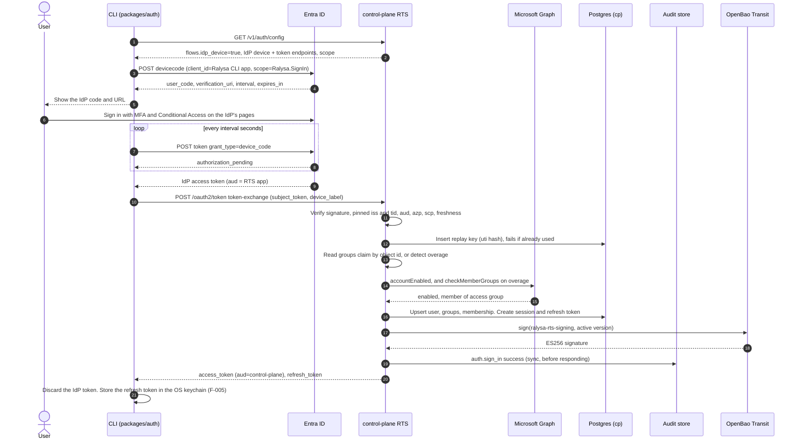
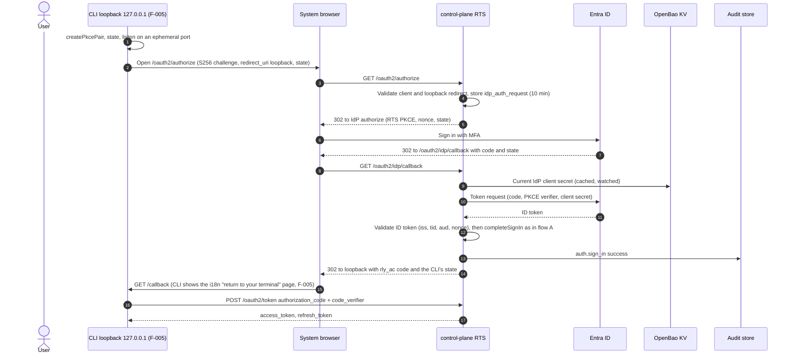
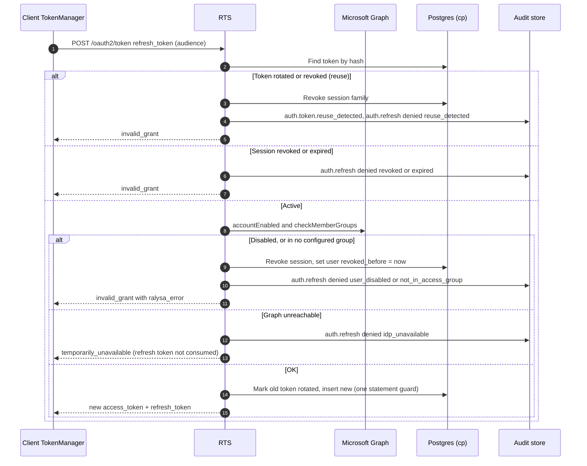
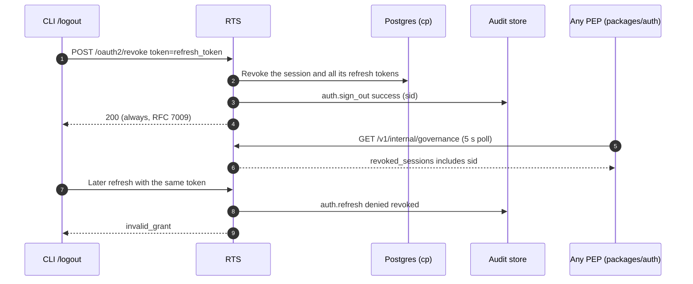
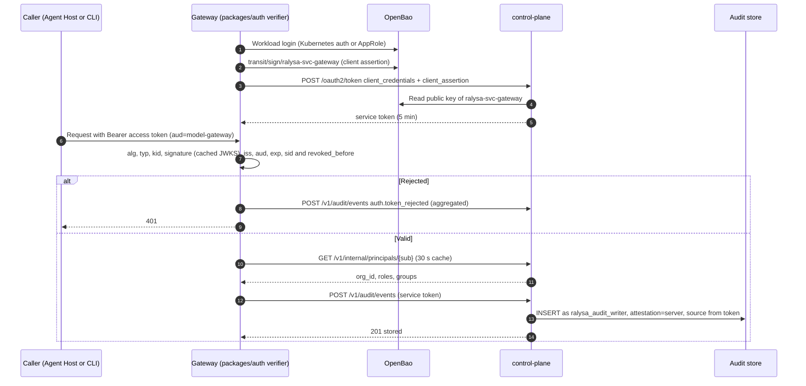
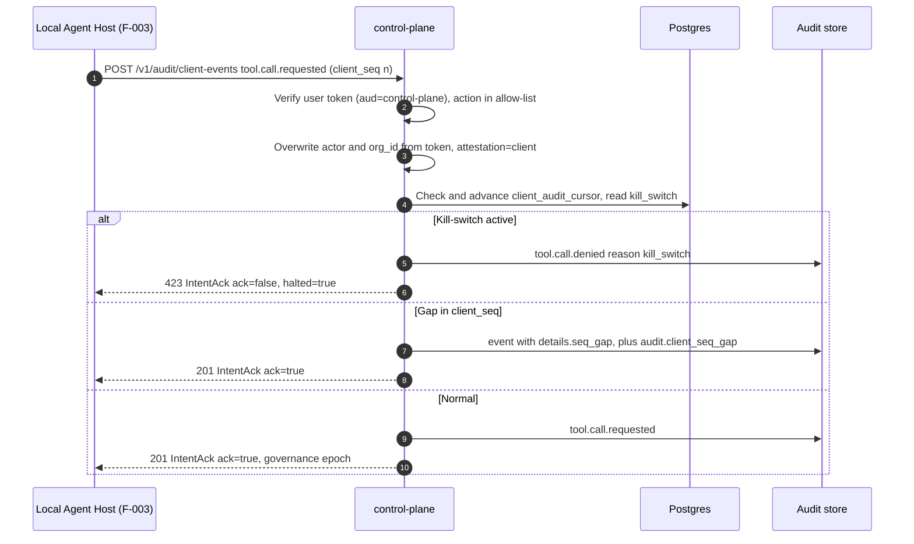
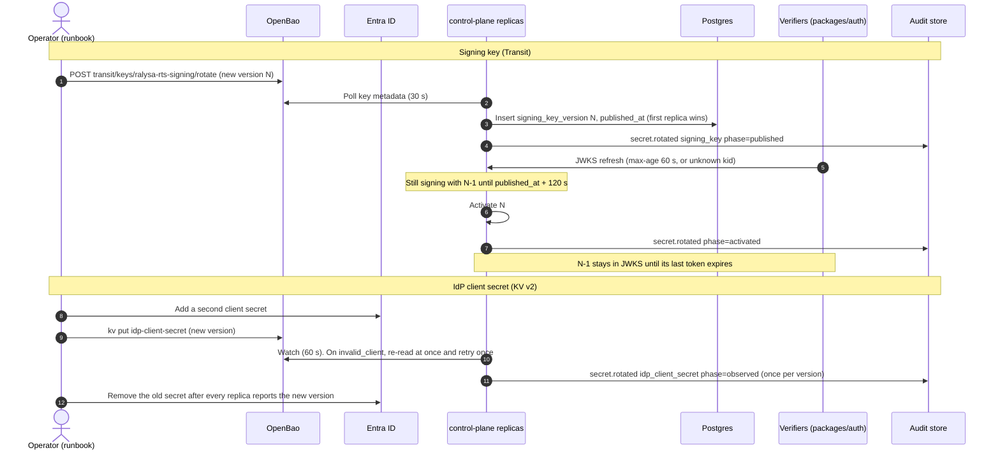

# F-002: SSO sign-in (OIDC) and control-plane skeleton: Solution Design

> Phase 4 · Owner: solution-designer · Brief: ./brief.md · ADRs: [ADR-0001](../../architecture/adr/0001-services-language-typescript.md), [ADR-0003](../../architecture/adr/0003-tenancy-and-isolation.md), [ADR-0010](../../architecture/adr/0010-ralysa-token-service-brokers-idp.md), [ADR-0011](../../architecture/adr/0011-policy-decision-model-and-pdp-placement.md), [ADR-0021](../../architecture/adr/0021-tamper-evident-audit-store.md), [ADR-0022](../../architecture/adr/0022-audit-write-path-fail-closed.md), [ADR-0025](../../architecture/adr/0025-kill-switch-enforcement.md) (ADR-0002 Cedar is not used in Phase 0; see §6.1) · Architecture: [identity-and-policy.md](../../architecture/identity-and-policy.md) §3, §4, §5.6, §9 · [observability-audit.md](../../architecture/observability-audit.md) §3, §4, §5 · [data-model.md](../../architecture/data-model.md) §4 · [security.md](../../architecture/security.md) TM-01/02/03/38/40/45/49, SR-06/07/08/26/29, P0-1 to P0-4 · Consistency review: BC-01 to BC-05, BC-13, CQ-02, CQ-04, CQ-06
> Status: **Draft for G4.** Date: 2026-09-25. Branch `design/F-002`. Architect and security-reviewer reviews pending.
> REQs: REQ-016 (a)–(d), REQ-095 (a)(b) for control-plane components; supports REQ-001(a) (F-005), REQ-017(b)(c) defaults, REQ-071 (Phase 0 slice) and DV-12.

**How to read this.** §1 maps every acceptance criterion (as amended by the accepted brief changes) to a design element and a test. §3 holds the contracts, §4 the schema, §5 the flows, §6 governance and the threat-mapped control table, §8 the tests and the CI job, §10 the task list. Decisions taken under the standing authorization are logged in "Risks & open questions".

**Brief changes accepted at G4 under the standing authorization (CLAUDE.md, 2026-09-25).** BC-01, BC-02, BC-03, BC-04, BC-05 and BC-13 (consistency-review.md §4). The brief itself is not edited here; the product-manager updates it (OQ-D6). This design is built to the amended criteria in §1.1.

---

## 1. Summary & scope

F-002 delivers the smallest control plane that makes identity real in Phase 0:

- **Ralysa Token Service (RTS)** inside `services/control-plane`: OIDC relying party toward Microsoft Entra ID, OAuth authorization server toward Ralysa clients (ADR-0010). CLI flow A (IdP-native device flow, then an RFC 8693 exchange at RTS) and flow B (`/login --browser`, loopback + PKCE through RTS). Rotating refresh tokens with reuse detection, 15-minute single-audience ES256 access tokens, JWKS, revocation feed.
- **Identity mapping** by immutable Entra object ID, with issuer and tenant pinning and fail-closed overage handling (SR-06).
- **Users, groups and sessions** in Postgres with `org_id` and `FORCE ROW LEVEL SECURITY` from the first migration (ADR-0003).
- **Phase 0 audit store**: canonical envelope, service ingestion path, client-attested ingestion path, an insert-only writer role, and a sealer hash chain from the first event (ADR-0021, ADR-0022, SR-29).
- **Secrets custody** in OpenBao: the IdP client secret in KV v2, token-signing keys as non-exportable Transit keys used through the sign API (SR-26, BC-13).
- **`packages/auth`**: the token verifier every Ralysa service uses, plus the isomorphic client flows the CLI (F-005) wraps.
- **A local dev and test stack** (Postgres, OpenBao dev server, an Entra-shaped mock IdP) and the first `integration` CI job.

Not in F-002: SAML and other IdPs, Desktop and Web sign-in, RTS-hosted device flow (flow C), admin session revocation UI and configurable token lifetime (F-006, REQ-017); profiles and Cedar policy (F-006); kill-switch API (F-012; F-002 only reads its state); signed WORM checkpoints, `audit verify`, retention (F-011); SIEM export (F-044); the CLI itself (F-005).

### 1.1 Acceptance criteria as amended at G4

Unchanged ACs keep their brief wording. The changed wording is in **bold**. AC-16 and AC-17 are new IDs introduced here for BC-03 and BC-05 (to be copied into the brief, OQ-D6).

| ID | Amended criterion (only the changes) | Source |
|---|---|---|
| AC-1 | … the group claims from the token. **Access and admin groups are configured and matched by immutable IdP object ID; issuer and tenant are pinned.** | BC-02 |
| AC-2 | **The client starts a device-authorization sign-in with the IdP and receives the IdP's user code, verification URL and polling interval. After MFA, the client exchanges the IdP result at the control plane (RFC 8693) for Ralysa tokens. Expired or reused codes are refused, and an IdP result can be exchanged only once. A tenant setting disables device code; the CLI then uses `/login --browser` (the AC-1 grant).** | BC-01 |
| AC-5 | … records `outcome=denied`. **If group overage can't be resolved, sign-in is denied and audited.** | BC-02 |
| AC-9 | … never secret values. **Token-signing keys are non-exportable and used through a signing API; services verify through JWKS.** | BC-13 |
| AC-10 | Unchanged; rotation of the signing key means a new Transit key version (BC-13). | BC-13 |
| AC-11 | … optional **`endpoint_region`,** `inference_region`, `model`, … | BC-04 |
| AC-13 | … **`endpoint_region` and** `inference_region` are on AuditEvent and UsageRecord (DV-12, **SR-04**). | BC-04 |
| **AC-16** (new) | A second, client-attested endpoint accepts a user access token, only for local-host event types. It overwrites the actor and `org_id` from the token subject, marks events `attestation=client`, requires a monotonic `client_seq` per session and flags gaps, and refuses intents while a kill-switch applies. AC-11 stays as written for services. | BC-03 |
| **AC-17** (new) | The audit writer role has INSERT only; UPDATE and DELETE are rejected and audited. Each event is sealed into a hash chain within 5 s. Signed WORM checkpoints, verify and retention stay in F-011. | BC-05, CQ-04 |

Proposed numbers confirmed at G4 (G2 condition), logged as D-12, D-16, D-17: access-token lifetime **15 min** (AC-6); new credentials in use **≤ 5 min** after rotation (AC-10; this design achieves ≤ 150 s); token validation **≤ 10 ms p95** added to a gateway request (NFR; design target ≤ 2 ms p95 with a warm cache).

### 1.2 AC → design → test

| AC | Satisfied by (design section) | Tested by |
|---|---|---|
| AC-1 | Flow B (§5.2): `GET /oauth2/authorize`, `GET /oauth2/idp/callback`, `completeSignIn()` (§3.2, §5.1), `app_user`, `idp_group`, `group_membership` (§4.4); SR-06 mapping (§6.3) | TC-F-002-01, TC-F-002-24 |
| AC-2 | Flow A (§5.1): `/v1/auth/config`, `packages/auth` `startIdpDeviceSignIn()`, token-exchange grant, `idp_token_replay` (§4.4), tenant switch `device_code_enabled` (§3.8) | TC-F-002-02, -03, -04 |
| AC-3 | No password or shared-secret user credential anywhere in the API (§3.1 rules, §3.3 grants refused); OpenAPI generated and scanned (§3.10); `check-no-password` over client code (T14) | TC-F-002-05, -06 |
| AC-4 | `auth.sign_in` on every path incl. client-reported IdP failures (`POST /v1/auth/sign-in-failures`), fail-closed on success (§5.8), envelope (§3.5) | TC-F-002-07 |
| AC-5 | Access decision in `identity-mapping.ts` (§6.3); OAuth `access_denied` + `ralysa_error.i18n_key` (§3.9); no session, no user record | TC-F-002-08 |
| AC-6 | IdP refuses disabled users; Graph `accountEnabled` check at sign-in and every refresh (§5.3); `revoked_before` in the governance feed (§3.2.6); 15-min access tokens | TC-F-002-09 |
| AC-7 | `packages/auth` `createAccessTokenVerifier()` + `PrincipalResolver` (§3.6), `auth.token_rejected` with aggregation (§6.4) | TC-F-002-10, -11, -12 |
| AC-8 | `POST /oauth2/revoke` revokes the session family; later refresh refused and audited (§5.4) | TC-F-002-13 |
| AC-9 | OpenBao KV + Transit (§6.5), `credential.vault_path` only (§4.4), log scrubbing (§6.6), scans of DB, logs, config and image (T14) | TC-F-002-14 |
| AC-10 | Publish-then-activate key rotation (§3.2.4, §5.7), KV watcher + `invalid_client` retry for the IdP secret (§5.7) | TC-F-002-15 (CI, compressed), TC-F-002-16 (10-min soak) |
| AC-11 | `POST /v1/audit/events` (service path, §3.4.4), service identity via vault-signed client assertion (§3.2.7), insert-only store (§4.5), no update/delete route | TC-F-002-17 |
| AC-12 | `GET /v1/audit/events` with `platform_admin` role check; `audit.query` success/denied (§3.4.6) | TC-F-002-18 |
| AC-13 | Migrations 0001–0005 (§4.3, §4.4) | TC-F-002-19 |
| AC-14 | pino redaction + scrubber + route-template logging, user ids only (§6.6) | TC-F-002-20 |
| AC-15 | UTF-8 database check, no normalisation, Arabic mock users and groups (§4.2, §8.3) | TC-F-002-21 |
| AC-16 | `POST /v1/audit/client-events` (§3.4.5, §5.6), `client_audit_cursor` (§4.4), kill-switch read (§4.4 `kill_switch`) | TC-F-002-22 |
| AC-17 | Roles and column grants (§4.1), `audit.reject_modify()` trigger (§4.5), sealer (§4.6) | TC-F-002-23 |

---

## 2. Components touched

| Path | New / changed | Responsibility |
|---|---|---|
| `services/control-plane` | changed: placeholder → `pnpm scaffold services/control-plane --kind service` | RTS, directory, audit ingest and query, sealer, migrations, governance feed. Fastify 5 (D-10). |
| `packages/protocol` | changed: placeholder → `pnpm scaffold packages/protocol --kind library-isomorphic` (whichever of F-002/F-003 lands first scaffolds it; OQ-D8) | Zod contracts: audit envelope and event catalogue, token claims, control-plane REST types, error and i18n keys, JCS hashing, `traceparent` parsing. Generated JSON Schema committed (`check:generated`). |
| `packages/auth` | changed: placeholder → `--kind library-isomorphic` | Token verifier, principal resolver, revocation feed, JWKS cache, service-token source; isomorphic client flows (IdP device flow, exchange, loopback-PKCE helpers, refresh single-flight, revoke). No Node built-ins; the loopback listener and OS keychain store live in `apps/cli` (F-005). |
| `packages/secrets` | **new** (`--kind library-isomorphic`) | `SecretStore` and `KeyCustody` ports, OpenBao KV v2 and Transit adapters over `fetch`, OpenBao auth (Kubernetes, AppRole, dev token), in-memory test doubles. Used by control-plane now and model-gateway (F-004) next. |
| `tooling/dev-stack` | **new** (hand-made from the service template, `ralysa.kind: "tooling"`, `shipped: false`) | Entra-shaped mock IdP (on `oidc-provider`), Graph stub, dev `.env` generator, database and OpenBao bootstrap, integration-test harness helpers. Never shipped, never a production dependency. |
| `deploy/docker/dev/compose.yaml` | new | Postgres, OpenBao dev server, mock IdP (profile `idp`). Used by developers and by the CI `integration` job. |
| `deploy/docker/control-plane.Dockerfile` | new | Phase 0 image for the AC-9 image scan and local runs. Packaging proper is ADR-0027 / F-023. |
| `.github/workflows/ci.yml` | changed | New `integration` job (§8.5). |
| `.github/workflows/soak.yml` | new | `workflow_dispatch` only: the 10-minute AC-10 soak (TC-F-002-16). |
| `.github/required-checks.json` | changed | Adds `integration`. |
| `tooling/repo-scripts/src/check-ci-invariants.ts` | changed | New rule `ci/pre-install-gate-first`: in every job that runs `pnpm`, `corepack`, `npx` or `turbo`, the pre-install gate step comes first. |
| `tooling/repo-scripts/src/check-no-password.ts` | new | AC-3: no password prompts or password-type inputs in client source, no password-like fields in committed OpenAPI documents. |
| `.gitleaks.toml`, `.gitleaks.artefacts.toml` | changed | Rules for Ralysa's own token formats (`rly_rt_`, `rly_ac_`), promised by F-001 design §6.2.2. |
| `pnpm-workspace.yaml` | changed | Catalog entries for the new shared runtime dependencies (§2.2). |
| `docs/engineering/repo-conventions.md` | changed | `integration` job, dev stack, ports. |
| `services/control-plane/README.md` | changed | Operator notes: config, Entra app-registration checklist (§6.7), rotation runbooks. |

### 2.1 Module layout

```
services/control-plane/
  package.json            scripts: build, lint, typecheck, test, test:integration, test:soak,
                          check:generated (OpenAPI), start, migrate
  vitest.config.ts        hermetic unit tests (the F-001 node preset)
  vitest.integration.config.ts   test/integration/**/*.int.ts, globalSetup = dev-stack harness
  openapi/control-plane.v1.json  generated, committed
  src/
    main.ts               entry: `serve` | `migrate` | `sealer` | `bootstrap-org`
    app.ts                buildApp(deps): Fastify instance without listen (tests inject deps)
    config/schema.ts      zod config schema: vault paths and IDs only, never secret values
    config/load.ts        YAML file (RALYSA_CONFIG) + env overrides, validated at start
    http/
      zod-validation.ts   Fastify validator/serializer compilers backed by zod safeParse
      errors.ts           OAuth errors (RFC 6749 §5.2) and problem+json (RFC 9457) for /v1
      request-context.ts  traceparent, client IP (trustProxy CIDRs), org resolution
      logging.ts          pino options, redaction paths, scrubber (§6.6)
      rate-limits.ts
      openapi.ts          builds the OpenAPI 3.1 document from the protocol zod schemas
    auth/                 Ralysa Token Service
      routes/discovery.ts     /.well-known/oauth-authorization-server, /.well-known/jwks.json, /v1/auth/config
      routes/authorize.ts     GET /oauth2/authorize (flow B leg 1)
      routes/idp-callback.ts  GET /oauth2/idp/callback (flow B leg 2)
      routes/token.ts         POST /oauth2/token (grant dispatch)
      routes/revoke.ts        POST /oauth2/revoke (sign-out)
      routes/sign-in-failures.ts  POST /v1/auth/sign-in-failures
      grants/authorization-code.ts, grants/refresh-token.ts,
      grants/token-exchange.ts, grants/client-credentials.ts
      idp/entra-token-validator.ts   IdP access/ID token validation, pinned iss/tid/aud/azp
      idp/oidc-client.ts             openid-client wrapper for flow B
      idp/directory.ts               IdpDirectory port
      idp/graph-directory.ts         Microsoft Graph implementation
      identity-mapping.ts   SR-06: object IDs, overage, roles, access decision
      sign-in.ts            completeSignIn(): upsert, decide, session, audit (fail closed)
      sessions.ts           session + refresh-token family, rotation, reuse detection, revoke
      tokens/mint.ts        JWT assembly, signing through KeyCustody
      tokens/signing-keys.ts  key watcher, publish-then-activate, JWKS document
      clients.ts            static client registry (ralysa-cli, service clients)
      governance-feed.ts    GET /v1/internal/governance
    directory/
      routes/me.ts          GET /v1/me
      routes/principals.ts  GET /v1/internal/principals/:userId
    audit/
      writer.ts             AuditWriter: writer pool, fail-closed insert, disk spool for denials
      spool.ts
      rejections.ts         auth.token_rejected aggregation
      routes/service-events.ts   POST /v1/audit/events
      routes/client-events.ts    POST /v1/audit/client-events
      routes/query.ts            GET /v1/audit/events
      sealer/sealer.ts      advisory-locked loop per (org, shard)
      sealer/chain.ts       event hash, chain hash, verifyChain()
    secrets/runtime.ts      IdP client-secret watcher, DB credential loading
    governance/kill-switch.ts  read-only port (F-012 writes)
    org/bootstrap.ts        the one Organization (ADR-0003)
    db/
      pools.ts              one pg Pool per DB role (§4.1)
      kysely.ts             Kysely instances, withOrg(orgId, fn)
      types.ts              Kysely Database interface
      migrate.ts            Kysely Migrator with a static provider
      migrations/index.ts   static imports (no dynamic import; SEC-F001-09 b)
      migrations/0001_schemas_and_rls_helpers.ts
      migrations/0002_cp_identity.ts
      migrations/0003_cp_sessions_and_tokens.ts
      migrations/0004_audit_store.ts
      migrations/0005_usage_credential_governance.ts
      sql/bootstrap-roles.sql  run once per cluster by the DBA (dev-stack runs it locally)
  test/                   unit tests (*.test.ts), hermetic
  test/integration/       *.int.ts, against the dev stack
  test/soak/rotation.soak.ts

packages/protocol/src/
  index.ts
  audit/envelope.ts   audit/actions.ts   audit/client-allowlist.ts   audit/jcs.ts
  auth/claims.ts      auth/oauth.ts      auth/errors.ts
  control-plane/auth-config.ts  me.ts  principals.ts  governance.ts  audit-api.ts  sign-in-failures.ts
  trace.ts
  schema/             generated JSON Schema (audit-event.v1.json, access-token-claims.v1.json, …)

packages/auth/src/
  index.ts
  verify/access-token-verifier.ts  verify/jwks.ts  verify/revocation-feed.ts
  verify/principal-resolver.ts     verify/rejections.ts
  client/config.ts  client/idp-device.ts  client/exchange.ts  client/pkce.ts
  client/authorization-code.ts  client/token-manager.ts  client/revoke.ts  client/errors.ts
  service/service-token-source.ts  service/client-assertion.ts

packages/secrets/src/
  index.ts  ports.ts
  openbao/http.ts  openbao/auth.ts  openbao/kv2.ts  openbao/transit.ts
  memory/in-memory-secret-store.ts  memory/in-memory-key-custody.ts

tooling/dev-stack/src/
  cli.ts              `env` (dependency-free .env generator), `bootstrap`, `mock-idp`
  env.ts  bootstrap-db.ts  bootstrap-vault.ts
  mock-idp/server.ts  mock-idp/entra-claims.ts  mock-idp/graph.ts  mock-idp/test-control.ts
  mock-idp/fixtures.ts  (users and groups, incl. Arabic, disabled, overage, renamed-group)
  harness/            global setup, per-worker database and vault prefixes, log capture
```

### 2.2 New runtime dependencies

Versions are resolved when the task that adds them lands, must be at least 3 days old (`minimumReleaseAge`), and go into the `catalog:` when more than one workspace uses them. None may need a dependency build script (`strictDepBuilds`); a task that finds one stops and asks for review (`allow-builds.json`).

| Package | Used by | Why | Reference |
|---|---|---|---|
| `fastify`, `@fastify/formbody`, `@fastify/rate-limit` | control-plane | HTTP server (D-10); `application/x-www-form-urlencoded` for the OAuth endpoints; rate limits | [Fastify docs](https://fastify.dev/docs/latest/), [Validation and Serialization](https://fastify.dev/docs/latest/Reference/Validation-and-Serialization/) |
| `kysely`, `pg` | control-plane | Query builder and migrator (D-8); node-postgres driver | [Kysely migrations](https://kysely.dev/docs/migrations), [node-postgres](https://node-postgres.com/) |
| `jose` | auth, control-plane | JWT/JWS verification, JWK import/export, remote JWKS with cache and cooldown | [jose](https://github.com/panva/jose), [`createRemoteJWKSet`](https://github.com/panva/jose/blob/main/docs/jwks/remote/functions/createRemoteJWKSet.md) |
| `openid-client` | control-plane | OIDC RP for flow B (discovery, code + PKCE, ID-token validation) | [openid-client](https://github.com/panva/openid-client) |
| `canonicalize` | protocol | RFC 8785 JSON canonicalisation for audit hashing | [RFC 8785](https://www.rfc-editor.org/rfc/rfc8785), [canonicalize](https://github.com/erdtman/canonicalize) |
| `uuid` | protocol, control-plane | UUIDv7 identifiers (data-model §1 principle 5) | [RFC 9562](https://www.rfc-editor.org/rfc/rfc9562) |
| `zod` | protocol, auth, control-plane | Already in the catalog (4.6.5) | [Zod JSON Schema](https://zod.dev/json-schema) |
| `oidc-provider` (devDependency of `tooling/dev-stack` only) | dev-stack | Mock IdP: device flow, PKCE, JWT access tokens, custom claims | [node-oidc-provider](https://github.com/panva/node-oidc-provider) |

All links accessed 2026-09-25.

---

## 3. Contracts

### 3.1 Endpoint catalogue

All routes are served by `services/control-plane`. Every `/v1` route is described by the generated OpenAPI 3.1 document (`openapi/control-plane.v1.json`). The OAuth endpoints are described by RFC 8414 metadata and by the same OpenAPI document.

| Method and path | Caller authentication | Purpose | ACs |
|---|---|---|---|
| `GET /.well-known/oauth-authorization-server` | none | RFC 8414 metadata: issuer, endpoints, `grant_types_supported`, `code_challenge_methods_supported: ["S256"]`, `token_endpoint_auth_methods_supported: ["none","private_key_jwt"]` | AC-3, AC-7 |
| `GET /.well-known/jwks.json` | none | Published verification keys (`Cache-Control: max-age=60`) | AC-7, AC-10 |
| `GET /v1/auth/config` | none | Which CLI flows are enabled, the IdP device and token endpoints, CLI client id and scope | AC-2 |
| `GET /oauth2/authorize` | none (browser) | Flow B leg 1; redirects to the IdP | AC-1 |
| `GET /oauth2/idp/callback` | `state` bound to a stored request | Flow B leg 2; redirects to the CLI loopback | AC-1, AC-5 |
| `POST /oauth2/token` | public client id (`ralysa-cli`) or `private_key_jwt` (services) | Grants: `authorization_code`, `refresh_token`, token exchange, `client_credentials` | AC-1, AC-2, AC-6, AC-8, AC-10, AC-11 |
| `POST /oauth2/revoke` | public client id | RFC 7009 revocation = sign-out | AC-8 |
| `POST /v1/auth/sign-in-failures` | none; rate-limited; idempotent per `attempt_id` | Client-reported IdP-side failures in flow A | AC-4 |
| `GET /v1/me` | user access token, `aud=control-plane` | The signed-in user and groups | AC-1, AC-15 |
| `GET /v1/internal/principals/{user_id}` | service token | Groups, roles and status for a user (AC-7's "yields groups") | AC-7 |
| `GET /v1/internal/governance` | service token | Revocations, kill-switch state, epoch (G-1 heartbeat, poll) | AC-6, AC-8 |
| `POST /v1/audit/events` | service token | Service ingestion path | AC-11 |
| `POST /v1/audit/client-events` | user access token, `aud=control-plane` | Client-attested ingestion path | AC-16 |
| `GET /v1/audit/events` | user access token + `platform_admin` | Audit query | AC-12 |
| `GET /healthz`, `GET /readyz` | none | Liveness; readiness requires DB, OpenBao and an active signing key | ops |

Rules that hold for every route (AC-3):

- No route accepts a password, PIN, OTP or any other user-held shared secret. The token endpoint refuses `grant_type=password` and every grant not listed above with `unsupported_grant_type`.
- User clients are **public** clients: the token endpoint never accepts `client_secret` for them. Services authenticate with `private_key_jwt` only (RFC 7523 §2.2). There is no `client_secret_*` method at RTS.
- No PUT, PATCH or DELETE exists under `/v1/audit` (AC-11).
- Every `/v1` response carries `traceparent` back; every error body is `application/problem+json` with a stable `type` URI and, for user-facing errors, an `i18n_key` (§3.9).

### 3.2 Token model

#### 3.2.1 Token types and lifetimes

| Token | Format | Issuer → holder | Audience | Lifetime | Storage | Notes |
|---|---|---|---|---|---|---|
| Entra access token (flow A) | JWT (Entra v2) | Entra → CLI memory → RTS once | RTS app registration | Entra default | Never stored; replay key hash only | Exchanged once (§3.2.5). Gateways never accept it. |
| Entra ID token (flow B) | JWT | Entra → RTS | RTS app | Entra default | Discarded after validation | |
| Ralysa authorization code (flow B) | opaque `rly_ac_` + 43 base64url chars (32 random bytes) | RTS → CLI loopback | RTS | **60 s**, single use | SHA-256 hash only | Bound to `client_id`, `redirect_uri`, `code_challenge` |
| **Ralysa refresh token** | opaque `rly_rt_` + 43 base64url chars | RTS → CLI (OS keychain in F-005) | RTS | **12 h idle, 7 d absolute** (CQ-09 default, D-18) | SHA-256 hash only | Rotated on every use; reuse revokes the family (§3.2.3) |
| **Ralysa access token** | JWT, `typ: at+jwt`, ES256 | RTS → client memory | exactly one of `control-plane`, `agent-host`, `model-gateway`, `mcp-gateway`, `workspace-runtime` | **15 min** (D-12) | Not stored | RFC 9068 profile |
| Service access token | JWT, `typ: at+jwt`, ES256, `token_use: service` | RTS → service memory | `control-plane` | **5 min** | Not stored | Obtained with a vault-signed client assertion (§3.2.7) |
| Service client assertion | JWT, ES256 | Service (signed through its own Transit key) → RTS | RTS token endpoint URL | ≤ 60 s, single use (`jti`) | `jti` hash for 120 s | RFC 7523 |

The `rly_rt_` and `rly_ac_` prefixes exist so gitleaks can find them (T14) and so the log scrubber can recognise them (§6.6).

#### 3.2.2 Access-token claims (`packages/protocol/src/auth/claims.ts`)

Follows identity-and-policy §4.2. Groups are **not** in the token (§4.2 there); services resolve them through `PrincipalResolver` (§3.6). `pol_ver` and `ent_ver` are optional until F-006 and F-013.

```ts
import { z } from 'zod';

export const Audience = z.enum([
  'control-plane', 'agent-host', 'model-gateway', 'mcp-gateway', 'workspace-runtime',
]);
export const Surface = z.enum(['cli', 'desktop', 'web', 'automation']);

/** JOSE header every Ralysa access token must carry. Anything else is rejected. */
export const AccessTokenHeader = z.looseObject({
  alg: z.literal('ES256'),
  typ: z.literal('at+jwt'),
  kid: z.string().regex(/^ralysa-rts-signing\.v[1-9][0-9]*$/),
});

/** Loose: verifiers ignore unknown claims (forward compatibility), but never unknown header algs. */
export const UserAccessTokenClaims = z.looseObject({
  iss: z.url(),                      // exactly config.public_base_url
  aud: Audience,                     // a single string, never an array
  sub: z.uuid(),                     // Ralysa user id (UUIDv7)
  client_id: z.string(),             // RFC 9068
  tid: z.uuid(),                     // Ralysa org id (identity §4.2 name; = envelope org_id)
  sid: z.uuid(),                     // auth session (refresh-token family)
  idp_sub: z.string().max(128),      // Entra object id (oid)
  surface: Surface,
  amr: z.array(z.string()).optional(),
  auth_time: z.int(),
  region: z.string(),                // Organization.region
  token_use: z.literal('access'),
  pol_ver: z.string().optional(),    // F-006
  ent_ver: z.int().optional(),       // F-013
  act: z.looseObject({ sub: z.string() }).optional(), // RFC 8693 delegation (server host, later)
  iat: z.int(), nbf: z.int(), exp: z.int(), jti: z.uuid(),
});

export const ServiceAccessTokenClaims = z.looseObject({
  iss: z.url(), aud: z.literal('control-plane'),
  sub: z.string().regex(/^svc:[a-z][a-z0-9-]{1,40}$/), client_id: z.string(),
  tid: z.uuid(), token_use: z.literal('service'),
  iat: z.int(), nbf: z.int(), exp: z.int(), jti: z.uuid(),
});
```

The verifier rejects, with a reason code (`TokenRejectReason`): `malformed`, `wrong_alg` (anything but ES256, including `none` and `HS256`), `wrong_typ`, `unknown_kid`, `bad_signature`, `unknown_issuer`, `wrong_audience` (includes array audiences), `expired`, `not_yet_valid` (30 s skew), `wrong_token_use`, `session_revoked`, `user_revoked`, `governance_stale`.

#### 3.2.3 Sessions, rotation and reuse detection

- One **auth session** (`sid`) per sign-in. It is the refresh-token family.
- Each refresh returns a new refresh token and marks the presented one `rotated` (single SQL statement with `WHERE status = 'active'`, so two concurrent refreshes can't both succeed).
- Presenting a `rotated` or `revoked` token is **reuse**: RTS revokes the whole session (`auth_session.revoked_at`, reason `reuse_detected`), writes `auth.token.reuse_detected` and `auth.refresh outcome=denied reason_code=reuse_detected`, and answers `invalid_grant` (RFC 9700 §4.14.2). No grace window (D-27); `packages/auth` makes refresh single-flight per session so honest clients never race.
- Idle expiry: each refresh token expires 12 h after issue; absolute expiry 7 d after session creation (`auth_session.absolute_expires_at`).
- Every refresh re-checks the user at the IdP (Graph `accountEnabled` and `checkMemberGroups` for the configured groups, §5.3). A disabled user or a user in no configured group is refused and the session revoked (AC-6, REQ-017c ≤ 15 min).
- Refresh accepts an `audience` parameter (Ralysa extension; RFC 8693 names it for token exchange). Default `control-plane`. `model-gateway`, `agent-host`, `mcp-gateway` and `workspace-runtime` are minted only for users with the `user` role (§6.3).

#### 3.2.4 Signing keys and JWKS (BC-13, SR-26)

- The signing key is an OpenBao Transit key `ralysa-rts-signing`, type `ecdsa-p256`, created with `exportable=false` and `allow_plaintext_backup=false`. The private key never leaves OpenBao; RTS signs through `POST /v1/transit/sign/ralysa-rts-signing/sha2-256` with an explicit `key_version` and `marshaling_algorithm=jws` (raw `r‖s` as JWS ES256 requires) ([OpenBao Transit API](https://openbao.org/api-docs/secret/transit/); the same API as [Vault Transit](https://developer.hashicorp.com/vault/api-docs/secret/transit)). T04 verifies the returned encoding against `jose.compactVerify` before anything else is built on it.
- `kid` = `ralysa-rts-signing.v<version>`. Public keys come from `GET /v1/transit/keys/ralysa-rts-signing` (PEM per version), converted to JWK with `jose`.
- **Publish-then-activate.** The key watcher polls the key metadata every 30 s. When it sees a new version it inserts `signing_key_version(kid, published_at=now)` (first replica wins) and adds the key to JWKS at once, but keeps signing with the previous version until `published_at + activation_delay` (120 s). Verifiers cache JWKS for at most 60 s and refetch on an unknown `kid` (jose cooldown 5 s), so every verifier has the new key before the first token signed with it exists. New key in use ≤ 30 s + 120 s = **150 s** (AC-10 target ≤ 5 min).
- A superseded version stays in JWKS until `activated_at(next) + access_ttl + 5 min`, so tokens signed with it validate until they expire (AC-10).
- Emergency pin: `tokens.signing_key_pin_version` in config forces a known-good version (rollback, §9).
- Transit sign is one network call per minted token. Minting is not on any gateway hot path; verification is local.

#### 3.2.5 Token exchange (flow A, RFC 8693)

Request (`application/x-www-form-urlencoded`):

```ts
export const TokenExchangeRequest = z.strictObject({
  grant_type: z.literal('urn:ietf:params:oauth:grant-type:token-exchange'),
  client_id: z.literal('ralysa-cli'),
  subject_token: z.string().min(1).max(8192),
  subject_token_type: z.literal('urn:ietf:params:oauth:token-type:access_token'),
  audience: Audience.optional(),               // default control-plane
  device_label: z.string().max(64).optional(), // untrusted, control chars stripped
});
```

RTS validates the Entra access token before anything else:

| Check | Rule | Failure (`auth.sign_in`) |
|---|---|---|
| Signature | Entra JWKS from the pinned tenant's discovery document (static JWKS file option for air-gapped IdPs) | `failure`, `invalid_idp_token` |
| `iss` | exactly `https://login.microsoftonline.com/<tenant_id>/v2.0` (the RTS app registration uses `requestedAccessTokenVersion: 2`) | `failure`, `untrusted_issuer` |
| `tid` | exactly the configured tenant id | `failure`, `untrusted_issuer` |
| `aud` | the RTS app registration client id | `failure`, `invalid_idp_token` |
| `azp` | in `idp.allowed_public_client_ids` (the Ralysa CLI app registration) | `failure`, `invalid_idp_token` |
| `scp` | contains `Ralysa.SignIn` | `failure`, `invalid_idp_token` |
| `exp`, `nbf` | 60 s skew; `iat` no older than 10 min (freshness) | `failure`, `expired` |
| Replay | `uti` (or `jti`) hash not in `idp_token_replay`; inserted in the same transaction | `failure`, `replay` |
| Tenant switch | `org.settings.auth.device_code_enabled = true`, else the grant is unavailable | `denied`, `device_code_disabled` |

Claim semantics are from the Entra [access token claims reference](https://learn.microsoft.com/en-us/entra/identity-platform/access-token-claims-reference): `oid` is the immutable object id used as `idp_subject` (D-21; `sub` is pairwise per application and is not used), `tid` is the tenant. Then `completeSignIn()` (§5.1). Response (RFC 8693 §2.2.1): `access_token`, `issued_token_type: urn:ietf:params:oauth:token-type:access_token`, `token_type: Bearer`, `expires_in`, `refresh_token`.

When device code is disabled, the exchange grant is off **server-side**, because flow B never uses it; a modified CLI that runs Entra's device flow anyway gets `unauthorized_client` and a `denied` audit event. The authoritative block is the tenant's Conditional Access policy (CQ-02).

#### 3.2.6 Revocation (≤ 60 s) and the governance feed

- Sign-out, reuse detection and a disabled user write `auth_session.revoked_at` or `app_user.revoked_before`.
- `GET /v1/internal/governance?since=<cursor>` returns what every PEP needs (§3.4.3). `packages/auth` `RevocationFeed` polls it every 5 s.
- The verifier rejects a token whose `sid` is revoked or whose `iat` < the user's `revoked_before`.
- If the feed hasn't been confirmed for more than 60 s, the verifier rejects every token with `governance_stale` (identity-and-policy §5.6 G-1).
- Phase 0 is poll-only; the Redis pub/sub push arrives with F-012 (OQ-D3). Poll-only still meets ≤ 60 s (5 s poll).

#### 3.2.7 Service identity (AC-11, SR-07)

Each Ralysa service has its own Transit key `ralysa-svc-<name>` and an OpenBao policy that allows only `transit/sign/ralysa-svc-<name>`. The service proves its workload identity to OpenBao (Kubernetes auth with its projected ServiceAccount token in a cluster, AppRole in dev), signs an RFC 7523 client assertion through Transit, and exchanges it at `POST /oauth2/token` (`grant_type=client_credentials`, `client_assertion_type=urn:ietf:params:oauth:client-assertion-type:jwt-bearer`). RTS verifies the assertion with the public key read from `transit/keys/ralysa-svc-<name>`, checks `iss`/`sub` = the registered client, `aud` = the token endpoint URL, `exp` ≤ 60 s ahead and a fresh `jti`, and mints a 5-minute service token (`sub=svc:<name>`). No static service secret exists anywhere. This is how F-002 reads "workload identity" in identity-and-policy §4.3; mTLS through a mesh can replace it later without changing the audit API (OQ-D2).

### 3.3 OAuth contracts (flow B and refresh)

```ts
export const AuthorizeQuery = z.strictObject({
  response_type: z.literal('code'),
  client_id: z.literal('ralysa-cli'),
  // RFC 8252 §7.3: IP-literal loopback, any port, fixed path.
  redirect_uri: z.string().regex(/^http:\/\/(127\.0\.0\.1|\[::1\]):([1-9][0-9]{0,4})\/callback$/),
  code_challenge: z.string().regex(/^[A-Za-z0-9_-]{43}$/),
  code_challenge_method: z.literal('S256'),
  state: z.string().min(16).max(128),
});

export const AuthorizationCodeRequest = z.strictObject({
  grant_type: z.literal('authorization_code'),
  client_id: z.literal('ralysa-cli'),
  code: z.string().regex(/^rly_ac_[A-Za-z0-9_-]{43}$/),
  redirect_uri: z.string(),
  code_verifier: z.string().regex(/^[A-Za-z0-9._~-]{43,128}$/),
});

export const RefreshRequest = z.strictObject({
  grant_type: z.literal('refresh_token'),
  client_id: z.literal('ralysa-cli'),
  refresh_token: z.string().regex(/^rly_rt_[A-Za-z0-9_-]{43}$/),
  audience: Audience.optional(),
});

export const RevokeRequest = z.strictObject({
  client_id: z.literal('ralysa-cli'),
  token: z.string().max(128),
  token_type_hint: z.literal('refresh_token').optional(),
});

export const TokenResponse = z.strictObject({
  access_token: z.string(), token_type: z.literal('Bearer'), expires_in: z.int(),
  refresh_token: z.string().optional(),
  issued_token_type: z.string().optional(),         // token exchange only
});

/** RFC 6749 §5.2 error + a Ralysa extension the CLI uses to pick an en/ar message. */
export const OAuthError = z.strictObject({
  error: z.enum(['invalid_request', 'invalid_client', 'invalid_grant', 'unauthorized_client',
    'unsupported_grant_type', 'invalid_scope', 'access_denied', 'temporarily_unavailable']),
  error_description: z.string().optional(),
  ralysa_error: z.strictObject({ code: SignInReason, i18n_key: z.string() }).optional(),
});
```

Flow B callback behaviour:
- A valid `state` whose request has expired (10 min) or was already used gets `invalid_request`.
- An IdP `error` parameter becomes `auth.sign_in outcome=failure reason_code=idp_error`, then a redirect to the loopback URI with `error=access_denied` and the original `state`.
- A policy denial redirects with `error=access_denied` and `error_description=<SignInReason>`.
- An invalid `client_id` or `redirect_uri` at `/oauth2/authorize` is **not** redirected (RFC 6749 §4.1.2.1). The response is a `400` `text/plain; charset=utf-8` body with the English and Arabic sentences for `auth.error.invalid_authorize_request`, `Content-Language: en, ar`. RTS renders no HTML (D-20).

### 3.4 Ralysa REST contracts (`packages/protocol/src/control-plane/*`)

#### 3.4.1 Auth config and sign-in failures

```ts
export const AuthConfig = z.strictObject({
  issuer: z.url(),
  flows: z.strictObject({ idp_device: z.boolean(), loopback_pkce: z.literal(true) }),
  idp: z.strictObject({
    kind: z.literal('entra'),
    device_authorization_endpoint: z.url(),   // from the pinned tenant's discovery document
    token_endpoint: z.url(),
    cli_client_id: z.string(),
    scope: z.string(),                        // the RTS API scope only (see below)
  }),
  cli_client_id: z.literal('ralysa-cli'),
});

export const SignInFailureReport = z.strictObject({
  attempt_id: z.uuid(),                        // idempotency key (AC-4 exact counts)
  flow: z.literal('idp_device'),
  error: z.enum(['authorization_declined', 'expired_token', 'access_denied',
    'bad_verification_code', 'conditional_access_blocked', 'other']),
  idp_error_code: z.string().regex(/^AADSTS[0-9]{5,6}$/).optional(),
  device_label: z.string().max(64).optional(),
});
```

`scope` is the RTS API scope only (`<rts-app-id-uri>/Ralysa.SignIn`); the CLI never needs an Entra refresh token, so it does not ask for `offline_access`. `POST /v1/auth/sign-in-failures` answers `202` and writes `auth.sign_in outcome=failure` with `attestation=client` and `details.reported_by=client`. Limits: 10 per minute per IP; duplicate `attempt_id` → `202` without a second event.

#### 3.4.2 `/v1/me` and principals

```ts
export const GroupView = z.strictObject({
  id: z.uuid(), idp_group_id: z.string(), display_name: z.string().nullable(),
  role: z.enum(['access', 'platform_admin']).nullable(),
});
export const Me = z.strictObject({
  id: z.uuid(), org_id: z.uuid(), idp_subject: z.string(), email: z.string().nullable(),
  display_name: z.string().nullable(), locale: z.string(), status: z.enum(['active', 'disabled']),
  roles: z.array(z.enum(['user', 'platform_admin'])), groups: z.array(GroupView),
});
export const Principal = z.strictObject({
  user_id: z.uuid(), org_id: z.uuid(), status: z.enum(['active', 'disabled']),
  roles: z.array(z.enum(['user', 'platform_admin'])),
  groups: z.array(z.strictObject({ idp_group_id: z.string(), role: GroupView.shape.role })),
  as_of: z.iso.datetime(),
});
```

#### 3.4.3 Governance feed

```ts
export const GovernanceState = z.strictObject({
  epoch: z.int(),                      // bumps on any change
  issued_at: z.iso.datetime(),
  cursor: z.string(),
  revoked_sessions: z.array(z.strictObject({ sid: z.uuid(), revoked_at: z.iso.datetime() })),
  users_revoked_before: z.array(z.strictObject({ user_id: z.uuid(), revoked_before: z.iso.datetime() })),
  kill_switches: z.array(z.strictObject({
    scope: z.enum(['tenant', 'department', 'pack', 'agent']), scope_id: z.string().nullable(),
    active: z.boolean(),
  })),
});
```

Without `since`, the feed returns every revocation newer than `now − (access_ttl + 5 min)`; the list stays small because access tokens are short.

#### 3.4.4 Service audit ingestion (AC-11)

`POST /v1/audit/events`, body `{ events: AuditEventInput[] }` (1–100 events, 256 KB). The server:
- sets `source` from the service token subject (never from the body) and `attestation=server`;
- takes `org_id` from the token, and `ts` from the database clock;
- checks that a user `actor.user_id` exists in the org;
- inserts with `ON CONFLICT DO NOTHING`, idempotent on `event_id`.

Response `201 { results: [{ event_id, status: 'stored' | 'duplicate' }] }`. Errors:

| Condition | Response |
|---|---|
| No token or an invalid token | `401` |
| A user token, or an unregistered service | `403` (audited `auth.token_rejected`, reason `wrong_token_use`) |
| Body fails the schema | `422` |
| Insert fails or exceeds 250 ms | `503` with problem type `audit_unavailable` |

Services must set `actor` only to the validated user of the request they serve (observability-audit §3.3). F-002 can check existence, not provenance (residual, §6.4).

#### 3.4.5 Client-attested ingestion (AC-16)

`POST /v1/audit/client-events`, user access token with `aud=control-plane`. Body `{ session_id, events: ClientAuditEventInput[] }` (1–50).

```ts
export const CLIENT_ACTION_ALLOWLIST = [
  'tool.call.requested', 'tool.call.completed', 'tool.call.denied',
  'session.started', 'session.ended', 'hook.failed', 'approval.presented',
] as const;

export const ClientAuditEventInput = z.strictObject({
  event_id: z.uuid(),
  client_seq: z.int().min(1),
  action: z.enum(CLIENT_ACTION_ALLOWLIST),
  resource: z.strictObject({ type: z.literal('local_tool'), id: z.string().max(128) }).nullable(),
  operation: z.string().max(32).nullable(),
  outcome: Outcome.nullable(),                 // null on *.requested
  reason_code: z.string().max(64).nullable(),
  tool_call_id: z.string().max(64).nullable(),
  turn_id: z.string().max(64).nullable(),
  trace_id: TraceId, span_id: SpanId.nullable(),
  payload_hash: Sha256Hex.nullable(),
  details: z.record(z.string(), z.json()),      // client_ts goes here
});

export const IntentAck = z.strictObject({
  event_id: z.uuid(), ack: z.boolean(),
  governance: z.strictObject({ epoch: z.int(), halted: z.boolean(), reason_category: z.string().nullable() }),
});
```

Server rules (observability-audit §3.3):
- It **overwrites** `actor` (`type=user`, `user_id=sub`, `idp_subject=idp_sub`), `org_id=tid`, `source=agent-host-local`, `attestation=client`, `surface` from the token, and `ts`.
- It rejects any other action with `422`.
- `client_seq` is tracked per `(user, session_id)` in `client_audit_cursor`:
  - `seq ≤ last` with the same `event_id` → `duplicate`;
  - `seq ≤ last` with a different `event_id` → `409`;
  - `seq > last + 1` → stored with `details.seq_gap = [last+1, seq-1]`, plus one `audit.client_seq_gap` event.
- Each `*.requested` gets an `IntentAck`. If an active kill-switch covers the tenant, the intent is **not** acknowledged: the endpoint returns `423` with `governance.halted=true` and stores `tool.call.denied` with `reason_code=kill_switch` (TM-48).
- Limit: 600 events per minute per user.
- These events never count toward the 100 % model and remote-tool audit NFR.

#### 3.4.6 Audit query (AC-12)

`GET /v1/audit/events?from&to&user_id&action&outcome&limit&cursor`:
- `from` and `to` are required, with a range of at most 31 days; `limit` ≤ 500; keyset pagination on `(ts, event_id)`.
- It needs the `platform_admin` role, read from `group_membership` at request time.
- Allowed: `200 { events: AuditEvent[], next_cursor }`, where each event carries its seal (`shard`, `seq`) when sealed. Writes `audit.query outcome=success` with the filters and `result_count`.
- Not admin: `403` plus `audit.query outcome=denied reason_code=not_platform_admin` (written before the response).
- Reads use the `ralysa_audit_reader` role under RLS.

### 3.5 Audit envelope and event catalogue (`packages/protocol/src/audit/*`)

The envelope is observability-audit §3.1, field for field. AC-11's field names map as follows: `id` → `event_id`; `actor` → `actor.*`; `resource` → `resource.type` / `resource.id`; `model` → `details.model_id` plus `resource.id` when `resource.type=model_endpoint`.

```ts
export const AUDIT_SCHEMA_VERSION = 1 as const;
export const TraceId = z.string().regex(/^[0-9a-f]{32}$/);
export const SpanId = z.string().regex(/^[0-9a-f]{16}$/);
export const Sha256Hex = z.string().regex(/^[0-9a-f]{64}$/);
// `failure` is used by the auth events (identity-and-policy §3.1, brief AC-4); see OQ-D4.
export const Outcome = z.enum(['success', 'failure', 'denied', 'error', 'cancelled',
  'approved', 'rejected', 'expired']);
export const Source = z.enum(['control-plane', 'model-gateway', 'mcp-gateway',
  'workspace-runtime', 'agent-host-server', 'agent-host-local']);
export const Region = z.string().regex(/^[a-z0-9-]{2,40}$/);

export const Actor = z.strictObject({
  type: z.enum(['user', 'service', 'system']),
  user_id: z.uuid().nullable(),              // null before authentication succeeded
  idp_subject: z.string().max(128).nullable(),
  service: z.string().max(64).nullable(),
});

/** What a service submits. The server adds org_id, source, attestation and ts. */
export const AuditEventInput = z.strictObject({
  event_id: z.uuid(),
  action: z.string().regex(/^[a-z_]+(\.[a-z_]+){1,3}$/),
  actor: Actor,
  act: z.strictObject({ sub: z.string() }).nullable().optional(),
  surface: z.enum(['cli', 'desktop', 'web', 'automation', 'console']).nullable().optional(),
  resource: z.strictObject({ type: z.string().max(40), id: z.string().max(200) }).nullable().optional(),
  operation: z.string().max(32).nullable().optional(),
  outcome: Outcome,
  reason_code: z.string().max(64).nullable().optional(),
  session_id: z.string().max(64).nullable().optional(),
  turn_id: z.string().max(64).nullable().optional(),
  request_id: z.string().max(64).nullable().optional(),
  tool_call_id: z.string().max(64).nullable().optional(),
  trace_id: TraceId,
  span_id: SpanId.nullable().optional(),
  policy_version: z.string().max(64).nullable().optional(),
  entitlement_version: z.int().nullable().optional(),
  tier: z.enum(['T1', 'T2', 'T3']).nullable().optional(),
  classification: z.string().max(16).nullable().optional(),
  endpoint_id: z.string().max(100).nullable().optional(),
  endpoint_region: Region.nullable().optional(),          // BC-04
  inference_region: Region.nullable().optional(),         // processing geography (SR-04)
  inference_region_source: z.enum(['registry_declared', 'provider_reported']).nullable().optional(),
  locality: z.enum(['local', 'in_country', 'in_region', 'global']).nullable().optional(),
  tokens_in: z.int().min(0).nullable().optional(),
  tokens_out: z.int().min(0).nullable().optional(),
  cache_read_tokens: z.int().min(0).nullable().optional(),
  cache_write_tokens: z.int().min(0).nullable().optional(),
  payload_hash: Sha256Hex.nullable().optional(),
  details: z.record(z.string(), z.json()),
});

/** Stored form = input + server-assigned fields. The canonical form hashed by the sealer. */
export const AuditEvent = AuditEventInput.extend({
  schema_version: z.literal(AUDIT_SCHEMA_VERSION),
  ts: z.iso.datetime({ precision: 3 }),
  org_id: z.uuid(),
  source: Source,
  attestation: z.enum(['server', 'client']),
  client_seq: z.int().nullable().optional(),
});
```

`packages/protocol` generates `schema/audit-event.v1.json` with `z.toJSONSchema()`; `check:generated` fails on drift (ADR-0004 decision 5 applied to this contract too). No transforms or wire-changing refinements.

**Event catalogue emitted by F-002.** Names follow identity-and-policy §9; the fields listed go in `details`.

| `action` | `outcome` / `reason_code` | `details` | Written by |
|---|---|---|---|
| `auth.sign_in` | `success`; `failure`: `idp_error`, `invalid_idp_token`, `untrusted_issuer`, `expired`, `replay`, `idp_unavailable`, `mfa_claim_missing`; `denied`: `not_in_access_group`, `user_disabled`, `group_overage_unresolved`, `device_code_disabled` | `flow` (`idp_device`, `loopback_pkce`), `protocol: oidc`, `client_type`, `client_ip`, `user_agent` (truncated), `device_label`, `amr`, `acr`, `attempted_identifier` (unverified `preferred_username` when no subject was validated; `identifier_verified: false`), `reported_by` (`server`/`client`) | RTS; client-reported failures via §3.4.1 |
| `auth.token.issued` | `success` | `audience`, `grant_type`, `sid`, `jti` | RTS (non-blocking, spooled on failure) |
| `auth.refresh` | `denied`: `revoked`, `expired`, `user_disabled`, `not_in_access_group`, `reuse_detected`, `idp_unavailable` | `sid` | RTS |
| `auth.token.reuse_detected` | `denied` | `sid`, `revoked_count` | RTS |
| `auth.token_rejected` | `denied`: `TokenRejectReason` | `audience`, `reason`, `client_ip`, `suppressed_count` (§6.4) | every verifying service |
| `auth.sign_out` | `success` | `sid`, `surface` | RTS |
| `auth.session.revoked` | `success` | `sid` or `user_id`, `revoked_by` (`system`), `cause` | RTS |
| `audit.query` | `success` / `denied`: `not_platform_admin` | `filters`, `result_count` | control plane |
| `audit.modify_denied` | `denied` | `op` (`UPDATE`/`DELETE`), `db_role`, `target_event_id` | DB trigger (§4.5) |
| `audit.client_seq_gap` | `error` | `session_id`, `missing_from`, `missing_to` | control plane |
| `secret.rotated` | `success` | `credential_ref_hash`, `kind` (`idp_client_secret`, `signing_key`), `version`, `phase` (`observed`, `published`, `activated`, `retired`) | control plane |
| `directory.user.provisioned` / `.updated` | `success` | `source: sign_in`, `changed_attributes` (names only) | RTS |
| `directory.group_membership.changed` | `success` | `added[]`, `removed[]` (IdP object ids), `privileged` (true if the admin group changed, TM-49) | RTS |
| `db.migration.applied` | `success` | `migration`, `checksum` | migrator (SR-29: every migration path audited) |

Events never contain tokens, codes, client secrets, PKCE verifiers or assertion values (AC-4, AC-14). `payload_hash` and hashes of references are allowed.

### 3.6 `packages/auth` public API

```ts
// Services (PEPs)
export interface VerifiedPrincipal {
  userId: string; orgId: string; sessionId: string; idpSubject: string;
  audience: Audience; surface: Surface; expiresAt: Date;
}
export type VerifyResult =
  | { ok: true; principal: VerifiedPrincipal }
  | { ok: false; reason: TokenRejectReason };

export function createAccessTokenVerifier(opts: {
  issuer: string;                     // exact match
  audience: Audience;                 // exactly one
  jwksUrl: string;                    // jose createRemoteJWKSet, cacheMaxAge 60 s, cooldown 5 s
  revocation: RevocationFeed;         // G-1: stale > 60 s → governance_stale
  clockSkewSeconds?: number;          // default 30
  onReject?: (r: { reason: TokenRejectReason; clientIp?: string; traceId?: string }) => void;
}): { verify(bearer: string): Promise<VerifyResult> };

export function createRevocationFeed(opts: {
  url: string; serviceTokens: ServiceTokenSource; pollMs?: number /* 5000 */; staleAfterMs?: number /* 60000 */;
}): RevocationFeed;

export function createPrincipalResolver(opts: {
  baseUrl: string; serviceTokens: ServiceTokenSource; ttlMs?: number /* 30000 */;
}): { resolve(userId: string): Promise<Principal> };   // groups + roles (AC-7)

export function createServiceTokenSource(opts: {
  tokenEndpoint: string; clientId: string; signer: AssertionSigner;   // Transit-backed in services
}): ServiceTokenSource;

// Clients (CLI in F-005; Desktop/Web later)
export function fetchAuthConfig(issuer: string): Promise<AuthConfig>;
export function startIdpDeviceSignIn(cfg: AuthConfig): Promise<{
  userCode: string; verificationUri: string; intervalSeconds: number; expiresInSeconds: number;
  poll(signal?: AbortSignal): Promise<{ idpAccessToken: string }>;  // throws typed errors
}>;
export function exchangeIdpToken(cfg: AuthConfig, idpAccessToken: string, opts?: {
  audience?: Audience; deviceLabel?: string }): Promise<TokenSet>;
export function reportSignInFailure(cfg: AuthConfig, report: SignInFailureReport): Promise<void>;
export function createPkcePair(): Promise<{ verifier: string; challenge: string }>; // WebCrypto
export function buildAuthorizeUrl(cfg: AuthConfig, p: { redirectUri: string; challenge: string; state: string }): URL;
export function redeemAuthorizationCode(cfg: AuthConfig, p: { code: string; redirectUri: string; verifier: string }): Promise<TokenSet>;
export function createTokenManager(opts: { cfg: AuthConfig; store: TokenStore }): TokenManager; // single-flight
export function revokeSession(cfg: AuthConfig, refreshToken: string): Promise<void>;

/** Implemented by F-005 on the OS credential store. There is deliberately no file-backed store. */
export interface TokenStore { load(): Promise<string | null>; save(rt: string): Promise<void>; clear(): Promise<void>; }
```

Typed client errors carry the server's `ralysa_error.i18n_key`: `AccessDeniedError`, `DeviceCodeExpiredError`, `DeviceCodeBlockedError` (a Conditional Access block, so the CLI suggests `--browser`), `SessionRevokedError`, `TemporarilyUnavailableError`. `startIdpDeviceSignIn().poll()` always reports IdP-side failures through `reportSignInFailure()` before throwing, so AC-4's count holds for honest clients.

### 3.7 `packages/secrets` ports

```ts
export interface SecretValue { value: string; version: number }
export interface SecretStore {
  get(path: string): Promise<SecretValue>;                  // KV v2 data + metadata.version
  watch(path: string, onChange: (v: SecretValue) => void, pollMs: number): () => void;
}
export interface PublicKeyVersion { version: number; jwk: JsonWebKey; createdAt: Date }
export interface KeyCustody {
  describe(key: string): Promise<{ latestVersion: number; exportable: boolean; versions: PublicKeyVersion[] }>;
  /** Returns the raw JWS signature bytes (ES256: r‖s, 64 bytes). */
  sign(key: string, version: number, signingInput: Uint8Array): Promise<Uint8Array>;
}
export type VaultAuth =
  | { method: 'kubernetes'; role: string; jwt: () => Promise<string> }   // caller reads the SA token file
  | { method: 'approle'; roleId: string; secretId: () => Promise<string> }
  | { method: 'token'; token: string };                                  // refused unless RALYSA_ENV is dev or test
export function createOpenBao(opts: { addr: string; auth: VaultAuth; namespace?: string }): {
  secrets: SecretStore; keys: KeyCustody;
};
export function createInMemorySecretStore(seed?: Record<string, string>): SecretStore & { put(path: string, v: string): void };
export function createInMemoryKeyCustody(): KeyCustody & { rotate(key: string): Promise<void> }; // WebCrypto, extractable=false
```

`KeyCustody.describe()` refuses to return a key whose `exportable` is `true`. The control plane will not start with such a key (BC-13 guard, TC-F-002-14).

### 3.8 Configuration (`services/control-plane/src/config/schema.ts`)

The config file holds identifiers and vault **paths** only; a secret value in config fails validation (a secret-looking value is rejected by a pattern check, and the `idp.client_secret` key does not exist).

```ts
export const ControlPlaneConfig = z.strictObject({
  env: z.enum(['dev', 'test', 'production']),
  public_base_url: z.url(),                  // = token issuer
  listen: z.strictObject({ host: z.string(), port: z.int() }),
  trust_proxy_cidrs: z.array(z.string()).default([]),
  org: z.strictObject({ id: z.uuid(), name: z.string(), residency: z.enum(['in_country', 'in_region']),
    region: Region, deployment_model: z.enum(['dedicated', 'on_prem', 'air_gapped']) }),
  idp: z.strictObject({
    kind: z.literal('entra'),
    tenant_id: z.uuid(),
    issuer: z.url(),                         // https://login.microsoftonline.com/<tenant_id>/v2.0
    rts_client_id: z.uuid(),
    allowed_public_client_ids: z.array(z.uuid()).min(1),
    signin_scope: z.string(),
    client_secret_path: z.string(),          // KV v2 path, e.g. kv/ralysa/control-plane/idp-client-secret
    graph_base_url: z.url(),                 // must be https://graph.microsoft.com unless env != production
    jwks_file: z.string().optional(),        // air-gapped IdPs: uploaded metadata
    require_mfa_claim: z.boolean().default(false),
  }),
  access: z.strictObject({ access_group_id: z.string(), admin_group_id: z.string(),
    device_code_enabled: z.boolean().default(true) }),
  tokens: z.strictObject({ access_ttl_s: z.int().default(900), service_ttl_s: z.int().default(300),
    refresh_idle_s: z.int().default(43200), refresh_absolute_s: z.int().default(604800),
    key_poll_s: z.int().default(30), activation_delay_s: z.int().default(120),
    signing_key_pin_version: z.int().optional() }),
  vault: z.strictObject({ addr: z.url(), auth: z.discriminatedUnion('method', [/* kubernetes | approle | token */]),
    transit_mount: z.string().default('transit'), kv_mount: z.string().default('kv'),
    signing_key: z.string().default('ralysa-rts-signing') }),
  db: z.strictObject({ host: z.string(), port: z.int(), database: z.string(), ssl: z.boolean(),
    credentials: z.strictObject({ cp_app: z.string(), audit_writer: z.string(), audit_reader: z.string(),
      audit_sealer: z.string(), migrator: z.string() }) }),       // KV paths
  services: z.array(z.strictObject({ name: z.string(), client_id: z.string(), transit_key: z.string() })),
  sealer: z.strictObject({ enabled: z.boolean().default(true), interval_ms: z.int().default(1000) }),
});
```

`access.device_code_enabled` is the per-tenant switch (ADR-0010 item 4). In Phase 0 it is deployment config, copied into `organization.settings` at start so a later Console action (F-018) can own it.

### 3.9 Errors and i18n keys

`SignInReason` values double as `ralysa_error.code`. The i18n key is `auth.denied.<code>` or `auth.failed.<code>`, for example `auth.denied.not_in_access_group` ("Your account isn't in the group that can use Ralysa. Contact your administrator."). F-005 owns the en/ar catalog strings in `apps/cli`; `packages/protocol` exports the key list so `check-i18n` can require both locales once F-005 adds its catalog. The one server-rendered string (`auth.error.invalid_authorize_request`) lives in `services/control-plane/src/i18n/{en,ar}.json` with an Arabic translation marked `needs-native-review` (F-001 OQ-D8 process).

### 3.10 Versioning

- REST: path prefix `/v1`. Minor changes only add optional fields and routes. A breaking change needs `/v2` and an overlap window (CQ-23 default: 6 months). The OpenAPI document carries `info.version` semver and is committed; `check:generated` fails on drift, and T14's `check-no-password` reads it.
- OAuth endpoints follow the RFCs; RFC 8414 metadata advertises what exists.
- Tokens: `typ: at+jwt`, claims evolve additively; verifiers ignore unknown claims and reject unknown `alg`/`typ`.
- Audit: `schema_version` = 1 is part of the canonical form, so old hashes stay valid after upgrades (deployment.md §5). New envelope fields are nullable.
- `packages/protocol` semver starts at `0.1.0` for these modules; F-003 versions the Agent Protocol independently (ADR-0004 decision 4).

---

## 4. Data

### 4.1 Database layout, roles and grants

One Postgres database per deployment (`ralysa`), two schemas: `cp` (operational) and `audit` (data-model §1 principle 7 allows "a separate database or schema"; OQ-DM-6 keeps the separate-database question for Phase 4). Server encoding must be `UTF8`; `bootstrap-roles.sql` and the migrator refuse to run otherwise (AC-15).

| Role | Login | Privileges | Used by |
|---|---|---|---|
| `ralysa_migrator` | yes | Owns both schemas, all tables, functions and triggers. Not a superuser, no `BYPASSRLS` | `control-plane migrate` |
| `ralysa_cp_app` | yes | Per-table `SELECT/INSERT/UPDATE` (and `DELETE` only on short-lived tables: `authorization_code`, `idp_auth_request`, `idp_token_replay`, `client_assertion_replay`, expired `refresh_token`); nothing on `audit.*`; no `BYPASSRLS` | control plane request handlers |
| `ralysa_audit_writer` | yes | `USAGE` on `audit`; **`INSERT` only** on `audit.audit_event`, and only on the columns a writer may set (column-level grant excludes `ts`, `ingest_seq`, `schema_version`); no `SELECT`, `UPDATE`, `DELETE` or `TRUNCATE` | `AuditWriter` |
| `ralysa_audit_reader` | yes | `SELECT` on `audit.audit_event`, `audit.audit_seal` | audit query |
| `ralysa_audit_sealer` | yes | `SELECT` on `audit.audit_event`; `SELECT, INSERT` on `audit.audit_seal` | sealer |
| `ralysa_usage_writer` | yes | `INSERT` on `cp.usage_record` only | model-gateway (F-004) |

Passwords for these roles live in OpenBao KV (`kv/ralysa/control-plane/db/<role>`), are set by `bootstrap-roles.sql` from values the operator supplies, and are never in config or images (AC-9). Dynamic database credentials (OpenBao database secrets engine) are the Phase 1 upgrade path (F-023).

**RLS (ADR-0003).** Every `cp` and `audit` table has `org_id uuid NOT NULL`, `ENABLE ROW LEVEL SECURITY` and `FORCE ROW LEVEL SECURITY`, and one policy per operation of the form `USING (org_id = cp.current_org()) WITH CHECK (org_id = cp.current_org())`. `cp.current_org()` is `current_setting('app.org_id')::uuid`, which errors when the setting is missing or empty, so an unscoped query fails closed. Application code only reaches the database through `withOrg(orgId, fn)`, which opens a transaction and runs `select set_config('app.org_id', $1, true)` first ([PostgreSQL row security](https://www.postgresql.org/docs/current/ddl-rowsecurity.html)).

### 4.2 Migration tool (D-8)

| Criterion | **Kysely `Migrator` (chosen)** | node-pg-migrate | Drizzle Kit | Prisma Migrate | Flyway / Sqitch |
|---|---|---|---|---|---|
| Raw SQL for RLS, `FORCE`, column grants, `SECURITY DEFINER` triggers | Yes (`sql` template in TS migrations) | Yes (SQL or JS) | Hand-written SQL anyway; the schema generator doesn't cover these | Hand-written SQL anyway | Yes |
| Query layer in the same library | Yes: typed query builder | No | Yes (ORM) | Yes (ORM) | No |
| Runtime we already ship | Node only | Node only | Node; `drizzle-kit` pulls `esbuild`, whose install script would need an `allow-builds.json` review (to verify) | Needs Prisma's engine binaries (to verify for the current release) | JVM (Flyway) or Perl (Sqitch): an extra runtime in air-gapped bundles |
| Fits the F-001 dynamic-loading ban | Yes: a custom `MigrationProvider` with static imports | Loads files by path | n/a | n/a | n/a |
| Transactional per migration on Postgres | Yes ([Kysely migrations](https://kysely.dev/docs/migrations)) | Yes | Yes | Yes | Yes |

Kysely's migrator keeps its own history and lock tables and runs each migration in a transaction on Postgres. Migrations are **forward-only** in real environments. Down functions exist only for local development and are never run by `control-plane migrate`. Schema changes use expand → migrate → contract across two releases (deployment.md §5). The audit schema is append-only: migrations never rewrite `audit_event` rows.

### 4.3 Migrations

| # | Contents |
|---|---|
| `0001_schemas_and_rls_helpers` | Schemas `cp`, `audit`; `cp.current_org()`; revoke `CREATE` on `public`; default privileges. |
| `0002_cp_identity` | `organization`, `app_user`, `idp_group`, `group_membership`; RLS; immutability trigger on `organization.region`. |
| `0003_cp_sessions_and_tokens` | `auth_session`, `refresh_token`, `authorization_code`, `idp_auth_request`, `idp_token_replay`, `client_assertion_replay`, `signing_key_version`; RLS. |
| `0004_audit_store` | `audit.audit_event`, `audit.audit_seal`; column grants; `audit.reject_modify()` trigger; `TRUNCATE` guard; RLS. |
| `0005_usage_credential_governance` | `usage_record`, `credential`, `kill_switch`, `client_audit_cursor`; RLS. |

Each applied migration writes `db.migration.applied` (SR-29). Migrations are idempotent under the Kysely lock; running `migrate` twice is a no-op.

### 4.4 Tables

PII classes are data-model §4: **N** none, **W** workforce identifiers, **C** content, **S** secret references. Every table has `org_id uuid NOT NULL` and RLS; `org_id` rows are omitted below. IDs are UUIDv7.

| Table.column | Type | PII | Retention | Index |
|---|---|---|---|---|
| **cp.organization** | | | Life of contract | PK `id` |
| .id (= org_id) | uuid | N | | |
| .name | text | N | | |
| .residency | text (`in_country`, `in_region`) | N | | |
| .region | text, **immutable** (trigger) | N | | |
| .deployment_model | text | N | | |
| .settings | jsonb (`auth.device_code_enabled`, …) | N | | |
| .created_at | timestamptz | N | | |
| **cp.app_user** | | | Deprovisioned + 90 d, then pseudonymised *(p)*; Phase 0 holds synthetic/internal identities only (PRD A-5) | PK `id`; UNIQUE `(org_id, idp_issuer, idp_subject)` |
| .id | uuid | W (pseudonymous id) | | |
| .idp_issuer | text | N | | |
| .idp_tenant_id | text | N | | |
| .idp_subject | text (Entra `oid`) | W | | |
| .email | text null | W | | |
| .display_name | text null (UTF-8, not normalised) | W | | |
| .locale | text default `en` (from `xms_pl` when present, to verify) | W | | |
| .department_id | uuid null, no FK until Department exists (F-006/F-013) | N | | |
| .status | text (`active`, `disabled`) | N | | |
| .revoked_before | timestamptz null | N | | |
| .last_sign_in_at, .created_at, .updated_at | timestamptz | W (activity) | | |
| **cp.idp_group** | | | Mirrors IdP | PK `id`; UNIQUE `(org_id, idp_group_id)` |
| .idp_group_id | text (Entra object id) | N | | |
| .display_name | text null (from Graph, display only, never matched) | W (can name people) | | |
| .role | text null (`access`, `platform_admin`), set only from config | N | | |
| .name_refreshed_at | timestamptz null | N | | |
| **cp.group_membership** | | | Replaced at each sign-in/refresh | PK `(org_id, user_id, group_id)`; index `(org_id, group_id)` |
| .user_id, .group_id | uuid FK | W | | |
| .source | text (`token_claim`, `graph_check`) | N | | |
| .observed_at | timestamptz | N | | |
| **cp.auth_session** | | | Purged 30 d after end | PK `id` (= `sid`); index `(org_id, user_id)`; partial index on `revoked_at` not null |
| .user_id | uuid FK | W | | |
| .client_id, .surface, .flow | text | N | | |
| .device_label | text null (client-supplied, sanitised) | W | | |
| .created_ip | inet | W | | |
| .created_at, .last_refresh_at, .absolute_expires_at, .revoked_at | timestamptz | N | | |
| .revoked_reason | text null | N | | |
| **cp.refresh_token** | | | Purged 30 d after expiry | PK `id`; UNIQUE `token_hash`; index `(org_id, session_id)` |
| .session_id, .parent_id | uuid | N | | |
| .token_hash | bytea (SHA-256) | S (hash only) | | |
| .status | text (`active`, `rotated`, `revoked`) | N | | |
| .issued_at, .expires_at, .used_at | timestamptz | N | | |
| **cp.authorization_code** | | | Deleted on use, else after 1 h | PK `code_hash` |
| .code_hash | bytea | S | | |
| .client_id, .redirect_uri, .code_challenge, .session_id | text / uuid | N | | |
| .expires_at, .used_at | timestamptz | N | | |
| **cp.idp_auth_request** | | | Deleted on use, else after 1 h | PK `state_hash` |
| .state_hash | bytea | N | | |
| .client_redirect_uri, .client_state, .client_code_challenge | text | N | | |
| .idp_code_verifier, .idp_nonce | text (transient, single use, ≤ 10 min) | S (transient) | | |
| .expires_at | timestamptz | N | | |
| **cp.idp_token_replay** | | | Until IdP token `exp` + 5 min | PK `token_id_hash` |
| **cp.client_assertion_replay** | | | 120 s | PK `jti_hash` |
| **cp.signing_key_version** | | | Life of deployment | PK `kid` |
| .kid, .version | text, int | N | | |
| .published_at, .activated_at, .superseded_at, .retired_at | timestamptz | N | | |
| **cp.credential** | | | Deleted with owner | PK `id`; UNIQUE `(org_id, kind, owner_scope)` |
| .kind | text (`idp_client_secret`, `signing_key`, `service_key`, `db_role`) | N | | |
| .vault_path | text, `CHECK (vault_path ~ '^(kv|transit)/[a-z0-9/_.-]{1,200}$')` | S (reference only) | | |
| .owner_scope | text (`org`, `service:<name>`) | N | | |
| .current_version | int null | N | | |
| .rotated_at | timestamptz null | N | | |
| **cp.usage_record** (written by F-004) | | | Detail 25 months *(p)* | PK `id`; index `(org_id, ts)`, `(org_id, user_id, ts)` |
| .ts, .user_id, .dept_id, .session_id, .trace_id | | W | | |
| .kind (`model`, `tool`, `sandbox_seconds`), .model, .endpoint_id | text | N | | |
| .tokens_in, .tokens_out, .cache_read, .cache_write, .cache_hits | int | N | | |
| .cost, .credits | numeric(12,4) | N | | |
| **.endpoint_region**, **.inference_region**, .inference_region_source | text | N | | |
| .byom, .pool_id, .price_book_version, .connector_id | | N | | |
| **cp.kill_switch** (F-012 adds the API) | scope, scope_id, active, reason, activated_by, activated_at | W | Same as audit | index `(org_id, active)` |
| **cp.client_audit_cursor** | user_id, session_id, last_seq, updated_at | W | 30 d after last update | PK `(org_id, user_id, session_id)` |
| **audit.audit_event** | the §3.5 envelope as columns + `details jsonb` + `ingest_seq bigint GENERATED ALWAYS AS IDENTITY` + `ts timestamptz(3) DEFAULT date_trunc('milliseconds', clock_timestamp())` | W; `details.client_ip` W; no C in Phase 0 (metadata only, OQ-F002-5) | ≥ 1 year; **no purge in Phase 0** (F-011 owns retention) | PK `event_id`; `(org_id, ts, event_id)`; `(org_id, actor_user_id, ts)`; `(org_id, action, ts)`; `(ingest_seq)` |
| **audit.audit_seal** | `shard text`, `seq bigint`, `event_id uuid UNIQUE`, `event_hash bytea`, `prev_hash bytea`, `hash bytea`, `sealed_at timestamptz` | N | Same as the event | PK `(org_id, shard, seq)` |

`audit_event` is not partitioned in Phase 0 (D-24). F-011 can `ATTACH` it as the first partition of a range-partitioned parent without rewriting rows.

### 4.5 Insert-only enforcement (AC-17)

- **Grants.** `ralysa_audit_writer` can only `INSERT` the writer columns. `UPDATE`, `DELETE` and `TRUNCATE` from any role without that privilege fail with SQLSTATE `42501` before any trigger runs. Postgres logs the failed statement (`log_min_error_statement=error`, the default).
- **Trigger for privileged roles.** `BEFORE UPDATE OR DELETE ... FOR EACH ROW EXECUTE FUNCTION audit.reject_modify()`, `SECURITY DEFINER` owned by `ralysa_migrator`, `SET search_path = pg_catalog, audit`. It inserts an `audit.modify_denied` event for `OLD.org_id` (setting `app.org_id` locally), then returns `NULL`. A row-level BEFORE trigger that returns null skips the operation for that row ([PostgreSQL trigger behaviour](https://www.postgresql.org/docs/current/trigger-definition.html)), so the statement changes 0 rows while the denial event commits. A `BEFORE TRUNCATE` statement trigger raises an exception.
- **What this does not stop.** A superuser can disable triggers. The sealer chain detects any later change to a sealed row. F-011's signed WORM checkpoints close the ≤ 60 s window (ADR-0021 residual). Unprivileged attempts are recorded in the Postgres log, not in the chain (OQ-D1).

### 4.6 Sealer and hash chain (AC-17, ADR-0021)

- **Shard** = `source` in Phase 0 (`control-plane`, `model-gateway`, `agent-host-local`, …); one chain per `(org_id, shard)`. Genesis `prev_hash` = 32 zero bytes.
- `event_hash = SHA-256(JCS(AuditEvent))`, built by one function `rowToEnvelope()` shared by the sealer and `verifyChain()`, so the canonical form comes from the stored row, never from the request.
- `hash = SHA-256(prev_hash ‖ event_hash)`.
- **Loop.** Every 1 s, for each shard, the sealer takes `pg_try_advisory_lock(hashtext(org_id ‖ shard))`, so only one replica seals a shard. It reads unsealed events with `ingest_seq` above its watermark minus a lookback of 10,000 rows (anti-join on `audit_seal.event_id`) and appends seals in `ingest_seq` order. The chain order is the seal order. A late-committing transaction is sealed on the next pass, never skipped.
- An hourly sweep seals anything older (metric `audit_seal_late_total`). Seal lag target ≤ 5 s (metric `audit_seal_lag_seconds`).
- `verifyChain(org, shard)` recomputes every hash and reports the first divergent `seq`. It is used by tests now and by F-011's `ralysa audit verify` later.

---

## 5. Flows

### 5.1 Flow A: IdP-native device sign-in + exchange (main CLI path, AC-2)



### 5.2 Flow B: `/login --browser`, loopback + PKCE through RTS (AC-1)



### 5.3 Refresh, rotation, disabled user and reuse (AC-6, AC-8)



Access tokens already held by a disabled user die at the next of: their `exp` (≤ 15 min), or the gateway's next feed poll after `revoked_before` is set (≤ 60 s, §3.2.6). The Model Gateway (F-004) uses the same verifier, so it accepts nothing from that user after either point (AC-6).

### 5.4 Sign-out (AC-8)



### 5.5 Service validates a token, resolves groups and writes audit (AC-7, AC-11)



### 5.6 Client-attested local-tool audit (AC-16)



### 5.7 Secret and key rotation without an outage (AC-10)



### 5.8 Key failure paths

| Case | Behaviour | Audit |
|---|---|---|
| Audit insert fails while completing a successful sign-in | Session is committed first. If the audit insert then fails, the session is revoked (`audit_unavailable`) and the client gets `temporarily_unavailable`; **no tokens leave RTS without a committed `auth.sign_in`** | Event spooled to the local disk spool and replayed; metric `audit_write_failures_total` |
| Audit insert fails on a denial | The denial stands (ADR-0022 rule 5) | Spooled |
| Group overage and Graph `checkMemberGroups` fails | Deny | `auth.sign_in denied group_overage_unresolved` |
| Graph unavailable at sign-in | Fail closed | `auth.sign_in failure idp_unavailable` |
| IdP token from another tenant, or a v1 issuer | Refuse | `auth.sign_in failure untrusted_issuer` |
| Same IdP token exchanged twice | Second refused | `auth.sign_in failure replay` |
| Device-code expiry at the IdP | CLI stops polling and reports | `auth.sign_in failure expired` (`reported_by=client`) |
| Conditional Access blocks device code (CQ-02 = blocked) | CLI maps the `AADSTS` code to `DeviceCodeBlockedError` and suggests `--browser`; the operator turns `device_code_enabled` off | `auth.sign_in failure idp_error` (client-reported) |
| OpenBao unreachable | Minting fails (`temporarily_unavailable`); `/readyz` goes unready after 30 s; verification elsewhere continues from JWKS | Log + metric; denial events as usual |
| Signing key found `exportable=true` | Control plane refuses to start | Startup error |
| Governance feed unconfirmed > 60 s at a PEP | Every token rejected, `governance_stale` (G-1) | `auth.token_rejected` (aggregated) |

---

## 6. Governance

### 6.1 Policy checks (where enforced)

| Check | Enforced in | Phase 0 rule |
|---|---|---|
| SSO-only, no local credentials | RTS token endpoint | Only IdP-backed grants; `password` refused; public clients have no secret (AC-3) |
| Issuer and tenant pinning | `entra-token-validator.ts`, `oidc-client.ts` | Exact `iss` and `tid` (SR-06) |
| Sign-in access | `identity-mapping.ts` | Roles: `user` if in the access group, `platform_admin` if in the admin group, both matched by object id. No role → `denied`. Admin-only users can sign in, but only get `control-plane` access tokens (D-23) |
| Audience minting | Refresh and exchange grants | `model-gateway`, `agent-host`, `mcp-gateway`, `workspace-runtime` require role `user` |
| Audit query | `routes/query.ts` | `platform_admin` role, re-read at request time |
| Service-only routes | `/v1/internal/*`, `/v1/audit/events` | `token_use=service`, registered `sub` |
| Client-attested route | `/v1/audit/client-events` | User token, allow-list, actor overwrite, kill-switch |
| Token validity at every PEP | `packages/auth` verifier | §3.2.2 checks + revocation + G-1 staleness |
| Tenancy | Postgres RLS | `withOrg()`, `FORCE ROW LEVEL SECURITY` |

The Control Plane API is a PEP (ADR-0011), but no Cedar PDP exists in Phase 0: the two configured groups are the whole policy (brief governance, OQ-F002-1, identity-and-policy §5.4). F-006 replaces `identity-mapping.ts`'s role decision with PDP calls behind the same functions.

### 6.2 Approval hooks

None. F-002 has no side-effecting agent actions. Changing the access group, admin group or the device-code switch is a reviewed deployment-config change in Phase 0; it becomes an audited Console action in F-018.

### 6.3 Identity mapping (SR-06, P0-1)

1. Accept only tokens whose `iss` and `tid` equal the configured tenant; accept `azp` only from the allowed public clients.
2. Read `groups` (object ids). Entra drops the claim above 200 groups in a JWT and signals overage with `_claim_names` / `_claim_sources` ([group claims and overage](https://learn.microsoft.com/en-us/security/zero-trust/develop/configure-tokens-group-claims-app-roles)). On overage, call Graph [`checkMemberGroups`](https://learn.microsoft.com/en-us/graph/api/directoryobject-checkmembergroups) for exactly the two configured group ids (transitive membership). On error, deny `group_overage_unresolved`.
3. Match only `idp_group.idp_group_id`. Display names come from Graph `GET /groups/{id}` for display, with a 2 s timeout at first sight and a daily refresh, and are never matched. A group renamed to "Ralysa Users" with a different id grants nothing (TC-F-002-24).
4. Graph `GET /users/{oid}?$select=accountEnabled` at sign-in and at every refresh ([user get](https://learn.microsoft.com/en-us/graph/api/user-get)).
5. Graph access uses RTS's app registration with the application permissions `User.Read.All` and `GroupMember.Read.All` (admin consent; external blocker E-1; [permissions reference](https://learn.microsoft.com/en-us/graph/permissions-reference)).
6. Recommended tenant set-up (§6.7): "Groups assigned to the application", so the claim stays small.

### 6.4 Audit events and completeness

- Event list and fields: §3.5.
- **Sign-in completeness (AC-4).** Every RTS code path that ends a sign-in attempt goes through `recordSignIn(outcome, reason)`. A unit test enumerates the grant handlers' exits and asserts exactly one call per exit. Client-side IdP failures reach the server through `reportSignInFailure()`. The residual is that a modified client can suppress its own failure reports; no tokens were issued in those cases.
- **Rejection flooding.** `auth.token_rejected` is aggregated per `(source_ip, reason, audience)`: the first 20 per minute are written individually, then one event per minute with `suppressed_count`. AC-7's 20 negative cases therefore produce 20 events.
- **Actor provenance on the service path** is trusted to authenticated services (§3.4.4). F-004/F-003 designs keep actor = the validated request user; a conformance test lands with them.
- `trace_id` on every event: from the incoming `traceparent`, else generated at the edge.

### 6.5 Secrets custody and the vault decision (CQ-06, SR-26, BC-13)

**Decision D-7: OpenBao (Transit + KV v2), behind `packages/secrets` ports; HashiCorp Vault is accepted as a customer-provided, API-compatible alternative; cloud KMS adapters come later behind the same `KeyCustody` port; OpenBao dev server for local development and CI, in-memory doubles for unit tests.**

| Criterion | **OpenBao** (chosen) | HashiCorp Vault | Cloud KMS / secret manager (Azure Key Vault, Cloud KMS, AWS KMS) |
|---|---|---|---|
| On-prem and air-gapped (DV-1, ADR-0027) | Yes, self-hosted | Yes, self-hosted | **No** in air-gapped or plain on-prem; yes in the matching cloud |
| Non-exportable signing key + sign API + public key read | Transit `ecdsa-p256`, `exportable=false` by default, `sign` with `key_version`, public keys from `keys/:name` ([Transit](https://openbao.org/docs/secrets/transit/)) | Same API ([Vault Transit](https://developer.hashicorp.com/vault/docs/secrets/transit)) | Yes: HSM-backed asymmetric sign APIs ([Azure Key Vault keys](https://learn.microsoft.com/en-us/azure/key-vault/keys/about-keys), [Cloud KMS signing](https://cloud.google.com/kms/docs/create-validate-signatures), [AWS KMS Sign](https://docs.aws.amazon.com/kms/latest/APIReference/API_Sign.html)) |
| Versioned secrets for zero-downtime rotation | KV v2 versions ([KV v2 API](https://openbao.org/api-docs/secret/kv/kv-v2/)) | Same | Yes (per product) |
| Workload identity | Kubernetes auth ([docs](https://openbao.org/docs/auth/kubernetes/)); AppRole outside a cluster ([docs](https://openbao.org/docs/auth/approle/)) | Same | Cloud workload identity |
| Licence for bundling in a customer-operated product | MPL-2.0 ([repository](https://github.com/openbao/openbao)) | Business Source License since 2023 ([HashiCorp announcement](https://www.hashicorp.com/blog/hashicorp-adopts-business-source-license)); bundling it would need a licence review | n/a (customer's cloud) |
| Local dev and CI | `bao server -dev` in a container ([dev server](https://openbao.org/docs/concepts/dev-server/)) | `vault server -dev` | Needs a cloud account (external blocker) |
| One API for every target | Yes | Yes | One adapter per cloud |

Why: the only option that runs the same way on-prem, air-gapped and in dev is a self-hosted Transit/KV service, and OpenBao is the one Ralysa can ship in its own bundle without a licence question. CQ-06's recommendation said "HashiCorp Vault"; OpenBao keeps that API (the design uses only Transit, KV v2, Kubernetes auth and AppRole) while removing the BSL question for bundling. A customer that already runs Vault Enterprise can point `vault.addr` at it. A cloud-only customer gets a KMS `KeyCustody` adapter when one is needed (Phase 1, F-023); `SecretStore` for Key Vault or Secret Manager likewise. Dev and test stand-ins: the OpenBao dev server in `deploy/docker/dev/compose.yaml` for integration tests; `createInMemoryKeyCustody()` (WebCrypto keys created with `extractable=false`) and `createInMemorySecretStore()` for hermetic unit tests.

**Paths and policies (per-path, SR-26):**

| Path | Contents | Policy that can reach it |
|---|---|---|
| `transit/keys/ralysa-rts-signing` | RTS signing key (`ecdsa-p256`, non-exportable) | `ralysa-control-plane`: `update` on `transit/sign/ralysa-rts-signing`, `read` on `transit/keys/ralysa-rts-signing` |
| `transit/keys/ralysa-svc-<name>` | One per service | `ralysa-svc-<name>`: `update` on its own sign path. `ralysa-control-plane`: `read` on `transit/keys/ralysa-svc-*` (public keys) |
| `kv/data/ralysa/control-plane/idp-client-secret` | Entra client secret | `ralysa-control-plane`: `read` |
| `kv/data/ralysa/control-plane/db/<role>` | Database role passwords | `ralysa-control-plane`: `read`; `ralysa-migrator` job: `read` on `db/migrator` only |

The database stores only these paths (`cp.credential.vault_path`). Configuration stores only paths and ids. Images contain neither (AC-9).

### 6.6 Logs (AC-14)

- pino (Fastify's logger) with `redact` for `req.headers.authorization`, `req.headers.cookie` and the body fields `code`, `code_verifier`, `refresh_token`, `subject_token`, `client_assertion`, `token`, `state` ([pino redaction](https://getpino.io/#/docs/redaction)).
- Requests are logged by **route template** (`routeOptions.url`), never the raw URL, so query strings with `code` or `state` never reach a log.
- A `formatters.log` scrubber replaces anything that matches a JWT (`eyJ…\.eyJ…`), `rly_rt_…`, `rly_ac_…` or an `AADSTS` message body with `[REDACTED]`. It is defence in depth for errors thrown by libraries.
- Users appear as `user_id` only. There is no logger call site for email or display name, and a unit test asserts the serializers drop them.
- Bodies are never logged.

### 6.7 External configuration checklist (Entra ID, for E-1)

| Item | Setting | Reference |
|---|---|---|
| RTS app registration (web, confidential) | Redirect `https://<cp>/oauth2/idp/callback`; client secret; expose scope `Ralysa.SignIn`; `requestedAccessTokenVersion: 2`; groups claim "Groups assigned to the application" for ID and access tokens; optional claim `email` | [App manifest](https://learn.microsoft.com/en-us/entra/identity-platform/reference-microsoft-graph-app-manifest), [optional claims](https://learn.microsoft.com/en-us/entra/identity-platform/optional-claims-reference), [credentials](https://learn.microsoft.com/en-us/entra/identity-platform/how-to-add-credentials) |
| Graph application permissions | `User.Read.All`, `GroupMember.Read.All`, admin consent | [permissions reference](https://learn.microsoft.com/en-us/graph/permissions-reference) |
| CLI app registration (public client) | "Allow public client flows" on (device code); delegated `Ralysa.SignIn` | [device authorization grant](https://learn.microsoft.com/en-us/entra/identity-platform/v2-oauth2-device-code) |
| Conditional Access | MFA required for both apps; phishing-resistant authentication strength for the admin group (TM-49); device-code policy per CQ-02 | [authentication flows](https://learn.microsoft.com/en-us/entra/identity/conditional-access/concept-authentication-flows) |
| Test users | In-group, not-in-group, disabled, admin, Arabic-named user in an Arabic-named group | brief dependency |

All links accessed 2026-09-25. Claims marked "to verify" in this design (`xms_pl` for locale, `amr` presence in v2 access tokens, the Transit `jws` encoding, OpenBao image flags) are checked in the task that uses them and recorded in its PR.

### 6.8 Residency and model routing

- `organization.region` is immutable (trigger) and is stamped into every token (`region`). Every store (Postgres, OpenBao) is deployed in that region; the preflight check that proves it is F-023 (deployment.md §4).
- `endpoint_region`, `inference_region` and `inference_region_source` exist on `audit_event` and `usage_record` (BC-04, SR-04). F-002 writes no model events; F-004 fills them.
- Graph and Entra calls go to the customer's own IdP tenant; no Ralysa data leaves the region besides the IdP protocol itself.
- No model routing in F-002.

### 6.9 Threat-mapped control table

| SR (security.md §6) | Threats | Control in F-002 | Where | Test |
|---|---|---|---|---|
| **SR-06** Identity mapping | TM-02 (name matching, overage, issuer confusion), TM-06 | Object-id matching; pinned `iss`, `tid`, `azp`; Graph `checkMemberGroups` on overage, fail closed; unmapped users denied | §6.3; `identity-mapping.ts`, `entra-token-validator.ts` | TC-F-002-24, -08 |
| **SR-07** Token model | TM-03 (audience confusion, passthrough), TM-40 (client token theft) | 15-min ES256 access tokens with exactly one audience; `typ` and `alg` pinned; refresh rotation with family revocation on reuse; revocation ≤ 60 s through the governance feed; service-to-service by workload identity (§3.2.7); IdP tokens accepted only at the exchange grant (gateways reject them); no file-backed `TokenStore` in `packages/auth` (keychain in F-005); DPoP deferred (CQ-19) | §3.2; `packages/auth` | TC-F-002-10, -11, -13, -25, -26 |
| **SR-08** Device-code hardening | TM-01 (device-code phishing) | IdP-native device flow, so tenant Conditional Access applies; per-tenant switch enforced server-side; `/login --browser` always available; IdP result single use and ≤ 10 min old; exchange IP and device label recorded on `auth.sign_in`. Code TTL and the confirmation screen are the IdP's (residual U-4, OQ-D5) | §3.2.5, §5.1 | TC-F-002-02, -03, -04 |
| **SR-26** Secrets custody | TM-38 (vault scope, exportable keys, secret sprawl) | Non-exportable Transit signing key used through the sign API; JWKS for verification; startup refuses exportable keys; per-path OpenBao policies; Kubernetes auth; IdP secret in KV v2 with versioned rotation; DB holds vault paths only; config holds paths only; log scrubbing; scans of DB, logs, config and image | §6.5, §6.6, §4.4 `credential` | TC-F-002-14, -15, -20 |
| **SR-29** Tamper-evident, complete audit | TM-45 (a) superuser tampering, (b) forged client events, (c) skipped paths; TM-46, TM-47 | Insert-only writer role with column grants; `reject_modify()` trigger with `audit.modify_denied`; sealer chain from the first event, ≤ 5 s; client path overwrites actor from the token and marks `attestation=client`; `client_seq` gaps flagged; sign-in completeness test; migrations audited (`db.migration.applied`); the durable queue is ADR-0022's revisit path (U-3) | §3.4.4, §3.4.5, §4.5, §4.6 | TC-F-002-07, -17, -22, -23 |
| (related) SR-32 | TM-49 (IdP-side admin-group takeover) | `directory.group_membership.changed` with `privileged=true` when admin membership changes; phishing-resistant MFA for admins via Conditional Access (§6.7). Step-up and alerting are F-006/F-011 | §3.5 | TC-F-002-18 (event presence) |

security.md §8.1 Phase 0 items: **P0-1** → §6.3. **P0-2** → §3.2 (one audience, rotation + reuse detection, non-exportable key, JWKS). **P0-3** → §3.2.5 and §5.1 (IdP-native flow, switch, `--browser`; code TTL and confirmation screen rely on the IdP, U-4). **P0-4** → §3.4.5, §4.5, §4.6.

---

## 7. UI

**Mostly N/A: F-002 is a backend feature.** Sign-in pages are the IdP's own. The CLI renders every user-facing message (F-005).

- **No Ralysa-hosted HTML page** in F-002 (brief Arabic/RTL section). The flow B "you can return to your terminal" page is served by the CLI's loopback listener and belongs to **F-005**, with i18n keys, `en` and `ar`, and RTL (identity-and-policy §3.1).
- The one browser-facing response RTS produces is the RFC 6749 §4.1.2.1 error for an invalid `client_id` or `redirect_uri`: a `text/plain` UTF-8 body with the English and Arabic sentences, and no markup (D-20). No layout, so no RTL or keyboard concerns; `Content-Language: en, ar`.
- **States exposed to clients** (for F-005 to render):
  - loading: device-code polling (`authorization_pending`, `slow_down`);
  - error: `temporarily_unavailable`, `DeviceCodeExpiredError`;
  - denied: `access_denied` with `ralysa_error.i18n_key`;
  - blocked flow: `DeviceCodeBlockedError`, with the `--browser` hint.
- **Arabic data**: display names and group names are stored and returned byte-identical (no Unicode normalisation, UTF-8 database), tested with harakat so any normalisation would show (AC-15).

---

## 8. Test strategy

### 8.1 Levels

| Level | Where | Runs in | What |
|---|---|---|---|
| Unit (hermetic) | `*/test/**/*.test.ts` | CI `quality` (`turbo run test`) | Zod contracts and JSON Schema drift; verifier rejection matrix with in-memory keys; claim assembly; refresh-rotation state machine; identity mapping incl. overage and renamed groups; log scrubber; `rowToEnvelope` + JCS + chain hashing with fixed vectors; config validation (no secrets); `KeyCustody` in-memory; OpenAPI password scan; sign-in exit enumeration (AC-4 completeness) |
| Integration | `services/control-plane/test/integration/**/*.int.ts`, `packages/secrets/test/integration/**/*.int.ts` | CI `integration` (§8.5) | Real Postgres and OpenBao dev server from compose; mock IdP in-process; control plane in-process (`buildApp`) on an ephemeral port; a "fake gateway" built on `packages/auth` |
| Soak | `services/control-plane/test/soak/rotation.soak.ts` | `soak.yml` (`workflow_dispatch`), before G6 | AC-10 at production timings for 10 minutes |
| E2E (Playwright) | — | — | N/A: no UI in F-002. The CLI E2E is F-005 |
| Eval | — | — | N/A: no model behaviour |

Integration tests get a fresh database per worker (created from a template after migrations) and per-worker OpenBao prefixes and Transit key names, so files run in parallel.

### 8.2 Dev stack and ports

`deploy/docker/dev/compose.yaml` (images pinned by digest in T02):

| Service | Image | Host port (127.0.0.1 only) | Notes |
|---|---|---|---|
| `postgres` | `postgres:17` | **55432** | `POSTGRES_PASSWORD` from `.env`; `initdb` with `--encoding=UTF8`; healthcheck `pg_isready` |
| `openbao` | `quay.io/openbao/openbao` (2.x) | **58200** | `server -dev` with the root token id from `.env`; healthcheck `bao status` |
| `mock-idp` (profile `idp`) | `node:24-alpine`, runs `tooling/dev-stack/dist/mock-idp/main.js` from a read-only bind mount | **59400** | For manual runs; tests start it in-process instead |
| control plane (host process) | `pnpm --filter @ralysa/control-plane start` | **4100** | Config `deploy/docker/dev/control-plane.dev.yaml` |

`node tooling/dev-stack/src/cli.ts env` writes `deploy/docker/dev/.env` with random values (git-ignored by the existing `.env` rule; no dependencies, so it runs before `pnpm install` if needed). `pnpm --filter @ralysa/dev-stack bootstrap` then creates the roles, runs migrations, and sets up OpenBao: Transit keys, KV v2, policies and an AppRole. No secret value is committed anywhere, so the F-001 secret scan stays clean.

### 8.3 Mock IdP (D-9)

`tooling/dev-stack/src/mock-idp` wraps `oidc-provider` and shapes its output like Entra v2.

**Protocol surface:**
- Issuer `http://127.0.0.1:<port>/<tenant-id>/v2.0`, with discovery and JWKS.
- Device authorization endpoint (`features.deviceFlow`) with a configurable code lifetime. Tests use 10 s.
- Authorization code + PKCE for the RTS confidential client, with **two concurrently valid client secrets** that the test-control API can add and remove.
- JWT access tokens for the RTS "resource" (`features.resourceIndicators`), with `extraTokenClaims` adding `tid`, `oid`, `azp`, `scp`, `groups` (GUIDs), `uti`, `amr: ["pwd","mfa"]`, `name` and `preferred_username`.
- Overage users get `_claim_names` / `_claim_sources` instead of `groups`.
- The interactive login takes a fixture username only: no password field, and MFA is implied.

**Fixtures:** alice (access group), bob (no group), carol (disabled: the IdP refuses her login), dana (admin group only), fatima (Arabic display name with harakat, Arabic-named access group), olga (250 groups, so overage), mallory (member of a group named like the access group but with another object id).

**Graph stub:** `GET /v1.0/users/{id}`, `POST /v1.0/users/{id}/checkMemberGroups`, `GET /v1.0/groups/{id}`, with a fault toggle.

**Test-control API** (loopback only, never in any shipped workspace): enable or disable a user, change groups, add or remove client secrets, inject Graph faults, and mint an Entra-shaped token directly for load tests.

Why a mock and not Keycloak: Keycloak supports device flow and PKCE, but emitting Entra's claim shape (object-id groups, `tid`, `azp`, `scp`, overage markers), a Graph API and two concurrent client secrets needs custom mappers and extensions. It also adds a JVM container that takes tens of seconds to start. The mock covers exactly the Entra behaviours F-002 depends on and starts in milliseconds in-process. Real Entra is exercised manually against the test tenant before G6 (TC-F-002-28) once E-1 is available. Keycloak joins the IdP matrix with REQ-017 in F-006.

### 8.4 AC → test mapping

| TC | AC | Level | Test |
|---|---|---|---|
| TC-F-002-01 | AC-1 | Integration | Flow B end to end (alice): `/v1/me` shows `idp_subject`, email, display name, `org_id`, groups. Mock moves alice to another group, she signs in again, stored membership equals the new claims and `directory.group_membership.changed` is written |
| TC-F-002-02 | AC-2 | Integration | Flow A: `startIdpDeviceSignIn` returns user code, verification URI and interval from the IdP; the harness approves via the mock; the next poll yields the IdP token; the exchange returns Ralysa tokens |
| TC-F-002-03 | AC-2 | Integration | Expired device code (10 s TTL) → IdP `expired_token`, client-reported `failure expired`. Reused device code refused by the IdP. The same IdP token exchanged twice → second `invalid_grant`, `failure replay` |
| TC-F-002-04 | AC-2 | Integration | `device_code_enabled=false` → `/v1/auth/config` shows `idp_device=false`; the exchange grant returns `unauthorized_client` and writes `denied device_code_disabled`; flow B still works |
| TC-F-002-05 | AC-3 | Unit | Generated OpenAPI has no property or parameter matching `/pass(word|wd|phrase)|\bpin\b|otp|client_secret/i`; the token endpoint refuses `grant_type=password` and unknown grants; metadata advertises only `none` and `private_key_jwt` |
| TC-F-002-06 | AC-3 | Repo check | `check-no-password` passes on `packages/auth` and (later) `apps/cli`; a fixture with a password prompt or `type="password"` fails. Manual review item for MFA configuration (§6.7) |
| TC-F-002-07 | AC-4 | Integration | 50 scripted attempts (20 success across flows A/B, 10 not-in-group, 5 disabled, 5 expired device code, 5 replay, 5 untrusted issuer) → exactly 50 `auth.sign_in` events with the right outcome and reason, each with ts, actor, client type, source IP and `trace_id`. A scan of the stored events finds 0 JWTs, `rly_` tokens, device or user codes, or the known client secret |
| TC-F-002-08 | AC-5 | Integration | bob: flow A → `access_denied` with `ralysa_error.i18n_key=auth.denied.not_in_access_group`, no `app_user`, no session, `denied` event; same for flow B via the loopback redirect |
| TC-F-002-09 | AC-6 | Integration | carol: IdP refuses → failure audited. An alice token minted, then alice disabled in the mock → exchange denied `user_disabled`. A session whose user is disabled → refresh denied and audited. A fake gateway (verifier, `aud=model-gateway`, `access_ttl_s=5` in the test config) rejects her access token after `revoked_before` (≤ 60 s) and after `exp` |
| TC-F-002-10 | AC-7 | Integration | 20 negative cases against the fake gateway: expired, tampered payload, tampered signature, 4 wrong audiences, array audience, unknown issuer, `alg: none`, `HS256` keyed with the public JWK, missing `kid`, unknown `kid`, `typ: JWT`, `nbf` in the future, revoked `sid`, `iat` before `revoked_before`, a service token at a user route, an Entra token presented directly, a refresh token presented as a bearer → 20 rejections and 20 `auth.token_rejected outcome=denied` events. A valid token yields user id, `org_id` and (through `PrincipalResolver`) groups |
| TC-F-002-11 | AC-7 | Unit | Verifier rejection matrix with in-memory keys; reason codes; G-1 staleness after 60 s |
| TC-F-002-12 | NFR | Unit | 1,000 verifications with a warm JWKS and feed: p95 ≤ 10 ms (target ≤ 2 ms, reported) |
| TC-F-002-13 | AC-8 | Integration | Revoke → `auth.sign_out`; a later refresh with that token → `invalid_grant` + `auth.refresh denied revoked`; the fake gateway rejects the access token after its next feed poll |
| TC-F-002-14 | AC-9, BC-13 | Integration + CI step | After the suite: `pg_dump --data-only` of the test database, the captured logs, `deploy/**` and committed config, and the built control-plane image filesystem are scanned with the artefact gitleaks config and an exact-value scan for the known IdP client secret, DB passwords and AppRole secret id → 0 findings. `cp.credential.vault_path` rows match the path pattern. `transit/keys/ralysa-rts-signing` reports `exportable=false`; the control plane refuses to start against an exportable test key |
| TC-F-002-15 | AC-10 | Integration (CI, compressed) | 5 rps mixed load (exchanges, refreshes, flow B code redemptions, fake-gateway verifications) for 60 s, with the Transit key rotated at 15 s and the IdP secret rotated at 20 s (add new, `kv put`, remove the old after `secret.rotated observed`), using `key_poll_s=2`, `activation_delay_s=6`. 0 failed requests; old-`kid` tokens validate until `exp`; new `kid` in use within the configured bound |
| TC-F-002-16 | AC-10 | Soak | The same at production timings (poll 30 s, delay 120 s), ≥ 1 rps for 10 min: 0 failures, new values in use ≤ 5 min |
| TC-F-002-17 | AC-11, AC-13 (BC-04) | Integration | Service token → event stored with `event_id`, `ts`, `actor`, `action`, `resource`, `outcome`, `trace_id`, `endpoint_region`, `inference_region`, `details.model_id`, tokens, `session_id`, `source` from the token, `attestation=server`. No token → 401; user token → 403 + audited; duplicate `event_id` → `duplicate`. OpenAPI has no PUT/PATCH/DELETE under `/v1/audit` |
| TC-F-002-18 | AC-12 | Integration | dana queries by user, action, outcome and time range → the matching events plus `audit.query success`; alice → 403 plus `audit.query denied`, and that event is itself queryable |
| TC-F-002-19 | AC-13 | Integration | `information_schema` / `pg_class` inspection: required tables and columns exist; every table has `org_id`, `relrowsecurity` and `relforcerowsecurity`; `endpoint_region` and `inference_region` on both tables |
| TC-F-002-20 | AC-14 | Integration | Logs captured during TC-07 and TC-15 contain 0 JWTs, `rly_rt_`, `rly_ac_`, device or user codes, PKCE verifiers, secrets or fixture emails; user references are UUIDs |
| TC-F-002-21 | AC-15 | Integration | fatima signs in; `/v1/me` display name and group names are byte-identical (`Buffer.compare`) to the fixture UTF-8, harakat intact, no U+FFFD |
| TC-F-002-22 | AC-16 | Integration | A forged `actor` in the body is replaced by the token subject; `attestation=client`; a non-allow-listed action → 422; a `client_seq` gap → `seq_gap` + `audit.client_seq_gap`; a kill-switch row inserted directly → intent refused (423) + `tool.call.denied kill_switch`; rate limit returns 429 |
| TC-F-002-23 | AC-17 | Integration | As `ralysa_audit_writer`: UPDATE/DELETE → `42501`, `SELECT` → `42501`. As `ralysa_migrator`: UPDATE/DELETE change 0 rows and write `audit.modify_denied`; TRUNCATE raises. Each new event is sealed ≤ 5 s; `verifyChain` passes; after a superuser tampers with a sealed row (trigger disabled in the test DB), `verifyChain` reports that `seq` |
| TC-F-002-24 | AC-1, AC-5 (BC-02) | Integration | Token from another `tid` → `failure untrusted_issuer`; olga (overage) → Graph resolves → success; Graph fault → `denied group_overage_unresolved`; mallory (look-alike group name) → `denied not_in_access_group` |
| TC-F-002-25 | SR-07 | Integration | Refresh-token reuse → family revoked, `auth.token.reuse_detected`, both tokens now fail; two concurrent refreshes → exactly one succeeds |
| TC-F-002-26 | AC-11, SR-07 | Integration | Service client assertion: valid → service token; replayed `jti` → refused; signed with another service's key → refused; `aud` wrong → refused |
| TC-F-002-27 | ADR-0003 | Integration | A query outside `withOrg()` errors; rows of a second org (inserted as migrator) are invisible to `ralysa_cp_app` and the reader role |
| TC-F-002-28 | AC-1, AC-2, AC-6 | Manual, before G6 | Against the real Entra test tenant (E-1): flows A and B, MFA prompt, disabled user, Arabic user; result recorded in the test report |

### 8.5 CI: the `integration` job

It follows the existing jobs' step order, so the pre-install gate runs before any pnpm command, and it adds nothing to `quality`'s time budget. Actions stay on the same tag pins as the other jobs; SHA pinning arrives with F-001's deferred T20 (F-001 D-1).

```yaml
  # Service-backed tests (test:integration). Postgres and OpenBao come from the same compose file
  # developers use; GitHub `services:` containers can't take a container command, which the
  # OpenBao dev server needs (see note).
  integration:
    runs-on: ubuntu-latest
    timeout-minutes: 20
    steps:
      - uses: actions/checkout@v4
      - uses: actions/setup-node@v4
        with:
          node-version-file: .nvmrc
      - name: Pre-install config gate
        run: node tooling/repo-scripts/src/pre-install-gate.ts
      - name: Enable pnpm through Corepack
        run: |
          corepack enable
          pnpm --version
      - name: Locate pnpm store
        id: pnpm-store
        run: echo "path=$(pnpm store path --silent)" >> "$GITHUB_OUTPUT"
      - uses: actions/cache@v4
        with:
          path: ${{ steps.pnpm-store.outputs.path }}
          key: pnpm-store-${{ runner.os }}-${{ hashFiles('pnpm-lock.yaml') }}
          restore-keys: pnpm-store-${{ runner.os }}-
      - run: pnpm install --frozen-lockfile
      # Throwaway random credentials for this run only; each value is masked in the log.
      - name: Generate dev-stack credentials
        run: node tooling/dev-stack/src/cli.ts env --out deploy/docker/dev/.env --github-mask
      - name: Start Postgres and OpenBao
        run: docker compose -f deploy/docker/dev/compose.yaml --env-file deploy/docker/dev/.env up -d --wait postgres openbao
      - name: Integration tests
        run: pnpm exec turbo run test:integration --continue=dependencies-successful --summarize
      # Same hash-pinned gitleaks as the quality job, for the image scan below.
      - uses: actions/cache@v4
        with:
          path: .tools/gitleaks
          key: tools-gitleaks-${{ runner.os }}-${{ hashFiles('tooling/repo-scripts/bin/tool-hashes.txt') }}
      - name: Install gitleaks
        run: sh tooling/repo-scripts/bin/install-tool.sh gitleaks
      - name: Image secret scan (AC-9)
        run: node tooling/repo-scripts/src/secret-scan-cli.ts image --dockerfile deploy/docker/control-plane.Dockerfile --exact-values deploy/docker/dev/.env
      - name: Container logs on failure
        if: ${{ failure() }}
        run: docker compose -f deploy/docker/dev/compose.yaml logs --no-color > "$RUNNER_TEMP/compose.log"
      - uses: actions/upload-artifact@v4
        if: ${{ failure() }}
        with:
          name: integration-logs
          path: ${{ runner.temp }}/compose.log
          if-no-files-found: ignore
```

Notes:
- **Why compose rather than `services:`.** A job's `services:` entry takes `image`, `credentials`, `env`, `ports`, `volumes` and `options`, with no field for the container command ([workflow syntax, `jobs.<job_id>.services`](https://docs.github.com/en/actions/reference/workflows-and-actions/workflow-syntax)). The OpenBao dev server needs `server -dev …`. Using one compose file for developers and CI also keeps them from drifting (D-19). If reviewers prefer `services:`, Postgres can move there and OpenBao can start with `docker run`, with no test changes.
- `gitleaks` comes from the same hash-pinned install step as `quality`. The `secret-scan-cli.ts image` subcommand is added in T14; until then T02 lands the job without that step.
- `required-checks.json` gains `integration`. `check-ci-invariants` gains `ci/pre-install-gate-first`, which covers this job and every future one.
- Budget: install about 2 min (cache warm); compose up about 20 s; tests about 4 min (TC-15 is 60 s); image build and scan about 2 min. Target ≤ 10 min, limit 20.

---

## 9. Rollout

- **Feature flag.** None needed: nothing in Phase 0 is in production (PRD A-5, internal and synthetic identities only). Runtime switches: `access.device_code_enabled` (the tenant switch) and `sealer.enabled`.
- **Order for a new environment:**
  1. OpenBao: enable Transit and KV v2; create `ralysa-rts-signing` (`ecdsa-p256`, non-exportable) and the service keys; write policies; configure the auth methods.
  2. Put the IdP client secret and the DB role passwords in KV.
  3. The DBA runs `bootstrap-roles.sql` (cluster roles, UTF-8 check).
  4. `control-plane migrate` (0001 → 0005, each audited as `db.migration.applied` once the audit table exists; 0001–0003 are recorded retroactively by 0004).
  5. `control-plane bootstrap-org` (the single Organization from config; refuses a second, ADR-0003).
  6. `control-plane serve`.
- **Merge order.** The tasks in §10 are independently mergeable. The control plane is unreachable by any client until F-005, so partial merges expose nothing.
- **Compatibility.** First version of every contract (`/v1`, `schema_version` 1, `typ: at+jwt`). F-003 and F-004 depend on `packages/auth` and `packages/protocol`; they pin `workspace:*`, and contract changes after merge follow §3.10.
- **Rollback:**
  - The service is stateless, so redeploy the previous image.
  - Migrations are forward-only. A failed migration rolls back its own transaction. A bad change after release is fixed forward (expand/contract). The audit schema is never rolled back.
  - A bad signing-key version: set `tokens.signing_key_pin_version` to the previous version and redeploy. Tokens signed with the bad version stay verifiable until they expire, or remove that version from JWKS by retiring it early, which invalidates those tokens.
  - A bad IdP secret: `kv put` the previous value (KV v2 keeps versions). The Entra-side secret must still be valid.
  - Local dev: `docker compose down -v` resets everything. This is never done to a real audit database.

---

## 10. Task breakdown

Each task is one PR against `main` (`feat/F-002-<slug>`), green on `repo-checks`, `quality`, `secret-scan` and, from T02, `integration`. "Files" lists the main paths.

| Task | Description | Files | Definition of done | Size |
|---|---|---|---|---|
| **F-002-T01** | Scaffold the workspaces: `pnpm scaffold services/control-plane --kind service`; `pnpm scaffold packages/auth --kind library-isomorphic`; `pnpm scaffold packages/protocol --kind library-isomorphic` (skip if F-003 has already done it, OQ-D8); `pnpm scaffold packages/secrets --kind library-isomorphic` (new folder); `tooling/dev-stack` by hand from the service template with `ralysa.kind: "tooling"`, `shipped: false`. Add `test:integration` scripts and `vitest.integration.config.ts` (pattern `test/integration/**/*.int.ts`, outside the F-001 `test` include). Set `packages/auth` and `packages/protocol` to `shipped: false` libraries, and `services/control-plane` to `shipped: true` | `services/control-plane/**`, `packages/{auth,protocol,secrets}/**`, `tooling/dev-stack/**`, root `tsconfig.json` references | All five workspaces pass lint, typecheck, test and build; `check-workspaces` and `check-tsrefs` green; `test:integration` placeholder test passes locally | S |
| **F-002-T02** | Dev stack and CI job: `compose.yaml` (digest-pinned images, 127.0.0.1 ports), `dev-stack` `env` generator (dependency-free, `--github-mask`) and `bootstrap` (roles, OpenBao mounts, keys, policies, AppRole); the `integration` job; `ci/pre-install-gate-first` in `check-ci-invariants` with tests; `required-checks.json`; repo-conventions update; a smoke integration test that reaches Postgres and OpenBao | `deploy/docker/dev/**`, `tooling/dev-stack/src/{cli,env,bootstrap-db,bootstrap-vault}.ts`, `.github/workflows/ci.yml`, `.github/required-checks.json`, `tooling/repo-scripts/src/check-ci-invariants.ts` (+ test), `docs/engineering/repo-conventions.md` | `integration` job green on the PR in ≤ 10 min; invariant fails a fixture job that runs pnpm before the gate; no secret literal in the diff (secret-scan green); OpenBao flags recorded in the PR (verify item) | M |
| **F-002-T03** | Contracts in `packages/protocol`: audit envelope and catalogue, client allow-list, JCS + SHA-256 (WebCrypto), token claims and headers, OAuth request/response/error types, control-plane REST types, `SignInReason` and i18n keys, `traceparent`; JSON Schema generation and `check:generated` | `packages/protocol/src/{audit,auth,control-plane}/**`, `src/trace.ts`, `schema/*.json` | Unit tests for every schema incl. JCS vectors from RFC 8785; `check:generated` fails on drift; no transform/refinement that changes wire shape (lint or test) | M |
| **F-002-T04** | `packages/secrets`: ports; OpenBao HTTP client, auth (Kubernetes, AppRole, dev token refused outside dev/test), KV v2, Transit (`describe`, `sign` with `key_version` and `marshaling_algorithm=jws`); in-memory doubles; exportable-key refusal | `packages/secrets/src/**`, `test/**`, `test/integration/**` | Unit tests with the in-memory doubles; integration: a signature from Transit verifies with `jose` against the published key for two versions; KV version watch works | M |
| **F-002-T05** | Database: `bootstrap-roles.sql`, pools per role, Kysely types, static migration provider, migrations 0001–0005, `withOrg`, `reject_modify` trigger, region immutability, UTF-8 check, `migrate` command | `services/control-plane/src/db/**` | TC-F-002-19, -23 (grant and trigger parts), -27 green; migrate twice = no-op | L |
| **F-002-T06** | Audit core: `AuditWriter` (fail-closed insert, 250 ms timeout, disk spool for denials), sealer with advisory locks and lookback, `rowToEnvelope`, `verifyChain`, rejection aggregation, `db.migration.applied` | `services/control-plane/src/audit/{writer,spool,rejections}.ts`, `src/audit/sealer/**` | Unit chain vectors; TC-F-002-23 (seal ≤ 5 s, tamper detection) green; spool replay test | M |
| **F-002-T07** | Control-plane app skeleton and keys: config schema and loader, Fastify app with zod validation, problem+json and OAuth errors, logging with redaction and scrubber, rate limits, health; `org/bootstrap`; signing-key watcher (publish-then-activate), JWKS, RFC 8414 metadata, `/v1/auth/config`; token minting through `KeyCustody`; OpenAPI generation + `check:generated` | `src/{main,app}.ts`, `src/config/**`, `src/http/**`, `src/org/**`, `src/auth/routes/discovery.ts`, `src/auth/tokens/**`, `openapi/control-plane.v1.json` | Unit: config refuses secret values; scrubber cases; key activation timing with the in-memory custody. Integration: JWKS lists the active key; a minted token verifies with jose; startup refuses an exportable key (part of TC-14) | M |
| **F-002-T08** | Sessions and grants: sessions and refresh families, rotation with a one-statement guard, reuse detection, `refresh_token` grant with `audience`, `/oauth2/revoke`, `client_credentials` with RFC 7523 assertions and replay cache, governance feed, `/v1/internal/principals`, `/v1/me`, cleanup job | `src/auth/{sessions,clients,governance-feed}.ts`, `src/auth/grants/{refresh-token,client-credentials}.ts`, `src/auth/routes/{token,revoke}.ts`, `src/directory/**` | TC-F-002-13, -25, -26 green (with sessions seeded directly until T10) | L |
| **F-002-T09** | Mock IdP: `oidc-provider` configuration shaped like Entra, fixtures (incl. Arabic, disabled, overage, look-alike group), Graph stub, test-control API, in-process start helper, compose `mock-idp` service | `tooling/dev-stack/src/mock-idp/**`, `deploy/docker/dev/compose.yaml` | Dev-stack unit tests: device flow, code + PKCE, two client secrets, overage markers, Graph fault toggle; the mock has no password field | M |
| **F-002-T10** | IdP sign-in: Entra token validator (pinned `iss`/`tid`/`aud`/`azp`/`scp`, freshness, replay), `openid-client` flow B (`/oauth2/authorize`, `/oauth2/idp/callback`, `authorization_code` grant), token-exchange grant with the tenant switch, Graph directory, identity mapping, `completeSignIn` with fail-closed audit, `/v1/auth/sign-in-failures`, group-name fetch | `src/auth/idp/**`, `src/auth/{identity-mapping,sign-in}.ts`, `src/auth/grants/{authorization-code,token-exchange}.ts`, `src/auth/routes/{authorize,idp-callback,sign-in-failures}.ts` | TC-F-002-01, -03, -04, -07, -08, -09 (server parts), -21, -24 green; unit test enumerating sign-in exits | L |
| **F-002-T11** | `packages/auth`: verifier (§3.2.2 rules), JWKS cache, revocation feed with G-1, principal resolver, service-token source and Transit-backed assertion signer interface; client flows (config, IdP device flow with failure reporting, exchange, PKCE helpers, code redemption, single-flight token manager, revoke, typed errors) | `packages/auth/src/**` | TC-F-002-10, -11, -12, -02, -09 (gateway part) green; isomorphic lint (no Node built-ins); no file-backed `TokenStore` exported | L |
| **F-002-T12** | Audit endpoints: `POST /v1/audit/events` (service path), `POST /v1/audit/client-events` (actor overwrite, allow-list, `client_seq`, kill-switch read, intent ack, rate limit), `GET /v1/audit/events` (admin, keyset paging, `audit.query`) | `src/audit/routes/**`, `src/governance/kill-switch.ts` | TC-F-002-17, -18, -22 green | M |
| **F-002-T13** | Rotation: IdP client-secret watcher with the `invalid_client` retry, `secret.rotated` once per version, TC-15 load harness, `test:soak` and `soak.yml`, operator runbooks in the control-plane README | `src/secrets/runtime.ts`, `test/integration/rotation.int.ts`, `test/soak/**`, `.github/workflows/soak.yml`, `services/control-plane/README.md` | TC-F-002-15 green in CI; TC-F-002-16 run once via `workflow_dispatch` and linked in the PR | M |
| **F-002-T14** | Scans: gitleaks rules `ralysa-refresh-token` (`rly_rt_[A-Za-z0-9_-]{43}`) and `ralysa-auth-code` (`rly_ac_[A-Za-z0-9_-]{43}`) in both configs with fixtures; `check-no-password` in `repo:check`; `deploy/docker/control-plane.Dockerfile` (non-root, no config baked in); `secret-scan-cli.ts image` (exact-value + artefact config); DB-dump and log scans in the integration suite | `.gitleaks.toml`, `.gitleaks.artefacts.toml`, `tooling/repo-scripts/src/{check-no-password,secret-scan-cli}.ts` (+ tests), `deploy/docker/control-plane.Dockerfile`, `test/integration/scans.int.ts` | TC-F-002-05, -06, -14, -20 green; the gitleaks self-test covers the new rules; `check-gitleaks-config` still passes | M |
| **F-002-T15** | Close-out: control-plane README (config reference, Entra checklist §6.7, ports), `packages/auth` README for F-003/F-004/F-005 integrators, TC-F-002-28 manual run against real Entra (needs E-1) | `services/control-plane/README.md`, `packages/auth/README.md`, `docs/features/F-002-sso-control-plane-skeleton/test-report.md` (G6 input) | Docs reviewed; TC-28 recorded, or marked blocked on E-1 | S |

Dependencies: T01 → T02, T03 → T04, T05 → T06 → T07 → T08; T09 needs T02; T10 needs T08 and T09; T11 needs T03 and T07; T12 needs T06 and T08; T13 needs T10 and T11; T14 needs T10 and T12; T15 last. T03, T04 and T09 can run in parallel after T02.

**Milestone for sibling features:** after T11, F-003 and F-004 can validate tokens and write audit events; after T10, F-005 can sign in against the mock IdP.

---

## Risks & open questions

### ADR departures

**None.** No decision here contradicts an accepted ADR. The following **interpretations and phasings** need the architect's confirmation at the G4 review (they are listed so the review can stop them if the architect reads them as departures):

| # | Item | ADR / doc | Why it isn't a departure | Ask |
|---|---|---|---|---|
| AD-1 | Service identity = RFC 7523 client assertion signed through the service's own non-exportable Transit key, after a Kubernetes-auth (or AppRole) login to OpenBao | identity-and-policy §4.3, SR-07 ("mTLS or workload identity") | The credential is rooted in the platform workload identity and never exists as a static secret | Confirm, or require mesh mTLS for Phase 1 (OQ-D2) |
| AD-2 | Governance heartbeat is **poll-only** (5 s) in Phase 0; Redis pub/sub push arrives with F-012 | ADR-0025, identity-and-policy §5.6 G-1 | Thresholds (60 s fail-closed) and the poll are as specified; only the push half is deferred, and the ≤ 60 s revocation target holds with polling | Confirm phasing (OQ-D3) |
| AD-3 | Envelope `outcome` gains `failure`; new action names `audit.modify_denied`, `audit.client_seq_gap`, `db.migration.applied` | observability-audit §3.1 | identity-and-policy §3.1 and brief AC-4 already use `failure`; the new names follow the `<domain>.<object>[.<phase>]` rule | Add them to observability-audit §3.1 (OQ-D4) |
| AD-4 | Control Plane API acts as a PEP without a Cedar PDP in Phase 0 | ADR-0002, ADR-0011 | Brief governance and identity-and-policy §5.4 defer the PDP to F-006; the role decision sits behind functions F-006 swaps | None beyond noting it |

### Decisions logged

| # | Question | Decision | Status |
|---|---|---|---|
| D-1 | BC-01 (device flow wording, `--browser`, tenant switch) | Accepted; AC-2 amended (§1.1) | Decided (standing authorization) |
| D-2 | BC-02 (object ids, pinning, overage fail-closed) | Accepted; AC-1/AC-5 amended | Decided (standing authorization) |
| D-3 | BC-03 (client-attested endpoint) | Accepted; AC-16 | Decided (standing authorization) |
| D-4 | BC-04 (`endpoint_region`) | Accepted; AC-11/AC-13 amended | Decided (standing authorization) |
| D-5 | BC-05 / CQ-04 (insert-only role + chain from the first event) | Accepted; AC-17 | Decided (standing authorization) |
| D-6 | BC-13 (non-exportable signing keys, sign API, JWKS) | Accepted; AC-9/AC-10 amended | Decided (standing authorization) |
| D-7 | CQ-06 vault product | **OpenBao** Transit + KV v2 behind `packages/secrets`; Vault accepted as customer-provided; cloud KMS adapters later; OpenBao dev server for dev/CI; in-memory doubles for unit tests (§6.5) | Decided (standing authorization) |
| D-8 | Migration tool | **Kysely `Migrator`** with static-import TS migrations holding raw SQL; forward-only (§4.2) | Decided (standing authorization) |
| D-9 | Local dev/test IdP | **In-repo Entra-shaped mock on `oidc-provider`** in `tooling/dev-stack`, in-process for tests, compose profile for manual runs (§8.3) | Decided (standing authorization) |
| D-10 | HTTP framework | **Fastify 5** (ADR-0001's default), zod validation through a custom validator compiler, OpenAPI generated from the zod contracts | Decided (standing authorization) |
| D-11 | OQ-F002-1 Phase 0 access | One access group and one admin group, by object id, from deployment config | Decided (standing authorization) |
| D-12 | OQ-F002-2 access-token lifetime | 15 min | Decided (standing authorization) |
| D-13 | OQ-F002-3 IdP | Entra ID (PRD A-1) | Decided (standing authorization); revisit if the pilot's IdP differs |
| D-14 | OQ-F002-4 one org per deployment | Yes, `org_id` everywhere, RLS forced (ADR-0003) | Decided (standing authorization) |
| D-15 | OQ-F002-5 prompt text in audit | No: metadata only | Decided (standing authorization) |
| D-16 | AC-10 "≤ 5 min" | Confirmed; design delivers ≤ 150 s | Decided (standing authorization) |
| D-17 | Validation latency "≤ 10 ms p95" | Confirmed; target ≤ 2 ms p95 warm | Decided (standing authorization) |
| D-18 | CQ-09 refresh lifetimes | 12 h idle, 7 d absolute | Decided (standing authorization) |
| D-19 | CI containers | One compose file for dev and CI instead of `services:` (§8.5) | Decided (standing authorization) |
| D-20 | Browser-facing error at `/oauth2/authorize` | `text/plain` en + ar, no HTML page, so no brief scope change | Decided (standing authorization) |
| D-21 | `idp_subject` | Entra `oid` (immutable), not the pairwise `sub` | Decided (standing authorization) |
| D-22 | IdP state checks | Graph `accountEnabled` + `checkMemberGroups` at sign-in and every refresh; fail closed if Graph is unreachable | Decided (standing authorization) |
| D-23 | Admin-only users | May sign in; only `control-plane` tokens; gateway audiences need the access group | Decided (standing authorization) |
| D-24 | Audit partitioning | Unpartitioned in Phase 0; F-011 attaches it as the first partition | Decided (standing authorization) |
| D-25 | Audit database | Same database, separate `audit` schema, separate roles | Decided (standing authorization) |
| D-26 | New workspaces | `packages/secrets` and `tooling/dev-stack` | Decided (standing authorization) |
| D-27 | Refresh reuse grace window | None; single-flight refresh in `packages/auth` | Decided (standing authorization) |

### Open questions

| # | Question | Recommendation | Status | Owner |
|---|---|---|---|---|
| OQ-D1 | Unprivileged UPDATE/DELETE attempts on audit tables are refused by grants and recorded only in the Postgres log, not as chain events. Accept for Phase 0? | Accept; F-011 ships DB logs to the audit pipeline (or pgaudit where available) | Open | Security reviewer |
| OQ-D2 | AD-1 service identity approach | Accept for Phase 0; decide mesh mTLS with F-023 | Open | Architect |
| OQ-D3 | AD-2 poll-only heartbeat | Accept; push with F-012 | Open | Architect |
| OQ-D4 | AD-3 envelope additions | Add to observability-audit §3.1 | Open | Architect |
| OQ-D5 | U-4: code TTL and the confirmation screen rely on Entra in flow A | Accept, with tenant CA guidance (§6.7) | Open | Security reviewer |
| OQ-D6 | Copy the amended ACs (§1.1) and AC-16/AC-17 into the brief | Product-manager edit before `/implement` | Open | Product-manager |
| OQ-D7 | F-004 audit intents: direct INSERT with `ralysa_audit_writer` (lowest latency) or `POST /v1/audit/events`? | Direct INSERT for the ≤ 10 ms intent budget, same table and RLS; decide in the F-004 design | Open | F-004 designer + architect |
| OQ-D8 | `packages/protocol` scaffolding order with F-003 | Whichever feature merges first scaffolds; F-002 owns `audit/`, `auth/`, `control-plane/`; F-003 owns the Agent Protocol modules | Open (coordination) | Solution designer (F-003) |

### External blockers

| # | Blocker | Blocks | Owner |
|---|---|---|---|
| E-1 | Entra ID test tenant: the two app registrations (§6.7), a client secret, **admin consent** for Graph `User.Read.All` and `GroupMember.Read.All`, Conditional Access for MFA, and the test users (in-group, not-in-group, disabled, admin, Arabic-named in an Arabic-named group) | TC-F-002-28 only; development and CI proceed on the mock IdP | Founder / tenant admin |
| E-2 | **CQ-02**: does the test tenant (and the pilot tenant) block device code under Conditional Access? | Nothing in the build: both answers are supported (tenant switch + `--browser`). It decides F-005's default flow | Architect + pilot IT |
| E-3 | Pilot IdP (OQ-F002-3 / PRD OQ-1): if not Entra, the Entra-specific validator and Graph directory need a sibling | F-006 scope | Founder |

### Risks

| Risk | Impact | Mitigation |
|---|---|---|
| Graph dependency on every refresh: a Graph outage stops refreshes after ≤ 15 min | Availability | Deliberate fail-closed (governance-first). Metric and alert; the refresh token is not consumed, so clients recover when Graph returns |
| Transit round trip on every mint | Sign-in latency | Mint is off the gateway hot path; OpenBao is in-cluster; `/readyz` reflects OpenBao health |
| Mock IdP diverges from real Entra behaviour | False confidence | Entra claims from Microsoft's reference; TC-F-002-28 against real Entra before G6; "to verify" items resolved in their tasks |
| `packages/protocol` merge conflicts with F-003 | Schedule | OQ-D8 ownership split by folder |
| Compose-in-CI flakiness (image pulls) | CI time | Digest-pinned images; `--wait` healthchecks; logs uploaded on failure |
| The client-attested path trusts an honest client for completeness | Local tool audit gaps | By design (observability-audit §3.3); `client_seq` gaps surfaced; gateways remain authoritative for model and remote-tool calls |

## Approval (G4)

> Filled by a human only. Agents must leave this blank.

| Approver | Role | Decision (Approved / Changes requested) | Date | Notes |
|---|---|---|---|---|
| | | | | |
